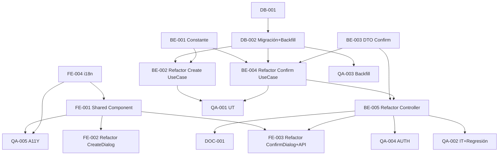

# Development Tasks — PB-P1-037 / US-063: BookingDisclaimer shared + audit

## 1. Metadata

| Field | Value |
|---|---|
| User Story ID | US-063 |
| Source User Story | `management/user-stories/US-063-booking-disclaimer-visible.md` |
| Source Technical Specification | `management/technical-specs/P1/PB-P1-037/US-063-technical-spec.md` |
| Decision Resolution Artifact | `management/user-stories/decision-resolutions/US-063-decision-resolution.md` |
| Priority | P1 |
| Backlog ID | PB-P1-037 |
| Backlog Title | Disclaimer visible + committed sincronizado |
| Backlog Execution Order | 63 |
| User Story Position in Backlog Item | 1 de 2 |
| Related User Stories in Backlog Item | US-063, US-064 |
| Epic | EPIC-CMP-001 |
| Backlog Item Dependencies | US-060, US-061 |
| Feature | Shared disclaimer component + audit + bilateral enforcement |
| Module / Domain | Booking / Compliance |
| Backlog Alignment Status | Found |
| Task Breakdown Status | Ready for Sprint Planning |
| Created Date | 2026-06-28 |
| Last Updated | 2026-06-28 |

---

## 2. Source Validation

| Source | Found | Used | Notes |
|---|---|---|---|
| User Story | Yes | Yes | Approved with Minor Notes. |
| Technical Specification | Yes | Yes | Ready for Task Breakdown. |
| Decision Resolution Artifact | Yes | Yes | 7/7 decisiones. |
| Product Backlog Prioritized | Yes | Yes | PB-P1-037. |

---

## 3. Backlog Execution Context

US-063 abre PB-P1-037. Execution order 63. US-064 cerrará.

---

## 4. Task Breakdown Summary

| Area | Count | Notes |
|---|---:|---|
| DB | 2 | Verify + migración con backfill |
| BE | 5 | Constante, refactor 2 UseCases, DTO, controller |
| FE | 4 | Shared component, refactor 2 dialogs, API+MSW, i18n |
| QA | 5 | UT, IT regresión, Backfill validation, AUTH, A11Y |
| DOC | 1 | `docs/16` + `docs/14` |
| **Total** | 17 | |

---

## 5. Traceability Matrix

| AC | Task IDs |
|---|---|
| AC-01 create + audit | TASK-PB-P1-037-US-063-BE-002, QA-002 |
| AC-02 confirm + audit | TASK-PB-P1-037-US-063-BE-003/004/005, QA-002 |
| AC-03 componente shared | TASK-PB-P1-037-US-063-FE-001, FE-002, FE-003 |
| AC-04 backfill | TASK-PB-P1-037-US-063-DB-002, QA-003 |
| EC-01..03 | TASK-PB-P1-037-US-063-BE-004/005, FE-001, QA-002 |
| AUTH | TASK-PB-P1-037-US-063-QA-004 |
| A11Y | TASK-PB-P1-037-US-063-FE-001, QA-005 |

---

## 6. Development Tasks

### TASK-PB-P1-037-US-063-DB-001 — Verificar schema booking_intents

| Field | Value |
|---|---|
| Area | Database / Prisma |
| Type | Review |
| Priority | Must |
| Estimate | XS |
| Depends On | PB-P0-001 |
| Source AC(s) | AC-01..AC-04 |
| Technical Spec Section(s) | §10 |
| Backlog ID | PB-P1-037 |
| User Story ID | US-063 |
| Owner Role | Backend |
| Status | To Do |

#### Definition of Done
- [ ] Pass.

---

### TASK-PB-P1-037-US-063-DB-002 — Migración audit fields + backfill

| Field | Value |
|---|---|
| Area | Database / Prisma |
| Type | Implementation |
| Priority | Must |
| Estimate | M |
| Depends On | DB-001 |
| Source AC(s) | AC-04 |
| Technical Spec Section(s) | §10 |
| Backlog ID | PB-P1-037 |
| User Story ID | US-063 |
| Owner Role | Backend |
| Status | To Do |

#### Objective
4 columnas nuevas + backfill desde `created_at`/`confirmed_at`.

#### Definition of Done
- [ ] Migración aplica.
- [ ] Backfill: 0 filas con `disclaimer_accepted_at_create` NULL.
- [ ] Backfill: `disclaimer_accepted_at_confirm` poblado solo en `confirmed_intent`.

---

### TASK-PB-P1-037-US-063-BE-001 — Constante `BOOKING_DISCLAIMER_COPY_VERSION`

| Field | Value |
|---|---|
| Area | Backend |
| Type | Implementation |
| Priority | Must |
| Estimate | XS |
| Depends On | - |
| Source AC(s) | D7 |
| Technical Spec Section(s) | §7 Constante |
| Backlog ID | PB-P1-037 |
| User Story ID | US-063 |
| Owner Role | Backend |
| Status | To Do |

#### Definition of Done
- [ ] Constante exportada.

---

### TASK-PB-P1-037-US-063-BE-002 — Refactor `CreateBookingIntentUseCase` con audit + log

| Field | Value |
|---|---|
| Area | Backend |
| Type | Refactor |
| Priority | Must |
| Estimate | S |
| Depends On | BE-001, DB-002 |
| Source AC(s) | AC-01 |
| Technical Spec Section(s) | §7 |
| Backlog ID | PB-P1-037 |
| User Story ID | US-063 |
| Owner Role | Backend |
| Status | To Do |

#### Definition of Done
- [ ] Audit persistido + log emitido.

---

### TASK-PB-P1-037-US-063-BE-003 — DTO `confirmBookingIntentBody` (nuevo)

| Field | Value |
|---|---|
| Area | Backend |
| Type | Implementation |
| Priority | Must |
| Estimate | XS |
| Depends On | - |
| Source AC(s) | AC-02, EC-02 |
| Technical Spec Section(s) | §7 |
| Backlog ID | PB-P1-037 |
| User Story ID | US-063 |
| Owner Role | Backend |
| Status | To Do |

#### Objective
`z.object({ disclaimer_accepted: z.literal(true) }).strict()`.

#### Definition of Done
- [ ] DTO + UT cubriendo bypass.

---

### TASK-PB-P1-037-US-063-BE-004 — Refactor `ConfirmBookingIntentUseCase` con audit + log

| Field | Value |
|---|---|
| Area | Backend |
| Type | Refactor |
| Priority | Must |
| Estimate | S |
| Depends On | BE-001, BE-003, DB-002 |
| Source AC(s) | AC-02 |
| Technical Spec Section(s) | §7 |
| Backlog ID | PB-P1-037 |
| User Story ID | US-063 |
| Owner Role | Backend |
| Status | To Do |

#### Definition of Done
- [ ] Audit persistido + log emitido.

---

### TASK-PB-P1-037-US-063-BE-005 — Refactor controller del confirm para parsear body

| Field | Value |
|---|---|
| Area | Backend / API |
| Type | Refactor |
| Priority | Must |
| Estimate | XS |
| Depends On | BE-003, BE-004 |
| Source AC(s) | AC-02, EC-02 |
| Technical Spec Section(s) | §7 |
| Backlog ID | PB-P1-037 |
| User Story ID | US-063 |
| Owner Role | Backend |
| Status | To Do |

#### Definition of Done
- [ ] Body parsed; bypass ⇒ 400.

---

### TASK-PB-P1-037-US-063-FE-001 — `BookingDisclaimer` shared component

| Field | Value |
|---|---|
| Area | Frontend |
| Type | Implementation |
| Priority | Must |
| Estimate | M |
| Depends On | FE-004 |
| Source AC(s) | AC-03, A11Y |
| Technical Spec Section(s) | §8 |
| Backlog ID | PB-P1-037 |
| User Story ID | US-063 |
| Owner Role | Frontend |
| Status | To Do |

#### Objective
Client Component reusable con checkbox, label, `aria-describedby`, version badge, onAcceptedChange callback.

#### Definition of Done
- [ ] axe sin issues.

---

### TASK-PB-P1-037-US-063-FE-002 — Refactor `CreateBookingDialog` (US-060) para consumir shared

| Field | Value |
|---|---|
| Area | Frontend |
| Type | Refactor |
| Priority | Must |
| Estimate | S |
| Depends On | FE-001 |
| Source AC(s) | AC-01, AC-03 |
| Technical Spec Section(s) | §8 |
| Backlog ID | PB-P1-037 |
| User Story ID | US-063 |
| Owner Role | Frontend |
| Status | To Do |

#### Definition of Done
- [ ] Reemplaza checkbox inline por shared component.

---

### TASK-PB-P1-037-US-063-FE-003 — Refactor `ConfirmBookingDialog` (US-061) + body API

| Field | Value |
|---|---|
| Area | Frontend |
| Type | Refactor |
| Priority | Must |
| Estimate | S |
| Depends On | FE-001, BE-005 |
| Source AC(s) | AC-02, AC-03 |
| Technical Spec Section(s) | §8 |
| Backlog ID | PB-P1-037 |
| User Story ID | US-063 |
| Owner Role | Frontend |
| Status | To Do |

#### Objective
Añadir disclaimer + actualizar `vendorApi.bookings.confirm` para enviar `{ disclaimer_accepted: true }`.

#### Definition of Done
- [ ] Dialog + API client actualizado + MSW.

---

### TASK-PB-P1-037-US-063-FE-004 — i18n `booking.disclaimer.v1.*` en 4 locales

| Field | Value |
|---|---|
| Area | Frontend / i18n |
| Type | Implementation |
| Priority | Must |
| Estimate | S |
| Depends On | - |
| Source AC(s) | i18n |
| Technical Spec Section(s) | §8 |
| Backlog ID | PB-P1-037 |
| User Story ID | US-063 |
| Owner Role | Frontend |
| Status | To Do |

#### Definition of Done
- [ ] 4 locales con copy v1.

---

### TASK-PB-P1-037-US-063-QA-001 — Unit tests (DTO + UseCase refactors)

| Field | Value |
|---|---|
| Area | QA |
| Type | Test |
| Priority | Must |
| Estimate | M |
| Depends On | BE-002, BE-004 |
| Source AC(s) | AC-01, AC-02 |
| Technical Spec Section(s) | §13 |
| Backlog ID | PB-P1-037 |
| User Story ID | US-063 |
| Owner Role | QA / Backend |
| Status | To Do |

#### Definition of Done
- [ ] Coverage ≥ 90%.

---

### TASK-PB-P1-037-US-063-QA-002 — Integration (audit + bilateral + regresión US-053..062)

| Field | Value |
|---|---|
| Area | QA |
| Type | Test |
| Priority | Must |
| Estimate | L |
| Depends On | BE-005 |
| Source AC(s) | AC-01..AC-02, EC-01..EC-03 |
| Technical Spec Section(s) | §13 |
| Backlog ID | PB-P1-037 |
| User Story ID | US-063 |
| Owner Role | QA |
| Status | To Do |

#### Objective
TS-01..TS-05. Verificar audit persistido + regresión US-053..062 sin breaks.

#### Definition of Done
- [ ] Regresión verde.

---

### TASK-PB-P1-037-US-063-QA-003 — Backfill validation

| Field | Value |
|---|---|
| Area | QA / DB |
| Type | Test |
| Priority | Must |
| Estimate | S |
| Depends On | DB-002 |
| Source AC(s) | AC-04 |
| Technical Spec Section(s) | §13 |
| Backlog ID | PB-P1-037 |
| User Story ID | US-063 |
| Owner Role | QA |
| Status | To Do |

#### Objective
Verificar: 0 nulls en `disclaimer_accepted_at_create`; `disclaimer_accepted_at_confirm` poblado solo en `confirmed_intent`.

#### Definition of Done
- [ ] Queries de validación pasan.

---

### TASK-PB-P1-037-US-063-QA-004 — Authorization (bilateral)

| Field | Value |
|---|---|
| Area | QA / Security |
| Type | Test |
| Priority | Must |
| Estimate | S |
| Depends On | BE-005 |
| Source AC(s) | AUTH |
| Technical Spec Section(s) | §12 |
| Backlog ID | PB-P1-037 |
| User Story ID | US-063 |
| Owner Role | QA |
| Status | To Do |

#### Objective
Bypass via API en confirm sin disclaimer_accepted ⇒ 400.

#### Definition of Done
- [ ] Server enforcement verificado.

---

### TASK-PB-P1-037-US-063-QA-005 — Accessibility (`BookingDisclaimer`)

| Field | Value |
|---|---|
| Area | QA / A11Y |
| Type | Test |
| Priority | Must |
| Estimate | S |
| Depends On | FE-001, FE-004 |
| Source AC(s) | A11Y |
| Technical Spec Section(s) | §13 |
| Backlog ID | PB-P1-037 |
| User Story ID | US-063 |
| Owner Role | QA / Frontend |
| Status | To Do |

#### Definition of Done
- [ ] axe + screen reader OK.

---

### TASK-PB-P1-037-US-063-DOC-001 — Documentar refactor body confirm + audit fields

| Field | Value |
|---|---|
| Area | Documentation |
| Type | Documentation |
| Priority | Must |
| Estimate | S |
| Depends On | BE-005 |
| Source AC(s) | AC-01..AC-02 |
| Technical Spec Section(s) | §16 |
| Backlog ID | PB-P1-037 |
| User Story ID | US-063 |
| Owner Role | Backend / Doc |
| Status | To Do |

#### Definition of Done
- [ ] `docs/16 §M07` + `docs/14` actualizados.

---

## 7. Required QA Tasks
Ver §6.

## 8. Required Security Tasks
| Task ID | Concern |
|---|---|
| TASK-PB-P1-037-US-063-QA-004 | Bypass server-side bloqueado |

## 9. Required Seed / Demo Tasks
`No aplica` (reuso seed; backfill cubre demo data existente).

## 10. Observability / Audit Tasks
| Task ID | Concern |
|---|---|
| TASK-PB-P1-037-US-063-BE-002 | Log `disclaimer.accepted action=create` |
| TASK-PB-P1-037-US-063-BE-004 | Log `disclaimer.accepted action=confirm` |

## 11. Documentation / Traceability Tasks
| Task ID | Doc |
|---|---|
| TASK-PB-P1-037-US-063-DOC-001 | `docs/16 §M07` + `docs/14` |

## 12. Dependency Graph

---

## 13. Suggested Implementation Order

**Phase 1 — Foundation**: DB-001, DB-002 migración+backfill, BE-001 constante, FE-004 i18n.
**Phase 2 — Core**: FE-001 Shared Component, BE-002 Refactor Create, BE-003 DTO Confirm, BE-004 Refactor Confirm, BE-005 Refactor Controller, FE-002 CreateDialog, FE-003 ConfirmDialog+API.
**Phase 3 — QA**: QA-001 UT, QA-002 IT+Regresión, QA-003 Backfill, QA-004 AUTH, QA-005 A11Y.
**Phase 4 — Doc**: DOC-001.

---

## 14. Risks & Mitigations
Ver §17 del Technical Spec.

## 15. Out of Scope Confirmation
Versionado dinámico, contratos, disclaimer en cancel.

## 16. Readiness for Sprint Planning

| Check | Status |
|---|---|
| Product Backlog mapping found | Pass |
| Every AC maps to tasks | Pass |
| Technical Spec used when available | Pass |
| QA tasks included | Pass |
| Security tasks included | Pass |
| Backfill plan tested | Pass |
| Observability tasks included | Pass |
| Documentation tasks included | Pass |
| Task dependencies clear | Pass |
| Ready for Sprint Planning | Yes |

---

## 17. Final Recommendation

`Ready for Sprint Planning`.

US-063 entrega 17 tareas: componente shared + audit fields + refactor bilateral (US-060/US-061) con paridad de enforcement server-side. QA-002 verifica regresión integral US-053..062; QA-003 valida backfill correcto; QA-004 verifica enforcement bilateral. US-064 cerrará PB-P1-037.
