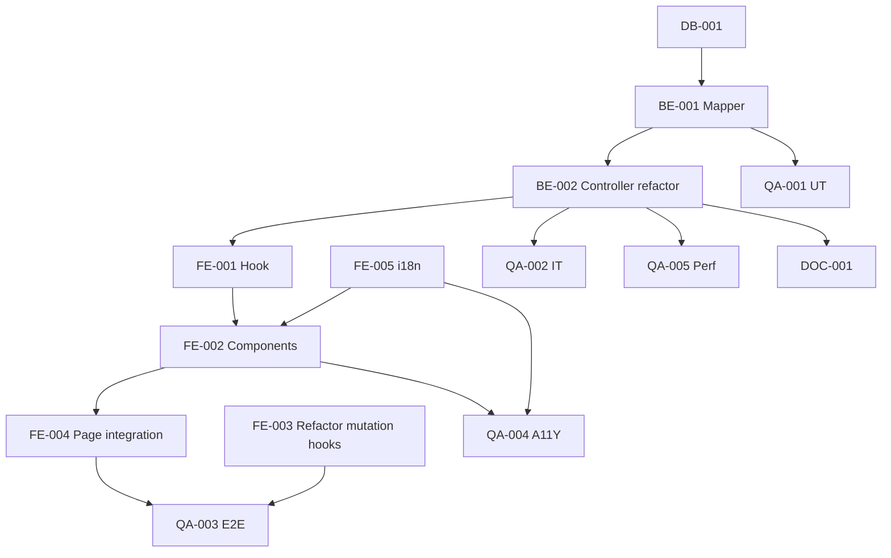

# Development Tasks — PB-P1-037 / US-064: BudgetSummary cross-domain refresh

## 1. Metadata

| Field | Value |
|---|---|
| User Story ID | US-064 |
| Source User Story | `management/user-stories/US-064-view-committed-updated-budget.md` |
| Source Technical Specification | `management/technical-specs/P1/PB-P1-037/US-064-technical-spec.md` |
| Decision Resolution Artifact | `management/user-stories/decision-resolutions/US-064-decision-resolution.md` |
| Priority | P1 |
| Backlog ID | PB-P1-037 |
| Backlog Title | Disclaimer visible + committed sincronizado |
| Backlog Execution Order | 64 |
| User Story Position in Backlog Item | 2 de 2 |
| Related User Stories in Backlog Item | US-063, US-064 |
| Epic | EPIC-CMP-001 |
| Backlog Item Dependencies | US-061, US-062, US-035..038 |
| Feature | Surface UI cross-domain + invalidation + warning + aria-live |
| Module / Domain | Budget / Booking |
| Backlog Alignment Status | Found |
| Task Breakdown Status | Ready for Sprint Planning |
| Created Date | 2026-06-28 |
| Last Updated | 2026-06-28 |

---

## 2. Source Validation

| Source | Found | Used | Notes |
|---|---|---|---|
| User Story | Yes | Yes | Approved with Minor Notes. |
| Technical Specification | Yes | Yes | Ready for Task Breakdown. |
| Decision Resolution Artifact | Yes | Yes | 6/6 decisiones. |
| Product Backlog Prioritized | Yes | Yes | PB-P1-037. |

---

## 3. Backlog Execution Context

US-064 cierra PB-P1-037 + EPIC-CMP-001. Execution order 64.

---

## 4. Task Breakdown Summary

| Area | Count | Notes |
|---|---:|---|
| DB | 1 | Verify endpoint base |
| BE | 2 | Mapper + refactor controller |
| FE | 5 | Hook, 4 sub-componentes, refactor hooks mutation, i18n |
| QA | 5 | UT, IT regresión, E2E, A11Y, Performance |
| DOC | 1 | `docs/16` + `docs/14` |
| **Total** | 14 | |

---

## 5. Traceability Matrix

| AC | Task IDs |
|---|---|
| AC-01 auto-refresh | TASK-PB-P1-037-US-064-FE-003, QA-003 |
| AC-02 visualización | TASK-PB-P1-037-US-064-BE-001, FE-002, QA-002 |
| AC-03 warning | TASK-PB-P1-037-US-064-FE-002, QA-003 |
| AC-04 aria-live | TASK-PB-P1-037-US-064-FE-002, QA-004 |
| AC-05 botón manual | TASK-PB-P1-037-US-064-FE-002 |
| EC-01..04 | TASK-PB-P1-037-US-064-FE-002, QA-003 |

---

## 6. Development Tasks

### TASK-PB-P1-037-US-064-DB-001 — Verificar endpoint Budget base

| Field | Value |
|---|---|
| Area | Database / Prisma |
| Type | Review |
| Priority | Must |
| Estimate | XS |
| Depends On | US-035..038 |
| Source AC(s) | AC-02 |
| Technical Spec Section(s) | §10 |
| Backlog ID | PB-P1-037 |
| User Story ID | US-064 |
| Owner Role | Backend |
| Status | To Do |

#### Objective
Verificar que `GET /events/:id/budget` y su use case existen.

#### Definition of Done
- [ ] Pass o issue abierto.

---

### TASK-PB-P1-037-US-064-BE-001 — Mapper `budget-summary.mapper`

| Field | Value |
|---|---|
| Area | Backend |
| Type | Implementation |
| Priority | Must |
| Estimate | S |
| Depends On | DB-001 |
| Source AC(s) | AC-02, AC-03 |
| Technical Spec Section(s) | §7 |
| Backlog ID | PB-P1-037 |
| User Story ID | US-064 |
| Owner Role | Backend |
| Status | To Do |

#### Objective
Mapper que produce `{totals, items[], currency_code, last_updated_at}` con flags `over_committed`, `auto_created`, `diff`.

#### Definition of Done
- [ ] Mapper + UT (totales, diff, flags, ordering).

---

### TASK-PB-P1-037-US-064-BE-002 — Refactor controller para usar mapper

| Field | Value |
|---|---|
| Area | Backend / API |
| Type | Refactor |
| Priority | Must |
| Estimate | XS |
| Depends On | BE-001 |
| Source AC(s) | AC-02 |
| Technical Spec Section(s) | §7 |
| Backlog ID | PB-P1-037 |
| User Story ID | US-064 |
| Owner Role | Backend |
| Status | To Do |

#### Objective
Endpoint existente retorna shape nueva.

#### Definition of Done
- [ ] Response shape extendida.

---

### TASK-PB-P1-037-US-064-FE-001 — Hook `useBudgetSummary`

| Field | Value |
|---|---|
| Area | Frontend |
| Type | Implementation |
| Priority | Must |
| Estimate | S |
| Depends On | BE-002 |
| Source AC(s) | AC-01, AC-02 |
| Technical Spec Section(s) | §8 |
| Backlog ID | PB-P1-037 |
| User Story ID | US-064 |
| Owner Role | Frontend |
| Status | To Do |

#### Objective
TanStack Query con queryKey `['budget.summary', eventId]`.

#### Definition of Done
- [ ] Hook + MSW.

---

### TASK-PB-P1-037-US-064-FE-002 — `BudgetSummary` + sub-componentes + warning + aria-live

| Field | Value |
|---|---|
| Area | Frontend |
| Type | Implementation |
| Priority | Must |
| Estimate | L |
| Depends On | FE-001, FE-005 |
| Source AC(s) | AC-02..AC-05, EC-01..EC-04 |
| Technical Spec Section(s) | §8 |
| Backlog ID | PB-P1-037 |
| User Story ID | US-064 |
| Owner Role | Frontend |
| Status | To Do |

#### Objective
`BudgetSummary` + `BudgetSummaryCard` + `BudgetItemRow` + `BudgetOverCommittedBanner` + `BudgetEmptyState` con aria-live y botón manual.

#### Definition of Done
- [ ] axe sin issues serios.
- [ ] Comparación previo/actual para anuncio aria-live.

---

### TASK-PB-P1-037-US-064-FE-003 — Refactor `useConfirmBooking` + `useCancelBooking` con invalidaciones

| Field | Value |
|---|---|
| Area | Frontend |
| Type | Refactor |
| Priority | Must |
| Estimate | S |
| Depends On | US-061 FE-002, US-062 FE-002 |
| Source AC(s) | AC-01, EC-01 |
| Technical Spec Section(s) | §8 |
| Backlog ID | PB-P1-037 |
| User Story ID | US-064 |
| Owner Role | Frontend |
| Status | To Do |

#### Objective
Añadir `invalidateQueries` para `['budget', eventId]`, `['budget.summary', eventId]`, `['event.dashboard', eventId]`.

#### Definition of Done
- [ ] Invalidaciones verificadas con test.

---

### TASK-PB-P1-037-US-064-FE-004 — Page integration: añadir `BudgetSummary` al budget page

| Field | Value |
|---|---|
| Area | Frontend |
| Type | Implementation |
| Priority | Must |
| Estimate | S |
| Depends On | FE-002 |
| Source AC(s) | AC-01..AC-05 |
| Technical Spec Section(s) | §8 |
| Backlog ID | PB-P1-037 |
| User Story ID | US-064 |
| Owner Role | Frontend |
| Status | To Do |

#### Definition of Done
- [ ] `app/[locale]/organizer/events/[id]/budget/page.tsx` renderiza `BudgetSummary`.

---

### TASK-PB-P1-037-US-064-FE-005 — i18n `organizer.budget.summary.*` (4 locales)

| Field | Value |
|---|---|
| Area | Frontend / i18n |
| Type | Implementation |
| Priority | Must |
| Estimate | S |
| Depends On | - |
| Source AC(s) | i18n |
| Technical Spec Section(s) | §8 |
| Backlog ID | PB-P1-037 |
| User Story ID | US-064 |
| Owner Role | Frontend |
| Status | To Do |

#### Definition of Done
- [ ] 4 locales completos.

---

### TASK-PB-P1-037-US-064-QA-001 — Unit tests (Mapper)

| Field | Value |
|---|---|
| Area | QA |
| Type | Test |
| Priority | Must |
| Estimate | S |
| Depends On | BE-001 |
| Source AC(s) | AC-02 |
| Technical Spec Section(s) | §13 |
| Backlog ID | PB-P1-037 |
| User Story ID | US-064 |
| Owner Role | QA / Backend |
| Status | To Do |

#### Definition of Done
- [ ] Coverage ≥ 90%.

---

### TASK-PB-P1-037-US-064-QA-002 — Integration (response + regresión US-035..038)

| Field | Value |
|---|---|
| Area | QA |
| Type | Test |
| Priority | Must |
| Estimate | M |
| Depends On | BE-002 |
| Source AC(s) | AC-02 |
| Technical Spec Section(s) | §13 |
| Backlog ID | PB-P1-037 |
| User Story ID | US-064 |
| Owner Role | QA |
| Status | To Do |

#### Definition of Done
- [ ] Regresión US-035..038 verde.

---

### TASK-PB-P1-037-US-064-QA-003 — E2E refresh + warning + cancel revert

| Field | Value |
|---|---|
| Area | QA |
| Type | Test |
| Priority | Must |
| Estimate | M |
| Depends On | FE-004 |
| Source AC(s) | AC-01..AC-03, EC-01 |
| Technical Spec Section(s) | §13 |
| Backlog ID | PB-P1-037 |
| User Story ID | US-064 |
| Owner Role | QA |
| Status | To Do |

#### Objective
Playwright: confirm ⇒ refresh ⇒ committed sube; cancel ⇒ refresh ⇒ committed baja; over_committed ⇒ banner.

#### Definition of Done
- [ ] Flujos E2E verdes.

---

### TASK-PB-P1-037-US-064-QA-004 — Accessibility (aria-live + alert + axe)

| Field | Value |
|---|---|
| Area | QA / A11Y |
| Type | Test |
| Priority | Must |
| Estimate | S |
| Depends On | FE-002, FE-005 |
| Source AC(s) | AC-03, AC-04 |
| Technical Spec Section(s) | §13 |
| Backlog ID | PB-P1-037 |
| User Story ID | US-064 |
| Owner Role | QA / Frontend |
| Status | To Do |

#### Definition of Done
- [ ] axe + screen reader verificados.

---

### TASK-PB-P1-037-US-064-QA-005 — Performance endpoint < 500ms p95

| Field | Value |
|---|---|
| Area | QA / Performance |
| Type | Test |
| Priority | Should |
| Estimate | S |
| Depends On | BE-002 |
| Source AC(s) | NFR-PERF-001 |
| Technical Spec Section(s) | §13 |
| Backlog ID | PB-P1-037 |
| User Story ID | US-064 |
| Owner Role | QA |
| Status | To Do |

#### Definition of Done
- [ ] p95 < 500ms.

---

### TASK-PB-P1-037-US-064-DOC-001 — Documentar response shape + cross-domain refresh

| Field | Value |
|---|---|
| Area | Documentation |
| Type | Documentation |
| Priority | Must |
| Estimate | S |
| Depends On | BE-002 |
| Source AC(s) | AC-02 |
| Technical Spec Section(s) | §16 |
| Backlog ID | PB-P1-037 |
| User Story ID | US-064 |
| Owner Role | Backend / Doc |
| Status | To Do |

#### Definition of Done
- [ ] `docs/16` + `docs/14` actualizados.

---

## 7. Required QA Tasks
Ver §6.

## 8. Required Security Tasks
N/A (sólo lectura + heredada del endpoint base).

## 9. Required Seed / Demo Tasks
`No aplica` (reuso). Verificar demo data muestra over_committed para demo.

## 10. Observability / Audit Tasks
N/A.

## 11. Documentation / Traceability Tasks
| Task ID | Doc |
|---|---|
| TASK-PB-P1-037-US-064-DOC-001 | `docs/16 §M07` + `docs/14` |

## 12. Dependency Graph

---

## 13. Suggested Implementation Order

**Phase 1**: DB-001, FE-005 i18n, BE-001 Mapper, BE-002 Controller refactor.
**Phase 2**: FE-001 Hook, FE-002 Components, FE-003 Refactor mutation hooks, FE-004 Page integration.
**Phase 3**: QA-001..QA-005.
**Phase 4**: DOC-001.

---

## 14. Risks & Mitigations
Ver §17 del Technical Spec.

## 15. Out of Scope Confirmation
WebSocket / realtime, endpoint nuevo, histórico.

## 16. Readiness for Sprint Planning

| Check | Status |
|---|---|
| Product Backlog mapping found | Pass |
| Every AC maps to tasks | Pass |
| Technical Spec used when available | Pass |
| QA tasks included | Pass |
| Security tasks included | N/A |
| Cross-module impact tested | Pass |
| Observability tasks included | N/A |
| Documentation tasks included | Pass |
| Task dependencies clear | Pass |
| Ready for Sprint Planning | Yes |

---

## 17. Final Recommendation

`Ready for Sprint Planning`.

US-064 entrega 14 tareas, cerrando PB-P1-037 + **EPIC-CMP-001 — Quote Comparison & Booking** (US-057/058 comparador+preferred, US-060/061/062 BookingIntent ciclo completo, US-063 disclaimer compliance, US-064 surface presupuesto). QA-002 verifica regresión US-035..038; QA-003 valida la cadena cross-domain Booking → Budget end-to-end.
