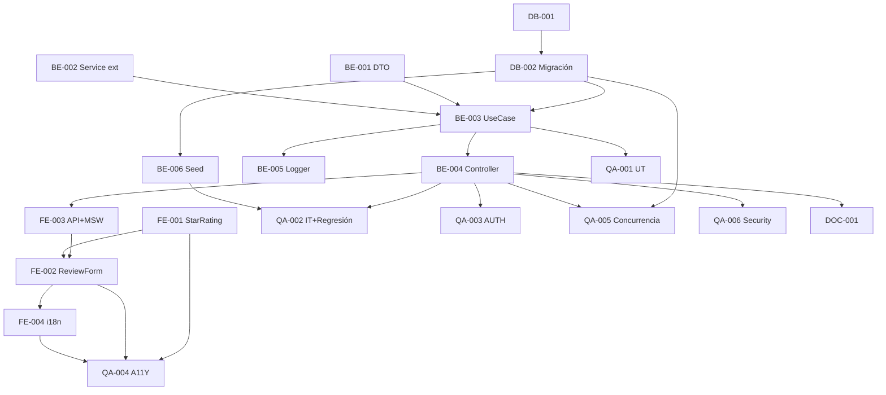

# Development Tasks — PB-P1-038 / US-065: Create Verified Review

## 1. Metadata

| Field | Value |
|---|---|
| User Story ID | US-065 |
| Source User Story | `management/user-stories/US-065-create-verified-review.md` |
| Source Technical Specification | `management/technical-specs/P1/PB-P1-038/US-065-technical-spec.md` |
| Decision Resolution Artifact | `management/user-stories/decision-resolutions/US-065-decision-resolution.md` |
| Priority | P1 |
| Backlog ID | PB-P1-038 |
| Backlog Title | Crear reseña verificada (1–5) |
| Backlog Execution Order | 65 |
| User Story Position in Backlog Item | 1 de 1 |
| Related User Stories in Backlog Item | US-065 |
| Epic | EPIC-REV-001 |
| Backlog Item Dependencies | US-061, US-015, US-049..064 |
| Feature | Endpoint review + denormalize atómico + notif vendor |
| Module / Domain | Reviews |
| Backlog Alignment Status | Found |
| Task Breakdown Status | Ready for Sprint Planning |
| Created Date | 2026-06-28 |
| Last Updated | 2026-06-28 |

---

## 2. Source Validation

| Source | Found | Used | Notes |
|---|---|---|---|
| User Story | Yes | Yes | Approved with Minor Notes. |
| Technical Specification | Yes | Yes | Ready for Task Breakdown. |
| Decision Resolution Artifact | Yes | Yes | 9/9 decisiones. |
| Product Backlog Prioritized | Yes | Yes | PB-P1-038. |

---

## 3. Backlog Execution Context

PB-P1-038 single-story. Abre EPIC-REV-001. Execution order 65.

---

## 4. Task Breakdown Summary

| Area | Count | Notes |
|---|---:|---|
| DB | 2 | Verify + migración UNIQUE + columnas denormalize |
| BE | 6 | DTO, service ext, UseCase, controller, logger, seed |
| FE | 4 | StarRating accesible, ReviewForm, EligibilityBanner, API+MSW, i18n |
| QA | 6 | UT, IT (denormalize + regresión), AUTH, A11Y, Concurrencia, Security |
| DOC | 1 | `docs/16` + `docs/14` |
| **Total** | 19 | |

---

## 5. Traceability Matrix

| AC | Task IDs |
|---|---|
| AC-01 crear + denormalize | TASK-PB-P1-038-US-065-BE-003, QA-002 |
| AC-02 comment opcional | TASK-PB-P1-038-US-065-BE-001/003, QA-002 |
| AC-03 unicidad | TASK-PB-P1-038-US-065-DB-002, BE-003, QA-005 |
| AC-04 inmutabilidad | Ausencia de endpoint PATCH (verificado en QA-006) |
| EC-01..07 | BE-003, QA-002 |
| AUTH-TS-01..06 | QA-003 |
| A11Y | FE-001, FE-002, QA-004 |
| i18n | FE-005 |
| Regresión service común | BE-002, QA-002 |

---

## 6. Development Tasks

### TASK-PB-P1-038-US-065-DB-001 — Verificar columnas reviews + vendor_profiles + events

| Field | Value |
|---|---|
| Area | Database / Prisma |
| Type | Review |
| Priority | Must |
| Estimate | XS |
| Depends On | PB-P0-001, US-015 |
| Source AC(s) | AC-01..AC-04 |
| Technical Spec Section(s) | §10 |
| Backlog ID | PB-P1-038 |
| User Story ID | US-065 |
| Owner Role | Backend |
| Status | To Do |

#### Objective
Verificar `events.completed_at`, `vendor_profiles.rating_avg/reviews_count`, `reviews.status`, UNIQUE.

#### Definition of Done
- [ ] Pass o issues identificados.

---

### TASK-PB-P1-038-US-065-DB-002 — Migración (si faltan): UNIQUE parcial + columnas

| Field | Value |
|---|---|
| Area | Database / Prisma |
| Type | Implementation |
| Priority | Must |
| Estimate | M |
| Depends On | DB-001 |
| Source AC(s) | AC-03, AC-01 |
| Technical Spec Section(s) | §10 |
| Backlog ID | PB-P1-038 |
| User Story ID | US-065 |
| Owner Role | Backend |
| Status | To Do |

#### Objective
Añadir columnas + UNIQUE parcial `(event_id, vendor_profile_id) WHERE status != 'deleted'` + index `(vendor_profile_id, status)`.

#### Definition of Done
- [ ] Migración aplica.
- [ ] UNIQUE enforced.

---

### TASK-PB-P1-038-US-065-BE-001 — DTO `createReviewBody`

| Field | Value |
|---|---|
| Area | Backend |
| Type | Implementation |
| Priority | Must |
| Estimate | XS |
| Depends On | - |
| Source AC(s) | EC-04, EC-05 |
| Technical Spec Section(s) | §7 DTOs |
| Backlog ID | PB-P1-038 |
| User Story ID | US-065 |
| Owner Role | Backend |
| Status | To Do |

#### Definition of Done
- [ ] Zod `.strict()` + UT (rating int 1..5, comment max 2000, sin campos extra).

---

### TASK-PB-P1-038-US-065-BE-002 — Extender `QuoteEventNotificationService` con `review.published`

| Field | Value |
|---|---|
| Area | Backend |
| Type | Refactor |
| Priority | Must |
| Estimate | XS |
| Depends On | US-062 BE-002 |
| Source AC(s) | AC-01 |
| Technical Spec Section(s) | §7 Service |
| Backlog ID | PB-P1-038 |
| User Story ID | US-065 |
| Owner Role | Backend |
| Status | To Do |

#### Definition of Done
- [ ] Type extendido a 9 eventos.
- [ ] UT cubre todos los eventos.

---

### TASK-PB-P1-038-US-065-BE-003 — `CreateReviewUseCase` con denormalize atómico

| Field | Value |
|---|---|
| Area | Backend |
| Type | Implementation |
| Priority | Must |
| Estimate | L |
| Depends On | BE-001, BE-002, DB-002 |
| Source AC(s) | AC-01..AC-04, EC-01..EC-07 |
| Technical Spec Section(s) | §7 UseCase |
| Backlog ID | PB-P1-038 |
| User Story ID | US-065 |
| Owner Role | Backend |
| Status | To Do |

#### Definition of Done
- [ ] Coverage ≥ 90%.
- [ ] Branches: 4 razones de elegibilidad, comment null, denormalize correcto.

---

### TASK-PB-P1-038-US-065-BE-004 — Controller + ruta `POST /organizer/reviews`

| Field | Value |
|---|---|
| Area | Backend / API |
| Type | Implementation |
| Priority | Must |
| Estimate | S |
| Depends On | BE-003 |
| Source AC(s) | AC-01 |
| Technical Spec Section(s) | §7 |
| Backlog ID | PB-P1-038 |
| User Story ID | US-065 |
| Owner Role | Backend |
| Status | To Do |

#### Definition of Done
- [ ] Ruta operativa con guards.

---

### TASK-PB-P1-038-US-065-BE-005 — Logger `review.published`

| Field | Value |
|---|---|
| Area | Backend / Observability |
| Type | Implementation |
| Priority | Must |
| Estimate | XS |
| Depends On | BE-003 |
| Source AC(s) | AC-01 |
| Technical Spec Section(s) | §14 |
| Backlog ID | PB-P1-038 |
| User Story ID | US-065 |
| Owner Role | Backend |
| Status | To Do |

#### Definition of Done
- [ ] Evento emitido con 5 campos.

---

### TASK-PB-P1-038-US-065-BE-006 — Seed reviews respetando BR-SEED-007

| Field | Value |
|---|---|
| Area | Backend / Seed |
| Type | Implementation |
| Priority | Must |
| Estimate | S |
| Depends On | DB-002 |
| Source AC(s) | AC-01 |
| Technical Spec Section(s) | §15 |
| Backlog ID | PB-P1-038 |
| User Story ID | US-065 |
| Owner Role | Backend |
| Status | To Do |

#### Objective
Reviews seed asociadas a BookingIntent confirmed_intent existente + eventos completed dentro de ventana.

#### Definition of Done
- [ ] Seed reproducible con denormalize correcto.

---

### TASK-PB-P1-038-US-065-FE-001 — `StarRating` accesible

| Field | Value |
|---|---|
| Area | Frontend |
| Type | Implementation |
| Priority | Must |
| Estimate | M |
| Depends On | - |
| Source AC(s) | A11Y |
| Technical Spec Section(s) | §8 |
| Backlog ID | PB-P1-038 |
| User Story ID | US-065 |
| Owner Role | Frontend |
| Status | To Do |

#### Objective
`
` con 5 buttons `role="radio"` + navegación con flechas + `aria-valuenow`.

#### Definition of Done
- [ ] axe sin issues.
- [ ] Keyboard navegable.

---

### TASK-PB-P1-038-US-065-FE-002 — `ReviewForm` + `ReviewEligibilityBanner`

| Field | Value |
|---|---|
| Area | Frontend |
| Type | Implementation |
| Priority | Must |
| Estimate | M |
| Depends On | FE-001, FE-003 |
| Source AC(s) | AC-01..AC-03, EC-01..EC-07 |
| Technical Spec Section(s) | §8 |
| Backlog ID | PB-P1-038 |
| User Story ID | US-065 |
| Owner Role | Frontend |
| Status | To Do |

#### Definition of Done
- [ ] RHF + Zod alineado backend.
- [ ] Banner consume `error.details.reason`.

---

### TASK-PB-P1-038-US-065-FE-003 — `organizerApi.reviews.create` + MSW

| Field | Value |
|---|---|
| Area | Frontend |
| Type | Implementation |
| Priority | Must |
| Estimate | S |
| Depends On | BE-004 |
| Source AC(s) | AC-01 |
| Technical Spec Section(s) | §8 |
| Backlog ID | PB-P1-038 |
| User Story ID | US-065 |
| Owner Role | Frontend |
| Status | To Do |

#### Definition of Done
- [ ] MSW handlers `201/400/401/403/403 NOT_ELIGIBLE (4 razones)/404`.

---

### TASK-PB-P1-038-US-065-FE-004 — i18n `organizer.review.*` + eligibility (4 razones) en 4 locales

| Field | Value |
|---|---|
| Area | Frontend / i18n |
| Type | Implementation |
| Priority | Must |
| Estimate | S |
| Depends On | FE-002 |
| Source AC(s) | i18n |
| Technical Spec Section(s) | §8 |
| Backlog ID | PB-P1-038 |
| User Story ID | US-065 |
| Owner Role | Frontend |
| Status | To Do |

#### Definition of Done
- [ ] 4 locales con 4 razones.

---

### TASK-PB-P1-038-US-065-QA-001 — Unit tests (DTO + UseCase branches)

| Field | Value |
|---|---|
| Area | QA |
| Type | Test |
| Priority | Must |
| Estimate | M |
| Depends On | BE-003 |
| Source AC(s) | EC-01..EC-07 |
| Technical Spec Section(s) | §13 |
| Backlog ID | PB-P1-038 |
| User Story ID | US-065 |
| Owner Role | QA / Backend |
| Status | To Do |

#### Definition of Done
- [ ] Coverage ≥ 90%.
- [ ] 4 razones de elegibilidad cubiertas.

---

### TASK-PB-P1-038-US-065-QA-002 — Integration (denormalize + regresión US-053..064)

| Field | Value |
|---|---|
| Area | QA |
| Type | Test |
| Priority | Must |
| Estimate | L |
| Depends On | BE-004, BE-006 |
| Source AC(s) | AC-01..AC-04 |
| Technical Spec Section(s) | §13 |
| Backlog ID | PB-P1-038 |
| User Story ID | US-065 |
| Owner Role | QA |
| Status | To Do |

#### Objective
TS-01..TS-04 + regresión integral de 8 eventos previos del service común.

#### Definition of Done
- [ ] `rating_avg`/`reviews_count` correctos en VendorProfile.
- [ ] Regresión verde.

---

### TASK-PB-P1-038-US-065-QA-003 — Authorization tests

| Field | Value |
|---|---|
| Area | QA / Security |
| Type | Test |
| Priority | Must |
| Estimate | S |
| Depends On | BE-004 |
| Source AC(s) | AUTH-TS-01..06 |
| Technical Spec Section(s) | §12 |
| Backlog ID | PB-P1-038 |
| User Story ID | US-065 |
| Owner Role | QA |
| Status | To Do |

#### Definition of Done
- [ ] `404 NOT_FOUND` uniforme.
- [ ] `403 NOT_ELIGIBLE` con razones específicas.

---

### TASK-PB-P1-038-US-065-QA-004 — Accessibility (StarRating + form)

| Field | Value |
|---|---|
| Area | QA / A11Y |
| Type | Test |
| Priority | Must |
| Estimate | S |
| Depends On | FE-001, FE-002, FE-004 |
| Source AC(s) | A11Y |
| Technical Spec Section(s) | §13 |
| Backlog ID | PB-P1-038 |
| User Story ID | US-065 |
| Owner Role | QA / Frontend |
| Status | To Do |

#### Definition of Done
- [ ] axe sin issues serios.
- [ ] Screen reader announces star changes.

---

### TASK-PB-P1-038-US-065-QA-005 — Concurrencia (UNIQUE parcial)

| Field | Value |
|---|---|
| Area | QA |
| Type | Test |
| Priority | Must |
| Estimate | S |
| Depends On | DB-002, BE-004 |
| Source AC(s) | AC-03 |
| Technical Spec Section(s) | §17 |
| Backlog ID | PB-P1-038 |
| User Story ID | US-065 |
| Owner Role | QA |
| Status | To Do |

#### Objective
2 POST simultáneos: uno gana (`201`), otro `403 NOT_ELIGIBLE` reason='already_reviewed'.

#### Definition of Done
- [ ] UNIQUE parcial enforced.

---

### TASK-PB-P1-038-US-065-QA-006 — Security: no editable + uniformidad 404

| Field | Value |
|---|---|
| Area | QA / Security |
| Type | Test |
| Priority | Must |
| Estimate | S |
| Depends On | BE-004 |
| Source AC(s) | AC-04, AUTH |
| Technical Spec Section(s) | §13 |
| Backlog ID | PB-P1-038 |
| User Story ID | US-065 |
| Owner Role | QA / Security |
| Status | To Do |

#### Objective
Verificar que no existen endpoints `PATCH /reviews/:id` ni `DELETE /reviews/:id` (FR-REVIEW-007). Verificar `404 NOT_FOUND` uniforme.

#### Definition of Done
- [ ] Endpoints prohibidos no existen.
- [ ] 404 uniforme.

---

### TASK-PB-P1-038-US-065-DOC-001 — Documentar endpoint + nuevo módulo Reviews

| Field | Value |
|---|---|
| Area | Documentation |
| Type | Documentation |
| Priority | Must |
| Estimate | S |
| Depends On | BE-004 |
| Source AC(s) | AC-01 |
| Technical Spec Section(s) | §16 |
| Backlog ID | PB-P1-038 |
| User Story ID | US-065 |
| Owner Role | Backend / Doc |
| Status | To Do |

#### Definition of Done
- [ ] `docs/16 §M07` + `docs/14` actualizados.

---

## 7. Required QA Tasks
Ver §6.

## 8. Required Security Tasks
| Task ID | Concern |
|---|---|
| TASK-PB-P1-038-US-065-QA-003 | Uniformidad 404 + 403 NOT_ELIGIBLE |
| TASK-PB-P1-038-US-065-QA-005 | UNIQUE race |
| TASK-PB-P1-038-US-065-QA-006 | FR-REVIEW-007 (no editable) |

## 9. Required Seed / Demo Tasks
| Task ID | Concern |
|---|---|
| TASK-PB-P1-038-US-065-BE-006 | Reviews seed respetando BR-SEED-007 |

## 10. Observability / Audit Tasks
| Task ID | Concern |
|---|---|
| TASK-PB-P1-038-US-065-BE-005 | Log `review.published` |

## 11. Documentation / Traceability Tasks
| Task ID | Doc |
|---|---|
| TASK-PB-P1-038-US-065-DOC-001 | `docs/16 §M07` + `docs/14` |

## 12. Dependency Graph

---

## 13. Suggested Implementation Order

**Phase 1**: DB-001, DB-002, BE-001 DTO, BE-002 Service ext.
**Phase 2**: BE-003 UseCase, BE-004 Controller, BE-005 Logger, BE-006 Seed, FE-001 StarRating, FE-003 API+MSW, FE-002 ReviewForm, FE-004 i18n.
**Phase 3**: QA-001..QA-006.
**Phase 4**: DOC-001.

---

## 14. Risks & Mitigations
Ver §17 del Technical Spec.

## 15. Out of Scope Confirmation
Edición, respuesta vendor, moderación, reseñas anónimas/media.

## 16. Readiness for Sprint Planning

| Check | Status |
|---|---|
| Product Backlog mapping found | Pass |
| Every AC maps to tasks | Pass |
| Technical Spec used when available | Pass |
| QA tasks included | Pass |
| Security tasks included | Pass |
| Seed tasks included | Pass |
| Observability tasks included | Pass |
| Documentation tasks included | Pass |
| Task dependencies clear | Pass |
| Ready for Sprint Planning | Yes |

---

## 17. Final Recommendation

`Ready for Sprint Planning`.

US-065 entrega 19 tareas: endpoint atómico + denormalize cross-domain (Review → Vendor) + UNIQUE parcial + service común extendido a 9 eventos + `StarRating` accesible reusable. Cierra el ciclo demo MVP (organizer → vendor → booking → review). QA-002 verifica regresión integral US-053..064; QA-005 valida UNIQUE; QA-006 valida FR-REVIEW-007. US-066/067 cerrarán EPIC-REV-001 con moderación.
