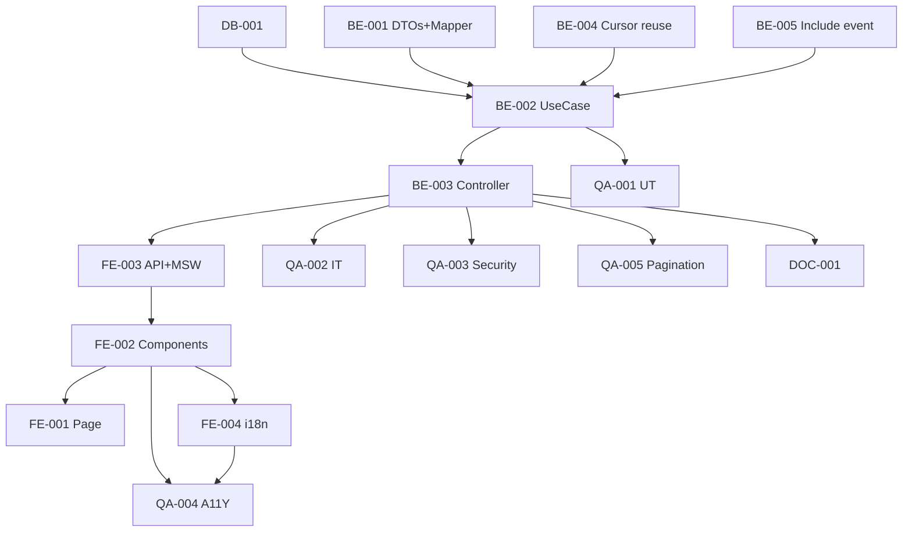

# Development Tasks — PB-P1-039 / US-066: List Vendor Reviews

## 1. Metadata

| Field | Value |
|---|---|
| User Story ID | US-066 |
| Source User Story | `management/user-stories/US-066-view-reviews-on-vendor-profile.md` |
| Source Technical Specification | `management/technical-specs/P1/PB-P1-039/US-066-technical-spec.md` |
| Decision Resolution Artifact | `management/user-stories/decision-resolutions/US-066-decision-resolution.md` |
| Priority | P1 |
| Backlog ID | PB-P1-039 |
| Backlog Title | Visualización de reseñas en perfil vendor |
| Backlog Execution Order | 66 |
| User Story Position in Backlog Item | 1 de 1 |
| Related User Stories in Backlog Item | US-066 |
| Epic | EPIC-REV-001 |
| Backlog Item Dependencies | US-065, US-045 |
| Feature | Endpoint público reviews + cursor pagination + anonimato |
| Module / Domain | Reviews / Vendor |
| Backlog Alignment Status | Found |
| Task Breakdown Status | Ready for Sprint Planning |
| Created Date | 2026-06-28 |
| Last Updated | 2026-06-28 |

---

## 2. Source Validation

| Source | Found | Used | Notes |
|---|---|---|---|
| User Story | Yes | Yes | Approved with Minor Notes. |
| Technical Specification | Yes | Yes | Ready for Task Breakdown. |
| Decision Resolution Artifact | Yes | Yes | 7/7 decisiones. |
| Product Backlog Prioritized | Yes | Yes | PB-P1-039. |

---

## 3. Backlog Execution Context

PB-P1-039 single-story. Execution order 66.

---

## 4. Task Breakdown Summary

| Area | Count | Notes |
|---|---:|---|
| DB | 1 | Verify index parcial |
| BE | 5 | DTO, Mapper, UseCase, Controller, Cursor reuse |
| FE | 4 | Page, ReviewList+AverageRating+ListItem, API+MSW, i18n |
| QA | 5 | UT, IT, AUTH/Anonimato, A11Y, Pagination |
| DOC | 1 | `docs/16 §M07` |
| **Total** | 16 | |

---

## 5. Traceability Matrix

| AC | Task IDs |
|---|---|
| AC-01 lista + summary | BE-002, FE-002 |
| AC-02 cursor | BE-002, QA-005 |
| AC-03 anonimato | BE-001 Mapper, QA-003 |
| AC-04 exclusión hidden/deleted | BE-002, QA-002 |
| AC-05 admin sees all | BE-002, QA-002 |
| EC-01..05 | BE-001/002, QA-002 |
| AUTH | QA-003 |
| A11Y | FE-002, QA-004 |

---

## 6. Development Tasks

### TASK-PB-P1-039-US-066-DB-001 — Verificar index parcial reviews

| Field | Value |
|---|---|
| Area | Database / Prisma |
| Type | Review |
| Priority | Must |
| Estimate | XS |
| Depends On | PB-P0-001, US-065 DB |
| Source AC(s) | NFR-PERF-001 |
| Technical Spec Section(s) | §10 |
| Backlog ID | PB-P1-039 |
| User Story ID | US-066 |
| Owner Role | Backend |
| Status | To Do |

#### Objective
Verificar/crear `idx_reviews_vendor_published_created` parcial.

#### Definition of Done
- [ ] Pass o migración menor abierta.

---

### TASK-PB-P1-039-US-066-BE-001 — DTOs + Mapper anonimizado

| Field | Value |
|---|---|
| Area | Backend |
| Type | Implementation |
| Priority | Must |
| Estimate | S |
| Depends On | - |
| Source AC(s) | AC-03, EC-03..05 |
| Technical Spec Section(s) | §7 |
| Backlog ID | PB-P1-039 |
| User Story ID | US-066 |
| Owner Role | Backend |
| Status | To Do |

#### Objective
Zod query DTO + mapper que omite PII.

#### Definition of Done
- [ ] UT cubre anonimato + validación cursor/pageSize.

---

### TASK-PB-P1-039-US-066-BE-002 — `GetVendorReviewsUseCase` con cursor + admin override

| Field | Value |
|---|---|
| Area | Backend |
| Type | Implementation |
| Priority | Must |
| Estimate | M |
| Depends On | BE-001, DB-001 |
| Source AC(s) | AC-01..AC-05, EC-01..EC-02 |
| Technical Spec Section(s) | §7 |
| Backlog ID | PB-P1-039 |
| User Story ID | US-066 |
| Owner Role | Backend |
| Status | To Do |

#### Definition of Done
- [ ] Coverage ≥ 90%.
- [ ] Branches: admin vs no, vendor approved vs no, cursor presente vs no.

---

### TASK-PB-P1-039-US-066-BE-003 — Controller + ruta

| Field | Value |
|---|---|
| Area | Backend / API |
| Type | Implementation |
| Priority | Must |
| Estimate | S |
| Depends On | BE-002 |
| Source AC(s) | AC-01 |
| Technical Spec Section(s) | §7 |
| Backlog ID | PB-P1-039 |
| User Story ID | US-066 |
| Owner Role | Backend |
| Status | To Do |

#### Definition of Done
- [ ] Ruta pública con `optionalAuthGuard`.

---

### TASK-PB-P1-039-US-066-BE-004 — Reuso de cursor utility (US-045)

| Field | Value |
|---|---|
| Area | Backend |
| Type | Refactor |
| Priority | Must |
| Estimate | XS |
| Depends On | US-045 |
| Source AC(s) | AC-02 |
| Technical Spec Section(s) | §7 |
| Backlog ID | PB-P1-039 |
| User Story ID | US-066 |
| Owner Role | Backend |
| Status | To Do |

#### Objective
Verificar reuso de `encodeCursor`/`decodeCursor` shared.

#### Definition of Done
- [ ] Import correcto sin duplicación.

---

### TASK-PB-P1-039-US-066-BE-005 — Include event.title sin N+1

| Field | Value |
|---|---|
| Area | Backend |
| Type | Implementation |
| Priority | Must |
| Estimate | XS |
| Depends On | BE-002 |
| Source AC(s) | AC-03 |
| Technical Spec Section(s) | §7 |
| Backlog ID | PB-P1-039 |
| User Story ID | US-066 |
| Owner Role | Backend |
| Status | To Do |

#### Definition of Done
- [ ] Prisma include eficiente.

---

### TASK-PB-P1-039-US-066-FE-001 — Page integration en perfil vendor

| Field | Value |
|---|---|
| Area | Frontend |
| Type | Implementation |
| Priority | Must |
| Estimate | S |
| Depends On | FE-002 |
| Source AC(s) | AC-01 |
| Technical Spec Section(s) | §8 |
| Backlog ID | PB-P1-039 |
| User Story ID | US-066 |
| Owner Role | Frontend |
| Status | To Do |

#### Definition of Done
- [ ] Page renderiza ReviewList.

---

### TASK-PB-P1-039-US-066-FE-002 — `ReviewList` + `AverageRating` + `ReviewListItem` + LoadMore

| Field | Value |
|---|---|
| Area | Frontend |
| Type | Implementation |
| Priority | Must |
| Estimate | M |
| Depends On | FE-003 |
| Source AC(s) | AC-01, AC-02, EC-01, A11Y |
| Technical Spec Section(s) | §8 |
| Backlog ID | PB-P1-039 |
| User Story ID | US-066 |
| Owner Role | Frontend |
| Status | To Do |

#### Objective
useInfiniteQuery + cards accesibles + empty state.

#### Definition of Done
- [ ] axe sin issues serios.

---

### TASK-PB-P1-039-US-066-FE-003 — `vendorsApi.reviews` + MSW

| Field | Value |
|---|---|
| Area | Frontend |
| Type | Implementation |
| Priority | Must |
| Estimate | S |
| Depends On | BE-003 |
| Source AC(s) | AC-01 |
| Technical Spec Section(s) | §8 |
| Backlog ID | PB-P1-039 |
| User Story ID | US-066 |
| Owner Role | Frontend |
| Status | To Do |

#### Definition of Done
- [ ] MSW `200/400/404`.

---

### TASK-PB-P1-039-US-066-FE-004 — i18n `vendor.profile.reviews.*` (4 locales)

| Field | Value |
|---|---|
| Area | Frontend / i18n |
| Type | Implementation |
| Priority | Must |
| Estimate | S |
| Depends On | FE-002 |
| Source AC(s) | i18n |
| Technical Spec Section(s) | §8 |
| Backlog ID | PB-P1-039 |
| User Story ID | US-066 |
| Owner Role | Frontend |
| Status | To Do |

#### Definition of Done
- [ ] 4 locales completos.

---

### TASK-PB-P1-039-US-066-QA-001 — UT (DTOs + Mapper + UseCase)

| Field | Value |
|---|---|
| Area | QA |
| Type | Test |
| Priority | Must |
| Estimate | M |
| Depends On | BE-002 |
| Source AC(s) | Múltiples |
| Technical Spec Section(s) | §13 |
| Backlog ID | PB-P1-039 |
| User Story ID | US-066 |
| Owner Role | QA / Backend |
| Status | To Do |

#### Definition of Done
- [ ] Coverage ≥ 90%.

---

### TASK-PB-P1-039-US-066-QA-002 — IT (paginación + admin vs no + exclusión)

| Field | Value |
|---|---|
| Area | QA |
| Type | Test |
| Priority | Must |
| Estimate | M |
| Depends On | BE-003 |
| Source AC(s) | AC-01..AC-05 |
| Technical Spec Section(s) | §13 |
| Backlog ID | PB-P1-039 |
| User Story ID | US-066 |
| Owner Role | QA |
| Status | To Do |

#### Definition of Done
- [ ] 5 escenarios cubiertos.

---

### TASK-PB-P1-039-US-066-QA-003 — Security: anonimato + 404 uniforme

| Field | Value |
|---|---|
| Area | QA / Security |
| Type | Test |
| Priority | Must |
| Estimate | S |
| Depends On | BE-003 |
| Source AC(s) | AC-03, AUTH |
| Technical Spec Section(s) | §12 |
| Backlog ID | PB-P1-039 |
| User Story ID | US-066 |
| Owner Role | QA |
| Status | To Do |

#### Objective
Assert que response NO contiene `author_user_id`, `event_id`, `organizer_business_name`. Verificar 404 uniforme.

#### Definition of Done
- [ ] Anonimato verificado.
- [ ] 404 uniforme.

---

### TASK-PB-P1-039-US-066-QA-004 — Accessibility (lista + StarRating)

| Field | Value |
|---|---|
| Area | QA / A11Y |
| Type | Test |
| Priority | Must |
| Estimate | S |
| Depends On | FE-002, FE-004 |
| Source AC(s) | A11Y |
| Technical Spec Section(s) | §13 |
| Backlog ID | PB-P1-039 |
| User Story ID | US-066 |
| Owner Role | QA / Frontend |
| Status | To Do |

#### Definition of Done
- [ ] axe sin issues serios.

---

### TASK-PB-P1-039-US-066-QA-005 — Pagination correctness

| Field | Value |
|---|---|
| Area | QA |
| Type | Test |
| Priority | Must |
| Estimate | S |
| Depends On | BE-003 |
| Source AC(s) | AC-02 |
| Technical Spec Section(s) | §13 |
| Backlog ID | PB-P1-039 |
| User Story ID | US-066 |
| Owner Role | QA |
| Status | To Do |

#### Objective
25 reviews ⇒ 2 páginas (20+5); next_cursor null en segunda; sin duplicados.

#### Definition of Done
- [ ] Pagination determinística.

---

### TASK-PB-P1-039-US-066-DOC-001 — Documentar endpoint en `docs/16 §M07`

| Field | Value |
|---|---|
| Area | Documentation |
| Type | Documentation |
| Priority | Must |
| Estimate | S |
| Depends On | BE-003 |
| Source AC(s) | AC-01 |
| Technical Spec Section(s) | §16 |
| Backlog ID | PB-P1-039 |
| User Story ID | US-066 |
| Owner Role | Backend / Doc |
| Status | To Do |

#### Definition of Done
- [ ] Documentado.

---

## 7. Required QA Tasks
Ver §6.

## 8. Required Security Tasks
| Task ID | Concern |
|---|---|
| TASK-PB-P1-039-US-066-QA-003 | Anonimato + 404 uniforme |

## 9. Required Seed / Demo Tasks
`No aplica` (reuso US-065).

## 10. Observability / Audit Tasks
N/A.

## 11. Documentation / Traceability Tasks
| Task ID | Doc |
|---|---|
| TASK-PB-P1-039-US-066-DOC-001 | `docs/16 §M07` |

## 12. Dependency Graph

---

## 13. Suggested Implementation Order

**Phase 1**: DB-001, BE-001 DTOs+Mapper, BE-004 Cursor.
**Phase 2**: BE-002 UseCase, BE-005 include, BE-003 Controller, FE-003 API+MSW, FE-002 Components, FE-001 Page, FE-004 i18n.
**Phase 3**: QA-001..QA-005.
**Phase 4**: DOC-001.

---

## 14. Risks & Mitigations
Ver §17 del Technical Spec.

## 15. Out of Scope Confirmation
Filtros avanzados, búsqueda, exports.

## 16. Readiness for Sprint Planning

| Check | Status |
|---|---|
| Product Backlog mapping found | Pass |
| Every AC maps to tasks | Pass |
| Technical Spec used when available | Pass |
| QA tasks included | Pass |
| Security tasks included | Pass |
| Documentation tasks included | Pass |
| Task dependencies clear | Pass |
| Ready for Sprint Planning | Yes |

---

## 17. Final Recommendation

`Ready for Sprint Planning`.

US-066 entrega 16 tareas: endpoint público de listado de reviews con cursor pagination + anonimato organizer + admin sees-all. QA-003 valida explícitamente que la response NO contiene PII.
