# Development Tasks — PB-P1-040 / US-067: Admin moderate review

## 1. Metadata

| Field | Value |
|---|---|
| User Story ID | US-067 |
| Source User Story | `management/user-stories/US-067-admin-moderate-review.md` |
| Source Technical Specification | `management/technical-specs/P1/PB-P1-040/US-067-technical-spec.md` |
| Decision Resolution Artifact | `management/user-stories/decision-resolutions/US-067-decision-resolution.md` |
| Priority | P1 |
| Backlog ID | PB-P1-040 |
| Backlog Title | Moderación admin de reseñas (soft delete) |
| Backlog Execution Order | 67 |
| User Story Position in Backlog Item | 1 de 2 |
| Related User Stories in Backlog Item | US-067, US-077 |
| Epic | EPIC-REV-001 |
| Backlog Item Dependencies | US-065 |
| Feature | Endpoint admin moderate + AdminAction + denormalize |
| Module / Domain | Reviews / Admin |
| Backlog Alignment Status | Found |
| Task Breakdown Status | Ready for Sprint Planning |
| Created Date | 2026-06-28 |
| Last Updated | 2026-06-28 |

---

## 2. Source Validation

| Source | Found | Used | Notes |
|---|---|---|---|
| User Story | Yes | Yes | Approved with Minor Notes. |
| Technical Specification | Yes | Yes | Ready for Task Breakdown. |
| Decision Resolution Artifact | Yes | Yes | 9/9 decisiones. |
| Product Backlog Prioritized | Yes | Yes | PB-P1-040. |

---

## 3. Backlog Execution Context

PB-P1-040 multi-story. US-067 abre. Execution order 67.

---

## 4. Task Breakdown Summary

| Area | Count | Notes |
|---|---:|---|
| DB | 2 | Verify + migración 4 columnas audit |
| BE | 6 | DTO, UseCase, Controller, AdminGuard, Logger, Seed |
| FE | 4 | ModerationTable, ModerationDialog, API+MSW, i18n |
| QA | 6 | UT, IT (denormalize + regresión), AUTH, A11Y, Concurrencia, Security |
| DOC | 1 | `docs/16` + `docs/14` |
| **Total** | 19 | |

---

## 5. Traceability Matrix

| AC | Task IDs |
|---|---|
| AC-01 hide | BE-003, QA-002 |
| AC-02 remove | BE-003, QA-002 |
| AC-03 hidden→removed | BE-003, QA-002 |
| AC-04 denormalize | BE-003, QA-002 |
| EC-01..05 | BE-003, QA-002 |
| AUTH-TS-01..04 | BE-004, QA-003 |
| A11Y | FE-002, QA-004 |
| Concurrencia | QA-005 |
| Security (FR-REVIEW-005/009) | QA-006 |
| Regresión US-065/066 | QA-002 |

---

## 6. Development Tasks

### TASK-PB-P1-040-US-067-DB-001 — Verificar schema reviews + admin_actions

| Field | Value |
|---|---|
| Area | Database / Prisma |
| Type | Review |
| Priority | Must |
| Estimate | XS |
| Depends On | PB-P0-001, US-065 DB |
| Source AC(s) | AC-01..AC-04 |
| Technical Spec Section(s) | §10 |
| Backlog ID | PB-P1-040 |
| User Story ID | US-067 |
| Owner Role | Backend |
| Status | To Do |

#### Definition of Done
- [ ] Pass o issues.

---

### TASK-PB-P1-040-US-067-DB-002 — Migración: 4 columnas audit en reviews

| Field | Value |
|---|---|
| Area | Database / Prisma |
| Type | Implementation |
| Priority | Must |
| Estimate | S |
| Depends On | DB-001 |
| Source AC(s) | AC-01, AC-02 |
| Technical Spec Section(s) | §10 |
| Backlog ID | PB-P1-040 |
| User Story ID | US-067 |
| Owner Role | Backend |
| Status | To Do |

#### Objective
`moderated_by`, `moderated_at`, `moderation_reason`, `admin_action_id` + FKs + index.

#### Definition of Done
- [ ] Migración aplica.
- [ ] FKs válidas.

---

### TASK-PB-P1-040-US-067-BE-001 — DTO `moderateReviewBody`

| Field | Value |
|---|---|
| Area | Backend |
| Type | Implementation |
| Priority | Must |
| Estimate | XS |
| Depends On | - |
| Source AC(s) | VR-02..VR-04 |
| Technical Spec Section(s) | §7 DTOs |
| Backlog ID | PB-P1-040 |
| User Story ID | US-067 |
| Owner Role | Backend |
| Status | To Do |

#### Definition of Done
- [ ] Zod `.strict()` + UT.

---

### TASK-PB-P1-040-US-067-BE-002 — AdminRoleGuard (verificar reuso o nuevo)

| Field | Value |
|---|---|
| Area | Backend / Security |
| Type | Review |
| Priority | Must |
| Estimate | XS |
| Depends On | - |
| Source AC(s) | AUTH |
| Technical Spec Section(s) | §7 |
| Backlog ID | PB-P1-040 |
| User Story ID | US-067 |
| Owner Role | Backend |
| Status | To Do |

#### Objective
Reusar guard existente o crear minimal. Excluir organizer/vendor.

#### Definition of Done
- [ ] Guard operativo + UT.

---

### TASK-PB-P1-040-US-067-BE-003 — `ModerateReviewUseCase` atómico

| Field | Value |
|---|---|
| Area | Backend |
| Type | Implementation |
| Priority | Must |
| Estimate | L |
| Depends On | BE-001, BE-002, DB-002 |
| Source AC(s) | AC-01..AC-04, EC-01..EC-05 |
| Technical Spec Section(s) | §7 UseCase |
| Backlog ID | PB-P1-040 |
| User Story ID | US-067 |
| Owner Role | Backend |
| Status | To Do |

#### Objective
UseCase con prisma.$transaction: UPDATE review + INSERT AdminAction + UPDATE admin_action_id + recálculo denormalize + log.

#### Definition of Done
- [ ] Coverage ≥ 90%.
- [ ] 3 transiciones permitidas + rejection de otras.

---

### TASK-PB-P1-040-US-067-BE-004 — Controller + ruta

| Field | Value |
|---|---|
| Area | Backend / API |
| Type | Implementation |
| Priority | Must |
| Estimate | S |
| Depends On | BE-002, BE-003 |
| Source AC(s) | AC-01..AC-03 |
| Technical Spec Section(s) | §7 Controllers |
| Backlog ID | PB-P1-040 |
| User Story ID | US-067 |
| Owner Role | Backend |
| Status | To Do |

#### Definition of Done
- [ ] Ruta operativa con AdminGuard.

---

### TASK-PB-P1-040-US-067-BE-005 — Logger `review.moderated`

| Field | Value |
|---|---|
| Area | Backend / Observability |
| Type | Implementation |
| Priority | Must |
| Estimate | XS |
| Depends On | BE-003 |
| Source AC(s) | AC-01 |
| Technical Spec Section(s) | §14 |
| Backlog ID | PB-P1-040 |
| User Story ID | US-067 |
| Owner Role | Backend |
| Status | To Do |

#### Definition of Done
- [ ] Evento emitido con 5 campos.

---

### TASK-PB-P1-040-US-067-BE-006 — Seed demo (review hidden + removed)

| Field | Value |
|---|---|
| Area | Backend / Seed |
| Type | Implementation |
| Priority | Should |
| Estimate | XS |
| Depends On | DB-002, US-065 BE-006 |
| Source AC(s) | AC-01, AC-02 |
| Technical Spec Section(s) | §15 |
| Backlog ID | PB-P1-040 |
| User Story ID | US-067 |
| Owner Role | Backend |
| Status | To Do |

#### Objective
≥1 review hidden + ≥1 removed con AdminAction asociada para demo del panel admin.

#### Definition of Done
- [ ] Seed reproducible.

---

### TASK-PB-P1-040-US-067-FE-001 — `ReviewModerationTable` admin

| Field | Value |
|---|---|
| Area | Frontend |
| Type | Implementation |
| Priority | Must |
| Estimate | M |
| Depends On | FE-003 |
| Source AC(s) | AC-01..AC-04 |
| Technical Spec Section(s) | §8 |
| Backlog ID | PB-P1-040 |
| User Story ID | US-067 |
| Owner Role | Frontend |
| Status | To Do |

#### Objective
Tabla paginada con filter por status + AdminActionBadge para mostrar último admin action.

#### Definition of Done
- [ ] Tabla funcional.

---

### TASK-PB-P1-040-US-067-FE-002 — `ModerationDialog` accesible

| Field | Value |
|---|---|
| Area | Frontend |
| Type | Implementation |
| Priority | Must |
| Estimate | M |
| Depends On | FE-003 |
| Source AC(s) | AC-01..AC-03, A11Y |
| Technical Spec Section(s) | §8 |
| Backlog ID | PB-P1-040 |
| User Story ID | US-067 |
| Owner Role | Frontend |
| Status | To Do |

#### Objective
Modal `role="dialog"` con focus trap, action selector + textarea reason con contador 10..500.

#### Definition of Done
- [ ] axe sin issues.

---

### TASK-PB-P1-040-US-067-FE-003 — `adminApi.review.moderate` + MSW

| Field | Value |
|---|---|
| Area | Frontend |
| Type | Implementation |
| Priority | Must |
| Estimate | S |
| Depends On | BE-004 |
| Source AC(s) | AC-01..AC-03 |
| Technical Spec Section(s) | §8 |
| Backlog ID | PB-P1-040 |
| User Story ID | US-067 |
| Owner Role | Frontend |
| Status | To Do |

#### Definition of Done
- [ ] MSW handlers `200/400/401/403/404/409`.

---

### TASK-PB-P1-040-US-067-FE-004 — i18n `admin.review.moderate.*` (4 locales)

| Field | Value |
|---|---|
| Area | Frontend / i18n |
| Type | Implementation |
| Priority | Must |
| Estimate | S |
| Depends On | FE-002 |
| Source AC(s) | i18n |
| Technical Spec Section(s) | §8 |
| Backlog ID | PB-P1-040 |
| User Story ID | US-067 |
| Owner Role | Frontend |
| Status | To Do |

#### Definition of Done
- [ ] 4 locales completos.

---

### TASK-PB-P1-040-US-067-QA-001 — UT (DTO + UseCase + Guard)

| Field | Value |
|---|---|
| Area | QA |
| Type | Test |
| Priority | Must |
| Estimate | M |
| Depends On | BE-003 |
| Source AC(s) | Múltiples |
| Technical Spec Section(s) | §13 |
| Backlog ID | PB-P1-040 |
| User Story ID | US-067 |
| Owner Role | QA / Backend |
| Status | To Do |

#### Definition of Done
- [ ] Coverage ≥ 90%.

---

### TASK-PB-P1-040-US-067-QA-002 — IT (AdminAction + denormalize + transiciones + regresión)

| Field | Value |
|---|---|
| Area | QA |
| Type | Test |
| Priority | Must |
| Estimate | L |
| Depends On | BE-004, BE-006 |
| Source AC(s) | AC-01..AC-04, EC-01..EC-05 |
| Technical Spec Section(s) | §13 |
| Backlog ID | PB-P1-040 |
| User Story ID | US-067 |
| Owner Role | QA |
| Status | To Do |

#### Definition of Done
- [ ] 5 escenarios + regresión US-065/066 verde.

---

### TASK-PB-P1-040-US-067-QA-003 — Authorization tests

| Field | Value |
|---|---|
| Area | QA / Security |
| Type | Test |
| Priority | Must |
| Estimate | S |
| Depends On | BE-004 |
| Source AC(s) | AUTH-TS-01..04 |
| Technical Spec Section(s) | §12 |
| Backlog ID | PB-P1-040 |
| User Story ID | US-067 |
| Owner Role | QA |
| Status | To Do |

#### Definition of Done
- [ ] `404 REVIEW_NOT_FOUND` uniforme; admin only.

---

### TASK-PB-P1-040-US-067-QA-004 — Accessibility (ModerationDialog)

| Field | Value |
|---|---|
| Area | QA / A11Y |
| Type | Test |
| Priority | Must |
| Estimate | S |
| Depends On | FE-002, FE-004 |
| Source AC(s) | A11Y |
| Technical Spec Section(s) | §13 |
| Backlog ID | PB-P1-040 |
| User Story ID | US-067 |
| Owner Role | QA / Frontend |
| Status | To Do |

#### Definition of Done
- [ ] axe sin issues serios.

---

### TASK-PB-P1-040-US-067-QA-005 — Concurrencia (2 moderate simultáneos)

| Field | Value |
|---|---|
| Area | QA |
| Type | Test |
| Priority | Must |
| Estimate | S |
| Depends On | BE-004 |
| Source AC(s) | EC-01 |
| Technical Spec Section(s) | §17 |
| Backlog ID | PB-P1-040 |
| User Story ID | US-067 |
| Owner Role | QA |
| Status | To Do |

#### Objective
2 POST simultáneos sobre el mismo review: uno gana, otro `409 INVALID_TRANSITION`. Sin doble AdminAction.

#### Definition of Done
- [ ] Concurrencia verificada.

---

### TASK-PB-P1-040-US-067-QA-006 — Security: FR-REVIEW-005 (no hard delete) + FR-REVIEW-009 (no AI)

| Field | Value |
|---|---|
| Area | QA / Security |
| Type | Test |
| Priority | Must |
| Estimate | S |
| Depends On | BE-004 |
| Source AC(s) | SEC-03, SEC-04 |
| Technical Spec Section(s) | §13 |
| Backlog ID | PB-P1-040 |
| User Story ID | US-067 |
| Owner Role | QA / Security |
| Status | To Do |

#### Objective
Verificar:
- No existe endpoint DELETE /admin/reviews/:id (FR-REVIEW-005).
- No existe llamada a AI provider en use case (FR-REVIEW-009).

#### Definition of Done
- [ ] FR-REVIEW-005/009 enforcement verificado.

---

### TASK-PB-P1-040-US-067-DOC-001 — Documentar endpoint + AdminAction chain

| Field | Value |
|---|---|
| Area | Documentation |
| Type | Documentation |
| Priority | Must |
| Estimate | S |
| Depends On | BE-004 |
| Source AC(s) | AC-01 |
| Technical Spec Section(s) | §16 |
| Backlog ID | PB-P1-040 |
| User Story ID | US-067 |
| Owner Role | Backend / Doc |
| Status | To Do |

#### Definition of Done
- [ ] `docs/16 §M07` + `docs/14` actualizados.

---

## 7. Required QA Tasks
Ver §6.

## 8. Required Security Tasks
| Task ID | Concern |
|---|---|
| TASK-PB-P1-040-US-067-QA-003 | `404 REVIEW_NOT_FOUND` uniforme + admin only |
| TASK-PB-P1-040-US-067-QA-005 | Race condition |
| TASK-PB-P1-040-US-067-QA-006 | FR-REVIEW-005/009 enforcement |

## 9. Required Seed / Demo Tasks
| Task ID | Concern |
|---|---|
| TASK-PB-P1-040-US-067-BE-006 | Demo data hidden + removed |

## 10. Observability / Audit Tasks
| Task ID | Concern |
|---|---|
| TASK-PB-P1-040-US-067-BE-005 | Log `review.moderated` |

## 11. Documentation / Traceability Tasks
| Task ID | Doc |
|---|---|
| TASK-PB-P1-040-US-067-DOC-001 | `docs/16` + `docs/14` |

## 12. Dependency Graph

```mermaid
flowchart TD
  DB001[DB-001]
  DB002[DB-002 Migración]
  BE001[BE-001 DTO]
  BE002[BE-002 Guard]
  BE003[BE-003 UseCase]
  BE004[BE-004 Controller]
  BE005[BE-005 Logger]
  BE006[BE-006 Seed]
  FE001[FE-001 Table]
  FE002[FE-002 Dialog]
  FE003[FE-003 API+MSW]
  FE004[FE-004 i18n]
  QA001[QA-001 UT]
  QA002[QA-002 IT+Regresión]
  QA003[QA-003 AUTH]
  QA004[QA-004 A11Y]
  QA005[QA-005 Concurrencia]
  QA006[QA-006 Security FR-REVIEW-005/009]
  DOC001[DOC-001]

  DB001 --> DB002
  DB002 --> BE003
  DB002 --> BE006
  BE001 --> BE003
  BE002 --> BE003
  BE003 --> BE004
  BE003 --> BE005
  BE004 --> FE003
  FE003 --> FE001
  FE003 --> FE002
  FE002 --> FE004
  BE003 --> QA001
  BE004 --> QA002
  BE006 --> QA002
  BE004 --> QA003
  BE004 --> QA005
  BE004 --> QA006
  FE002 --> QA004
  FE004 --> QA004
  BE004 --> DOC001
```

---

## 13. Suggested Implementation Order

**Phase 1**: DB-001, DB-002, BE-001 DTO, BE-002 Guard.
**Phase 2**: BE-003 UseCase, BE-004 Controller, BE-005 Logger, BE-006 Seed, FE-003 API+MSW, FE-002 Dialog, FE-001 Table, FE-004 i18n.
**Phase 3**: QA-001..QA-006.
**Phase 4**: DOC-001.

---

## 14. Risks & Mitigations
Ver §17 del Technical Spec.

## 15. Out of Scope Confirmation
AI moderation, hard delete, notif organizer/vendor, rollback (US-077).

## 16. Readiness for Sprint Planning

| Check | Status |
|---|---|
| Product Backlog mapping found | Pass |
| Every AC maps to tasks | Pass |
| Technical Spec used when available | Pass |
| QA tasks included | Pass |
| Security tasks included | Pass |
| Seed tasks included | Pass |
| Observability tasks included | Pass |
| Documentation tasks included | Pass |
| Task dependencies clear | Pass |
| Ready for Sprint Planning | Yes |

---

## 17. Final Recommendation

`Ready for Sprint Planning`.

US-067 entrega 19 tareas: endpoint admin moderate + AdminAction obligatorio + recálculo denormalize cross-domain + 4 columnas audit + soft delete enforcement. **Cierra EPIC-REV-001 — Reviews & Moderation** completando el ciclo: creación (US-065) → visualización (US-066) → moderación (US-067). QA-006 verifica FR-REVIEW-005 (no hard delete) y FR-REVIEW-009 (no AI moderation) explícitamente.
