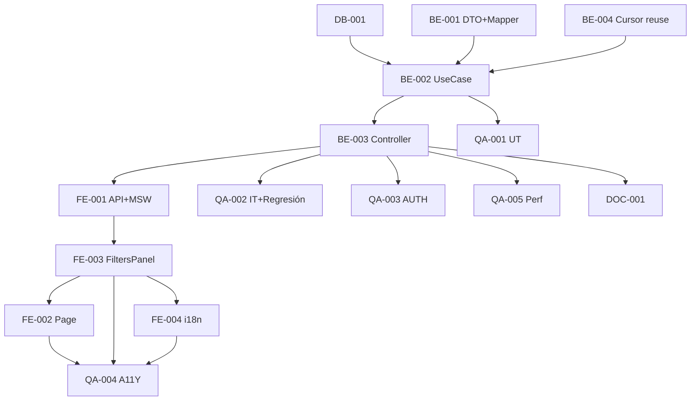

# Development Tasks — PB-P1-040 / US-077: Admin Review Panel

## 1. Metadata

| Field | Value |
|---|---|
| User Story ID | US-077 |
| Source User Story | `management/user-stories/US-077-admin-moderate-review-panel.md` |
| Source Technical Specification | `management/technical-specs/P1/PB-P1-040/US-077-technical-spec.md` |
| Decision Resolution Artifact | `management/user-stories/decision-resolutions/US-077-decision-resolution.md` |
| Priority | P1 |
| Backlog ID | PB-P1-040 |
| Backlog Title | Moderación admin de reseñas (soft delete) |
| Backlog Execution Order | 68 |
| User Story Position in Backlog Item | 2 de 2 |
| Related User Stories in Backlog Item | US-067, US-077 |
| Epic | EPIC-REV-001 / EPIC-ADM-001 |
| Backlog Item Dependencies | US-067, US-066 |
| Feature | Endpoint admin global + UI panel |
| Module / Domain | Admin / Reviews |
| Backlog Alignment Status | Found |
| Task Breakdown Status | Ready for Sprint Planning |
| Created Date | 2026-06-28 |
| Last Updated | 2026-06-28 |

---

## 2. Source Validation

| Source | Found | Used | Notes |
|---|---|---|---|
| User Story | Yes | Yes | Approved with Minor Notes. |
| Technical Specification | Yes | Yes | Ready for Task Breakdown. |
| Decision Resolution Artifact | Yes | Yes | 8/8 decisiones. |
| Product Backlog Prioritized | Yes | Yes | PB-P1-040. |

---

## 3. Backlog Execution Context

PB-P1-040 multi-story. US-077 cierra. Execution order 68.

---

## 4. Task Breakdown Summary

| Area | Count | Notes |
|---|---:|---|
| DB | 1 | Verify indexes |
| BE | 4 | DTO, Mapper, UseCase, Controller |
| FE | 4 | Page, FiltersPanel, API+MSW, i18n |
| QA | 5 | UT, IT, AUTH, A11Y, Performance |
| DOC | 1 | `docs/16` |
| **Total** | 15 | |

---

## 5. Traceability Matrix

| AC | Task IDs |
|---|---|
| AC-01 listado paginado | BE-002, BE-003, QA-002 |
| AC-02 filtros combinados | BE-001, BE-002, QA-002 |
| AC-03 PII completa | BE-001 Mapper |
| AC-04 UI panel | FE-002, FE-003 |
| AC-05 refresh post-moderate | FE-002, QA-002 |
| EC-01..04 | BE-001 DTO, QA-002 |
| AUTH | QA-003 |
| A11Y | FE-003, QA-004 |
| Performance | QA-005 |

---

## 6. Development Tasks

### TASK-PB-P1-040-US-077-DB-001 — Verificar índices reviews

| Field | Value |
|---|---|
| Area | Database / Prisma |
| Type | Review |
| Priority | Must |
| Estimate | XS |
| Depends On | PB-P0-001, US-065 |
| Source AC(s) | NFR-PERF-001 |
| Technical Spec Section(s) | §10 |
| Backlog ID | PB-P1-040 |
| User Story ID | US-077 |
| Owner Role | Backend |
| Status | To Do |

#### Definition of Done
- [ ] Pass o issue.

---

### TASK-PB-P1-040-US-077-BE-001 — DTOs `adminReviewsQuery` + Mapper

| Field | Value |
|---|---|
| Area | Backend |
| Type | Implementation |
| Priority | Must |
| Estimate | M |
| Depends On | US-067 |
| Source AC(s) | AC-02, AC-03, EC-01..04 |
| Technical Spec Section(s) | §7 |
| Backlog ID | PB-P1-040 |
| User Story ID | US-077 |
| Owner Role | Backend |
| Status | To Do |

#### Objective
Zod query con multi-status, rating range, fechas, refine cross-field. Mapper con PII completa + last_admin_action.

#### Definition of Done
- [ ] UT cubre todos los filtros y refines.

---

### TASK-PB-P1-040-US-077-BE-002 — `ListReviewsForAdminUseCase`

| Field | Value |
|---|---|
| Area | Backend |
| Type | Implementation |
| Priority | Must |
| Estimate | M |
| Depends On | BE-001, DB-001 |
| Source AC(s) | AC-01..AC-03 |
| Technical Spec Section(s) | §7 |
| Backlog ID | PB-P1-040 |
| User Story ID | US-077 |
| Owner Role | Backend |
| Status | To Do |

#### Definition of Done
- [ ] Coverage ≥ 90%.
- [ ] Branches: cada filtro independiente + combinado + cursor.

---

### TASK-PB-P1-040-US-077-BE-003 — Controller + ruta `GET /admin/reviews`

| Field | Value |
|---|---|
| Area | Backend / API |
| Type | Implementation |
| Priority | Must |
| Estimate | S |
| Depends On | BE-002, US-067 BE-002 (AdminGuard) |
| Source AC(s) | AC-01 |
| Technical Spec Section(s) | §7 |
| Backlog ID | PB-P1-040 |
| User Story ID | US-077 |
| Owner Role | Backend |
| Status | To Do |

#### Definition of Done
- [ ] Ruta operativa con AdminGuard reusado.

---

### TASK-PB-P1-040-US-077-BE-004 — Cursor utility reuso (US-066)

| Field | Value |
|---|---|
| Area | Backend |
| Type | Refactor |
| Priority | Must |
| Estimate | XS |
| Depends On | US-066 |
| Source AC(s) | AC-01 |
| Technical Spec Section(s) | §7 |
| Backlog ID | PB-P1-040 |
| User Story ID | US-077 |
| Owner Role | Backend |
| Status | To Do |

#### Definition of Done
- [ ] Import correcto sin duplicación.

---

### TASK-PB-P1-040-US-077-FE-001 — `adminApi.review.list` + MSW

| Field | Value |
|---|---|
| Area | Frontend |
| Type | Implementation |
| Priority | Must |
| Estimate | S |
| Depends On | BE-003 |
| Source AC(s) | AC-01..AC-03 |
| Technical Spec Section(s) | §8 |
| Backlog ID | PB-P1-040 |
| User Story ID | US-077 |
| Owner Role | Frontend |
| Status | To Do |

#### Definition of Done
- [ ] MSW handlers `200/400/401/403`.

---

### TASK-PB-P1-040-US-077-FE-002 — Page `/admin/reviews` + integración componentes US-067

| Field | Value |
|---|---|
| Area | Frontend |
| Type | Implementation |
| Priority | Must |
| Estimate | M |
| Depends On | FE-001, FE-003, US-067 FE-001, US-067 FE-002 |
| Source AC(s) | AC-04, AC-05 |
| Technical Spec Section(s) | §8 |
| Backlog ID | PB-P1-040 |
| User Story ID | US-077 |
| Owner Role | Frontend |
| Status | To Do |

#### Objective
Page integra `ReviewModerationTable` + `ReviewFiltersPanel` + `ModerationDialog`. invalidation post-moderate.

#### Definition of Done
- [ ] Refresh tras moderate verificado.

---

### TASK-PB-P1-040-US-077-FE-003 — `ReviewFiltersPanel` accesible

| Field | Value |
|---|---|
| Area | Frontend |
| Type | Implementation |
| Priority | Must |
| Estimate | M |
| Depends On | FE-001 |
| Source AC(s) | AC-02, A11Y |
| Technical Spec Section(s) | §8 |
| Backlog ID | PB-P1-040 |
| User Story ID | US-077 |
| Owner Role | Frontend |
| Status | To Do |

#### Objective
Form controlled con multi-status checkboxes, date pickers, rating range, vendor selector, has_admin_action toggle. RHF + Zod alineado backend. Debounce 300ms.

#### Definition of Done
- [ ] axe sin issues.
- [ ] Navegación teclado.

---

### TASK-PB-P1-040-US-077-FE-004 — i18n `admin.review.panel.*` + filters (4 locales)

| Field | Value |
|---|---|
| Area | Frontend / i18n |
| Type | Implementation |
| Priority | Must |
| Estimate | S |
| Depends On | FE-003 |
| Source AC(s) | i18n |
| Technical Spec Section(s) | §8 |
| Backlog ID | PB-P1-040 |
| User Story ID | US-077 |
| Owner Role | Frontend |
| Status | To Do |

#### Definition of Done
- [ ] 4 locales completos.

---

### TASK-PB-P1-040-US-077-QA-001 — UT (DTOs + Mapper + UseCase)

| Field | Value |
|---|---|
| Area | QA |
| Type | Test |
| Priority | Must |
| Estimate | M |
| Depends On | BE-002 |
| Source AC(s) | Múltiples |
| Technical Spec Section(s) | §13 |
| Backlog ID | PB-P1-040 |
| User Story ID | US-077 |
| Owner Role | QA / Backend |
| Status | To Do |

#### Definition of Done
- [ ] Coverage ≥ 90%.

---

### TASK-PB-P1-040-US-077-QA-002 — IT (filtros + cursor + regresión US-067)

| Field | Value |
|---|---|
| Area | QA |
| Type | Test |
| Priority | Must |
| Estimate | M |
| Depends On | BE-003 |
| Source AC(s) | AC-01..AC-05 |
| Technical Spec Section(s) | §13 |
| Backlog ID | PB-P1-040 |
| User Story ID | US-077 |
| Owner Role | QA |
| Status | To Do |

#### Objective
TS-01..TS-06 + regresión US-067 (moderate action sigue funcional + refresh correcto).

#### Definition of Done
- [ ] Regresión verde.

---

### TASK-PB-P1-040-US-077-QA-003 — Authorization (admin only)

| Field | Value |
|---|---|
| Area | QA / Security |
| Type | Test |
| Priority | Must |
| Estimate | S |
| Depends On | BE-003 |
| Source AC(s) | AUTH-TS-01..04 |
| Technical Spec Section(s) | §12 |
| Backlog ID | PB-P1-040 |
| User Story ID | US-077 |
| Owner Role | QA |
| Status | To Do |

#### Definition of Done
- [ ] Admin only enforcement.

---

### TASK-PB-P1-040-US-077-QA-004 — Accessibility (filtros + tabla)

| Field | Value |
|---|---|
| Area | QA / A11Y |
| Type | Test |
| Priority | Must |
| Estimate | S |
| Depends On | FE-002, FE-003, FE-004 |
| Source AC(s) | A11Y |
| Technical Spec Section(s) | §13 |
| Backlog ID | PB-P1-040 |
| User Story ID | US-077 |
| Owner Role | QA / Frontend |
| Status | To Do |

#### Definition of Done
- [ ] axe sin issues serios.

---

### TASK-PB-P1-040-US-077-QA-005 — Performance (filtros combinados)

| Field | Value |
|---|---|
| Area | QA / Performance |
| Type | Test |
| Priority | Must |
| Estimate | S |
| Depends On | BE-003 |
| Source AC(s) | NFR-PERF-001 |
| Technical Spec Section(s) | §13 |
| Backlog ID | PB-P1-040 |
| User Story ID | US-077 |
| Owner Role | QA |
| Status | To Do |

#### Objective
Smoke `< 500ms p95` con filtros combinados. EXPLAIN ANALYZE en setup grande.

#### Definition of Done
- [ ] p95 < 500ms.

---

### TASK-PB-P1-040-US-077-DOC-001 — Documentar endpoint admin reviews list

| Field | Value |
|---|---|
| Area | Documentation |
| Type | Documentation |
| Priority | Must |
| Estimate | S |
| Depends On | BE-003 |
| Source AC(s) | AC-01 |
| Technical Spec Section(s) | §16 |
| Backlog ID | PB-P1-040 |
| User Story ID | US-077 |
| Owner Role | Backend / Doc |
| Status | To Do |

#### Definition of Done
- [ ] `docs/16 §M07` + `docs/14` actualizados.

---

## 7. Required QA Tasks
Ver §6.

## 8. Required Security Tasks
| Task ID | Concern |
|---|---|
| TASK-PB-P1-040-US-077-QA-003 | Admin only enforcement |

## 9. Required Seed / Demo Tasks
`No aplica` (reuso).

## 10. Observability / Audit Tasks
N/A.

## 11. Documentation / Traceability Tasks
| Task ID | Doc |
|---|---|
| TASK-PB-P1-040-US-077-DOC-001 | `docs/16 §M07` |

## 12. Dependency Graph

---

## 13. Suggested Implementation Order

**Phase 1**: DB-001, BE-004 Cursor reuse, BE-001 DTO+Mapper.
**Phase 2**: BE-002 UseCase, BE-003 Controller, FE-001 API+MSW, FE-003 FiltersPanel, FE-002 Page, FE-004 i18n.
**Phase 3**: QA-001..QA-005.
**Phase 4**: DOC-001.

---

## 14. Risks & Mitigations
Ver §17 del Technical Spec.

## 15. Out of Scope Confirmation
Bulk actions, exports, full-text search.

## 16. Readiness for Sprint Planning

| Check | Status |
|---|---|
| Product Backlog mapping found | Pass |
| Every AC maps to tasks | Pass |
| Technical Spec used when available | Pass |
| QA tasks included | Pass |
| Security tasks included | Pass |
| Documentation tasks included | Pass |
| Task dependencies clear | Pass |
| Ready for Sprint Planning | Yes |

---

## 17. Final Recommendation

`Ready for Sprint Planning`.

US-077 cierra PB-P1-040 con 15 tareas: endpoint admin global con filtros combinados + page con reuso máximo de US-066 (cursor) y US-067 (ReviewModerationTable, ModerationDialog, AdminGuard, useModerateReview hook). **PB-P1-040 cierra con esto**. QA-002 verifica regresión US-067 + invalidation post-moderate.
