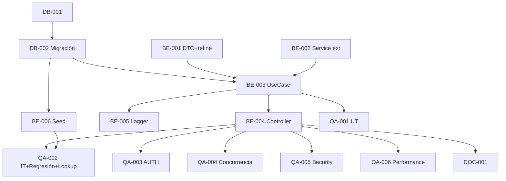

# Development Tasks — PB-P1-041 / US-047: Admin moderate VendorProfile

## 1. Metadata

| Field | Value |
|---|---|
| User Story ID | US-047 |
| Source User Story | `management/user-stories/US-047-admin-approve-reject-vendor.md` |
| Source Technical Specification | `management/technical-specs/P1/PB-P1-041/US-047-technical-spec.md` |
| Decision Resolution Artifact | `management/user-stories/decision-resolutions/US-047-decision-resolution.md` |
| Priority | P1 |
| Backlog ID | PB-P1-041 |
| Backlog Title | Admin: aprobar / rechazar / ocultar vendor |
| Backlog Execution Order | 47 |
| User Story Position in Backlog Item | 1 de 2 |
| Related User Stories in Backlog Item | US-047, US-074 |
| Epic | EPIC-VND-001 / EPIC-ADM-001 |
| Backlog Item Dependencies | US-040, PB-P1-024 |
| Feature | Endpoint único admin moderate vendor + AdminAction + 2 notifs |
| Module / Domain | Vendors / Admin |
| Backlog Alignment Status | Found |
| Task Breakdown Status | Ready for Sprint Planning |
| Created Date | 2026-06-29 |
| Last Updated | 2026-06-29 |

---

## 2. Source Validation

| Source | Found | Used | Notes |
|---|---|---|---|
| User Story | Yes | Yes | Approved with Minor Notes. |
| Technical Specification | Yes | Yes | Ready for Task Breakdown. |
| Decision Resolution Artifact | Yes | Yes | 9/9 decisiones. |
| Product Backlog Prioritized | Yes | Yes | PB-P1-041. |

---

## 3. Backlog Execution Context

PB-P1-041 multi-story. US-047 abre. Execution order 47.

---

## 4. Task Breakdown Summary

| Area | Count | Notes |
|---|---:|---|
| DB | 2 | Verify + migración audit + is_hidden defensivo |
| BE | 6 | DTO+refine, Service ext, UseCase, Controller, Logger, AdminGuard reuso |
| QA | 6 | UT, IT (regresión + lookup), AUTH, Concurrencia, Security, Performance |
| DOC | 1 | `docs/16` + `docs/14` |
| **Total** | 15 | |

(FE en US-074.)

---

## 5. Traceability Matrix

| AC | Task IDs |
|---|---|
| AC-01 approve | BE-003, QA-002 |
| AC-02 reject | BE-003, QA-002 |
| AC-03 hide | BE-003, QA-002 |
| AC-04 unhide | BE-003, QA-002 |
| EC-01..07 | BE-001, BE-003, QA-002 |
| AUTH | BE-006, QA-003 |
| Concurrencia | QA-004 |
| Security | QA-005 |
| Effect en US-040 | QA-002 |

---

## 6. Development Tasks

### TASK-PB-P1-041-US-047-DB-001 — Verificar schema vendor_profiles + admin_actions

| Field | Value |
|---|---|
| Area | Database / Prisma |
| Type | Review |
| Priority | Must |
| Estimate | XS |
| Depends On | PB-P0-001, US-040 |
| Source AC(s) | AC-01..04 |
| Technical Spec Section(s) | §10 |
| Backlog ID | PB-P1-041 |
| User Story ID | US-047 |
| Owner Role | Backend |
| Status | To Do |

#### Definition of Done
- [ ] Pass o issues.

---

### TASK-PB-P1-041-US-047-DB-002 — Migración audit + is_hidden defensivo

| Field | Value |
|---|---|
| Area | Database / Prisma |
| Type | Implementation |
| Priority | Must |
| Estimate | S |
| Depends On | DB-001 |
| Source AC(s) | AC-01..04 |
| Technical Spec Section(s) | §10 |
| Backlog ID | PB-P1-041 |
| User Story ID | US-047 |
| Owner Role | Backend |
| Status | To Do |

#### Objective
4 columnas audit + `is_hidden` con `IF NOT EXISTS` + index parcial.

#### Definition of Done
- [ ] Migración aplica.

---

### TASK-PB-P1-041-US-047-BE-001 — DTO `moderateVendorBody` con cross-field refine

| Field | Value |
|---|---|
| Area | Backend |
| Type | Implementation |
| Priority | Must |
| Estimate | S |
| Depends On | - |
| Source AC(s) | EC-04..07 |
| Technical Spec Section(s) | §7 DTOs |
| Backlog ID | PB-P1-041 |
| User Story ID | US-047 |
| Owner Role | Backend |
| Status | To Do |

#### Definition of Done
- [ ] DTO + UT (reason required en reject/hide, opcional en approve/unhide).

---

### TASK-PB-P1-041-US-047-BE-002 — Extender service común con 4 eventos vendor.*

| Field | Value |
|---|---|
| Area | Backend |
| Type | Refactor |
| Priority | Must |
| Estimate | XS |
| Depends On | US-067 BE-002 |
| Source AC(s) | AC-01..04 |
| Technical Spec Section(s) | §7 Service |
| Backlog ID | PB-P1-041 |
| User Story ID | US-047 |
| Owner Role | Backend |
| Status | To Do |

#### Definition of Done
- [ ] Type extendido a 13 eventos.
- [ ] UT cubre todos.

---

### TASK-PB-P1-041-US-047-BE-003 — `ModerateVendorUseCase` atómico

| Field | Value |
|---|---|
| Area | Backend |
| Type | Implementation |
| Priority | Must |
| Estimate | L |
| Depends On | BE-001, BE-002, DB-002 |
| Source AC(s) | AC-01..04, EC-01..07 |
| Technical Spec Section(s) | §7 |
| Backlog ID | PB-P1-041 |
| User Story ID | US-047 |
| Owner Role | Backend |
| Status | To Do |

#### Definition of Done
- [ ] Coverage ≥ 90%.
- [ ] 4 transiciones permitidas + rejection de otras.

---

### TASK-PB-P1-041-US-047-BE-004 — Controller + ruta

| Field | Value |
|---|---|
| Area | Backend / API |
| Type | Implementation |
| Priority | Must |
| Estimate | S |
| Depends On | BE-003, US-067 BE-002 (AdminGuard) |
| Source AC(s) | AC-01..04 |
| Technical Spec Section(s) | §7 |
| Backlog ID | PB-P1-041 |
| User Story ID | US-047 |
| Owner Role | Backend |
| Status | To Do |

#### Definition of Done
- [ ] Ruta operativa con AdminGuard.

---

### TASK-PB-P1-041-US-047-BE-005 — Logger `vendor.moderated`

| Field | Value |
|---|---|
| Area | Backend / Observability |
| Type | Implementation |
| Priority | Must |
| Estimate | XS |
| Depends On | BE-003 |
| Source AC(s) | AC-01..04 |
| Technical Spec Section(s) | §14 |
| Backlog ID | PB-P1-041 |
| User Story ID | US-047 |
| Owner Role | Backend |
| Status | To Do |

#### Definition of Done
- [ ] Evento emitido con 7 campos.

---

### TASK-PB-P1-041-US-047-BE-006 — Seed demo vendors moderados

| Field | Value |
|---|---|
| Area | Backend / Seed |
| Type | Implementation |
| Priority | Should |
| Estimate | XS |
| Depends On | DB-002 |
| Source AC(s) | AC-01..04 |
| Technical Spec Section(s) | §15 |
| Backlog ID | PB-P1-041 |
| User Story ID | US-047 |
| Owner Role | Backend |
| Status | To Do |

#### Objective
≥1 approved + ≥1 approved+hidden + ≥1 rejected con AdminAction.

#### Definition of Done
- [ ] Seed reproducible.

---

### TASK-PB-P1-041-US-047-QA-001 — UT (DTO + UseCase branches)

| Field | Value |
|---|---|
| Area | QA |
| Type | Test |
| Priority | Must |
| Estimate | M |
| Depends On | BE-003 |
| Source AC(s) | Múltiples |
| Technical Spec Section(s) | §13 |
| Backlog ID | PB-P1-041 |
| User Story ID | US-047 |
| Owner Role | QA / Backend |
| Status | To Do |

#### Definition of Done
- [ ] Coverage ≥ 90%.

---

### TASK-PB-P1-041-US-047-QA-002 — IT (4 acciones + AdminAction + denormalize + regresión US-040 + service común)

| Field | Value |
|---|---|
| Area | QA |
| Type | Test |
| Priority | Must |
| Estimate | L |
| Depends On | BE-004, BE-006 |
| Source AC(s) | AC-01..04, EC-01..07 |
| Technical Spec Section(s) | §13 |
| Backlog ID | PB-P1-041 |
| User Story ID | US-047 |
| Owner Role | QA |
| Status | To Do |

#### Objective
TS-01..TS-06 + verificar que rejected y is_hidden=true desaparecen del directorio público (US-040) + regresión 9 eventos previos del service común.

#### Definition of Done
- [ ] Regresión verde.

---

### TASK-PB-P1-041-US-047-QA-003 — Authorization tests

| Field | Value |
|---|---|
| Area | QA / Security |
| Type | Test |
| Priority | Must |
| Estimate | S |
| Depends On | BE-004 |
| Source AC(s) | AUTH-TS-01..04 |
| Technical Spec Section(s) | §12 |
| Backlog ID | PB-P1-041 |
| User Story ID | US-047 |
| Owner Role | QA |
| Status | To Do |

#### Definition of Done
- [ ] `404 VENDOR_NOT_FOUND` uniforme; admin only.

---

### TASK-PB-P1-041-US-047-QA-004 — Concurrencia (2 moderate simultáneos)

| Field | Value |
|---|---|
| Area | QA |
| Type | Test |
| Priority | Must |
| Estimate | S |
| Depends On | BE-004 |
| Source AC(s) | EC-01 |
| Technical Spec Section(s) | §17 |
| Backlog ID | PB-P1-041 |
| User Story ID | US-047 |
| Owner Role | QA |
| Status | To Do |

#### Definition of Done
- [ ] Sin doble AdminAction.

---

### TASK-PB-P1-041-US-047-QA-005 — Security: no hard delete + AdminAction obligatorio

| Field | Value |
|---|---|
| Area | QA / Security |
| Type | Test |
| Priority | Must |
| Estimate | S |
| Depends On | BE-004 |
| Source AC(s) | SEC-02..05 |
| Technical Spec Section(s) | §13 |
| Backlog ID | PB-P1-041 |
| User Story ID | US-047 |
| Owner Role | QA / Security |
| Status | To Do |

#### Objective
Verificar: no endpoint DELETE; cada acción crea AdminAction record; reason validation enforcement.

#### Definition of Done
- [ ] Security requirements verificados.

---

### TASK-PB-P1-041-US-047-QA-006 — Performance `< 500ms p95`

| Field | Value |
|---|---|
| Area | QA / Performance |
| Type | Test |
| Priority | Should |
| Estimate | S |
| Depends On | BE-004 |
| Source AC(s) | NFR-PERF-001 |
| Technical Spec Section(s) | §13 |
| Backlog ID | PB-P1-041 |
| User Story ID | US-047 |
| Owner Role | QA |
| Status | To Do |

#### Definition of Done
- [ ] p95 < 500ms.

---

### TASK-PB-P1-041-US-047-DOC-001 — Documentar endpoint + AdminAction chain VendorProfile

| Field | Value |
|---|---|
| Area | Documentation |
| Type | Documentation |
| Priority | Must |
| Estimate | S |
| Depends On | BE-004 |
| Source AC(s) | AC-01..04 |
| Technical Spec Section(s) | §16 |
| Backlog ID | PB-P1-041 |
| User Story ID | US-047 |
| Owner Role | Backend / Doc |
| Status | To Do |

#### Definition of Done
- [ ] `docs/16 §M07` + `docs/14` actualizados.

---

## 7. Required QA Tasks
Ver §6.

## 8. Required Security Tasks
| Task ID | Concern |
|---|---|
| TASK-PB-P1-041-US-047-QA-003 | `404 VENDOR_NOT_FOUND` uniforme + admin only |
| TASK-PB-P1-041-US-047-QA-005 | AdminAction obligatorio + reason enforcement |
| TASK-PB-P1-041-US-047-QA-004 | Race condition |

## 9. Required Seed / Demo Tasks
| Task ID | Concern |
|---|---|
| TASK-PB-P1-041-US-047-BE-006 | Demo data vendors moderados |

## 10. Observability / Audit Tasks
| Task ID | Concern |
|---|---|
| TASK-PB-P1-041-US-047-BE-005 | Log `vendor.moderated` |

## 11. Documentation / Traceability Tasks
| Task ID | Doc |
|---|---|
| TASK-PB-P1-041-US-047-DOC-001 | `docs/16 §M07` + `docs/14` |

## 12. Dependency Graph

---

## 13. Suggested Implementation Order

**Phase 1**: DB-001, DB-002, BE-001 DTO, BE-002 Service ext.
**Phase 2**: BE-003 UseCase, BE-004 Controller, BE-005 Logger, BE-006 Seed.
**Phase 3**: QA-001..QA-006.
**Phase 4**: DOC-001.

---

## 14. Risks & Mitigations
Ver §17 del Technical Spec.

## 15. Out of Scope Confirmation
UI (US-074), AI moderation, bulk, re-approve rejected.

## 16. Readiness for Sprint Planning

| Check | Status |
|---|---|
| Product Backlog mapping found | Pass |
| Every AC maps to tasks | Pass |
| Technical Spec used when available | Pass |
| QA tasks included | Pass |
| Security tasks included | Pass |
| Seed tasks included | Pass |
| Observability tasks included | Pass |
| Documentation tasks included | Pass |
| Task dependencies clear | Pass |
| Ready for Sprint Planning | Yes |

---

## 17. Final Recommendation

`Ready for Sprint Planning`.

US-047 entrega 15 tareas backend-only: endpoint admin único `moderate` con 4 acciones + AdminAction obligatorio + extensión del service común a 13 eventos del lifecycle. QA-002 verifica regresión integral US-040 (lookup público) + 9 eventos previos del service común. **US-074 cerrará PB-P1-041 con el panel UI admin de vendors**.
