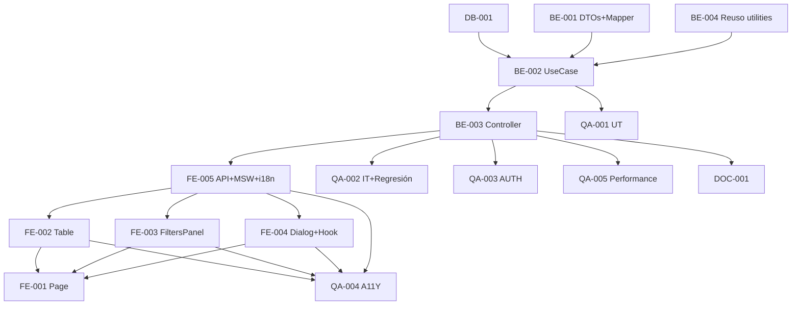

# Development Tasks — PB-P1-041 / US-074: Admin Vendor Panel

## 1. Metadata

| Field | Value |
|---|---|
| User Story ID | US-074 |
| Source User Story | `management/user-stories/US-074-admin-approve-reject-vendor-extended.md` |
| Source Technical Specification | `management/technical-specs/P1/PB-P1-041/US-074-technical-spec.md` |
| Decision Resolution Artifact | `management/user-stories/decision-resolutions/US-074-decision-resolution.md` |
| Priority | P1 |
| Backlog ID | PB-P1-041 |
| Backlog Title | Admin: aprobar / rechazar / ocultar vendor |
| Backlog Execution Order | 74 |
| User Story Position in Backlog Item | 2 de 2 (cierra) |
| Related User Stories in Backlog Item | US-047, US-074 |
| Epic | EPIC-ADM-001 / EPIC-VND-001 |
| Backlog Item Dependencies | US-047, US-066, US-077 |
| Feature | Endpoint admin global + UI panel + integración US-047 |
| Module / Domain | Admin / Vendors |
| Backlog Alignment Status | Found |
| Task Breakdown Status | Ready for Sprint Planning |
| Created Date | 2026-06-29 |
| Last Updated | 2026-06-29 |

---

## 2. Source Validation

| Source | Found | Used | Notes |
|---|---|---|---|
| User Story | Yes | Yes | Approved with Minor Notes. |
| Technical Specification | Yes | Yes | Ready for Task Breakdown. |
| Decision Resolution Artifact | Yes | Yes | 8/8 decisiones. |
| Product Backlog Prioritized | Yes | Yes | PB-P1-041. |

---

## 3. Backlog Execution Context

PB-P1-041 multi-story. US-074 cierra. Execution order 74.

---

## 4. Task Breakdown Summary

| Area | Count | Notes |
|---|---:|---|
| DB | 1 | Verify indexes |
| BE | 4 | DTO, Mapper, UseCase, Controller |
| FE | 5 | Page, Table, FiltersPanel, Dialog, Hook+API+MSW, i18n |
| QA | 5 | UT, IT (con regresión US-047), AUTH, A11Y, Performance |
| DOC | 1 | `docs/16` + `docs/14` |
| **Total** | 16 | |

---

## 5. Traceability Matrix

| AC | Task IDs |
|---|---|
| AC-01 default pending | BE-002, BE-003, FE-001 (page pre-applies filter), QA-002 |
| AC-02 filtros combinados | BE-001, BE-002, QA-002 |
| AC-03 owner email + last_admin_action | BE-001 Mapper |
| AC-04 UI panel | FE-001, FE-002, FE-003, FE-004 |
| AC-05 refresh post-moderate | FE-004 Hook, QA-002 |
| EC-01..05 | BE-001 DTO, QA-002 |
| AUTH | QA-003 |
| A11Y | FE-002, FE-003, FE-004, QA-004 |
| Performance | QA-005 |

---

## 6. Development Tasks

### TASK-PB-P1-041-US-074-DB-001 — Verificar índices vendor_profiles

| Field | Value |
|---|---|
| Area | Database / Prisma |
| Type | Review |
| Priority | Must |
| Estimate | XS |
| Depends On | US-047 DB |
| Source AC(s) | NFR-PERF-001 |
| Technical Spec Section(s) | §10 |
| Backlog ID | PB-P1-041 |
| User Story ID | US-074 |
| Owner Role | Backend |
| Status | To Do |

#### Definition of Done
- [ ] Pass o issue.

---

### TASK-PB-P1-041-US-074-BE-001 — DTOs + Mapper

| Field | Value |
|---|---|
| Area | Backend |
| Type | Implementation |
| Priority | Must |
| Estimate | M |
| Depends On | US-066 (cursor utility), US-047 |
| Source AC(s) | AC-02, AC-03, EC-01..04 |
| Technical Spec Section(s) | §7 |
| Backlog ID | PB-P1-041 |
| User Story ID | US-074 |
| Owner Role | Backend |
| Status | To Do |

#### Objective
Zod query con multi-status, is_hidden coerce, fechas, business_name + cross-field refine. Mapper con owner + last_admin_action.

#### Definition of Done
- [ ] UT cubre filtros y refines.

---

### TASK-PB-P1-041-US-074-BE-002 — `ListVendorsForAdminUseCase`

| Field | Value |
|---|---|
| Area | Backend |
| Type | Implementation |
| Priority | Must |
| Estimate | M |
| Depends On | BE-001, DB-001 |
| Source AC(s) | AC-01..AC-03 |
| Technical Spec Section(s) | §7 |
| Backlog ID | PB-P1-041 |
| User Story ID | US-074 |
| Owner Role | Backend |
| Status | To Do |

#### Definition of Done
- [ ] Coverage ≥ 90%.
- [ ] Branches: cada filtro + ILIKE + combinado + cursor.

---

### TASK-PB-P1-041-US-074-BE-003 — Controller + ruta `GET /admin/vendors`

| Field | Value |
|---|---|
| Area | Backend / API |
| Type | Implementation |
| Priority | Must |
| Estimate | S |
| Depends On | BE-002, US-067 BE-002 (AdminGuard) |
| Source AC(s) | AC-01 |
| Technical Spec Section(s) | §7 |
| Backlog ID | PB-P1-041 |
| User Story ID | US-074 |
| Owner Role | Backend |
| Status | To Do |

#### Definition of Done
- [ ] Ruta operativa con AdminGuard reusado.

---

### TASK-PB-P1-041-US-074-BE-004 — Reuso cursor utility (US-066) + reuso AdminGuard (US-067)

| Field | Value |
|---|---|
| Area | Backend |
| Type | Refactor |
| Priority | Must |
| Estimate | XS |
| Depends On | US-066, US-067 |
| Source AC(s) | AC-01 |
| Technical Spec Section(s) | §7 |
| Backlog ID | PB-P1-041 |
| User Story ID | US-074 |
| Owner Role | Backend |
| Status | To Do |

#### Definition of Done
- [ ] Imports correctos sin duplicación.

---

### TASK-PB-P1-041-US-074-FE-001 — Page `/admin/vendors` con filtro default pending

| Field | Value |
|---|---|
| Area | Frontend |
| Type | Implementation |
| Priority | Must |
| Estimate | S |
| Depends On | FE-002, FE-003, FE-004 |
| Source AC(s) | AC-01, AC-04 |
| Technical Spec Section(s) | §8 |
| Backlog ID | PB-P1-041 |
| User Story ID | US-074 |
| Owner Role | Frontend |
| Status | To Do |

#### Definition of Done
- [ ] Page renderiza con `status=pending` pre-aplicado.

---

### TASK-PB-P1-041-US-074-FE-002 — `VendorModerationTable` + `VendorStatusBadge`

| Field | Value |
|---|---|
| Area | Frontend |
| Type | Implementation |
| Priority | Must |
| Estimate | M |
| Depends On | FE-005 (API+MSW) |
| Source AC(s) | AC-04, A11Y |
| Technical Spec Section(s) | §8 |
| Backlog ID | PB-P1-041 |
| User Story ID | US-074 |
| Owner Role | Frontend |
| Status | To Do |

#### Definition of Done
- [ ] Tabla accesible con headers semánticos.

---

### TASK-PB-P1-041-US-074-FE-003 — `VendorFiltersPanel` con debounce

| Field | Value |
|---|---|
| Area | Frontend |
| Type | Implementation |
| Priority | Must |
| Estimate | M |
| Depends On | FE-005 |
| Source AC(s) | AC-02, A11Y |
| Technical Spec Section(s) | §8 |
| Backlog ID | PB-P1-041 |
| User Story ID | US-074 |
| Owner Role | Frontend |
| Status | To Do |

#### Objective
Multi-status checkboxes + is_hidden toggle + date pickers + business_name search debounce 300ms.

#### Definition of Done
- [ ] axe sin issues.

---

### TASK-PB-P1-041-US-074-FE-004 — `VendorModerationDialog` + `useModerateVendor` hook

| Field | Value |
|---|---|
| Area | Frontend |
| Type | Implementation |
| Priority | Must |
| Estimate | M |
| Depends On | FE-005, US-047 BE-004 |
| Source AC(s) | AC-04, AC-05, A11Y |
| Technical Spec Section(s) | §8 |
| Backlog ID | PB-P1-041 |
| User Story ID | US-074 |
| Owner Role | Frontend |
| Status | To Do |

#### Objective
Dialog con action selector + reason RHF+Zod condicional. Hook mutation a US-047 endpoint con invalidation.

#### Definition of Done
- [ ] axe sin issues.
- [ ] Refresh tras moderate verificado.

---

### TASK-PB-P1-041-US-074-FE-005 — `adminApi.vendor.list` + `.moderate` + MSW + i18n

| Field | Value |
|---|---|
| Area | Frontend |
| Type | Implementation |
| Priority | Must |
| Estimate | S |
| Depends On | BE-003, US-047 BE-004 |
| Source AC(s) | AC-01..05, i18n |
| Technical Spec Section(s) | §8 |
| Backlog ID | PB-P1-041 |
| User Story ID | US-074 |
| Owner Role | Frontend |
| Status | To Do |

#### Definition of Done
- [ ] MSW handlers `200/400/401/403`.
- [ ] i18n 4 locales (`admin.vendor.*`).

---

### TASK-PB-P1-041-US-074-QA-001 — UT (DTOs + Mapper + UseCase)

| Field | Value |
|---|---|
| Area | QA |
| Type | Test |
| Priority | Must |
| Estimate | M |
| Depends On | BE-002 |
| Source AC(s) | Múltiples |
| Technical Spec Section(s) | §13 |
| Backlog ID | PB-P1-041 |
| User Story ID | US-074 |
| Owner Role | QA / Backend |
| Status | To Do |

#### Definition of Done
- [ ] Coverage ≥ 90%.

---

### TASK-PB-P1-041-US-074-QA-002 — IT (filtros + cursor + regresión US-047)

| Field | Value |
|---|---|
| Area | QA |
| Type | Test |
| Priority | Must |
| Estimate | M |
| Depends On | BE-003 |
| Source AC(s) | AC-01..AC-05 |
| Technical Spec Section(s) | §13 |
| Backlog ID | PB-P1-041 |
| User Story ID | US-074 |
| Owner Role | QA |
| Status | To Do |

#### Definition of Done
- [ ] 5 escenarios + regresión US-047 (moderate sigue funcional + invalidation correcto).

---

### TASK-PB-P1-041-US-074-QA-003 — Authorization (admin only)

| Field | Value |
|---|---|
| Area | QA / Security |
| Type | Test |
| Priority | Must |
| Estimate | S |
| Depends On | BE-003 |
| Source AC(s) | AUTH-TS-01..04 |
| Technical Spec Section(s) | §12 |
| Backlog ID | PB-P1-041 |
| User Story ID | US-074 |
| Owner Role | QA |
| Status | To Do |

#### Definition of Done
- [ ] Admin only enforcement.

---

### TASK-PB-P1-041-US-074-QA-004 — Accessibility (tabla + filtros + dialog)

| Field | Value |
|---|---|
| Area | QA / A11Y |
| Type | Test |
| Priority | Must |
| Estimate | S |
| Depends On | FE-002, FE-003, FE-004, FE-005 |
| Source AC(s) | A11Y |
| Technical Spec Section(s) | §13 |
| Backlog ID | PB-P1-041 |
| User Story ID | US-074 |
| Owner Role | QA / Frontend |
| Status | To Do |

#### Definition of Done
- [ ] axe sin issues serios.

---

### TASK-PB-P1-041-US-074-QA-005 — Performance < 500ms p95 con ILIKE

| Field | Value |
|---|---|
| Area | QA / Performance |
| Type | Test |
| Priority | Should |
| Estimate | S |
| Depends On | BE-003 |
| Source AC(s) | NFR-PERF-001 |
| Technical Spec Section(s) | §13 |
| Backlog ID | PB-P1-041 |
| User Story ID | US-074 |
| Owner Role | QA |
| Status | To Do |

#### Objective
EXPLAIN ANALYZE con ~1000 vendors + filtros combinados. p95 < 500ms.

#### Definition of Done
- [ ] p95 < 500ms.

---

### TASK-PB-P1-041-US-074-DOC-001 — Documentar endpoint admin vendors list + panel

| Field | Value |
|---|---|
| Area | Documentation |
| Type | Documentation |
| Priority | Must |
| Estimate | S |
| Depends On | BE-003 |
| Source AC(s) | AC-01 |
| Technical Spec Section(s) | §16 |
| Backlog ID | PB-P1-041 |
| User Story ID | US-074 |
| Owner Role | Backend / Doc |
| Status | To Do |

#### Definition of Done
- [ ] `docs/16 §M07` + `docs/14` actualizados.

---

## 7. Required QA Tasks
Ver §6.

## 8. Required Security Tasks
| Task ID | Concern |
|---|---|
| TASK-PB-P1-041-US-074-QA-003 | Admin only enforcement |

## 9. Required Seed / Demo Tasks
`No aplica` (reuso). Verificar ≥5 vendors diversos en seed para demo.

## 10. Observability / Audit Tasks
N/A.

## 11. Documentation / Traceability Tasks
| Task ID | Doc |
|---|---|
| TASK-PB-P1-041-US-074-DOC-001 | `docs/16 §M07` + `docs/14` |

## 12. Dependency Graph

---

## 13. Suggested Implementation Order

**Phase 1**: DB-001, BE-004 reuso, BE-001 DTO+Mapper.
**Phase 2**: BE-002 UseCase, BE-003 Controller, FE-005 API+MSW+i18n, FE-002/003/004 Componentes, FE-001 Page.
**Phase 3**: QA-001..QA-005.
**Phase 4**: DOC-001.

---

## 14. Risks & Mitigations
Ver §17 del Technical Spec.

## 15. Out of Scope Confirmation
Bulk, exports, full-text.

## 16. Readiness for Sprint Planning

| Check | Status |
|---|---|
| Product Backlog mapping found | Pass |
| Every AC maps to tasks | Pass |
| Technical Spec used when available | Pass |
| QA tasks included | Pass |
| Security tasks included | Pass |
| Documentation tasks included | Pass |
| Task dependencies clear | Pass |
| Ready for Sprint Planning | Yes |

---

## 17. Final Recommendation

`Ready for Sprint Planning`.

US-074 cierra PB-P1-041 con 16 tareas: endpoint admin global con filtros combinados + panel UI completo con 3 componentes nuevos + hook moderate consumiendo endpoint de US-047. Reuso máximo de US-066 (cursor utility) + US-067 (AdminGuard) + US-077 (pattern). **PB-P1-041 cierra completamente; junto con PB-P1-040 (US-067+US-077) deja toda la moderación admin (reviews + vendors) operativa con AdminAction obligatorio**.
