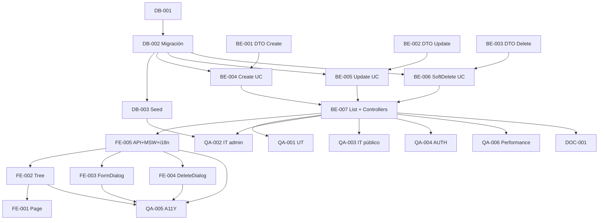

# Development Tasks — PB-P1-042 / US-075: CRUD admin ServiceCategory

## 1. Metadata

| Field | Value |
|---|---|
| User Story ID | US-075 |
| Source User Story | `management/user-stories/US-075-admin-crud-service-categories.md` |
| Source Technical Specification | `management/technical-specs/P1/PB-P1-042/US-075-technical-spec.md` |
| Decision Resolution Artifact | `management/user-stories/decision-resolutions/US-075-decision-resolution.md` |
| Priority | P1 |
| Backlog ID | PB-P1-042 |
| Backlog Title | CRUD ServiceCategory (jerarquía 2 niveles) |
| Backlog Execution Order | 75 |
| User Story Position in Backlog Item | 1 de 1 |
| Related User Stories in Backlog Item | US-075 |
| Epic | EPIC-ADM-001 |
| Backlog Item Dependencies | PB-P0-001, US-067 |
| Feature | CRUD admin + endpoint público + jerarquía + soft delete + AdminAction |
| Module / Domain | Admin / Catalog |
| Backlog Alignment Status | Found |
| Task Breakdown Status | Ready for Sprint Planning |
| Created Date | 2026-06-29 |
| Last Updated | 2026-06-29 |

---

## 2. Source Validation

| Source | Found | Used | Notes |
|---|---|---|---|
| User Story | Yes | Yes | Approved with Minor Notes. |
| Technical Specification | Yes | Yes | Ready for Task Breakdown. |
| Decision Resolution Artifact | Yes | Yes | 10/10 decisiones. |
| Product Backlog Prioritized | Yes | Yes | PB-P1-042. |

---

## 3. Backlog Execution Context

PB-P1-042 single-story. Execution order 75.

---

## 4. Task Breakdown Summary

| Area | Count | Notes |
|---|---:|---|
| DB | 3 | Verify + migración + seed cultural LATAM |
| BE | 7 | DTOs(3), UseCases(4), Controllers(2) |
| FE | 5 | Page, Tree, FormDialog, DeleteDialog, API+MSW+i18n |
| QA | 6 | UT, IT admin, IT público, AUTH, A11Y, Performance |
| DOC | 1 | `docs/16` + `docs/14` |
| **Total** | 22 | |

---

## 5. Traceability Matrix

| AC | Task IDs |
|---|---|
| AC-01 create root | BE-004, QA-002 |
| AC-02 create child | BE-004, QA-002 |
| AC-03 update | BE-005, QA-002 |
| AC-04 soft delete | BE-006, QA-002 |
| AC-05 listado admin | BE-007, QA-002 |
| AC-06 listado público | BE-007, QA-003 |
| EC-01..07 | BE-001/002/003 DTOs + UseCases, QA-002 |
| AUTH | QA-004 |
| A11Y | FE-002/003/004, QA-005 |

---

## 6. Development Tasks

### TASK-PB-P1-042-US-075-DB-001 — Verificar schema service_categories

| Field | Value |
|---|---|
| Area | Database / Prisma |
| Type | Review |
| Priority | Must |
| Estimate | XS |
| Depends On | PB-P0-001 |
| Source AC(s) | All |
| Technical Spec Section(s) | §10 |
| Backlog ID | PB-P1-042 |
| User Story ID | US-075 |
| Owner Role | Backend |
| Status | To Do |

#### Definition of Done
- [ ] Pass o issues.

---

### TASK-PB-P1-042-US-075-DB-002 — Migración i18n + jerarquía + audit columns

| Field | Value |
|---|---|
| Area | Database / Prisma |
| Type | Implementation |
| Priority | Must |
| Estimate | M |
| Depends On | DB-001 |
| Source AC(s) | All |
| Technical Spec Section(s) | §10 |
| Backlog ID | PB-P1-042 |
| User Story ID | US-075 |
| Owner Role | Backend |
| Status | To Do |

#### Definition of Done
- [ ] Migración aplica.
- [ ] Constraints unique + FK self-ref.

---

### TASK-PB-P1-042-US-075-DB-003 — Seed cultural LATAM (BR-SERVICE-004)

| Field | Value |
|---|---|
| Area | Database / Seed |
| Type | Implementation |
| Priority | Must |
| Estimate | M |
| Depends On | DB-002 |
| Source AC(s) | All |
| Technical Spec Section(s) | §15 |
| Backlog ID | PB-P1-042 |
| User Story ID | US-075 |
| Owner Role | Backend / Content |
| Status | To Do |

#### Objective
~15 categorías root + ~5 subcategorías culturalmente coherentes (catering, salón, decoración, música DJ/marimba/mariachi, etc.) con i18n 4 locales.

#### Definition of Done
- [ ] Seed reproducible.

---

### TASK-PB-P1-042-US-075-BE-001 — DTO `createServiceCategoryBody`

| Field | Value |
|---|---|
| Area | Backend |
| Type | Implementation |
| Priority | Must |
| Estimate | S |
| Depends On | - |
| Source AC(s) | EC-05, EC-06 |
| Technical Spec Section(s) | §7 DTOs |
| Backlog ID | PB-P1-042 |
| User Story ID | US-075 |
| Owner Role | Backend |
| Status | To Do |

#### Definition of Done
- [ ] DTO + UT (incluye refine name_i18n es-LATAM).

---

### TASK-PB-P1-042-US-075-BE-002 — DTO `updateServiceCategoryBody`

| Field | Value |
|---|---|
| Area | Backend |
| Type | Implementation |
| Priority | Must |
| Estimate | S |
| Depends On | - |
| Source AC(s) | AC-03 |
| Technical Spec Section(s) | §7 DTOs |
| Backlog ID | PB-P1-042 |
| User Story ID | US-075 |
| Owner Role | Backend |
| Status | To Do |

#### Definition of Done
- [ ] DTO + UT.

---

### TASK-PB-P1-042-US-075-BE-003 — DTO `deleteServiceCategoryBody`

| Field | Value |
|---|---|
| Area | Backend |
| Type | Implementation |
| Priority | Must |
| Estimate | XS |
| Depends On | - |
| Source AC(s) | AC-04, VR-10 |
| Technical Spec Section(s) | §7 DTOs |
| Backlog ID | PB-P1-042 |
| User Story ID | US-075 |
| Owner Role | Backend |
| Status | To Do |

#### Definition of Done
- [ ] DTO + UT (reason required [10..500]).

---

### TASK-PB-P1-042-US-075-BE-004 — `CreateServiceCategoryUseCase`

| Field | Value |
|---|---|
| Area | Backend |
| Type | Implementation |
| Priority | Must |
| Estimate | M |
| Depends On | BE-001, DB-002 |
| Source AC(s) | AC-01, AC-02, EC-01, EC-06 |
| Technical Spec Section(s) | §7 |
| Backlog ID | PB-P1-042 |
| User Story ID | US-075 |
| Owner Role | Backend |
| Status | To Do |

#### Definition of Done
- [ ] UT cubre jerarquía + code unique + AdminAction.

---

### TASK-PB-P1-042-US-075-BE-005 — `UpdateServiceCategoryUseCase` con detección reactivate

| Field | Value |
|---|---|
| Area | Backend |
| Type | Implementation |
| Priority | Must |
| Estimate | M |
| Depends On | BE-002, DB-002 |
| Source AC(s) | AC-03, EC-02 |
| Technical Spec Section(s) | §7 |
| Backlog ID | PB-P1-042 |
| User Story ID | US-075 |
| Owner Role | Backend |
| Status | To Do |

#### Definition of Done
- [ ] UT cubre parent change validation + reactivate.

---

### TASK-PB-P1-042-US-075-BE-006 — `SoftDeleteServiceCategoryUseCase` con guards

| Field | Value |
|---|---|
| Area | Backend |
| Type | Implementation |
| Priority | Must |
| Estimate | M |
| Depends On | BE-003, DB-002 |
| Source AC(s) | AC-04, EC-03, EC-04 |
| Technical Spec Section(s) | §7 |
| Backlog ID | PB-P1-042 |
| User Story ID | US-075 |
| Owner Role | Backend |
| Status | To Do |

#### Definition of Done
- [ ] UT cubre guards EXISTS + 409s + AdminAction.

---

### TASK-PB-P1-042-US-075-BE-007 — `ListServiceCategoriesUseCase` + Controllers admin + público

| Field | Value |
|---|---|
| Area | Backend |
| Type | Implementation |
| Priority | Must |
| Estimate | M |
| Depends On | BE-004, BE-005, BE-006 |
| Source AC(s) | AC-05, AC-06 |
| Technical Spec Section(s) | §7 |
| Backlog ID | PB-P1-042 |
| User Story ID | US-075 |
| Owner Role | Backend |
| Status | To Do |

#### Objective
UseCase con variants admin/público + 2 controllers + 5 rutas (4 admin + 1 público).

#### Definition of Done
- [ ] Rutas operativas con guards apropiados.

---

### TASK-PB-P1-042-US-075-FE-001 — Page `/admin/categories`

| Field | Value |
|---|---|
| Area | Frontend |
| Type | Implementation |
| Priority | Must |
| Estimate | S |
| Depends On | FE-002, FE-005 |
| Source AC(s) | AC-05 |
| Technical Spec Section(s) | §8 |
| Backlog ID | PB-P1-042 |
| User Story ID | US-075 |
| Owner Role | Frontend |
| Status | To Do |

#### Definition of Done
- [ ] Page renderiza tree.

---

### TASK-PB-P1-042-US-075-FE-002 — `CategoryTreeView` accesible

| Field | Value |
|---|---|
| Area | Frontend |
| Type | Implementation |
| Priority | Must |
| Estimate | M |
| Depends On | FE-005 |
| Source AC(s) | AC-05, A11Y |
| Technical Spec Section(s) | §8 |
| Backlog ID | PB-P1-042 |
| User Story ID | US-075 |
| Owner Role | Frontend |
| Status | To Do |

#### Objective
Tree con `role="tree"`, items `role="treeitem"`, expand/collapse, acciones por nodo.

#### Definition of Done
- [ ] axe sin issues serios.

---

### TASK-PB-P1-042-US-075-FE-003 — `CategoryFormDialog` (create/edit con i18n multi-locale)

| Field | Value |
|---|---|
| Area | Frontend |
| Type | Implementation |
| Priority | Must |
| Estimate | M |
| Depends On | FE-005 |
| Source AC(s) | AC-01, AC-02, AC-03, A11Y |
| Technical Spec Section(s) | §8 |
| Backlog ID | PB-P1-042 |
| User Story ID | US-075 |
| Owner Role | Frontend |
| Status | To Do |

#### Definition of Done
- [ ] RHF + Zod alineado.
- [ ] Multi-locale input para name_i18n con es-LATAM required.

---

### TASK-PB-P1-042-US-075-FE-004 — `CategoryDeleteDialog` con reason

| Field | Value |
|---|---|
| Area | Frontend |
| Type | Implementation |
| Priority | Must |
| Estimate | S |
| Depends On | FE-005 |
| Source AC(s) | AC-04, A11Y |
| Technical Spec Section(s) | §8 |
| Backlog ID | PB-P1-042 |
| User Story ID | US-075 |
| Owner Role | Frontend |
| Status | To Do |

#### Definition of Done
- [ ] Dialog accesible con textarea required.

---

### TASK-PB-P1-042-US-075-FE-005 — `adminApi.category.*` + público + MSW + i18n (4 locales)

| Field | Value |
|---|---|
| Area | Frontend |
| Type | Implementation |
| Priority | Must |
| Estimate | S |
| Depends On | BE-007 |
| Source AC(s) | All |
| Technical Spec Section(s) | §8 |
| Backlog ID | PB-P1-042 |
| User Story ID | US-075 |
| Owner Role | Frontend |
| Status | To Do |

#### Definition of Done
- [ ] MSW handlers para todos los códigos.
- [ ] i18n 4 locales completos.

---

### TASK-PB-P1-042-US-075-QA-001 — UT (DTOs + UseCases)

| Field | Value |
|---|---|
| Area | QA |
| Type | Test |
| Priority | Must |
| Estimate | M |
| Depends On | BE-007 |
| Source AC(s) | Múltiples |
| Technical Spec Section(s) | §13 |
| Backlog ID | PB-P1-042 |
| User Story ID | US-075 |
| Owner Role | QA / Backend |
| Status | To Do |

#### Definition of Done
- [ ] Coverage ≥ 90%.

---

### TASK-PB-P1-042-US-075-QA-002 — IT admin endpoints (CRUD + jerarquía + guards + AdminAction)

| Field | Value |
|---|---|
| Area | QA |
| Type | Test |
| Priority | Must |
| Estimate | L |
| Depends On | BE-007, DB-003 |
| Source AC(s) | AC-01..05, EC-01..07 |
| Technical Spec Section(s) | §13 |
| Backlog ID | PB-P1-042 |
| User Story ID | US-075 |
| Owner Role | QA |
| Status | To Do |

#### Definition of Done
- [ ] Todas las branches verificadas.

---

### TASK-PB-P1-042-US-075-QA-003 — IT endpoint público (filter is_active + auth)

| Field | Value |
|---|---|
| Area | QA |
| Type | Test |
| Priority | Must |
| Estimate | S |
| Depends On | BE-007, DB-003 |
| Source AC(s) | AC-06 |
| Technical Spec Section(s) | §13 |
| Backlog ID | PB-P1-042 |
| User Story ID | US-075 |
| Owner Role | QA |
| Status | To Do |

#### Definition of Done
- [ ] Filtro is_active correcto.

---

### TASK-PB-P1-042-US-075-QA-004 — Authorization tests

| Field | Value |
|---|---|
| Area | QA / Security |
| Type | Test |
| Priority | Must |
| Estimate | S |
| Depends On | BE-007 |
| Source AC(s) | AUTH-TS-01..04 |
| Technical Spec Section(s) | §12 |
| Backlog ID | PB-P1-042 |
| User Story ID | US-075 |
| Owner Role | QA |
| Status | To Do |

#### Definition of Done
- [ ] Admin only en admin endpoints; auth required en público.

---

### TASK-PB-P1-042-US-075-QA-005 — Accessibility (tree + dialogs + forms)

| Field | Value |
|---|---|
| Area | QA / A11Y |
| Type | Test |
| Priority | Must |
| Estimate | M |
| Depends On | FE-002, FE-003, FE-004, FE-005 |
| Source AC(s) | A11Y |
| Technical Spec Section(s) | §13 |
| Backlog ID | PB-P1-042 |
| User Story ID | US-075 |
| Owner Role | QA / Frontend |
| Status | To Do |

#### Definition of Done
- [ ] axe sin issues serios.

---

### TASK-PB-P1-042-US-075-QA-006 — Performance `< 500ms p95`

| Field | Value |
|---|---|
| Area | QA / Performance |
| Type | Test |
| Priority | Should |
| Estimate | S |
| Depends On | BE-007 |
| Source AC(s) | NFR-PERF-001 |
| Technical Spec Section(s) | §13 |
| Backlog ID | PB-P1-042 |
| User Story ID | US-075 |
| Owner Role | QA |
| Status | To Do |

#### Definition of Done
- [ ] p95 < 500ms.

---

### TASK-PB-P1-042-US-075-DOC-001 — Documentar 5 endpoints + módulo Catalog

| Field | Value |
|---|---|
| Area | Documentation |
| Type | Documentation |
| Priority | Must |
| Estimate | S |
| Depends On | BE-007 |
| Source AC(s) | All |
| Technical Spec Section(s) | §16 |
| Backlog ID | PB-P1-042 |
| User Story ID | US-075 |
| Owner Role | Backend / Doc |
| Status | To Do |

#### Definition of Done
- [ ] `docs/16 §M07` + `docs/14` actualizados.

---

## 7. Required QA Tasks
Ver §6.

## 8. Required Security Tasks
| Task ID | Concern |
|---|---|
| TASK-PB-P1-042-US-075-QA-004 | Admin only + auth required |

## 9. Required Seed / Demo Tasks
| Task ID | Concern |
|---|---|
| TASK-PB-P1-042-US-075-DB-003 | Seed cultural LATAM con jerarquía |

## 10. Observability / Audit Tasks
Logs incluidos en BE-004/005/006/007 (sin task separada).

## 11. Documentation / Traceability Tasks
| Task ID | Doc |
|---|---|
| TASK-PB-P1-042-US-075-DOC-001 | `docs/16 §M07` + `docs/14` |

## 12. Dependency Graph

---

## 13. Suggested Implementation Order

**Phase 1**: DB-001, DB-002, DB-003, BE-001/002/003 DTOs.
**Phase 2**: BE-004/005/006 UseCases, BE-007 List+Controllers, FE-005, FE-002/003/004, FE-001.
**Phase 3**: QA-001..QA-006.
**Phase 4**: DOC-001.

---

## 14. Risks & Mitigations
Ver §17 del Technical Spec.

## 15. Out of Scope Confirmation
Jerarquía 3+, hard delete, bulk reorder, AI categories.

## 16. Readiness for Sprint Planning

| Check | Status |
|---|---|
| Product Backlog mapping found | Pass |
| Every AC maps to tasks | Pass |
| Technical Spec used when available | Pass |
| QA tasks included | Pass |
| Security tasks included | Pass |
| Seed tasks included | Pass |
| Documentation tasks included | Pass |
| Task dependencies clear | Pass |
| Ready for Sprint Planning | Yes |

---

## 17. Final Recommendation

`Ready for Sprint Planning`.

US-075 entrega 22 tareas: CRUD admin completo + endpoint público + 4 UseCases atómicos con AdminAction + jerarquía 2 niveles enforcement + soft delete con guards + seed cultural LATAM (BR-SERVICE-004) + i18n 4 locales. PB-P1-042 cierra completamente.
