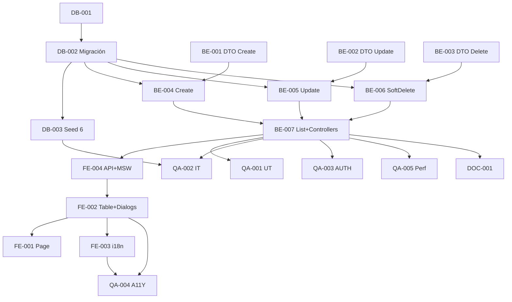

# Development Tasks — PB-P1-043 / US-076: CRUD admin EventType

## 1. Metadata

| Field | Value |
|---|---|
| User Story ID | US-076 |
| Source User Story | `management/user-stories/US-076-admin-manage-event-types.md` |
| Source Technical Specification | `management/technical-specs/P1/PB-P1-043/US-076-technical-spec.md` |
| Decision Resolution Artifact | `management/user-stories/decision-resolutions/US-076-decision-resolution.md` |
| Priority | P1 |
| Backlog ID | PB-P1-043 |
| Backlog Title | Gestión de EventType (sin hard delete con eventos) |
| Backlog Execution Order | 76 |
| User Story Position in Backlog Item | 1 de 1 |
| Related User Stories in Backlog Item | US-076 |
| Epic | EPIC-ADM-001 |
| Backlog Item Dependencies | PB-P0-001, US-067, US-075 |
| Feature | CRUD admin + endpoint público + guard EXISTS events |
| Module / Domain | Admin / Catalog |
| Backlog Alignment Status | Found |
| Task Breakdown Status | Ready for Sprint Planning |
| Created Date | 2026-06-29 |
| Last Updated | 2026-06-29 |

---

## 2. Source Validation

| Source | Found | Used | Notes |
|---|---|---|---|
| User Story | Yes | Yes | Approved with Minor Notes. |
| Technical Specification | Yes | Yes | Ready for Task Breakdown. |
| Decision Resolution Artifact | Yes | Yes | 10/10 decisiones. |
| Product Backlog Prioritized | Yes | Yes | PB-P1-043. |

---

## 3. Backlog Execution Context

PB-P1-043 single-story. Execution order 76. Pattern paridad US-075 sin jerarquía.

---

## 4. Task Breakdown Summary

| Area | Count | Notes |
|---|---:|---|
| DB | 3 | Verify + migración + seed 6 obligatorios |
| BE | 6 | DTOs(3) + 4 UseCases + 2 Controllers |
| FE | 4 | Page, Table, 2 Dialogs, API+MSW+i18n |
| QA | 5 | UT, IT, AUTH, A11Y, Performance |
| DOC | 1 | `docs/16` + `docs/14` |
| **Total** | 19 | |

---

## 5. Traceability Matrix

| AC | Task IDs |
|---|---|
| AC-01 create | BE-004, QA-002 |
| AC-02 update | BE-005, QA-002 |
| AC-03 soft delete con guard | BE-006, QA-002 |
| AC-04 listado admin | BE-007, QA-002 |
| AC-05 listado público | BE-007, QA-002 |
| EC-01..05 | BE-001/002/003, QA-002 |
| Seed 6 obligatorios | DB-003, QA-002 |
| AUTH | QA-003 |
| A11Y | FE-002/003/004, QA-004 |

---

## 6. Development Tasks

### TASK-PB-P1-043-US-076-DB-001 — Verificar schema event_types

| Field | Value |
|---|---|
| Area | Database / Prisma |
| Type | Review |
| Priority | Must |
| Estimate | XS |
| Depends On | PB-P0-001 |
| Source AC(s) | All |
| Technical Spec Section(s) | §10 |
| Backlog ID | PB-P1-043 |
| User Story ID | US-076 |
| Owner Role | Backend |
| Status | To Do |

#### Definition of Done
- [ ] Pass o issues.

---

### TASK-PB-P1-043-US-076-DB-002 — Migración i18n + audit columns

| Field | Value |
|---|---|
| Area | Database / Prisma |
| Type | Implementation |
| Priority | Must |
| Estimate | S |
| Depends On | DB-001 |
| Source AC(s) | All |
| Technical Spec Section(s) | §10 |
| Backlog ID | PB-P1-043 |
| User Story ID | US-076 |
| Owner Role | Backend |
| Status | To Do |

#### Definition of Done
- [ ] Migración aplica.
- [ ] UNIQUE code.

---

### TASK-PB-P1-043-US-076-DB-003 — Seed obligatorio 6 EventTypes (FR-EVENT-013)

| Field | Value |
|---|---|
| Area | Database / Seed |
| Type | Implementation |
| Priority | Must |
| Estimate | S |
| Depends On | DB-002 |
| Source AC(s) | TS-06 |
| Technical Spec Section(s) | §15 |
| Backlog ID | PB-P1-043 |
| User Story ID | US-076 |
| Owner Role | Backend / Content |
| Status | To Do |

#### Objective
6 EventTypes con codes fijos (`wedding, xv, baptism, baby_shower, birthday, corporate`) + i18n 4 locales.

#### Definition of Done
- [ ] Seed reproducible.

---

### TASK-PB-P1-043-US-076-BE-001 — DTO create

| Field | Value |
|---|---|
| Area | Backend |
| Type | Implementation |
| Priority | Must |
| Estimate | XS |
| Depends On | - |
| Source AC(s) | EC-02, EC-03 |
| Technical Spec Section(s) | §7 |
| Backlog ID | PB-P1-043 |
| User Story ID | US-076 |
| Owner Role | Backend |
| Status | To Do |

#### Definition of Done
- [ ] DTO + UT.

---

### TASK-PB-P1-043-US-076-BE-002 — DTO update

| Field | Value |
|---|---|
| Area | Backend |
| Type | Implementation |
| Priority | Must |
| Estimate | XS |
| Depends On | - |
| Source AC(s) | AC-02 |
| Technical Spec Section(s) | §7 |
| Backlog ID | PB-P1-043 |
| User Story ID | US-076 |
| Owner Role | Backend |
| Status | To Do |

#### Definition of Done
- [ ] DTO + UT.

---

### TASK-PB-P1-043-US-076-BE-003 — DTO delete

| Field | Value |
|---|---|
| Area | Backend |
| Type | Implementation |
| Priority | Must |
| Estimate | XS |
| Depends On | - |
| Source AC(s) | AC-03, EC-05 |
| Technical Spec Section(s) | §7 |
| Backlog ID | PB-P1-043 |
| User Story ID | US-076 |
| Owner Role | Backend |
| Status | To Do |

#### Definition of Done
- [ ] DTO + UT.

---

### TASK-PB-P1-043-US-076-BE-004 — `CreateEventTypeUseCase` + AdminAction

| Field | Value |
|---|---|
| Area | Backend |
| Type | Implementation |
| Priority | Must |
| Estimate | S |
| Depends On | BE-001, DB-002 |
| Source AC(s) | AC-01, EC-02 |
| Technical Spec Section(s) | §7 |
| Backlog ID | PB-P1-043 |
| User Story ID | US-076 |
| Owner Role | Backend |
| Status | To Do |

#### Definition of Done
- [ ] UT.

---

### TASK-PB-P1-043-US-076-BE-005 — `UpdateEventTypeUseCase` con reactivate detection

| Field | Value |
|---|---|
| Area | Backend |
| Type | Implementation |
| Priority | Must |
| Estimate | S |
| Depends On | BE-002, DB-002 |
| Source AC(s) | AC-02 |
| Technical Spec Section(s) | §7 |
| Backlog ID | PB-P1-043 |
| User Story ID | US-076 |
| Owner Role | Backend |
| Status | To Do |

#### Definition of Done
- [ ] UT.

---

### TASK-PB-P1-043-US-076-BE-006 — `SoftDeleteEventTypeUseCase` con guard EXISTS events

| Field | Value |
|---|---|
| Area | Backend |
| Type | Implementation |
| Priority | Must |
| Estimate | S |
| Depends On | BE-003, DB-002 |
| Source AC(s) | AC-03, EC-01 |
| Technical Spec Section(s) | §7 |
| Backlog ID | PB-P1-043 |
| User Story ID | US-076 |
| Owner Role | Backend |
| Status | To Do |

#### Definition of Done
- [ ] UT cubre guard + AdminAction.

---

### TASK-PB-P1-043-US-076-BE-007 — `ListEventTypesUseCase` + Controllers + 5 rutas

| Field | Value |
|---|---|
| Area | Backend |
| Type | Implementation |
| Priority | Must |
| Estimate | M |
| Depends On | BE-004, BE-005, BE-006, US-067 (AdminGuard) |
| Source AC(s) | AC-04, AC-05 |
| Technical Spec Section(s) | §7 |
| Backlog ID | PB-P1-043 |
| User Story ID | US-076 |
| Owner Role | Backend |
| Status | To Do |

#### Definition of Done
- [ ] 5 rutas operativas.

---

### TASK-PB-P1-043-US-076-FE-001 — Page `/admin/event-types`

| Field | Value |
|---|---|
| Area | Frontend |
| Type | Implementation |
| Priority | Must |
| Estimate | S |
| Depends On | FE-002, FE-004 |
| Source AC(s) | AC-04 |
| Technical Spec Section(s) | §8 |
| Backlog ID | PB-P1-043 |
| User Story ID | US-076 |
| Owner Role | Frontend |
| Status | To Do |

#### Definition of Done
- [ ] Page renderiza.

---

### TASK-PB-P1-043-US-076-FE-002 — `EventTypeTable` + form/delete dialogs

| Field | Value |
|---|---|
| Area | Frontend |
| Type | Implementation |
| Priority | Must |
| Estimate | M |
| Depends On | FE-004 |
| Source AC(s) | AC-01..03, A11Y |
| Technical Spec Section(s) | §8 |
| Backlog ID | PB-P1-043 |
| User Story ID | US-076 |
| Owner Role | Frontend |
| Status | To Do |

#### Objective
Tabla simple + 2 dialogs accesibles con i18n multi-locale.

#### Definition of Done
- [ ] axe sin issues.

---

### TASK-PB-P1-043-US-076-FE-003 — i18n 4 locales

| Field | Value |
|---|---|
| Area | Frontend / i18n |
| Type | Implementation |
| Priority | Must |
| Estimate | S |
| Depends On | FE-002 |
| Source AC(s) | i18n |
| Technical Spec Section(s) | §8 |
| Backlog ID | PB-P1-043 |
| User Story ID | US-076 |
| Owner Role | Frontend |
| Status | To Do |

#### Definition of Done
- [ ] 4 locales completos (`admin.event-type.*`).

---

### TASK-PB-P1-043-US-076-FE-004 — `adminApi.eventType.*` + público + MSW

| Field | Value |
|---|---|
| Area | Frontend |
| Type | Implementation |
| Priority | Must |
| Estimate | S |
| Depends On | BE-007 |
| Source AC(s) | All |
| Technical Spec Section(s) | §8 |
| Backlog ID | PB-P1-043 |
| User Story ID | US-076 |
| Owner Role | Frontend |
| Status | To Do |

#### Definition of Done
- [ ] MSW handlers.

---

### TASK-PB-P1-043-US-076-QA-001 — UT (DTOs + UseCases)

| Field | Value |
|---|---|
| Area | QA |
| Type | Test |
| Priority | Must |
| Estimate | M |
| Depends On | BE-007 |
| Source AC(s) | Múltiples |
| Technical Spec Section(s) | §13 |
| Backlog ID | PB-P1-043 |
| User Story ID | US-076 |
| Owner Role | QA / Backend |
| Status | To Do |

#### Definition of Done
- [ ] Coverage ≥ 90%.

---

### TASK-PB-P1-043-US-076-QA-002 — IT (CRUD + guard + AdminAction + seed)

| Field | Value |
|---|---|
| Area | QA |
| Type | Test |
| Priority | Must |
| Estimate | M |
| Depends On | BE-007, DB-003 |
| Source AC(s) | AC-01..05, EC-01..05 |
| Technical Spec Section(s) | §13 |
| Backlog ID | PB-P1-043 |
| User Story ID | US-076 |
| Owner Role | QA |
| Status | To Do |

#### Definition of Done
- [ ] Seed 6 verificado + guards.

---

### TASK-PB-P1-043-US-076-QA-003 — Authorization tests

| Field | Value |
|---|---|
| Area | QA / Security |
| Type | Test |
| Priority | Must |
| Estimate | S |
| Depends On | BE-007 |
| Source AC(s) | AUTH-TS-01..04 |
| Technical Spec Section(s) | §12 |
| Backlog ID | PB-P1-043 |
| User Story ID | US-076 |
| Owner Role | QA |
| Status | To Do |

#### Definition of Done
- [ ] Admin only + auth público.

---

### TASK-PB-P1-043-US-076-QA-004 — Accessibility

| Field | Value |
|---|---|
| Area | QA / A11Y |
| Type | Test |
| Priority | Must |
| Estimate | S |
| Depends On | FE-002, FE-003 |
| Source AC(s) | A11Y |
| Technical Spec Section(s) | §13 |
| Backlog ID | PB-P1-043 |
| User Story ID | US-076 |
| Owner Role | QA / Frontend |
| Status | To Do |

#### Definition of Done
- [ ] axe sin issues serios.

---

### TASK-PB-P1-043-US-076-QA-005 — Performance < 500ms p95

| Field | Value |
|---|---|
| Area | QA / Performance |
| Type | Test |
| Priority | Should |
| Estimate | S |
| Depends On | BE-007 |
| Source AC(s) | NFR-PERF-001 |
| Technical Spec Section(s) | §13 |
| Backlog ID | PB-P1-043 |
| User Story ID | US-076 |
| Owner Role | QA |
| Status | To Do |

#### Definition of Done
- [ ] p95 < 500ms.

---

### TASK-PB-P1-043-US-076-DOC-001 — Documentar endpoints + módulo

| Field | Value |
|---|---|
| Area | Documentation |
| Type | Documentation |
| Priority | Must |
| Estimate | S |
| Depends On | BE-007 |
| Source AC(s) | All |
| Technical Spec Section(s) | §16 |
| Backlog ID | PB-P1-043 |
| User Story ID | US-076 |
| Owner Role | Backend / Doc |
| Status | To Do |

#### Definition of Done
- [ ] `docs/16` + `docs/14`.

---

## 7. Required QA Tasks
Ver §6.

## 8. Required Security Tasks
| Task ID | Concern |
|---|---|
| TASK-PB-P1-043-US-076-QA-003 | Admin only + auth público |

## 9. Required Seed / Demo Tasks
| Task ID | Concern |
|---|---|
| TASK-PB-P1-043-US-076-DB-003 | Seed obligatorio 6 EventTypes (FR-EVENT-013) |

## 10. Observability / Audit Tasks
Logs incluidos en BE-004..007.

## 11. Documentation / Traceability Tasks
| Task ID | Doc |
|---|---|
| TASK-PB-P1-043-US-076-DOC-001 | `docs/16` + `docs/14` |

## 12. Dependency Graph

---

## 13. Suggested Implementation Order

**Phase 1**: DB-001, DB-002, DB-003, BE-001/002/003.
**Phase 2**: BE-004/005/006/007, FE-004, FE-002/003, FE-001.
**Phase 3**: QA-001..005.
**Phase 4**: DOC-001.

---

## 14. Risks & Mitigations
Ver §17 del Technical Spec.

## 15. Out of Scope Confirmation
Hard delete, jerarquía, bulk, AI.

## 16. Readiness for Sprint Planning

| Check | Status |
|---|---|
| Product Backlog mapping found | Pass |
| Every AC maps to tasks | Pass |
| Technical Spec used when available | Pass |
| QA tasks included | Pass |
| Security tasks included | Pass |
| Seed tasks included | Pass |
| Documentation tasks included | Pass |
| Task dependencies clear | Pass |
| Ready for Sprint Planning | Yes |

---

## 17. Final Recommendation

`Ready for Sprint Planning`.

US-076 entrega 19 tareas: CRUD admin + endpoint público + 4 UseCases con AdminAction + guard EXISTS events + seed obligatorio 6 EventTypes culturales LATAM (FR-EVENT-013). **PB-P1-043 cierra**. Pattern paridad con US-075 sin jerarquía. **EPIC-ADM-001 — Admin Governance avanza con: US-067/US-077 (reviews moderation), US-047/US-074 (vendors moderation), US-075 (ServiceCategory CRUD), US-076 (EventType CRUD)**.
