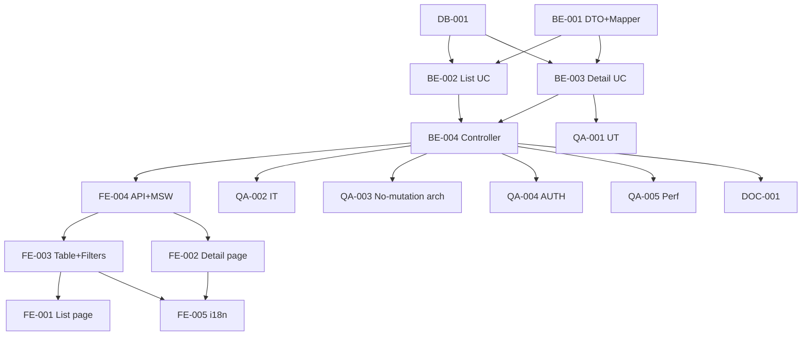

# Development Tasks — PB-P1-044 / US-078: Admin Events Read-Only

## 1. Metadata

| Field | Value |
|---|---|
| User Story ID | US-078 |
| Source User Story | `management/user-stories/US-078-admin-list-events-readonly.md` |
| Source Technical Specification | `management/technical-specs/P1/PB-P1-044/US-078-technical-spec.md` |
| Decision Resolution Artifact | `management/user-stories/decision-resolutions/US-078-decision-resolution.md` |
| Priority | P1 |
| Backlog ID | PB-P1-044 |
| Backlog Title | Admin: listado de eventos en solo lectura |
| Backlog Execution Order | 78 |
| User Story Position in Backlog Item | 1 de 1 |
| Related User Stories in Backlog Item | US-078 |
| Epic | EPIC-ADM-001 |
| Backlog Item Dependencies | PB-P0-001, US-067, US-066/US-077 |
| Feature | 2 endpoints admin read-only + AdminAction(view_event) en detail |
| Module / Domain | Admin / Events |
| Backlog Alignment Status | Found |
| Task Breakdown Status | Ready for Sprint Planning |
| Created Date | 2026-06-29 |
| Last Updated | 2026-06-29 |

---

## 2. Source Validation

| Source | Found | Used | Notes |
|---|---|---|---|
| User Story | Yes | Yes | Approved with Minor Notes. |
| Technical Specification | Yes | Yes | Ready for Task Breakdown. |
| Decision Resolution Artifact | Yes | Yes | 8/8 decisiones. |
| Product Backlog Prioritized | Yes | Yes | PB-P1-044. |

---

## 3. Backlog Execution Context

PB-P1-044 single-story. Execution order 78.

---

## 4. Task Breakdown Summary

| Area | Count | Notes |
|---|---:|---|
| DB | 1 | Verify indexes |
| BE | 4 | DTOs+Mapper, 2 UseCases, Controller |
| FE | 5 | List page, Detail page, Table, FiltersPanel + CountsCards, API+MSW+i18n |
| QA | 5 | UT, IT (incluye verificación arquitectónica), AUTH, A11Y, Performance |
| DOC | 1 | `docs/16` + `docs/14` |
| **Total** | 16 | |

---

## 5. Traceability Matrix

| AC | Task IDs |
|---|---|
| AC-01 list | BE-002, BE-004, QA-002 |
| AC-02 detail + AdminAction | BE-003, BE-004, QA-002 |
| AC-03 solo lectura arquitectónico | BE-004 (router solo GETs), QA-003 |
| AC-04 múltiples AdminActions | BE-003, QA-002 |
| EC-01..05 | BE-001 DTOs, QA-002 |
| AUTH | QA-004 |

---

## 6. Development Tasks

### TASK-PB-P1-044-US-078-DB-001 — Verificar índices events

| Field | Value |
|---|---|
| Area | Database / Prisma |
| Type | Review |
| Priority | Must |
| Estimate | XS |
| Depends On | PB-P0-001 |
| Source AC(s) | NFR-PERF-001 |
| Technical Spec Section(s) | §10 |
| Backlog ID | PB-P1-044 |
| User Story ID | US-078 |
| Owner Role | Backend |
| Status | To Do |

#### Objective
Confirmar `(status, event_date DESC)` + `(event_type_id)`.

#### Definition of Done
- [ ] Pass o issues.

---

### TASK-PB-P1-044-US-078-BE-001 — DTO + Mapper (list item + detail)

| Field | Value |
|---|---|
| Area | Backend |
| Type | Implementation |
| Priority | Must |
| Estimate | M |
| Depends On | US-066 (cursor) |
| Source AC(s) | AC-01, AC-02, EC-03..05 |
| Technical Spec Section(s) | §7 |
| Backlog ID | PB-P1-044 |
| User Story ID | US-078 |
| Owner Role | Backend |
| Status | To Do |

#### Definition of Done
- [ ] DTOs + Mappers + UT.

---

### TASK-PB-P1-044-US-078-BE-002 — `ListEventsForAdminUseCase`

| Field | Value |
|---|---|
| Area | Backend |
| Type | Implementation |
| Priority | Must |
| Estimate | M |
| Depends On | BE-001, DB-001 |
| Source AC(s) | AC-01 |
| Technical Spec Section(s) | §7 |
| Backlog ID | PB-P1-044 |
| User Story ID | US-078 |
| Owner Role | Backend |
| Status | To Do |

#### Definition of Done
- [ ] UT cubre filtros combinados + cursor.

---

### TASK-PB-P1-044-US-078-BE-003 — `GetEventDetailForAdminUseCase` con AdminAction atómico

| Field | Value |
|---|---|
| Area | Backend |
| Type | Implementation |
| Priority | Must |
| Estimate | L |
| Depends On | BE-001, DB-001 |
| Source AC(s) | AC-02, AC-04 |
| Technical Spec Section(s) | §7 |
| Backlog ID | PB-P1-044 |
| User Story ID | US-078 |
| Owner Role | Backend |
| Status | To Do |

#### Objective
prisma.$transaction: SELECT detail (con _count + WHERE específicos) + INSERT AdminAction(view_event).

#### Definition of Done
- [ ] UT cubre counts correctos + AdminAction insertada.

---

### TASK-PB-P1-044-US-078-BE-004 — Controller + 2 GETs (SOLO 2 rutas)

| Field | Value |
|---|---|
| Area | Backend / API |
| Type | Implementation |
| Priority | Must |
| Estimate | S |
| Depends On | BE-002, BE-003, US-067 (AdminGuard) |
| Source AC(s) | AC-01..03 |
| Technical Spec Section(s) | §7 |
| Backlog ID | PB-P1-044 |
| User Story ID | US-078 |
| Owner Role | Backend |
| Status | To Do |

#### Objective
2 GETs únicamente. NO añadir POST/PATCH/DELETE.

#### Definition of Done
- [ ] Solo 2 rutas en el módulo admin/events.

---

### TASK-PB-P1-044-US-078-FE-001 — Page list `/admin/events`

| Field | Value |
|---|---|
| Area | Frontend |
| Type | Implementation |
| Priority | Must |
| Estimate | S |
| Depends On | FE-003, FE-004 |
| Source AC(s) | AC-01 |
| Technical Spec Section(s) | §8 |
| Backlog ID | PB-P1-044 |
| User Story ID | US-078 |
| Owner Role | Frontend |
| Status | To Do |

#### Definition of Done
- [ ] Page renderiza tabla + filtros.

---

### TASK-PB-P1-044-US-078-FE-002 — Page detail `/admin/events/:id` con CountsCards

| Field | Value |
|---|---|
| Area | Frontend |
| Type | Implementation |
| Priority | Must |
| Estimate | M |
| Depends On | FE-004 |
| Source AC(s) | AC-02 |
| Technical Spec Section(s) | §8 |
| Backlog ID | PB-P1-044 |
| User Story ID | US-078 |
| Owner Role | Frontend |
| Status | To Do |

#### Definition of Done
- [ ] Detail accesible con counts cards.

---

### TASK-PB-P1-044-US-078-FE-003 — `AdminEventTable` + `AdminEventFiltersPanel`

| Field | Value |
|---|---|
| Area | Frontend |
| Type | Implementation |
| Priority | Must |
| Estimate | M |
| Depends On | FE-004 |
| Source AC(s) | AC-01, A11Y |
| Technical Spec Section(s) | §8 |
| Backlog ID | PB-P1-044 |
| User Story ID | US-078 |
| Owner Role | Frontend |
| Status | To Do |

#### Definition of Done
- [ ] axe sin issues.

---

### TASK-PB-P1-044-US-078-FE-004 — `adminApi.event.list/get` + MSW

| Field | Value |
|---|---|
| Area | Frontend |
| Type | Implementation |
| Priority | Must |
| Estimate | S |
| Depends On | BE-004 |
| Source AC(s) | AC-01, AC-02 |
| Technical Spec Section(s) | §8 |
| Backlog ID | PB-P1-044 |
| User Story ID | US-078 |
| Owner Role | Frontend |
| Status | To Do |

#### Definition of Done
- [ ] MSW handlers.

---

### TASK-PB-P1-044-US-078-FE-005 — i18n `admin.event.*` (4 locales)

| Field | Value |
|---|---|
| Area | Frontend / i18n |
| Type | Implementation |
| Priority | Must |
| Estimate | S |
| Depends On | FE-002, FE-003 |
| Source AC(s) | i18n |
| Technical Spec Section(s) | §8 |
| Backlog ID | PB-P1-044 |
| User Story ID | US-078 |
| Owner Role | Frontend |
| Status | To Do |

#### Definition of Done
- [ ] 4 locales.

---

### TASK-PB-P1-044-US-078-QA-001 — UT (DTOs + Mapper + UseCases)

| Field | Value |
|---|---|
| Area | QA |
| Type | Test |
| Priority | Must |
| Estimate | M |
| Depends On | BE-003 |
| Source AC(s) | Múltiples |
| Technical Spec Section(s) | §13 |
| Backlog ID | PB-P1-044 |
| User Story ID | US-078 |
| Owner Role | QA / Backend |
| Status | To Do |

#### Definition of Done
- [ ] Coverage ≥ 90%.

---

### TASK-PB-P1-044-US-078-QA-002 — IT (list + detail + AdminAction verification)

| Field | Value |
|---|---|
| Area | QA |
| Type | Test |
| Priority | Must |
| Estimate | M |
| Depends On | BE-004 |
| Source AC(s) | AC-01..04 |
| Technical Spec Section(s) | §13 |
| Backlog ID | PB-P1-044 |
| User Story ID | US-078 |
| Owner Role | QA |
| Status | To Do |

#### Definition of Done
- [ ] AdminAction(view_event) creada por cada detail GET.
- [ ] Counts correctos.

---

### TASK-PB-P1-044-US-078-QA-003 — Architectural test: NO existen endpoints de mutación admin/events

| Field | Value |
|---|---|
| Area | QA / Security |
| Type | Test |
| Priority | Must |
| Estimate | S |
| Depends On | BE-004 |
| Source AC(s) | AC-03 |
| Technical Spec Section(s) | §17 |
| Backlog ID | PB-P1-044 |
| User Story ID | US-078 |
| Owner Role | QA / Security |
| Status | To Do |

#### Objective
Verificar:
- `POST /api/v1/admin/events` ⇒ 404.
- `PATCH /api/v1/admin/events/:id` ⇒ 404.
- `DELETE /api/v1/admin/events/:id` ⇒ 404.

#### Definition of Done
- [ ] FR-EVENT-010 enforcement verificado.

---

### TASK-PB-P1-044-US-078-QA-004 — Authorization tests

| Field | Value |
|---|---|
| Area | QA / Security |
| Type | Test |
| Priority | Must |
| Estimate | S |
| Depends On | BE-004 |
| Source AC(s) | AUTH-TS-01..04 |
| Technical Spec Section(s) | §12 |
| Backlog ID | PB-P1-044 |
| User Story ID | US-078 |
| Owner Role | QA |
| Status | To Do |

#### Definition of Done
- [ ] Admin only.

---

### TASK-PB-P1-044-US-078-QA-005 — Performance (list < 500ms, detail < 700ms p95)

| Field | Value |
|---|---|
| Area | QA / Performance |
| Type | Test |
| Priority | Should |
| Estimate | S |
| Depends On | BE-004 |
| Source AC(s) | NFR-PERF-001 |
| Technical Spec Section(s) | §13 |
| Backlog ID | PB-P1-044 |
| User Story ID | US-078 |
| Owner Role | QA |
| Status | To Do |

#### Definition of Done
- [ ] List p95 < 500ms; detail p95 < 700ms.

---

### TASK-PB-P1-044-US-078-DOC-001 — Documentar 2 endpoints + arquitectura solo lectura

| Field | Value |
|---|---|
| Area | Documentation |
| Type | Documentation |
| Priority | Must |
| Estimate | S |
| Depends On | BE-004 |
| Source AC(s) | All |
| Technical Spec Section(s) | §16 |
| Backlog ID | PB-P1-044 |
| User Story ID | US-078 |
| Owner Role | Backend / Doc |
| Status | To Do |

#### Definition of Done
- [ ] `docs/16` + `docs/14`.

---

## 7. Required QA Tasks
Ver §6.

## 8. Required Security Tasks
| Task ID | Concern |
|---|---|
| TASK-PB-P1-044-US-078-QA-003 | FR-EVENT-010 enforcement (NO mutation endpoints) |
| TASK-PB-P1-044-US-078-QA-004 | Admin only |

## 9. Required Seed / Demo Tasks
`No aplica` (reuso). Verificar ~10 eventos en distintos estados para demo.

## 10. Observability / Audit Tasks
| Task ID | Concern |
|---|---|
| TASK-PB-P1-044-US-078-BE-003 | AdminAction(view_event) en detail |

## 11. Documentation / Traceability Tasks
| Task ID | Doc |
|---|---|
| TASK-PB-P1-044-US-078-DOC-001 | `docs/16` + `docs/14` |

## 12. Dependency Graph

---

## 13. Suggested Implementation Order

**Phase 1**: DB-001, BE-001 DTO+Mapper.
**Phase 2**: BE-002/003 UseCases, BE-004 Controller (SOLO 2 GETs), FE-004, FE-003, FE-002, FE-001, FE-005 i18n.
**Phase 3**: QA-001..005.
**Phase 4**: DOC-001.

---

## 14. Risks & Mitigations
Ver §17 del Technical Spec.

## 15. Out of Scope Confirmation
Edición admin, export, drill-down completo.

## 16. Readiness for Sprint Planning

| Check | Status |
|---|---|
| Product Backlog mapping found | Pass |
| Every AC maps to tasks | Pass |
| Technical Spec used when available | Pass |
| QA tasks included | Pass |
| Security tasks included | Pass |
| Architectural test included | Pass |
| Documentation tasks included | Pass |
| Task dependencies clear | Pass |
| Ready for Sprint Planning | Yes |

---

## 17. Final Recommendation

`Ready for Sprint Planning`.

US-078 entrega 16 tareas: 2 endpoints admin read-only + AdminAction(view_event) en detail + arquitectura solo lectura enforcement (QA-003 test que verifica NO endpoints mutación). **PB-P1-044 cierra**. EPIC-ADM-001 acumula otra US estable.
