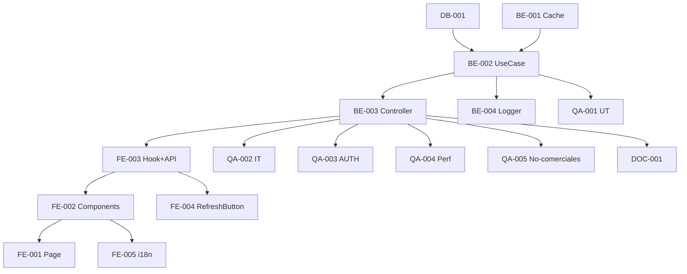

# Development Tasks — PB-P1-045 / US-079: Admin Metrics Dashboard

## 1. Metadata

| Field | Value |
|---|---|
| User Story ID | US-079 |
| Source User Story | `management/user-stories/US-079-admin-operational-metrics-dashboard.md` |
| Source Technical Specification | `management/technical-specs/P1/PB-P1-045/US-079-technical-spec.md` |
| Decision Resolution Artifact | `management/user-stories/decision-resolutions/US-079-decision-resolution.md` |
| Priority | P1 |
| Backlog ID | PB-P1-045 |
| Backlog Title | Dashboard de métricas operativas admin |
| Backlog Execution Order | 79 |
| User Story Position in Backlog Item | 1 de 1 |
| Related User Stories in Backlog Item | US-079 |
| Epic | EPIC-ADM-001 |
| Backlog Item Dependencies | PB-P0-001, US-067 |
| Feature | Endpoint admin metrics + caching 60s |
| Module / Domain | Admin / Metrics |
| Backlog Alignment Status | Found |
| Task Breakdown Status | Ready for Sprint Planning |
| Created Date | 2026-06-29 |
| Last Updated | 2026-06-29 |

---

## 2. Source Validation

| Source | Found | Used | Notes |
|---|---|---|---|
| User Story | Yes | Yes | Approved with Minor Notes. |
| Technical Specification | Yes | Yes | Ready for Task Breakdown. |
| Decision Resolution Artifact | Yes | Yes | 8/8 decisiones. |
| Product Backlog Prioritized | Yes | Yes | PB-P1-045. |

---

## 3. Backlog Execution Context

PB-P1-045 single-story. Execution order 79.

---

## 4. Task Breakdown Summary

| Area | Count | Notes |
|---|---:|---|
| DB | 1 | Verify indexes status |
| BE | 4 | CacheService, UseCase, Controller, Logger |
| FE | 5 | Page, Dashboard, MetricCard, AIMetricsCard, API+MSW+i18n |
| QA | 5 | UT, IT, AUTH, Performance, Security (no-comerciales) |
| DOC | 1 | `docs/16` + `docs/14` |
| **Total** | 16 | |

---

## 5. Traceability Matrix

| AC | Task IDs |
|---|---|
| AC-01 7 secciones | BE-002 UseCase, QA-002 |
| AC-02 cache hit | BE-001 Cache, QA-002 |
| AC-03 cache miss | BE-001 Cache, QA-002 |
| AC-04 AI breakdown | BE-002, QA-002 |
| AC-05 sin comerciales | QA-005 |
| EC-01 sistema vacío | QA-002 |
| AUTH | QA-003 |
| Performance | QA-004 |

---

## 6. Development Tasks

### TASK-PB-P1-045-US-079-DB-001 — Verificar indexes status

| Field | Value |
|---|---|
| Area | Database / Prisma |
| Type | Review |
| Priority | Must |
| Estimate | XS |
| Depends On | PB-P0-001 |
| Source AC(s) | NFR-PERF-001 |
| Technical Spec Section(s) | §10 |
| Backlog ID | PB-P1-045 |
| User Story ID | US-079 |
| Owner Role | Backend |
| Status | To Do |

#### Definition of Done
- [ ] Pass o issues.

---

### TASK-PB-P1-045-US-079-BE-001 — `MetricsCacheService` (in-memory TTL)

| Field | Value |
|---|---|
| Area | Backend |
| Type | Implementation |
| Priority | Must |
| Estimate | S |
| Depends On | - |
| Source AC(s) | AC-02, AC-03 |
| Technical Spec Section(s) | §7 |
| Backlog ID | PB-P1-045 |
| User Story ID | US-079 |
| Owner Role | Backend |
| Status | To Do |

#### Definition of Done
- [ ] Service + UT cubriendo get/set/expiration.

---

### TASK-PB-P1-045-US-079-BE-002 — `GetAdminMetricsUseCase` con 7 sub-queries

| Field | Value |
|---|---|
| Area | Backend |
| Type | Implementation |
| Priority | Must |
| Estimate | L |
| Depends On | BE-001, DB-001 |
| Source AC(s) | AC-01, AC-04 |
| Technical Spec Section(s) | §7 |
| Backlog ID | PB-P1-045 |
| User Story ID | US-079 |
| Owner Role | Backend |
| Status | To Do |

#### Objective
7 métodos compute* + Promise.all + cache wrap + AI breakdown con success_count.

#### Definition of Done
- [ ] UT cubre cada sección.

---

### TASK-PB-P1-045-US-079-BE-003 — Controller + ruta + Cache-Control header

| Field | Value |
|---|---|
| Area | Backend / API |
| Type | Implementation |
| Priority | Must |
| Estimate | S |
| Depends On | BE-002, US-067 (AdminGuard) |
| Source AC(s) | AC-01 |
| Technical Spec Section(s) | §7 |
| Backlog ID | PB-P1-045 |
| User Story ID | US-079 |
| Owner Role | Backend |
| Status | To Do |

#### Definition of Done
- [ ] Ruta operativa + header `Cache-Control: private, max-age=60`.

---

### TASK-PB-P1-045-US-079-BE-004 — Logger eventos cache

| Field | Value |
|---|---|
| Area | Backend / Observability |
| Type | Implementation |
| Priority | Must |
| Estimate | XS |
| Depends On | BE-002 |
| Source AC(s) | AC-02, AC-03 |
| Technical Spec Section(s) | §14 |
| Backlog ID | PB-P1-045 |
| User Story ID | US-079 |
| Owner Role | Backend |
| Status | To Do |

#### Definition of Done
- [ ] `admin.metrics.viewed/cache.hit/cache.miss` emitidos.

---

### TASK-PB-P1-045-US-079-FE-001 — Page `/admin/metrics`

| Field | Value |
|---|---|
| Area | Frontend |
| Type | Implementation |
| Priority | Must |
| Estimate | S |
| Depends On | FE-002 |
| Source AC(s) | AC-01 |
| Technical Spec Section(s) | §8 |
| Backlog ID | PB-P1-045 |
| User Story ID | US-079 |
| Owner Role | Frontend |
| Status | To Do |

#### Definition of Done
- [ ] Page renderiza dashboard.

---

### TASK-PB-P1-045-US-079-FE-002 — `MetricsDashboard` + `MetricCard` + `AIMetricsCard`

| Field | Value |
|---|---|
| Area | Frontend |
| Type | Implementation |
| Priority | Must |
| Estimate | M |
| Depends On | FE-003 |
| Source AC(s) | AC-01, AC-04, A11Y |
| Technical Spec Section(s) | §8 |
| Backlog ID | PB-P1-045 |
| User Story ID | US-079 |
| Owner Role | Frontend |
| Status | To Do |

#### Objective
Grid responsive con 7 cards + AI card especial con breakdown.

#### Definition of Done
- [ ] axe sin issues.
- [ ] Responsive verificado.

---

### TASK-PB-P1-045-US-079-FE-003 — `useAdminMetrics` hook + `adminApi.metrics.get` + MSW

| Field | Value |
|---|---|
| Area | Frontend |
| Type | Implementation |
| Priority | Must |
| Estimate | S |
| Depends On | BE-003 |
| Source AC(s) | AC-01 |
| Technical Spec Section(s) | §8 |
| Backlog ID | PB-P1-045 |
| User Story ID | US-079 |
| Owner Role | Frontend |
| Status | To Do |

#### Definition of Done
- [ ] `staleTime: 60_000` + MSW handlers.

---

### TASK-PB-P1-045-US-079-FE-004 — `RefreshButton` con manual refetch

| Field | Value |
|---|---|
| Area | Frontend |
| Type | Implementation |
| Priority | Should |
| Estimate | XS |
| Depends On | FE-003 |
| Source AC(s) | UI |
| Technical Spec Section(s) | §8 |
| Backlog ID | PB-P1-045 |
| User Story ID | US-079 |
| Owner Role | Frontend |
| Status | To Do |

#### Definition of Done
- [ ] Botón "Actualizar" funcional.

---

### TASK-PB-P1-045-US-079-FE-005 — i18n `admin.metrics.*` (4 locales)

| Field | Value |
|---|---|
| Area | Frontend / i18n |
| Type | Implementation |
| Priority | Must |
| Estimate | S |
| Depends On | FE-002 |
| Source AC(s) | i18n |
| Technical Spec Section(s) | §8 |
| Backlog ID | PB-P1-045 |
| User Story ID | US-079 |
| Owner Role | Frontend |
| Status | To Do |

#### Definition of Done
- [ ] 4 locales completos.

---

### TASK-PB-P1-045-US-079-QA-001 — UT (CacheService + UseCase)

| Field | Value |
|---|---|
| Area | QA |
| Type | Test |
| Priority | Must |
| Estimate | M |
| Depends On | BE-002 |
| Source AC(s) | AC-01..04 |
| Technical Spec Section(s) | §13 |
| Backlog ID | PB-P1-045 |
| User Story ID | US-079 |
| Owner Role | QA / Backend |
| Status | To Do |

#### Definition of Done
- [ ] Coverage ≥ 90%.

---

### TASK-PB-P1-045-US-079-QA-002 — IT (cache hit/miss + sistema vacío)

| Field | Value |
|---|---|
| Area | QA |
| Type | Test |
| Priority | Must |
| Estimate | M |
| Depends On | BE-003 |
| Source AC(s) | AC-01..05, EC-01 |
| Technical Spec Section(s) | §13 |
| Backlog ID | PB-P1-045 |
| User Story ID | US-079 |
| Owner Role | QA |
| Status | To Do |

#### Definition of Done
- [ ] Cache behavior verificado.

---

### TASK-PB-P1-045-US-079-QA-003 — Authorization tests

| Field | Value |
|---|---|
| Area | QA / Security |
| Type | Test |
| Priority | Must |
| Estimate | S |
| Depends On | BE-003 |
| Source AC(s) | AUTH-TS-01..04 |
| Technical Spec Section(s) | §12 |
| Backlog ID | PB-P1-045 |
| User Story ID | US-079 |
| Owner Role | QA |
| Status | To Do |

#### Definition of Done
- [ ] Admin only.

---

### TASK-PB-P1-045-US-079-QA-004 — Performance (cache hit < 200ms; miss < 3s)

| Field | Value |
|---|---|
| Area | QA / Performance |
| Type | Test |
| Priority | Should |
| Estimate | S |
| Depends On | BE-003 |
| Source AC(s) | NFR-PERF-001 |
| Technical Spec Section(s) | §13 |
| Backlog ID | PB-P1-045 |
| User Story ID | US-079 |
| Owner Role | QA |
| Status | To Do |

#### Objective
Setup ~10k registros/entidad. Verificar TTL behavior y latency.

#### Definition of Done
- [ ] Targets cumplidos.

---

### TASK-PB-P1-045-US-079-QA-005 — Security: NO métricas comerciales en response

| Field | Value |
|---|---|
| Area | QA / Security |
| Type | Test |
| Priority | Must |
| Estimate | XS |
| Depends On | BE-003 |
| Source AC(s) | AC-05 |
| Technical Spec Section(s) | §13 |
| Backlog ID | PB-P1-045 |
| User Story ID | US-079 |
| Owner Role | QA / Security |
| Status | To Do |

#### Objective
Assertion que response NO contiene `revenue, gmv, arpu, conversion_rate_*` ni fields monetarios.

#### Definition of Done
- [ ] Test verde.

---

### TASK-PB-P1-045-US-079-DOC-001 — Documentar endpoint + caching strategy

| Field | Value |
|---|---|
| Area | Documentation |
| Type | Documentation |
| Priority | Must |
| Estimate | S |
| Depends On | BE-003 |
| Source AC(s) | All |
| Technical Spec Section(s) | §16 |
| Backlog ID | PB-P1-045 |
| User Story ID | US-079 |
| Owner Role | Backend / Doc |
| Status | To Do |

#### Definition of Done
- [ ] `docs/16` + `docs/14`.

---

## 7. Required QA Tasks
Ver §6.

## 8. Required Security Tasks
| Task ID | Concern |
|---|---|
| TASK-PB-P1-045-US-079-QA-003 | Admin only |
| TASK-PB-P1-045-US-079-QA-005 | NO métricas comerciales |

## 9. Required Seed / Demo Tasks
`No aplica` (reuso).

## 10. Observability / Audit Tasks
| Task ID | Concern |
|---|---|
| TASK-PB-P1-045-US-079-BE-004 | Logs cache hit/miss |

## 11. Documentation / Traceability Tasks
| Task ID | Doc |
|---|---|
| TASK-PB-P1-045-US-079-DOC-001 | `docs/16` + `docs/14` |

## 12. Dependency Graph

---

## 13. Suggested Implementation Order

**Phase 1**: DB-001, BE-001 Cache.
**Phase 2**: BE-002 UseCase, BE-003 Controller, BE-004 Logger, FE-003 Hook+API, FE-002 Components, FE-004 RefreshButton, FE-001 Page, FE-005 i18n.
**Phase 3**: QA-001..005.
**Phase 4**: DOC-001.

---

## 14. Risks & Mitigations
Ver §17 del Technical Spec.

## 15. Out of Scope Confirmation
Métricas comerciales, filtros temporales, drill-down.

## 16. Readiness for Sprint Planning

| Check | Status |
|---|---|
| Product Backlog mapping found | Pass |
| Every AC maps to tasks | Pass |
| Technical Spec used when available | Pass |
| QA tasks included | Pass |
| Security tasks included | Pass |
| Performance tasks included | Pass |
| Documentation tasks included | Pass |
| Task dependencies clear | Pass |
| Ready for Sprint Planning | Yes |

---

## 17. Final Recommendation

`Ready for Sprint Planning`.

US-079 entrega 16 tareas: endpoint admin con 7 secciones agregadas + cache 60s + assertion explícita de NO métricas comerciales (QA-005). **PB-P1-045 cierra**. **EPIC-ADM-001 acumula 6 PBIs completas** (PB-P1-040/041/042/043/044/045): toda la gobernanza admin operativa.
