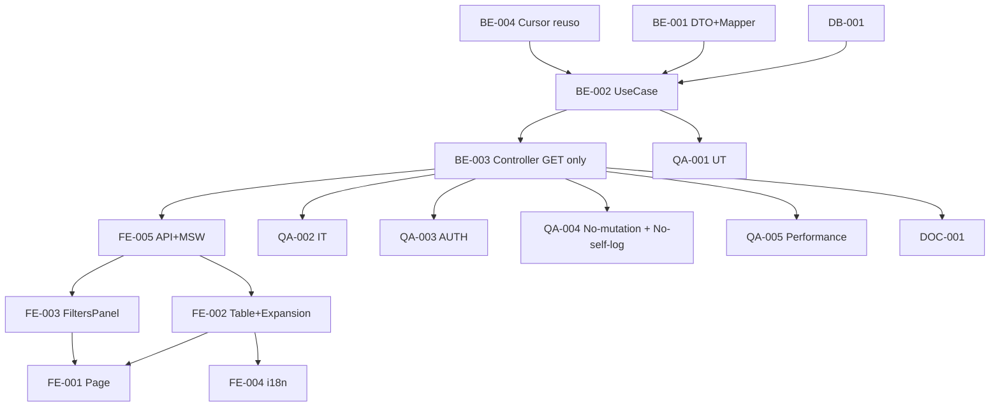

# Development Tasks — PB-P1-046 / US-080: AdminAction Log Viewer

## 1. Metadata

| Field | Value |
|---|---|
| User Story ID | US-080 |
| Source User Story | `management/user-stories/US-080-admin-action-log-viewer.md` |
| Source Technical Specification | `management/technical-specs/P1/PB-P1-046/US-080-technical-spec.md` |
| Decision Resolution Artifact | `management/user-stories/decision-resolutions/US-080-decision-resolution.md` |
| Priority | P1 |
| Backlog ID | PB-P1-046 |
| Backlog Title | Visor del log AdminAction |
| Backlog Execution Order | 80 |
| User Story Position in Backlog Item | 1 de 1 |
| Related User Stories in Backlog Item | US-080 |
| Epic | EPIC-ADM-001 |
| Backlog Item Dependencies | PB-P0-001, US-067, US-066/US-077 |
| Feature | Endpoint admin único listado audit log con filtros + cursor |
| Module / Domain | Admin / Audit |
| Backlog Alignment Status | Found |
| Task Breakdown Status | Ready for Sprint Planning |
| Created Date | 2026-06-29 |
| Last Updated | 2026-06-29 |

---

## 2. Source Validation

| Source | Found | Used | Notes |
|---|---|---|---|
| User Story | Yes | Yes | Approved with Minor Notes. |
| Technical Specification | Yes | Yes | Ready for Task Breakdown. |
| Decision Resolution Artifact | Yes | Yes | 8/8 decisiones. |
| Product Backlog Prioritized | Yes | Yes | PB-P1-046. |

---

## 3. Backlog Execution Context

PB-P1-046 single-story. Execution order 80. **Cierra EPIC-ADM-001**.

---

## 4. Task Breakdown Summary

| Area | Count | Notes |
|---|---:|---|
| DB | 1 | Verify indexes |
| BE | 4 | DTO+Mapper, UseCase, Controller, Cursor reuso |
| FE | 5 | Page, Table, FiltersPanel, RowExpansion, API+MSW+i18n |
| QA | 5 | UT, IT, AUTH, Architectural (no mutation + no self-log), Performance |
| DOC | 1 | `docs/16` + `docs/14` |
| **Total** | 16 | |

---

## 5. Traceability Matrix

| AC | Task IDs |
|---|---|
| AC-01 listado filtros | BE-002, BE-003, QA-002 |
| AC-02 admin info + payload | BE-001 Mapper, QA-002 |
| AC-03 inmutabilidad | BE-003 (router solo GET), QA-004 |
| AC-04 self-log evitado | BE-002, QA-004 |
| EC-01..04 | BE-001 DTO, QA-002 |
| AUTH | QA-003 |
| Performance | QA-005 |

---

## 6. Development Tasks

### TASK-PB-P1-046-US-080-DB-001 — Verificar/crear índices admin_actions

| Field | Value |
|---|---|
| Area | Database / Prisma |
| Type | Review/Implementation |
| Priority | Must |
| Estimate | S |
| Depends On | PB-P0-001 |
| Source AC(s) | NFR-PERF-001 |
| Technical Spec Section(s) | §10 |
| Backlog ID | PB-P1-046 |
| User Story ID | US-080 |
| Owner Role | Backend |
| Status | To Do |

#### Objective
Verificar `(created_at DESC)`, `(admin_id, created_at DESC)`, `(target_type, target_id, created_at DESC)`. Si faltan, migración menor.

#### Definition of Done
- [ ] Indexes presentes.

---

### TASK-PB-P1-046-US-080-BE-001 — DTO `adminActionsQuery` + Mapper

| Field | Value |
|---|---|
| Area | Backend |
| Type | Implementation |
| Priority | Must |
| Estimate | M |
| Depends On | US-066 (cursor) |
| Source AC(s) | AC-01, AC-02, EC-02..04 |
| Technical Spec Section(s) | §7 |
| Backlog ID | PB-P1-046 |
| User Story ID | US-080 |
| Owner Role | Backend |
| Status | To Do |

#### Definition of Done
- [ ] DTO + Mapper + UT.

---

### TASK-PB-P1-046-US-080-BE-002 — `ListAdminActionsUseCase` (sin self-log)

| Field | Value |
|---|---|
| Area | Backend |
| Type | Implementation |
| Priority | Must |
| Estimate | M |
| Depends On | BE-001, DB-001 |
| Source AC(s) | AC-01, AC-04 |
| Technical Spec Section(s) | §7 |
| Backlog ID | PB-P1-046 |
| User Story ID | US-080 |
| Owner Role | Backend |
| Status | To Do |

#### Objective
UseCase con filtros + cursor. **NO crear AdminAction al consultar** (evita loop).

#### Definition of Done
- [ ] UT cubre branches.
- [ ] UT verifica que NO se inserta AdminAction al ejecutar.

---

### TASK-PB-P1-046-US-080-BE-003 — Controller + ruta SOLO GET

| Field | Value |
|---|---|
| Area | Backend / API |
| Type | Implementation |
| Priority | Must |
| Estimate | S |
| Depends On | BE-002, US-067 (AdminGuard) |
| Source AC(s) | AC-01, AC-03 |
| Technical Spec Section(s) | §7 |
| Backlog ID | PB-P1-046 |
| User Story ID | US-080 |
| Owner Role | Backend |
| Status | To Do |

#### Objective
SOLO `router.get`. NO añadir POST/PATCH/DELETE.

#### Definition of Done
- [ ] Solo 1 ruta en el módulo.

---

### TASK-PB-P1-046-US-080-BE-004 — Reuso cursor utility (US-066)

| Field | Value |
|---|---|
| Area | Backend |
| Type | Refactor |
| Priority | Must |
| Estimate | XS |
| Depends On | US-066 |
| Source AC(s) | AC-01 |
| Technical Spec Section(s) | §7 |
| Backlog ID | PB-P1-046 |
| User Story ID | US-080 |
| Owner Role | Backend |
| Status | To Do |

#### Definition of Done
- [ ] Import correcto.

---

### TASK-PB-P1-046-US-080-FE-001 — Page `/admin/admin-actions`

| Field | Value |
|---|---|
| Area | Frontend |
| Type | Implementation |
| Priority | Must |
| Estimate | S |
| Depends On | FE-002, FE-005 |
| Source AC(s) | AC-01 |
| Technical Spec Section(s) | §8 |
| Backlog ID | PB-P1-046 |
| User Story ID | US-080 |
| Owner Role | Frontend |
| Status | To Do |

#### Definition of Done
- [ ] Page renderiza.

---

### TASK-PB-P1-046-US-080-FE-002 — `AdminActionsTable` + `AdminActionRowExpansion`

| Field | Value |
|---|---|
| Area | Frontend |
| Type | Implementation |
| Priority | Must |
| Estimate | M |
| Depends On | FE-005 |
| Source AC(s) | AC-01, AC-02, A11Y |
| Technical Spec Section(s) | §8 |
| Backlog ID | PB-P1-046 |
| User Story ID | US-080 |
| Owner Role | Frontend |
| Status | To Do |

#### Objective
Tabla cronológica con expand row para mostrar `payload` JSON.

#### Definition of Done
- [ ] axe sin issues.

---

### TASK-PB-P1-046-US-080-FE-003 — `AdminActionsFiltersPanel` con debounce

| Field | Value |
|---|---|
| Area | Frontend |
| Type | Implementation |
| Priority | Must |
| Estimate | M |
| Depends On | FE-005 |
| Source AC(s) | AC-01, A11Y |
| Technical Spec Section(s) | §8 |
| Backlog ID | PB-P1-046 |
| User Story ID | US-080 |
| Owner Role | Frontend |
| Status | To Do |

#### Definition of Done
- [ ] axe sin issues; debounce 300ms.

---

### TASK-PB-P1-046-US-080-FE-004 — i18n `admin.admin-actions.*` (4 locales)

| Field | Value |
|---|---|
| Area | Frontend / i18n |
| Type | Implementation |
| Priority | Must |
| Estimate | S |
| Depends On | FE-002, FE-003 |
| Source AC(s) | i18n |
| Technical Spec Section(s) | §8 |
| Backlog ID | PB-P1-046 |
| User Story ID | US-080 |
| Owner Role | Frontend |
| Status | To Do |

#### Definition of Done
- [ ] 4 locales.

---

### TASK-PB-P1-046-US-080-FE-005 — `adminApi.adminActions.list` + MSW

| Field | Value |
|---|---|
| Area | Frontend |
| Type | Implementation |
| Priority | Must |
| Estimate | S |
| Depends On | BE-003 |
| Source AC(s) | AC-01 |
| Technical Spec Section(s) | §8 |
| Backlog ID | PB-P1-046 |
| User Story ID | US-080 |
| Owner Role | Frontend |
| Status | To Do |

#### Definition of Done
- [ ] MSW handlers `200/400/401/403`.

---

### TASK-PB-P1-046-US-080-QA-001 — UT (DTO + Mapper + UseCase)

| Field | Value |
|---|---|
| Area | QA |
| Type | Test |
| Priority | Must |
| Estimate | M |
| Depends On | BE-002 |
| Source AC(s) | Múltiples |
| Technical Spec Section(s) | §13 |
| Backlog ID | PB-P1-046 |
| User Story ID | US-080 |
| Owner Role | QA / Backend |
| Status | To Do |

#### Definition of Done
- [ ] Coverage ≥ 90%.

---

### TASK-PB-P1-046-US-080-QA-002 — IT (filtros + cursor + admin info)

| Field | Value |
|---|---|
| Area | QA |
| Type | Test |
| Priority | Must |
| Estimate | M |
| Depends On | BE-003 |
| Source AC(s) | AC-01, AC-02 |
| Technical Spec Section(s) | §13 |
| Backlog ID | PB-P1-046 |
| User Story ID | US-080 |
| Owner Role | QA |
| Status | To Do |

#### Definition of Done
- [ ] Filtros combinados verificados.

---

### TASK-PB-P1-046-US-080-QA-003 — Authorization tests

| Field | Value |
|---|---|
| Area | QA / Security |
| Type | Test |
| Priority | Must |
| Estimate | S |
| Depends On | BE-003 |
| Source AC(s) | AUTH-TS-01..04 |
| Technical Spec Section(s) | §12 |
| Backlog ID | PB-P1-046 |
| User Story ID | US-080 |
| Owner Role | QA |
| Status | To Do |

#### Definition of Done
- [ ] Admin only.

---

### TASK-PB-P1-046-US-080-QA-004 — Architectural test: NO mutation + NO self-log

| Field | Value |
|---|---|
| Area | QA / Security |
| Type | Test |
| Priority | Must |
| Estimate | S |
| Depends On | BE-003 |
| Source AC(s) | AC-03, AC-04 |
| Technical Spec Section(s) | §17 |
| Backlog ID | PB-P1-046 |
| User Story ID | US-080 |
| Owner Role | QA / Security |
| Status | To Do |

#### Objective
Verificar:
- `POST /api/v1/admin/admin-actions` ⇒ 404.
- `PATCH /api/v1/admin/admin-actions/:id` ⇒ 404.
- `DELETE /api/v1/admin/admin-actions/:id` ⇒ 404.
- COUNT(admin_actions) antes y después de un GET = sin cambio (no self-log).

#### Definition of Done
- [ ] FR-ADMIN-006 inmutabilidad + self-log avoidance verificados.

---

### TASK-PB-P1-046-US-080-QA-005 — Performance < 500ms p95

| Field | Value |
|---|---|
| Area | QA / Performance |
| Type | Test |
| Priority | Should |
| Estimate | S |
| Depends On | BE-003, DB-001 |
| Source AC(s) | NFR-PERF-001 |
| Technical Spec Section(s) | §13 |
| Backlog ID | PB-P1-046 |
| User Story ID | US-080 |
| Owner Role | QA |
| Status | To Do |

#### Objective
Setup ~50k AdminActions + filtros combinados.

#### Definition of Done
- [ ] p95 < 500ms.

---

### TASK-PB-P1-046-US-080-DOC-001 — Documentar endpoint + inmutabilidad arquitectónica

| Field | Value |
|---|---|
| Area | Documentation |
| Type | Documentation |
| Priority | Must |
| Estimate | S |
| Depends On | BE-003 |
| Source AC(s) | All |
| Technical Spec Section(s) | §16 |
| Backlog ID | PB-P1-046 |
| User Story ID | US-080 |
| Owner Role | Backend / Doc |
| Status | To Do |

#### Definition of Done
- [ ] `docs/16` + `docs/14`.

---

## 7. Required QA Tasks
Ver §6.

## 8. Required Security Tasks
| Task ID | Concern |
|---|---|
| TASK-PB-P1-046-US-080-QA-003 | Admin only |
| TASK-PB-P1-046-US-080-QA-004 | Inmutabilidad arquitectónica + self-log evitado |

## 9. Required Seed / Demo Tasks
`No aplica` (reuso de AdminActions generadas por US-067/047/075/076/079/etc.).

## 10. Observability / Audit Tasks
Logs estándar incluidos en BE-002.

## 11. Documentation / Traceability Tasks
| Task ID | Doc |
|---|---|
| TASK-PB-P1-046-US-080-DOC-001 | `docs/16` + `docs/14` |

## 12. Dependency Graph

---

## 13. Suggested Implementation Order

**Phase 1**: DB-001, BE-004 cursor, BE-001 DTO+Mapper.
**Phase 2**: BE-002 UseCase, BE-003 Controller GET only, FE-005 API+MSW, FE-002 Table+Expansion, FE-003 FiltersPanel, FE-001 Page, FE-004 i18n.
**Phase 3**: QA-001..005.
**Phase 4**: DOC-001.

---

## 14. Risks & Mitigations
Ver §17 del Technical Spec.

## 15. Out of Scope Confirmation
Endpoints mutación, self-log, full-text search.

## 16. Readiness for Sprint Planning

| Check | Status |
|---|---|
| Product Backlog mapping found | Pass |
| Every AC maps to tasks | Pass |
| Technical Spec used when available | Pass |
| QA tasks included | Pass |
| Security tasks included | Pass |
| Architectural test included | Pass |
| Documentation tasks included | Pass |
| Task dependencies clear | Pass |
| Ready for Sprint Planning | Yes |

---

## 17. Final Recommendation

`Ready for Sprint Planning`.

US-080 entrega 16 tareas: endpoint admin único de listado + filtros + cursor + **inmutabilidad arquitectónica** (QA-004 verifica 404 en POST/PATCH/DELETE + sin self-log).

**Con US-080 cierra PB-P1-046 y, con ello, cierra completamente EPIC-ADM-001 — Admin Governance** (7 PBIs: PB-P1-040/041/042/043/044/045/046). La gobernanza admin queda 100% operativa: moderación reviews/vendors, CRUD ServiceCategory/EventType, lectura solo de eventos, dashboard métricas, visor audit log inmutable.
