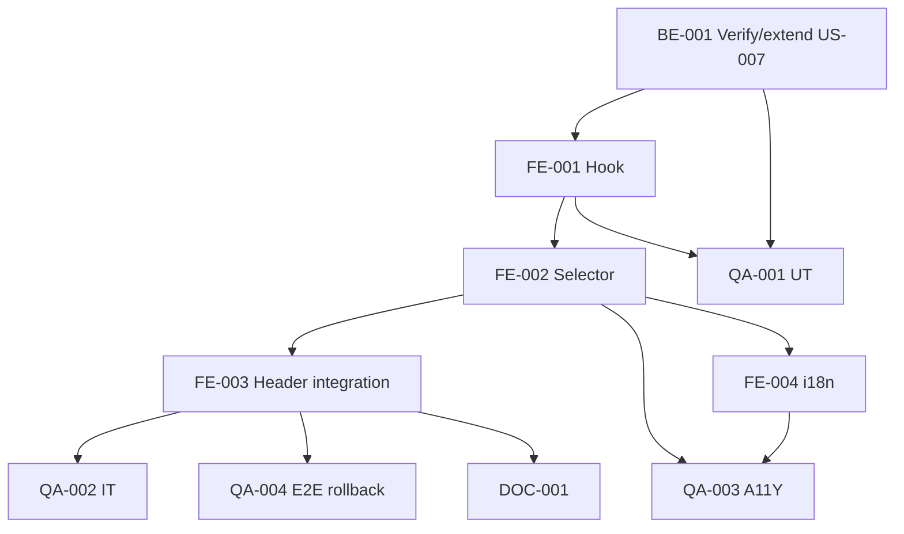

# Development Tasks — PB-P1-047 / US-081: LanguageSelector global

## 1. Metadata

| Field | Value |
|---|---|
| User Story ID | US-081 |
| Source User Story | `management/user-stories/US-081-user-change-language.md` |
| Source Technical Specification | `management/technical-specs/P1/PB-P1-047/US-081-technical-spec.md` |
| Decision Resolution Artifact | `management/user-stories/decision-resolutions/US-081-decision-resolution.md` |
| Priority | P1 |
| Backlog ID | PB-P1-047 |
| Backlog Title | Selector de idioma y configuración del evento |
| Backlog Execution Order | 81 |
| User Story Position in Backlog Item | 1 de 2 |
| Related User Stories in Backlog Item | US-081, US-082 |
| Epic | EPIC-I18N-001 |
| Backlog Item Dependencies | US-007 |
| Feature | LanguageSelector global + reuso PATCH US-007 |
| Module / Domain | I18N |
| Backlog Alignment Status | Found |
| Task Breakdown Status | Ready for Sprint Planning |
| Created Date | 2026-06-29 |
| Last Updated | 2026-06-29 |

---

## 2. Source Validation

| Source | Found | Used | Notes |
|---|---|---|---|
| User Story | Yes | Yes | Approved with Minor Notes. |
| Technical Specification | Yes | Yes | Ready for Task Breakdown. |
| Decision Resolution Artifact | Yes | Yes | 6/6 decisiones. |
| Product Backlog Prioritized | Yes | Yes | PB-P1-047. |

---

## 3. Backlog Execution Context

PB-P1-047 multi-story. US-081 abre. Execution order 81.

---

## 4. Task Breakdown Summary

| Area | Count | Notes |
|---|---:|---|
| BE | 1 | Verify/extend US-007 PATCH /users/me |
| FE | 4 | Hook, Selector, Header integration, i18n |
| QA | 4 | UT, IT, A11Y, E2E rollback |
| DOC | 1 | `docs/16` + `docs/15` |
| **Total** | 10 | |

---

## 5. Traceability Matrix

| AC | Task IDs |
|---|---|
| AC-01 authenticated change | BE-001, FE-001, QA-002 |
| AC-02 anonymous | FE-001, QA-002 |
| AC-03 optimistic rollback | FE-001, QA-004 |
| AC-04 default es-LATAM | (next-intl middleware config), QA-002 |
| AC-05 selector global | FE-003, QA-003 |
| EC-01..03 | FE-001, QA-002 |
| AUTH | QA-002 |

---

## 6. Development Tasks

### TASK-PB-P1-047-US-081-BE-001 — Verificar/extender PATCH /users/me con preferred_language

| Field | Value |
|---|---|
| Area | Backend |
| Type | Review/Refactor |
| Priority | Must |
| Estimate | S |
| Depends On | US-007 |
| Source AC(s) | AC-01, VR-01 |
| Technical Spec Section(s) | §7 |
| Backlog ID | PB-P1-047 |
| User Story ID | US-081 |
| Owner Role | Backend |
| Status | To Do |

#### Objective
Verificar que `PATCH /api/v1/users/me` (US-007) acepta `preferred_language: enum`. Si no, extender DTO + use case + tests.

#### Definition of Done
- [ ] Endpoint valida enum.
- [ ] Test verde.

---

### TASK-PB-P1-047-US-081-FE-001 — `useLocaleSwitcher` hook con optimistic + rollback

| Field | Value |
|---|---|
| Area | Frontend |
| Type | Implementation |
| Priority | Must |
| Estimate | M |
| Depends On | BE-001 |
| Source AC(s) | AC-01..AC-03, EC-03 |
| Technical Spec Section(s) | §8 |
| Backlog ID | PB-P1-047 |
| User Story ID | US-081 |
| Owner Role | Frontend |
| Status | To Do |

#### Objective
Hook con TanStack mutation + cookie manipulation + router.refresh() + onError rollback.

#### Definition of Done
- [ ] UT cubre switchLocale + onError.

---

### TASK-PB-P1-047-US-081-FE-002 — `LanguageSelector` componente accesible

| Field | Value |
|---|---|
| Area | Frontend |
| Type | Implementation |
| Priority | Must |
| Estimate | M |
| Depends On | FE-001 |
| Source AC(s) | AC-05, A11Y |
| Technical Spec Section(s) | §8 |
| Backlog ID | PB-P1-047 |
| User Story ID | US-081 |
| Owner Role | Frontend |
| Status | To Do |

#### Objective
Dropdown con `role="listbox"` + items `role="option"` + keyboard nav + aria-selected.

#### Definition of Done
- [ ] axe sin issues.
- [ ] Keyboard nav verificado.

---

### TASK-PB-P1-047-US-081-FE-003 — Integración en Header global

| Field | Value |
|---|---|
| Area | Frontend |
| Type | Implementation |
| Priority | Must |
| Estimate | S |
| Depends On | FE-002 |
| Source AC(s) | AC-05 |
| Technical Spec Section(s) | §8 |
| Backlog ID | PB-P1-047 |
| User Story ID | US-081 |
| Owner Role | Frontend |
| Status | To Do |

#### Definition of Done
- [ ] LanguageSelector visible en todas las páginas.

---

### TASK-PB-P1-047-US-081-FE-004 — i18n `common.languageSelector.*` (4 locales)

| Field | Value |
|---|---|
| Area | Frontend / i18n |
| Type | Implementation |
| Priority | Must |
| Estimate | S |
| Depends On | FE-002 |
| Source AC(s) | i18n |
| Technical Spec Section(s) | §8 |
| Backlog ID | PB-P1-047 |
| User Story ID | US-081 |
| Owner Role | Frontend |
| Status | To Do |

#### Objective
Labels `common.languageSelector.label/error` + locale names nativos en LOCALES array.

#### Definition of Done
- [ ] 4 locales completos.

---

### TASK-PB-P1-047-US-081-QA-001 — UT hook + DTO

| Field | Value |
|---|---|
| Area | QA |
| Type | Test |
| Priority | Must |
| Estimate | S |
| Depends On | FE-001, BE-001 |
| Source AC(s) | Múltiples |
| Technical Spec Section(s) | §13 |
| Backlog ID | PB-P1-047 |
| User Story ID | US-081 |
| Owner Role | QA |
| Status | To Do |

#### Definition of Done
- [ ] Coverage hook ≥ 90%.

---

### TASK-PB-P1-047-US-081-QA-002 — IT (authenticated + anónimo + default)

| Field | Value |
|---|---|
| Area | QA |
| Type | Test |
| Priority | Must |
| Estimate | M |
| Depends On | FE-003 |
| Source AC(s) | AC-01, AC-02, AC-04 |
| Technical Spec Section(s) | §13 |
| Backlog ID | PB-P1-047 |
| User Story ID | US-081 |
| Owner Role | QA |
| Status | To Do |

#### Definition of Done
- [ ] 3 escenarios cubiertos.

---

### TASK-PB-P1-047-US-081-QA-003 — Accessibility (LanguageSelector + selector visible)

| Field | Value |
|---|---|
| Area | QA / A11Y |
| Type | Test |
| Priority | Must |
| Estimate | S |
| Depends On | FE-002, FE-004 |
| Source AC(s) | AC-05, A11Y |
| Technical Spec Section(s) | §13 |
| Backlog ID | PB-P1-047 |
| User Story ID | US-081 |
| Owner Role | QA / Frontend |
| Status | To Do |

#### Definition of Done
- [ ] axe sin issues.

---

### TASK-PB-P1-047-US-081-QA-004 — E2E optimistic rollback

| Field | Value |
|---|---|
| Area | QA |
| Type | Test |
| Priority | Must |
| Estimate | S |
| Depends On | FE-003 |
| Source AC(s) | AC-03 |
| Technical Spec Section(s) | §13 |
| Backlog ID | PB-P1-047 |
| User Story ID | US-081 |
| Owner Role | QA |
| Status | To Do |

#### Objective
Playwright con MSW simulando 5xx en PATCH; verificar cookie revertida + toast.

#### Definition of Done
- [ ] Rollback funcional verificado.

---

### TASK-PB-P1-047-US-081-DOC-001 — Documentar i18n strategy + reuso endpoint

| Field | Value |
|---|---|
| Area | Documentation |
| Type | Documentation |
| Priority | Must |
| Estimate | S |
| Depends On | FE-003 |
| Source AC(s) | All |
| Technical Spec Section(s) | §16 |
| Backlog ID | PB-P1-047 |
| User Story ID | US-081 |
| Owner Role | Frontend / Doc |
| Status | To Do |

#### Definition of Done
- [ ] `docs/15` + `docs/16` actualizados.

---

## 7. Required QA Tasks
Ver §6.

## 8. Required Security Tasks
N/A (heredado US-007).

## 9. Required Seed / Demo Tasks
`No aplica`.

## 10. Observability / Audit Tasks
Logs ya incluidos en `useLocaleSwitcher` y reuso PATCH.

## 11. Documentation / Traceability Tasks
| Task ID | Doc |
|---|---|
| TASK-PB-P1-047-US-081-DOC-001 | `docs/15` + `docs/16` |

## 12. Dependency Graph

---

## 13. Suggested Implementation Order

**Phase 1**: BE-001 verify/extend.
**Phase 2**: FE-001 Hook, FE-002 Selector, FE-003 Header, FE-004 i18n.
**Phase 3**: QA-001..004.
**Phase 4**: DOC-001.

---

## 14. Risks & Mitigations
Ver §17 del Technical Spec.

## 15. Out of Scope Confirmation
Auto-detect, idiomas adicionales, translations runtime.

## 16. Readiness for Sprint Planning

| Check | Status |
|---|---|
| Product Backlog mapping found | Pass |
| Every AC maps to tasks | Pass |
| Technical Spec used when available | Pass |
| QA tasks included | Pass |
| Documentation tasks included | Pass |
| Task dependencies clear | Pass |
| Ready for Sprint Planning | Yes |

---

## 17. Final Recommendation

`Ready for Sprint Planning`.

US-081 entrega 10 tareas: surface UI del LanguageSelector global con optimistic UI + rollback. Reuso máximo del endpoint US-007. US-082 cerrará PB-P1-047 con idioma de evento.
