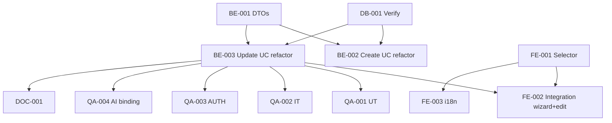

# Development Tasks — PB-P1-047 / US-082: Event Language Configuration

## 1. Metadata

| Field | Value |
|---|---|
| User Story ID | US-082 |
| Source User Story | `management/user-stories/US-082-configure-event-language.md` |
| Source Technical Specification | `management/technical-specs/P1/PB-P1-047/US-082-technical-spec.md` |
| Decision Resolution Artifact | `management/user-stories/decision-resolutions/US-082-decision-resolution.md` |
| Priority | P1 |
| Backlog ID | PB-P1-047 |
| Backlog Title | Selector de idioma y configuración del evento |
| Backlog Execution Order | 82 |
| User Story Position in Backlog Item | 2 de 2 (cierra) |
| Related User Stories in Backlog Item | US-081, US-082 |
| Epic | EPIC-I18N-001 |
| Backlog Item Dependencies | US-009, US-010, US-007/US-081 |
| Feature | Refactor minimal events + UI EventLanguageSelector |
| Module / Domain | I18N / Events |
| Backlog Alignment Status | Found |
| Task Breakdown Status | Ready for Sprint Planning |
| Created Date | 2026-06-29 |
| Last Updated | 2026-06-29 |

---

## 2. Source Validation

| Source | Found | Used | Notes |
|---|---|---|---|
| User Story | Yes | Yes | Approved with Minor Notes. |
| Technical Specification | Yes | Yes | Ready for Task Breakdown. |
| Decision Resolution Artifact | Yes | Yes | 7/7 decisiones. |
| Product Backlog Prioritized | Yes | Yes | PB-P1-047. |

---

## 3. Backlog Execution Context

PB-P1-047 multi-story. US-082 cierra. Execution order 82.

---

## 4. Task Breakdown Summary

| Area | Count | Notes |
|---|---:|---|
| DB | 1 | Verify events.language column |
| BE | 3 | DTOs extend + 2 UseCases refactor |
| FE | 3 | EventLanguageSelector + integraciones + i18n |
| QA | 4 | UT, IT, AUTH, AI binding TS-05 |
| DOC | 1 | `docs/16` + `docs/15` + obligación AI contracts |
| **Total** | 12 | |

---

## 5. Traceability Matrix

| AC | Task IDs |
|---|---|
| AC-01 default heredado | BE-002 (US-009 refactor), QA-002 |
| AC-02 override | BE-001 DTOs, BE-002, QA-002 |
| AC-03 edición permitida | BE-003 (US-010 refactor), QA-002 |
| AC-04 edición bloqueada | BE-003, QA-002 |
| AC-05 AI binding | (cada US AI implementa); QA-004 verifica con US-017 representativo |
| EC-01..03 | BE-001/002/003, QA-002 |
| AUTH | QA-003 (heredado) |

---

## 6. Development Tasks

### TASK-PB-P1-047-US-082-DB-001 — Verificar events.language column

| Field | Value |
|---|---|
| Area | Database / Prisma |
| Type | Review |
| Priority | Must |
| Estimate | XS |
| Depends On | PB-P0-001 |
| Source AC(s) | AC-01 |
| Technical Spec Section(s) | §10 |
| Backlog ID | PB-P1-047 |
| User Story ID | US-082 |
| Owner Role | Backend |
| Status | To Do |

#### Objective
Confirmar que `events.language text NOT NULL DEFAULT 'es-LATAM'`. Si falta, migración menor.

#### Definition of Done
- [ ] Pass o migración menor abierta.

---

### TASK-PB-P1-047-US-082-BE-001 — Extender DTOs create/update events con language

| Field | Value |
|---|---|
| Area | Backend |
| Type | Refactor |
| Priority | Must |
| Estimate | S |
| Depends On | US-009 BE, US-010 BE |
| Source AC(s) | AC-02, VR-01 |
| Technical Spec Section(s) | §7 |
| Backlog ID | PB-P1-047 |
| User Story ID | US-082 |
| Owner Role | Backend |
| Status | To Do |

#### Definition of Done
- [ ] DTOs extendidos + UT.

---

### TASK-PB-P1-047-US-082-BE-002 — Refactor `CreateEventUseCase` (US-009) con default heredado

| Field | Value |
|---|---|
| Area | Backend |
| Type | Refactor |
| Priority | Must |
| Estimate | S |
| Depends On | BE-001, DB-001 |
| Source AC(s) | AC-01, AC-02, EC-01 |
| Technical Spec Section(s) | §7 |
| Backlog ID | PB-P1-047 |
| User Story ID | US-082 |
| Owner Role | Backend |
| Status | To Do |

#### Objective
`event.language = body.language ?? currentUser.preferred_language ?? 'es-LATAM'`.

#### Definition of Done
- [ ] UT cubre 3 branches default.

---

### TASK-PB-P1-047-US-082-BE-003 — Refactor `UpdateEventUseCase` (US-010) con inmutabilidad

| Field | Value |
|---|---|
| Area | Backend |
| Type | Refactor |
| Priority | Must |
| Estimate | S |
| Depends On | BE-001, DB-001 |
| Source AC(s) | AC-03, AC-04, VR-03 |
| Technical Spec Section(s) | §7 |
| Backlog ID | PB-P1-047 |
| User Story ID | US-082 |
| Owner Role | Backend |
| Status | To Do |

#### Objective
Si `body.language` presente Y `status IN ('completed','cancelled')` ⇒ `409 EVENT_LANGUAGE_NOT_EDITABLE`. Log change.

#### Definition of Done
- [ ] UT cubre inmutabilidad + log.

---

### TASK-PB-P1-047-US-082-FE-001 — `EventLanguageSelector` componente

| Field | Value |
|---|---|
| Area | Frontend |
| Type | Implementation |
| Priority | Must |
| Estimate | S |
| Depends On | US-081 FE-002 (pattern) |
| Source AC(s) | AC-01, AC-02, A11Y |
| Technical Spec Section(s) | §8 |
| Backlog ID | PB-P1-047 |
| User Story ID | US-082 |
| Owner Role | Frontend |
| Status | To Do |

#### Objective
Reuso del pattern de `LanguageSelector` (US-081), scoped a evento con prop `disabled` para estados completed/cancelled.

#### Definition of Done
- [ ] axe sin issues.

---

### TASK-PB-P1-047-US-082-FE-002 — Integración wizard creation (US-009) + edit form (US-010)

| Field | Value |
|---|---|
| Area | Frontend |
| Type | Refactor |
| Priority | Must |
| Estimate | M |
| Depends On | FE-001 |
| Source AC(s) | AC-01, AC-02, AC-03 |
| Technical Spec Section(s) | §8 |
| Backlog ID | PB-P1-047 |
| User Story ID | US-082 |
| Owner Role | Frontend |
| Status | To Do |

#### Definition of Done
- [ ] Wizard incluye selector con default.
- [ ] Edit form incluye selector con disabled si completed.

---

### TASK-PB-P1-047-US-082-FE-003 — i18n `organizer.event.language.*` (4 locales)

| Field | Value |
|---|---|
| Area | Frontend / i18n |
| Type | Implementation |
| Priority | Must |
| Estimate | S |
| Depends On | FE-001 |
| Source AC(s) | i18n |
| Technical Spec Section(s) | §8 |
| Backlog ID | PB-P1-047 |
| User Story ID | US-082 |
| Owner Role | Frontend |
| Status | To Do |

#### Definition of Done
- [ ] 4 locales completos.

---

### TASK-PB-P1-047-US-082-QA-001 — UT (DTOs + UseCases refactors)

| Field | Value |
|---|---|
| Area | QA |
| Type | Test |
| Priority | Must |
| Estimate | S |
| Depends On | BE-003 |
| Source AC(s) | EC-01..03 |
| Technical Spec Section(s) | §13 |
| Backlog ID | PB-P1-047 |
| User Story ID | US-082 |
| Owner Role | QA / Backend |
| Status | To Do |

#### Definition of Done
- [ ] Coverage ≥ 90%.

---

### TASK-PB-P1-047-US-082-QA-002 — IT (default + override + inmutabilidad)

| Field | Value |
|---|---|
| Area | QA |
| Type | Test |
| Priority | Must |
| Estimate | M |
| Depends On | BE-003 |
| Source AC(s) | AC-01..04 |
| Technical Spec Section(s) | §13 |
| Backlog ID | PB-P1-047 |
| User Story ID | US-082 |
| Owner Role | QA |
| Status | To Do |

#### Definition of Done
- [ ] 4 escenarios cubiertos.

---

### TASK-PB-P1-047-US-082-QA-003 — Authorization tests (heredado)

| Field | Value |
|---|---|
| Area | QA / Security |
| Type | Test |
| Priority | Must |
| Estimate | XS |
| Depends On | BE-003 |
| Source AC(s) | AUTH-TS-01..04 |
| Technical Spec Section(s) | §12 |
| Backlog ID | PB-P1-047 |
| User Story ID | US-082 |
| Owner Role | QA |
| Status | To Do |

#### Definition of Done
- [ ] Heredado US-009/US-010 sigue funcionando.

---

### TASK-PB-P1-047-US-082-QA-004 — IT AI binding (verificación con US-017 representativo)

| Field | Value |
|---|---|
| Area | QA |
| Type | Test |
| Priority | Must |
| Estimate | S |
| Depends On | BE-003, US-017 (si entregado) |
| Source AC(s) | AC-05, TS-05 |
| Technical Spec Section(s) | §11 |
| Backlog ID | PB-P1-047 |
| User Story ID | US-082 |
| Owner Role | QA |
| Status | To Do |

#### Objective
Crear event con `language='pt'`; invocar US-017 (plan generation); verificar que prompt llama AIProviderPort con `locale='pt'`.

#### Definition of Done
- [ ] AI use case binding verificado.

---

### TASK-PB-P1-047-US-082-DOC-001 — Documentar field language + contrato AI binding

| Field | Value |
|---|---|
| Area | Documentation |
| Type | Documentation |
| Priority | Must |
| Estimate | S |
| Depends On | BE-003 |
| Source AC(s) | All |
| Technical Spec Section(s) | §16 |
| Backlog ID | PB-P1-047 |
| User Story ID | US-082 |
| Owner Role | Backend / Doc |
| Status | To Do |

#### Objective
- `docs/16 §M07`: documentar field language en POST/PATCH /events.
- `docs/15` (i18n): documentar contrato event.language → AI locale.
- Tickets de seguimiento para cada US-017..025 refactor.

#### Definition of Done
- [ ] Docs actualizados + tickets abiertos.

---

## 7. Required QA Tasks
Ver §6.

## 8. Required Security Tasks
N/A (heredado US-009/010).

## 9. Required Seed / Demo Tasks
`No aplica`.

## 10. Observability / Audit Tasks
Logs incluidos en BE-002/BE-003.

## 11. Documentation / Traceability Tasks
| Task ID | Doc |
|---|---|
| TASK-PB-P1-047-US-082-DOC-001 | `docs/16` + `docs/15` + tickets AI refactors |

## 12. Dependency Graph

---

## 13. Suggested Implementation Order

**Phase 1**: DB-001, BE-001 DTOs.
**Phase 2**: BE-002 Create refactor, BE-003 Update refactor, FE-001 Selector, FE-002 Integration, FE-003 i18n.
**Phase 3**: QA-001..004.
**Phase 4**: DOC-001 + tickets AI seguimiento.

---

## 14. Risks & Mitigations
Ver §17 del Technical Spec.

## 15. Out of Scope Confirmation
Multilingual events, retroactive, refactor de cada AI use case.

## 16. Readiness for Sprint Planning

| Check | Status |
|---|---|
| Product Backlog mapping found | Pass |
| Every AC maps to tasks | Pass |
| Technical Spec used when available | Pass |
| QA tasks included | Pass |
| AI binding test included | Pass |
| Documentation tasks included | Pass |
| Task dependencies clear | Pass |
| Ready for Sprint Planning | Yes |

---

## 17. Final Recommendation

`Ready for Sprint Planning`.

US-082 entrega 12 tareas: refactor minimal backend events para soportar language + componente EventLanguageSelector + contrato AI binding documentado (cada US-017..025 implementará). **PB-P1-047 cierra completamente** (US-081 user selector + US-082 event language). **EPIC-I18N-001 avanza con 2 PBIs operativos**.
