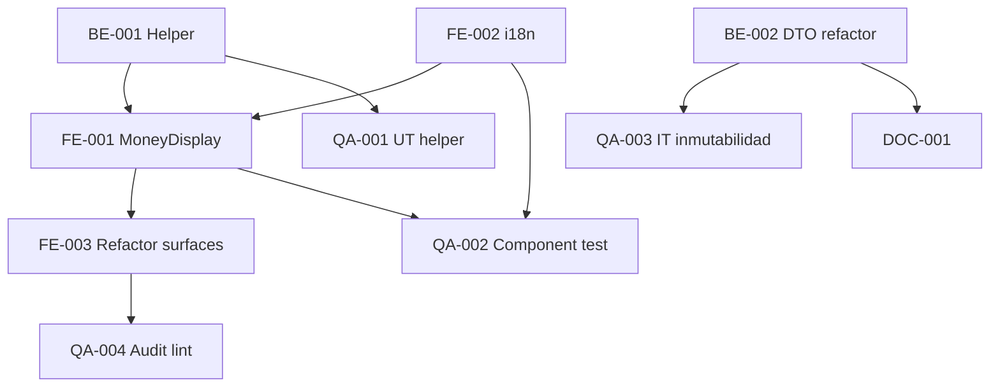

# Development Tasks — PB-P1-048 / US-083: Currency Display + Inmutabilidad

## 1. Metadata

| Field | Value |
|---|---|
| User Story ID | US-083 |
| Source User Story | `management/user-stories/US-083-view-amounts-in-event-currency.md` |
| Source Technical Specification | `management/technical-specs/P1/PB-P1-048/US-083-technical-spec.md` |
| Decision Resolution Artifact | `management/user-stories/decision-resolutions/US-083-decision-resolution.md` |
| Priority | P1 |
| Backlog ID | PB-P1-048 |
| Backlog Title | Moneda inmutable y display consistente |
| Backlog Execution Order | 83 |
| User Story Position in Backlog Item | 1 de 1 |
| Related User Stories in Backlog Item | US-083 |
| Epic | EPIC-I18N-001 |
| Backlog Item Dependencies | US-009, US-010 |
| Feature | Helper formatCurrency + MoneyDisplay + DTO guard |
| Module / Domain | I18N / Currency |
| Backlog Alignment Status | Found |
| Task Breakdown Status | Ready for Sprint Planning |
| Created Date | 2026-06-29 |
| Last Updated | 2026-06-29 |

---

## 2. Source Validation

| Source | Found | Used | Notes |
|---|---|---|---|
| User Story | Yes | Yes | Approved with Minor Notes. |
| Technical Specification | Yes | Yes | Ready for Task Breakdown. |
| Decision Resolution Artifact | Yes | Yes | 8/8 decisiones. |
| Product Backlog Prioritized | Yes | Yes | PB-P1-048. |

---

## 3. Backlog Execution Context

PB-P1-048 single-story. Execution order 83.

---

## 4. Task Breakdown Summary

| Area | Count | Notes |
|---|---:|---|
| BE | 2 | Helper formatCurrency + DTO refactor US-010 |
| FE | 3 | MoneyDisplay, i18n currency names, refactor surfaces |
| QA | 4 | UT helper, Component test, IT, Audit lint |
| DOC | 1 | `docs/15` + `docs/16` |
| **Total** | 10 | |

---

## 5. Traceability Matrix

| AC | Task IDs |
|---|---|
| AC-01 display básico | BE-001, FE-001, QA-001 |
| AC-02 locale formatting | BE-001, QA-001 |
| AC-03 USD ambiguo | FE-001, QA-002 |
| AC-04 backend guard | BE-002, QA-003 |
| AC-05 audit | QA-004 |
| EC-01..04 | BE-001, QA-001 |

---

## 6. Development Tasks

### TASK-PB-P1-048-US-083-BE-001 — Helper shared `formatCurrency`

| Field | Value |
|---|---|
| Area | Backend / Shared |
| Type | Implementation |
| Priority | Must |
| Estimate | M |
| Depends On | - |
| Source AC(s) | AC-01, AC-02 |
| Technical Spec Section(s) | §7 |
| Backlog ID | PB-P1-048 |
| User Story ID | US-083 |
| Owner Role | Backend |
| Status | To Do |

#### Objective
Helper SSR-compatible en `src/shared/format/money.ts` con `Intl.NumberFormat` + LOCALE_MAP.

#### Definition of Done
- [ ] Helper exportado.
- [ ] UT 20 escenarios (5 currencies × 4 locales).

---

### TASK-PB-P1-048-US-083-BE-002 — Refactor `updateEventBody` DTO omit currency_code

| Field | Value |
|---|---|
| Area | Backend |
| Type | Refactor |
| Priority | Must |
| Estimate | XS |
| Depends On | US-010 BE |
| Source AC(s) | AC-04 |
| Technical Spec Section(s) | §7 |
| Backlog ID | PB-P1-048 |
| User Story ID | US-083 |
| Owner Role | Backend |
| Status | To Do |

#### Objective
DTO de PATCH /events/:id NO acepta currency_code (Zod omit).

#### Definition of Done
- [ ] DTO refactorizado.
- [ ] UT verifica rechazo de currency_code en body.

---

### TASK-PB-P1-048-US-083-FE-001 — `<MoneyDisplay>` componente

| Field | Value |
|---|---|
| Area | Frontend |
| Type | Implementation |
| Priority | Must |
| Estimate | M |
| Depends On | BE-001, FE-002 |
| Source AC(s) | AC-01, AC-02, AC-03, A11Y |
| Technical Spec Section(s) | §8 |
| Backlog ID | PB-P1-048 |
| User Story ID | US-083 |
| Owner Role | Frontend |
| Status | To Do |

#### Objective
Client Component con useLocale + tooltip ISO + aria-label + handle USD ambiguo.

#### Definition of Done
- [ ] axe sin issues.

---

### TASK-PB-P1-048-US-083-FE-002 — i18n `common.currency.*` (4 locales)

| Field | Value |
|---|---|
| Area | Frontend / i18n |
| Type | Implementation |
| Priority | Must |
| Estimate | XS |
| Depends On | - |
| Source AC(s) | i18n |
| Technical Spec Section(s) | §8 |
| Backlog ID | PB-P1-048 |
| User Story ID | US-083 |
| Owner Role | Frontend |
| Status | To Do |

#### Definition of Done
- [ ] 5 currency names en 4 locales completos.

---

### TASK-PB-P1-048-US-083-FE-003 — Refactor surfaces actuales a `<MoneyDisplay>`

| Field | Value |
|---|---|
| Area | Frontend |
| Type | Refactor |
| Priority | Must |
| Estimate | L |
| Depends On | FE-001 |
| Source AC(s) | AC-01..03, AC-05 |
| Technical Spec Section(s) | §8 |
| Backlog ID | PB-P1-048 |
| User Story ID | US-083 |
| Owner Role | Frontend |
| Status | To Do |

#### Objective
Grep todos los display de cifras actuales (BudgetItem rows, Quote items, BookingIntent, Dashboard, etc.) y migrar a `<MoneyDisplay>`.

#### Definition of Done
- [ ] Audit no encuentra raw amount display fuera de MoneyDisplay.

---

### TASK-PB-P1-048-US-083-QA-001 — UT formatCurrency (20 escenarios)

| Field | Value |
|---|---|
| Area | QA |
| Type | Test |
| Priority | Must |
| Estimate | S |
| Depends On | BE-001 |
| Source AC(s) | AC-01, AC-02, EC-02..04 |
| Technical Spec Section(s) | §13 |
| Backlog ID | PB-P1-048 |
| User Story ID | US-083 |
| Owner Role | QA / Backend |
| Status | To Do |

#### Definition of Done
- [ ] 5 currencies × 4 locales verificados + edge cases (0, negativo, decimales).

---

### TASK-PB-P1-048-US-083-QA-002 — Component test `<MoneyDisplay>`

| Field | Value |
|---|---|
| Area | QA |
| Type | Test |
| Priority | Must |
| Estimate | S |
| Depends On | FE-001, FE-002 |
| Source AC(s) | AC-01, AC-03, A11Y |
| Technical Spec Section(s) | §13 |
| Backlog ID | PB-P1-048 |
| User Story ID | US-083 |
| Owner Role | QA / Frontend |
| Status | To Do |

#### Definition of Done
- [ ] RTL + axe verifican render + aria-label.

---

### TASK-PB-P1-048-US-083-QA-003 — IT backend guard inmutabilidad

| Field | Value |
|---|---|
| Area | QA |
| Type | Test |
| Priority | Must |
| Estimate | S |
| Depends On | BE-002 |
| Source AC(s) | AC-04, VR-02 |
| Technical Spec Section(s) | §13 |
| Backlog ID | PB-P1-048 |
| User Story ID | US-083 |
| Owner Role | QA |
| Status | To Do |

#### Objective
PATCH /events/:id con `{ currency_code: 'USD' }` ⇒ `400 INVALID_BODY`. Verificar evento NO cambia en DB.

#### Definition of Done
- [ ] Test verde.

---

### TASK-PB-P1-048-US-083-QA-004 — Audit lint/test: no raw display fuera de MoneyDisplay

| Field | Value |
|---|---|
| Area | QA |
| Type | Test |
| Priority | Should |
| Estimate | S |
| Depends On | FE-003 |
| Source AC(s) | AC-05 |
| Technical Spec Section(s) | §13 |
| Backlog ID | PB-P1-048 |
| User Story ID | US-083 |
| Owner Role | QA / Frontend |
| Status | To Do |

#### Objective
ESLint rule custom o test que falla si encuentra `${.+amount.+}` o patterns similares fuera del componente `MoneyDisplay`.

#### Definition of Done
- [ ] Audit verde.

---

### TASK-PB-P1-048-US-083-DOC-001 — Documentar currency strategy + inmutabilidad

| Field | Value |
|---|---|
| Area | Documentation |
| Type | Documentation |
| Priority | Must |
| Estimate | S |
| Depends On | BE-002 |
| Source AC(s) | All |
| Technical Spec Section(s) | §16 |
| Backlog ID | PB-P1-048 |
| User Story ID | US-083 |
| Owner Role | Frontend / Doc |
| Status | To Do |

#### Definition of Done
- [ ] `docs/15` + `docs/16` actualizados.

---

## 7. Required QA Tasks
Ver §6.

## 8. Required Security Tasks
N/A (display only).

## 9. Required Seed / Demo Tasks
`No aplica`.

## 10. Observability / Audit Tasks
N/A.

## 11. Documentation / Traceability Tasks
| Task ID | Doc |
|---|---|
| TASK-PB-P1-048-US-083-DOC-001 | `docs/15` + `docs/16` |

## 12. Dependency Graph

---

## 13. Suggested Implementation Order

**Phase 1**: BE-001 Helper + UT, FE-002 i18n, BE-002 DTO refactor.
**Phase 2**: FE-001 MoneyDisplay + Component test, FE-003 refactor surfaces.
**Phase 3**: QA-003 IT, QA-004 Audit.
**Phase 4**: DOC-001.

---

## 14. Risks & Mitigations
Ver §17 del Technical Spec.

## 15. Out of Scope Confirmation
FX conversion, currencies adicionales, cross-currency aggregation.

## 16. Readiness for Sprint Planning

| Check | Status |
|---|---|
| Product Backlog mapping found | Pass |
| Every AC maps to tasks | Pass |
| Technical Spec used when available | Pass |
| QA tasks included | Pass |
| Audit task included | Pass |
| Documentation tasks included | Pass |
| Task dependencies clear | Pass |
| Ready for Sprint Planning | Yes |

---

## 17. Final Recommendation

`Ready for Sprint Planning`.

US-083 entrega 10 tareas: helper shared + componente + refactor de surfaces actuales + audit + DTO guard. **PB-P1-048 cierra**. **EPIC-I18N-001 avanza con 3 PBIs operativos** (PB-P1-047 selector + idioma evento, PB-P1-048 currency display).
