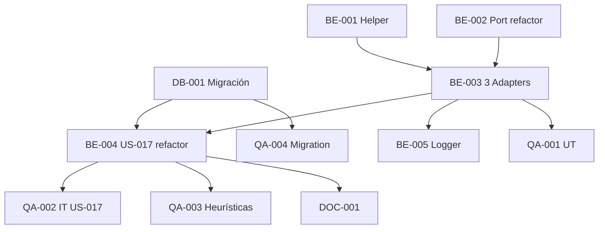

# Development Tasks — PB-P1-049 / US-084: AIProviderPort + Locale Enforcement

## 1. Metadata

| Field | Value |
|---|---|
| User Story ID | US-084 |
| Source User Story | `management/user-stories/US-084-ai-prompts-respect-event-language.md` |
| Source Technical Specification | `management/technical-specs/P1/PB-P1-049/US-084-technical-spec.md` |
| Decision Resolution Artifact | `management/user-stories/decision-resolutions/US-084-decision-resolution.md` |
| Priority | P1 |
| Backlog ID | PB-P1-049 |
| Backlog Title | Prompts IA respetan idioma del evento |
| Backlog Execution Order | 84 |
| User Story Position in Backlog Item | 1 de 1 |
| Related User Stories in Backlog Item | US-084 |
| Epic | EPIC-I18N-001 |
| Backlog Item Dependencies | US-082, US-017 |
| Feature | Port refactor + LOCALE_LABEL helper + DB migration + US-017 + tests heurísticos |
| Module / Domain | I18N / AI |
| Backlog Alignment Status | Found |
| Task Breakdown Status | Ready for Sprint Planning |
| Created Date | 2026-06-29 |
| Last Updated | 2026-06-29 |

---

## 2. Source Validation

| Source | Found | Used | Notes |
|---|---|---|---|
| User Story | Yes | Yes | Approved with Minor Notes. |
| Technical Specification | Yes | Yes | Ready for Task Breakdown. |
| Decision Resolution Artifact | Yes | Yes | 7/7 decisiones. |
| Product Backlog Prioritized | Yes | Yes | PB-P1-049. |

---

## 3. Backlog Execution Context

PB-P1-049 single-story. Execution order 84. **Cierra EPIC-I18N-001**.

---

## 4. Task Breakdown Summary

| Area | Count | Notes |
|---|---:|---|
| DB | 1 | Migración + backfill ai_recommendations |
| BE | 5 | Helper, Port signature, 3 Adapters, US-017 refactor |
| QA | 4 | UT helper, IT US-017, Heurísticas, Migration backfill |
| DOC | 1 | `docs/15` + `docs/14` + tickets US-018..025 |
| **Total** | 11 | |

---

## 5. Traceability Matrix

| AC | Task IDs |
|---|---|
| AC-01 TS rechaza sin locale | BE-002 Port refactor |
| AC-02 helper inyecta | BE-001 Helper, QA-001 |
| AC-03 US-017 pasa locale | BE-004 US-017 refactor, QA-002 |
| AC-04 heurística PT | QA-003 |
| AC-05 fallback | BE-003 Adapters, QA-002 |
| EC-03 backfill | DB-001, QA-004 |

---

## 6. Development Tasks

### TASK-PB-P1-049-US-084-DB-001 — Migración + backfill ai_recommendations

| Field | Value |
|---|---|
| Area | Database / Prisma |
| Type | Implementation |
| Priority | Must |
| Estimate | S |
| Depends On | US-017 DB (ai_recommendations existe) |
| Source AC(s) | EC-03 |
| Technical Spec Section(s) | §10 |
| Backlog ID | PB-P1-049 |
| User Story ID | US-084 |
| Owner Role | Backend |
| Status | To Do |

#### Objective
Añadir `locale text NOT NULL DEFAULT 'es-LATAM'` + `locale_fallback boolean NOT NULL DEFAULT false`. Backfill via JOIN events.

#### Definition of Done
- [ ] Migración aplica.
- [ ] Backfill: 0 rows con locale default sin event match.

---

### TASK-PB-P1-049-US-084-BE-001 — Helper `LOCALE_LABEL` + `composeLocaleInstruction`

| Field | Value |
|---|---|
| Area | Backend / Shared |
| Type | Implementation |
| Priority | Must |
| Estimate | S |
| Depends On | - |
| Source AC(s) | AC-02 |
| Technical Spec Section(s) | §7 |
| Backlog ID | PB-P1-049 |
| User Story ID | US-084 |
| Owner Role | Backend |
| Status | To Do |

#### Definition of Done
- [ ] Helper + UT (4 locales).

---

### TASK-PB-P1-049-US-084-BE-002 — `AIProviderPort` interface refactor

| Field | Value |
|---|---|
| Area | Backend |
| Type | Refactor |
| Priority | Must |
| Estimate | XS |
| Depends On | - |
| Source AC(s) | AC-01 |
| Technical Spec Section(s) | §7 |
| Backlog ID | PB-P1-049 |
| User Story ID | US-084 |
| Owner Role | Backend |
| Status | To Do |

#### Objective
Añadir `locale: Locale` obligatorio en `generate({})` input. TS compile error si falta.

#### Definition of Done
- [ ] Interface refactorizada.
- [ ] TS strict pasa sin errores en otros use cases (después de refactor BE-004).

---

### TASK-PB-P1-049-US-084-BE-003 — 3 Adapters implementan locale

| Field | Value |
|---|---|
| Area | Backend |
| Type | Refactor |
| Priority | Must |
| Estimate | M |
| Depends On | BE-001, BE-002 |
| Source AC(s) | AC-02, AC-05 |
| Technical Spec Section(s) | §7 |
| Backlog ID | PB-P1-049 |
| User Story ID | US-084 |
| Owner Role | Backend |
| Status | To Do |

#### Objective
OpenAIAdapter + AnthropicAdapter + MockAIProvider: usar `composeLocaleInstruction(locale)` + manejar fallback con `locale_fallback=true`.

#### Definition of Done
- [ ] 3 adapters refactorizados.
- [ ] UT con mock provider de cada uno.

---

### TASK-PB-P1-049-US-084-BE-004 — US-017 `AIPlanUseCase` refactor representativo

| Field | Value |
|---|---|
| Area | Backend |
| Type | Refactor |
| Priority | Must |
| Estimate | S |
| Depends On | BE-002, BE-003, DB-001, US-017 |
| Source AC(s) | AC-03 |
| Technical Spec Section(s) | §7 |
| Backlog ID | PB-P1-049 |
| User Story ID | US-084 |
| Owner Role | Backend |
| Status | To Do |

#### Objective
Extender call al port con `locale: event.language`. Persistir `locale` + `locale_fallback` en AIRecommendation.

#### Definition of Done
- [ ] UT verifica binding.
- [ ] AIRecommendation persiste 2 nuevos campos.

---

### TASK-PB-P1-049-US-084-BE-005 — Logger eventos i18n AI

| Field | Value |
|---|---|
| Area | Backend / Observability |
| Type | Implementation |
| Priority | Must |
| Estimate | XS |
| Depends On | BE-003 |
| Source AC(s) | AC-05 |
| Technical Spec Section(s) | §14 |
| Backlog ID | PB-P1-049 |
| User Story ID | US-084 |
| Owner Role | Backend |
| Status | To Do |

#### Objective
`ai.locale.applied` y `ai.locale.fallback` con context.

#### Definition of Done
- [ ] Eventos emitidos.

---

### TASK-PB-P1-049-US-084-QA-001 — UT (helper + adapters)

| Field | Value |
|---|---|
| Area | QA |
| Type | Test |
| Priority | Must |
| Estimate | S |
| Depends On | BE-003 |
| Source AC(s) | AC-02 |
| Technical Spec Section(s) | §13 |
| Backlog ID | PB-P1-049 |
| User Story ID | US-084 |
| Owner Role | QA / Backend |
| Status | To Do |

#### Definition of Done
- [ ] Coverage ≥ 90%.

---

### TASK-PB-P1-049-US-084-QA-002 — IT US-017 con locale + AIRecommendation persistence

| Field | Value |
|---|---|
| Area | QA |
| Type | Test |
| Priority | Must |
| Estimate | M |
| Depends On | BE-004 |
| Source AC(s) | AC-03, AC-05 |
| Technical Spec Section(s) | §13 |
| Backlog ID | PB-P1-049 |
| User Story ID | US-084 |
| Owner Role | QA |
| Status | To Do |

#### Objective
event language=pt → US-017 ejecuta → AIRecommendation.locale='pt' + AIRecommendation.locale_fallback=false (con mock OK) o true (con mock error).

#### Definition of Done
- [ ] 2 escenarios cubiertos.

---

### TASK-PB-P1-049-US-084-QA-003 — Heurísticas output por locale

| Field | Value |
|---|---|
| Area | QA |
| Type | Test |
| Priority | Must |
| Estimate | M |
| Depends On | BE-004 |
| Source AC(s) | AC-04 |
| Technical Spec Section(s) | §13 |
| Backlog ID | PB-P1-049 |
| User Story ID | US-084 |
| Owner Role | QA |
| Status | To Do |

#### Objective
Mock provider retorna respuesta hardcoded por locale. Tests verifican tokens esperados:
- pt: contiene "você", "evento"; sin "ustedes".
- en: contiene "you", "event"; sin "usted".
- es-LATAM: contiene "ustedes", "evento"; sin "vosotros".
- es-ES: contiene "vosotros", "evento".

#### Definition of Done
- [ ] 4 escenarios verdes.

---

### TASK-PB-P1-049-US-084-QA-004 — Migration backfill validation

| Field | Value |
|---|---|
| Area | QA / DB |
| Type | Test |
| Priority | Must |
| Estimate | S |
| Depends On | DB-001 |
| Source AC(s) | EC-03 |
| Technical Spec Section(s) | §13 |
| Backlog ID | PB-P1-049 |
| User Story ID | US-084 |
| Owner Role | QA |
| Status | To Do |

#### Objective
Migration test: pre-existentes AIRecommendations obtienen locale del event asociado.

#### Definition of Done
- [ ] Backfill correcto verificado.

---

### TASK-PB-P1-049-US-084-DOC-001 — Documentar contrato + crear tickets US-018..025

| Field | Value |
|---|---|
| Area | Documentation |
| Type | Documentation |
| Priority | Must |
| Estimate | M |
| Depends On | BE-004 |
| Source AC(s) | AC-03 |
| Technical Spec Section(s) | §16 |
| Backlog ID | PB-P1-049 |
| User Story ID | US-084 |
| Owner Role | Backend / Doc |
| Status | To Do |

#### Objective
- `docs/15` + `docs/14`: documentar AIProviderPort contract con locale.
- Crear 8 tickets de seguimiento (US-018, 019, 020, 021, 022, 023, 024, 025) para refactor minimal con locale.

#### Definition of Done
- [ ] Docs actualizados.
- [ ] 8 tickets abiertos en backlog.

---

## 7. Required QA Tasks
Ver §6.

## 8. Required Security Tasks
N/A (heredado de cada AI use case).

## 9. Required Seed / Demo Tasks
Reuso (seed events con varios languages).

## 10. Observability / Audit Tasks
| Task ID | Concern |
|---|---|
| TASK-PB-P1-049-US-084-BE-005 | Logs i18n AI |

## 11. Documentation / Traceability Tasks
| Task ID | Doc |
|---|---|
| TASK-PB-P1-049-US-084-DOC-001 | `docs/15` + `docs/14` + 8 tickets seguimiento |

## 12. Dependency Graph

---

## 13. Suggested Implementation Order

**Phase 1**: DB-001 migración, BE-001 Helper.
**Phase 2**: BE-002 Port refactor, BE-003 Adapters, BE-004 US-017 refactor, BE-005 Logger.
**Phase 3**: QA-001..004.
**Phase 4**: DOC-001 + tickets US-018..025.

---

## 14. Risks & Mitigations
Ver §17 del Technical Spec.

## 15. Out of Scope Confirmation
Refactor US-018..025 (tickets), language detection, multi-idioma.

## 16. Readiness for Sprint Planning

| Check | Status |
|---|---|
| Product Backlog mapping found | Pass |
| Every AC maps to tasks | Pass |
| Technical Spec used when available | Pass |
| QA tasks included | Pass |
| Migration backfill test included | Pass |
| Documentation + tickets seguimiento incluidos | Pass |
| Task dependencies clear | Pass |
| Ready for Sprint Planning | Yes |

---

## 17. Final Recommendation

`Ready for Sprint Planning`.

US-084 entrega 11 tareas: Port refactor + helper + DB migration con backfill + US-017 representativo + tests heurísticos + tickets seguimiento US-018..025. **Cierra EPIC-I18N-001 — Internationalization & Currency con 4 PBIs operativos** (PB-P1-047 i18n selectors + PB-P1-048 currency display + PB-P1-049 AI binding).

El stack i18n queda 100% MVP-ready: cookie + middleware next-intl, selector global, idioma del evento, currency display consistente, AI prompts en idioma correcto con audit. 8 tickets de seguimiento para que cada US AI individual incorpore el binding (1-2 hours work each).
