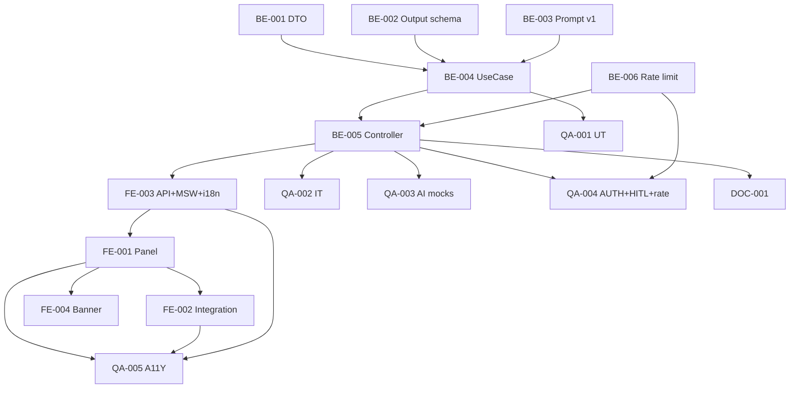

# Development Tasks — PB-P2-001 / US-022: AI Quote Comparison Summary

## 1. Metadata

| Field | Value |
|---|---|
| User Story ID | US-022 |
| Source User Story | `management/user-stories/US-022-ai-quote-comparison-summary.md` |
| Source Technical Specification | `management/technical-specs/P2/PB-P2-001/US-022-technical-spec.md` |
| Decision Resolution Artifact | `management/user-stories/decision-resolutions/US-022-decision-resolution.md` |
| Priority | P2 (Should Have) |
| Backlog ID | PB-P2-001 |
| Backlog Title | AI-006: Resumen IA del comparador de Quotes |
| Backlog Execution Order | 1 (P2.1, US-022 abre) |
| User Story Position in Backlog Item | 1 de 2 |
| Related User Stories in Backlog Item | US-022, US-059 |
| Epic | EPIC-AI-001 / EPIC-CMP-001 |
| Backlog Item Dependencies | US-052, US-057, US-082, US-084 |
| Feature | AI summary endpoint + panel + locale + audit |
| Module / Domain | AI / Booking |
| Backlog Alignment Status | Found |
| Task Breakdown Status | Ready for Sprint Planning |
| Created Date | 2026-06-29 |
| Last Updated | 2026-06-29 |

---

## 2. Source Validation

| Source | Found | Used | Notes |
|---|---|---|---|
| User Story | Yes | Yes | Approved with Minor Notes. |
| Technical Specification | Yes | Yes | Ready for Task Breakdown. |
| Decision Resolution Artifact | Yes | Yes | 9/9 decisiones. |
| Product Backlog Prioritized | Yes | Yes | PB-P2-001. |

---

## 3. Backlog Execution Context

PB-P2-001 multi-story. US-022 abre. Execution order 51. US-059 cerrará después.

---

## 4. Task Breakdown Summary

| Area | Count | Notes |
|---|---:|---|
| BE | 6 | DTO, Output schema, Prompt, UseCase, Controller, Rate limit middleware |
| FE | 4 | Panel, integración trigger, API+MSW, i18n |
| QA | 5 | UT, IT, AI mocks + heurísticas, AUTH, A11Y |
| DOC | 1 | `docs/16` + `docs/7` + housekeeping backlog |
| **Total** | 16 | |

---

## 5. Traceability Matrix

| AC | Task IDs |
|---|---|
| AC-01 generación válida | BE-003 UseCase, QA-002 |
| AC-02 snapshot | BE-003, QA-002 |
| AC-03 HITL | (ausencia de endpoint auto-preferred); QA-004 |
| AC-04 locale binding | BE-003 con US-084 port, QA-003 |
| AC-05 fallback | BE-003 try/catch, QA-003 |
| EC-01..05 | BE-003, QA-002 |
| AI binding (US-084) | BE-003, QA-003 |

---

## 6. Development Tasks

### TASK-PB-P2-001-US-022-BE-001 — DTO `quoteSummaryBody`

| Field | Value |
|---|---|
| Area | Backend |
| Type | Implementation |
| Priority | Must |
| Estimate | XS |
| Depends On | - |
| Source AC(s) | VR-01, EC-02 |
| Technical Spec Section(s) | §7 |
| Backlog ID | PB-P2-001 |
| User Story ID | US-022 |
| Owner Role | Backend |
| Status | To Do |

#### Definition of Done
- [ ] Zod `.strict()` + UT.

---

### TASK-PB-P2-001-US-022-BE-002 — Output Zod schema `quoteSummaryOutputSchema`

| Field | Value |
|---|---|
| Area | Backend |
| Type | Implementation |
| Priority | Must |
| Estimate | S |
| Depends On | - |
| Source AC(s) | AC-02, EC-03 |
| Technical Spec Section(s) | §7 |
| Backlog ID | PB-P2-001 |
| User Story ID | US-022 |
| Owner Role | Backend |
| Status | To Do |

#### Objective
Schema strict para output AI: summaries[] con quote_id, pros, cons, missing_info, notes + overall_observations opcional.

#### Definition of Done
- [ ] Schema + UT (válido + malformado).

---

### TASK-PB-P2-001-US-022-BE-003 — Prompt template `QuoteCompareSummaryPrompt v1`

| Field | Value |
|---|---|
| Area | Backend / AI |
| Type | Implementation |
| Priority | Must |
| Estimate | M |
| Depends On | - |
| Source AC(s) | AC-01, AC-03 |
| Technical Spec Section(s) | §11 |
| Backlog ID | PB-P2-001 |
| User Story ID | US-022 |
| Owner Role | Backend / Content |
| Status | To Do |

#### Objective
Prompt v1 con instrucción HITL strict (no decidas) + estructura JSON esperada + template variables.

#### Definition of Done
- [ ] Prompt versionado en archivo.
- [ ] Snapshot test del prompt template.

---

### TASK-PB-P2-001-US-022-BE-004 — `GenerateQuoteSummaryUseCase` atómico

| Field | Value |
|---|---|
| Area | Backend |
| Type | Implementation |
| Priority | Must |
| Estimate | L |
| Depends On | BE-001, BE-002, BE-003, US-084 (port) |
| Source AC(s) | AC-01..05, EC-01..05 |
| Technical Spec Section(s) | §7 |
| Backlog ID | PB-P2-001 |
| User Story ID | US-022 |
| Owner Role | Backend |
| Status | To Do |

#### Objective
UseCase: ownership + categoría + ≥2 quotes + context build + AIProviderPort.generate({locale}) + Zod validate + persist AIRecommendation con snapshot + log.

#### Definition of Done
- [ ] Coverage ≥ 90%.
- [ ] Branches: ≥2, <2, sin category, AI error, output malformed.

---

### TASK-PB-P2-001-US-022-BE-005 — Controller + ruta + AdminGuard-like organizer guard

| Field | Value |
|---|---|
| Area | Backend / API |
| Type | Implementation |
| Priority | Must |
| Estimate | S |
| Depends On | BE-004 |
| Source AC(s) | AC-01, AUTH |
| Technical Spec Section(s) | §7 |
| Backlog ID | PB-P2-001 |
| User Story ID | US-022 |
| Owner Role | Backend |
| Status | To Do |

#### Definition of Done
- [ ] Ruta operativa con `organizerRoleGuard` + `aiRateLimit`.

---

### TASK-PB-P2-001-US-022-BE-006 — Rate limit middleware shared `aiRateLimit`

| Field | Value |
|---|---|
| Area | Backend / Security |
| Type | Review/Implementation |
| Priority | Must |
| Estimate | S |
| Depends On | - |
| Source AC(s) | SEC-02, EC-04 |
| Technical Spec Section(s) | §7 |
| Backlog ID | PB-P2-001 |
| User Story ID | US-022 |
| Owner Role | Backend |
| Status | To Do |

#### Objective
Verificar si middleware AI rate limit shared existe (US-017..025). Si no, implementar minimal con in-memory map o Redis. Default 5/min/user.

#### Definition of Done
- [ ] Middleware operativo + UT.

---

### TASK-PB-P2-001-US-022-FE-001 — `AIComparisonSummary` panel lateral accesible

| Field | Value |
|---|---|
| Area | Frontend |
| Type | Implementation |
| Priority | Must |
| Estimate | L |
| Depends On | FE-003 |
| Source AC(s) | AC-01..03, A11Y |
| Technical Spec Section(s) | §8 |
| Backlog ID | PB-P2-001 |
| User Story ID | US-022 |
| Owner Role | Frontend |
| Status | To Do |

#### Objective
Panel `role="complementary"` con Disclosure por quote + overall_observations + timestamp + banner snapshot mismatch.

#### Definition of Done
- [ ] axe sin issues.

---

### TASK-PB-P2-001-US-022-FE-002 — Integración trigger en `QuoteComparator` (US-057)

| Field | Value |
|---|---|
| Area | Frontend |
| Type | Refactor |
| Priority | Must |
| Estimate | S |
| Depends On | FE-001, US-057 FE |
| Source AC(s) | AC-01 |
| Technical Spec Section(s) | §8 |
| Backlog ID | PB-P2-001 |
| User Story ID | US-022 |
| Owner Role | Frontend |
| Status | To Do |

#### Objective
Botón "Resumir con IA" en header del comparador. Visible solo con ≥2 quotes elegibles.

#### Definition of Done
- [ ] Botón funcional + abre panel.

---

### TASK-PB-P2-001-US-022-FE-003 — `aiApi.generateQuoteSummary` + MSW + i18n

| Field | Value |
|---|---|
| Area | Frontend |
| Type | Implementation |
| Priority | Must |
| Estimate | S |
| Depends On | BE-005 |
| Source AC(s) | AC-01..05 |
| Technical Spec Section(s) | §8 |
| Backlog ID | PB-P2-001 |
| User Story ID | US-022 |
| Owner Role | Frontend |
| Status | To Do |

#### Definition of Done
- [ ] MSW handlers `200/400/401/403/404/429`.
- [ ] i18n shell labels en 4 locales (`organizer.ai.quote_summary.*`).

---

### TASK-PB-P2-001-US-022-FE-004 — Banner snapshot mismatch + regenerate button

| Field | Value |
|---|---|
| Area | Frontend |
| Type | Implementation |
| Priority | Should |
| Estimate | S |
| Depends On | FE-001 |
| Source AC(s) | EC-05 |
| Technical Spec Section(s) | §8 |
| Backlog ID | PB-P2-001 |
| User Story ID | US-022 |
| Owner Role | Frontend |
| Status | To Do |

#### Objective
Comparar `payload.quote_ids_snapshot` con current quotes; mostrar banner si difieren.

#### Definition of Done
- [ ] Banner visible cuando aplica.

---

### TASK-PB-P2-001-US-022-QA-001 — UT (DTO + Output schema + UseCase branches)

| Field | Value |
|---|---|
| Area | QA |
| Type | Test |
| Priority | Must |
| Estimate | M |
| Depends On | BE-004 |
| Source AC(s) | Múltiples |
| Technical Spec Section(s) | §13 |
| Backlog ID | PB-P2-001 |
| User Story ID | US-022 |
| Owner Role | QA / Backend |
| Status | To Do |

#### Definition of Done
- [ ] Coverage ≥ 90%.

---

### TASK-PB-P2-001-US-022-QA-002 — IT (≥2, <2, ownership, persistence)

| Field | Value |
|---|---|
| Area | QA |
| Type | Test |
| Priority | Must |
| Estimate | M |
| Depends On | BE-005 |
| Source AC(s) | AC-01..02, EC-01..02, EC-05 |
| Technical Spec Section(s) | §13 |
| Backlog ID | PB-P2-001 |
| User Story ID | US-022 |
| Owner Role | QA |
| Status | To Do |

#### Definition of Done
- [ ] 5 escenarios cubiertos.

---

### TASK-PB-P2-001-US-022-QA-003 — AI mocks + locale binding + heurísticas + fallback

| Field | Value |
|---|---|
| Area | QA |
| Type | Test |
| Priority | Must |
| Estimate | M |
| Depends On | BE-005, US-084 |
| Source AC(s) | AC-04, AC-05, EC-03 |
| Technical Spec Section(s) | §13 |
| Backlog ID | PB-P2-001 |
| User Story ID | US-022 |
| Owner Role | QA |
| Status | To Do |

#### Objective
- Mock retorna JSON válido en pt: heurística tokens PT verificada + AIRecommendation.locale='pt'.
- Mock timeout: fallback aplicado + locale_fallback=true.
- Mock retorna texto malformado: fallback aplicado.

#### Definition of Done
- [ ] 3 escenarios AI verdes.

---

### TASK-PB-P2-001-US-022-QA-004 — Authorization + HITL + rate limit

| Field | Value |
|---|---|
| Area | QA / Security |
| Type | Test |
| Priority | Must |
| Estimate | S |
| Depends On | BE-005, BE-006 |
| Source AC(s) | AC-03, AUTH-TS-01..04, EC-04 |
| Technical Spec Section(s) | §12 |
| Backlog ID | PB-P2-001 |
| User Story ID | US-022 |
| Owner Role | QA |
| Status | To Do |

#### Objective
- AUTH matrix completa.
- Verificar NO existe endpoint auto-preferred.
- Rate limit: 6ª request en 1min ⇒ 429.

#### Definition of Done
- [ ] AUTH + HITL + rate limit verificados.

---

### TASK-PB-P2-001-US-022-QA-005 — Accessibility (panel + integración)

| Field | Value |
|---|---|
| Area | QA / A11Y |
| Type | Test |
| Priority | Must |
| Estimate | S |
| Depends On | FE-001, FE-002, FE-003 |
| Source AC(s) | A11Y |
| Technical Spec Section(s) | §13 |
| Backlog ID | PB-P2-001 |
| User Story ID | US-022 |
| Owner Role | QA / Frontend |
| Status | To Do |

#### Definition of Done
- [ ] axe sin issues serios.

---

### TASK-PB-P2-001-US-022-DOC-001 — Documentar AI-006 prompt v1 + endpoint + housekeeping backlog

| Field | Value |
|---|---|
| Area | Documentation |
| Type | Documentation |
| Priority | Must |
| Estimate | S |
| Depends On | BE-005 |
| Source AC(s) | All |
| Technical Spec Section(s) | §16 |
| Backlog ID | PB-P2-001 |
| User Story ID | US-022 |
| Owner Role | Backend / Doc |
| Status | To Do |

#### Objective
- `docs/7`: documentar prompt v1 + output schema.
- `docs/16 §M07`: documentar endpoint.
- Housekeeping del backlog (PB-P2-001 cita FR-AI-019 incorrecto).

#### Definition of Done
- [ ] Docs actualizados.

---

## 7. Required QA Tasks
Ver §6.

## 8. Required Security Tasks
| Task ID | Concern |
|---|---|
| TASK-PB-P2-001-US-022-QA-004 | AUTH + HITL + rate limit |

## 9. Required Seed / Demo Tasks
`No aplica` (reuso events demo + quotes).

## 10. Observability / Audit Tasks
Logs incluidos en BE-004 + AIRecommendation persistido.

## 11. Documentation / Traceability Tasks
| Task ID | Doc |
|---|---|
| TASK-PB-P2-001-US-022-DOC-001 | `docs/7` + `docs/16` + housekeeping backlog |

## 12. Dependency Graph

---

## 13. Suggested Implementation Order

**Phase 1**: BE-001 DTO, BE-002 Output schema, BE-003 Prompt v1, BE-006 Rate limit.
**Phase 2**: BE-004 UseCase, BE-005 Controller, FE-003 API+MSW+i18n.
**Phase 3**: FE-001 Panel, FE-002 Integration, FE-004 Banner.
**Phase 4**: QA-001..005.
**Phase 5**: DOC-001.

---

## 14. Risks & Mitigations
Ver §17 del Technical Spec.

## 15. Out of Scope Confirmation
Auto-preferred, cache, negociación.

## 16. Readiness for Sprint Planning

| Check | Status |
|---|---|
| Product Backlog mapping found | Pass |
| Every AC maps to tasks | Pass |
| Technical Spec used when available | Pass |
| QA tasks included | Pass |
| AI binding tests included | Pass |
| Rate limit included | Pass |
| Documentation tasks included | Pass |
| Task dependencies clear | Pass |
| Ready for Sprint Planning | Yes |

---

## 17. Final Recommendation

`Ready for Sprint Planning`.

US-022 entrega 16 tareas: AI summary endpoint + prompt v1 + output schema Zod + panel lateral accesible + integración con comparador + rate limit + locale binding (US-084 contract) + snapshot audit + fallback. PB-P2-001 abre; US-059 cerrará.
