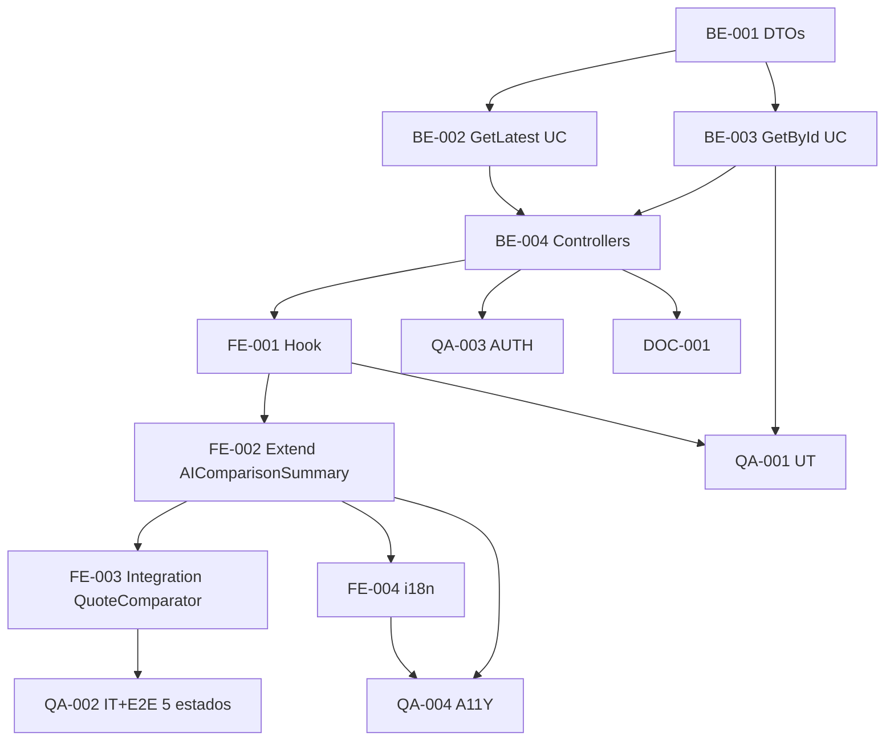

# Development Tasks — PB-P2-001 / US-059: AIComparisonSummary Surface

## 1. Metadata

| Field | Value |
|---|---|
| User Story ID | US-059 |
| Source User Story | `management/user-stories/US-059-view-ai-comparator-summary.md` |
| Source Technical Specification | `management/technical-specs/P2/PB-P2-001/US-059-technical-spec.md` |
| Decision Resolution Artifact | `management/user-stories/decision-resolutions/US-059-decision-resolution.md` |
| Priority | P2 (Should Have) |
| Backlog ID | PB-P2-001 |
| Backlog Title | AI-006: Resumen IA del comparador de Quotes |
| Backlog Execution Order | 1 (P2.1, US-059 cierra) |
| User Story Position in Backlog Item | 2 de 2 (cierra) |
| Related User Stories in Backlog Item | US-022, US-059 |
| Epic | EPIC-CMP-001 / EPIC-AI-001 |
| Backlog Item Dependencies | US-022, US-057 |
| Feature | 2 GET endpoints + componente shared + 5 estados |
| Module / Domain | Booking / AI |
| Backlog Alignment Status | Found |
| Task Breakdown Status | Ready for Sprint Planning |
| Created Date | 2026-06-29 |
| Last Updated | 2026-06-29 |

---

## 2. Source Validation

| Source | Found | Used | Notes |
|---|---|---|---|
| User Story | Yes | Yes | Approved with Minor Notes. |
| Technical Specification | Yes | Yes | Ready for Task Breakdown. |
| Decision Resolution Artifact | Yes | Yes | 7/7 decisiones. |
| Product Backlog Prioritized | Yes | Yes | PB-P2-001. |

---

## 3. Backlog Execution Context

PB-P2-001 multi-story. US-059 cierra. Execution order 59.

---

## 4. Task Breakdown Summary

| Area | Count | Notes |
|---|---:|---|
| BE | 4 | DTOs + 2 UseCases + Controllers |
| FE | 4 | Hook + Component extension + Integration + i18n |
| QA | 4 | UT, IT, AUTH, A11Y |
| DOC | 1 | `docs/16` + `docs/7` |
| **Total** | 13 | |

---

## 5. Traceability Matrix

| AC | Task IDs |
|---|---|
| AC-01 filled state | BE-002 UseCase, FE-002 component, QA-002 |
| AC-02 empty + CTA | FE-002, FE-003 integration, QA-002 |
| AC-03 stale indicator | FE-001 hook, FE-002 component, QA-002 |
| AC-04 fallback badge | FE-002 component, QA-002 |
| AC-05 by id | BE-003 UseCase, QA-002 |
| EC-01..04 | BE-001 DTO, BE-002/003, QA-002 |
| AUTH | QA-003 |

---

## 6. Development Tasks

### TASK-PB-P2-001-US-059-BE-001 — DTOs latest + recommendationId

| Field | Value |
|---|---|
| Area | Backend |
| Type | Implementation |
| Priority | Must |
| Estimate | XS |
| Depends On | - |
| Source AC(s) | EC-03, EC-04 |
| Technical Spec Section(s) | §7 |
| Backlog ID | PB-P2-001 |
| User Story ID | US-059 |
| Owner Role | Backend |
| Status | To Do |

#### Definition of Done
- [ ] DTOs + UT.

---

### TASK-PB-P2-001-US-059-BE-002 — `GetLatestQuoteSummaryUseCase`

| Field | Value |
|---|---|
| Area | Backend |
| Type | Implementation |
| Priority | Must |
| Estimate | S |
| Depends On | BE-001, US-022 (data persistida) |
| Source AC(s) | AC-01, AC-03, EC-01 |
| Technical Spec Section(s) | §7 |
| Backlog ID | PB-P2-001 |
| User Story ID | US-059 |
| Owner Role | Backend |
| Status | To Do |

#### Objective
Query ordered by created_at DESC LIMIT 1, filtrado por (event_id, type, payload.category_code) + ownership check.

#### Definition of Done
- [ ] UT cubre existe/no existe/ajeno.

---

### TASK-PB-P2-001-US-059-BE-003 — `GetAIRecommendationUseCase` por id

| Field | Value |
|---|---|
| Area | Backend |
| Type | Implementation |
| Priority | Must |
| Estimate | S |
| Depends On | BE-001 |
| Source AC(s) | AC-05, EC-01 |
| Technical Spec Section(s) | §7 |
| Backlog ID | PB-P2-001 |
| User Story ID | US-059 |
| Owner Role | Backend |
| Status | To Do |

#### Objective
Lookup por id + ownership check via JOIN events.

#### Definition of Done
- [ ] UT cubre ownership.

---

### TASK-PB-P2-001-US-059-BE-004 — 2 Controllers + 2 rutas GET

| Field | Value |
|---|---|
| Area | Backend / API |
| Type | Implementation |
| Priority | Must |
| Estimate | S |
| Depends On | BE-002, BE-003 |
| Source AC(s) | AC-01, AC-05 |
| Technical Spec Section(s) | §7 |
| Backlog ID | PB-P2-001 |
| User Story ID | US-059 |
| Owner Role | Backend |
| Status | To Do |

#### Definition of Done
- [ ] Rutas operativas con organizer guard.

---

### TASK-PB-P2-001-US-059-FE-001 — `useLatestQuoteSummary` hook con stale check

| Field | Value |
|---|---|
| Area | Frontend |
| Type | Implementation |
| Priority | Must |
| Estimate | S |
| Depends On | BE-004 |
| Source AC(s) | AC-01, AC-03 |
| Technical Spec Section(s) | §8 |
| Backlog ID | PB-P2-001 |
| User Story ID | US-059 |
| Owner Role | Frontend |
| Status | To Do |

#### Objective
TanStack Query con `retry: false` (404 es estado válido) + compute `isStale` comparando snapshot vs current.

#### Definition of Done
- [ ] Hook + UT (compute isStale).

---

### TASK-PB-P2-001-US-059-FE-002 — Extender `AIComparisonSummary` con 5 estados

| Field | Value |
|---|---|
| Area | Frontend |
| Type | Refactor |
| Priority | Must |
| Estimate | M |
| Depends On | US-022 FE (componente base), FE-001 |
| Source AC(s) | AC-01..AC-04, A11Y |
| Technical Spec Section(s) | §8 |
| Backlog ID | PB-P2-001 |
| User Story ID | US-059 |
| Owner Role | Frontend |
| Status | To Do |

#### Objective
Extender props: loading/notFound/data/isStale/onGenerate/generating. 5 estados visuales accesibles.

#### Definition of Done
- [ ] axe sin issues serios.
- [ ] 5 estados verificados.

---

### TASK-PB-P2-001-US-059-FE-003 — Integración en `QuoteComparator` (US-057)

| Field | Value |
|---|---|
| Area | Frontend |
| Type | Refactor |
| Priority | Must |
| Estimate | S |
| Depends On | FE-002 |
| Source AC(s) | AC-01..AC-04 |
| Technical Spec Section(s) | §8 |
| Backlog ID | PB-P2-001 |
| User Story ID | US-059 |
| Owner Role | Frontend |
| Status | To Do |

#### Objective
Panel siempre presente cuando ≥2 quotes; consume hook + reuso `useGenerateQuoteSummary` (US-022) para CTA.

#### Definition of Done
- [ ] Panel visible y funcional.

---

### TASK-PB-P2-001-US-059-FE-004 — i18n labels para 3 estados nuevos (empty/stale/fallback) en 4 locales

| Field | Value |
|---|---|
| Area | Frontend / i18n |
| Type | Implementation |
| Priority | Must |
| Estimate | XS |
| Depends On | FE-002 |
| Source AC(s) | i18n |
| Technical Spec Section(s) | §8 |
| Backlog ID | PB-P2-001 |
| User Story ID | US-059 |
| Owner Role | Frontend |
| Status | To Do |

#### Definition of Done
- [ ] Labels completos: `empty`, `stale_banner`, `fallback_badge`, `regenerate_cta`.

---

### TASK-PB-P2-001-US-059-QA-001 — UT (DTOs + UseCases + hook stale)

| Field | Value |
|---|---|
| Area | QA |
| Type | Test |
| Priority | Must |
| Estimate | S |
| Depends On | BE-003, FE-001 |
| Source AC(s) | Múltiples |
| Technical Spec Section(s) | §13 |
| Backlog ID | PB-P2-001 |
| User Story ID | US-059 |
| Owner Role | QA / Backend+Frontend |
| Status | To Do |

#### Definition of Done
- [ ] Coverage ≥ 90%.

---

### TASK-PB-P2-001-US-059-QA-002 — IT + E2E 5 estados

| Field | Value |
|---|---|
| Area | QA |
| Type | Test |
| Priority | Must |
| Estimate | M |
| Depends On | BE-004, FE-003 |
| Source AC(s) | AC-01..AC-05, EC-01..EC-04 |
| Technical Spec Section(s) | §13 |
| Backlog ID | PB-P2-001 |
| User Story ID | US-059 |
| Owner Role | QA |
| Status | To Do |

#### Definition of Done
- [ ] 5 estados verificados end-to-end.

---

### TASK-PB-P2-001-US-059-QA-003 — Authorization tests

| Field | Value |
|---|---|
| Area | QA / Security |
| Type | Test |
| Priority | Must |
| Estimate | S |
| Depends On | BE-004 |
| Source AC(s) | AUTH-TS-01..04 |
| Technical Spec Section(s) | §12 |
| Backlog ID | PB-P2-001 |
| User Story ID | US-059 |
| Owner Role | QA |
| Status | To Do |

#### Definition of Done
- [ ] `404 AI_RECOMMENDATION_NOT_FOUND` uniforme.

---

### TASK-PB-P2-001-US-059-QA-004 — Accessibility (5 estados + panel)

| Field | Value |
|---|---|
| Area | QA / A11Y |
| Type | Test |
| Priority | Must |
| Estimate | S |
| Depends On | FE-002, FE-004 |
| Source AC(s) | A11Y |
| Technical Spec Section(s) | §13 |
| Backlog ID | PB-P2-001 |
| User Story ID | US-059 |
| Owner Role | QA / Frontend |
| Status | To Do |

#### Definition of Done
- [ ] axe sin issues serios.

---

### TASK-PB-P2-001-US-059-DOC-001 — Documentar 2 endpoints + surface pattern AI-006

| Field | Value |
|---|---|
| Area | Documentation |
| Type | Documentation |
| Priority | Must |
| Estimate | S |
| Depends On | BE-004 |
| Source AC(s) | All |
| Technical Spec Section(s) | §16 |
| Backlog ID | PB-P2-001 |
| User Story ID | US-059 |
| Owner Role | Backend / Doc |
| Status | To Do |

#### Definition of Done
- [ ] `docs/16` + `docs/7` actualizados.

---

## 7. Required QA Tasks
Ver §6.

## 8. Required Security Tasks
| Task ID | Concern |
|---|---|
| TASK-PB-P2-001-US-059-QA-003 | `404 AI_RECOMMENDATION_NOT_FOUND` uniforme |

## 9. Required Seed / Demo Tasks
`No aplica` (reuso seed US-022).

## 10. Observability / Audit Tasks
N/A (solo lectura).

## 11. Documentation / Traceability Tasks
| Task ID | Doc |
|---|---|
| TASK-PB-P2-001-US-059-DOC-001 | `docs/16` + `docs/7` |

## 12. Dependency Graph

---

## 13. Suggested Implementation Order

**Phase 1**: BE-001 DTOs, BE-002 GetLatest UC, BE-003 GetById UC.
**Phase 2**: BE-004 Controllers, FE-001 Hook, FE-002 Extend component, FE-003 Integration, FE-004 i18n.
**Phase 3**: QA-001..004.
**Phase 4**: DOC-001.

---

## 14. Risks & Mitigations
Ver §17 del Technical Spec.

## 15. Out of Scope Confirmation
Generación, auto-preferred, history.

## 16. Readiness for Sprint Planning

| Check | Status |
|---|---|
| Product Backlog mapping found | Pass |
| Every AC maps to tasks | Pass |
| Technical Spec used when available | Pass |
| QA tasks included | Pass |
| Documentation tasks included | Pass |
| Task dependencies clear | Pass |
| Ready for Sprint Planning | Yes |

---

## 17. Final Recommendation

`Ready for Sprint Planning`.

US-059 entrega 13 tareas: 2 GET endpoints + extensión componente shared US-022 + hook con stale check + 5 estados accesibles + integración en QuoteComparator. **Cierra PB-P2-001 completamente** (US-022 generación + US-059 surface).
