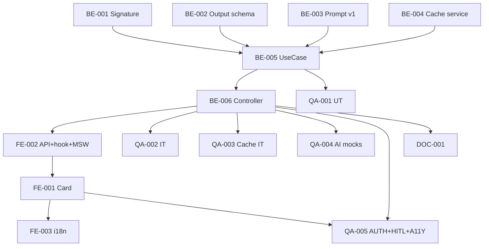

# Development Tasks — PB-P2-002 / US-024: AI Task Priority Top 3

## 1. Metadata

| Field | Value |
|---|---|
| User Story ID | US-024 |
| Source User Story | `management/user-stories/US-024-ai-task-prioritization.md` |
| Source Technical Specification | `management/technical-specs/P2/PB-P2-002/US-024-technical-spec.md` |
| Decision Resolution Artifact | `management/user-stories/decision-resolutions/US-024-decision-resolution.md` |
| Priority | P2 (Should Have) |
| Backlog ID | PB-P2-002 |
| Backlog Title | AI-008: Top 3 tareas urgentes IA |
| Backlog Execution Order | 2 (P2.2) |
| User Story Position in Backlog Item | 1 de 1 |
| Related User Stories in Backlog Item | US-024 |
| Epic | EPIC-AI-001 / EPIC-TASK-001 |
| Backlog Item Dependencies | US-028, US-031, US-082, US-084, US-022 |
| Feature | AI task priority + cache signature + locale + audit |
| Module / Domain | AI / Tasks |
| Backlog Alignment Status | Found |
| Task Breakdown Status | Ready for Sprint Planning |
| Created Date | 2026-06-29 |
| Last Updated | 2026-06-29 |

---

## 2. Source Validation

| Source | Found | Used | Notes |
|---|---|---|---|
| User Story | Yes | Yes | Approved with Minor Notes. |
| Technical Specification | Yes | Yes | Ready for Task Breakdown. |
| Decision Resolution Artifact | Yes | Yes | 9/9 decisiones. |
| Product Backlog Prioritized | Yes | Yes | PB-P2-002. |

---

## 3. Backlog Execution Context

PB-P2-002 single-story. Execution order 53.

---

## 4. Task Breakdown Summary

| Area | Count | Notes |
|---|---:|---|
| BE | 6 | Signature, Output schema, Prompt, Cache service, UseCase, Controller |
| FE | 3 | Card + hook, API+MSW, i18n |
| QA | 5 | UT, IT cache, AI mocks, AUTH+HITL, A11Y |
| DOC | 1 | `docs/16` + `docs/7` + housekeeping backlog |
| **Total** | 15 | |

---

## 5. Traceability Matrix

| AC | Task IDs |
|---|---|
| AC-01 top 3 | BE-005 UseCase, QA-002 |
| AC-02 empty state | BE-005 + FE-001, QA-002 |
| AC-03 <3 tasks | BE-005, QA-002 |
| AC-04 cache hit | BE-004 cache + BE-005, QA-003 |
| AC-05 cache miss tras edit | BE-001 signature + BE-004 + BE-005, QA-003 |
| AC-06 locale binding | BE-005 con US-084, QA-004 |
| AC-07 fallback | BE-005 try/catch, QA-004 |
| EC-01..04 | BE-005, QA-002/QA-005 |

---

## 6. Development Tasks

### TASK-PB-P2-002-US-024-BE-001 — Signature helper `computeChecklistSignature`

| Field | Value |
|---|---|
| Area | Backend / Shared |
| Type | Implementation |
| Priority | Must |
| Estimate | XS |
| Depends On | - |
| Source AC(s) | AC-04, AC-05 |
| Technical Spec Section(s) | §7 |
| Backlog ID | PB-P2-002 |
| User Story ID | US-024 |
| Owner Role | Backend |
| Status | To Do |

#### Objective
sha256 de sorted task_ids + status + updated_at.

#### Definition of Done
- [ ] Helper + UT (consistencia, cambio).

---

### TASK-PB-P2-002-US-024-BE-002 — Output schema Zod `taskPriorityOutputSchema`

| Field | Value |
|---|---|
| Area | Backend |
| Type | Implementation |
| Priority | Must |
| Estimate | S |
| Depends On | - |
| Source AC(s) | AC-01, EC-04 |
| Technical Spec Section(s) | §7 |
| Backlog ID | PB-P2-002 |
| User Story ID | US-024 |
| Owner Role | Backend |
| Status | To Do |

#### Definition of Done
- [ ] Schema + UT (válido + malformado + max items).

---

### TASK-PB-P2-002-US-024-BE-003 — Prompt template `TaskPriorityPrompt v1`

| Field | Value |
|---|---|
| Area | Backend / AI |
| Type | Implementation |
| Priority | Must |
| Estimate | M |
| Depends On | - |
| Source AC(s) | AC-01, AC-06, HITL |
| Technical Spec Section(s) | §11 |
| Backlog ID | PB-P2-002 |
| User Story ID | US-024 |
| Owner Role | Backend / Content |
| Status | To Do |

#### Definition of Done
- [ ] Prompt versionado en archivo.
- [ ] Snapshot test del prompt.

---

### TASK-PB-P2-002-US-024-BE-004 — `TaskPriorityCacheService` in-memory shared

| Field | Value |
|---|---|
| Area | Backend |
| Type | Implementation |
| Priority | Must |
| Estimate | S |
| Depends On | - |
| Source AC(s) | AC-04, AC-05 |
| Technical Spec Section(s) | §7 |
| Backlog ID | PB-P2-002 |
| User Story ID | US-024 |
| Owner Role | Backend |
| Status | To Do |

#### Objective
In-memory cache con TTL 5min + lazy expiry (paridad MetricsCacheService US-079).

#### Definition of Done
- [ ] Service + UT (set/get/expiry).

---

### TASK-PB-P2-002-US-024-BE-005 — `PrioritizeTasksUseCase` atómico

| Field | Value |
|---|---|
| Area | Backend |
| Type | Implementation |
| Priority | Must |
| Estimate | L |
| Depends On | BE-001..BE-004, US-084 |
| Source AC(s) | AC-01..AC-07, EC-01..EC-04 |
| Technical Spec Section(s) | §7 |
| Backlog ID | PB-P2-002 |
| User Story ID | US-024 |
| Owner Role | Backend |
| Status | To Do |

#### Objective
Ownership + load tareas elegibles + cache lookup + AIProviderPort.generate({locale}) + Zod validate + validar task_ids ∈ set + persist AIRecommendation + cache populate + log.

#### Definition of Done
- [ ] Coverage ≥ 90%.
- [ ] Branches: ≥3, <3, 0, cache hit, cache miss, AI error, output invalid task_ids.

---

### TASK-PB-P2-002-US-024-BE-006 — Controller + ruta + organizer guard + rate limit

| Field | Value |
|---|---|
| Area | Backend / API |
| Type | Implementation |
| Priority | Must |
| Estimate | S |
| Depends On | BE-005, US-022 BE-006 (rate limit) |
| Source AC(s) | AC-01, AUTH, EC-01 |
| Technical Spec Section(s) | §7 |
| Backlog ID | PB-P2-002 |
| User Story ID | US-024 |
| Owner Role | Backend |
| Status | To Do |

#### Definition of Done
- [ ] Ruta operativa con organizerRoleGuard + aiRateLimit.

---

### TASK-PB-P2-002-US-024-FE-001 — `AITaskPriorityCard` accesible

| Field | Value |
|---|---|
| Area | Frontend |
| Type | Implementation |
| Priority | Must |
| Estimate | M |
| Depends On | FE-002 |
| Source AC(s) | AC-01..AC-07, A11Y |
| Technical Spec Section(s) | §8 |
| Backlog ID | PB-P2-002 |
| User Story ID | US-024 |
| Owner Role | Frontend |
| Status | To Do |

#### Objective
Card con role=list + items + UrgencyBadge + deep-link mark done (US-030) + regenerate + fallback badge.

#### Definition of Done
- [ ] axe sin issues.

---

### TASK-PB-P2-002-US-024-FE-002 — `aiApi.generateTaskPriority` + MSW + hook

| Field | Value |
|---|---|
| Area | Frontend |
| Type | Implementation |
| Priority | Must |
| Estimate | S |
| Depends On | BE-006 |
| Source AC(s) | AC-01..AC-07 |
| Technical Spec Section(s) | §8 |
| Backlog ID | PB-P2-002 |
| User Story ID | US-024 |
| Owner Role | Frontend |
| Status | To Do |

#### Definition of Done
- [ ] MSW handlers `200/400/401/403/404/429`.
- [ ] Hook `useTaskPriority` con cache invalidation correcta.

---

### TASK-PB-P2-002-US-024-FE-003 — i18n `organizer.ai.task_priority.*` (4 locales)

| Field | Value |
|---|---|
| Area | Frontend / i18n |
| Type | Implementation |
| Priority | Must |
| Estimate | XS |
| Depends On | FE-001 |
| Source AC(s) | i18n |
| Technical Spec Section(s) | §8 |
| Backlog ID | PB-P2-002 |
| User Story ID | US-024 |
| Owner Role | Frontend |
| Status | To Do |

#### Definition of Done
- [ ] Labels completos en 4 locales.

---

### TASK-PB-P2-002-US-024-QA-001 — UT (signature + cache + schema + UseCase branches)

| Field | Value |
|---|---|
| Area | QA |
| Type | Test |
| Priority | Must |
| Estimate | M |
| Depends On | BE-005 |
| Source AC(s) | Múltiples |
| Technical Spec Section(s) | §13 |
| Backlog ID | PB-P2-002 |
| User Story ID | US-024 |
| Owner Role | QA / Backend |
| Status | To Do |

#### Definition of Done
- [ ] Coverage ≥ 90%.

---

### TASK-PB-P2-002-US-024-QA-002 — IT (top3, <3, empty, fallback)

| Field | Value |
|---|---|
| Area | QA |
| Type | Test |
| Priority | Must |
| Estimate | M |
| Depends On | BE-006 |
| Source AC(s) | AC-01..AC-03, AC-07, EC-04 |
| Technical Spec Section(s) | §13 |
| Backlog ID | PB-P2-002 |
| User Story ID | US-024 |
| Owner Role | QA |
| Status | To Do |

#### Definition of Done
- [ ] 4 escenarios cubiertos.

---

### TASK-PB-P2-002-US-024-QA-003 — IT cache hit/miss tras editar task

| Field | Value |
|---|---|
| Area | QA |
| Type | Test |
| Priority | Must |
| Estimate | S |
| Depends On | BE-006 |
| Source AC(s) | AC-04, AC-05 |
| Technical Spec Section(s) | §13 |
| Backlog ID | PB-P2-002 |
| User Story ID | US-024 |
| Owner Role | QA |
| Status | To Do |

#### Objective
- Request 1 → cache miss.
- Request 2 inmediato → cache hit.
- Editar task (cambia updated_at) → request 3 → cache miss (signature change).

#### Definition of Done
- [ ] 3 escenarios verdes.

---

### TASK-PB-P2-002-US-024-QA-004 — AI mocks + locale binding + heurísticas

| Field | Value |
|---|---|
| Area | QA |
| Type | Test |
| Priority | Must |
| Estimate | M |
| Depends On | BE-006, US-084 |
| Source AC(s) | AC-06, AC-07 |
| Technical Spec Section(s) | §13 |
| Backlog ID | PB-P2-002 |
| User Story ID | US-024 |
| Owner Role | QA |
| Status | To Do |

#### Objective
- Mock retorna top válido en pt: heurística tokens PT + AIRecommendation.locale='pt'.
- Mock timeout: fallback.
- Mock retorna task_ids inválidos: fallback.

#### Definition of Done
- [ ] 3 escenarios AI verdes.

---

### TASK-PB-P2-002-US-024-QA-005 — Authorization + HITL + rate limit + A11Y

| Field | Value |
|---|---|
| Area | QA / Security / A11Y |
| Type | Test |
| Priority | Must |
| Estimate | S |
| Depends On | BE-006, FE-001 |
| Source AC(s) | AUTH-TS-01..04, A11Y, EC-01 |
| Technical Spec Section(s) | §12, §13 |
| Backlog ID | PB-P2-002 |
| User Story ID | US-024 |
| Owner Role | QA |
| Status | To Do |

#### Objective
- AUTH matrix completa + 404 uniforme.
- Verificar NO existe endpoint que mark task done auto.
- Rate limit: 6ª request ⇒ 429.
- Card axe sin issues.

#### Definition of Done
- [ ] AUTH + HITL + rate + A11Y verificados.

---

### TASK-PB-P2-002-US-024-DOC-001 — Documentar AI-008 + housekeeping backlog

| Field | Value |
|---|---|
| Area | Documentation |
| Type | Documentation |
| Priority | Must |
| Estimate | S |
| Depends On | BE-006 |
| Source AC(s) | All |
| Technical Spec Section(s) | §16 |
| Backlog ID | PB-P2-002 |
| User Story ID | US-024 |
| Owner Role | Backend / Doc |
| Status | To Do |

#### Objective
- `docs/7`: documentar prompt v1 + cache strategy 5min.
- `docs/16 §M07`: documentar endpoint.
- Housekeeping del backlog (PB-P2-002 cita `FR-AI-020` inexistente).

#### Definition of Done
- [ ] Docs actualizados.

---

## 7. Required QA Tasks
Ver §6.

## 8. Required Security Tasks
| Task ID | Concern |
|---|---|
| TASK-PB-P2-002-US-024-QA-005 | AUTH + HITL + rate limit |

## 9. Required Seed / Demo Tasks
`No aplica`.

## 10. Observability / Audit Tasks
Logs incluidos en BE-005 + AIRecommendation persistido.

## 11. Documentation / Traceability Tasks
| Task ID | Doc |
|---|---|
| TASK-PB-P2-002-US-024-DOC-001 | `docs/7` + `docs/16` + housekeeping |

## 12. Dependency Graph

---

## 13. Suggested Implementation Order

**Phase 1**: BE-001 Signature, BE-002 Output schema, BE-003 Prompt v1, BE-004 Cache.
**Phase 2**: BE-005 UseCase, BE-006 Controller.
**Phase 3**: FE-002 API+hook, FE-001 Card, FE-003 i18n.
**Phase 4**: QA-001..005.
**Phase 5**: DOC-001.

---

## 14. Risks & Mitigations
Ver §17 del Technical Spec.

## 15. Out of Scope Confirmation
Auto-reorder, push notifications, edit top.

## 16. Readiness for Sprint Planning

| Check | Status |
|---|---|
| Product Backlog mapping found | Pass |
| Every AC maps to tasks | Pass |
| Technical Spec used when available | Pass |
| QA tasks included | Pass |
| AI binding tests included | Pass |
| Cache tests included | Pass |
| Documentation tasks included | Pass |
| Task dependencies clear | Pass |
| Ready for Sprint Planning | Yes |

---

## 17. Final Recommendation

`Ready for Sprint Planning`.

US-024 entrega 15 tareas: AI task priority endpoint + cache signature 5min + locale binding (US-084 contract) + HITL strict + audit completo + fallback. **Cierra PB-P2-002**.
