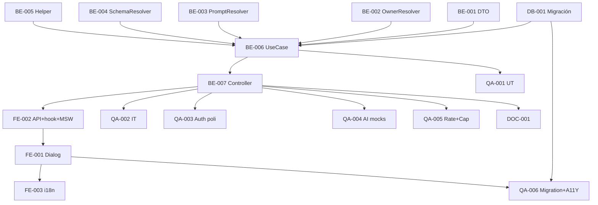

# Development Tasks — PB-P2-003 / US-026: AI Regenerate with Feedback (Cross-Cutting)

## 1. Metadata

| Field | Value |
|---|---|
| User Story ID | US-026 |
| Source User Story | `management/user-stories/US-026-regenerate-ai-suggestion-with-feedback.md` |
| Source Technical Specification | `management/technical-specs/P2/PB-P2-003/US-026-technical-spec.md` |
| Decision Resolution Artifact | `management/user-stories/decision-resolutions/US-026-decision-resolution.md` |
| Priority | P2 (Should Have) |
| Backlog ID | PB-P2-003 |
| Backlog Title | Regenerar sugerencia IA con feedback (cap 5) |
| Backlog Execution Order | 3 (P2.3) |
| User Story Position in Backlog Item | 1 de 1 |
| Related User Stories in Backlog Item | US-026 |
| Epic | EPIC-AI-001 (transversal) |
| Backlog Item Dependencies | US-017..US-024, US-022, US-082, US-084 |
| Feature | Schema lineage + UseCase cross-cutting + owner resolver + helper PromptOps + dialog shared |
| Module / Domain | AI / Cross-cutting |
| Backlog Alignment Status | Found |
| Task Breakdown Status | Ready for Sprint Planning |
| Created Date | 2026-06-29 |
| Last Updated | 2026-06-29 |

---

## 2. Source Validation

| Source | Found | Used | Notes |
|---|---|---|---|
| User Story | Yes | Yes | Approved with Minor Notes. |
| Technical Specification | Yes | Yes | Ready for Task Breakdown. |
| Decision Resolution Artifact | Yes | Yes | 10/10 decisiones. |
| Product Backlog Prioritized | Yes | Yes | PB-P2-003. |

---

## 3. Backlog Execution Context

PB-P2-003 single-story. Execution order 54.

---

## 4. Task Breakdown Summary

| Area | Count | Notes |
|---|---:|---|
| DB | 1 | Migración 3 columnas + FKs + backfill |
| BE | 7 | DTO, OwnerResolver, PromptResolver, SchemaResolver, helper, UseCase, Controller |
| FE | 3 | Dialog shared, hook+API, i18n |
| QA | 6 | UT, IT linaje, IT auth polimórfica, AI mocks por type, A11Y, Migration |
| DOC | 1 | `docs/16` + `docs/7` + verificar BR |
| **Total** | 18 | |

---

## 5. Traceability Matrix

| AC | Task IDs |
|---|---|
| AC-01 regen exitosa | BE-006 UseCase, QA-002 |
| AC-02 límite linaje | BE-006 count, QA-002 |
| AC-03 feedback vacío | BE-005 helper, QA-002 |
| AC-04 padre eliminado | BE-006 lookup, QA-002 |
| AC-05 auth polimórfica | BE-002 resolver, QA-003 |
| AC-06 locale heredado | BE-006, QA-002 |
| AC-07 rate limit | BE-007 controller + middleware, QA-005 |
| AC-08 fallback | BE-006 try/catch, QA-004 |
| EC-01..04 | BE-001 DTO, BE-006, QA-002 |
| Migration | DB-001, QA-006 |

---

## 6. Development Tasks

### TASK-PB-P2-003-US-026-DB-001 — Migración lineage + backfill

| Field | Value |
|---|---|
| Area | Database / Prisma |
| Type | Implementation |
| Priority | Must |
| Estimate | S |
| Depends On | PB-P0-001 (ai_recommendations existe) |
| Source AC(s) | All |
| Technical Spec Section(s) | §10 |
| Backlog ID | PB-P2-003 |
| User Story ID | US-026 |
| Owner Role | Backend |
| Status | To Do |

#### Objective
3 columnas + 2 FKs + 2 indexes + backfill root_id=id para rows existentes.

#### Definition of Done
- [ ] Migración aplica + backfill 100%.

---

### TASK-PB-P2-003-US-026-BE-001 — DTO `regenerateBody`

| Field | Value |
|---|---|
| Area | Backend |
| Type | Implementation |
| Priority | Must |
| Estimate | XS |
| Depends On | - |
| Source AC(s) | EC-01 |
| Technical Spec Section(s) | §7 |
| Backlog ID | PB-P2-003 |
| User Story ID | US-026 |
| Owner Role | Backend |
| Status | To Do |

#### Definition of Done
- [ ] Zod .strict() + max 500 + UT.

---

### TASK-PB-P2-003-US-026-BE-002 — `AIRecommendationOwnerResolver`

| Field | Value |
|---|---|
| Area | Backend |
| Type | Implementation |
| Priority | Must |
| Estimate | S |
| Depends On | - |
| Source AC(s) | AC-05, AUTH |
| Technical Spec Section(s) | §7 |
| Backlog ID | PB-P2-003 |
| User Story ID | US-026 |
| Owner Role | Backend |
| Status | To Do |

#### Objective
Mapping TYPE_OWNERSHIP + métodos resolve/matches.

#### Definition of Done
- [ ] UT cubre matrix completa (7 types × 2 user roles).

---

### TASK-PB-P2-003-US-026-BE-003 — `PromptTemplateResolver` por type

| Field | Value |
|---|---|
| Area | Backend |
| Type | Implementation |
| Priority | Must |
| Estimate | S |
| Depends On | US-017..024 prompts existentes |
| Source AC(s) | AC-01 |
| Technical Spec Section(s) | §7, §11 |
| Backlog ID | PB-P2-003 |
| User Story ID | US-026 |
| Owner Role | Backend |
| Status | To Do |

#### Definition of Done
- [ ] Resolver con lookup por type + UT.

---

### TASK-PB-P2-003-US-026-BE-004 — `OutputSchemaResolver` por type (Zod)

| Field | Value |
|---|---|
| Area | Backend |
| Type | Implementation |
| Priority | Must |
| Estimate | S |
| Depends On | US-017..024 schemas Zod existentes |
| Source AC(s) | AC-01 |
| Technical Spec Section(s) | §7 |
| Backlog ID | PB-P2-003 |
| User Story ID | US-026 |
| Owner Role | Backend |
| Status | To Do |

#### Definition of Done
- [ ] Resolver + UT.

---

### TASK-PB-P2-003-US-026-BE-005 — Helper `injectFeedbackForRegeneration`

| Field | Value |
|---|---|
| Area | Backend / AI |
| Type | Implementation |
| Priority | Must |
| Estimate | XS |
| Depends On | - |
| Source AC(s) | AC-03 |
| Technical Spec Section(s) | §11 |
| Backlog ID | PB-P2-003 |
| User Story ID | US-026 |
| Owner Role | Backend |
| Status | To Do |

#### Definition of Done
- [ ] Helper + UT (con/sin feedback).

---

### TASK-PB-P2-003-US-026-BE-006 — `RegenerateAIRecommendationUseCase`

| Field | Value |
|---|---|
| Area | Backend |
| Type | Implementation |
| Priority | Must |
| Estimate | L |
| Depends On | DB-001, BE-001..005, US-084 |
| Source AC(s) | AC-01..AC-08, EC-02..EC-04 |
| Technical Spec Section(s) | §7 |
| Backlog ID | PB-P2-003 |
| User Story ID | US-026 |
| Owner Role | Backend |
| Status | To Do |

#### Objective
Transacción atómica: lookup parent + auth + count linaje + AI generate + Zod validate + INSERT child + log.

#### Definition of Done
- [ ] Coverage ≥ 90%.
- [ ] Branches: regen ok, linaje 5, parent deleted, auth fail, AI error, output malformed.

---

### TASK-PB-P2-003-US-026-BE-007 — Controller + ruta + rate limit + env var config

| Field | Value |
|---|---|
| Area | Backend / API |
| Type | Implementation |
| Priority | Must |
| Estimate | S |
| Depends On | BE-006, US-022 BE-006 |
| Source AC(s) | AC-01, AC-07, AUTH |
| Technical Spec Section(s) | §7 |
| Backlog ID | PB-P2-003 |
| User Story ID | US-026 |
| Owner Role | Backend |
| Status | To Do |

#### Objective
Controller + ruta con authGuard (organizer OR vendor) + aiRateLimit. Configurar `AI_MAX_REGENERATIONS_PER_LINEAGE=5` env.

#### Definition of Done
- [ ] Ruta operativa + env documentada.

---

### TASK-PB-P2-003-US-026-FE-001 — `AIRegenerateDialog` shared accesible

| Field | Value |
|---|---|
| Area | Frontend |
| Type | Implementation |
| Priority | Must |
| Estimate | M |
| Depends On | FE-002 |
| Source AC(s) | AC-01, AC-03, A11Y |
| Technical Spec Section(s) | §8 |
| Backlog ID | PB-P2-003 |
| User Story ID | US-026 |
| Owner Role | Frontend |
| Status | To Do |

#### Objective
Dialog genérico con textarea + counter + RHF+Zod + error banner por tipo.

#### Definition of Done
- [ ] axe sin issues + focus trap.

---

### TASK-PB-P2-003-US-026-FE-002 — `aiApi.regenerate` + hook + MSW

| Field | Value |
|---|---|
| Area | Frontend |
| Type | Implementation |
| Priority | Must |
| Estimate | S |
| Depends On | BE-007 |
| Source AC(s) | AC-01..AC-08 |
| Technical Spec Section(s) | §8 |
| Backlog ID | PB-P2-003 |
| User Story ID | US-026 |
| Owner Role | Frontend |
| Status | To Do |

#### Definition of Done
- [ ] MSW handlers `201/400/401/404/429`.

---

### TASK-PB-P2-003-US-026-FE-003 — i18n `ai.regenerate.*` (4 locales)

| Field | Value |
|---|---|
| Area | Frontend / i18n |
| Type | Implementation |
| Priority | Must |
| Estimate | XS |
| Depends On | FE-001 |
| Source AC(s) | i18n |
| Technical Spec Section(s) | §8 |
| Backlog ID | PB-P2-003 |
| User Story ID | US-026 |
| Owner Role | Frontend |
| Status | To Do |

#### Definition of Done
- [ ] Labels completos en 4 locales.

---

### TASK-PB-P2-003-US-026-QA-001 — UT (DTO + Resolvers + helper + UseCase branches)

| Field | Value |
|---|---|
| Area | QA |
| Type | Test |
| Priority | Must |
| Estimate | M |
| Depends On | BE-006 |
| Source AC(s) | Múltiples |
| Technical Spec Section(s) | §13 |
| Backlog ID | PB-P2-003 |
| User Story ID | US-026 |
| Owner Role | QA / Backend |
| Status | To Do |

#### Definition of Done
- [ ] Coverage ≥ 90%.

---

### TASK-PB-P2-003-US-026-QA-002 — IT (regen + linaje 5 + parent eliminado + locale heredado)

| Field | Value |
|---|---|
| Area | QA |
| Type | Test |
| Priority | Must |
| Estimate | M |
| Depends On | BE-007 |
| Source AC(s) | AC-01..AC-06, AC-08, EC-02 |
| Technical Spec Section(s) | §13 |
| Backlog ID | PB-P2-003 |
| User Story ID | US-026 |
| Owner Role | QA |
| Status | To Do |

#### Definition of Done
- [ ] 6 escenarios cubiertos.

---

### TASK-PB-P2-003-US-026-QA-003 — IT Authorization polimórfica (organizer + vendor + cruzados)

| Field | Value |
|---|---|
| Area | QA / Security |
| Type | Test |
| Priority | Must |
| Estimate | M |
| Depends On | BE-007 |
| Source AC(s) | AUTH-TS-01..05 |
| Technical Spec Section(s) | §12 |
| Backlog ID | PB-P2-003 |
| User Story ID | US-026 |
| Owner Role | QA |
| Status | To Do |

#### Objective
Matrix completa: organizer dueño/ajeno × vendor dueño/ajeno × types organizer/vendor. `404` uniforme en mismatches.

#### Definition of Done
- [ ] 5+ escenarios verdes.

---

### TASK-PB-P2-003-US-026-QA-004 — AI mocks por type (mínimo event_plan + quote_brief)

| Field | Value |
|---|---|
| Area | QA |
| Type | Test |
| Priority | Must |
| Estimate | M |
| Depends On | BE-007 |
| Source AC(s) | AC-01, AC-08 |
| Technical Spec Section(s) | §13 |
| Backlog ID | PB-P2-003 |
| User Story ID | US-026 |
| Owner Role | QA |
| Status | To Do |

#### Objective
- event_plan: mock variant válida + persist child con event_plan schema.
- event_plan: mock timeout → fallback + locale_fallback=true.
- quote_brief: mock variant válida + auth vendor.

#### Definition of Done
- [ ] 3 escenarios AI verdes.

---

### TASK-PB-P2-003-US-026-QA-005 — Rate limit + cap regen E2E

| Field | Value |
|---|---|
| Area | QA / Security |
| Type | Test |
| Priority | Must |
| Estimate | S |
| Depends On | BE-007, US-022 BE-006 |
| Source AC(s) | AC-02, AC-07 |
| Technical Spec Section(s) | §12 |
| Backlog ID | PB-P2-003 |
| User Story ID | US-026 |
| Owner Role | QA |
| Status | To Do |

#### Objective
- Rate limit: 6ª request en 1min → `429 AI_RATE_LIMITED`.
- Cap: 6ª regen en mismo linaje → `429 REGENERATION_LIMIT`.

#### Definition of Done
- [ ] 2 escenarios diferenciados verdes.

---

### TASK-PB-P2-003-US-026-QA-006 — Migration backfill + A11Y dialog

| Field | Value |
|---|---|
| Area | QA / A11Y / DB |
| Type | Test |
| Priority | Must |
| Estimate | S |
| Depends On | DB-001, FE-001 |
| Source AC(s) | A11Y, Migration |
| Technical Spec Section(s) | §10, §13 |
| Backlog ID | PB-P2-003 |
| User Story ID | US-026 |
| Owner Role | QA |
| Status | To Do |

#### Definition of Done
- [ ] Backfill 100% root_id=id correcto.
- [ ] Dialog axe sin issues + focus trap verificado.

---

### TASK-PB-P2-003-US-026-DOC-001 — Documentar UC-AI-010 + linaje + env var

| Field | Value |
|---|---|
| Area | Documentation |
| Type | Documentation |
| Priority | Must |
| Estimate | S |
| Depends On | BE-007 |
| Source AC(s) | All |
| Technical Spec Section(s) | §16 |
| Backlog ID | PB-P2-003 |
| User Story ID | US-026 |
| Owner Role | Backend / Doc |
| Status | To Do |

#### Objective
- `docs/7`: documentar UC-AI-010 + linaje + cap 5 + env var.
- `docs/16 §M07`: documentar endpoint.
- Verificar `docs/4` BR-AI-008..010 cubren regeneración.

#### Definition of Done
- [ ] Docs actualizados.

---

## 7. Required QA Tasks
Ver §6.

## 8. Required Security Tasks
| Task ID | Concern |
|---|---|
| TASK-PB-P2-003-US-026-QA-003 | Auth polimórfica |
| TASK-PB-P2-003-US-026-QA-005 | Rate limit + cap |

## 9. Required Seed / Demo Tasks
`No aplica` (reuso seed; opcional verificar root_id=self.id).

## 10. Observability / Audit Tasks
Logs incluidos en BE-006 + AIRecommendation lineage persistido.

## 11. Documentation / Traceability Tasks
| Task ID | Doc |
|---|---|
| TASK-PB-P2-003-US-026-DOC-001 | `docs/7` + `docs/16` + verificación `docs/4` |

## 12. Dependency Graph

---

## 13. Suggested Implementation Order

**Phase 1**: DB-001, BE-001 DTO, BE-002 OwnerResolver, BE-005 helper, BE-007 env var config.
**Phase 2**: BE-003 PromptResolver, BE-004 SchemaResolver, BE-006 UseCase.
**Phase 3**: BE-007 Controller, FE-002 API+hook, FE-001 Dialog, FE-003 i18n.
**Phase 4**: QA-001..006.
**Phase 5**: DOC-001.

---

## 14. Risks & Mitigations
Ver §17 del Technical Spec.

## 15. Out of Scope Confirmation
Comparison side-by-side, auto-rollback, SSE streaming.

## 16. Readiness for Sprint Planning

| Check | Status |
|---|---|
| Product Backlog mapping found | Pass |
| Every AC maps to tasks | Pass |
| Technical Spec used when available | Pass |
| QA tasks included | Pass |
| Cross-cutting design verified by tests | Pass |
| Auth polimórfica probada | Pass |
| Documentation tasks included | Pass |
| Task dependencies clear | Pass |
| Ready for Sprint Planning | Yes |

---

## 17. Final Recommendation

`Ready for Sprint Planning`.

US-026 entrega 18 tareas: schema lineage + UseCase cross-cutting + owner resolver polimórfico + 3 resolvers por type + helper PromptOps + dialog shared + tests exhaustivos (auth matrix + AI mocks por type + rate/cap diferenciados + migration). **Cierra PB-P2-003**. Habilita HITL iterativo para TODAS las features AI del MVP.
