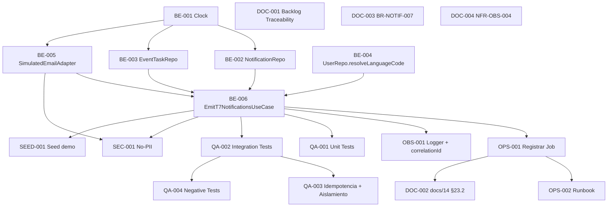

# Development Tasks — PB-P2-004 / US-034: Recibir notificación in-app de T-7

## 1. Metadata

| Field                                | Value                                                                                                |
| ------------------------------------ | ---------------------------------------------------------------------------------------------------- |
| User Story ID                        | US-034                                                                                                |
| Source User Story                    | `management/user-stories/US-034-inapp-notification-t-minus-7.md`                                      |
| Source Technical Specification       | `management/technical-specs/P2/PB-P2-004/US-034-technical-spec.md`                                    |
| Decision Resolution Artifact         | `management/user-stories/decision-resolutions/US-034-decision-resolution.md`                          |
| Priority                             | P2                                                                                                    |
| Backlog ID                           | PB-P2-004                                                                                             |
| Backlog Title                        | Notificación T-7 (tareas) · `Job EmitT7NotificationsJob + surface in-app`                              |
| Backlog Execution Order              | 4 (cuarto ítem dentro de P2)                                                                          |
| User Story Position in Backlog Item  | 1 de 2 (US-034 = job; US-071 = surface organizer)                                                     |
| Related User Stories in Backlog Item | US-034 (job), US-071 (surface organizer). US-072 mark-as-read en PB-P2-008.                            |
| Epic                                 | EPIC-NOT-001 / EPIC-TASK-001                                                                          |
| Backlog Item Dependencies            | PB-P1-018 (CRUD de tareas), PB-P2-009 (referencial, sin impacto funcional)                            |
| Feature                              | Notificación T-7                                                                                      |
| Module / Domain                      | Notifications / Tasks                                                                                 |
| Backlog Alignment Status             | Found                                                                                                 |
| Task Breakdown Status                | Ready for Sprint Planning                                                                             |
| Created Date                         | 2026-06-29                                                                                            |
| Last Updated                         | 2026-06-29                                                                                            |

---

## 2. Source Validation

| Source                       | Found | Used | Notes                                                                                                                          |
| ---------------------------- | ----- | ---- | ------------------------------------------------------------------------------------------------------------------------------ |
| User Story                   | Yes   | Yes  | `Approved with Minor Notes`; AC-01..AC-05 + EC-01..EC-07 + VR-01..VR-03 + SEC-01..SEC-04.                                       |
| Technical Specification      | Yes   | Yes  | `Ready for Task Breakdown`. Define use case, repositorios, idempotencia, i18n, observabilidad.                                  |
| Decision Resolution Artifact | Yes   | Yes  | 6 decisiones D1–D6 formalizadas.                                                                                                |
| Product Backlog Prioritized  | Yes   | Yes  | PB-P2-004; Related US: US-034, US-071.                                                                                          |
| ADRs                         | No    | No   | No hay ADR ad-hoc; D1 puede requerir ADR sólo si Future promueve multi-timezone (fuera de scope).                                |

---

## 3. Backlog Execution Context

### Parent Backlog Item

**PB-P2-004 — Notificación T-7 (tareas)** (P2, Should Have). Entrega el job `EmitT7NotificationsJob` y el surface in-app del organizer. Acceptance Summary: "Job a 08:00 hora local. Idempotente. Solo tareas `pending/in_progress`".

### Execution Order Rationale

US-034 entrega el emisor del par (job + surface). US-071 depende de los `Notification(type='task_due_soon')` creados por este job. Por tanto US-034 va **antes** de US-071 dentro de PB-P2-004. Las dependencias upstream (PB-P1-018 — CRUD de tareas) ya están entregadas.

### Related User Stories in Same Backlog Item

| User Story | Role in Backlog Item                                                                          | Suggested Order |
| ---------- | --------------------------------------------------------------------------------------------- | --------------- |
| US-034     | Job + persistencia de `Notification` + log estructurado                                       | 1               |
| US-071     | Surface organizer (lista + badge); consume los `Notification` emitidos por US-034              | 2               |

---

## 4. Task Breakdown Summary

| Area                         | Number of Tasks | Notes                                                                                                                |
| ---------------------------- | --------------: | -------------------------------------------------------------------------------------------------------------------- |
| Product / Analysis           |               0 | Decisiones formalizadas; sin tareas de análisis abiertas.                                                            |
| Backend                      |               6 | `Clock`, 3 repositorios, `SimulatedEmailAdapter`, `EmitT7NotificationsUseCase`.                                       |
| Frontend                     |               0 | No aplica (surface en US-071).                                                                                        |
| API Contract                 |               0 | No aplica (job sin endpoint).                                                                                         |
| Database / Prisma            |               0 | Sin migración.                                                                                                        |
| AI / PromptOps               |               0 | No aplica.                                                                                                            |
| Security / Authorization     |               1 | Test de regresión no-PII en log estructurado.                                                                          |
| QA / Testing                 |               4 | Unit tests del use case + integration tests con clock injectable + idempotencia + timezone.                            |
| Seed / Demo Data             |               1 | Validar/ajustar seed para incluir tarea T-7 demo.                                                                      |
| DevOps / Environment         |               2 | Registro del job en `server.ts` con `TZ=America/Guatemala`; runbook demo.                                              |
| Observability / Audit        |               1 | Logger estructurado con `correlationId` y resumen `affected=N`.                                                        |
| Documentation / Traceability |               4 | 4 ítems de Documentation Alignment Required (PB-P2-004, docs/14 §23.2, docs/4 §BR-NOTIF-007, docs/10 §NFR-OBS-004). |
| **Total**                    |          **19** |                                                                                                                       |

---

## 5. Traceability Matrix

| Acceptance Criterion                       | Technical Spec Section                                                                              | Task IDs                                                                                                                                                                                                                                                                                  |
| ------------------------------------------ | --------------------------------------------------------------------------------------------------- | ------------------------------------------------------------------------------------------------------------------------------------------------------------------------------------------------------------------------------------------------------------------------------------------ |
| AC-01 — Emisión correcta T-7               | §7 Backend Design; §10 Database; §6 Functional Interpretation                                       | TASK-PB-P2-004-US-034-BE-002, TASK-PB-P2-004-US-034-BE-003, TASK-PB-P2-004-US-034-BE-005, TASK-PB-P2-004-US-034-BE-006, TASK-PB-P2-004-US-034-OPS-001, TASK-PB-P2-004-US-034-QA-001, TASK-PB-P2-004-US-034-QA-002 |
| AC-02 — Idempotencia                       | §7 Backend Design (existsTaskDueSoonForTask); §17 Risks                                             | TASK-PB-P2-004-US-034-BE-002, TASK-PB-P2-004-US-034-BE-006, TASK-PB-P2-004-US-034-QA-001, TASK-PB-P2-004-US-034-QA-003                                                                                                                                                                |
| AC-03 — Aislamiento BR-NOTIF-005           | §12 Security & Authorization                                                                        | TASK-PB-P2-004-US-034-BE-006, TASK-PB-P2-004-US-034-SEC-001, TASK-PB-P2-004-US-034-QA-003                                                                                                                                                                                              |
| AC-04 — Idioma del Notification            | §7 Backend Design (resolveLanguageCode); §6 Functional Interpretation                               | TASK-PB-P2-004-US-034-BE-004, TASK-PB-P2-004-US-034-BE-005, TASK-PB-P2-004-US-034-BE-006, TASK-PB-P2-004-US-034-QA-001                                                                                                                                                                |
| AC-05 — Observabilidad del run             | §14 Observability & Audit; §17 Risks                                                                | TASK-PB-P2-004-US-034-OBS-001, TASK-PB-P2-004-US-034-BE-006, TASK-PB-P2-004-US-034-SEC-001, TASK-PB-P2-004-US-034-QA-002                                                                                                                                                                |
| EC-01..EC-07 (estados / rangos)            | §7 Backend Design (filtros SQL); §6 Functional Interpretation                                       | TASK-PB-P2-004-US-034-BE-003, TASK-PB-P2-004-US-034-BE-006, TASK-PB-P2-004-US-034-QA-002, TASK-PB-P2-004-US-034-QA-004                                                                                                                                                                  |
| Seed demo                                  | §15 Seed / Demo Data Impact                                                                          | TASK-PB-P2-004-US-034-SEED-001                                                                                                                                                                                                                                                              |
| Bootstrap del job                          | §7 Backend Design (Scheduler); §16 Documentation Alignment                                          | TASK-PB-P2-004-US-034-OPS-001, TASK-PB-P2-004-US-034-OPS-002                                                                                                                                                                                                                              |

Cobertura confirmada: cada AC y cada EC mapea a al menos una tarea de implementación o QA.

---

## 6. Development Tasks

### TASK-PB-P2-004-US-034-BE-001 — Implementar puerto `Clock` y `SystemClock` en `shared-kernel`

| Field                     | Value                                                                                  |
| ------------------------- | -------------------------------------------------------------------------------------- |
| Area                      | Backend                                                                                |
| Type                      | Implementation                                                                         |
| Priority                  | Must                                                                                   |
| Estimate                  | XS                                                                                     |
| Depends On                | —                                                                                      |
| Source AC(s)              | AC-01 (clock injectable habilita el resto), AC-05                                       |
| Technical Spec Section(s) | §7 Backend Design (Modules / Bounded Contexts), §13 Testing Strategy                    |
| Backlog ID                | PB-P2-004                                                                              |
| User Story ID             | US-034                                                                                 |
| Owner Role                | Backend                                                                                |
| Status                    | To Do                                                                                  |

#### Objective

Crear una abstracción `Clock` que permita inyectar `now()` desde tests y desde el job, evitando llamadas directas a `new Date()` en use cases.

#### Scope

##### Include

* `src/shared/clock.ts` con interfaz `Clock { now(): Date }`.
* `SystemClock` que retorna `new Date()`.
* Configuración de DI para que el resto del proyecto consuma `Clock`.

##### Exclude

* Mock clocks específicos (se crean en los tests, no como código de producción).
* Sustitución masiva de `Date.now()` en otros módulos (sólo donde lo necesite US-034).

#### Implementation Notes

* Alinear con `docs/14 §shared-kernel` y `docs/14 §23.x` (jobs MVP).
* En tests, exponer un `TestClock(fixedNow: Date)`.

#### Acceptance Criteria Covered

* AC-01 (precondición técnica del job).
* AC-05 (precondición para reproducir el `correlationId` con timestamp inyectado en tests).

#### Definition of Done

- [ ] `Clock` y `SystemClock` exportados desde `shared-kernel`.
- [ ] UT del `SystemClock` confirma que retorna `Date`.
- [ ] Lint, type-check, tests pasan.

---

### TASK-PB-P2-004-US-034-BE-002 — Extender `NotificationRepository` con `existsTaskDueSoonForTask` y `create`

| Field                     | Value                                                                                   |
| ------------------------- | --------------------------------------------------------------------------------------- |
| Area                      | Backend                                                                                 |
| Type                      | Implementation                                                                          |
| Priority                  | Must                                                                                    |
| Estimate                  | S                                                                                       |
| Depends On                | TASK-PB-P2-004-US-034-BE-001                                                            |
| Source AC(s)              | AC-01, AC-02                                                                            |
| Technical Spec Section(s) | §7 Backend Design (Repository / Persistence), §10 Database, §17 Technical Risks         |
| Backlog ID                | PB-P2-004                                                                               |
| User Story ID             | US-034                                                                                  |
| Owner Role                | Backend                                                                                 |
| Status                    | To Do                                                                                   |

#### Objective

Extender `NotificationRepository` (módulo `notifications`) con los métodos requeridos por el use case T-7: chequeo de idempotencia por `payload->>'task_id'` y creación con `language_code`.

#### Scope

##### Include

* `existsTaskDueSoonForTask(userId: string, taskId: string): Promise<boolean>` con la query SQL definida en §7 del Technical Spec.
* `create(input: CreateNotificationInput): Promise<Notification>` aceptando `channel` y `language_code` como parámetros.
* Tipos `CreateNotificationInput` con Zod validation del `payload` (`{taskId, eventId, dueDate}`).

##### Exclude

* Modificaciones al schema Prisma (sin migración).
* Cambios en otras consultas del repositorio.
* Unique constraint nuevo.

#### Implementation Notes

* Reutilizar `idx_notifications_user_status_sent` (filtra por `user_id`).
* `payload` se almacena como JSONB; usar `payload: { equals: ... }` o `payload->>'task_id'` vía `prisma.$queryRaw` si el cliente no soporta filtro nativo.
* No introducir `unique` constraint.

#### Acceptance Criteria Covered

* AC-01 (creación correcta), AC-02 (chequeo de existencia para idempotencia).

#### Definition of Done

- [ ] Métodos implementados y exportados.
- [ ] Zod schema del `payload` aplicado en `create`.
- [ ] Unit tests del repositorio (mock Prisma) cubren ambos métodos.
- [ ] Lint, type-check, tests pasan.

---

### TASK-PB-P2-004-US-034-BE-003 — Extender `EventTaskRepository` con `findT7Candidates`

| Field                     | Value                                                                            |
| ------------------------- | -------------------------------------------------------------------------------- |
| Area                      | Backend                                                                          |
| Type                      | Implementation                                                                   |
| Priority                  | Must                                                                             |
| Estimate                  | S                                                                                |
| Depends On                | TASK-PB-P2-004-US-034-BE-001                                                     |
| Source AC(s)              | AC-01 + EC-01..EC-07                                                             |
| Technical Spec Section(s) | §7 Backend Design (Repository / Persistence), §10 Database                       |
| Backlog ID                | PB-P2-004                                                                        |
| User Story ID             | US-034                                                                           |
| Owner Role                | Backend                                                                          |
| Status                    | To Do                                                                            |

#### Objective

Agregar al `EventTaskRepository` un método paginado que retorne los candidatos T-7 con el evento padre, aplicando todos los filtros de estado y rango exacto.

#### Scope

##### Include

* `findT7Candidates(targetDate: Date, batchSize: number): AsyncIterable<{ task: EventTask, event: Event }>`.
* SQL definido en §7 del Technical Spec (JOIN `events`, filtros `event.status='active'`, `event_task.status IN (pending,in_progress)`, `event_task.due_date IS NOT NULL`, `event_task.due_date = $targetDate`, `ORDER BY e.id, t.id`, `LIMIT/OFFSET`).
* Iteración por chunks.

##### Exclude

* Otros filtros (no parametrizar por owner).
* Caching o materialized view.

#### Implementation Notes

* Considerar `prisma.$queryRaw<{...}>` para mayor control del SQL.
* `targetDate` se calcula fuera del repo (en el use case).

#### Acceptance Criteria Covered

* AC-01 (selección de candidatas), EC-01..EC-07 (todos los filtros).

#### Definition of Done

- [ ] Método implementado con iteración por chunks.
- [ ] Unit tests del repositorio con DB ephemeral validan los 4 filtros.
- [ ] Lint, type-check, tests pasan.

---

### TASK-PB-P2-004-US-034-BE-004 — Agregar `UserRepository.resolveLanguageCode` con fallback

| Field                     | Value                                                                  |
| ------------------------- | ---------------------------------------------------------------------- |
| Area                      | Backend                                                                |
| Type                      | Implementation                                                         |
| Priority                  | Must                                                                   |
| Estimate                  | XS                                                                     |
| Depends On                | —                                                                      |
| Source AC(s)              | AC-04                                                                  |
| Technical Spec Section(s) | §7 Backend Design (Repository), §6 Functional Interpretation           |
| Backlog ID                | PB-P2-004                                                              |
| User Story ID             | US-034                                                                 |
| Owner Role                | Backend                                                                |
| Status                    | To Do                                                                  |

#### Objective

Exponer un helper en `UserRepository` que retorne `User.language_preference` con fallback al `event.language_code` cuando esté vacío.

#### Scope

##### Include

* `resolveLanguageCode(userId: string, fallback: LanguageCode): Promise<LanguageCode>`.
* Query SQL simple `SELECT language_preference FROM users WHERE id = $1`.

##### Exclude

* Cambios al schema de `users`.
* Sincronización con `User.language_preference` desde el cliente.

#### Implementation Notes

* Alinear con `docs/6 §User.language_preference` y `BR-NOTIF-007` + D6.

#### Acceptance Criteria Covered

* AC-04.

#### Definition of Done

- [ ] Método implementado.
- [ ] UTs cubren caso con preferencia presente y caso fallback.
- [ ] Lint, type-check, tests pasan.

---

### TASK-PB-P2-004-US-034-BE-005 — Implementar `SimulatedEmailAdapter.logEmail`

| Field                     | Value                                                                                    |
| ------------------------- | ---------------------------------------------------------------------------------------- |
| Area                      | Backend                                                                                  |
| Type                      | Implementation                                                                           |
| Priority                  | Must                                                                                     |
| Estimate                  | S                                                                                        |
| Depends On                | TASK-PB-P2-004-US-034-BE-001                                                              |
| Source AC(s)              | AC-01, AC-05                                                                              |
| Technical Spec Section(s) | §7 Backend Design (Adapter), §12 Security (no-PII), §14 Observability                     |
| Backlog ID                | PB-P2-004                                                                                |
| User Story ID             | US-034                                                                                   |
| Owner Role                | Backend                                                                                  |
| Status                    | To Do                                                                                    |

#### Objective

Implementar (o extender) el adapter `SimulatedEmailAdapter` con un método `logEmail` que materialice el patrón `[EMAIL] to=… subject=… body=…` definido por NFR-OBS-004, garantizando ausencia de PII según SEC-02.

#### Scope

##### Include

* `logEmail({ to: string (userId), subject: string, body: string, correlationId: string, locale: LanguageCode }): void`.
* Catálogo i18n con plantillas `notif.t7.subject` y `notif.t7.body` para `en`, `es-LATAM`, `es-ES`, `pt`.
* Resolución de placeholders permitidos: sólo `taskId` y `dueDate`.

##### Exclude

* Integración SMTP real.
* Persistencia de `notification_delivery_log`.
* Envío asíncrono.

#### Implementation Notes

* Reutilizar el logger estructurado (alineado con `docs/14 §logger setup`).
* Validar en código que las plantillas sólo interpolan claves permitidas.

#### Acceptance Criteria Covered

* AC-01 (entrada `[EMAIL]`), AC-05 (no-PII), AC-04 (locale aplicado al body/subject).

#### Definition of Done

- [ ] Adapter implementado.
- [ ] 4 catálogos i18n agregados.
- [ ] UTs cubren los 4 locales y verifican estructura del log.
- [ ] Lint, type-check, tests pasan.

---

### TASK-PB-P2-004-US-034-BE-006 — Implementar `EmitT7NotificationsUseCase`

| Field                     | Value                                                                                                                                                                          |
| ------------------------- | ------------------------------------------------------------------------------------------------------------------------------------------------------------------------------ |
| Area                      | Backend                                                                                                                                                                        |
| Type                      | Implementation                                                                                                                                                                 |
| Priority                  | Must                                                                                                                                                                           |
| Estimate                  | M                                                                                                                                                                              |
| Depends On                | TASK-PB-P2-004-US-034-BE-001, TASK-PB-P2-004-US-034-BE-002, TASK-PB-P2-004-US-034-BE-003, TASK-PB-P2-004-US-034-BE-004, TASK-PB-P2-004-US-034-BE-005                            |
| Source AC(s)              | AC-01, AC-02, AC-03, AC-04, AC-05                                                                                                                                              |
| Technical Spec Section(s) | §7 Backend Design (Use Cases / Application Services), §12 Security, §14 Observability, §17 Risks                                                                              |
| Backlog ID                | PB-P2-004                                                                                                                                                                       |
| User Story ID             | US-034                                                                                                                                                                          |
| Owner Role                | Backend                                                                                                                                                                         |
| Status                    | To Do                                                                                                                                                                           |

#### Objective

Implementar el use case `EmitT7NotificationsUseCase` que orquesta: cálculo de `targetDate`, iteración por chunks de candidatas, chequeo de idempotencia, resolución de idioma, creación de `Notification(in_app)` + `Notification(email_simulated)` por tarea, invocación del `SimulatedEmailAdapter`, log resumen, manejo de errores por chunk, validación del invariante `notification.user_id = event.owner_id`.

#### Scope

##### Include

* Lógica de orquestación completa según §7 del Technical Spec.
* Cálculo de `targetDate = now_in_America_Guatemala + 7 días` (calendario).
* `correlationId = job-emit-t7-<ISO8601(now)>`.
* Transacción Prisma por chunk de 100.
* Captura de errores por chunk con log y continuación.
* Guard interno `InvariantViolation('BR-NOTIF-005')` si el invariante falla.
* Retorno `{ affected: number, correlationId: string }`.

##### Exclude

* Registro del job (`server.ts`) — se cubre en OPS-001.
* Tests del job — se cubren en QA-001..QA-004.

#### Implementation Notes

* Aplicar D1 (cron y timezone) sólo a nivel scheduler; el use case opera con el `now` inyectado.
* Para `targetDate`, calcular en SQL al ejecutar el query o pasar como parámetro Date.
* No reabrir D2 (idempotencia por SELECT/INSERT).
* No reabrir D3 (filtro `event.status='active'`).

#### Acceptance Criteria Covered

* AC-01..AC-05 (todos).

#### Definition of Done

- [ ] Use case implementado y exportado.
- [ ] DI configurada para repositorios + adapter + Clock.
- [ ] UTs UT-01..UT-06 (§13 del Technical Spec) verdes (cubierto por QA-001).
- [ ] Lint, type-check, tests pasan.

---

### TASK-PB-P2-004-US-034-OPS-001 — Registrar `EmitT7NotificationsJob` en `server.ts` con `TZ=America/Guatemala`

| Field                     | Value                                                                          |
| ------------------------- | ------------------------------------------------------------------------------ |
| Area                      | DevOps / Environment                                                           |
| Type                      | Setup                                                                          |
| Priority                  | Must                                                                           |
| Estimate                  | XS                                                                             |
| Depends On                | TASK-PB-P2-004-US-034-BE-006                                                   |
| Source AC(s)              | AC-01                                                                          |
| Technical Spec Section(s) | §7 Backend Design (Job runner), §5 Architecture Alignment, §17 Risks            |
| Backlog ID                | PB-P2-004                                                                      |
| User Story ID             | US-034                                                                         |
| Owner Role                | DevOps                                                                         |
| Status                    | To Do                                                                          |

#### Objective

Registrar el job `EmitT7NotificationsJob` en el bootstrap del backend (`src/server.ts`) usando `node-cron` con expresión `0 8 * * *` y opción `timezone: 'America/Guatemala'`.

#### Scope

##### Include

* `src/jobs/emit-t7-notifications.job.ts` que invoca el use case con `Clock` real.
* Registro en `server.ts` (alineado con `docs/14 §24.1`).
* Variable de entorno opcional `EMIT_T7_JOB_ENABLED` (default `true`) para deshabilitar en pruebas locales.

##### Exclude

* Implementación del use case (BE-006).
* Multi-timezone o cron por evento.

#### Implementation Notes

* `node-cron` ya disponible en stack (`docs/14 §23.1`).
* No introducir `Redis/BullMQ`.

#### Acceptance Criteria Covered

* AC-01 (schedule).

#### Definition of Done

- [ ] Job registrado y disparado al arranque del proceso.
- [ ] Variable `EMIT_T7_JOB_ENABLED` documentada en `.env.example`.
- [ ] Verificación manual: arrancar backend en local, comprobar log de registro.

---

### TASK-PB-P2-004-US-034-OPS-002 — Documentar `EmitT7NotificationsJob` en runbook de demo

| Field                     | Value                                                                |
| ------------------------- | -------------------------------------------------------------------- |
| Area                      | DevOps / Environment                                                 |
| Type                      | Documentation                                                        |
| Priority                  | Should                                                               |
| Estimate                  | XS                                                                   |
| Depends On                | TASK-PB-P2-004-US-034-OPS-001                                        |
| Source AC(s)              | AC-01                                                                |
| Technical Spec Section(s) | §15 Seed / Demo, §18 Implementation Guidance                          |
| Backlog ID                | PB-P2-004                                                            |
| User Story ID             | US-034                                                               |
| Owner Role                | DevOps                                                               |
| Status                    | To Do                                                                |

#### Objective

Actualizar el runbook de demo (alineado con US-144) para incluir el procedimiento de verificación del job T-7: cómo se dispara, cómo se inspecciona el log, cómo se prepara un evento demo con `event_date = today + 14 días`.

#### Scope

##### Include

* Sección "Job T-7" en el runbook de demo.
* Instrucciones para inspeccionar logs `correlationId=job-emit-t7-*`.

##### Exclude

* Cambios al código.

#### Implementation Notes

* Reusar plantilla del runbook si existe; sino crear archivo bajo `docs/runbooks/` (consistente con prácticas existentes).

#### Acceptance Criteria Covered

* AC-01 (demo).

#### Definition of Done

- [ ] Runbook actualizado.
- [ ] PR revisado por el equipo de demo.

---

### TASK-PB-P2-004-US-034-OBS-001 — Asegurar `correlationId` propagado y log resumen `affected=N`

| Field                     | Value                                                                                  |
| ------------------------- | -------------------------------------------------------------------------------------- |
| Area                      | Observability / Audit                                                                  |
| Type                      | Implementation                                                                         |
| Priority                  | Must                                                                                   |
| Estimate                  | XS                                                                                     |
| Depends On                | TASK-PB-P2-004-US-034-BE-006                                                           |
| Source AC(s)              | AC-05                                                                                  |
| Technical Spec Section(s) | §14 Observability & Audit, §7 Backend Design (Observability)                            |
| Backlog ID                | PB-P2-004                                                                              |
| User Story ID             | US-034                                                                                 |
| Owner Role                | Backend                                                                                |
| Status                    | To Do                                                                                  |

#### Objective

Confirmar a nivel de logger que el `correlationId` artificial fluye en cada log del run y que al final del run se emite un único `logger.info({ event: 'job.t7Notifications.completed', correlationId, affected, scannedChunks })`.

#### Scope

##### Include

* Wrap del logger en el use case para que añada `correlationId` automáticamente.
* Test de regresión que verifica la presencia del log resumen.

##### Exclude

* Sentry/APM/Prometheus (NFR-OBS-006).

#### Acceptance Criteria Covered

* AC-05.

#### Definition of Done

- [ ] `correlationId` presente en logs por tarea y log resumen.
- [ ] Test de regresión verde.
- [ ] Lint, type-check, tests pasan.

---

### TASK-PB-P2-004-US-034-SEC-001 — Test de regresión no-PII en log estructurado

| Field                     | Value                                                                          |
| ------------------------- | ------------------------------------------------------------------------------ |
| Area                      | Security / Authorization                                                       |
| Type                      | Test                                                                           |
| Priority                  | Must                                                                           |
| Estimate                  | S                                                                              |
| Depends On                | TASK-PB-P2-004-US-034-BE-005, TASK-PB-P2-004-US-034-BE-006                      |
| Source AC(s)              | AC-05                                                                          |
| Technical Spec Section(s) | §12 Security (Sensitive Data Handling), §13 Testing (Security Tests)            |
| Backlog ID                | PB-P2-004                                                                      |
| User Story ID             | US-034                                                                         |
| Owner Role                | QA                                                                             |
| Status                    | To Do                                                                          |

#### Objective

Implementar SEC-T-01: el log estructurado emitido por `SimulatedEmailAdapter.logEmail` y por el log resumen del use case no contiene `email`, `displayName`, `taskTitle`, `taskDescription`, `eventNotes`.

#### Scope

##### Include

* Test que parsea las entradas de log durante un run sintético y asegura el set de claves permitidas.

##### Exclude

* Tests de cifrado en tránsito.

#### Acceptance Criteria Covered

* AC-05 (no-PII).

#### Definition of Done

- [ ] Test escrito y verde.
- [ ] CI lo ejecuta.

---

### TASK-PB-P2-004-US-034-QA-001 — Unit tests `EmitT7NotificationsUseCase` (UT-01..UT-06)

| Field                     | Value                                                                                  |
| ------------------------- | -------------------------------------------------------------------------------------- |
| Area                      | QA / Testing                                                                           |
| Type                      | Test                                                                                   |
| Priority                  | Must                                                                                   |
| Estimate                  | S                                                                                      |
| Depends On                | TASK-PB-P2-004-US-034-BE-006                                                            |
| Source AC(s)              | AC-01, AC-02, AC-03, AC-04                                                              |
| Technical Spec Section(s) | §13 Testing Strategy (Unit Tests)                                                       |
| Backlog ID                | PB-P2-004                                                                              |
| User Story ID             | US-034                                                                                  |
| Owner Role                | QA                                                                                     |
| Status                    | To Do                                                                                  |

#### Objective

Implementar los 6 unit tests del use case (UT-01..UT-06) usando Vitest con repositorios y adapter mockeados, cubriendo: sin candidatas, 3 candidatas nuevas, 2 candidatas con notif previa (idempotencia), resolución de language, fallback de language, invariante BR-NOTIF-005.

#### Scope

##### Include

* `emit-t7-notifications.use-case.spec.ts` con los 6 escenarios.

##### Exclude

* Integration tests (cubiertos en QA-002).

#### Acceptance Criteria Covered

* AC-01, AC-02, AC-03, AC-04.

#### Definition of Done

- [ ] 6 UTs verdes.
- [ ] CI los ejecuta.

---

### TASK-PB-P2-004-US-034-QA-002 — Integration tests con clock injectable (IT-01..IT-08)

| Field                     | Value                                                                                   |
| ------------------------- | --------------------------------------------------------------------------------------- |
| Area                      | QA / Testing                                                                            |
| Type                      | Test                                                                                    |
| Priority                  | Must                                                                                    |
| Estimate                  | M                                                                                       |
| Depends On                | TASK-PB-P2-004-US-034-BE-006, TASK-PB-P2-004-US-034-BE-003                              |
| Source AC(s)              | AC-01, EC-01..EC-07                                                                     |
| Technical Spec Section(s) | §13 Testing Strategy (Integration Tests)                                                |
| Backlog ID                | PB-P2-004                                                                                |
| User Story ID             | US-034                                                                                   |
| Owner Role                | QA                                                                                      |
| Status                    | To Do                                                                                   |

#### Objective

Implementar IT-01..IT-08 contra DB ephemeral (testcontainers o Vitest + Prisma test client), inyectando `TestClock` con timezone `America/Guatemala` y cubriendo: emisión correcta, idempotencia, exclusión por estado de evento (3 estados), exclusión por estado de tarea, rango exacto T-7 (T-6/T-8), aislamiento, sin `due_date`, timezone.

#### Scope

##### Include

* Suite de integration tests bajo `tests/integration/` o equivalente.
* Reuso de la infra de tests del módulo `notifications`.

##### Exclude

* E2E Playwright (alcance US-071).

#### Acceptance Criteria Covered

* AC-01, EC-01..EC-07.

#### Definition of Done

- [ ] 8 ITs verdes.
- [ ] CI los ejecuta.

---

### TASK-PB-P2-004-US-034-QA-003 — Test de idempotencia y aislamiento (IT-02 + IT-06)

| Field                     | Value                                                                          |
| ------------------------- | ------------------------------------------------------------------------------ |
| Area                      | QA / Testing                                                                   |
| Type                      | Test                                                                           |
| Priority                  | Must                                                                           |
| Estimate                  | XS                                                                             |
| Depends On                | TASK-PB-P2-004-US-034-QA-002                                                   |
| Source AC(s)              | AC-02, AC-03                                                                   |
| Technical Spec Section(s) | §13 Testing Strategy                                                           |
| Backlog ID                | PB-P2-004                                                                      |
| User Story ID             | US-034                                                                         |
| Owner Role                | QA                                                                             |
| Status                    | To Do                                                                          |

#### Objective

Asegurar que IT-02 (re-ejecución sin duplicados) e IT-06 (aislamiento BR-NOTIF-005) están presentes y se etiquetan como `@security` en CI para alertar regresiones críticas.

#### Scope

##### Include

* Etiquetado de los dos tests existentes (parte de QA-002).
* Aserciones específicas de no-duplicación y de `user_id`.

##### Exclude

* Otros tests.

#### Acceptance Criteria Covered

* AC-02, AC-03.

#### Definition of Done

- [ ] Tests etiquetados.
- [ ] CI gating activo.

---

### TASK-PB-P2-004-US-034-QA-004 — Tests negativos T-6 / T-8 y sin `due_date` (NT-01..NT-05)

| Field                     | Value                                                              |
| ------------------------- | ------------------------------------------------------------------ |
| Area                      | QA / Testing                                                       |
| Type                      | Test                                                               |
| Priority                  | Must                                                               |
| Estimate                  | S                                                                  |
| Depends On                | TASK-PB-P2-004-US-034-QA-002                                       |
| Source AC(s)              | EC-04..EC-07                                                       |
| Technical Spec Section(s) | §13 Testing Strategy (Integration Tests, Negative)                  |
| Backlog ID                | PB-P2-004                                                          |
| User Story ID             | US-034                                                             |
| Owner Role                | QA                                                                 |
| Status                    | To Do                                                              |

#### Objective

Cubrir explícitamente los 5 negative tests definidos en la US (NT-01 done/skipped, NT-02 T-6/T-8, NT-03 evento cancelled, NT-04 sin `due_date`, NT-05 segunda corrida).

#### Scope

##### Include

* Negative tests con assertions claros sobre cero filas creadas o cero filas adicionales.

##### Exclude

* Tests de seguridad (cubiertos en SEC-001).

#### Acceptance Criteria Covered

* EC-01..EC-07 (en particular EC-05 y EC-06).

#### Definition of Done

- [ ] 5 negative tests verdes.
- [ ] CI los ejecuta.

---

### TASK-PB-P2-004-US-034-SEED-001 — Validar/ajustar seed para incluir tarea T-7 demo

| Field                     | Value                                                                            |
| ------------------------- | -------------------------------------------------------------------------------- |
| Area                      | Seed / Demo Data                                                                 |
| Type                      | Setup                                                                            |
| Priority                  | Should                                                                           |
| Estimate                  | S                                                                                |
| Depends On                | TASK-PB-P2-004-US-034-BE-006                                                     |
| Source AC(s)              | AC-01 (demo readiness)                                                            |
| Technical Spec Section(s) | §15 Seed / Demo Data Impact                                                       |
| Backlog ID                | PB-P2-004                                                                        |
| User Story ID             | US-034                                                                           |
| Owner Role                | Backend / DevOps                                                                 |
| Status                    | To Do                                                                            |

#### Objective

Confirmar que el seed del organizer demo principal incluye al menos una `EventTask` cuya `due_date = event.event_date - 7 días`. Si no, agregar.

#### Scope

##### Include

* Revisión de `prisma/seed/*` para `u_demo_organizer_1`.
* Si falta, agregar la tarea (mantener flag `is_seed=true`).
* Aliarse con US-145 si el cambio impacta el dataset compartido.

##### Exclude

* Cambios al contrato `SeedResetJob`.

#### Acceptance Criteria Covered

* AC-01 (demo).

#### Definition of Done

- [ ] Seed verificado o ajustado.
- [ ] SEED-T-01 verde (parte de QA-002).

---

### TASK-PB-P2-004-US-034-DOC-001 — Actualizar `Traceability` del Backlog Item PB-P2-004

| Field                     | Value                                                                         |
| ------------------------- | ----------------------------------------------------------------------------- |
| Area                      | Documentation / Traceability                                                  |
| Type                      | Documentation                                                                 |
| Priority                  | Should                                                                        |
| Estimate                  | XS                                                                            |
| Depends On                | —                                                                             |
| Source AC(s)              | —                                                                             |
| Technical Spec Section(s) | §16 Documentation Alignment Required                                          |
| Backlog ID                | PB-P2-004                                                                     |
| User Story ID             | US-034                                                                        |
| Owner Role                | Tech Lead / Documentation                                                     |
| Status                    | To Do                                                                         |

#### Objective

Corregir la columna `Traceability` de PB-P2-004 en `management/artifacts/4-Product-Backlog-Prioritized.md` para que apunte a los IDs canónicos (`FR-TASK-010, FR-NOTIF-001, FR-NOTIF-003 · Decisión PO US-034`).

#### Scope

##### Include

* Edición del archivo del backlog.

##### Exclude

* Renumeración de Backlog IDs.

#### Definition of Done

- [ ] PR de actualización del backlog mergeado.

---

### TASK-PB-P2-004-US-034-DOC-002 — Agregar `EmitT7NotificationsJob` a `docs/14 §23.2`

| Field                     | Value                                                                       |
| ------------------------- | --------------------------------------------------------------------------- |
| Area                      | Documentation / Traceability                                                |
| Type                      | Documentation                                                               |
| Priority                  | Should                                                                      |
| Estimate                  | XS                                                                          |
| Depends On                | TASK-PB-P2-004-US-034-OPS-001                                               |
| Source AC(s)              | —                                                                           |
| Technical Spec Section(s) | §16 Documentation Alignment Required                                        |
| Backlog ID                | PB-P2-004                                                                   |
| User Story ID             | US-034                                                                      |
| Owner Role                | Tech Lead / Documentation                                                   |
| Status                    | To Do                                                                       |

#### Objective

Agregar la fila correspondiente al job en la tabla de jobs MVP de `docs/14-Backend-Technical-Design.md §23.2`, con propósito, schedule, entidades, idempotencia y observabilidad.

#### Definition of Done

- [ ] Tabla actualizada y PR mergeado.

---

### TASK-PB-P2-004-US-034-DOC-003 — Clarificar BR-NOTIF-007 en `docs/4`

| Field                     | Value                                                                               |
| ------------------------- | ----------------------------------------------------------------------------------- |
| Area                      | Documentation / Traceability                                                        |
| Type                      | Documentation                                                                       |
| Priority                  | Could                                                                               |
| Estimate                  | XS                                                                                  |
| Depends On                | —                                                                                   |
| Source AC(s)              | AC-04                                                                               |
| Technical Spec Section(s) | §16 Documentation Alignment Required                                                |
| Backlog ID                | PB-P2-004                                                                            |
| User Story ID             | US-034                                                                              |
| Owner Role                | Product Owner / Documentation                                                        |
| Status                    | To Do                                                                               |

#### Objective

Agregar nota a BR-NOTIF-007 que precise: "Para notificaciones dirigidas al propio organizador, prevalece `User.language_preference`; para notificaciones dirigidas a un tercero, prevalece el idioma de la entidad disparadora".

#### Definition of Done

- [ ] Nota agregada a `docs/4-Business-Rules-Document.md`.

---

### TASK-PB-P2-004-US-034-DOC-004 — Corregir cross-reference en `docs/10 §NFR-OBS-004`

| Field                     | Value                                                                  |
| ------------------------- | ---------------------------------------------------------------------- |
| Area                      | Documentation / Traceability                                           |
| Type                      | Documentation                                                          |
| Priority                  | Could                                                                  |
| Estimate                  | XS                                                                     |
| Depends On                | —                                                                      |
| Source AC(s)              | —                                                                      |
| Technical Spec Section(s) | §16 Documentation Alignment Required                                   |
| Backlog ID                | PB-P2-004                                                              |
| User Story ID             | US-034                                                                 |
| Owner Role                | Tech Lead / Documentation                                              |
| Status                    | To Do                                                                  |

#### Objective

Reemplazar la referencia `FR-NOTIF-002` por `FR-NOTIF-003` en `NFR-OBS-004` (`docs/10-Non-Functional-Requirements.md`).

#### Definition of Done

- [ ] Cross-reference corregido.

---

## 7. Required QA Tasks

| Task ID                              | Test Type    | Purpose                                                                            |
| ------------------------------------ | ------------ | ---------------------------------------------------------------------------------- |
| TASK-PB-P2-004-US-034-QA-001         | Unit         | Validar lógica del use case (UT-01..UT-06).                                         |
| TASK-PB-P2-004-US-034-QA-002         | Integration  | Validar comportamiento contra DB (IT-01..IT-08, clock injectable, exclusión, timezone). |
| TASK-PB-P2-004-US-034-QA-003         | Integration  | Idempotencia + aislamiento BR-NOTIF-005 (regression gating).                        |
| TASK-PB-P2-004-US-034-QA-004         | Negative     | NT-01..NT-05 (done/skipped, T-6/T-8, cancelled, sin due_date, segunda corrida).    |

---

## 8. Required Security Tasks

| Task ID                              | Security Concern                                          | Purpose                                                                |
| ------------------------------------ | --------------------------------------------------------- | ---------------------------------------------------------------------- |
| TASK-PB-P2-004-US-034-SEC-001        | No-PII en logs (SEC-02 + NFR-OBS-004)                     | Regresión que asegura el set de claves permitidas en el log estructurado. |
| TASK-PB-P2-004-US-034-QA-003         | Aislamiento BR-NOTIF-005                                  | Verifica que ningún otro `user_id` distinto de `event.owner_id` recibe la notificación. |

---

## 9. Required Seed / Demo Tasks

| Task ID                       | Seed/Demo Concern                            | Purpose                                                              |
| ----------------------------- | -------------------------------------------- | -------------------------------------------------------------------- |
| TASK-PB-P2-004-US-034-SEED-001 | Tarea T-7 visible para el organizer demo     | Garantizar que el demo de US-071 muestra la notificación T-7.        |

---

## 10. Observability / Audit Tasks

| Task ID                       | Concern                                          | Purpose                                                                  |
| ----------------------------- | ------------------------------------------------ | ------------------------------------------------------------------------ |
| TASK-PB-P2-004-US-034-OBS-001 | `correlationId` propagado y log resumen `affected=N` | Alineación con NFR-OBS-005 y patrón `docs/14 §23.2`.                     |

---

## 11. Documentation / Traceability Tasks

| Task ID                       | Document / Artifact                                                | Purpose                                                                                       |
| ----------------------------- | ------------------------------------------------------------------ | --------------------------------------------------------------------------------------------- |
| TASK-PB-P2-004-US-034-DOC-001 | `management/artifacts/4-Product-Backlog-Prioritized.md` (PB-P2-004) | Corregir `Traceability` del backlog item con los IDs canónicos.                                |
| TASK-PB-P2-004-US-034-DOC-002 | `docs/14-Backend-Technical-Design.md §23.2`                         | Agregar fila para `EmitT7NotificationsJob`.                                                    |
| TASK-PB-P2-004-US-034-DOC-003 | `docs/4-Business-Rules-Document.md §BR-NOTIF-007`                   | Clarificar el caso "notificación al propio organizador".                                       |
| TASK-PB-P2-004-US-034-DOC-004 | `docs/10-Non-Functional-Requirements.md §NFR-OBS-004`               | Corregir cross-reference `FR-NOTIF-002 → FR-NOTIF-003`.                                        |

---

## 12. Dependency Graph

---

## 13. Suggested Implementation Order

### Phase 1 — Foundation

1. TASK-PB-P2-004-US-034-BE-001 — `Clock` + `SystemClock`.
2. TASK-PB-P2-004-US-034-BE-004 — `UserRepository.resolveLanguageCode` (independiente, se puede paralelizar).
3. TASK-PB-P2-004-US-034-BE-002 — Extender `NotificationRepository`.
4. TASK-PB-P2-004-US-034-BE-003 — Extender `EventTaskRepository`.
5. TASK-PB-P2-004-US-034-BE-005 — `SimulatedEmailAdapter` + catálogos i18n.

### Phase 2 — Core Implementation

6. TASK-PB-P2-004-US-034-BE-006 — `EmitT7NotificationsUseCase`.
7. TASK-PB-P2-004-US-034-OPS-001 — Registro del job en `server.ts`.
8. TASK-PB-P2-004-US-034-OBS-001 — Logger + `correlationId`.
9. TASK-PB-P2-004-US-034-SEED-001 — Validar/ajustar seed demo.

### Phase 3 — Validation / Security / QA

10. TASK-PB-P2-004-US-034-QA-001 — UTs.
11. TASK-PB-P2-004-US-034-QA-002 — ITs con clock injectable.
12. TASK-PB-P2-004-US-034-QA-003 — Etiquetado regresión idempotencia + aislamiento.
13. TASK-PB-P2-004-US-034-QA-004 — Negative tests NT-01..NT-05.
14. TASK-PB-P2-004-US-034-SEC-001 — Regresión no-PII.

### Phase 4 — Documentation / Review

15. TASK-PB-P2-004-US-034-OPS-002 — Runbook demo.
16. TASK-PB-P2-004-US-034-DOC-001 — Backlog Traceability.
17. TASK-PB-P2-004-US-034-DOC-002 — `docs/14 §23.2`.
18. TASK-PB-P2-004-US-034-DOC-003 — `docs/4 §BR-NOTIF-007`.
19. TASK-PB-P2-004-US-034-DOC-004 — `docs/10 §NFR-OBS-004`.

---

## 14. Risks & Mitigations

| Risk                                                                | Impact                                                  | Mitigation                                                                                                                                                              | Related Task                                  |
| ------------------------------------------------------------------- | ------------------------------------------------------- | ------------------------------------------------------------------------------------------------------------------------------------------------------------------------ | --------------------------------------------- |
| Proceso backend caído al horario del cron                            | Notificaciones del día se pierden                       | Riesgo aceptado (MVP best-effort). Documentado en Notes de la US y del Technical Spec.                                                                                  | OPS-001                                       |
| Performance del filtro `payload->>'task_id'` sin índice físico      | Lentitud del chequeo de idempotencia                    | Filtrar primero por `user_id+type` (cubierto por índice existente). Si presión real en QA, evaluar índice expresivo en Future con ADR.                                  | BE-002, QA-002                                |
| `language_preference` ausente                                       | `Notification.language_code` ilegible                   | Fallback a `event.language_code` (D6) + UT específica.                                                                                                                  | BE-004, QA-001                                |
| Cron registrado sin `timezone: 'America/Guatemala'`                  | Job dispara en hora incorrecta                          | Validar en OPS-001 que la opción `timezone` está presente en `node-cron`. Test manual.                                                                                  | OPS-001                                       |
| Localización faltante en alguno de los 4 locales                     | Subject/body en idioma fallback                         | Cobertura UT por locale en BE-005 + revisión en CI.                                                                                                                     | BE-005                                        |
| Race con un futuro segundo proceso backend                          | Inserciones duplicadas                                  | Single-process MVP (`docs/14 §23.1`) lo previene. Documentación explícita en Technical Spec.                                                                            | BE-006                                        |

---

## 15. Out of Scope Confirmation

* Surface in-app (campanita, lista, badge, contador no leídas) — alcance de **US-071**.
* Marcar notificación como leída — alcance de **US-072**.
* Endpoints `GET /api/v1/notifications` y `POST /api/v1/notifications/:id/read` — alcance US-071 / US-072.
* Push, SMS, WhatsApp (BR-NOTIF-006).
* Tabla `notification_delivery_log` (Future, `docs/18 §18.1`).
* Multi-timezone (cron por timezone, campos `Event.timezone` / `Location.timezone`) — Future, requiere ADR.
* Integración SMTP real (Future).
* Retry diferido o cola persistente si el proceso está caído al horario del cron (Future).
* Sentry/APM/Prometheus (`NFR-OBS-006`).

---

## 16. Readiness for Sprint Planning

| Check                                      | Status |
| ------------------------------------------ | ------ |
| Product Backlog mapping found              | Pass   |
| Every AC maps to tasks                     | Pass   |
| Technical Spec used when available         | Pass   |
| QA tasks included                          | Pass   |
| Security tasks included if applicable      | Pass   |
| Seed/demo tasks included if applicable     | Pass   |
| Observability tasks included if applicable | Pass   |
| Documentation tasks included if applicable | Pass   |
| Task dependencies clear                    | Pass   |
| Tasks small enough                         | Pass   |
| Ready for Sprint Planning                  | Yes    |

---

## 17. Final Recommendation

`Ready for Sprint Planning`

Las 19 tareas cubren todos los AC (AC-01..AC-05) y EC (EC-01..EC-07) de la User Story, mapean a las secciones correspondientes del Technical Specification, respetan las 6 decisiones D1–D6 sin reabrirlas, y respetan el recorte de alcance ratificado en la aprobación (surface en US-071/US-072). El conjunto incluye QA (UT/IT/Negative/Security), Observability (correlationId), Seed (demo), DevOps (registro del cron) y 4 Documentation Alignment como tareas no bloqueantes pero trackeables.

---

Development Tasks created: Yes
Path: `management/development-tasks/P2/PB-P2-004/US-034-development-tasks.md`
Status: Ready for Sprint Planning
Technical Specification used: Yes
Backlog ID: PB-P2-004
Execution Order: 4 (cuarto ítem de P2, US-034 = posición 1 de 2 dentro del backlog item)
Next step: Sprint Planning / Roadmap.

Task groups: 6 Backend (foundation + use case), 1 DevOps job runner + 1 DevOps documentation, 1 Observability, 1 Security (no-PII), 4 QA (unit/integration/idempotency/negatives), 1 Seed, 4 Documentation Alignment.
Product Backlog mapping: Found (PB-P2-004, P2, US-034 = posición 1 de 2).
Decision Resolution artifact used: Yes.
Warnings: 4 Documentation Alignment Required (no bloqueantes), 1 riesgo aceptado documentado (proceso caído al horario del cron, sin retry diferido en MVP).
