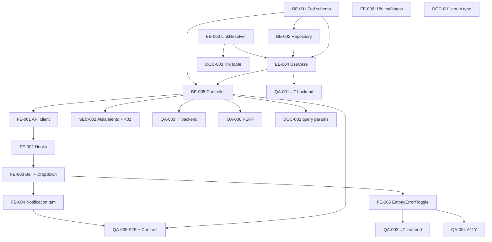

# Development Tasks — PB-P2-004 / US-071: Recibir aviso in-app de T-7 (vista organizer)

## 1. Metadata

| Field                                | Value                                                                                                |
| ------------------------------------ | ---------------------------------------------------------------------------------------------------- |
| User Story ID                        | US-071                                                                                                |
| Source User Story                    | `management/user-stories/US-071-inapp-notification-t-minus-7-recipe.md`                               |
| Source Technical Specification       | `management/technical-specs/P2/PB-P2-004/US-071-technical-spec.md`                                    |
| Decision Resolution Artifact         | `management/user-stories/decision-resolutions/US-071-decision-resolution.md`                          |
| Priority                             | P2                                                                                                    |
| Backlog ID                           | PB-P2-004                                                                                             |
| Backlog Title                        | Notificación T-7 (tareas) · `Job EmitT7NotificationsJob + surface in-app`                              |
| Backlog Execution Order              | 4 (cuarto ítem dentro de P2)                                                                          |
| User Story Position in Backlog Item  | 2 de 2 (US-034 = job upstream aprobada; US-071 = surface organizer)                                   |
| Related User Stories in Backlog Item | US-034 (job), US-071 (surface). US-072 mark-as-read en PB-P2-008.                                     |
| Epic                                 | EPIC-NOT-001                                                                                          |
| Backlog Item Dependencies            | PB-P1-018 (CRUD de tareas, entregada), US-034 (upstream aprobada), US-032 (deep link aprobada)        |
| Feature                              | Bandeja de notificaciones organizer con destacado T-7                                                 |
| Module / Domain                      | Notifications                                                                                         |
| Backlog Alignment Status             | Found                                                                                                 |
| Task Breakdown Status                | Ready for Sprint Planning                                                                             |
| Created Date                         | 2026-07-06                                                                                            |
| Last Updated                         | 2026-07-06                                                                                            |

---

## 2. Source Validation

| Source                       | Found | Used | Notes                                                                                          |
| ---------------------------- | ----- | ---- | ---------------------------------------------------------------------------------------------- |
| User Story                   | Yes   | Yes  | `Approved with Minor Notes`; AC-01..AC-09 + EC-01..EC-05 + VR-01..VR-05 + SEC-01..SEC-04.       |
| Technical Specification      | Yes   | Yes  | `Ready for Task Breakdown`. Define query params, resolver, DTO ampliado, componentes frontend. |
| Decision Resolution Artifact | Yes   | Yes  | 6 decisiones D1–D6 formalizadas.                                                                |
| Product Backlog Prioritized  | Yes   | Yes  | PB-P2-004; Related US: US-034 (posición 1), US-071 (posición 2).                                |
| ADRs                         | No    | No   | No hay ADR ad-hoc.                                                                              |

---

## 3. Backlog Execution Context

### Parent Backlog Item

**PB-P2-004 — Notificación T-7 (tareas)** (P2, Should Have). US-071 entrega el surface organizer que consume `GET /api/v1/notifications` (`docs/16 §34.2`) ampliado con query params opcionales, ordenamiento `unread first, sent_at DESC, id ASC` y generación server-side del `link` por `type`.

### Execution Order Rationale

US-071 se implementa después de US-034 (job upstream aprobada). Puede ejecutarse en paralelo con US-072 (mark-as-read) siempre que se declare la query key TanStack compartida que US-072 invalidará. Sin US-072 mergeada, el badge unread se actualiza sólo por `refetchInterval=60s`.

### Related User Stories in Same Backlog Item

| User Story | Role in Backlog Item                                                                            | Suggested Order |
| ---------- | ----------------------------------------------------------------------------------------------- | --------------- |
| US-034     | Job + persistencia (`Notification` in_app + email_simulated + log estructurado)                 | 1 (entregada)   |
| US-071     | Surface organizer (dropdown + lista + deep link); consume los `Notification` emitidos por US-034 | 2               |

---

## 4. Task Breakdown Summary

| Area                         | Number of Tasks | Notes                                                                                                                |
| ---------------------------- | --------------: | -------------------------------------------------------------------------------------------------------------------- |
| Product / Analysis           |               0 | Decisiones formalizadas.                                                                                              |
| Backend                      |               5 | Zod schema, repository, resolver, use case ampliado, controller.                                                      |
| Frontend                     |               6 | API client, hooks, componentes (bell/dropdown/item/empty/error/filter/badge), i18n.                                   |
| API Contract                 |               0 | Reuso del endpoint canónico; contrato ampliado documentado en backend + DOC tasks.                                   |
| Database / Prisma            |               0 | Sin migración.                                                                                                        |
| AI / PromptOps               |               0 | No aplica.                                                                                                            |
| Security / Authorization     |               1 | Regresión aislamiento + 401.                                                                                          |
| QA / Testing                 |               6 | UT backend, UT frontend, IT backend, A11Y, E2E, contract MSW, PERF.                                                   |
| Seed / Demo Data             |               0 | Reusa seed de US-034.                                                                                                 |
| DevOps / Environment         |               0 | No aplica (sin config nueva).                                                                                         |
| Observability / Audit        |               0 | Sin logs específicos (lectura no crítica).                                                                             |
| Documentation / Traceability |               3 | 3 ítems de Documentation Alignment (docs/16 §34.2, §34.3 enum, §34.3 link table).                                     |
| **Total**                    |          **21** |                                                                                                                       |

---

## 5. Traceability Matrix

| Acceptance Criterion                        | Technical Spec Section                                                                     | Task IDs                                                                                                                                                                                                                                                    |
| ------------------------------------------- | ------------------------------------------------------------------------------------------ | ---------------------------------------------------------------------------------------------------------------------------------------------------------------------------------------------------------------------------------------------------------- |
| AC-01 — Lista paginada con destacado T-7    | §7 Backend Design (use case, repository), §8 Frontend Design (hook, components)             | TASK-PB-P2-004-US-071-BE-002, TASK-PB-P2-004-US-071-BE-004, TASK-PB-P2-004-US-071-BE-005, TASK-PB-P2-004-US-071-FE-002, TASK-PB-P2-004-US-071-FE-003, TASK-PB-P2-004-US-071-QA-001, TASK-PB-P2-004-US-071-QA-003 |
| AC-02 — Click abre checklist filtrado 7d    | §7 Backend Design (NotificationLinkResolver), §8 Frontend Design (NotificationItem)         | TASK-PB-P2-004-US-071-BE-003, TASK-PB-P2-004-US-071-FE-004, TASK-PB-P2-004-US-071-QA-003, TASK-PB-P2-004-US-071-QA-005                                                                                                                                    |
| AC-03 — 401 sin sesión                      | §12 Security & Authorization                                                                | TASK-PB-P2-004-US-071-SEC-001, TASK-PB-P2-004-US-071-QA-003                                                                                                                                                                                                |
| AC-04 — Aislamiento BR-NOTIF-005            | §12 Security & Authorization                                                                | TASK-PB-P2-004-US-071-BE-004, TASK-PB-P2-004-US-071-SEC-001, TASK-PB-P2-004-US-071-QA-003                                                                                                                                                                    |
| AC-05 — Paginación estable                  | §7 Backend Design (ORDER BY id ASC), §8 Frontend Design (keepPreviousData)                  | TASK-PB-P2-004-US-071-BE-002, TASK-PB-P2-004-US-071-FE-002, TASK-PB-P2-004-US-071-QA-001, TASK-PB-P2-004-US-071-QA-003                                                                                                                                    |
| AC-06 — Empty/Loading/Error con ARIA        | §8 Frontend Design (empty/loading/error)                                                    | TASK-PB-P2-004-US-071-FE-004, TASK-PB-P2-004-US-071-FE-006, TASK-PB-P2-004-US-071-QA-004                                                                                                                                                                    |
| AC-07 — A11Y del dropdown                   | §8 Frontend Design (dropdown accesible)                                                     | TASK-PB-P2-004-US-071-FE-003, TASK-PB-P2-004-US-071-QA-004                                                                                                                                                                                                  |
| AC-08 — i18n en 4 locales                   | §8 Frontend Design (i18n), §15 Seed / Demo                                                  | TASK-PB-P2-004-US-071-FE-006, TASK-PB-P2-004-US-071-QA-002                                                                                                                                                                                                  |
| AC-09 — Performance P95 < 1.5 s              | §7 Backend Design (índices), §17 Risks                                                      | TASK-PB-P2-004-US-071-BE-002, TASK-PB-P2-004-US-071-QA-006                                                                                                                                                                                                  |
| EC-05 — Dedup channel=in_app                | §7 Backend Design (default channel), §6 Functional Interpretation                           | TASK-PB-P2-004-US-071-BE-001, TASK-PB-P2-004-US-071-BE-005, TASK-PB-P2-004-US-071-QA-003                                                                                                                                                                    |

Cobertura confirmada: cada AC y EC clave mapea a al menos una tarea de implementación o QA.

---

## 6. Development Tasks

### TASK-PB-P2-004-US-071-BE-001 — Zod schema de query params en `list-notifications.query.schema.ts`

| Field                     | Value                                                                     |
| ------------------------- | ------------------------------------------------------------------------- |
| Area                      | Backend                                                                   |
| Type                      | Implementation                                                            |
| Priority                  | Must                                                                      |
| Estimate                  | XS                                                                        |
| Depends On                | —                                                                         |
| Source AC(s)              | AC-01, EC-05                                                              |
| Technical Spec Section(s) | §7 Backend Design (DTOs / Schemas), §9 API Contract                        |
| Backlog ID                | PB-P2-004                                                                 |
| User Story ID             | US-071                                                                    |
| Owner Role                | Backend                                                                   |
| Status                    | To Do                                                                     |

#### Objective

Crear el Zod schema del query string del endpoint `GET /api/v1/notifications` con los defaults declarados en D2 y D5.

#### Scope

##### Include

* `page: coerce.number().int().min(1).default(1)`.
* `pageSize: coerce.number().int().min(1).max(50).default(10)`.
* `status: z.enum(['unread','all']).default('all')`.
* `channel: z.enum(['in_app','email_simulated','all']).default('in_app')`.
* Tipos TypeScript inferidos exportados.

##### Exclude

* Cambios en otros endpoints.

#### Implementation Notes

* Reusar helpers de Zod existentes en el proyecto (paginación estándar).
* Errores 400 `INVALID_QUERY_PARAM` / `INVALID_PAGINATION`.

#### Acceptance Criteria Covered

* AC-01, EC-05, VR-03..VR-05.

#### Definition of Done

- [ ] Schema exportado.
- [ ] UT del schema (params válidos, defaults, errores).
- [ ] Lint, type-check, tests pasan.

---

### TASK-PB-P2-004-US-071-BE-002 — Extender `NotificationRepository` con `findByUser` y `countUnreadByUser`

| Field                     | Value                                                                              |
| ------------------------- | ---------------------------------------------------------------------------------- |
| Area                      | Backend                                                                            |
| Type                      | Implementation                                                                     |
| Priority                  | Must                                                                               |
| Estimate                  | S                                                                                  |
| Depends On                | TASK-PB-P2-004-US-071-BE-001                                                        |
| Source AC(s)              | AC-01, AC-05, AC-09                                                                 |
| Technical Spec Section(s) | §7 Backend Design (Repository), §10 Database                                        |
| Backlog ID                | PB-P2-004                                                                          |
| User Story ID             | US-071                                                                             |
| Owner Role                | Backend                                                                            |
| Status                    | To Do                                                                              |

#### Objective

Agregar dos métodos al `NotificationRepository`:

* `findByUser({ userId, page, pageSize, status, channel })` con SQL `WHERE user_id + (channel filter) + (status filter)` y `ORDER BY (status='unread') DESC, sent_at DESC, id ASC` con LIMIT/OFFSET.
* `countUnreadByUser({ userId, channel })` reutilizando `idx_notifications_user_unread`.

#### Scope

##### Include

* Los dos métodos.
* Uso de `prisma.$queryRaw<>` si es necesario para el `ORDER BY (status='unread') DESC`.
* Reuso de índices existentes.

##### Exclude

* Migración de índice nueva.

#### Implementation Notes

* Filtro `channel=all` no aplica cláusula.
* Filtro `status=all` no aplica cláusula.

#### Acceptance Criteria Covered

* AC-01 (orden + filtro), AC-05 (estabilidad `id ASC`), AC-09 (índices existentes soportan la query).

#### Definition of Done

- [ ] Métodos implementados.
- [ ] UT del repositorio con DB ephemeral.
- [ ] Lint, type-check, tests pasan.

---

### TASK-PB-P2-004-US-071-BE-003 — Implementar `NotificationLinkResolver` con estrategia `task_due_soon`

| Field                     | Value                                                                            |
| ------------------------- | -------------------------------------------------------------------------------- |
| Area                      | Backend                                                                          |
| Type                      | Implementation                                                                   |
| Priority                  | Must                                                                             |
| Estimate                  | S                                                                                |
| Depends On                | —                                                                                |
| Source AC(s)              | AC-02, EC-02, EC-03                                                              |
| Technical Spec Section(s) | §7 Backend Design (NotificationLinkResolver), §17 Risks                          |
| Backlog ID                | PB-P2-004                                                                        |
| User Story ID             | US-071                                                                           |
| Owner Role                | Backend                                                                          |
| Status                    | To Do                                                                            |

#### Objective

Crear un servicio de aplicación `NotificationLinkResolver` que genere el campo `link` de `NotificationResponseDto` según `type` y `payload`. Sólo `task_due_soon` es obligatorio en US-071; los demás tipos quedan con placeholder documentado.

#### Scope

##### Include

* Servicio con `resolve(notification, contextResources): string | null`.
* Tabla `LINK_STRATEGY_BY_TYPE` centralizada.
* Estrategia `task_due_soon`: si `payload.eventId` es UUID válido y el evento existe → `/organizer/events/{eventId}/tasks?range=7d`; sino `null`.
* Batch lookup vía `EventRepository.findByIds(ids)` para evitar N+1.
* Extender `EventRepository.findByIds` si no existe.

##### Exclude

* Estrategias para otros tipos (se implementan en sus US).
* Cambios al DTO.

#### Implementation Notes

* Nunca lanzar; siempre retorna `string | null`.
* Loguear (nivel `debug`) casos de `null` para diagnóstico.

#### Acceptance Criteria Covered

* AC-02, EC-02 (banner de US-032 se encarga en el cliente), EC-03 (`link=null`).

#### Definition of Done

- [ ] Servicio implementado.
- [ ] UT con `payload.eventId` válido → link correcto.
- [ ] UT con `payload.eventId` inexistente → `null`.
- [ ] Lint, type-check, tests pasan.

---

### TASK-PB-P2-004-US-071-BE-004 — Extender `ListMyNotificationsUseCase`

| Field                     | Value                                                                                                                                                    |
| ------------------------- | -------------------------------------------------------------------------------------------------------------------------------------------------------- |
| Area                      | Backend                                                                                                                                                  |
| Type                      | Implementation                                                                                                                                           |
| Priority                  | Must                                                                                                                                                     |
| Estimate                  | M                                                                                                                                                        |
| Depends On                | TASK-PB-P2-004-US-071-BE-001, TASK-PB-P2-004-US-071-BE-002, TASK-PB-P2-004-US-071-BE-003                                                                 |
| Source AC(s)              | AC-01, AC-02, AC-04, AC-05                                                                                                                               |
| Technical Spec Section(s) | §7 Backend Design (Use Cases), §12 Security                                                                                                              |
| Backlog ID                | PB-P2-004                                                                                                                                                |
| User Story ID             | US-071                                                                                                                                                   |
| Owner Role                | Backend                                                                                                                                                  |
| Status                    | To Do                                                                                                                                                    |

#### Objective

Extender `ListMyNotificationsUseCase` para recibir los query params opcionales (con defaults), invocar `NotificationRepository.findByUser`, aplicar `NotificationLinkResolver` a cada item y computar `unreadCount` vía `countUnreadByUser`. Retornar `PaginatedNotificationsResponse`.

#### Scope

##### Include

* Extender la firma del use case.
* Aplicar `WHERE user_id = session.userId` (aislamiento BR-NOTIF-005).
* Mapear cada `Notification` a `NotificationResponseDto` con `link` server-side.
* Reportar `unreadCount` en la respuesta.

##### Exclude

* Mutations (US-072).

#### Acceptance Criteria Covered

* AC-01, AC-02, AC-04, AC-05.

#### Definition of Done

- [ ] Use case extendido.
- [ ] UT-01..UT-07 verdes (cubierto en QA-001).
- [ ] Lint, type-check, tests pasan.

---

### TASK-PB-P2-004-US-071-BE-005 — Actualizar `NotificationsController.list` con Zod validation y DTO ampliado

| Field                     | Value                                                                          |
| ------------------------- | ------------------------------------------------------------------------------ |
| Area                      | Backend                                                                        |
| Type                      | Implementation                                                                 |
| Priority                  | Must                                                                           |
| Estimate                  | XS                                                                             |
| Depends On                | TASK-PB-P2-004-US-071-BE-001, TASK-PB-P2-004-US-071-BE-004                     |
| Source AC(s)              | AC-01, AC-03, AC-04                                                            |
| Technical Spec Section(s) | §7 Backend Design (Controllers), §9 API Contract                               |
| Backlog ID                | PB-P2-004                                                                      |
| User Story ID             | US-071                                                                         |
| Owner Role                | Backend                                                                        |
| Status                    | To Do                                                                          |

#### Objective

Actualizar `NotificationsController.list` para aplicar el Zod schema de query params, invocar el use case ampliado y responder `PaginatedNotificationsResponse` (incluye `unreadCount`).

#### Scope

##### Include

* Wiring del controller.
* Mapeo de errores Zod → 400.
* Reuso del middleware de sesión (401 si no auth).

##### Exclude

* Nuevos endpoints.
* Cambios al `NotificationResponseDto` fuera de lo declarado en el Technical Spec.

#### Acceptance Criteria Covered

* AC-01, AC-03, AC-04.

#### Definition of Done

- [ ] Controller actualizado.
- [ ] IT verdes (QA-003).
- [ ] Lint, type-check, tests pasan.

---

### TASK-PB-P2-004-US-071-FE-001 — Cliente API `notificationsApi.list` + tipos DTO

| Field                     | Value                                                                                |
| ------------------------- | ------------------------------------------------------------------------------------ |
| Area                      | Frontend                                                                             |
| Type                      | Implementation                                                                       |
| Priority                  | Must                                                                                 |
| Estimate                  | XS                                                                                   |
| Depends On                | TASK-PB-P2-004-US-071-BE-005                                                          |
| Source AC(s)              | AC-01, AC-02                                                                          |
| Technical Spec Section(s) | §8 Frontend Design (Data Fetching), §9 API Contract                                  |
| Backlog ID                | PB-P2-004                                                                            |
| User Story ID             | US-071                                                                               |
| Owner Role                | Frontend                                                                             |
| Status                    | To Do                                                                                |

#### Objective

Crear `apps/web/lib/api/notifications.ts` con la función `notificationsApi.list({ page, pageSize, status, channel })` y los tipos derivados del `PaginatedNotificationsResponse` y `NotificationResponseDto`.

#### Scope

##### Include

* Función client con `fetch`/`ky` (según patrón proyecto).
* Zod schema del response validado en dev.
* Manejo de errores 4xx/5xx.

##### Exclude

* Mutations.

#### Acceptance Criteria Covered

* AC-01, AC-02.

#### Definition of Done

- [ ] Cliente implementado y tipado.
- [ ] UT de mapeo response.
- [ ] Lint, type-check pasan.

---

### TASK-PB-P2-004-US-071-FE-002 — Hooks `useNotifications` y `useUnreadNotificationsCount`

| Field                     | Value                                                                                       |
| ------------------------- | ------------------------------------------------------------------------------------------- |
| Area                      | Frontend                                                                                    |
| Type                      | Implementation                                                                              |
| Priority                  | Must                                                                                        |
| Estimate                  | S                                                                                           |
| Depends On                | TASK-PB-P2-004-US-071-FE-001                                                                 |
| Source AC(s)              | AC-01, AC-05                                                                                 |
| Technical Spec Section(s) | §8 Frontend Design (State Management)                                                        |
| Backlog ID                | PB-P2-004                                                                                   |
| User Story ID             | US-071                                                                                       |
| Owner Role                | Frontend                                                                                    |
| Status                    | To Do                                                                                       |

#### Objective

Implementar los hooks TanStack con las query keys declaradas en el Technical Spec y la política `refetchOnWindowFocus=true`, `refetchInterval=60000`, `keepPreviousData=true`.

#### Scope

##### Include

* `useNotifications({ status, page, pageSize })` con key `['notifications', 'me', { channel: 'in_app', status, page, pageSize }]`.
* `useUnreadNotificationsCount()` con key `['notifications', 'me', 'unreadCount']` derivado del response.

##### Exclude

* Mutations (US-072).

#### Acceptance Criteria Covered

* AC-01, AC-05.

#### Definition of Done

- [ ] Hooks implementados.
- [ ] UT con react-query testing.
- [ ] Lint, type-check pasan.

---

### TASK-PB-P2-004-US-071-FE-003 — Componentes `NotificationsBell` + `NotificationsDropdown` accesibles

| Field                     | Value                                                                                       |
| ------------------------- | ------------------------------------------------------------------------------------------- |
| Area                      | Frontend                                                                                    |
| Type                      | Implementation                                                                              |
| Priority                  | Must                                                                                        |
| Estimate                  | M                                                                                           |
| Depends On                | TASK-PB-P2-004-US-071-FE-002                                                                 |
| Source AC(s)              | AC-01, AC-07                                                                                 |
| Technical Spec Section(s) | §8 Frontend Design (Components, Accessibility)                                                |
| Backlog ID                | PB-P2-004                                                                                   |
| User Story ID             | US-071                                                                                       |
| Owner Role                | Frontend                                                                                    |
| Status                    | To Do                                                                                       |

#### Objective

Crear los componentes `NotificationsBell`, `NotificationsDropdown`, `NotificationsList`, `UnreadBadge` cumpliendo `role="menu"`/`role="listbox"`, navegación por teclado, foco visible y badge unread con formato `9+`.

#### Scope

##### Include

* Componentes con Tailwind + design tokens.
* Estado abierto/cerrado gestionado con hook accesible.
* Integración con `useNotifications` y `useUnreadNotificationsCount`.

##### Exclude

* Mark-as-read (US-072).

#### Acceptance Criteria Covered

* AC-01 (badge + lista), AC-07 (A11Y).

#### Definition of Done

- [ ] Componentes implementados.
- [ ] Storybook opcional o snapshots visuales.
- [ ] Lint, type-check, UT frontend pasan.

---

### TASK-PB-P2-004-US-071-FE-004 — `NotificationItem` con deep link + estados accesibles

| Field                     | Value                                                                                 |
| ------------------------- | ------------------------------------------------------------------------------------- |
| Area                      | Frontend                                                                              |
| Type                      | Implementation                                                                        |
| Priority                  | Must                                                                                  |
| Estimate                  | S                                                                                     |
| Depends On                | TASK-PB-P2-004-US-071-FE-003                                                           |
| Source AC(s)              | AC-01, AC-02, AC-06, EC-03                                                             |
| Technical Spec Section(s) | §8 Frontend Design (Components, Loading/Empty/Error)                                  |
| Backlog ID                | PB-P2-004                                                                             |
| User Story ID             | US-071                                                                                |
| Owner Role                | Frontend                                                                              |
| Status                    | To Do                                                                                 |

#### Objective

Implementar `NotificationItem` con destacado visual para `type='task_due_soon'`, hora relativa localizada (`Intl.RelativeTimeFormat`), click que invoca `useRouter().push(link)` sólo si `link != null`, y estado deshabilitado accesible si `link=null`.

#### Scope

##### Include

* Layout del item.
* Manejo `aria-disabled="true"` en items sin link.
* Manejo de eventos click/keyboard.

##### Exclude

* Mark-as-read (US-072).

#### Acceptance Criteria Covered

* AC-01, AC-02, AC-06, EC-03.

#### Definition of Done

- [ ] Componente implementado.
- [ ] UT frontend cubre `link=null` (UT-09).
- [ ] Lint, type-check pasan.

---

### TASK-PB-P2-004-US-071-FE-005 — `NotificationsEmptyState`, `NotificationsErrorBanner`, `NotificationsFilterToggle`

| Field                     | Value                                                                             |
| ------------------------- | --------------------------------------------------------------------------------- |
| Area                      | Frontend                                                                          |
| Type                      | Implementation                                                                    |
| Priority                  | Must                                                                              |
| Estimate                  | S                                                                                 |
| Depends On                | TASK-PB-P2-004-US-071-FE-003                                                       |
| Source AC(s)              | AC-06, D2 (toggle unread)                                                          |
| Technical Spec Section(s) | §8 Frontend Design (Loading/Empty/Error, Components)                              |
| Backlog ID                | PB-P2-004                                                                         |
| User Story ID             | US-071                                                                            |
| Owner Role                | Frontend                                                                          |
| Status                    | To Do                                                                             |

#### Objective

Implementar los tres componentes auxiliares:

* Empty state con `aria-live="polite"`.
* Error banner con `role="alert"` y botón "Reintentar".
* Toggle "Sólo no leídas" que alterna el query `status`.

#### Acceptance Criteria Covered

* AC-06, AC-01 (toggle unread).

#### Definition of Done

- [ ] Componentes implementados.
- [ ] Lint, type-check, UT pasan.

---

### TASK-PB-P2-004-US-071-FE-006 — i18n catálogos para 4 locales

| Field                     | Value                                                                            |
| ------------------------- | -------------------------------------------------------------------------------- |
| Area                      | Frontend                                                                         |
| Type                      | Implementation                                                                   |
| Priority                  | Must                                                                             |
| Estimate                  | XS                                                                               |
| Depends On                | —                                                                                |
| Source AC(s)              | AC-06, AC-08                                                                     |
| Technical Spec Section(s) | §8 Frontend Design (i18n)                                                        |
| Backlog ID                | PB-P2-004                                                                        |
| User Story ID             | US-071                                                                           |
| Owner Role                | Frontend                                                                         |
| Status                    | To Do                                                                            |

#### Objective

Crear los catálogos `next-intl` para `en`, `es-LATAM`, `es-ES`, `pt` con las keys mínimas: `notifications.title`, `notifications.empty`, `notifications.error`, `notifications.loadMore`, `notifications.unreadOnly`, `notifications.showAll`, `notifications.bellAria`, `notifications.itemAria`.

#### Acceptance Criteria Covered

* AC-06 (copy), AC-08 (4 locales).

#### Definition of Done

- [ ] Catálogos completos.
- [ ] CI check falla si faltan keys.

---

### TASK-PB-P2-004-US-071-SEC-001 — Test de regresión aislamiento + 401

| Field                     | Value                                                                                 |
| ------------------------- | ------------------------------------------------------------------------------------- |
| Area                      | Security / Authorization                                                              |
| Type                      | Test                                                                                  |
| Priority                  | Must                                                                                  |
| Estimate                  | S                                                                                     |
| Depends On                | TASK-PB-P2-004-US-071-BE-005                                                          |
| Source AC(s)              | AC-03, AC-04                                                                          |
| Technical Spec Section(s) | §12 Security, §13 Testing (Security Tests)                                            |
| Backlog ID                | PB-P2-004                                                                             |
| User Story ID             | US-071                                                                                |
| Owner Role                | QA                                                                                    |
| Status                    | To Do                                                                                 |

#### Objective

Implementar SEC-T-01 (admin sólo ve sus notifs) y SEC-T-02 (sin sesión → 401), etiquetados como `@security` para gating CI.

#### Acceptance Criteria Covered

* AC-03, AC-04.

#### Definition of Done

- [ ] Tests verdes.
- [ ] Etiqueta `@security` aplicada.

---

### TASK-PB-P2-004-US-071-QA-001 — Unit tests backend (UT-01..UT-07)

| Field                     | Value                                                                                       |
| ------------------------- | ------------------------------------------------------------------------------------------- |
| Area                      | QA / Testing                                                                                |
| Type                      | Test                                                                                        |
| Priority                  | Must                                                                                        |
| Estimate                  | S                                                                                           |
| Depends On                | TASK-PB-P2-004-US-071-BE-004                                                                 |
| Source AC(s)              | AC-01, AC-04, AC-05, EC-05                                                                   |
| Technical Spec Section(s) | §13 Testing Strategy (Unit Tests)                                                            |
| Backlog ID                | PB-P2-004                                                                                   |
| User Story ID             | US-071                                                                                       |
| Owner Role                | QA                                                                                          |
| Status                    | To Do                                                                                       |

#### Objective

Implementar 7 unit tests del use case + repositorio + resolver con Vitest.

#### Acceptance Criteria Covered

* AC-01, AC-04, AC-05, EC-05.

#### Definition of Done

- [ ] 7 UTs verdes.

---

### TASK-PB-P2-004-US-071-QA-002 — Unit tests frontend (UT-08..UT-10)

| Field                     | Value                                                                                |
| ------------------------- | ------------------------------------------------------------------------------------ |
| Area                      | QA / Testing                                                                         |
| Type                      | Test                                                                                 |
| Priority                  | Must                                                                                 |
| Estimate                  | XS                                                                                   |
| Depends On                | TASK-PB-P2-004-US-071-FE-005                                                          |
| Source AC(s)              | AC-01 (badge `9+`), EC-03 (link=null), AC-08 (i18n)                                  |
| Technical Spec Section(s) | §13 Testing Strategy (Unit Tests)                                                     |
| Backlog ID                | PB-P2-004                                                                            |
| User Story ID             | US-071                                                                               |
| Owner Role                | QA                                                                                   |
| Status                    | To Do                                                                                |

#### Objective

Implementar 3 unit tests frontend con Vitest + Testing Library.

#### Acceptance Criteria Covered

* AC-01, AC-08, EC-03.

#### Definition of Done

- [ ] 3 UTs verdes.

---

### TASK-PB-P2-004-US-071-QA-003 — Integration tests backend (IT-01..IT-07)

| Field                     | Value                                                                                       |
| ------------------------- | ------------------------------------------------------------------------------------------- |
| Area                      | QA / Testing                                                                                |
| Type                      | Test                                                                                        |
| Priority                  | Must                                                                                        |
| Estimate                  | M                                                                                           |
| Depends On                | TASK-PB-P2-004-US-071-BE-005                                                                 |
| Source AC(s)              | AC-01..AC-05, EC-03, EC-05                                                                   |
| Technical Spec Section(s) | §13 Testing Strategy (Integration Tests)                                                    |
| Backlog ID                | PB-P2-004                                                                                   |
| User Story ID             | US-071                                                                                       |
| Owner Role                | QA                                                                                          |
| Status                    | To Do                                                                                       |

#### Objective

Implementar 7 integration tests contra DB ephemeral con Supertest: ordenamiento, paginación estable, aislamiento, dedup channel, deep link válido/null, Zod inválido.

#### Acceptance Criteria Covered

* AC-01..AC-05, EC-03, EC-05.

#### Definition of Done

- [ ] 7 ITs verdes.

---

### TASK-PB-P2-004-US-071-QA-004 — A11Y tests con Axe (A11Y-01..A11Y-03)

| Field                     | Value                                                                                  |
| ------------------------- | -------------------------------------------------------------------------------------- |
| Area                      | QA / Testing                                                                           |
| Type                      | Test                                                                                   |
| Priority                  | Must                                                                                   |
| Estimate                  | S                                                                                      |
| Depends On                | TASK-PB-P2-004-US-071-FE-005                                                            |
| Source AC(s)              | AC-06, AC-07                                                                            |
| Technical Spec Section(s) | §13 Testing Strategy (Accessibility Tests)                                              |
| Backlog ID                | PB-P2-004                                                                              |
| User Story ID             | US-071                                                                                 |
| Owner Role                | QA                                                                                     |
| Status                    | To Do                                                                                  |

#### Objective

Implementar tests A11Y con Playwright + `@axe-core/playwright`: dropdown abierto sin violaciones críticas, navegación completa por teclado, roles ARIA correctos.

#### Acceptance Criteria Covered

* AC-06, AC-07, NFR-A11Y-001..003.

#### Definition of Done

- [ ] 3 tests A11Y verdes en CI.

---

### TASK-PB-P2-004-US-071-QA-005 — E2E Playwright (E2E-01, E2E-02) + Contract MSW

| Field                     | Value                                                                              |
| ------------------------- | ---------------------------------------------------------------------------------- |
| Area                      | QA / Testing                                                                       |
| Type                      | Test                                                                               |
| Priority                  | Must                                                                               |
| Estimate                  | M                                                                                  |
| Depends On                | TASK-PB-P2-004-US-071-FE-004, TASK-PB-P2-004-US-071-BE-005                          |
| Source AC(s)              | AC-01, AC-02, EC-02                                                                 |
| Technical Spec Section(s) | §13 Testing Strategy (E2E, Contract)                                               |
| Backlog ID                | PB-P2-004                                                                          |
| User Story ID             | US-071                                                                             |
| Owner Role                | QA                                                                                 |
| Status                    | To Do                                                                              |

#### Objective

Implementar E2E-01 (abrir campanita → click T-7 → aterrizar en checklist con `?range=7d`) y E2E-02 (evento en `completed` → navegación con banner), más un contract test con MSW alineado con US-121.

#### Acceptance Criteria Covered

* AC-01, AC-02, EC-02.

#### Definition of Done

- [ ] E2E-01, E2E-02 verdes.
- [ ] Contract test MSW verde.

---

### TASK-PB-P2-004-US-071-QA-006 — Test PERF (AC-09)

| Field                     | Value                                                                        |
| ------------------------- | ---------------------------------------------------------------------------- |
| Area                      | QA / Testing                                                                 |
| Type                      | Test                                                                         |
| Priority                  | Should                                                                       |
| Estimate                  | S                                                                            |
| Depends On                | TASK-PB-P2-004-US-071-BE-005                                                 |
| Source AC(s)              | AC-09                                                                        |
| Technical Spec Section(s) | §13 Testing Strategy (Performance), §17 Risks                                 |
| Backlog ID                | PB-P2-004                                                                    |
| User Story ID             | US-071                                                                       |
| Owner Role                | QA                                                                           |
| Status                    | To Do                                                                        |

#### Objective

Test PERF sintético con 100 notifs seed que verifica P95 < 1.5 s (NFR-PERF-001).

#### Acceptance Criteria Covered

* AC-09.

#### Definition of Done

- [ ] Test PERF verde con métrica registrada.

---

### TASK-PB-P2-004-US-071-DOC-001 — Actualizar enum `type` en `docs/16 §34.3`

| Field                     | Value                                                                       |
| ------------------------- | --------------------------------------------------------------------------- |
| Area                      | Documentation / Traceability                                                |
| Type                      | Documentation                                                               |
| Priority                  | Should                                                                      |
| Estimate                  | XS                                                                          |
| Depends On                | —                                                                           |
| Source AC(s)              | —                                                                           |
| Technical Spec Section(s) | §16 Documentation Alignment Required                                        |
| Backlog ID                | PB-P2-004                                                                   |
| User Story ID             | US-071                                                                      |
| Owner Role                | Tech Lead / Documentation                                                   |
| Status                    | To Do                                                                       |

#### Objective

Reemplazar `task_due` por `task_due_soon` en el enum `type` de `NotificationResponseDto` (`docs/16 §34.3`).

#### Definition of Done

- [ ] PR mergeado.

---

### TASK-PB-P2-004-US-071-DOC-002 — Ampliar tabla `Endpoints` de `docs/16 §34.2` con query params

| Field                     | Value                                                                       |
| ------------------------- | --------------------------------------------------------------------------- |
| Area                      | Documentation / Traceability                                                |
| Type                      | Documentation                                                               |
| Priority                  | Should                                                                      |
| Estimate                  | XS                                                                          |
| Depends On                | TASK-PB-P2-004-US-071-BE-005                                                |
| Source AC(s)              | —                                                                           |
| Technical Spec Section(s) | §16 Documentation Alignment Required                                        |
| Backlog ID                | PB-P2-004                                                                   |
| User Story ID             | US-071                                                                      |
| Owner Role                | Tech Lead / Documentation                                                   |
| Status                    | To Do                                                                       |

#### Objective

Documentar `page`, `pageSize`, `status`, `channel` como query params opcionales del `GET /api/v1/notifications` en `docs/16 §34.2` con sus defaults.

#### Definition of Done

- [ ] PR mergeado.

---

### TASK-PB-P2-004-US-071-DOC-003 — Agregar tabla `link generation by type` a `docs/16 §34.3`

| Field                     | Value                                                                            |
| ------------------------- | -------------------------------------------------------------------------------- |
| Area                      | Documentation / Traceability                                                     |
| Type                      | Documentation                                                                    |
| Priority                  | Should                                                                           |
| Estimate                  | XS                                                                               |
| Depends On                | TASK-PB-P2-004-US-071-BE-003                                                     |
| Source AC(s)              | AC-02                                                                            |
| Technical Spec Section(s) | §16 Documentation Alignment Required                                             |
| Backlog ID                | PB-P2-004                                                                        |
| User Story ID             | US-071                                                                           |
| Owner Role                | Tech Lead / Documentation                                                        |
| Status                    | To Do                                                                            |

#### Objective

Agregar la tabla `link generation by type` a `docs/16 §34.3`, empezando por `task_due_soon` con el patrón formalizado en D3. Handoff a las US responsables de otros tipos para completar.

#### Definition of Done

- [ ] Tabla agregada en `docs/16 §34.3`.
- [ ] PR mergeado.

---

## 7. Required QA Tasks

| Task ID                             | Test Type                       | Purpose                                                                          |
| ----------------------------------- | ------------------------------- | -------------------------------------------------------------------------------- |
| TASK-PB-P2-004-US-071-QA-001        | Unit backend                    | UT-01..UT-07 (use case, repositorio, resolver).                                   |
| TASK-PB-P2-004-US-071-QA-002        | Unit frontend                   | UT-08..UT-10 (badge `9+`, `link=null`, toggle).                                  |
| TASK-PB-P2-004-US-071-QA-003        | Integration backend             | IT-01..IT-07 (orden, paginación, aislamiento, dedup, link, Zod).                 |
| TASK-PB-P2-004-US-071-QA-004        | Accessibility (A11Y-01..A11Y-03) | Axe sin violaciones críticas; teclado; roles.                                    |
| TASK-PB-P2-004-US-071-QA-005        | E2E + Contract (MSW)            | E2E-01, E2E-02, contract test alineado con US-121.                               |
| TASK-PB-P2-004-US-071-QA-006        | Performance                     | P95 < 1.5 s con 100 notifs seed (NFR-PERF-001).                                  |

---

## 8. Required Security Tasks

| Task ID                             | Security Concern                                       | Purpose                                                    |
| ----------------------------------- | ------------------------------------------------------ | ---------------------------------------------------------- |
| TASK-PB-P2-004-US-071-SEC-001       | Aislamiento (BR-NOTIF-005) + Auth (401)                | Regresión de seguridad con etiqueta `@security` en CI.     |

---

## 9. Required Seed / Demo Tasks

| Task ID | Seed/Demo Concern | Purpose |
| ------- | ----------------- | ------- |
| —       | —                 | Reusa seed de US-034 (SEED-001). No aplica tarea propia. |

---

## 10. Observability / Audit Tasks

`No aplica` — endpoint de lectura no crítico; middleware estándar cubre `correlationId`.

---

## 11. Documentation / Traceability Tasks

| Task ID                             | Document / Artifact                        | Purpose                                                                 |
| ----------------------------------- | ------------------------------------------ | ----------------------------------------------------------------------- |
| TASK-PB-P2-004-US-071-DOC-001       | `docs/16 §34.3` (enum `type`)              | Corregir `task_due` → `task_due_soon`.                                 |
| TASK-PB-P2-004-US-071-DOC-002       | `docs/16 §34.2` (query params)             | Documentar `page`, `pageSize`, `status`, `channel` con defaults.        |
| TASK-PB-P2-004-US-071-DOC-003       | `docs/16 §34.3` (tabla `link generation`)  | Agregar patrón por tipo, empezando por `task_due_soon`.                 |

---

## 12. Dependency Graph

---

## 13. Suggested Implementation Order

### Phase 1 — Foundation

1. TASK-PB-P2-004-US-071-BE-001 — Zod schema.
2. TASK-PB-P2-004-US-071-BE-003 — `NotificationLinkResolver`.
3. TASK-PB-P2-004-US-071-BE-002 — Repository extendido.
4. TASK-PB-P2-004-US-071-FE-006 — i18n catálogos (paralelizable).

### Phase 2 — Core Implementation

5. TASK-PB-P2-004-US-071-BE-004 — Use case ampliado.
6. TASK-PB-P2-004-US-071-BE-005 — Controller.
7. TASK-PB-P2-004-US-071-FE-001 — API client.
8. TASK-PB-P2-004-US-071-FE-002 — Hooks TanStack.
9. TASK-PB-P2-004-US-071-FE-003 — Bell + Dropdown.
10. TASK-PB-P2-004-US-071-FE-004 — NotificationItem.
11. TASK-PB-P2-004-US-071-FE-005 — Empty/Error/Toggle.

### Phase 3 — Validation / Security / QA

12. TASK-PB-P2-004-US-071-QA-001 — UT backend.
13. TASK-PB-P2-004-US-071-QA-002 — UT frontend.
14. TASK-PB-P2-004-US-071-QA-003 — IT backend.
15. TASK-PB-P2-004-US-071-SEC-001 — Regresión aislamiento + 401.
16. TASK-PB-P2-004-US-071-QA-004 — A11Y con Axe.
17. TASK-PB-P2-004-US-071-QA-005 — E2E + Contract.
18. TASK-PB-P2-004-US-071-QA-006 — PERF.

### Phase 4 — Documentation / Review

19. TASK-PB-P2-004-US-071-DOC-001 — enum `type`.
20. TASK-PB-P2-004-US-071-DOC-002 — query params.
21. TASK-PB-P2-004-US-071-DOC-003 — link generation table.

---

## 14. Risks & Mitigations

| Risk                                                              | Impact                                             | Mitigation                                                                                                             | Related Task                                  |
| ----------------------------------------------------------------- | -------------------------------------------------- | ---------------------------------------------------------------------------------------------------------------------- | --------------------------------------------- |
| N+1 en `NotificationLinkResolver` validando `eventId`             | Latencia perceptible                               | Batch `EventRepository.findByIds(ids)` limitado por `pageSize=10`.                                                     | BE-003, QA-006                                |
| Filtro `channel=in_app` sin índice físico                         | Query lenta con dataset grande                     | Reuso de `idx_notifications_user_status_sent`; PERF test como gate.                                                    | BE-002, QA-006                                |
| Badge desactualizado hasta próximo `refetchInterval`              | UX espera 60 s                                      | `refetchOnWindowFocus=true` + invalidación de US-072 cuando merge.                                                     | FE-002                                        |
| A11Y falla en dropdown por interacción no cubierta                | CI rojo                                             | Basar el dropdown en un patrón validado (Radix Menu); QA-004 con Axe.                                                  | FE-003, QA-004                                |
| Missing i18n keys en un locale                                    | Copy fallback (en) en el resto                     | CI check de `next-intl` que falla si faltan keys.                                                                     | FE-006                                        |
| Cambio del enum `type` en `docs/16` no coordinado con otros consumidores | Cliente externo con enum obsoleto                  | La corrección es aditiva; se comunica en release notes; Documentation Alignment gestionado por DOC-001.               | DOC-001                                       |

---

## 15. Out of Scope Confirmation

* Mark-as-read (US-072).
* Endpoint de detalle `GET /api/v1/notifications/:id`.
* Push, SMS, WhatsApp (BR-NOTIF-006).
* Realtime WebSocket / SSE.
* Notificaciones broadcast cross-rol.
* Filtro por `type` desde UI.
* Cambios de schema Prisma / migración.
* Emisión de nuevas notificaciones (US-034).
* Bandeja admin cross-usuario.
* Sentry/APM/Prometheus (NFR-OBS-006).

---

## 16. Readiness for Sprint Planning

| Check                                      | Status |
| ------------------------------------------ | ------ |
| Product Backlog mapping found              | Pass   |
| Every AC maps to tasks                     | Pass   |
| Technical Spec used when available         | Pass   |
| QA tasks included                          | Pass   |
| Security tasks included if applicable      | Pass   |
| Seed/demo tasks included if applicable     | N/A    |
| Observability tasks included if applicable | N/A    |
| Documentation tasks included if applicable | Pass   |
| Task dependencies clear                    | Pass   |
| Tasks small enough                         | Pass   |
| Ready for Sprint Planning                  | Yes    |

---

## 17. Final Recommendation

`Ready for Sprint Planning`

Las 21 tareas cubren AC-01..AC-09 y EC-01..EC-05, respetan las 6 decisiones D1–D6 sin reabrirlas, y respetan el recorte de alcance (surface sin mutations; mark-as-read en US-072). El set incluye Backend (5), Frontend (6), QA multi-capa (6), Security (1) y Documentation Alignment (3) sin migraciones ni cambios de infraestructura.

---

Development Tasks created: Yes
Path: `management/development-tasks/P2/PB-P2-004/US-071-development-tasks.md`
Status: Ready for Sprint Planning
Technical Specification used: Yes
Backlog ID: PB-P2-004
Execution Order: 4 (cuarto ítem de P2, US-071 = posición 2 de 2 dentro del backlog item)
Next step: Sprint Planning / Roadmap.

Task groups: 5 Backend (schema + repo + resolver + use case + controller), 6 Frontend (client + hooks + componentes + i18n), 6 QA (UT backend + UT frontend + IT + A11Y + E2E/contract + PERF), 1 Security (regresión), 3 Documentation Alignment (enum, query params, link table).
Product Backlog mapping: Found (PB-P2-004, P2, US-071 = posición 2 de 2).
Decision Resolution artifact used: Yes.
Warnings: 5 Documentation Alignment Required (3 con tarea propia + 2 ya cerrados en la refinación).
