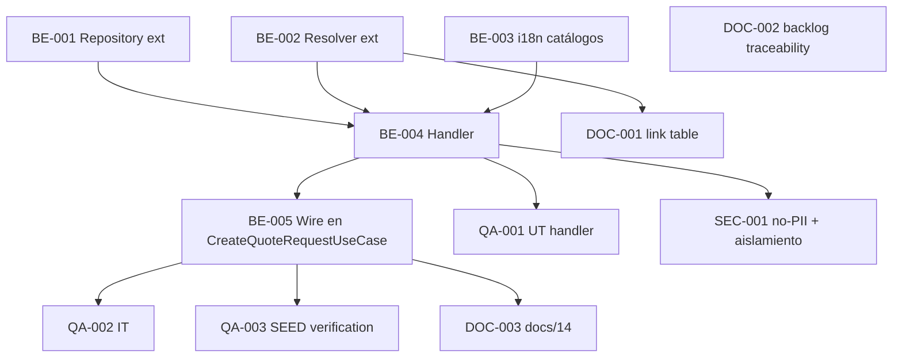

# Development Tasks — PB-P2-005 / US-068: Recibir aviso in-app de nueva QuoteRequest

## 1. Metadata

| Field                                | Value                                                                                                |
| ------------------------------------ | ---------------------------------------------------------------------------------------------------- |
| User Story ID                        | US-068                                                                                                |
| Source User Story                    | `management/user-stories/US-068-inapp-notification-new-quote-request.md`                              |
| Source Technical Specification       | `management/technical-specs/P2/PB-P2-005/US-068-technical-spec.md`                                    |
| Decision Resolution Artifact         | `management/user-stories/decision-resolutions/US-068-decision-resolution.md`                          |
| Priority                             | P2                                                                                                    |
| Backlog ID                           | PB-P2-005                                                                                             |
| Backlog Title                        | Notificación de QuoteRequest creada                                                                    |
| Backlog Execution Order              | 5 (quinto ítem de P2)                                                                                 |
| User Story Position in Backlog Item  | 1 de 1                                                                                                |
| Related User Stories in Backlog Item | US-068                                                                                                |
| Epic                                 | EPIC-NOT-001                                                                                          |
| Backlog Item Dependencies            | PB-P1-030 (US-049 `CreateQuoteRequestUseCase`, entregada)                                             |
| Feature                              | Emitir notificación in-app y email simulado al vendor al crear QuoteRequest                            |
| Module / Domain                      | Notifications                                                                                         |
| Backlog Alignment Status             | Found                                                                                                 |
| Task Breakdown Status                | Ready for Sprint Planning                                                                             |
| Created Date                         | 2026-07-06                                                                                            |
| Last Updated                         | 2026-07-06                                                                                            |

---

## 2. Source Validation

| Source                       | Found | Used | Notes                                             |
| ---------------------------- | ----- | ---- | ------------------------------------------------- |
| User Story                   | Yes   | Yes  | `Approved with Minor Notes`.                       |
| Technical Specification      | Yes   | Yes  | `Ready for Task Breakdown`.                        |
| Decision Resolution Artifact | Yes   | Yes  | D1..D6 formalizadas.                               |
| Product Backlog Prioritized  | Yes   | Yes  | PB-P2-005, posición 1 de 1.                        |
| ADRs                         | No    | No   | Sin ADR ad-hoc.                                    |

---

## 3. Backlog Execution Context

### Parent Backlog Item

**PB-P2-005 — Notificación de QuoteRequest creada** (P2, Should Have). Depende de PB-P1-030 (US-049). US-068 formaliza el handler descrito en el paso 6 de `UC-QUOTE-001`.

### Execution Order Rationale

Se implementa después de US-049 (upstream ya entregada). Puede ejecutarse en paralelo con US-072 y con otras historias de EPIC-NOT-001.

### Related User Stories in Same Backlog Item

| User Story | Role in Backlog Item | Suggested Order |
| ---------- | -------------------- | --------------- |
| US-068     | Emisor único          | 1               |

---

## 4. Task Breakdown Summary

| Area                         | Number of Tasks | Notes                                                                     |
| ---------------------------- | --------------: | ------------------------------------------------------------------------- |
| Backend                      |               4 | Repository ext + Resolver ext + Handler + Wiring en CreateQuoteRequestUseCase. |
| Frontend                     |               0 | No aplica.                                                                 |
| API Contract                 |               0 | Reuso canonical.                                                            |
| Database / Prisma            |               0 | Sin migración.                                                              |
| AI / PromptOps               |               0 | No aplica.                                                                  |
| Security / Authorization     |               1 | Regresión no-PII + aislamiento.                                             |
| QA / Testing                 |               3 | UT + IT + SEED-T-01.                                                        |
| Seed / Demo Data             |               0 | Reuso.                                                                      |
| DevOps / Environment         |               0 | No aplica.                                                                  |
| Observability / Audit        |               0 | Cubierto por AC-05 y SEC-001.                                              |
| i18n                         |               1 | Catálogos en 4 locales.                                                    |
| Documentation / Traceability |               3 | 3 ítems Documentation Alignment.                                            |
| **Total**                    |          **12** |                                                                             |

---

## 5. Traceability Matrix

| Acceptance Criterion              | Technical Spec Section                     | Task IDs                                                                                             |
| --------------------------------- | ------------------------------------------ | ---------------------------------------------------------------------------------------------------- |
| AC-01 — Emisión correcta          | §7 Backend Design                          | TASK-PB-P2-005-US-068-BE-002, TASK-PB-P2-005-US-068-BE-003, TASK-PB-P2-005-US-068-BE-004, TASK-PB-P2-005-US-068-BE-005, TASK-PB-P2-005-US-068-QA-002 |
| AC-02 — Idempotencia              | §7 Backend Design (existsQuoteRequestReceivedForQR) | TASK-PB-P2-005-US-068-BE-002, TASK-PB-P2-005-US-068-BE-004, TASK-PB-P2-005-US-068-QA-002        |
| AC-03 — Aislamiento               | §12 Security                                | TASK-PB-P2-005-US-068-BE-004, TASK-PB-P2-005-US-068-SEC-001, TASK-PB-P2-005-US-068-QA-002       |
| AC-04 — Idioma                    | §7 Backend Design (resolveLanguageCode)     | TASK-PB-P2-005-US-068-BE-004, TASK-PB-P2-005-US-068-QA-001                                          |
| AC-05 — Observabilidad + no-PII   | §14 Observability, §12 Security             | TASK-PB-P2-005-US-068-BE-004, TASK-PB-P2-005-US-068-SEC-001                                         |
| AC-06 — Rollback                  | §7 Backend Design (transaction)             | TASK-PB-P2-005-US-068-BE-005, TASK-PB-P2-005-US-068-QA-002                                          |
| AC-07 — Defensa vendor no-approved | §7 Backend Design (guards)                  | TASK-PB-P2-005-US-068-BE-004, TASK-PB-P2-005-US-068-QA-001, TASK-PB-P2-005-US-068-QA-002            |
| EC-01..EC-04                      | §7 Backend Design                           | TASK-PB-P2-005-US-068-BE-004, TASK-PB-P2-005-US-068-QA-002                                          |
| Seed                              | §15 Seed / Demo                             | TASK-PB-P2-005-US-068-QA-003                                                                        |

---

## 6. Development Tasks

### TASK-PB-P2-005-US-068-BE-001 — Extender `NotificationRepository` con `existsQuoteRequestReceivedForQR`

| Field                     | Value                                                              |
| ------------------------- | ------------------------------------------------------------------ |
| Area                      | Backend                                                            |
| Type                      | Implementation                                                     |
| Priority                  | Must                                                               |
| Estimate                  | XS                                                                 |
| Depends On                | —                                                                  |
| Source AC(s)              | AC-02                                                              |
| Technical Spec Section(s) | §7 Backend Design (Repository), §10 Database                        |
| Backlog ID                | PB-P2-005                                                          |
| User Story ID             | US-068                                                             |
| Owner Role                | Backend                                                            |
| Status                    | To Do                                                              |

#### Objective

Agregar el método `existsQuoteRequestReceivedForQR(vendorUserId, quoteRequestId, { tx? })` al `NotificationRepository`, con la query SQL definida en el Technical Spec.

#### Scope

##### Include

* Método con soporte para tx opcional.
* Zod validation opcional del parámetro.

##### Exclude

* Cambios al schema.

#### Definition of Done

- [ ] Método implementado.
- [ ] UT del repositorio.
- [ ] Lint, type-check pasan.

---

### TASK-PB-P2-005-US-068-BE-002 — Extender `NotificationLinkResolver` con estrategia `quote_request_received`

| Field                     | Value                                                                |
| ------------------------- | -------------------------------------------------------------------- |
| Area                      | Backend                                                              |
| Type                      | Implementation                                                       |
| Priority                  | Must                                                                 |
| Estimate                  | XS                                                                   |
| Depends On                | —                                                                    |
| Source AC(s)              | AC-01                                                                |
| Technical Spec Section(s) | §7 Backend Design (services)                                          |
| Backlog ID                | PB-P2-005                                                            |
| User Story ID             | US-068                                                               |
| Owner Role                | Backend                                                              |
| Status                    | To Do                                                                |

#### Objective

Agregar la fila `quote_request_received` a la tabla `LINK_STRATEGY_BY_TYPE` del `NotificationLinkResolver` (definido en US-071): retorna `/vendor/quote-requests/{payload.quoteRequestId}` si la QR existe; sino `null`.

#### Definition of Done

- [ ] Estrategia agregada.
- [ ] UT específico verde.

---

### TASK-PB-P2-005-US-068-BE-003 — Catálogos i18n `notif.qrReceived` en 4 locales

| Field                     | Value                                                                |
| ------------------------- | -------------------------------------------------------------------- |
| Area                      | Backend / i18n                                                       |
| Type                      | Implementation                                                       |
| Priority                  | Must                                                                 |
| Estimate                  | XS                                                                   |
| Depends On                | —                                                                    |
| Source AC(s)              | AC-04                                                                |
| Technical Spec Section(s) | §18 Implementation Guidance                                           |
| Backlog ID                | PB-P2-005                                                            |
| User Story ID             | US-068                                                               |
| Owner Role                | Backend                                                              |
| Status                    | To Do                                                                |

#### Objective

Agregar catálogos `notifications.quote-request-received.<locale>.json` para `en`, `es-LATAM`, `es-ES`, `pt` con las keys `notif.qrReceived.subject` y `notif.qrReceived.body` (parametrizadas por `categoryCode`).

#### Definition of Done

- [ ] 4 catálogos.
- [ ] CI check falla si faltan keys.

---

### TASK-PB-P2-005-US-068-BE-004 — Implementar `OnQuoteRequestCreatedHandler`

| Field                     | Value                                                                                                                                        |
| ------------------------- | -------------------------------------------------------------------------------------------------------------------------------------------- |
| Area                      | Backend                                                                                                                                      |
| Type                      | Implementation                                                                                                                               |
| Priority                  | Must                                                                                                                                         |
| Estimate                  | M                                                                                                                                            |
| Depends On                | TASK-PB-P2-005-US-068-BE-001, TASK-PB-P2-005-US-068-BE-002, TASK-PB-P2-005-US-068-BE-003                                                     |
| Source AC(s)              | AC-01, AC-02, AC-03, AC-04, AC-05, AC-07, EC-01..EC-04                                                                                        |
| Technical Spec Section(s) | §7 Backend Design (handler flow), §12 Security, §14 Observability                                                                             |
| Backlog ID                | PB-P2-005                                                                                                                                    |
| User Story ID             | US-068                                                                                                                                       |
| Owner Role                | Backend                                                                                                                                      |
| Status                    | To Do                                                                                                                                        |

#### Objective

Implementar el handler con guards, chequeo de idempotencia, resolución de idioma, INSERTs de 2 registros `Notification` y log `[EMAIL]` estructurado sin PII.

#### Scope

##### Include

* Guards: `vendor.status='approved'`, `vendor.user_id != null`, `user.status != 'deactivated'`.
* Idempotencia via `existsQuoteRequestReceivedForQR`.
* Resolución de `language_code` (fallback ladder D5).
* INSERTs con `payload` estricto.
* Invocación de `SimulatedEmailAdapter.logEmail`.
* Aceptación del parámetro `tx` para operar dentro de la tx del use case.
* Log warn estructurado por skip defensivo.

##### Exclude

* Modificaciones fuera del módulo `notifications` (excepto BE-005).

#### Definition of Done

- [ ] Handler implementado y exportado.
- [ ] UT-01..UT-05 verdes (via QA-001).
- [ ] Lint, type-check pasan.

---

### TASK-PB-P2-005-US-068-BE-005 — Invocar handler desde `CreateQuoteRequestUseCase`

| Field                     | Value                                                                             |
| ------------------------- | --------------------------------------------------------------------------------- |
| Area                      | Backend                                                                           |
| Type                      | Implementation                                                                    |
| Priority                  | Must                                                                              |
| Estimate                  | S                                                                                 |
| Depends On                | TASK-PB-P2-005-US-068-BE-004                                                       |
| Source AC(s)              | AC-01, AC-06                                                                       |
| Technical Spec Section(s) | §7 Backend Design (Use case wiring)                                                |
| Backlog ID                | PB-P2-005                                                                         |
| User Story ID             | US-068                                                                            |
| Owner Role                | Backend                                                                           |
| Status                    | To Do                                                                             |

#### Objective

Modificar `CreateQuoteRequestUseCase` (US-049) para invocar `OnQuoteRequestCreatedHandler` con `{ quoteRequest, vendorProfile, event, correlationId, tx }` dentro de la misma `prisma.$transaction`.

#### Scope

##### Include

* Wiring del handler.
* Propagación del `correlationId`.
* Manejo del contexto de tx.

##### Exclude

* Cambios al contrato HTTP del `POST /api/v1/quote-requests`.

#### Acceptance Criteria Covered

* AC-01 (emisión in-tx), AC-06 (rollback).

#### Definition of Done

- [ ] Wiring aplicado sin romper tests existentes de US-049.
- [ ] IT-01 y IT-05 verdes (via QA-002).
- [ ] Lint, type-check pasan.

---

### TASK-PB-P2-005-US-068-SEC-001 — Regresión no-PII + aislamiento

| Field                     | Value                                                                     |
| ------------------------- | ------------------------------------------------------------------------- |
| Area                      | Security / Authorization                                                  |
| Type                      | Test                                                                      |
| Priority                  | Must                                                                      |
| Estimate                  | S                                                                         |
| Depends On                | TASK-PB-P2-005-US-068-BE-004                                              |
| Source AC(s)              | AC-03, AC-05                                                              |
| Technical Spec Section(s) | §12 Security, §13 Testing (Security Tests)                                 |
| Backlog ID                | PB-P2-005                                                                 |
| User Story ID             | US-068                                                                    |
| Owner Role                | QA                                                                        |
| Status                    | To Do                                                                     |

#### Objective

SEC-T-01 (no-PII en log) + SEC-T-02 (aislamiento BR-NOTIF-005 con 2 vendors), etiquetados `@security`.

#### Definition of Done

- [ ] 2 tests verdes.
- [ ] Etiquetado en CI.

---

### TASK-PB-P2-005-US-068-QA-001 — Unit tests handler (UT-01..UT-05)

| Field                     | Value                                                              |
| ------------------------- | ------------------------------------------------------------------ |
| Area                      | QA / Testing                                                       |
| Type                      | Test                                                               |
| Priority                  | Must                                                               |
| Estimate                  | S                                                                  |
| Depends On                | TASK-PB-P2-005-US-068-BE-004                                       |
| Source AC(s)              | AC-01, AC-02, AC-04, AC-07                                         |
| Technical Spec Section(s) | §13 Testing Strategy (Unit Tests)                                   |
| Backlog ID                | PB-P2-005                                                          |
| User Story ID             | US-068                                                             |
| Owner Role                | QA                                                                 |
| Status                    | To Do                                                              |

#### Objective

5 UTs con Vitest cubriendo guards, idempotencia, resolver, resolución de idioma y payload.

#### Definition of Done

- [ ] 5 UTs verdes.

---

### TASK-PB-P2-005-US-068-QA-002 — Integration tests (IT-01..IT-07)

| Field                     | Value                                                                             |
| ------------------------- | --------------------------------------------------------------------------------- |
| Area                      | QA / Testing                                                                      |
| Type                      | Test                                                                              |
| Priority                  | Must                                                                              |
| Estimate                  | M                                                                                 |
| Depends On                | TASK-PB-P2-005-US-068-BE-005                                                       |
| Source AC(s)              | AC-01..AC-07, EC-01..EC-04                                                         |
| Technical Spec Section(s) | §13 Testing Strategy (Integration Tests)                                          |
| Backlog ID                | PB-P2-005                                                                         |
| User Story ID             | US-068                                                                            |
| Owner Role                | QA                                                                                |
| Status                    | To Do                                                                             |

#### Objective

7 ITs con Supertest sobre el endpoint `POST /api/v1/quote-requests`: emisión correcta, idempotencia, aislamiento, idioma, rollback, defensa vendor no-approved, log sin PII.

#### Definition of Done

- [ ] 7 ITs verdes.

---

### TASK-PB-P2-005-US-068-QA-003 — Seed / Demo verification (SEED-T-01)

| Field                     | Value                                                              |
| ------------------------- | ------------------------------------------------------------------ |
| Area                      | QA / Testing                                                       |
| Type                      | Test                                                               |
| Priority                  | Should                                                             |
| Estimate                  | XS                                                                 |
| Depends On                | TASK-PB-P2-005-US-068-BE-005                                       |
| Source AC(s)              | AC-01 (demo readiness)                                             |
| Technical Spec Section(s) | §15 Seed / Demo Data Impact                                         |
| Backlog ID                | PB-P2-005                                                          |
| User Story ID             | US-068                                                             |
| Owner Role                | QA / Backend                                                       |
| Status                    | To Do                                                              |

#### Objective

Tras seed, verificar que el vendor demo tiene al menos 1 `Notification(type='quote_request_received')` correspondiente a la QR demo generada por US-049.

#### Definition of Done

- [ ] Test verde.

---

### TASK-PB-P2-005-US-068-DOC-001 — Agregar fila `quote_request_received` a `docs/16 §34.3`

| Field                     | Value                                                                   |
| ------------------------- | ----------------------------------------------------------------------- |
| Area                      | Documentation / Traceability                                            |
| Type                      | Documentation                                                           |
| Priority                  | Should                                                                  |
| Estimate                  | XS                                                                      |
| Depends On                | TASK-PB-P2-005-US-068-BE-002                                             |
| Source AC(s)              | AC-01, AC-02                                                             |
| Technical Spec Section(s) | §16 Documentation Alignment Required                                    |
| Backlog ID                | PB-P2-005                                                               |
| User Story ID             | US-068                                                                  |
| Owner Role                | Tech Lead / Documentation                                                |
| Status                    | To Do                                                                   |

#### Objective

Extender la tabla `link generation by type` en `docs/16 §34.3` con la fila `quote_request_received → /vendor/quote-requests/{quoteRequestId}`.

#### Definition of Done

- [ ] PR mergeado.

---

### TASK-PB-P2-005-US-068-DOC-002 — Ampliar Traceability de PB-P2-005

| Field                     | Value                                                                 |
| ------------------------- | --------------------------------------------------------------------- |
| Area                      | Documentation / Traceability                                          |
| Type                      | Documentation                                                         |
| Priority                  | Should                                                                |
| Estimate                  | XS                                                                    |
| Depends On                | —                                                                     |
| Source AC(s)              | —                                                                     |
| Technical Spec Section(s) | §16 Documentation Alignment Required                                  |
| Backlog ID                | PB-P2-005                                                             |
| User Story ID             | US-068                                                                |
| Owner Role                | Tech Lead / Documentation                                              |
| Status                    | To Do                                                                 |

#### Objective

Ampliar `Traceability` de PB-P2-005 a `FR-NOTIF-001, FR-NOTIF-003 · BR-NOTIF-001/002/003/005/007 · UC-QUOTE-001 (paso 6) · Decisión PO US-068`.

#### Definition of Done

- [ ] PR mergeado.

---

### TASK-PB-P2-005-US-068-DOC-003 — Documentar `OnQuoteRequestCreatedHandler` en `docs/14 §Notifications`

| Field                     | Value                                                                     |
| ------------------------- | ------------------------------------------------------------------------- |
| Area                      | Documentation / Traceability                                              |
| Type                      | Documentation                                                             |
| Priority                  | Should                                                                    |
| Estimate                  | XS                                                                        |
| Depends On                | TASK-PB-P2-005-US-068-BE-005                                              |
| Source AC(s)              | AC-01                                                                     |
| Technical Spec Section(s) | §16 Documentation Alignment Required                                      |
| Backlog ID                | PB-P2-005                                                                 |
| User Story ID             | US-068                                                                    |
| Owner Role                | Tech Lead / Documentation                                                  |
| Status                    | To Do                                                                     |

#### Objective

Agregar sección o fila al inventario del módulo `notifications` en `docs/14` describiendo el patrón in-tx del handler.

#### Definition of Done

- [ ] PR mergeado.

---

## 7. Required QA Tasks

| Task ID                             | Test Type    | Purpose                                                              |
| ----------------------------------- | ------------ | -------------------------------------------------------------------- |
| TASK-PB-P2-005-US-068-QA-001        | Unit          | UT-01..UT-05 (guards, idempotencia, resolver, idioma, payload).       |
| TASK-PB-P2-005-US-068-QA-002        | Integration   | IT-01..IT-07 (emisión, idempotencia, aislamiento, idioma, rollback, defensa, no-PII). |
| TASK-PB-P2-005-US-068-QA-003        | Seed / Demo   | SEED-T-01 (vendor demo recibe notif tras seed).                       |

---

## 8. Required Security Tasks

| Task ID                       | Security Concern                                | Purpose                                                    |
| ----------------------------- | ----------------------------------------------- | ---------------------------------------------------------- |
| TASK-PB-P2-005-US-068-SEC-001 | No-PII en log + Aislamiento BR-NOTIF-005         | Regresión etiquetada `@security`.                          |

---

## 9. Required Seed / Demo Tasks

`No aplica` — reuso del seed de US-049. Verificación en QA-003.

---

## 10. Observability / Audit Tasks

`No aplica` — cubierto por AC-05 en BE-004 y por SEC-001.

---

## 11. Documentation / Traceability Tasks

| Task ID                       | Document / Artifact                              | Purpose                                                             |
| ----------------------------- | ------------------------------------------------ | ------------------------------------------------------------------- |
| TASK-PB-P2-005-US-068-DOC-001 | `docs/16 §34.3` (tabla `link generation by type`) | Agregar fila `quote_request_received`.                              |
| TASK-PB-P2-005-US-068-DOC-002 | PB-P2-005 Traceability                            | Ampliar IDs FRD/BR/UC.                                              |
| TASK-PB-P2-005-US-068-DOC-003 | `docs/14 §Notifications`                          | Documentar `OnQuoteRequestCreatedHandler` in-tx.                    |

---

## 12. Dependency Graph

---

## 13. Suggested Implementation Order

### Phase 1 — Foundation

1. TASK-PB-P2-005-US-068-BE-001 — Repository ext.
2. TASK-PB-P2-005-US-068-BE-002 — Resolver ext.
3. TASK-PB-P2-005-US-068-BE-003 — i18n catálogos.

### Phase 2 — Core Implementation

4. TASK-PB-P2-005-US-068-BE-004 — Handler.
5. TASK-PB-P2-005-US-068-BE-005 — Wiring en `CreateQuoteRequestUseCase`.

### Phase 3 — Validation / Security / QA

6. TASK-PB-P2-005-US-068-QA-001 — UT.
7. TASK-PB-P2-005-US-068-QA-002 — IT.
8. TASK-PB-P2-005-US-068-SEC-001 — Regresión no-PII + aislamiento.
9. TASK-PB-P2-005-US-068-QA-003 — SEED verification.

### Phase 4 — Documentation / Review

10. TASK-PB-P2-005-US-068-DOC-001 — link table.
11. TASK-PB-P2-005-US-068-DOC-002 — backlog traceability.
12. TASK-PB-P2-005-US-068-DOC-003 — docs/14 §Notifications.

---

## 14. Risks & Mitigations

| Risk                                                                                         | Impact                                | Mitigation                                                                                                     | Related Task     |
| -------------------------------------------------------------------------------------------- | ------------------------------------- | -------------------------------------------------------------------------------------------------------------- | ---------------- |
| Fallo del handler in-tx aborta la QR                                                         | UX rota al organizer                  | Riesgo aceptado (consistencia); documentado en Notes.                                                          | BE-005           |
| Retry HTTP genera nuevas QRs → nuevas notifs                                                 | Duplicidad aparente                   | Idempotencia de US-049 fuera de scope; documentado en Risks del Tech Spec.                                     | QA-002 NT-04     |
| Filtro `payload->>'quote_request_id'` lento                                                  | SELECT lento                          | Selectividad por `user_id+type`; PERF opcional.                                                                | BE-001           |
| `language_preference` faltante                                                               | Fallback ladder siempre                | Cubierto por UT-03 (QA-001).                                                                                    | BE-004, QA-001   |
| Guard vendor no-approved dispara skip erróneo                                                | Notif perdida                         | UT-01 cubre los 3 casos.                                                                                       | QA-001           |
| Cambio del enum `type` en `docs/16` desalineado                                              | Cliente consume enum obsoleto         | La corrección es aditiva; PR de DOC-001 con release notes.                                                     | DOC-001          |

---

## 15. Out of Scope Confirmation

* Surface UI vendor (Future US).
* Mark-as-read (US-072).
* Endpoint nuevo.
* Frontend.
* Migración.
* Event bus / outbox.
* Push/SMS/WhatsApp.
* Retry asincrónico.
* Sentry/APM (NFR-OBS-006).

---

## 16. Readiness for Sprint Planning

| Check                                      | Status |
| ------------------------------------------ | ------ |
| Product Backlog mapping found              | Pass   |
| Every AC maps to tasks                     | Pass   |
| Technical Spec used when available         | Pass   |
| QA tasks included                          | Pass   |
| Security tasks included if applicable      | Pass   |
| Seed/demo tasks included if applicable     | Pass   |
| Observability tasks included if applicable | N/A    |
| Documentation tasks included if applicable | Pass   |
| Task dependencies clear                    | Pass   |
| Tasks small enough                         | Pass   |
| Ready for Sprint Planning                  | Yes    |

---

## 17. Final Recommendation

`Ready for Sprint Planning`

Las 12 tareas cubren AC-01..AC-07 y EC-01..EC-04, materializan D1–D6 sin reabrir decisiones y reutilizan artefactos ya aprobados (`SimulatedEmailAdapter`, `NotificationLinkResolver`, `UserRepository.resolveLanguageCode`). Sin frontend, sin migración, sin nuevos endpoints. 4 alineaciones documentales no bloqueantes.

---

Development Tasks created: Yes
Path: `management/development-tasks/P2/PB-P2-005/US-068-development-tasks.md`
Status: Ready for Sprint Planning
Technical Specification used: Yes
Backlog ID: PB-P2-005
Execution Order: 5 (quinto ítem de P2)
Next step: Sprint Planning / Roadmap.

Task groups: 4 Backend (repository ext + resolver ext + i18n + handler + wiring), 3 QA (UT + IT + SEED), 1 Security (no-PII + aislamiento), 3 Documentation Alignment.
Product Backlog mapping: Found (PB-P2-005, P2, US-068 posición 1 de 1).
Decision Resolution artifact used: Yes.
Warnings: 4 Documentation Alignment Required (no bloqueantes), 1 gap del backlog (bandeja vendor Future US no listada).
