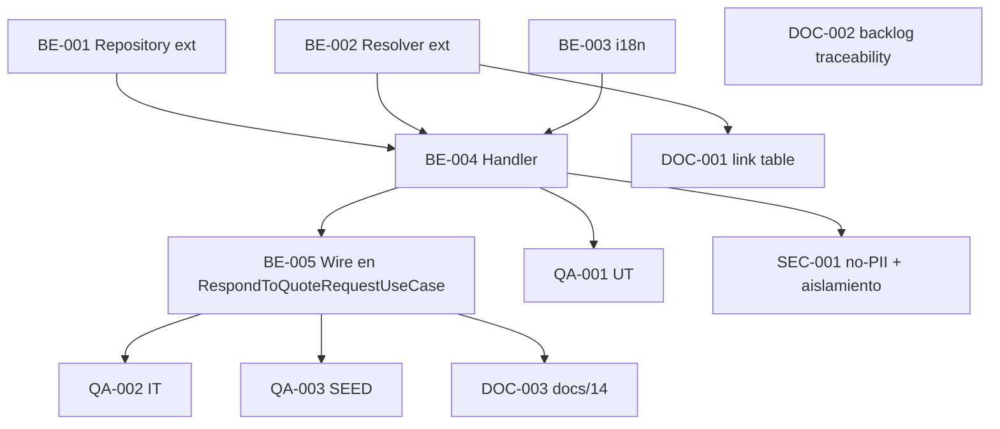

# Development Tasks — PB-P2-006 / US-069: Recibir aviso in-app de nueva Quote

## 1. Metadata

| Field                                | Value                                                                                                |
| ------------------------------------ | ---------------------------------------------------------------------------------------------------- |
| User Story ID                        | US-069                                                                                                |
| Source User Story                    | `management/user-stories/US-069-inapp-notification-new-quote.md`                                      |
| Source Technical Specification       | `management/technical-specs/P2/PB-P2-006/US-069-technical-spec.md`                                    |
| Decision Resolution Artifact         | `management/user-stories/decision-resolutions/US-069-decision-resolution.md`                          |
| Priority                             | P2                                                                                                    |
| Backlog ID                           | PB-P2-006                                                                                             |
| Backlog Title                        | Notificación de Quote enviada                                                                          |
| Backlog Execution Order              | 6 (sexto ítem de P2)                                                                                  |
| User Story Position in Backlog Item  | 1 de 1                                                                                                |
| Related User Stories in Backlog Item | US-069                                                                                                |
| Epic                                 | EPIC-NOT-001                                                                                          |
| Backlog Item Dependencies            | PB-P1-031 (US-052)                                                                                    |
| Feature                              | Emitir notificación in-app y email simulado al organizer cuando el vendor envía Quote                  |
| Module / Domain                      | Notifications                                                                                         |
| Backlog Alignment Status             | Found                                                                                                 |
| Task Breakdown Status                | Ready for Sprint Planning                                                                             |
| Created Date                         | 2026-07-06                                                                                            |
| Last Updated                         | 2026-07-06                                                                                            |

---

## 2. Source Validation

| Source                       | Found | Used | Notes                            |
| ---------------------------- | ----- | ---- | -------------------------------- |
| User Story                   | Yes   | Yes  | `Approved with Minor Notes`.      |
| Technical Specification      | Yes   | Yes  | `Ready for Task Breakdown`.       |
| Decision Resolution Artifact | Yes   | Yes  | D1..D6 formalizadas.              |
| Product Backlog Prioritized  | Yes   | Yes  | PB-P2-006, posición 1 de 1.       |
| ADRs                         | No    | No   | Sin ADR ad-hoc.                   |

---

## 3. Backlog Execution Context

### Parent Backlog Item

**PB-P2-006 — Notificación de Quote enviada**. Depende de PB-P1-031 (US-052). Formaliza `FR-QUOTE-017` y `BR-QUOTE-018`.

### Execution Order Rationale

Se implementa después de US-052 (upstream) y en paralelo con US-071 aprobada (surface consumidor). Patrón idéntico a US-068 aprobado.

### Related User Stories in Same Backlog Item

| User Story | Role in Backlog Item | Suggested Order |
| ---------- | -------------------- | --------------- |
| US-069     | Emisor único          | 1               |

---

## 4. Task Breakdown Summary

| Area                         | Number of Tasks | Notes                                                                     |
| ---------------------------- | --------------: | ------------------------------------------------------------------------- |
| Backend                      |               5 | Repository ext + Resolver ext + i18n + Handler + Wiring en US-052.         |
| Frontend                     |               0 | No aplica.                                                                 |
| API Contract                 |               0 | Reuso canonical.                                                            |
| Database / Prisma            |               0 | Sin migración.                                                              |
| AI / PromptOps               |               0 | No aplica.                                                                  |
| Security / Authorization     |               1 | Regresión no-PII + aislamiento.                                             |
| QA / Testing                 |               3 | UT + IT + SEED.                                                             |
| Seed / Demo Data             |               0 | Reuso.                                                                      |
| DevOps / Environment         |               0 | No aplica.                                                                  |
| Observability / Audit        |               0 | Cubierto por AC-05.                                                        |
| Documentation / Traceability |               3 | 3 ítems.                                                                    |
| **Total**                    |          **12** |                                                                             |

---

## 5. Traceability Matrix

| Acceptance Criterion              | Technical Spec Section                             | Task IDs                                                                                              |
| --------------------------------- | -------------------------------------------------- | ----------------------------------------------------------------------------------------------------- |
| AC-01 — Emisión correcta          | §7 Backend Design                                    | TASK-PB-P2-006-US-069-BE-002, BE-003, BE-004, BE-005, QA-002                                          |
| AC-02 — Idempotencia              | §7 Backend Design (existsQuoteReceivedForQuote)      | TASK-PB-P2-006-US-069-BE-001, BE-004, QA-002                                                          |
| AC-03 — Aislamiento               | §12 Security                                         | TASK-PB-P2-006-US-069-BE-004, SEC-001, QA-002                                                          |
| AC-04 — Idioma                    | §7 Backend Design (resolveLanguageCode)              | TASK-PB-P2-006-US-069-BE-004, QA-001                                                                   |
| AC-05 — Observabilidad + no-PII   | §14 Observability, §12 Security                      | TASK-PB-P2-006-US-069-BE-004, SEC-001                                                                  |
| AC-06 — Rollback                  | §7 Backend Design (transaction)                      | TASK-PB-P2-006-US-069-BE-005, QA-002                                                                   |
| AC-07 — Defensa                    | §7 Backend Design (guards)                           | TASK-PB-P2-006-US-069-BE-004, QA-001, QA-002                                                           |
| EC-01..EC-05                      | §7 Backend Design                                    | TASK-PB-P2-006-US-069-BE-004, QA-002                                                                   |
| Seed                              | §15 Seed / Demo                                      | TASK-PB-P2-006-US-069-QA-003                                                                           |

---

## 6. Development Tasks

### TASK-PB-P2-006-US-069-BE-001 — Extender `NotificationRepository` con `existsQuoteReceivedForQuote`

| Field                     | Value                                                              |
| ------------------------- | ------------------------------------------------------------------ |
| Area                      | Backend                                                            |
| Type                      | Implementation                                                     |
| Priority                  | Must                                                               |
| Estimate                  | XS                                                                 |
| Depends On                | —                                                                  |
| Source AC(s)              | AC-02                                                              |
| Technical Spec Section(s) | §7 Backend Design (Repository), §10 Database                        |
| Backlog ID                | PB-P2-006                                                          |
| User Story ID             | US-069                                                             |
| Owner Role                | Backend                                                            |
| Status                    | To Do                                                              |

#### Objective

Agregar `existsQuoteReceivedForQuote(ownerUserId, quoteId, { tx? })` con el SQL definido en §7.

#### Definition of Done

- [ ] Método implementado con soporte tx.
- [ ] UT del repositorio.
- [ ] Lint, type-check pasan.

---

### TASK-PB-P2-006-US-069-BE-002 — Extender `NotificationLinkResolver` con estrategia `quote_received`

| Field                     | Value                                                                |
| ------------------------- | -------------------------------------------------------------------- |
| Area                      | Backend                                                              |
| Type                      | Implementation                                                       |
| Priority                  | Must                                                                 |
| Estimate                  | XS                                                                   |
| Depends On                | —                                                                    |
| Source AC(s)              | AC-01, AC-02                                                          |
| Technical Spec Section(s) | §7 Backend Design (services)                                          |
| Backlog ID                | PB-P2-006                                                            |
| User Story ID             | US-069                                                               |
| Owner Role                | Backend                                                              |
| Status                    | To Do                                                                |

#### Objective

Agregar la fila `quote_received` a `LINK_STRATEGY_BY_TYPE`: retorna `/organizer/quote-requests/{payload.quoteRequestId}/comparator` si la QR existe; sino `null`.

#### Definition of Done

- [ ] Estrategia agregada.
- [ ] UT específico verde.

---

### TASK-PB-P2-006-US-069-BE-003 — Catálogos i18n `notif.quoteReceived` en 4 locales

| Field                     | Value                                                                |
| ------------------------- | -------------------------------------------------------------------- |
| Area                      | Backend / i18n                                                       |
| Type                      | Implementation                                                       |
| Priority                  | Must                                                                 |
| Estimate                  | XS                                                                   |
| Depends On                | —                                                                    |
| Source AC(s)              | AC-04                                                                |
| Technical Spec Section(s) | §18 Implementation Guidance                                           |
| Backlog ID                | PB-P2-006                                                            |
| User Story ID             | US-069                                                               |
| Owner Role                | Backend                                                              |
| Status                    | To Do                                                                |

#### Objective

Agregar catálogos `notifications.quote-received.<locale>.json` para `en, es-LATAM, es-ES, pt` con las keys `notif.quoteReceived.subject` y `notif.quoteReceived.body`.

#### Definition of Done

- [ ] 4 catálogos.
- [ ] CI check falla si faltan keys.

---

### TASK-PB-P2-006-US-069-BE-004 — Implementar `OnQuoteSentHandler`

| Field                     | Value                                                                                                                       |
| ------------------------- | --------------------------------------------------------------------------------------------------------------------------- |
| Area                      | Backend                                                                                                                     |
| Type                      | Implementation                                                                                                              |
| Priority                  | Must                                                                                                                        |
| Estimate                  | M                                                                                                                           |
| Depends On                | TASK-PB-P2-006-US-069-BE-001, BE-002, BE-003                                                                                 |
| Source AC(s)              | AC-01..AC-07                                                                                                                |
| Technical Spec Section(s) | §7 Backend Design, §12 Security, §14 Observability                                                                          |
| Backlog ID                | PB-P2-006                                                                                                                   |
| User Story ID             | US-069                                                                                                                      |
| Owner Role                | Backend                                                                                                                     |
| Status                    | To Do                                                                                                                       |

#### Objective

Implementar el handler con guards D6, idempotencia D2, resolución de idioma D5, INSERTs de 2 `Notification` y log `[EMAIL]` sin PII. Acepta `tx` para operar en la tx del use case.

#### Definition of Done

- [ ] Handler implementado.
- [ ] UT-01..UT-05 verdes (via QA-001).
- [ ] Lint, type-check pasan.

---

### TASK-PB-P2-006-US-069-BE-005 — Invocar handler desde `RespondToQuoteRequestUseCase`

| Field                     | Value                                                            |
| ------------------------- | ---------------------------------------------------------------- |
| Area                      | Backend                                                          |
| Type                      | Implementation                                                   |
| Priority                  | Must                                                             |
| Estimate                  | S                                                                |
| Depends On                | TASK-PB-P2-006-US-069-BE-004                                     |
| Source AC(s)              | AC-01, AC-06                                                      |
| Technical Spec Section(s) | §7 Backend Design (Use case wiring)                              |
| Backlog ID                | PB-P2-006                                                        |
| User Story ID             | US-069                                                           |
| Owner Role                | Backend                                                          |
| Status                    | To Do                                                            |

#### Objective

Modificar `RespondToQuoteRequestUseCase` (US-052) para invocar `OnQuoteSentHandler` con `{ quote, quoteRequest, event, correlationId, tx }` dentro de la `prisma.$transaction`.

#### Definition of Done

- [ ] Wiring aplicado sin romper tests existentes de US-052.
- [ ] IT-01 e IT-05 verdes (via QA-002).
- [ ] Lint, type-check pasan.

---

### TASK-PB-P2-006-US-069-SEC-001 — Regresión no-PII + aislamiento

| Field                     | Value                                                                     |
| ------------------------- | ------------------------------------------------------------------------- |
| Area                      | Security / Authorization                                                  |
| Type                      | Test                                                                      |
| Priority                  | Must                                                                      |
| Estimate                  | S                                                                         |
| Depends On                | TASK-PB-P2-006-US-069-BE-004                                              |
| Source AC(s)              | AC-03, AC-05                                                              |
| Technical Spec Section(s) | §12 Security, §13 Testing (Security Tests)                                 |
| Backlog ID                | PB-P2-006                                                                 |
| User Story ID             | US-069                                                                    |
| Owner Role                | QA                                                                        |
| Status                    | To Do                                                                     |

#### Objective

SEC-T-01 (no-PII en log) + SEC-T-02 (aislamiento BR-NOTIF-005), etiquetados `@security`.

#### Definition of Done

- [ ] 2 tests verdes.

---

### TASK-PB-P2-006-US-069-QA-001 — Unit tests handler (UT-01..UT-05)

| Field                     | Value                                        |
| ------------------------- | -------------------------------------------- |
| Area                      | QA / Testing                                 |
| Type                      | Test                                         |
| Priority                  | Must                                         |
| Estimate                  | S                                            |
| Depends On                | TASK-PB-P2-006-US-069-BE-004                  |
| Source AC(s)              | AC-01, AC-02, AC-04, AC-07                    |
| Technical Spec Section(s) | §13 Testing Strategy (Unit)                   |
| Backlog ID                | PB-P2-006                                    |
| User Story ID             | US-069                                       |
| Owner Role                | QA                                           |
| Status                    | To Do                                        |

#### Objective

5 UTs cubriendo guards, idempotencia, resolver, idioma, payload.

#### Definition of Done

- [ ] 5 UTs verdes.

---

### TASK-PB-P2-006-US-069-QA-002 — Integration tests (IT-01..IT-07)

| Field                     | Value                                                                        |
| ------------------------- | ---------------------------------------------------------------------------- |
| Area                      | QA / Testing                                                                 |
| Type                      | Test                                                                         |
| Priority                  | Must                                                                         |
| Estimate                  | M                                                                            |
| Depends On                | TASK-PB-P2-006-US-069-BE-005                                                 |
| Source AC(s)              | AC-01..AC-07, EC-01..EC-05                                                    |
| Technical Spec Section(s) | §13 Testing Strategy (Integration)                                            |
| Backlog ID                | PB-P2-006                                                                    |
| User Story ID             | US-069                                                                       |
| Owner Role                | QA                                                                           |
| Status                    | To Do                                                                        |

#### Objective

7 ITs con Supertest sobre el endpoint `POST /api/v1/quote-requests/:qrId/quotes` (o equivalente de US-052).

#### Definition of Done

- [ ] 7 ITs verdes.

---

### TASK-PB-P2-006-US-069-QA-003 — SEED verification

| Field                     | Value                                                       |
| ------------------------- | ----------------------------------------------------------- |
| Area                      | QA / Testing                                                |
| Type                      | Test                                                        |
| Priority                  | Should                                                      |
| Estimate                  | XS                                                          |
| Depends On                | TASK-PB-P2-006-US-069-BE-005                                 |
| Source AC(s)              | AC-01 (demo)                                                 |
| Technical Spec Section(s) | §15 Seed / Demo                                              |
| Backlog ID                | PB-P2-006                                                   |
| User Story ID             | US-069                                                      |
| Owner Role                | QA / Backend                                                |
| Status                    | To Do                                                       |

#### Objective

Verificar que el organizer demo tiene notif `quote_received` correspondiente a la Quote seed generada por US-052.

#### Definition of Done

- [ ] Test verde.

---

### TASK-PB-P2-006-US-069-DOC-001 — Agregar fila `quote_received` a `docs/16 §34.3`

| Field                     | Value                                                                   |
| ------------------------- | ----------------------------------------------------------------------- |
| Area                      | Documentation / Traceability                                            |
| Type                      | Documentation                                                           |
| Priority                  | Should                                                                  |
| Estimate                  | XS                                                                      |
| Depends On                | TASK-PB-P2-006-US-069-BE-002                                             |
| Source AC(s)              | AC-01                                                                    |
| Technical Spec Section(s) | §16 Documentation Alignment                                              |
| Backlog ID                | PB-P2-006                                                               |
| User Story ID             | US-069                                                                  |
| Owner Role                | Tech Lead / Documentation                                                |
| Status                    | To Do                                                                   |

#### Objective

Extender la tabla `link generation by type` en `docs/16 §34.3` con `quote_received → /organizer/quote-requests/{quoteRequestId}/comparator`.

#### Definition of Done

- [ ] PR mergeado.

---

### TASK-PB-P2-006-US-069-DOC-002 — Ampliar Traceability de PB-P2-006

| Field                     | Value                                                                 |
| ------------------------- | --------------------------------------------------------------------- |
| Area                      | Documentation / Traceability                                          |
| Type                      | Documentation                                                         |
| Priority                  | Should                                                                |
| Estimate                  | XS                                                                    |
| Depends On                | —                                                                     |
| Source AC(s)              | —                                                                     |
| Technical Spec Section(s) | §16 Documentation Alignment                                            |
| Backlog ID                | PB-P2-006                                                             |
| User Story ID             | US-069                                                                |
| Owner Role                | Tech Lead / Documentation                                              |
| Status                    | To Do                                                                 |

#### Objective

Ampliar `Traceability` de PB-P2-006 a `FR-QUOTE-017, FR-NOTIF-001, FR-NOTIF-003 · BR-QUOTE-018, BR-NOTIF-001/002/003/005/007 · UC-QUOTE-004 · Decisión PO US-069`.

#### Definition of Done

- [ ] PR mergeado.

---

### TASK-PB-P2-006-US-069-DOC-003 — Documentar `OnQuoteSentHandler` en `docs/14 §Notifications`

| Field                     | Value                                                                     |
| ------------------------- | ------------------------------------------------------------------------- |
| Area                      | Documentation / Traceability                                              |
| Type                      | Documentation                                                             |
| Priority                  | Should                                                                    |
| Estimate                  | XS                                                                        |
| Depends On                | TASK-PB-P2-006-US-069-BE-005                                              |
| Source AC(s)              | AC-01                                                                     |
| Technical Spec Section(s) | §16 Documentation Alignment                                                |
| Backlog ID                | PB-P2-006                                                                 |
| User Story ID             | US-069                                                                    |
| Owner Role                | Tech Lead / Documentation                                                  |
| Status                    | To Do                                                                     |

#### Objective

Agregar sección o fila al inventario del módulo `notifications` en `docs/14` describiendo el patrón in-tx del handler para `quote_received`.

#### Definition of Done

- [ ] PR mergeado.

---

## 7. Required QA Tasks

| Task ID                             | Test Type    | Purpose                                                              |
| ----------------------------------- | ------------ | -------------------------------------------------------------------- |
| TASK-PB-P2-006-US-069-QA-001        | Unit          | UT-01..UT-05.                                                         |
| TASK-PB-P2-006-US-069-QA-002        | Integration   | IT-01..IT-07.                                                         |
| TASK-PB-P2-006-US-069-QA-003        | Seed / Demo   | SEED-T-01.                                                            |

---

## 8. Required Security Tasks

| Task ID                       | Security Concern                                | Purpose                                                    |
| ----------------------------- | ----------------------------------------------- | ---------------------------------------------------------- |
| TASK-PB-P2-006-US-069-SEC-001 | No-PII en log + Aislamiento BR-NOTIF-005         | Regresión etiquetada `@security`.                          |

---

## 9. Required Seed / Demo Tasks

`No aplica` — reuso del seed de US-052. Verificación en QA-003.

---

## 10. Observability / Audit Tasks

`No aplica` — cubierto por AC-05 en BE-004 y SEC-001.

---

## 11. Documentation / Traceability Tasks

| Task ID                       | Document / Artifact                              | Purpose                                                             |
| ----------------------------- | ------------------------------------------------ | ------------------------------------------------------------------- |
| TASK-PB-P2-006-US-069-DOC-001 | `docs/16 §34.3` (tabla `link generation by type`) | Agregar fila `quote_received`.                                      |
| TASK-PB-P2-006-US-069-DOC-002 | PB-P2-006 Traceability                            | Ampliar IDs.                                                         |
| TASK-PB-P2-006-US-069-DOC-003 | `docs/14 §Notifications`                          | Documentar `OnQuoteSentHandler`.                                    |

---

## 12. Dependency Graph

---

## 13. Suggested Implementation Order

### Phase 1 — Foundation

1. TASK-PB-P2-006-US-069-BE-001 — Repository ext.
2. TASK-PB-P2-006-US-069-BE-002 — Resolver ext.
3. TASK-PB-P2-006-US-069-BE-003 — i18n.

### Phase 2 — Core Implementation

4. TASK-PB-P2-006-US-069-BE-004 — Handler.
5. TASK-PB-P2-006-US-069-BE-005 — Wiring en `RespondToQuoteRequestUseCase`.

### Phase 3 — Validation / Security / QA

6. TASK-PB-P2-006-US-069-QA-001.
7. TASK-PB-P2-006-US-069-QA-002.
8. TASK-PB-P2-006-US-069-SEC-001.
9. TASK-PB-P2-006-US-069-QA-003.

### Phase 4 — Documentation / Review

10. TASK-PB-P2-006-US-069-DOC-001.
11. TASK-PB-P2-006-US-069-DOC-002.
12. TASK-PB-P2-006-US-069-DOC-003.

---

## 14. Risks & Mitigations

| Risk                                                        | Impact                     | Mitigation                                                                    | Related Task     |
| ----------------------------------------------------------- | -------------------------- | ----------------------------------------------------------------------------- | ---------------- |
| Fallo del handler in-tx aborta la Quote                     | Vendor no puede enviar     | Riesgo aceptado (consistencia).                                                | BE-005           |
| Filtro `payload->>'quote_id'` lento                          | SELECT lento               | Selectividad por `user_id+type`.                                              | BE-001           |
| `language_preference` faltante                              | Fallback ladder             | UT-03.                                                                        | BE-004, QA-001   |
| Guard defensivo dispara skip erróneo                        | Notif perdida               | UT-01; upstream US-052 lo garantiza.                                          | QA-001           |
| Cambio de rutas frontend rompe el `link`                    | Deep link roto              | Centralizado en `LINK_STRATEGY_BY_TYPE`; contract test.                       | BE-002           |

---

## 15. Out of Scope Confirmation

* Surface UI (US-071).
* Mark-as-read (US-072).
* Endpoint nuevo.
* Frontend.
* Migración.
* Event bus / outbox.
* Push/SMS/WhatsApp.
* Retry asincrónico.
* Sentry/APM (NFR-OBS-006).

---

## 16. Readiness for Sprint Planning

| Check                                      | Status |
| ------------------------------------------ | ------ |
| Product Backlog mapping found              | Pass   |
| Every AC maps to tasks                     | Pass   |
| Technical Spec used when available         | Pass   |
| QA tasks included                          | Pass   |
| Security tasks included if applicable      | Pass   |
| Seed/demo tasks included if applicable     | Pass   |
| Observability tasks included if applicable | N/A    |
| Documentation tasks included if applicable | Pass   |
| Task dependencies clear                    | Pass   |
| Tasks small enough                         | Pass   |
| Ready for Sprint Planning                  | Yes    |

---

## 17. Final Recommendation

`Ready for Sprint Planning`

Las 12 tareas cubren AC-01..AC-07 y EC-01..EC-05, materializan D1–D6 y reutilizan artefactos aprobados (SimulatedEmailAdapter, NotificationLinkResolver, UserRepository.resolveLanguageCode). Sin frontend/migración/endpoint nuevo. 3 alineaciones documentales no bloqueantes.

---

Development Tasks created: Yes
Path: `management/development-tasks/P2/PB-P2-006/US-069-development-tasks.md`
Status: Ready for Sprint Planning
Technical Specification used: Yes
Backlog ID: PB-P2-006
Execution Order: 6 (sexto ítem de P2)
Next step: Sprint Planning / Roadmap.

Task groups: 5 Backend (repository + resolver + i18n + handler + wiring), 3 QA (UT + IT + SEED), 1 Security (no-PII + aislamiento), 3 Documentation Alignment.
Product Backlog mapping: Found (PB-P2-006, P2, US-069 posición 1 de 1).
Decision Resolution artifact used: Yes.
Warnings: 3 Documentation Alignment Required (no bloqueantes).
