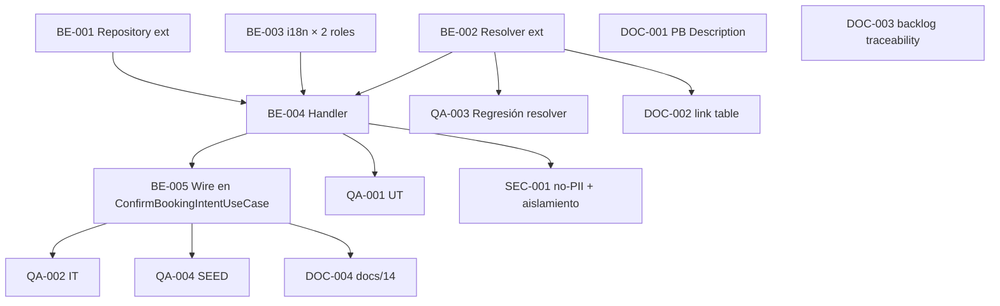

# Development Tasks — PB-P2-007 / US-070: Recibir aviso in-app de Booking confirmado

## 1. Metadata

| Field                                | Value                                                                                                |
| ------------------------------------ | ---------------------------------------------------------------------------------------------------- |
| User Story ID                        | US-070                                                                                                |
| Source User Story                    | `management/user-stories/US-070-inapp-notification-booking-confirmed.md`                              |
| Source Technical Specification       | `management/technical-specs/P2/PB-P2-007/US-070-technical-spec.md`                                    |
| Decision Resolution Artifact         | `management/user-stories/decision-resolutions/US-070-decision-resolution.md`                          |
| Priority                             | P2                                                                                                    |
| Backlog ID                           | PB-P2-007                                                                                             |
| Backlog Title                        | Notificación de BookingIntent confirmado                                                               |
| Backlog Execution Order              | 7 (séptimo ítem de P2)                                                                                |
| User Story Position in Backlog Item  | 1 de 1                                                                                                |
| Related User Stories in Backlog Item | US-070                                                                                                |
| Epic                                 | EPIC-NOT-001                                                                                          |
| Backlog Item Dependencies            | PB-P1-036 (US-061)                                                                                    |
| Feature                              | Emitir notificación bilateral (organizer + vendor) al confirmarse BookingIntent                        |
| Module / Domain                      | Notifications                                                                                         |
| Backlog Alignment Status             | Found                                                                                                 |
| Task Breakdown Status                | Ready for Sprint Planning                                                                             |
| Created Date                         | 2026-07-06                                                                                            |
| Last Updated                         | 2026-07-06                                                                                            |

---

## 2. Source Validation

| Source                       | Found | Used | Notes                            |
| ---------------------------- | ----- | ---- | -------------------------------- |
| User Story                   | Yes   | Yes  | `Approved with Minor Notes`.      |
| Technical Specification      | Yes   | Yes  | `Ready for Task Breakdown`.       |
| Decision Resolution Artifact | Yes   | Yes  | D1..D7 formalizadas.              |
| Product Backlog Prioritized  | Yes   | Yes  | PB-P2-007, posición 1 de 1.       |
| ADRs                         | No    | No   | Sin ADR ad-hoc.                   |

---

## 3. Backlog Execution Context

### Parent Backlog Item

**PB-P2-007 — Notificación de BookingIntent confirmado**. Depende de PB-P1-036 (US-061). Formaliza FR-BOOKING-010 con emisión bilateral (D6). Documentation Alignment con PB-P2-007 `Description` requerido (DOC-002).

### Execution Order Rationale

Se implementa después de US-061 (upstream) y US-071 (surface organizer aprobada). Patrón simétrico a US-068/US-069 con dos particularidades: 2 recipients y dispatch por rol.

### Related User Stories in Same Backlog Item

| User Story | Role in Backlog Item | Suggested Order |
| ---------- | -------------------- | --------------- |
| US-070     | Emisor bilateral      | 1               |

---

## 4. Task Breakdown Summary

| Area                         | Number of Tasks | Notes                                                                             |
| ---------------------------- | --------------: | --------------------------------------------------------------------------------- |
| Backend                      |               5 | Repository ext + Resolver ext (con retrocompatibilidad) + i18n × 2 roles + Handler + Wiring. |
| Frontend                     |               0 | No aplica.                                                                         |
| API Contract                 |               0 | Reuso canonical.                                                                    |
| Database / Prisma            |               0 | Sin migración.                                                                      |
| AI / PromptOps               |               0 | No aplica.                                                                          |
| Security / Authorization     |               1 | Regresión no-PII + aislamiento.                                                     |
| QA / Testing                 |               4 | UT + IT + regresión resolver + SEED.                                                |
| Seed / Demo Data             |               0 | Reuso (BR-SEED-006).                                                                |
| DevOps / Environment         |               0 | No aplica.                                                                          |
| Observability / Audit        |               0 | Cubierto por AC-05 y SEC-001.                                                       |
| Documentation / Traceability |               4 | 4 ítems (PB-P2-007 Description, `docs/16 §34.3`, PB-P2-007 Traceability, `docs/14`). |
| **Total**                    |          **14** |                                                                                     |

---

## 5. Traceability Matrix

| Acceptance Criterion              | Technical Spec Section                             | Task IDs                                                                                                                          |
| --------------------------------- | -------------------------------------------------- | --------------------------------------------------------------------------------------------------------------------------------- |
| AC-01 — Emisión bilateral         | §7 Backend Design                                    | TASK-PB-P2-007-US-070-BE-002, BE-003, BE-004, BE-005, QA-002                                                                       |
| AC-02 — Idempotencia por recipient | §7 Backend Design                                    | TASK-PB-P2-007-US-070-BE-001, BE-004, QA-002                                                                                       |
| AC-03 — Aislamiento               | §12 Security                                         | TASK-PB-P2-007-US-070-BE-004, SEC-001, QA-002                                                                                       |
| AC-04 — Idioma por recipient      | §7 Backend Design                                    | TASK-PB-P2-007-US-070-BE-004, QA-001                                                                                                |
| AC-05 — Observabilidad + no-PII   | §14 Observability, §12 Security                      | TASK-PB-P2-007-US-070-BE-004, SEC-001                                                                                                |
| AC-06 — Rollback                  | §7 Backend Design (transaction)                      | TASK-PB-P2-007-US-070-BE-005, QA-002                                                                                                |
| AC-07 — Defensa                    | §7 Backend Design (guards)                           | TASK-PB-P2-007-US-070-BE-004, QA-001, QA-002                                                                                        |
| AC-08 — Dedup self-notification    | §7 Backend Design (dedup)                            | TASK-PB-P2-007-US-070-BE-004, QA-001, QA-002                                                                                        |
| EC-01..EC-05                      | §7 Backend Design                                    | TASK-PB-P2-007-US-070-BE-004, QA-002                                                                                                |
| Retrocompatibilidad resolver       | §17 Risks                                            | TASK-PB-P2-007-US-070-BE-002, QA-003                                                                                                |
| Seed                              | §15 Seed / Demo                                      | TASK-PB-P2-007-US-070-QA-004                                                                                                        |

---

## 6. Development Tasks

### TASK-PB-P2-007-US-070-BE-001 — Extender `NotificationRepository` con `existsBookingConfirmedForRecipient`

| Field                     | Value                                                              |
| ------------------------- | ------------------------------------------------------------------ |
| Area                      | Backend                                                            |
| Type                      | Implementation                                                     |
| Priority                  | Must                                                               |
| Estimate                  | XS                                                                 |
| Depends On                | —                                                                  |
| Source AC(s)              | AC-02                                                              |
| Technical Spec Section(s) | §7 Backend Design (Repository), §10 Database                        |
| Backlog ID                | PB-P2-007                                                          |
| User Story ID             | US-070                                                             |
| Owner Role                | Backend                                                            |
| Status                    | To Do                                                              |

#### Objective

Agregar `existsBookingConfirmedForRecipient(recipientUserId, bookingIntentId, { tx? })` con el SQL definido en §7.

#### Definition of Done

- [ ] Método implementado con soporte tx.
- [ ] UT del repositorio.
- [ ] Lint, type-check pasan.

---

### TASK-PB-P2-007-US-070-BE-002 — Extender `NotificationLinkResolver` con firma `{recipientRole}` + estrategia `booking_confirmed`

| Field                     | Value                                                                                                       |
| ------------------------- | ----------------------------------------------------------------------------------------------------------- |
| Area                      | Backend                                                                                                     |
| Type                      | Implementation                                                                                              |
| Priority                  | Must                                                                                                        |
| Estimate                  | S                                                                                                           |
| Depends On                | —                                                                                                           |
| Source AC(s)              | AC-01, AC-02                                                                                                |
| Technical Spec Section(s) | §7 Backend Design (services), §17 Risks                                                                     |
| Backlog ID                | PB-P2-007                                                                                                   |
| User Story ID             | US-070                                                                                                      |
| Owner Role                | Backend                                                                                                     |
| Status                    | To Do                                                                                                       |

#### Objective

Extender la firma del `NotificationLinkResolver.resolve` para aceptar `{ recipientRole }` opcional. Agregar la fila `booking_confirmed` con dispatch por rol: organizer → `/organizer/events/{eventId}/bookings/{bookingIntentId}`; vendor → `/vendor/bookings/{bookingIntentId}`. La firma debe ser retrocompatible con los callers existentes de US-068/US-069/US-071.

#### Scope

##### Include

* Firma retrocompatible (`recipientRole` opcional).
* Estrategia `booking_confirmed` con dispatch.
* Fallback `null` si el recurso no existe.

##### Exclude

* Cambios de firma para otros tipos (`task_due_soon, quote_request_received, quote_received`).

#### Definition of Done

- [ ] Firma extendida sin romper callers.
- [ ] UT específico para `booking_confirmed` con ambos roles.
- [ ] Regresión sobre tipos existentes verde (via QA-003).
- [ ] Lint, type-check pasan.

---

### TASK-PB-P2-007-US-070-BE-003 — Catálogos i18n `notif.bookingConfirmed.<role>` × 4 locales

| Field                     | Value                                                                |
| ------------------------- | -------------------------------------------------------------------- |
| Area                      | Backend / i18n                                                       |
| Type                      | Implementation                                                       |
| Priority                  | Must                                                                 |
| Estimate                  | S                                                                    |
| Depends On                | —                                                                    |
| Source AC(s)              | AC-04                                                                |
| Technical Spec Section(s) | §18 Implementation Guidance                                           |
| Backlog ID                | PB-P2-007                                                            |
| User Story ID             | US-070                                                               |
| Owner Role                | Backend                                                              |
| Status                    | To Do                                                                |

#### Objective

Agregar catálogos con estructura `notif.bookingConfirmed.<role>.<key>` (`role ∈ {organizer, vendor}`, `key ∈ {subject, body}`) × 4 locales (`en, es-LATAM, es-ES, pt`). Total: 16 keys.

#### Definition of Done

- [ ] 4 catálogos × 2 roles.
- [ ] CI check falla si faltan keys.

---

### TASK-PB-P2-007-US-070-BE-004 — Implementar `OnBookingConfirmedHandler`

| Field                     | Value                                                                                                                                        |
| ------------------------- | -------------------------------------------------------------------------------------------------------------------------------------------- |
| Area                      | Backend                                                                                                                                      |
| Type                      | Implementation                                                                                                                               |
| Priority                  | Must                                                                                                                                         |
| Estimate                  | M                                                                                                                                            |
| Depends On                | TASK-PB-P2-007-US-070-BE-001, BE-002, BE-003                                                                                                 |
| Source AC(s)              | AC-01..AC-08, EC-01..EC-05                                                                                                                    |
| Technical Spec Section(s) | §7 Backend Design (handler flow), §12 Security, §14 Observability                                                                            |
| Backlog ID                | PB-P2-007                                                                                                                                    |
| User Story ID             | US-070                                                                                                                                       |
| Owner Role                | Backend                                                                                                                                      |
| Status                    | To Do                                                                                                                                        |

#### Objective

Implementar el handler con: guards globales (status, event), dedup self-notification, loop por recipient con guard `deactivated`, idempotencia por recipient, resolución de idioma por recipient, INSERTs 2× por recipient, invocación de `SimulatedEmailAdapter.logEmail` × recipient. Acepta `tx` para operar en la tx del use case.

#### Definition of Done

- [ ] Handler implementado.
- [ ] UT-01..UT-07 verdes (via QA-001).
- [ ] Lint, type-check pasan.

---

### TASK-PB-P2-007-US-070-BE-005 — Invocar handler desde `ConfirmBookingIntentUseCase`

| Field                     | Value                                                                             |
| ------------------------- | --------------------------------------------------------------------------------- |
| Area                      | Backend                                                                           |
| Type                      | Implementation                                                                    |
| Priority                  | Must                                                                              |
| Estimate                  | S                                                                                 |
| Depends On                | TASK-PB-P2-007-US-070-BE-004                                                       |
| Source AC(s)              | AC-01, AC-06                                                                       |
| Technical Spec Section(s) | §7 Backend Design (Use case wiring)                                                |
| Backlog ID                | PB-P2-007                                                                         |
| User Story ID             | US-070                                                                            |
| Owner Role                | Backend                                                                           |
| Status                    | To Do                                                                             |

#### Objective

Modificar `ConfirmBookingIntentUseCase` (US-061) para invocar `OnBookingConfirmedHandler` con `{ bookingIntent, quote, quoteRequest, event, vendorProfile, correlationId, tx }` dentro de la `prisma.$transaction`, tras persistir el cambio de estado y la actualización de `BudgetItem.committed` (US-061 alcance).

#### Definition of Done

- [ ] Wiring sin romper tests existentes de US-061.
- [ ] IT-01 e IT-05 verdes (via QA-002).
- [ ] Lint, type-check pasan.

---

### TASK-PB-P2-007-US-070-SEC-001 — Regresión no-PII + aislamiento

| Field                     | Value                                                                     |
| ------------------------- | ------------------------------------------------------------------------- |
| Area                      | Security / Authorization                                                  |
| Type                      | Test                                                                      |
| Priority                  | Must                                                                      |
| Estimate                  | S                                                                         |
| Depends On                | TASK-PB-P2-007-US-070-BE-004                                              |
| Source AC(s)              | AC-03, AC-05                                                              |
| Technical Spec Section(s) | §12 Security, §13 Testing (Security Tests)                                 |
| Backlog ID                | PB-P2-007                                                                 |
| User Story ID             | US-070                                                                    |
| Owner Role                | QA                                                                        |
| Status                    | To Do                                                                     |

#### Objective

SEC-T-01 (no-PII en log × recipient) + SEC-T-02 (aislamiento BR-NOTIF-005 con 2 parejas), etiquetados `@security`.

#### Definition of Done

- [ ] 2 tests verdes.

---

### TASK-PB-P2-007-US-070-QA-001 — Unit tests handler (UT-01..UT-07)

| Field                     | Value                                             |
| ------------------------- | ------------------------------------------------- |
| Area                      | QA / Testing                                      |
| Type                      | Test                                              |
| Priority                  | Must                                              |
| Estimate                  | S                                                 |
| Depends On                | TASK-PB-P2-007-US-070-BE-004                       |
| Source AC(s)              | AC-01, AC-02, AC-04, AC-07, AC-08                  |
| Technical Spec Section(s) | §13 Testing Strategy (Unit)                        |
| Backlog ID                | PB-P2-007                                         |
| User Story ID             | US-070                                            |
| Owner Role                | QA                                                |
| Status                    | To Do                                             |

#### Objective

7 UTs cubriendo guards globales, idempotencia por recipient, resolución de idioma × 2, resolver por rol, payload, dedup self-notification, skip parcial.

#### Definition of Done

- [ ] 7 UTs verdes.

---

### TASK-PB-P2-007-US-070-QA-002 — Integration tests (IT-01..IT-09)

| Field                     | Value                                                                        |
| ------------------------- | ---------------------------------------------------------------------------- |
| Area                      | QA / Testing                                                                 |
| Type                      | Test                                                                         |
| Priority                  | Must                                                                         |
| Estimate                  | M                                                                            |
| Depends On                | TASK-PB-P2-007-US-070-BE-005                                                 |
| Source AC(s)              | AC-01..AC-08, EC-01..EC-05                                                    |
| Technical Spec Section(s) | §13 Testing Strategy (Integration)                                            |
| Backlog ID                | PB-P2-007                                                                    |
| User Story ID             | US-070                                                                       |
| Owner Role                | QA                                                                           |
| Status                    | To Do                                                                        |

#### Objective

9 ITs con Supertest sobre el endpoint de US-061: emisión bilateral, idempotencia por recipient, aislamiento, idioma per recipient, rollback, defensa status, log sin PII, self-notification dedup, skip parcial por deactivated.

#### Definition of Done

- [ ] 9 ITs verdes.

---

### TASK-PB-P2-007-US-070-QA-003 — Regresión del `NotificationLinkResolver` (US-068/US-069/US-071)

| Field                     | Value                                                                       |
| ------------------------- | --------------------------------------------------------------------------- |
| Area                      | QA / Testing                                                                |
| Type                      | Test                                                                        |
| Priority                  | Must                                                                        |
| Estimate                  | XS                                                                          |
| Depends On                | TASK-PB-P2-007-US-070-BE-002                                                 |
| Source AC(s)              | —                                                                           |
| Technical Spec Section(s) | §17 Risks                                                                    |
| Backlog ID                | PB-P2-007                                                                   |
| User Story ID             | US-070                                                                      |
| Owner Role                | QA                                                                          |
| Status                    | To Do                                                                       |

#### Objective

Verificar que la extensión de firma del resolver con `{recipientRole}` opcional no rompe los callers existentes (`task_due_soon` en US-071, `quote_request_received` en US-068, `quote_received` en US-069).

#### Definition of Done

- [ ] Suite existente de resolver verde.

---

### TASK-PB-P2-007-US-070-QA-004 — SEED verification

| Field                     | Value                                                       |
| ------------------------- | ----------------------------------------------------------- |
| Area                      | QA / Testing                                                |
| Type                      | Test                                                        |
| Priority                  | Should                                                      |
| Estimate                  | XS                                                          |
| Depends On                | TASK-PB-P2-007-US-070-BE-005                                 |
| Source AC(s)              | AC-01 (demo)                                                 |
| Technical Spec Section(s) | §15 Seed / Demo                                              |
| Backlog ID                | PB-P2-007                                                   |
| User Story ID             | US-070                                                      |
| Owner Role                | QA / Backend                                                |
| Status                    | To Do                                                       |

#### Objective

Tras seed (BR-SEED-006), organizer demo y vendor demo tienen notif `booking_confirmed`.

#### Definition of Done

- [ ] Test verde.

---

### TASK-PB-P2-007-US-070-DOC-001 — Corregir `Description` de PB-P2-007

| Field                     | Value                                                                        |
| ------------------------- | ---------------------------------------------------------------------------- |
| Area                      | Documentation / Traceability                                                 |
| Type                      | Documentation                                                                |
| Priority                  | Should                                                                       |
| Estimate                  | XS                                                                           |
| Depends On                | —                                                                            |
| Source AC(s)              | —                                                                            |
| Technical Spec Section(s) | §16 Documentation Alignment Required                                          |
| Backlog ID                | PB-P2-007                                                                    |
| User Story ID             | US-070                                                                       |
| Owner Role                | Tech Lead / Documentation                                                     |
| Status                    | To Do                                                                        |

#### Objective

Actualizar `Description` de PB-P2-007 en `management/artifacts/4-Product-Backlog-Prioritized.md` a "Organizer y vendor reciben notificación in-app + email simulado al confirmarse `BookingIntent`".

#### Definition of Done

- [ ] PR mergeado.

---

### TASK-PB-P2-007-US-070-DOC-002 — Agregar fila `booking_confirmed` con dispatch por rol a `docs/16 §34.3`

| Field                     | Value                                                                       |
| ------------------------- | --------------------------------------------------------------------------- |
| Area                      | Documentation / Traceability                                                |
| Type                      | Documentation                                                               |
| Priority                  | Should                                                                      |
| Estimate                  | XS                                                                          |
| Depends On                | TASK-PB-P2-007-US-070-BE-002                                                 |
| Source AC(s)              | AC-01                                                                       |
| Technical Spec Section(s) | §16 Documentation Alignment                                                  |
| Backlog ID                | PB-P2-007                                                                   |
| User Story ID             | US-070                                                                      |
| Owner Role                | Tech Lead / Documentation                                                    |
| Status                    | To Do                                                                       |

#### Objective

Ampliar la tabla `link generation by type` en `docs/16 §34.3` con `booking_confirmed` y su lógica de dispatch por rol.

#### Definition of Done

- [ ] PR mergeado.

---

### TASK-PB-P2-007-US-070-DOC-003 — Ampliar Traceability de PB-P2-007

| Field                     | Value                                                                       |
| ------------------------- | --------------------------------------------------------------------------- |
| Area                      | Documentation / Traceability                                                |
| Type                      | Documentation                                                               |
| Priority                  | Should                                                                      |
| Estimate                  | XS                                                                          |
| Depends On                | —                                                                           |
| Source AC(s)              | —                                                                           |
| Technical Spec Section(s) | §16 Documentation Alignment                                                  |
| Backlog ID                | PB-P2-007                                                                   |
| User Story ID             | US-070                                                                      |
| Owner Role                | Tech Lead / Documentation                                                    |
| Status                    | To Do                                                                       |

#### Objective

Ampliar Traceability de PB-P2-007 con `FR-BOOKING-010, UC-BOOKING-002, BR-BOOKING-002/003, BR-NOTIF-*, NFR-OBS-004/005 · Decisión PO US-070 (recipients bilaterales)`.

#### Definition of Done

- [ ] PR mergeado.

---

### TASK-PB-P2-007-US-070-DOC-004 — Documentar `OnBookingConfirmedHandler` en `docs/14 §Notifications`

| Field                     | Value                                                                     |
| ------------------------- | ------------------------------------------------------------------------- |
| Area                      | Documentation / Traceability                                              |
| Type                      | Documentation                                                             |
| Priority                  | Should                                                                    |
| Estimate                  | XS                                                                        |
| Depends On                | TASK-PB-P2-007-US-070-BE-005                                              |
| Source AC(s)              | AC-01                                                                     |
| Technical Spec Section(s) | §16 Documentation Alignment                                                |
| Backlog ID                | PB-P2-007                                                                 |
| User Story ID             | US-070                                                                    |
| Owner Role                | Tech Lead / Documentation                                                  |
| Status                    | To Do                                                                     |

#### Objective

Documentar el handler bilateral con dedup + dispatch por rol en `docs/14 §Notifications`.

#### Definition of Done

- [ ] PR mergeado.

---

## 7. Required QA Tasks

| Task ID                             | Test Type          | Purpose                                                              |
| ----------------------------------- | ------------------ | -------------------------------------------------------------------- |
| TASK-PB-P2-007-US-070-QA-001        | Unit                | UT-01..UT-07 (guards, idempotencia, resolver, idioma, payload, dedup, skip parcial). |
| TASK-PB-P2-007-US-070-QA-002        | Integration         | IT-01..IT-09 (bilateral, idempotencia, aislamiento, idioma, rollback, defensa, log, self-notification, skip). |
| TASK-PB-P2-007-US-070-QA-003        | Regression         | Callers existentes del resolver (US-068/US-069/US-071).             |
| TASK-PB-P2-007-US-070-QA-004        | Seed / Demo         | SEED-T-01.                                                            |

---

## 8. Required Security Tasks

| Task ID                       | Security Concern                                | Purpose                                                    |
| ----------------------------- | ----------------------------------------------- | ---------------------------------------------------------- |
| TASK-PB-P2-007-US-070-SEC-001 | No-PII en log + Aislamiento BR-NOTIF-005         | Regresión etiquetada `@security`.                          |

---

## 9. Required Seed / Demo Tasks

`No aplica` — reuso del seed de US-061 + BR-SEED-006. Verificación en QA-004.

---

## 10. Observability / Audit Tasks

`No aplica` — cubierto por AC-05 en BE-004 y SEC-001.

---

## 11. Documentation / Traceability Tasks

| Task ID                       | Document / Artifact                              | Purpose                                                             |
| ----------------------------- | ------------------------------------------------ | ------------------------------------------------------------------- |
| TASK-PB-P2-007-US-070-DOC-001 | PB-P2-007 `Description`                            | Corregir a "organizer y vendor".                                    |
| TASK-PB-P2-007-US-070-DOC-002 | `docs/16 §34.3` (tabla `link generation by type`) | Agregar fila `booking_confirmed` con dispatch.                       |
| TASK-PB-P2-007-US-070-DOC-003 | PB-P2-007 Traceability                             | Ampliar IDs.                                                         |
| TASK-PB-P2-007-US-070-DOC-004 | `docs/14 §Notifications`                           | Documentar `OnBookingConfirmedHandler`.                              |

---

## 12. Dependency Graph

---

## 13. Suggested Implementation Order

### Phase 1 — Foundation

1. TASK-PB-P2-007-US-070-BE-001 — Repository ext.
2. TASK-PB-P2-007-US-070-BE-002 — Resolver ext (con retrocompatibilidad).
3. TASK-PB-P2-007-US-070-QA-003 — Regresión resolver (validar retrocompatibilidad).
4. TASK-PB-P2-007-US-070-BE-003 — i18n × 2 roles.

### Phase 2 — Core Implementation

5. TASK-PB-P2-007-US-070-BE-004 — Handler bilateral con dedup.
6. TASK-PB-P2-007-US-070-BE-005 — Wiring en `ConfirmBookingIntentUseCase`.

### Phase 3 — Validation / Security / QA

7. TASK-PB-P2-007-US-070-QA-001.
8. TASK-PB-P2-007-US-070-QA-002.
9. TASK-PB-P2-007-US-070-SEC-001.
10. TASK-PB-P2-007-US-070-QA-004.

### Phase 4 — Documentation / Review

11. TASK-PB-P2-007-US-070-DOC-001.
12. TASK-PB-P2-007-US-070-DOC-002.
13. TASK-PB-P2-007-US-070-DOC-003.
14. TASK-PB-P2-007-US-070-DOC-004.

---

## 14. Risks & Mitigations

| Risk                                                                                                     | Impact                              | Mitigation                                                                                                                        | Related Task     |
| -------------------------------------------------------------------------------------------------------- | ----------------------------------- | --------------------------------------------------------------------------------------------------------------------------------- | ---------------- |
| Fallo del handler in-tx aborta `confirmed_intent` + `BudgetItem.committed`                               | Vendor no puede confirmar           | Riesgo aceptado (consistencia).                                                                                                    | BE-005           |
| Firma extendida del resolver rompe callers existentes                                                     | Regresión US-068/US-069/US-071      | Parámetro `{recipientRole}` opcional + QA-003.                                                                                     | BE-002, QA-003   |
| Filtro `payload->>'booking_intent_id'` lento                                                              | SELECT lento                        | Selectividad por `user_id+type`; PERF opcional.                                                                                   | BE-001           |
| `language_preference` faltante                                                                           | Fallback ladder                      | UT-03.                                                                                                                              | BE-004, QA-001   |
| Self-notification no cubierto en tests                                                                    | Bug en dedup                         | UT-06 e IT-08.                                                                                                                      | QA-001, QA-002   |
| Copy diferente por rol duplica catálogos i18n                                                             | Mantenimiento                       | Estructura `notif.bookingConfirmed.<role>.<key>`; CI check.                                                                        | BE-003           |
| Cambio de rutas frontend rompe `link` por rol                                                             | Deep link roto                       | Centralizado en `LINK_STRATEGY_BY_TYPE`; contract test.                                                                            | BE-002           |

---

## 15. Out of Scope Confirmation

* Surface UI organizer (US-071 aprobada).
* Surface UI vendor (Future).
* Mark-as-read (US-072).
* Notif de creación (`pending`) y cancelación de BookingIntent (Future US aunque FR-BOOKING-010 las enumera).
* Actualización de `BudgetItem.committed` (US-061).
* Endpoint nuevo.
* Frontend.
* Migración.
* Event bus / outbox.
* Push/SMS/WhatsApp.
* Retry asincrónico.
* Sentry/APM (NFR-OBS-006).
* Inclusión de `Quote.total` en payload.

---

## 16. Readiness for Sprint Planning

| Check                                      | Status |
| ------------------------------------------ | ------ |
| Product Backlog mapping found              | Pass   |
| Every AC maps to tasks                     | Pass   |
| Technical Spec used when available         | Pass   |
| QA tasks included                          | Pass   |
| Security tasks included if applicable      | Pass   |
| Seed/demo tasks included if applicable     | Pass   |
| Observability tasks included if applicable | N/A    |
| Documentation tasks included if applicable | Pass   |
| Task dependencies clear                    | Pass   |
| Tasks small enough                         | Pass   |
| Ready for Sprint Planning                  | Yes    |

---

## 17. Final Recommendation

`Ready for Sprint Planning`

Las 14 tareas cubren AC-01..AC-08 y EC-01..EC-05, materializan D1–D7 y reutilizan artefactos aprobados (SimulatedEmailAdapter, NotificationLinkResolver extendido con retrocompatibilidad, resolveLanguageCode). Sin frontend/migración/endpoint nuevo. 4 alineaciones documentales no bloqueantes. QA-003 protege explícitamente la regresión sobre callers existentes del resolver.

---

Development Tasks created: Yes
Path: `management/development-tasks/P2/PB-P2-007/US-070-development-tasks.md`
Status: Ready for Sprint Planning
Technical Specification used: Yes
Backlog ID: PB-P2-007
Execution Order: 7 (séptimo ítem de P2)
Next step: Sprint Planning / Roadmap.

Task groups: 5 Backend (repository + resolver ext con retrocompat + i18n × 2 roles + handler bilateral + wiring), 4 QA (UT + IT + regresión resolver + SEED), 1 Security (no-PII + aislamiento), 4 Documentation Alignment (PB Description + docs/16 §34.3 + PB Traceability + docs/14 §Notifications).
Product Backlog mapping: Found (PB-P2-007, P2, posición 1 de 1).
Decision Resolution artifact used: Yes.
Warnings: 4 Documentation Alignment Required (no bloqueantes), extensión del resolver requiere regresión explícita, 1 gap del backlog (bandeja vendor Future US no listada compartido con US-068).
