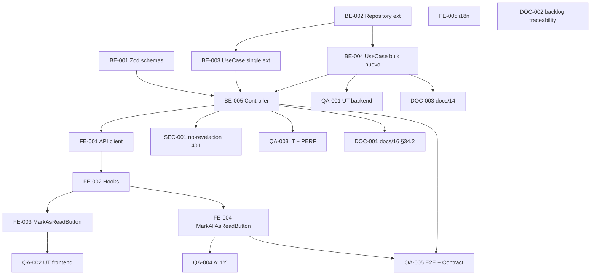

# Development Tasks — PB-P2-008 / US-072: Marcar notificación como leída

## 1. Metadata

| Field                                | Value                                                                                                |
| ------------------------------------ | ---------------------------------------------------------------------------------------------------- |
| User Story ID                        | US-072                                                                                                |
| Source User Story                    | `management/user-stories/US-072-mark-notification-read.md`                                            |
| Source Technical Specification       | `management/technical-specs/P2/PB-P2-008/US-072-technical-spec.md`                                    |
| Decision Resolution Artifact         | `management/user-stories/decision-resolutions/US-072-decision-resolution.md`                          |
| Priority                             | P2                                                                                                    |
| Backlog ID                           | PB-P2-008                                                                                             |
| Backlog Title                        | Marcar notificaciones como leídas (single + bulk)                                                      |
| Backlog Execution Order              | 8 (octavo ítem de P2)                                                                                 |
| User Story Position in Backlog Item  | 1 de 1                                                                                                |
| Related User Stories in Backlog Item | US-072                                                                                                |
| Epic                                 | EPIC-NOT-001                                                                                          |
| Backlog Item Dependencies            | US-034/068/069/070 (upstream — emisores), US-071 (surface consumidor aprobada)                       |
| Feature                              | Mark notification as read (single + all)                                                               |
| Module / Domain                      | Notifications                                                                                         |
| Backlog Alignment Status             | Found                                                                                                 |
| Task Breakdown Status                | Ready for Sprint Planning                                                                             |
| Created Date                         | 2026-07-07                                                                                            |
| Last Updated                         | 2026-07-07                                                                                            |

---

## 2. Source Validation

| Source                       | Found | Used | Notes                            |
| ---------------------------- | ----- | ---- | -------------------------------- |
| User Story                   | Yes   | Yes  | `Approved with Minor Notes`.      |
| Technical Specification      | Yes   | Yes  | `Ready for Task Breakdown`.       |
| Decision Resolution Artifact | Yes   | Yes  | D1..D6 formalizadas.              |
| Product Backlog Prioritized  | Yes   | Yes  | PB-P2-008, posición 1 de 1.       |
| ADRs                         | No    | No   | Sin ADR ad-hoc.                   |

---

## 3. Backlog Execution Context

### Parent Backlog Item

**PB-P2-008 — Marcar notificaciones como leídas (single + bulk)**. Cierra el ciclo unread → read consumido por US-071 (surface aprobada).

### Execution Order Rationale

Se implementa después de US-071 (surface aprobada declara las query keys canónicas). Puede ejecutarse en paralelo con las historias emisoras de EPIC-NOT-001.

### Related User Stories in Same Backlog Item

| User Story | Role in Backlog Item                                     | Suggested Order |
| ---------- | -------------------------------------------------------- | --------------- |
| US-072     | Mutations backend + hooks frontend con optimistic UI      | 1               |

---

## 4. Task Breakdown Summary

| Area                         | Number of Tasks | Notes                                                                          |
| ---------------------------- | --------------: | ------------------------------------------------------------------------------ |
| Backend                      |               5 | Zod schemas + Repository ext + UseCase ext + UseCase nuevo + Controller.        |
| Frontend                     |               5 | API client + 2 hooks + 2 componentes botón + i18n.                              |
| API Contract                 |               0 | Reuso canonical (extensión de query param).                                     |
| Database / Prisma            |               0 | Sin migración.                                                                  |
| AI / PromptOps               |               0 | No aplica.                                                                      |
| Security / Authorization     |               1 | Regresión no-revelación + aislamiento.                                          |
| QA / Testing                 |               5 | UT backend + UT frontend + IT backend + A11Y + E2E/contract.                    |
| Seed / Demo Data             |               0 | Reuso.                                                                          |
| DevOps / Environment         |               0 | No aplica.                                                                      |
| Observability / Audit        |               0 | Cubierto por AC-08 y opcional log en use case.                                  |
| Documentation / Traceability |               3 | 3 ítems Documentation Alignment.                                                |
| **Total**                    |          **19** |                                                                                 |

---

## 5. Traceability Matrix

| Acceptance Criterion              | Technical Spec Section                             | Task IDs                                                                                                                          |
| --------------------------------- | -------------------------------------------------- | --------------------------------------------------------------------------------------------------------------------------------- |
| AC-01 — Mark single                | §7 Backend Design                                    | TASK-PB-P2-008-US-072-BE-001, BE-002, BE-003, BE-005, FE-001, FE-002, QA-001, QA-003                                                 |
| AC-02 — Mark all                   | §7 Backend Design                                    | TASK-PB-P2-008-US-072-BE-001, BE-002, BE-004, BE-005, FE-001, FE-002, QA-001, QA-003                                                 |
| AC-03 — 401 sin sesión             | §12 Security                                         | TASK-PB-P2-008-US-072-SEC-001, QA-003                                                                                                |
| AC-04 — Ajena → 404                | §12 Security                                         | TASK-PB-P2-008-US-072-BE-003, SEC-001, QA-003                                                                                        |
| AC-05 — Inexistente → 404          | §7 Backend Design                                    | TASK-PB-P2-008-US-072-BE-003, QA-003                                                                                                 |
| AC-06 — Idempotencia               | §7 Backend Design                                    | TASK-PB-P2-008-US-072-BE-003, QA-001, QA-003                                                                                         |
| AC-07 — Optimistic rollback        | §8 Frontend Design                                    | TASK-PB-P2-008-US-072-FE-002, QA-002, QA-005                                                                                          |
| AC-08 — Performance                | §7 Backend Design, §10 Database                      | TASK-PB-P2-008-US-072-BE-004, QA-003                                                                                                 |
| AC-09 — A11Y del botón             | §8 Frontend Design                                    | TASK-PB-P2-008-US-072-FE-003, FE-004, QA-004                                                                                          |
| EC-01..EC-05                      | §7 Backend Design                                    | TASK-PB-P2-008-US-072-BE-003, BE-004, QA-003                                                                                          |

---

## 6. Development Tasks

### TASK-PB-P2-008-US-072-BE-001 — Zod schemas para path y query params

| Field                     | Value                                                              |
| ------------------------- | ------------------------------------------------------------------ |
| Area                      | Backend                                                            |
| Type                      | Implementation                                                     |
| Priority                  | Must                                                               |
| Estimate                  | XS                                                                 |
| Depends On                | —                                                                  |
| Source AC(s)              | AC-01, AC-02                                                        |
| Technical Spec Section(s) | §7 Backend Design (DTOs/Schemas), §9 API Contract                    |
| Backlog ID                | PB-P2-008                                                          |
| User Story ID             | US-072                                                             |
| Owner Role                | Backend                                                            |
| Status                    | To Do                                                              |

#### Objective

Crear los schemas Zod para: (a) path `notificationId: z.string().uuid()`; (b) query `channel: z.enum(['in_app', 'email_simulated', 'all']).default('in_app')`.

#### Definition of Done

- [ ] Schemas exportados.
- [ ] UT de validación.
- [ ] Lint, type-check pasan.

---

### TASK-PB-P2-008-US-072-BE-002 — Extender `NotificationRepository` con `markAsRead` + `markAllAsReadForUser`

| Field                     | Value                                                              |
| ------------------------- | ------------------------------------------------------------------ |
| Area                      | Backend                                                            |
| Type                      | Implementation                                                     |
| Priority                  | Must                                                               |
| Estimate                  | S                                                                  |
| Depends On                | —                                                                  |
| Source AC(s)              | AC-01, AC-02, AC-08                                                 |
| Technical Spec Section(s) | §7 Backend Design (Repository), §10 Database                        |
| Backlog ID                | PB-P2-008                                                          |
| User Story ID             | US-072                                                             |
| Owner Role                | Backend                                                            |
| Status                    | To Do                                                              |

#### Objective

Agregar dos métodos:

* `markAsRead(id, userId): Promise<{ affected: number }>` con SQL `UPDATE notifications SET read_at=now(), status='read' WHERE id=$1 AND user_id=$2 AND read_at IS NULL`.
* `markAllAsReadForUser(userId, channel): Promise<{ affected: number }>` con SQL bulk filtrado.
* `findByIdForUser(id, userId): Promise<Notification | null>` para ownership check en `mark single`.

#### Definition of Done

- [ ] Métodos implementados.
- [ ] UT del repositorio con DB ephemeral.
- [ ] Lint, type-check pasan.

---

### TASK-PB-P2-008-US-072-BE-003 — Extender `MarkNotificationAsReadUseCase` con ownership + no-revelación 404

| Field                     | Value                                                            |
| ------------------------- | ---------------------------------------------------------------- |
| Area                      | Backend                                                          |
| Type                      | Implementation                                                   |
| Priority                  | Must                                                             |
| Estimate                  | S                                                                |
| Depends On                | TASK-PB-P2-008-US-072-BE-002                                     |
| Source AC(s)              | AC-01, AC-04, AC-05, AC-06                                        |
| Technical Spec Section(s) | §7 Backend Design (Use Cases), §12 Security                       |
| Backlog ID                | PB-P2-008                                                        |
| User Story ID             | US-072                                                           |
| Owner Role                | Backend                                                          |
| Status                    | To Do                                                            |

#### Objective

Extender el use case existente (`docs/14 §730`) con: (a) ownership check `findByIdForUser`; (b) throw `NotificationNotFoundError` (404) para ajena o inexistente (no-revelación); (c) UPDATE atómico; (d) response 204 idempotente.

#### Definition of Done

- [ ] Use case extendido.
- [ ] `NotificationNotFoundError` implementado y mapeado a 404 en el controller.
- [ ] UT-01..UT-04 verdes (via QA-001).
- [ ] Lint, type-check pasan.

---

### TASK-PB-P2-008-US-072-BE-004 — Implementar `MarkAllNotificationsAsReadUseCase`

| Field                     | Value                                                                |
| ------------------------- | -------------------------------------------------------------------- |
| Area                      | Backend                                                              |
| Type                      | Implementation                                                       |
| Priority                  | Must                                                                 |
| Estimate                  | S                                                                    |
| Depends On                | TASK-PB-P2-008-US-072-BE-002                                          |
| Source AC(s)              | AC-02, AC-08                                                          |
| Technical Spec Section(s) | §7 Backend Design (Use Cases)                                          |
| Backlog ID                | PB-P2-008                                                            |
| User Story ID             | US-072                                                               |
| Owner Role                | Backend                                                              |
| Status                    | To Do                                                                |

#### Objective

Implementar el use case bulk global con parámetro `channel` (default `in_app`, D4). SQL `UPDATE notifications SET read_at=now(), status='read' WHERE user_id=$1 AND status='unread' AND (channel=$2 OR $2='all')`. Response 204. Log `info` opcional `{ userId, channel, affected, correlationId }` sin PII.

#### Definition of Done

- [ ] Use case implementado.
- [ ] UT-05..UT-07 verdes (via QA-001).
- [ ] Lint, type-check pasan.

---

### TASK-PB-P2-008-US-072-BE-005 — Extender `NotificationsController` con 2 handlers `PATCH` + `POST`

| Field                     | Value                                                                          |
| ------------------------- | ------------------------------------------------------------------------------ |
| Area                      | Backend                                                                        |
| Type                      | Implementation                                                                 |
| Priority                  | Must                                                                           |
| Estimate                  | S                                                                              |
| Depends On                | TASK-PB-P2-008-US-072-BE-001, BE-003, BE-004                                    |
| Source AC(s)              | AC-01, AC-02, AC-03                                                             |
| Technical Spec Section(s) | §7 Backend Design (Controllers), §9 API Contract                                 |
| Backlog ID                | PB-P2-008                                                                      |
| User Story ID             | US-072                                                                         |
| Owner Role                | Backend                                                                        |
| Status                    | To Do                                                                          |

#### Objective

Agregar dos handlers al controller: `PATCH /api/v1/notifications/:notificationId/read` y `POST /api/v1/notifications/mark-all-read`. Aplicar Zod, invocar use cases, mapear `NotificationNotFoundError` → 404, responder 204 en éxito.

#### Definition of Done

- [ ] Controller extendido.
- [ ] IT-01..IT-09 verdes (via QA-003).
- [ ] Lint, type-check pasan.

---

### TASK-PB-P2-008-US-072-FE-001 — Cliente API `notificationsApi.markAsRead` + `markAllAsRead`

| Field                     | Value                                                                     |
| ------------------------- | ------------------------------------------------------------------------- |
| Area                      | Frontend                                                                  |
| Type                      | Implementation                                                            |
| Priority                  | Must                                                                      |
| Estimate                  | XS                                                                        |
| Depends On                | TASK-PB-P2-008-US-072-BE-005                                              |
| Source AC(s)              | AC-01, AC-02                                                              |
| Technical Spec Section(s) | §8 Frontend Design (Data Fetching), §9 API Contract                        |
| Backlog ID                | PB-P2-008                                                                |
| User Story ID             | US-072                                                                   |
| Owner Role                | Frontend                                                                 |
| Status                    | To Do                                                                    |

#### Objective

Extender `apps/web/lib/api/notifications.ts` con las funciones `markAsRead(id)` (PATCH) y `markAllAsRead(channel = 'in_app')` (POST). Sin body en request; retorno `void` (204).

#### Definition of Done

- [ ] Funciones implementadas.
- [ ] UT de mapeo.
- [ ] Lint, type-check pasan.

---

### TASK-PB-P2-008-US-072-FE-002 — Hooks `useMarkNotificationAsRead` + `useMarkAllNotificationsAsRead` con optimistic + rollback

| Field                     | Value                                                                         |
| ------------------------- | ----------------------------------------------------------------------------- |
| Area                      | Frontend                                                                      |
| Type                      | Implementation                                                                |
| Priority                  | Must                                                                          |
| Estimate                  | M                                                                             |
| Depends On                | TASK-PB-P2-008-US-072-FE-001                                                   |
| Source AC(s)              | AC-01, AC-02, AC-07                                                            |
| Technical Spec Section(s) | §8 Frontend Design (State Management)                                          |
| Backlog ID                | PB-P2-008                                                                     |
| User Story ID             | US-072                                                                        |
| Owner Role                | Frontend                                                                      |
| Status                    | To Do                                                                         |

#### Objective

Implementar los 2 hooks con `useMutation({ onMutate: optimistic, onError: rollback, onSuccess: invalidate })`. Invalidar las query keys canónicas de US-071: `['notifications', 'me', …]` y `['notifications', 'me', 'unreadCount']`.

#### Scope

##### Include

* Snapshot del cache antes del optimistic.
* Optimistic patch (setear `read_at`, `status='read'`, decrementar `unreadCount`).
* Rollback ante error 4xx/5xx.
* Toast de error localizado.

##### Exclude

* Cambios a US-071.

#### Definition of Done

- [ ] Hooks implementados.
- [ ] UT-08, UT-09 verdes (via QA-002).
- [ ] Lint, type-check pasan.

---

### TASK-PB-P2-008-US-072-FE-003 — Componente `MarkAsReadButton` con A11Y

| Field                     | Value                                                                       |
| ------------------------- | --------------------------------------------------------------------------- |
| Area                      | Frontend                                                                    |
| Type                      | Implementation                                                              |
| Priority                  | Must                                                                        |
| Estimate                  | S                                                                           |
| Depends On                | TASK-PB-P2-008-US-072-FE-002                                                 |
| Source AC(s)              | AC-01, AC-09                                                                 |
| Technical Spec Section(s) | §8 Frontend Design (Components, Accessibility)                                |
| Backlog ID                | PB-P2-008                                                                   |
| User Story ID             | US-072                                                                      |
| Owner Role                | Frontend                                                                    |
| Status                    | To Do                                                                       |

#### Objective

Implementar botón "Marcar leída" por `NotificationItem` con `aria-label` localizado, foco visible, activable con `Enter`/`Space`. Integrar en el `NotificationItem` existente de US-071 sin romperlo.

#### Definition of Done

- [ ] Componente implementado.
- [ ] Integrado en `NotificationItem`.
- [ ] UT-10 verde (via QA-002).
- [ ] Axe sin violaciones críticas (via QA-004).

---

### TASK-PB-P2-008-US-072-FE-004 — Componente `MarkAllAsReadButton` en footer del dropdown

| Field                     | Value                                                                       |
| ------------------------- | --------------------------------------------------------------------------- |
| Area                      | Frontend                                                                    |
| Type                      | Implementation                                                              |
| Priority                  | Must                                                                        |
| Estimate                  | S                                                                           |
| Depends On                | TASK-PB-P2-008-US-072-FE-002                                                 |
| Source AC(s)              | AC-02, AC-09                                                                 |
| Technical Spec Section(s) | §8 Frontend Design (Components, Accessibility)                                |
| Backlog ID                | PB-P2-008                                                                   |
| User Story ID             | US-072                                                                      |
| Owner Role                | Frontend                                                                    |
| Status                    | To Do                                                                       |

#### Objective

Implementar botón "Marcar todas como leídas" en el footer del `NotificationsDropdown` de US-071. `aria-label` localizado, foco visible.

#### Definition of Done

- [ ] Componente implementado.
- [ ] Integrado en el dropdown.
- [ ] Axe sin violaciones críticas (via QA-004).

---

### TASK-PB-P2-008-US-072-FE-005 — i18n catálogos × 4 locales

| Field                     | Value                                                                       |
| ------------------------- | --------------------------------------------------------------------------- |
| Area                      | Frontend / i18n                                                             |
| Type                      | Implementation                                                              |
| Priority                  | Must                                                                        |
| Estimate                  | XS                                                                          |
| Depends On                | —                                                                           |
| Source AC(s)              | AC-07, AC-09                                                                 |
| Technical Spec Section(s) | §8 Frontend Design (i18n)                                                    |
| Backlog ID                | PB-P2-008                                                                   |
| User Story ID             | US-072                                                                      |
| Owner Role                | Frontend                                                                    |
| Status                    | To Do                                                                       |

#### Objective

Agregar keys `notifications.markAsRead`, `notifications.markAllAsRead`, `notifications.markSuccessToast` (opcional), `notifications.markErrorToast` en 4 catálogos (`en, es-LATAM, es-ES, pt`).

#### Definition of Done

- [ ] 4 catálogos completos.
- [ ] CI check falla si faltan keys.

---

### TASK-PB-P2-008-US-072-SEC-001 — Test de regresión no-revelación 404 + aislamiento + 401

| Field                     | Value                                                                     |
| ------------------------- | ------------------------------------------------------------------------- |
| Area                      | Security / Authorization                                                  |
| Type                      | Test                                                                      |
| Priority                  | Must                                                                      |
| Estimate                  | S                                                                         |
| Depends On                | TASK-PB-P2-008-US-072-BE-005                                              |
| Source AC(s)              | AC-03, AC-04                                                              |
| Technical Spec Section(s) | §12 Security, §13 Testing (Security Tests)                                 |
| Backlog ID                | PB-P2-008                                                                 |
| User Story ID             | US-072                                                                    |
| Owner Role                | QA                                                                        |
| Status                    | To Do                                                                     |

#### Objective

SEC-T-01 (aislamiento con no-revelación 404) + SEC-T-02 (401 sin sesión), etiquetados `@security`.

#### Definition of Done

- [ ] 2 tests verdes.
- [ ] Etiqueta `@security` aplicada.

---

### TASK-PB-P2-008-US-072-QA-001 — Unit tests backend (UT-01..UT-07)

| Field                     | Value                                             |
| ------------------------- | ------------------------------------------------- |
| Area                      | QA / Testing                                      |
| Type                      | Test                                              |
| Priority                  | Must                                              |
| Estimate                  | S                                                 |
| Depends On                | TASK-PB-P2-008-US-072-BE-004                       |
| Source AC(s)              | AC-01, AC-02, AC-06                                |
| Technical Spec Section(s) | §13 Testing Strategy (Unit)                        |
| Backlog ID                | PB-P2-008                                         |
| User Story ID             | US-072                                            |
| Owner Role                | QA                                                |
| Status                    | To Do                                             |

#### Objective

7 UTs con Vitest cubriendo use cases (single + bulk + idempotencia + ownership 404 + filtro channel).

#### Definition of Done

- [ ] 7 UTs verdes.

---

### TASK-PB-P2-008-US-072-QA-002 — Unit tests frontend (UT-08..UT-10)

| Field                     | Value                                             |
| ------------------------- | ------------------------------------------------- |
| Area                      | QA / Testing                                      |
| Type                      | Test                                              |
| Priority                  | Must                                              |
| Estimate                  | S                                                 |
| Depends On                | TASK-PB-P2-008-US-072-FE-003                       |
| Source AC(s)              | AC-01, AC-07, AC-09                                |
| Technical Spec Section(s) | §13 Testing Strategy (Unit)                        |
| Backlog ID                | PB-P2-008                                         |
| User Story ID             | US-072                                            |
| Owner Role                | QA                                                |
| Status                    | To Do                                             |

#### Objective

3 UTs frontend con Vitest + Testing Library: optimistic rollback (single + bulk) + `aria-label` por locale.

#### Definition of Done

- [ ] 3 UTs verdes.

---

### TASK-PB-P2-008-US-072-QA-003 — Integration tests backend (IT-01..IT-09)

| Field                     | Value                                                                         |
| ------------------------- | ----------------------------------------------------------------------------- |
| Area                      | QA / Testing                                                                  |
| Type                      | Test                                                                          |
| Priority                  | Must                                                                          |
| Estimate                  | M                                                                             |
| Depends On                | TASK-PB-P2-008-US-072-BE-005                                                   |
| Source AC(s)              | AC-01..AC-06, AC-08, EC-01..EC-05                                              |
| Technical Spec Section(s) | §13 Testing Strategy (Integration)                                             |
| Backlog ID                | PB-P2-008                                                                     |
| User Story ID             | US-072                                                                        |
| Owner Role                | QA                                                                            |
| Status                    | To Do                                                                         |

#### Objective

9 ITs con Supertest: mark single, idempotencia, ajena → 404, inexistente → 404, mark-all default in_app, mark-all channel=all, mark-all channel=email_simulated, 401, Zod inválido → 400. Incluye PERF (AC-08).

#### Definition of Done

- [ ] 9 ITs verdes.
- [ ] PERF verificada.

---

### TASK-PB-P2-008-US-072-QA-004 — A11Y tests con Axe (A11Y-01..A11Y-03)

| Field                     | Value                                                                  |
| ------------------------- | ---------------------------------------------------------------------- |
| Area                      | QA / Testing                                                           |
| Type                      | Test                                                                   |
| Priority                  | Must                                                                   |
| Estimate                  | S                                                                      |
| Depends On                | TASK-PB-P2-008-US-072-FE-004, FE-005                                    |
| Source AC(s)              | AC-09                                                                   |
| Technical Spec Section(s) | §13 Testing Strategy (Accessibility Tests)                              |
| Backlog ID                | PB-P2-008                                                              |
| User Story ID             | US-072                                                                 |
| Owner Role                | QA                                                                     |
| Status                    | To Do                                                                  |

#### Objective

Tests A11Y con Playwright + `@axe-core/playwright`: botones sin violaciones críticas + navegación teclado + toast `role="alert"`.

#### Definition of Done

- [ ] 3 tests A11Y verdes en CI.

---

### TASK-PB-P2-008-US-072-QA-005 — E2E Playwright + Contract MSW

| Field                     | Value                                                              |
| ------------------------- | ------------------------------------------------------------------ |
| Area                      | QA / Testing                                                       |
| Type                      | Test                                                               |
| Priority                  | Must                                                               |
| Estimate                  | M                                                                  |
| Depends On                | TASK-PB-P2-008-US-072-FE-004, BE-005                                |
| Source AC(s)              | AC-01, AC-02, AC-07                                                 |
| Technical Spec Section(s) | §13 Testing Strategy (E2E, Contract)                                |
| Backlog ID                | PB-P2-008                                                          |
| User Story ID             | US-072                                                             |
| Owner Role                | QA                                                                 |
| Status                    | To Do                                                              |

#### Objective

E2E-01..E2E-03 (mark all → badge=0; mark single → decrementa; mock 500 → toast + no cambio) + contract MSW.

#### Definition of Done

- [ ] 3 E2E verdes.
- [ ] Contract MSW verde.

---

### TASK-PB-P2-008-US-072-DOC-001 — Ampliar `docs/16 §34.2` con query param `channel`

| Field                     | Value                                                                        |
| ------------------------- | ---------------------------------------------------------------------------- |
| Area                      | Documentation / Traceability                                                 |
| Type                      | Documentation                                                                |
| Priority                  | Should                                                                       |
| Estimate                  | XS                                                                           |
| Depends On                | TASK-PB-P2-008-US-072-BE-005                                                  |
| Source AC(s)              | AC-02                                                                        |
| Technical Spec Section(s) | §16 Documentation Alignment                                                  |
| Backlog ID                | PB-P2-008                                                                    |
| User Story ID             | US-072                                                                       |
| Owner Role                | Tech Lead / Documentation                                                     |
| Status                    | To Do                                                                        |

#### Objective

Documentar `channel ∈ {in_app, email_simulated, all}` opcional (default `in_app`) para `POST /api/v1/notifications/mark-all-read` en la tabla `Endpoints` de `docs/16 §34.2`.

#### Definition of Done

- [ ] PR mergeado.

---

### TASK-PB-P2-008-US-072-DOC-002 — Ampliar Traceability de PB-P2-008

| Field                     | Value                                                                       |
| ------------------------- | --------------------------------------------------------------------------- |
| Area                      | Documentation / Traceability                                                |
| Type                      | Documentation                                                               |
| Priority                  | Should                                                                      |
| Estimate                  | XS                                                                          |
| Depends On                | —                                                                           |
| Source AC(s)              | —                                                                           |
| Technical Spec Section(s) | §16 Documentation Alignment                                                  |
| Backlog ID                | PB-P2-008                                                                   |
| User Story ID             | US-072                                                                      |
| Owner Role                | Tech Lead / Documentation                                                    |
| Status                    | To Do                                                                       |

#### Objective

Ampliar Traceability de PB-P2-008 con `FR-NOTIF-002, UC-NOTIF-002, BR-NOTIF-004/005/007, NFR-PERF-001, NFR-A11Y-001..003 · Decisión PO US-072`.

#### Definition of Done

- [ ] PR mergeado.

---

### TASK-PB-P2-008-US-072-DOC-003 — Documentar `MarkAllNotificationsAsReadUseCase` en `docs/14 §Notifications`

| Field                     | Value                                                                     |
| ------------------------- | ------------------------------------------------------------------------- |
| Area                      | Documentation / Traceability                                              |
| Type                      | Documentation                                                             |
| Priority                  | Should                                                                    |
| Estimate                  | XS                                                                        |
| Depends On                | TASK-PB-P2-008-US-072-BE-004                                              |
| Source AC(s)              | AC-02                                                                     |
| Technical Spec Section(s) | §16 Documentation Alignment                                                |
| Backlog ID                | PB-P2-008                                                                 |
| User Story ID             | US-072                                                                    |
| Owner Role                | Tech Lead / Documentation                                                  |
| Status                    | To Do                                                                     |

#### Objective

Agregar entrada al inventario de `docs/14 §Notifications` (§730/731) documentando el nuevo use case bulk con SQL, filtro `channel` y política.

#### Definition of Done

- [ ] PR mergeado.

---

## 7. Required QA Tasks

| Task ID                             | Test Type    | Purpose                                                              |
| ----------------------------------- | ------------ | -------------------------------------------------------------------- |
| TASK-PB-P2-008-US-072-QA-001        | Unit backend  | UT-01..UT-07 (use cases + repository).                               |
| TASK-PB-P2-008-US-072-QA-002        | Unit frontend | UT-08..UT-10 (optimistic + rollback + A11Y).                         |
| TASK-PB-P2-008-US-072-QA-003        | Integration   | IT-01..IT-09 (endpoints + PERF).                                     |
| TASK-PB-P2-008-US-072-QA-004        | A11Y          | A11Y-01..A11Y-03 con Axe.                                             |
| TASK-PB-P2-008-US-072-QA-005        | E2E + Contract | E2E-01..E2E-03 + contract MSW.                                        |

---

## 8. Required Security Tasks

| Task ID                       | Security Concern                                | Purpose                                                    |
| ----------------------------- | ----------------------------------------------- | ---------------------------------------------------------- |
| TASK-PB-P2-008-US-072-SEC-001 | Aislamiento + no-revelación 404 + 401           | Regresión etiquetada `@security`.                          |

---

## 9. Required Seed / Demo Tasks

`No aplica` — reuso del seed de US-034/US-068..US-070.

---

## 10. Observability / Audit Tasks

`No aplica` — cubierto por AC-08 y log opcional en BE-004.

---

## 11. Documentation / Traceability Tasks

| Task ID                       | Document / Artifact                              | Purpose                                                             |
| ----------------------------- | ------------------------------------------------ | ------------------------------------------------------------------- |
| TASK-PB-P2-008-US-072-DOC-001 | `docs/16 §34.2` (query param `channel`)            | Extender tabla `Endpoints`.                                          |
| TASK-PB-P2-008-US-072-DOC-002 | PB-P2-008 Traceability                            | Ampliar IDs.                                                         |
| TASK-PB-P2-008-US-072-DOC-003 | `docs/14 §Notifications`                          | Documentar `MarkAllNotificationsAsReadUseCase`.                     |

---

## 12. Dependency Graph

---

## 13. Suggested Implementation Order

### Phase 1 — Foundation

1. TASK-PB-P2-008-US-072-BE-001 — Zod schemas.
2. TASK-PB-P2-008-US-072-BE-002 — Repository ext.
3. TASK-PB-P2-008-US-072-FE-005 — i18n catálogos (paralelizable).

### Phase 2 — Core Implementation

4. TASK-PB-P2-008-US-072-BE-003 — UseCase single ext.
5. TASK-PB-P2-008-US-072-BE-004 — UseCase bulk nuevo.
6. TASK-PB-P2-008-US-072-BE-005 — Controller.
7. TASK-PB-P2-008-US-072-FE-001 — API client.
8. TASK-PB-P2-008-US-072-FE-002 — Hooks.
9. TASK-PB-P2-008-US-072-FE-003 — MarkAsReadButton.
10. TASK-PB-P2-008-US-072-FE-004 — MarkAllAsReadButton.

### Phase 3 — Validation / Security / QA

11. TASK-PB-P2-008-US-072-QA-001 — UT backend.
12. TASK-PB-P2-008-US-072-QA-002 — UT frontend.
13. TASK-PB-P2-008-US-072-QA-003 — IT backend + PERF.
14. TASK-PB-P2-008-US-072-SEC-001 — Regresión seguridad.
15. TASK-PB-P2-008-US-072-QA-004 — A11Y.
16. TASK-PB-P2-008-US-072-QA-005 — E2E + Contract.

### Phase 4 — Documentation / Review

17. TASK-PB-P2-008-US-072-DOC-001 — docs/16 §34.2.
18. TASK-PB-P2-008-US-072-DOC-002 — Backlog Traceability.
19. TASK-PB-P2-008-US-072-DOC-003 — docs/14 §Notifications.

---

## 14. Risks & Mitigations

| Risk                                                             | Impact                                    | Mitigation                                                                                                | Related Task     |
| ---------------------------------------------------------------- | ----------------------------------------- | --------------------------------------------------------------------------------------------------------- | ---------------- |
| Express no soporta `PATCH` con path param                        | Router falla                              | Verificar en Tech Lead review; Express soporta `app.patch(...)` desde v4.0.                               | BE-005           |
| No-revelación 404 confunde a QA                                  | Tests iniciales fallan                    | Documentado en AC-04, SEC-02; SEC-001 verifica el comportamiento.                                          | SEC-001          |
| Optimistic flash visual ante rollback                            | UX pobre                                   | Toast localizado + rollback rápido; endpoint idempotente reduce probabilidad de error real.               | FE-002           |
| PERF con 100+ notifs supera P95                                  | Test PERF falla                            | Índice `idx_notifications_user_unread` optimiza; MVP dataset acotado.                                     | QA-003           |
| Ventana 60s multi-tab sorprende                                   | UX pobre                                   | Riesgo aceptado (D3); documentado.                                                                        | FE-002           |
| Query key TanStack de US-071 cambia                              | Cache inconsistente                        | Query key declarada como contrato en US-071; contract test.                                                | FE-002, QA-005   |

---

## 15. Out of Scope Confirmation

* Bulk selectivo `mark-many-read` con lista de IDs (Future).
* Mark-as-unread (Future).
* Auto-mark-as-read al click (US-071 D6 lo prohíbe).
* Realtime WebSocket/SSE (D3).
* Cambios al `NotificationResponseDto`.
* Cambios al schema Prisma.
* Endpoints nuevos fuera de `docs/16 §34.2`.
* Sentry/APM (NFR-OBS-006).

---

## 16. Readiness for Sprint Planning

| Check                                      | Status |
| ------------------------------------------ | ------ |
| Product Backlog mapping found              | Pass   |
| Every AC maps to tasks                     | Pass   |
| Technical Spec used when available         | Pass   |
| QA tasks included                          | Pass   |
| Security tasks included if applicable      | Pass   |
| Seed/demo tasks included if applicable     | N/A   |
| Observability tasks included if applicable | N/A   |
| Documentation tasks included if applicable | Pass   |
| Task dependencies clear                    | Pass   |
| Tasks small enough                         | Pass   |
| Ready for Sprint Planning                  | Yes    |

---

## 17. Final Recommendation

`Ready for Sprint Planning`

Las 19 tareas cubren AC-01..AC-09 y EC-01..EC-05, materializan D1–D6 y reutilizan `NotificationOwnerPolicy` (US-071) y las query keys canónicas de US-071. Sin migración ni endpoint fuera de `docs/16 §34.2`. Estrategia de testing multi-capa con foco explícito en optimistic rollback (frontend), no-revelación 404 (backend) y A11Y (Axe).

---

Development Tasks created: Yes
Path: `management/development-tasks/P2/PB-P2-008/US-072-development-tasks.md`
Status: Ready for Sprint Planning
Technical Specification used: Yes
Backlog ID: PB-P2-008
Execution Order: 8 (octavo ítem de P2)
Next step: Sprint Planning / Roadmap.

Task groups: 5 Backend (schemas + repository ext + 2 use cases + controller), 5 Frontend (API client + 2 hooks + 2 componentes + i18n), 5 QA (UT backend + UT frontend + IT + A11Y + E2E/contract), 1 Security (no-revelación + aislamiento + 401), 3 Documentation Alignment.
Product Backlog mapping: Found (PB-P2-008, P2, posición 1 de 1).
Decision Resolution artifact used: Yes.
Warnings: 3 Documentation Alignment Required (no bloqueantes), ventana 60s multi-tab documentada como riesgo aceptado.
