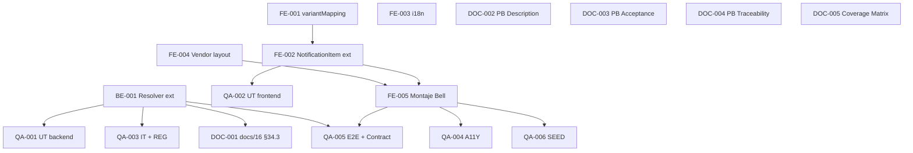

# Development Tasks — PB-P2-009 / US-073: Bandeja unificada de notificaciones vendor

## 1. Metadata

| Field                                | Value                                                                                                |
| ------------------------------------ | ---------------------------------------------------------------------------------------------------- |
| User Story ID                        | US-073                                                                                                |
| Source User Story                    | `management/user-stories/US-073-vendor-quote-rejected-notification-surface.md`                        |
| Source Technical Specification       | `management/technical-specs/P2/PB-P2-009/US-073-technical-spec.md`                                    |
| Decision Resolution Artifact         | `management/user-stories/decision-resolutions/US-073-decision-resolution.md`                          |
| Priority                             | P2 (Must Have — Decisión PO 8.1 #13)                                                                  |
| Backlog ID                           | PB-P2-009                                                                                             |
| Backlog Title                        | Bandeja unificada vendor                                                                               |
| Backlog Execution Order              | 9 (noveno ítem de P2)                                                                                 |
| User Story Position in Backlog Item  | 1 de 1                                                                                                |
| Related User Stories in Backlog Item | US-073                                                                                                |
| Epic                                 | EPIC-NOT-001                                                                                          |
| Backlog Item Dependencies            | US-054 (aprobada), US-068, US-070 (Ready for Sprint Planning), US-071 (aprobada), US-072 (aprobada)   |
| Feature                              | Bandeja unificada de notificaciones vendor con destacado visual por tipo                               |
| Module / Domain                      | Notifications                                                                                         |
| Backlog Alignment Status             | Found                                                                                                 |
| Task Breakdown Status                | Ready for Sprint Planning                                                                             |
| Created Date                         | 2026-07-07                                                                                            |
| Last Updated                         | 2026-07-07                                                                                            |

---

## 2. Source Validation

| Source                       | Found | Used | Notes                            |
| ---------------------------- | ----- | ---- | -------------------------------- |
| User Story                   | Yes   | Yes  | `Approved with Minor Notes`.      |
| Technical Specification      | Yes   | Yes  | `Ready for Task Breakdown`.       |
| Decision Resolution Artifact | Yes   | Yes  | D1..D6 formalizadas.              |
| Product Backlog Prioritized  | Yes   | Yes  | PB-P2-009, posición 1 de 1.       |
| ADRs                         | No    | No   | Sin ADR ad-hoc.                   |

---

## 3. Backlog Execution Context

### Parent Backlog Item

**PB-P2-009 — Bandeja unificada vendor** (con D1 D1 amplía el alcance original de "Surface US-054"). Depende de US-054 (upstream), US-071 (patrón), US-072 (mutations). Cierra el gap identificado en US-068 D4 y US-070 D4.

### Execution Order Rationale

Se implementa después de US-071 aprobada (patrón), US-072 aprobada (mutations) y US-054 aprobada (upstream). Puede ir en paralelo con US-068/US-070 (Ready for Sprint Planning).

### Related User Stories in Same Backlog Item

| User Story | Role in Backlog Item                                                          | Suggested Order |
| ---------- | ----------------------------------------------------------------------------- | --------------- |
| US-073     | Bandeja unificada vendor con reuso máximo del patrón US-071 y componentes US-072 | 1               |

---

## 4. Task Breakdown Summary

| Area                         | Number of Tasks | Notes                                                                    |
| ---------------------------- | --------------: | ------------------------------------------------------------------------ |
| Backend                      |               1 | Extensión del `NotificationLinkResolver` con 2 estrategias.               |
| Frontend                     |               5 | variant mapping + `NotificationItem` ext + i18n + vendor layout + montaje. |
| API Contract                 |               0 | Reuso canonical.                                                          |
| Database / Prisma            |               0 | Sin migración.                                                            |
| AI / PromptOps               |               0 | No aplica.                                                                |
| Security / Authorization     |               0 | Reuso 1:1 US-071/US-072.                                                  |
| QA / Testing                 |               6 | UT backend + UT frontend + IT/REG backend + A11Y + E2E + SEED.            |
| Seed / Demo Data             |               0 | Reuso; verificación en QA.                                                |
| DevOps / Environment         |               0 | No aplica.                                                                |
| Observability / Audit        |               0 | Reuso.                                                                     |
| Documentation / Traceability |               5 | 5 ítems Documentation Alignment.                                          |
| **Total**                    |          **17** |                                                                          |

---

## 5. Traceability Matrix

| Acceptance Criterion              | Technical Spec Section                             | Task IDs                                                                                              |
| --------------------------------- | -------------------------------------------------- | ----------------------------------------------------------------------------------------------------- |
| AC-01 — Bandeja unificada         | §8 Frontend Design                                   | TASK-PB-P2-009-US-073-FE-005, QA-002, QA-005                                                          |
| AC-02 — Deep link por tipo        | §7 Backend Design                                    | TASK-PB-P2-009-US-073-BE-001, QA-001, QA-003, QA-005                                                    |
| AC-03..AC-05                      | Heredados US-071                                    | QA-003 (regresión)                                                                                     |
| AC-06 — Empty/Loading/Error       | Heredados US-071                                    | QA-005                                                                                                 |
| AC-07 — A11Y del dropdown         | §8 Frontend Design (D4)                              | TASK-PB-P2-009-US-073-FE-001, FE-002, QA-004                                                            |
| AC-08 — i18n                      | §8 Frontend Design                                    | TASK-PB-P2-009-US-073-FE-003, QA-004                                                                    |
| AC-09 — Performance               | Heredado US-071                                     | QA-003                                                                                                 |
| Vendor layout                     | §8 Frontend Design (D6)                              | TASK-PB-P2-009-US-073-FE-004, FE-005                                                                    |
| Cierre gap US-068 D4 / US-070 D4  | §3 Executive Summary (D1)                            | TASK-PB-P2-009-US-073-FE-005 + QA-006 (SEED)                                                            |

---

## 6. Development Tasks

### TASK-PB-P2-009-US-073-BE-001 — Extender `NotificationLinkResolver` con `quote_rejected` + `quote_expired`

| Field                     | Value                                                                     |
| ------------------------- | ------------------------------------------------------------------------- |
| Area                      | Backend                                                                   |
| Type                      | Implementation                                                            |
| Priority                  | Must                                                                      |
| Estimate                  | XS                                                                        |
| Depends On                | —                                                                         |
| Source AC(s)              | AC-02                                                                     |
| Technical Spec Section(s) | §7 Backend Design (services), §17 Risks (retrocompatibilidad)              |
| Backlog ID                | PB-P2-009                                                                 |
| User Story ID             | US-073                                                                    |
| Owner Role                | Backend                                                                   |
| Status                    | To Do                                                                     |

#### Objective

Agregar 2 filas a `LINK_STRATEGY_BY_TYPE`:

* `quote_rejected` → `/vendor/quotes/{payload.quoteId}`.
* `quote_expired` → `/vendor/quotes/{payload.quoteId}`.

Ambas retornan `null` si `payload.quoteId` es inválido o ausente. La firma con `{recipientRole}` opcional (US-070 D3) se ignora para estos types.

#### Definition of Done

- [ ] 2 estrategias agregadas.
- [ ] UT-01, UT-02, UT-03 verdes.
- [ ] Regresión sobre callers existentes verde (via QA-003).
- [ ] Lint, type-check pasan.

---

### TASK-PB-P2-009-US-073-FE-001 — Crear `variantMapping.ts` (`TYPE_TO_VARIANT` + `getVariantForType`)

| Field                     | Value                                                                     |
| ------------------------- | ------------------------------------------------------------------------- |
| Area                      | Frontend                                                                  |
| Type                      | Implementation                                                            |
| Priority                  | Must                                                                      |
| Estimate                  | XS                                                                        |
| Depends On                | —                                                                         |
| Source AC(s)              | AC-01, AC-07                                                              |
| Technical Spec Section(s) | §8 Frontend Design (Components, D4)                                        |
| Backlog ID                | PB-P2-009                                                                 |
| User Story ID             | US-073                                                                    |
| Owner Role                | Frontend                                                                  |
| Status                    | To Do                                                                     |

#### Objective

Crear módulo `variantMapping.ts` con la tabla `TYPE_TO_VARIANT` (D4) y la función helper `getVariantForType(type)` con fallback `'neutral'` para types desconocidos.

#### Definition of Done

- [ ] Módulo exportado con tabla + helper.
- [ ] UT-04, UT-05 verdes (via QA-002).
- [ ] Lint, type-check pasan.

---

### TASK-PB-P2-009-US-073-FE-002 — Extender `NotificationItem` con prop `variant`

| Field                     | Value                                                                     |
| ------------------------- | ------------------------------------------------------------------------- |
| Area                      | Frontend                                                                  |
| Type                      | Implementation                                                            |
| Priority                  | Must                                                                      |
| Estimate                  | S                                                                         |
| Depends On                | TASK-PB-P2-009-US-073-FE-001                                              |
| Source AC(s)              | AC-01, AC-07                                                              |
| Technical Spec Section(s) | §8 Frontend Design (Components, D4), NFR-A11Y-005                          |
| Backlog ID                | PB-P2-009                                                                 |
| User Story ID             | US-073                                                                    |
| Owner Role                | Frontend                                                                  |
| Status                    | To Do                                                                    |

#### Objective

Extender `NotificationItem` (US-071) con prop opcional `variant`. Si no se provee, derivar de `getVariantForType(notification.type)`. Renderizar color de fondo/borde según design tokens + icono acompañante + texto complementario. `aria-label` combinado con locale. Backward compatible con callers de US-071.

#### Scope

##### Include

* Prop `variant` opcional.
* Renderizado combinado color + icono + texto (D4, NFR-A11Y-005).
* `aria-label` localizado por variant.

##### Exclude

* Cambios a callers existentes de `NotificationItem` (backward compatible).

#### Definition of Done

- [ ] Componente extendido sin romper US-071.
- [ ] UT-06 verde (via QA-002).
- [ ] Snapshot visual por variant.
- [ ] Axe sin violaciones críticas (via QA-004).
- [ ] Lint, type-check pasan.

---

### TASK-PB-P2-009-US-073-FE-003 — Extender i18n con `variants.*.aria` × 4 locales

| Field                     | Value                                                                       |
| ------------------------- | --------------------------------------------------------------------------- |
| Area                      | Frontend / i18n                                                             |
| Type                      | Implementation                                                              |
| Priority                  | Must                                                                        |
| Estimate                  | XS                                                                          |
| Depends On                | TASK-PB-P2-009-US-073-FE-001                                                 |
| Source AC(s)              | AC-08                                                                        |
| Technical Spec Section(s) | §8 Frontend Design (i18n)                                                    |
| Backlog ID                | PB-P2-009                                                                   |
| User Story ID             | US-073                                                                      |
| Owner Role                | Frontend                                                                    |
| Status                    | To Do                                                                       |

#### Objective

Agregar 5 keys nuevas (`notifications.variants.<variant>.aria`) × 4 locales (`en, es-LATAM, es-ES, pt`) = 20 entradas. Preservar catálogos existentes de US-071.

#### Definition of Done

- [ ] 20 entradas nuevas en 4 catálogos.
- [ ] CI check falla si faltan.

---

### TASK-PB-P2-009-US-073-FE-004 — Verificar/crear vendor layout

| Field                     | Value                                                                    |
| ------------------------- | ------------------------------------------------------------------------ |
| Area                      | Frontend / Foundation                                                    |
| Type                      | Setup                                                                    |
| Priority                  | Must                                                                     |
| Estimate                  | S                                                                        |
| Depends On                | —                                                                        |
| Source AC(s)              | AC-01 (mount point)                                                       |
| Technical Spec Section(s) | §8 Frontend Design (Routes, D6)                                           |
| Backlog ID                | PB-P2-009                                                                |
| User Story ID             | US-073                                                                   |
| Owner Role                | Frontend / Tech Lead                                                     |
| Status                    | To Do                                                                    |

#### Objective

Verificar existencia de `apps/web/app/(authenticated)/vendor/layout.tsx`. Si NO existe, crear layout mínimo simétrico al organizer con header + slot para `NotificationsBell` + main. Ratificar path exacto durante implementación consultando `docs/15 §Client Components §Vendor Layout`.

#### Definition of Done

- [ ] Layout verificado o creado.
- [ ] Documentado en el PR el path final.

---

### TASK-PB-P2-009-US-073-FE-005 — Montar `NotificationsBell` en el vendor layout

| Field                     | Value                                                                      |
| ------------------------- | -------------------------------------------------------------------------- |
| Area                      | Frontend                                                                   |
| Type                      | Implementation                                                             |
| Priority                  | Must                                                                       |
| Estimate                  | XS                                                                         |
| Depends On                | TASK-PB-P2-009-US-073-FE-002, FE-004                                        |
| Source AC(s)              | AC-01                                                                       |
| Technical Spec Section(s) | §8 Frontend Design                                                           |
| Backlog ID                | PB-P2-009                                                                  |
| User Story ID             | US-073                                                                     |
| Owner Role                | Frontend                                                                   |
| Status                    | To Do                                                                      |

#### Objective

Reusar el `NotificationsBell` de US-071 y montarlo en el header del vendor layout (D6). No requiere props especiales; la extensión de `NotificationItem` con variant es transparente.

#### Definition of Done

- [ ] Bell visible en el header vendor.
- [ ] E2E-01 pasa (via QA-005).
- [ ] Lint, type-check pasan.

---

### TASK-PB-P2-009-US-073-QA-001 — Unit tests backend (UT-01..UT-03)

| Field                     | Value                                             |
| ------------------------- | ------------------------------------------------- |
| Area                      | QA / Testing                                      |
| Type                      | Test                                              |
| Priority                  | Must                                              |
| Estimate                  | XS                                                |
| Depends On                | TASK-PB-P2-009-US-073-BE-001                       |
| Source AC(s)              | AC-02                                              |
| Technical Spec Section(s) | §13 Testing Strategy (Unit)                        |
| Backlog ID                | PB-P2-009                                         |
| User Story ID             | US-073                                            |
| Owner Role                | QA                                                |
| Status                    | To Do                                             |

#### Objective

3 UTs cubriendo `NotificationLinkResolver` para `quote_rejected`, `quote_expired`, fallback `null`.

#### Definition of Done

- [ ] 3 UTs verdes.

---

### TASK-PB-P2-009-US-073-QA-002 — Unit tests frontend (UT-04..UT-07)

| Field                     | Value                                             |
| ------------------------- | ------------------------------------------------- |
| Area                      | QA / Testing                                      |
| Type                      | Test                                              |
| Priority                  | Must                                              |
| Estimate                  | XS                                                |
| Depends On                | TASK-PB-P2-009-US-073-FE-002                       |
| Source AC(s)              | AC-01, AC-07                                       |
| Technical Spec Section(s) | §13 Testing Strategy (Unit)                        |
| Backlog ID                | PB-P2-009                                         |
| User Story ID             | US-073                                            |
| Owner Role                | QA                                                |
| Status                    | To Do                                             |

#### Objective

4 UTs cubriendo `getVariantForType` (mapping + fallback), `NotificationItem` con variant (renderiza clase + icono + `aria-label`), item con `link=null` deshabilita CTA.

#### Definition of Done

- [ ] 4 UTs verdes.

---

### TASK-PB-P2-009-US-073-QA-003 — Regresión integración backend (IT-01..IT-02 + REG-01)

| Field                     | Value                                                                         |
| ------------------------- | ----------------------------------------------------------------------------- |
| Area                      | QA / Testing                                                                  |
| Type                      | Test                                                                          |
| Priority                  | Must                                                                          |
| Estimate                  | S                                                                             |
| Depends On                | TASK-PB-P2-009-US-073-BE-001                                                   |
| Source AC(s)              | AC-02, AC-04                                                                   |
| Technical Spec Section(s) | §13 Testing Strategy (Integration, Regression)                                  |
| Backlog ID                | PB-P2-009                                                                     |
| User Story ID             | US-073                                                                        |
| Owner Role                | QA                                                                            |
| Status                    | To Do                                                                         |

#### Objective

IT-01 (endpoint retorna links correctos para los 4 tipos vendor); IT-02 (aislamiento vendor A vs B — regresión); REG-01 (callers existentes del resolver: `task_due_soon`, `quote_request_received`, `quote_received`, `booking_confirmed` con `recipientRole`).

#### Definition of Done

- [ ] IT-01, IT-02 verdes.
- [ ] REG-01 confirma que US-068/069/070/071 no se rompen.

---

### TASK-PB-P2-009-US-073-QA-004 — A11Y tests con Axe (A11Y-01..A11Y-03 anti color-only)

| Field                     | Value                                                                  |
| ------------------------- | ---------------------------------------------------------------------- |
| Area                      | QA / Testing                                                           |
| Type                      | Test                                                                   |
| Priority                  | Must                                                                   |
| Estimate                  | S                                                                      |
| Depends On                | TASK-PB-P2-009-US-073-FE-005                                            |
| Source AC(s)              | AC-07                                                                   |
| Technical Spec Section(s) | §13 Testing Strategy (Accessibility), NFR-A11Y-005                       |
| Backlog ID                | PB-P2-009                                                              |
| User Story ID             | US-073                                                                 |
| Owner Role                | QA                                                                     |
| Status                    | To Do                                                                  |

#### Objective

A11Y-01 (dropdown vendor sin violaciones críticas), A11Y-02 (**anti color-only** — cada variant tiene icono + texto complementario visible, test con simulación grayscale), A11Y-03 (navegación teclado).

#### Definition of Done

- [ ] 3 tests A11Y verdes.
- [ ] A11Y-02 explícitamente falla si algún variant se distingue sólo por color.

---

### TASK-PB-P2-009-US-073-QA-005 — E2E Playwright (E2E-01..E2E-02) + Contract MSW

| Field                     | Value                                                                     |
| ------------------------- | ------------------------------------------------------------------------- |
| Area                      | QA / Testing                                                              |
| Type                      | Test                                                                      |
| Priority                  | Must                                                                      |
| Estimate                  | M                                                                         |
| Depends On                | TASK-PB-P2-009-US-073-FE-005, BE-001                                       |
| Source AC(s)              | AC-01, AC-02                                                               |
| Technical Spec Section(s) | §13 Testing Strategy (E2E, Contract)                                       |
| Backlog ID                | PB-P2-009                                                                 |
| User Story ID             | US-073                                                                    |
| Owner Role                | QA                                                                        |
| Status                    | To Do                                                                     |

#### Objective

E2E-01 (login vendor demo → abrir campanita → ver 4 items con variants distintos → click en `quote_rejected` → aterriza en `/vendor/quotes/{id}`); E2E-02 (click en `quote_expired` → aterriza); contract MSW verifica DTO con nuevos types.

#### Definition of Done

- [ ] 2 E2E verdes.
- [ ] Contract MSW verde.

---

### TASK-PB-P2-009-US-073-QA-006 — SEED verification (diversidad de tipos vendor)

| Field                     | Value                                                                        |
| ------------------------- | ---------------------------------------------------------------------------- |
| Area                      | QA / Testing                                                                 |
| Type                      | Test                                                                         |
| Priority                  | Should                                                                       |
| Estimate                  | XS                                                                           |
| Depends On                | TASK-PB-P2-009-US-073-FE-005                                                  |
| Source AC(s)              | AC-01 (demo readiness)                                                        |
| Technical Spec Section(s) | §15 Seed / Demo                                                                |
| Backlog ID                | PB-P2-009                                                                    |
| User Story ID             | US-073                                                                       |
| Owner Role                | QA / Backend                                                                 |
| Status                    | To Do                                                                        |

#### Objective

Verificar que tras seed, el vendor demo tiene al menos 1 notif de cada tipo relevante (`quote_rejected`, `quote_expired`, `quote_request_received`, `booking_confirmed`). Si falta, coordinar con seed team.

#### Definition of Done

- [ ] Test verde.

---

### TASK-PB-P2-009-US-073-DOC-001 — Agregar 2 filas a `docs/16 §34.3` tabla `link generation by type`

| Field                     | Value                                                                        |
| ------------------------- | ---------------------------------------------------------------------------- |
| Area                      | Documentation / Traceability                                                 |
| Type                      | Documentation                                                                |
| Priority                  | Should                                                                       |
| Estimate                  | XS                                                                           |
| Depends On                | TASK-PB-P2-009-US-073-BE-001                                                  |
| Source AC(s)              | AC-02                                                                        |
| Technical Spec Section(s) | §16 Documentation Alignment                                                    |
| Backlog ID                | PB-P2-009                                                                    |
| User Story ID             | US-073                                                                       |
| Owner Role                | Tech Lead / Documentation                                                     |
| Status                    | To Do                                                                        |

#### Objective

Ampliar la tabla `link generation by type` con `quote_rejected` y `quote_expired` → `/vendor/quotes/{quoteId}`.

#### Definition of Done

- [ ] PR mergeado.

---

### TASK-PB-P2-009-US-073-DOC-002 — Actualizar `Description` de PB-P2-009

| Field                     | Value                                                                     |
| ------------------------- | ------------------------------------------------------------------------- |
| Area                      | Documentation / Traceability                                              |
| Type                      | Documentation                                                             |
| Priority                  | Should                                                                    |
| Estimate                  | XS                                                                        |
| Depends On                | —                                                                         |
| Source AC(s)              | —                                                                         |
| Technical Spec Section(s) | §16 Documentation Alignment                                                |
| Backlog ID                | PB-P2-009                                                                 |
| User Story ID             | US-073                                                                    |
| Owner Role                | Tech Lead / Documentation                                                  |
| Status                    | To Do                                                                     |

#### Objective

Actualizar `Description` a: "Bandeja unificada del vendor con destacado visual por tipo, cubriendo `quote_rejected`, `quote_expired`, `quote_request_received`, `booking_confirmed` y futuros types del vendor".

#### Definition of Done

- [ ] PR mergeado.

---

### TASK-PB-P2-009-US-073-DOC-003 — Reformular `Acceptance Summary` de PB-P2-009

| Field                     | Value                                                                     |
| ------------------------- | ------------------------------------------------------------------------- |
| Area                      | Documentation / Traceability                                              |
| Type                      | Documentation                                                             |
| Priority                  | Should                                                                    |
| Estimate                  | XS                                                                        |
| Depends On                | —                                                                         |
| Source AC(s)              | —                                                                         |
| Technical Spec Section(s) | §16 Documentation Alignment                                                |
| Backlog ID                | PB-P2-009                                                                 |
| User Story ID             | US-073                                                                    |
| Owner Role                | Tech Lead / Documentation                                                  |
| Status                    | To Do                                                                     |

#### Objective

Reformular "Filtros por tipo" a "Destacado visual por tipo" (D3+D4).

#### Definition of Done

- [ ] PR mergeado.

---

### TASK-PB-P2-009-US-073-DOC-004 — Ampliar Traceability de PB-P2-009

| Field                     | Value                                                                     |
| ------------------------- | ------------------------------------------------------------------------- |
| Area                      | Documentation / Traceability                                              |
| Type                      | Documentation                                                             |
| Priority                  | Should                                                                    |
| Estimate                  | XS                                                                        |
| Depends On                | —                                                                         |
| Source AC(s)              | —                                                                         |
| Technical Spec Section(s) | §16 Documentation Alignment                                                |
| Backlog ID                | PB-P2-009                                                                 |
| User Story ID             | US-073                                                                    |
| Owner Role                | Tech Lead / Documentation                                                  |
| Status                    | To Do                                                                     |

#### Objective

Ampliar Traceability con `FR-QUOTE-009/010, FR-NOTIF-001/002/005, UC-NOTIF-001, UC-QUOTE-009/010, BR-NOTIF-002/005, NFR-A11Y-*, NFR-PERF-001 · Decisión PO 8.1 #13`.

#### Definition of Done

- [ ] PR mergeado.

---

### TASK-PB-P2-009-US-073-DOC-005 — Actualizar Coverage Matrix

| Field                     | Value                                                                       |
| ------------------------- | --------------------------------------------------------------------------- |
| Area                      | Documentation / Traceability                                                |
| Type                      | Documentation                                                               |
| Priority                  | Should                                                                      |
| Estimate                  | XS                                                                          |
| Depends On                | —                                                                           |
| Source AC(s)              | —                                                                           |
| Technical Spec Section(s) | §16 Documentation Alignment                                                  |
| Backlog ID                | PB-P2-009                                                                   |
| User Story ID             | US-073                                                                      |
| Owner Role                | Tech Lead / Documentation                                                    |
| Status                    | To Do                                                                       |

#### Objective

Actualizar `management/artifacts/2-User-Stories-Coverage-Matrix.md` para reflejar que US-073 es bandeja vendor unificada (no sólo rechazo/expiración), y que cierra el gap identificado en US-068 D4 y US-070 D4.

#### Definition of Done

- [ ] PR mergeado.

---

## 7. Required QA Tasks

| Task ID                             | Test Type              | Purpose                                                                        |
| ----------------------------------- | ---------------------- | ------------------------------------------------------------------------------ |
| TASK-PB-P2-009-US-073-QA-001        | Unit backend            | UT-01..UT-03 (resolver).                                                        |
| TASK-PB-P2-009-US-073-QA-002        | Unit frontend           | UT-04..UT-07 (mapping + item).                                                  |
| TASK-PB-P2-009-US-073-QA-003        | Integration + Regression | IT-01..IT-02 + REG-01 (callers existentes).                                     |
| TASK-PB-P2-009-US-073-QA-004        | A11Y                    | A11Y-01..A11Y-03 (anti color-only).                                              |
| TASK-PB-P2-009-US-073-QA-005        | E2E + Contract          | E2E-01..E2E-02 + contract MSW.                                                  |
| TASK-PB-P2-009-US-073-QA-006        | Seed / Demo             | SEED-T-01.                                                                       |

---

## 8. Required Security Tasks

`No aplica` — reuso 1:1 de US-071 (aislamiento) + US-072 (no-revelación 404). Sin nueva superficie de ataque.

---

## 9. Required Seed / Demo Tasks

`No aplica` — verificación en QA-006.

---

## 10. Observability / Audit Tasks

`No aplica` — heredado de US-071.

---

## 11. Documentation / Traceability Tasks

| Task ID                       | Document / Artifact                              | Purpose                                                             |
| ----------------------------- | ------------------------------------------------ | ------------------------------------------------------------------- |
| TASK-PB-P2-009-US-073-DOC-001 | `docs/16 §34.3` (tabla `link generation by type`) | Agregar 2 filas.                                                     |
| TASK-PB-P2-009-US-073-DOC-002 | PB-P2-009 `Description`                            | Actualizar a "Bandeja unificada".                                    |
| TASK-PB-P2-009-US-073-DOC-003 | PB-P2-009 `Acceptance Summary`                     | Reformular filtros → destacado visual.                              |
| TASK-PB-P2-009-US-073-DOC-004 | PB-P2-009 Traceability                            | Ampliar IDs canónicos.                                              |
| TASK-PB-P2-009-US-073-DOC-005 | Coverage Matrix                                    | Reflejar ampliación de alcance.                                     |

---

## 12. Dependency Graph

---

## 13. Suggested Implementation Order

### Phase 1 — Foundation

1. TASK-PB-P2-009-US-073-BE-001 — Resolver ext.
2. TASK-PB-P2-009-US-073-FE-001 — variantMapping.
3. TASK-PB-P2-009-US-073-FE-003 — i18n.
4. TASK-PB-P2-009-US-073-FE-004 — Vendor layout.

### Phase 2 — Core Implementation

5. TASK-PB-P2-009-US-073-FE-002 — NotificationItem ext.
6. TASK-PB-P2-009-US-073-FE-005 — Montaje Bell.

### Phase 3 — Validation / QA

7. TASK-PB-P2-009-US-073-QA-001 — UT backend.
8. TASK-PB-P2-009-US-073-QA-002 — UT frontend.
9. TASK-PB-P2-009-US-073-QA-003 — IT + REG (regresión callers existentes).
10. TASK-PB-P2-009-US-073-QA-004 — A11Y.
11. TASK-PB-P2-009-US-073-QA-005 — E2E + Contract.
12. TASK-PB-P2-009-US-073-QA-006 — SEED verification.

### Phase 4 — Documentation / Review

13. TASK-PB-P2-009-US-073-DOC-001..DOC-005.

---

## 14. Risks & Mitigations

| Risk                                                                                                     | Impact                              | Mitigation                                                                                                                        | Related Task     |
| -------------------------------------------------------------------------------------------------------- | ----------------------------------- | --------------------------------------------------------------------------------------------------------------------------------- | ---------------- |
| Extensión del resolver rompe callers existentes                                                          | Regresión US-068/069/070/071        | REG-01 explícito.                                                                                                                  | BE-001, QA-003   |
| Vendor layout NO existe                                                                                   | Task de foundation adicional        | FE-004 crea layout mínimo si es necesario.                                                                                        | FE-004           |
| Payload de US-054 no incluye `quoteId`                                                                    | Deep link retorna null               | Ratificar durante implementación.                                                                                                  | BE-001, QA-005   |
| Color-only signaling                                                                                     | NFR-A11Y-005 fail                    | A11Y-02 test con simulación grayscale.                                                                                              | FE-002, QA-004   |
| Variant `neutral` fallback confunde al usuario                                                           | UX pobre para types futuros          | Mapping declarativo + copy genérico localizado.                                                                                     | FE-001, FE-002   |
| Ventana 60s multi-tab                                                                                    | UX pobre                             | Heredado US-072; riesgo aceptado.                                                                                                    | —                |

---

## 15. Out of Scope Confirmation

* Filtros por tipo desde UI (Future).
* Realtime WebSocket/SSE (Future).
* Cambios al endpoint canonical.
* Cambios a las mutations de US-072.
* Nuevos hooks TanStack.
* Cambios al schema Prisma.
* Notif de otros roles (aislamiento server-side).
* Nuevas mutations en `NotificationRepository`.

---

## 16. Readiness for Sprint Planning

| Check                                      | Status |
| ------------------------------------------ | ------ |
| Product Backlog mapping found              | Pass   |
| Every AC maps to tasks                     | Pass   |
| Technical Spec used when available         | Pass   |
| QA tasks included                          | Pass   |
| Security tasks included if applicable      | N/A (reuso) |
| Seed/demo tasks included if applicable     | Pass (QA-006) |
| Observability tasks included if applicable | N/A (reuso) |
| Documentation tasks included if applicable | Pass   |
| Task dependencies clear                    | Pass   |
| Tasks small enough                         | Pass   |
| Ready for Sprint Planning                  | Yes    |

---

## 17. Final Recommendation

`Ready for Sprint Planning`

Las 17 tareas cubren AC-01..AC-09 y EC-01..EC-05, materializan D1–D6 y reutilizan al máximo el patrón US-071 y las mutations de US-072 aprobadas. Sin migración/endpoint/mutations nuevas. Alcance principalmente frontend (5 tasks) + 1 backend (resolver ext) + 6 QA (con foco en A11Y anti color-only y regresión de callers existentes) + 5 Documentation Alignment. Cierra el gap de bandeja vendor identificado en US-068 D4 y US-070 D4.

---

Development Tasks created: Yes
Path: `management/development-tasks/P2/PB-P2-009/US-073-development-tasks.md`
Status: Ready for Sprint Planning
Technical Specification used: Yes
Backlog ID: PB-P2-009
Execution Order: 9 (noveno ítem de P2)
Next step: Sprint Planning / Roadmap.

Task groups: 1 Backend (resolver ext + REG), 5 Frontend (mapping + NotificationItem ext + i18n + vendor layout + montaje Bell), 6 QA (UT × 2 + IT/REG + A11Y anti color-only + E2E + SEED), 5 Documentation Alignment.
Product Backlog mapping: Found (PB-P2-009, P2, Must Have per Decisión PO 8.1 #13, posición 1 de 1).
Decision Resolution artifact used: Yes.
Warnings: 5 Documentation Alignment Required (no bloqueantes), extensión del resolver requiere regresión explícita (QA-003 REG-01), gap de bandeja vendor de US-068 D4 y US-070 D4 CERRADO por esta US.
