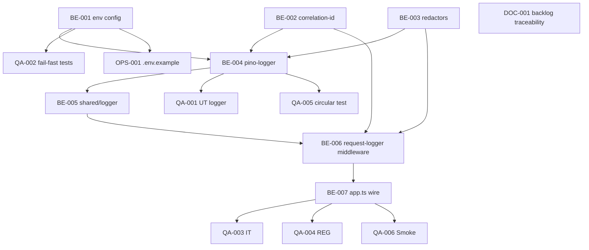

# Development Tasks — PB-P2-010 / US-113: Logger estructurado JSON con Pino

## 1. Metadata

| Field                                | Value                                                                                                |
| ------------------------------------ | ---------------------------------------------------------------------------------------------------- |
| User Story ID                        | US-113                                                                                                |
| Source User Story                    | `management/user-stories/US-113-structured-logger.md`                                                 |
| Source Technical Specification       | `management/technical-specs/P2/PB-P2-010/US-113-technical-spec.md`                                    |
| Decision Resolution Artifact         | `management/user-stories/decision-resolutions/US-113-decision-resolution.md`                          |
| Priority                             | P2 (Should Have)                                                                                      |
| Backlog ID                           | PB-P2-010                                                                                             |
| Backlog Title                        | Logger estructurado JSON                                                                               |
| Backlog Execution Order              | 10 (décimo ítem de P2)                                                                                |
| User Story Position in Backlog Item  | 1 de 1                                                                                                |
| Related User Stories in Backlog Item | US-113                                                                                                |
| Epic                                 | EPIC-OBS-001                                                                                          |
| Backlog Item Dependencies            | PB-P0-002 (backend bootstrap)                                                                         |
| Feature                              | Logger estructurado JSON con Pino, redacción de secrets/PII y correlationId end-to-end                 |
| Module / Domain                      | Platform / Observability                                                                               |
| Backlog Alignment Status             | Found                                                                                                 |
| Task Breakdown Status                | Ready for Sprint Planning                                                                             |
| Created Date                         | 2026-07-07                                                                                            |
| Last Updated                         | 2026-07-07                                                                                            |

---

## 2. Source Validation

| Source                       | Found | Used | Notes                            |
| ---------------------------- | ----- | ---- | -------------------------------- |
| User Story                   | Yes   | Yes  | `Approved`.                       |
| Technical Specification      | Yes   | Yes  | `Ready for Task Breakdown`.       |
| Decision Resolution Artifact | Yes   | Yes  | 6 Tech Recommendations D1..D6.    |
| Product Backlog Prioritized  | Yes   | Yes  | PB-P2-010, posición 1 de 1.       |
| ADRs                         | Yes   | Yes  | ADR-SEC-001, ADR-API-004, ADR-DEVOPS-001. |

---

## 3. Backlog Execution Context

### Parent Backlog Item

**PB-P2-010 — Logger estructurado JSON**. Depende de PB-P0-002 (backend bootstrap entregada). Foundation para EPIC-OBS-001.

### Execution Order Rationale

Después de PB-P0-002. Coexistencia con US-114. Downstream: US-034/068..072/115/116 consumen el singleton logger.

### Related User Stories in Same Backlog Item

| User Story | Role in Backlog Item                       | Suggested Order |
| ---------- | ------------------------------------------ | --------------- |
| US-113     | Foundation logger + redacción + AsyncLocalStorage | 1               |

---

## 4. Task Breakdown Summary

| Area                         | Number of Tasks | Notes                                                              |
| ---------------------------- | --------------: | ------------------------------------------------------------------ |
| Backend                      |               7 | env config + correlation context + redactors + pino + middleware + singleton + wiring. |
| Frontend                     |               0 | No aplica.                                                          |
| API Contract                 |               0 | No aplica.                                                          |
| Database / Prisma            |               0 | Sin migración.                                                      |
| AI / PromptOps               |               0 | No aplica.                                                          |
| Security / Authorization     |               0 | Cubierto por regresión (REG-01/REG-02).                              |
| QA / Testing                 |               6 | UT (2 tareas) + IT + REG + NT + Smoke.                              |
| Seed / Demo Data             |               0 | No aplica.                                                          |
| DevOps / Environment         |               1 | `.env.example` documentación.                                       |
| Observability / Audit        |               0 | El logger ES la observabilidad; cubierto por Smoke.                  |
| Documentation / Traceability |               1 | Ampliar Traceability PB-P2-010.                                     |
| **Total**                    |          **15** |                                                                    |

---

## 5. Traceability Matrix

| Acceptance Criterion              | Technical Spec Section                             | Task IDs                                                                                          |
| --------------------------------- | -------------------------------------------------- | ------------------------------------------------------------------------------------------------- |
| AC-01 — Formato JSON base         | §7 Backend (pino-logger)                             | TASK-PB-P2-010-US-113-BE-004, QA-001                                                              |
| AC-02 — LOG_LEVEL respetado       | §7 Backend (env + pino)                              | TASK-PB-P2-010-US-113-BE-001, BE-004, QA-001                                                       |
| AC-03 — Redacción secrets         | §7 Backend (redactors), §12 Security                 | TASK-PB-P2-010-US-113-BE-003, QA-001, QA-004                                                       |
| AC-04 — Redacción PII             | §7 Backend (redactors), §12 Security                 | TASK-PB-P2-010-US-113-BE-003, QA-001, QA-004                                                       |
| AC-05 — correlationId propagado   | §7 Backend (correlation-id + pino mixin)             | TASK-PB-P2-010-US-113-BE-002, BE-004, QA-001, QA-003                                                |
| AC-06 — Fuera de context → null   | §7 Backend (correlation-id)                           | TASK-PB-P2-010-US-113-BE-002, BE-004, QA-001                                                       |
| AC-07 — Headers redactados        | §7 Backend (redactors + middleware)                   | TASK-PB-P2-010-US-113-BE-003, BE-006, QA-001, QA-004                                                |
| AC-08 — stdout único              | §7 Backend (pino sin transports)                       | TASK-PB-P2-010-US-113-BE-004, QA-006                                                               |
| EC-01..EC-05                      | §7 Backend (env fail-fast + serializer)               | TASK-PB-P2-010-US-113-BE-001, BE-004, QA-005                                                       |
| Regresión seguridad               | §13 Testing (REG-01, REG-02)                         | TASK-PB-P2-010-US-113-QA-004                                                                       |

---

## 6. Development Tasks

### TASK-PB-P2-010-US-113-BE-001 — Extender `src/config/env.ts` con schema Zod para `LOG_*` + fail-fast

| Field                     | Value                                                              |
| ------------------------- | ------------------------------------------------------------------ |
| Area                      | Backend                                                            |
| Type                      | Implementation                                                     |
| Priority                  | Must                                                               |
| Estimate                  | S                                                                  |
| Depends On                | —                                                                  |
| Source AC(s)              | AC-02, EC-01..EC-03, VR-01..VR-04                                   |
| Technical Spec Section(s) | §7 Backend (DTOs/Schemas)                                            |
| Backlog ID                | PB-P2-010                                                          |
| User Story ID             | US-113                                                             |
| Owner Role                | Backend                                                            |
| Status                    | To Do                                                              |

#### Objective

Extender `src/config/env.ts` con Zod schema para `LOG_LEVEL, LOG_PRETTY, LOG_INCLUDE_PII, SERVICE_VERSION`. Defaults por env; guards contra `LOG_PRETTY=true` en prod y `LOG_INCLUDE_PII=true` fuera de dev. Fail-fast al boot con mensaje descriptivo. Fallback de `SERVICE_VERSION` a `package.json.version`.

#### Definition of Done

- [ ] Schema extendido.
- [ ] UT: valores válidos parsean; inválidos fail-fast.
- [ ] Lint, type-check pasan.

---

### TASK-PB-P2-010-US-113-BE-002 — Crear `src/shared/context/correlation-id.ts` con AsyncLocalStorage

| Field                     | Value                                                              |
| ------------------------- | ------------------------------------------------------------------ |
| Area                      | Backend                                                            |
| Type                      | Implementation                                                     |
| Priority                  | Must                                                               |
| Estimate                  | XS                                                                 |
| Depends On                | —                                                                  |
| Source AC(s)              | AC-05, AC-06                                                        |
| Technical Spec Section(s) | §7 Backend (correlation-id)                                          |
| Backlog ID                | PB-P2-010                                                          |
| User Story ID             | US-113                                                             |
| Owner Role                | Backend                                                            |
| Status                    | To Do                                                              |

#### Objective

Exportar `correlationContext = new AsyncLocalStorage<{ correlationId: string }>()` como singleton desde `src/shared/context/correlation-id.ts`. Helper `getCorrelationId()` que retorna `correlationContext.getStore()?.correlationId ?? null`.

#### Definition of Done

- [ ] Módulo exportado.
- [ ] UT: dentro de `run`, `getCorrelationId()` retorna el valor; fuera retorna `null`.
- [ ] Lint, type-check pasan.

---

### TASK-PB-P2-010-US-113-BE-003 — Implementar `src/infrastructure/logger/redactors.ts` (`redactSecrets`, `redactPII`, `redactHeaders`)

| Field                     | Value                                                                     |
| ------------------------- | ------------------------------------------------------------------------- |
| Area                      | Backend                                                                   |
| Type                      | Implementation                                                            |
| Priority                  | Must                                                                      |
| Estimate                  | S                                                                         |
| Depends On                | —                                                                         |
| Source AC(s)              | AC-03, AC-04, AC-07                                                        |
| Technical Spec Section(s) | §7 Backend (redactors), §12 Security                                       |
| Backlog ID                | PB-P2-010                                                                 |
| User Story ID             | US-113                                                                    |
| Owner Role                | Backend                                                                   |
| Status                    | To Do                                                                     |

#### Objective

Implementar los 3 redactores según `SECRET_KEYS` (12 campos), `PII_KEYS` (7 campos con guard de env), `HEADER_KEYS` (5 headers). Recursivos hasta MAX_DEPTH=5. Case-insensitive. Formato `[REDACTED]`.

#### Definition of Done

- [ ] 3 funciones implementadas.
- [ ] UT-03, UT-04, UT-08 verdes (via QA-001).
- [ ] Lint, type-check pasan.

---

### TASK-PB-P2-010-US-113-BE-004 — Implementar `src/infrastructure/logger/pino-logger.ts` (instancia)

| Field                     | Value                                                                                                        |
| ------------------------- | ------------------------------------------------------------------------------------------------------------ |
| Area                      | Backend                                                                                                      |
| Type                      | Implementation                                                                                               |
| Priority                  | Must                                                                                                         |
| Estimate                  | S                                                                                                            |
| Depends On                | TASK-PB-P2-010-US-113-BE-001, BE-002, BE-003                                                                 |
| Source AC(s)              | AC-01, AC-02, AC-03, AC-04, AC-05, AC-06, AC-08                                                              |
| Technical Spec Section(s) | §7 Backend (pino-logger)                                                                                     |
| Backlog ID                | PB-P2-010                                                                                                    |
| User Story ID             | US-113                                                                                                       |
| Owner Role                | Backend                                                                                                      |
| Status                    | To Do                                                                                                        |

#### Objective

Crear la instancia Pino con `level=env.LOG_LEVEL`, `messageKey='msg'`, `timestamp: isoTime`, `formatters.log` que aplica `redactSecrets` + `redactPII`, `mixin` que inyecta `service/env/version/correlationId`. `transport: pino-pretty` sólo si `env.LOG_PRETTY=true`. Sin destinos adicionales (stdout implícito).

#### Definition of Done

- [ ] Instancia creada.
- [ ] UT-01, UT-02, UT-05, UT-06, UT-07 verdes (via QA-001).
- [ ] Lint, type-check pasan.

---

### TASK-PB-P2-010-US-113-BE-005 — Exponer singleton en `src/shared/logger.ts`

| Field                     | Value                                                              |
| ------------------------- | ------------------------------------------------------------------ |
| Area                      | Backend                                                            |
| Type                      | Implementation                                                     |
| Priority                  | Must                                                               |
| Estimate                  | XS                                                                 |
| Depends On                | TASK-PB-P2-010-US-113-BE-004                                       |
| Source AC(s)              | AC-01                                                              |
| Technical Spec Section(s) | §7 Backend (shared/logger)                                          |
| Backlog ID                | PB-P2-010                                                          |
| User Story ID             | US-113                                                             |
| Owner Role                | Backend                                                            |
| Status                    | To Do                                                              |

#### Objective

Re-exportar la instancia Pino desde `src/shared/logger.ts` para consumidores.

#### Definition of Done

- [ ] Export listo.
- [ ] Lint, type-check pasan.

---

### TASK-PB-P2-010-US-113-BE-006 — Implementar `src/infrastructure/middleware/request-logger.middleware.ts`

| Field                     | Value                                                                             |
| ------------------------- | --------------------------------------------------------------------------------- |
| Area                      | Backend                                                                           |
| Type                      | Implementation                                                                    |
| Priority                  | Must                                                                              |
| Estimate                  | S                                                                                 |
| Depends On                | TASK-PB-P2-010-US-113-BE-002, BE-003, BE-005                                       |
| Source AC(s)              | AC-05, AC-07                                                                       |
| Technical Spec Section(s) | §7 Backend (middleware)                                                            |
| Backlog ID                | PB-P2-010                                                                         |
| User Story ID             | US-113                                                                            |
| Owner Role                | Backend                                                                           |
| Status                    | To Do                                                                             |

#### Objective

Middleware Express que ejecuta `correlationContext.run({ correlationId }, () => next())`. Emite log `request received` (con `req.method, url, headers redactados`) y en `res.on('finish')` emite `request completed` (`res.status, ms`).

#### Definition of Done

- [ ] Middleware implementado.
- [ ] UT/IT: log emitido con `correlationId` propagado en ambos eventos.
- [ ] Lint, type-check pasan.

---

### TASK-PB-P2-010-US-113-BE-007 — Registrar middleware en `app.ts`

| Field                     | Value                                                                                                     |
| ------------------------- | --------------------------------------------------------------------------------------------------------- |
| Area                      | Backend                                                                                                   |
| Type                      | Setup                                                                                                     |
| Priority                  | Must                                                                                                      |
| Estimate                  | XS                                                                                                        |
| Depends On                | TASK-PB-P2-010-US-113-BE-006                                                                              |
| Source AC(s)              | AC-05                                                                                                     |
| Technical Spec Section(s) | §7 Backend (Bootstrap)                                                                                    |
| Backlog ID                | PB-P2-010                                                                                                 |
| User Story ID             | US-113                                                                                                    |
| Owner Role                | Backend                                                                                                   |
| Status                    | To Do                                                                                                     |

#### Objective

Registrar `requestLogger` en `app.ts` después del correlation-id middleware (US-114 si está mergeada; sino documentar TODO) y antes de auth/role/ownership/validation/rate-limit.

#### Definition of Done

- [ ] Middleware registrado en el orden correcto.
- [ ] IT-01 verde (via QA-003).
- [ ] Sin regresión en tests existentes de PB-P0-002.
- [ ] Lint, type-check pasan.

---

### TASK-PB-P2-010-US-113-QA-001 — Unit tests (UT-01..UT-08)

| Field                     | Value                                             |
| ------------------------- | ------------------------------------------------- |
| Area                      | QA / Testing                                      |
| Type                      | Test                                              |
| Priority                  | Must                                              |
| Estimate                  | M                                                 |
| Depends On                | TASK-PB-P2-010-US-113-BE-004                       |
| Source AC(s)              | AC-01..AC-08                                       |
| Technical Spec Section(s) | §13 Testing Strategy (Unit)                        |
| Backlog ID                | PB-P2-010                                         |
| User Story ID             | US-113                                            |
| Owner Role                | QA                                                |
| Status                    | To Do                                             |

#### Objective

8 UTs cubriendo: shape JSON, LOG_LEVEL, redacción secrets, redacción PII, AsyncLocalStorage, sin context, payload circular, headers redactados. Con `pino-test` o destination custom.

#### Definition of Done

- [ ] 8 UTs verdes.

---

### TASK-PB-P2-010-US-113-QA-002 — Unit tests de env config (fail-fast)

| Field                     | Value                                             |
| ------------------------- | ------------------------------------------------- |
| Area                      | QA / Testing                                      |
| Type                      | Test                                              |
| Priority                  | Must                                              |
| Estimate                  | XS                                                |
| Depends On                | TASK-PB-P2-010-US-113-BE-001                       |
| Source AC(s)              | EC-01..EC-03, VR-01..VR-04                         |
| Technical Spec Section(s) | §13 Testing (Negative)                             |
| Backlog ID                | PB-P2-010                                         |
| User Story ID             | US-113                                            |
| Owner Role                | QA                                                |
| Status                    | To Do                                             |

#### Objective

Tests NT-01..NT-04 sobre la validación Zod del env config.

#### Definition of Done

- [ ] 4 tests verdes con mensajes esperados.

---

### TASK-PB-P2-010-US-113-QA-003 — Integration tests (IT-01, IT-02)

| Field                     | Value                                                                        |
| ------------------------- | ---------------------------------------------------------------------------- |
| Area                      | QA / Testing                                                                 |
| Type                      | Test                                                                         |
| Priority                  | Must                                                                         |
| Estimate                  | S                                                                            |
| Depends On                | TASK-PB-P2-010-US-113-BE-007                                                 |
| Source AC(s)              | AC-05, AC-06                                                                  |
| Technical Spec Section(s) | §13 Testing Strategy (Integration)                                            |
| Backlog ID                | PB-P2-010                                                                    |
| User Story ID             | US-113                                                                       |
| Owner Role                | QA                                                                           |
| Status                    | To Do                                                                        |

#### Objective

IT-01: request HTTP a `/healthz` con `X-Correlation-Id` en header → log emitido con ese valor en request received + request completed. IT-02: invocar un handler de job fuera de HTTP context → logs con `correlationId=null`.

#### Definition of Done

- [ ] IT-01, IT-02 verdes.

---

### TASK-PB-P2-010-US-113-QA-004 — Regression tests seguridad (REG-01, REG-02)

| Field                     | Value                                                                       |
| ------------------------- | --------------------------------------------------------------------------- |
| Area                      | QA / Testing                                                                |
| Type                      | Test                                                                        |
| Priority                  | Must                                                                        |
| Estimate                  | S                                                                           |
| Depends On                | TASK-PB-P2-010-US-113-BE-007                                                 |
| Source AC(s)              | AC-03, AC-04, AC-07                                                          |
| Technical Spec Section(s) | §13 Testing (Regression)                                                     |
| Backlog ID                | PB-P2-010                                                                    |
| User Story ID             | US-113                                                                      |
| Owner Role                | QA                                                                          |
| Status                    | To Do                                                                       |

#### Objective

REG-01: mock de emisión estilo US-034 (`[EMAIL] to=<userId>`) capturado en logs → verificar ausencia de `email`, `token`, `password`. REG-02: request con `Authorization: Bearer xxx` y `Cookie: session=abc` → verificar `[REDACTED]` en el log emitido.

#### Definition of Done

- [ ] REG-01, REG-02 verdes.
- [ ] Etiqueta `@security` aplicada en CI.

---

### TASK-PB-P2-010-US-113-QA-005 — Test de edge case payload circular (UT-07 + ampliación)

| Field                     | Value                                                                     |
| ------------------------- | ------------------------------------------------------------------------- |
| Area                      | QA / Testing                                                              |
| Type                      | Test                                                                      |
| Priority                  | Should                                                                    |
| Estimate                  | XS                                                                        |
| Depends On                | TASK-PB-P2-010-US-113-BE-004                                              |
| Source AC(s)              | EC-04                                                                     |
| Technical Spec Section(s) | §13 Testing                                                                |
| Backlog ID                | PB-P2-010                                                                 |
| User Story ID             | US-113                                                                    |
| Owner Role                | QA                                                                        |
| Status                    | To Do                                                                     |

#### Objective

Test: payload con referencia circular NO crashea; `context.serializationError=true` emitido.

#### Definition of Done

- [ ] Test verde.

---

### TASK-PB-P2-010-US-113-QA-006 — Smoke tests Docker (Smoke-01, Smoke-02)

| Field                     | Value                                                                       |
| ------------------------- | --------------------------------------------------------------------------- |
| Area                      | QA / Testing                                                                |
| Type                      | Test                                                                        |
| Priority                  | Must                                                                        |
| Estimate                  | S                                                                           |
| Depends On                | TASK-PB-P2-010-US-113-BE-007                                                 |
| Source AC(s)              | AC-08                                                                        |
| Technical Spec Section(s) | §13 Testing (Smoke)                                                          |
| Backlog ID                | PB-P2-010                                                                   |
| User Story ID             | US-113                                                                      |
| Owner Role                | QA / DevOps                                                                  |
| Status                    | To Do                                                                       |

#### Objective

Smoke-01: `docker run` con env prod → `docker logs | jq` retorna JSON válido con campos base. Smoke-02: `docker run` con env dev + `LOG_PRETTY=true` → salida legible.

#### Definition of Done

- [ ] Ambos smoke verdes en pipeline CI.

---

### TASK-PB-P2-010-US-113-OPS-001 — Documentar env vars en `.env.example`

| Field                     | Value                                                              |
| ------------------------- | ------------------------------------------------------------------ |
| Area                      | DevOps / Environment                                               |
| Type                      | Documentation                                                      |
| Priority                  | Should                                                             |
| Estimate                  | XS                                                                 |
| Depends On                | TASK-PB-P2-010-US-113-BE-001                                       |
| Source AC(s)              | —                                                                  |
| Technical Spec Section(s) | §18 Implementation Guidance                                         |
| Backlog ID                | PB-P2-010                                                          |
| User Story ID             | US-113                                                             |
| Owner Role                | DevOps                                                             |
| Status                    | To Do                                                              |

#### Objective

Documentar `LOG_LEVEL, LOG_PRETTY, LOG_INCLUDE_PII, SERVICE_VERSION` en `.env.example` con comentarios explicando defaults por env y restricciones (guards de prod).

#### Definition of Done

- [ ] `.env.example` actualizado.
- [ ] PR con changelog.

---

### TASK-PB-P2-010-US-113-DOC-001 — Ampliar Traceability de PB-P2-010

| Field                     | Value                                                                    |
| ------------------------- | ------------------------------------------------------------------------ |
| Area                      | Documentation / Traceability                                             |
| Type                      | Documentation                                                            |
| Priority                  | Should                                                                   |
| Estimate                  | XS                                                                       |
| Depends On                | —                                                                        |
| Source AC(s)              | —                                                                        |
| Technical Spec Section(s) | §16 Documentation Alignment                                                |
| Backlog ID                | PB-P2-010                                                                |
| User Story ID             | US-113                                                                   |
| Owner Role                | Tech Lead / Documentation                                                 |
| Status                    | To Do                                                                    |

#### Objective

Ampliar `Traceability` de PB-P2-010 con `NFR-OBS-004/005/006, NFR-PRIV-004, ADR-SEC-001, ADR-API-004, ADR-DEVOPS-001, BR-PRIVACY-008/011 · Decisión Tech Lead US-113`.

#### Definition of Done

- [ ] PR mergeado.

---

## 7. Required QA Tasks

| Task ID                             | Test Type       | Purpose                                                              |
| ----------------------------------- | --------------- | -------------------------------------------------------------------- |
| TASK-PB-P2-010-US-113-QA-001        | Unit             | UT-01..UT-08 (logger core).                                            |
| TASK-PB-P2-010-US-113-QA-002        | Unit (Negative)  | NT-01..NT-04 (fail-fast env).                                          |
| TASK-PB-P2-010-US-113-QA-003        | Integration      | IT-01, IT-02.                                                          |
| TASK-PB-P2-010-US-113-QA-004        | Regression       | REG-01 (consumers), REG-02 (headers).                                  |
| TASK-PB-P2-010-US-113-QA-005        | Unit (Edge)      | Payload circular (EC-04).                                              |
| TASK-PB-P2-010-US-113-QA-006        | Smoke            | Docker prod + dev pretty.                                              |

---

## 8. Required Security Tasks

`No aplica como task independiente` — la regresión REG-01/REG-02 (QA-004) cubre el gate de seguridad crítico. Alineado con `docs/22 §1887`.

---

## 9. Required Seed / Demo Tasks

`No aplica`.

---

## 10. Observability / Audit Tasks

`No aplica` — el logger ES la observabilidad. Cubierto por Smoke-01.

---

## 11. Documentation / Traceability Tasks

| Task ID                       | Document / Artifact                    | Purpose                                                             |
| ----------------------------- | -------------------------------------- | ------------------------------------------------------------------- |
| TASK-PB-P2-010-US-113-OPS-001 | `.env.example`                          | Documentar env vars.                                                |
| TASK-PB-P2-010-US-113-DOC-001 | PB-P2-010 Traceability                  | Ampliar IDs canónicos.                                              |

---

## 12. Dependency Graph

---

## 13. Suggested Implementation Order

### Phase 1 — Foundation

1. TASK-PB-P2-010-US-113-BE-001 — env config + Zod.
2. TASK-PB-P2-010-US-113-BE-002 — correlation-id.
3. TASK-PB-P2-010-US-113-BE-003 — redactors.
4. TASK-PB-P2-010-US-113-OPS-001 — `.env.example` (paralelo).

### Phase 2 — Core Implementation

5. TASK-PB-P2-010-US-113-BE-004 — pino-logger.
6. TASK-PB-P2-010-US-113-BE-005 — singleton export.
7. TASK-PB-P2-010-US-113-BE-006 — request-logger middleware.
8. TASK-PB-P2-010-US-113-BE-007 — wire en `app.ts`.

### Phase 3 — Validation / QA

9. TASK-PB-P2-010-US-113-QA-001 — UT logger.
10. TASK-PB-P2-010-US-113-QA-002 — UT env fail-fast.
11. TASK-PB-P2-010-US-113-QA-005 — UT circular.
12. TASK-PB-P2-010-US-113-QA-003 — IT.
13. TASK-PB-P2-010-US-113-QA-004 — REG (seguridad).
14. TASK-PB-P2-010-US-113-QA-006 — Smoke Docker.

### Phase 4 — Documentation / Review

15. TASK-PB-P2-010-US-113-DOC-001 — Traceability.

---

## 14. Risks & Mitigations

| Risk                                                             | Impact                                    | Mitigation                                                                                             | Related Task     |
| ---------------------------------------------------------------- | ----------------------------------------- | ------------------------------------------------------------------------------------------------------ | ---------------- |
| Redacción falla ante payload profundo                             | PII/secrets filtrados                     | MAX_DEPTH=5; UT-07; REG-01/REG-02.                                                                     | BE-003, QA-001, QA-004 |
| AsyncLocalStorage no propaga en callbacks async raros             | correlationId perdido                     | UT-05/UT-06 explícitos; IT-01 verifica end-to-end.                                                     | BE-002, QA-001, QA-003 |
| Docker no captura stdout correctamente                            | Logs perdidos en deploy                   | Smoke-01 en pipeline.                                                                                   | QA-006           |
| pino-pretty en bundle prod                                        | Bundle grande                              | Como devDependency; guard en config.                                                                    | BE-001, BE-004   |
| Regresión de consumidores por cambio de shape                      | Rompimiento de contract                    | Shape estable declarado en AC-01; contract test opcional.                                              | QA-004           |
| Fail-fast excesivo al boot rompe deploys                          | Downtime                                   | Mensajes claros; `.env.example` guía; tests NT-01..NT-04.                                              | BE-001, QA-002, OPS-001 |

---

## 15. Out of Scope Confirmation

* APM/ELK/distributed tracing (NFR-OBS-006).
* File transport / log rotation interna.
* Fanout multi-sink.
* Redacción configurable en runtime.
* Cambios al `NotificationLinkResolver`, use cases o schema Prisma.
* Métricas cuantitativas (Prometheus, StatsD).
* Cambios frontend.
* Generación del `X-Correlation-Id` header — alcance de US-114.

---

## 16. Readiness for Sprint Planning

| Check                                      | Status |
| ------------------------------------------ | ------ |
| Product Backlog mapping found              | Pass   |
| Every AC maps to tasks                     | Pass   |
| Technical Spec used when available         | Pass   |
| QA tasks included                          | Pass   |
| Security tasks included if applicable      | Pass (REG-01/REG-02) |
| Seed/demo tasks included if applicable     | N/A    |
| Observability tasks included if applicable | N/A (el logger es la obs) |
| Documentation tasks included if applicable | Pass   |
| Task dependencies clear                    | Pass   |
| Tasks small enough                         | Pass   |
| Ready for Sprint Planning                  | Yes    |

---

## 17. Final Recommendation

`Ready for Sprint Planning`

Las 15 tareas cubren AC-01..AC-08 y EC-01..EC-05, materializan D1–D6 con paths canónicos y coexistencia con US-114 documentada. Testing multi-capa con foco explícito en fail-fast (QA-002) y regresión de seguridad (QA-004 REG-01/REG-02) que verifica ausencia de PII/secrets en logs de consumidores existentes. Smoke tests Docker aseguran el sink stdout en producción. 1 alineación documental menor.

---

Development Tasks created: Yes
Path: `management/development-tasks/P2/PB-P2-010/US-113-development-tasks.md`
Status: Ready for Sprint Planning
Technical Specification used: Yes
Backlog ID: PB-P2-010
Execution Order: 10 (décimo ítem de P2)
Next step: Sprint Planning / Roadmap.

Task groups: 7 Backend (env + correlation + redactors + pino + singleton + middleware + wire), 6 QA (UT × 3 + IT + REG seguridad + Smoke Docker), 1 DevOps (.env.example), 1 Documentation Alignment.
Product Backlog mapping: Found (PB-P2-010, P2, posición 1 de 1).
Decision Resolution artifact used: Yes.
Warnings: 1 Documentation Alignment Required (no bloqueante). REG-01/REG-02 son el gate de seguridad crítico alineado con docs/22 §1887.
