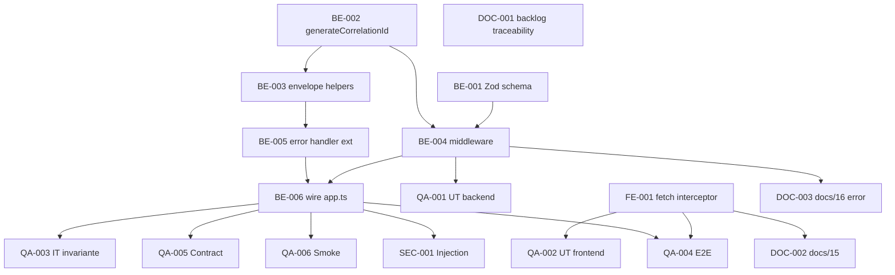

# Development Tasks — PB-P2-011 / US-114: Correlation ID propagation

## 1. Metadata

| Field                                | Value                                                                                                |
| ------------------------------------ | ---------------------------------------------------------------------------------------------------- |
| User Story ID                        | US-114                                                                                                |
| Source User Story                    | `management/user-stories/US-114-correlation-id-propagation.md`                                        |
| Source Technical Specification       | `management/technical-specs/P2/PB-P2-011/US-114-technical-spec.md`                                    |
| Decision Resolution Artifact         | `management/user-stories/decision-resolutions/US-114-decision-resolution.md`                          |
| Priority                             | P2 (Should Have)                                                                                      |
| Backlog ID                           | PB-P2-011                                                                                             |
| Backlog Title                        | Correlation IDs end-to-end                                                                             |
| Backlog Execution Order              | 11 (undécimo ítem de P2)                                                                              |
| User Story Position in Backlog Item  | 1 de 1                                                                                                |
| Related User Stories in Backlog Item | US-114                                                                                                |
| Epic                                 | EPIC-OBS-001                                                                                          |
| Backlog Item Dependencies            | PB-P2-010 (US-113 Approved)                                                                           |
| Feature                              | Correlation ID por request (X-Correlation-Id, UUID v4) end-to-end                                      |
| Module / Domain                      | Platform / Observability                                                                               |
| Backlog Alignment Status             | Found                                                                                                 |
| Task Breakdown Status                | Ready for Sprint Planning                                                                             |
| Created Date                         | 2026-07-07                                                                                            |
| Last Updated                         | 2026-07-07                                                                                            |

---

## 2. Source Validation

| Source                       | Found | Used | Notes                            |
| ---------------------------- | ----- | ---- | -------------------------------- |
| User Story                   | Yes   | Yes  | `Approved with Minor Notes`.      |
| Technical Specification      | Yes   | Yes  | `Ready for Task Breakdown`.       |
| Decision Resolution Artifact | Yes   | Yes  | 7 Tech Recommendations D1..D7.    |
| Product Backlog Prioritized  | Yes   | Yes  | PB-P2-011, posición 1 de 1.       |
| ADRs                         | Yes   | Yes  | ADR-API-004 primario + ADR-SEC-001 + ADR-DEVOPS-001. |

---

## 3. Backlog Execution Context

### Parent Backlog Item

**PB-P2-011 — Correlation IDs end-to-end**. Depende de PB-P2-010 (US-113 Approved). Materializa ADR-API-004.

### Execution Order Rationale

Se implementa simultáneamente o ANTES de US-113 para evitar ventana donde el logger emite `correlationId=null`. Downstream: US-034/115/116.

### Related User Stories in Same Backlog Item

| User Story | Role in Backlog Item                        | Suggested Order |
| ---------- | ------------------------------------------- | --------------- |
| US-114     | OWNER del middleware + envelope + fetch client | 1               |

---

## 4. Task Breakdown Summary

| Area                         | Number of Tasks | Notes                                                              |
| ---------------------------- | --------------: | ------------------------------------------------------------------ |
| Backend                      |               6 | Zod schema + helper + envelope + middleware + error handler + wire. |
| Frontend                     |               1 | Fetch interceptor.                                                  |
| API Contract                 |               0 | No aplica.                                                          |
| Database / Prisma            |               0 | Sin migración.                                                      |
| AI / PromptOps               |               0 | No aplica.                                                          |
| Security / Authorization     |               1 | SEC-T-01 injection defense.                                          |
| QA / Testing                 |               6 | UT backend + UT frontend + IT invariante + E2E + Contract + Smoke.  |
| Seed / Demo Data             |               0 | No aplica.                                                          |
| DevOps / Environment         |               0 | No aplica.                                                          |
| Observability / Audit        |               0 | El middleware ES la observabilidad.                                  |
| Documentation / Traceability |               3 | Traceability + docs/15 + docs/16 error code.                        |
| **Total**                    |          **17** |                                                                    |

---

## 5. Traceability Matrix

| Acceptance Criterion              | Technical Spec Section                             | Task IDs                                                                                          |
| --------------------------------- | -------------------------------------------------- | ------------------------------------------------------------------------------------------------- |
| AC-01 — Sin header → generar      | §7 Backend (middleware)                              | TASK-PB-P2-011-US-114-BE-004, QA-001                                                              |
| AC-02 — Con header válido → reuso | §7 Backend (middleware)                              | TASK-PB-P2-011-US-114-BE-001, BE-004, QA-001                                                       |
| AC-03 — Inválido → 400            | §7 Backend (middleware + Zod)                        | TASK-PB-P2-011-US-114-BE-001, BE-004, QA-001, SEC-001                                              |
| AC-04 — Response header echo      | §7 Backend (middleware)                              | TASK-PB-P2-011-US-114-BE-004, QA-003                                                                |
| AC-05 — Success envelope meta     | §7 Backend (respond.success)                          | TASK-PB-P2-011-US-114-BE-003, QA-003                                                                |
| AC-06 — Error envelope            | §7 Backend (respond.error + error handler)            | TASK-PB-P2-011-US-114-BE-003, BE-005, QA-003                                                        |
| AC-07 — getStore() en handlers    | §7 Backend (correlationContext.run)                   | TASK-PB-P2-011-US-114-BE-004, QA-003                                                                |
| AC-08 — Fetch interceptor         | §8 Frontend (fetch client)                            | TASK-PB-P2-011-US-114-FE-001, QA-002, QA-004                                                        |
| Invariante header==body==log     | §13 Testing (IT-01)                                  | TASK-PB-P2-011-US-114-QA-003                                                                        |
| SEC injection                     | §13 Testing (SEC-T-01)                               | TASK-PB-P2-011-US-114-SEC-001                                                                       |

---

## 6. Development Tasks

### TASK-PB-P2-011-US-114-BE-001 — Crear Zod schema UUID v4 strict

| Field                     | Value                                                              |
| ------------------------- | ------------------------------------------------------------------ |
| Area                      | Backend                                                            |
| Type                      | Implementation                                                     |
| Priority                  | Must                                                               |
| Estimate                  | XS                                                                 |
| Depends On                | —                                                                  |
| Source AC(s)              | AC-02, AC-03                                                        |
| Technical Spec Section(s) | §7 Backend (DTOs/Schemas)                                            |
| Backlog ID                | PB-P2-011                                                          |
| User Story ID             | US-114                                                             |
| Owner Role                | Backend                                                            |
| Status                    | To Do                                                              |

#### Objective

Crear `src/shared/validation/correlation-id.schema.ts` con Zod schema para UUID v4 case-insensitive strict (regex explícito con `4` en posición 15 y `[89ab]` en posición 20).

#### Definition of Done

- [ ] Schema exportado.
- [ ] UT: v4 válido pasa; v1 rechaza; garbage rechaza; case-insensitive OK.
- [ ] Lint, type-check pasan.

---

### TASK-PB-P2-011-US-114-BE-002 — Extender `src/shared/context/correlation-id.ts` con `generateCorrelationId`

| Field                     | Value                                                              |
| ------------------------- | ------------------------------------------------------------------ |
| Area                      | Backend                                                            |
| Type                      | Implementation                                                     |
| Priority                  | Must                                                               |
| Estimate                  | XS                                                                 |
| Depends On                | —                                                                  |
| Source AC(s)              | —                                                                  |
| Technical Spec Section(s) | §7 Backend (correlation-id helpers, D7)                              |
| Backlog ID                | PB-P2-011                                                          |
| User Story ID             | US-114                                                             |
| Owner Role                | Backend                                                            |
| Status                    | To Do                                                              |

#### Objective

Agregar `generateCorrelationId(prefix?: string): string` al módulo compartido con US-113. Con prefijo: `<prefix>-<uuid>`; sin prefijo: solo UUID.

#### Definition of Done

- [ ] Helper exportado.
- [ ] UT-06 verde (via QA-001).
- [ ] Backward-compatible con US-113 (no modifica `correlationContext` singleton).

---

### TASK-PB-P2-011-US-114-BE-003 — Implementar `src/shared/http/response.ts` (`respond.success`, `respond.error`)

| Field                     | Value                                                                     |
| ------------------------- | ------------------------------------------------------------------------- |
| Area                      | Backend                                                                   |
| Type                      | Implementation                                                            |
| Priority                  | Must                                                                      |
| Estimate                  | S                                                                         |
| Depends On                | TASK-PB-P2-011-US-114-BE-002                                              |
| Source AC(s)              | AC-05, AC-06                                                              |
| Technical Spec Section(s) | §7 Backend (envelope helpers, D4)                                          |
| Backlog ID                | PB-P2-011                                                                 |
| User Story ID             | US-114                                                                    |
| Owner Role                | Backend                                                                   |
| Status                    | To Do                                                                     |

#### Objective

Extender `src/shared/http/response.ts` (si existe en PB-P0-002) o crearlo. Implementar `respond.success` y `respond.error` que leen `getCorrelationId()` del contexto e inyectan `meta.correlationId` / `error.correlationId` per `docs/16 §envelope`.

Nota Tech Lead: verificar durante implementación si el helper YA existe en PB-P0-002 base y ratificar path exacto.

#### Definition of Done

- [ ] Helpers implementados.
- [ ] UT del helper con mock del contexto.
- [ ] Lint, type-check pasan.

---

### TASK-PB-P2-011-US-114-BE-004 — Implementar `correlation-id.middleware.ts`

| Field                     | Value                                                                                     |
| ------------------------- | ----------------------------------------------------------------------------------------- |
| Area                      | Backend                                                                                   |
| Type                      | Implementation                                                                            |
| Priority                  | Must                                                                                      |
| Estimate                  | S                                                                                         |
| Depends On                | TASK-PB-P2-011-US-114-BE-001, BE-002                                                       |
| Source AC(s)              | AC-01, AC-02, AC-03, AC-04, AC-07                                                          |
| Technical Spec Section(s) | §7 Backend (middleware, D1, D2, D3, D5)                                                    |
| Backlog ID                | PB-P2-011                                                                                 |
| User Story ID             | US-114                                                                                    |
| Owner Role                | Backend                                                                                   |
| Status                    | To Do                                                                                     |

#### Objective

Crear `src/infrastructure/middleware/correlation-id.middleware.ts` según §7 del Tech Spec: read-or-generate, validación Zod, response header echo, `correlationContext.run(...)`. 400 con envelope propio si header inválido.

#### Definition of Done

- [ ] Middleware implementado.
- [ ] UT-01..UT-05 verdes (via QA-001).
- [ ] Lint, type-check pasan.

---

### TASK-PB-P2-011-US-114-BE-005 — Extender `error.handler.middleware.ts` para leer contexto

| Field                     | Value                                                                    |
| ------------------------- | ------------------------------------------------------------------------ |
| Area                      | Backend                                                                  |
| Type                      | Implementation                                                           |
| Priority                  | Must                                                                     |
| Estimate                  | XS                                                                       |
| Depends On                | TASK-PB-P2-011-US-114-BE-002, BE-003                                      |
| Source AC(s)              | AC-06                                                                     |
| Technical Spec Section(s) | §7 Backend (error handler integration)                                    |
| Backlog ID                | PB-P2-011                                                                |
| User Story ID             | US-114                                                                   |
| Owner Role                | Backend                                                                  |
| Status                    | To Do                                                                    |

#### Objective

Extender el error handler existente (creado por PB-P0-002) para leer `getCorrelationId()` e inyectar `error.correlationId` en el envelope. Si el error handler no existe, crearlo con requisitos mínimos.

#### Definition of Done

- [ ] Error handler emite `error.correlationId`.
- [ ] Sin regresión en tests existentes de PB-P0-002.
- [ ] Lint, type-check pasan.

---

### TASK-PB-P2-011-US-114-BE-006 — Wire `correlationIdMiddleware` en `app.ts`

| Field                     | Value                                                                     |
| ------------------------- | ------------------------------------------------------------------------- |
| Area                      | Backend                                                                   |
| Type                      | Setup                                                                     |
| Priority                  | Must                                                                      |
| Estimate                  | XS                                                                        |
| Depends On                | TASK-PB-P2-011-US-114-BE-004, BE-005                                       |
| Source AC(s)              | AC-01..AC-07                                                               |
| Technical Spec Section(s) | §7 Backend (Bootstrap)                                                     |
| Backlog ID                | PB-P2-011                                                                 |
| User Story ID             | US-114                                                                    |
| Owner Role                | Backend                                                                   |
| Status                    | To Do                                                                     |

#### Objective

Registrar `correlationIdMiddleware` en `app.ts` como PRIMER middleware personalizado (antes que `requestLogger` de US-113). Documentar comentario del orden.

#### Definition of Done

- [ ] Middleware registrado en el orden correcto.
- [ ] Comentario documenta orden.
- [ ] IT-01 verde (via QA-003).
- [ ] Sin regresión en tests existentes de PB-P0-002.
- [ ] Lint, type-check pasan.

---

### TASK-PB-P2-011-US-114-FE-001 — Fetch interceptor global en `apps/web/lib/api/client.ts`

| Field                     | Value                                                                    |
| ------------------------- | ------------------------------------------------------------------------ |
| Area                      | Frontend                                                                 |
| Type                      | Implementation                                                           |
| Priority                  | Must                                                                     |
| Estimate                  | S                                                                        |
| Depends On                | —                                                                        |
| Source AC(s)              | AC-08                                                                     |
| Technical Spec Section(s) | §8 Frontend (D6)                                                          |
| Backlog ID                | PB-P2-011                                                                |
| User Story ID             | US-114                                                                   |
| Owner Role                | Frontend / Tech Lead                                                      |
| Status                    | To Do                                                                    |

#### Objective

Ratificar path exacto (`apps/web/lib/api/client.ts` o convención existente) y librería base (`fetch` nativo vs `ky`) consultando `docs/15 §Frontend Architecture` y convención existente en `apps/web/lib/api/`. Implementar interceptor global que adjunta `X-Correlation-Id: crypto.randomUUID()` por outbound request.

#### Definition of Done

- [ ] Path y librería ratificados.
- [ ] Interceptor implementado.
- [ ] UT-07, UT-08 verdes (via QA-002).
- [ ] Lint, type-check pasan.

---

### TASK-PB-P2-011-US-114-SEC-001 — Injection defense test (SEC-T-01)

| Field                     | Value                                                                     |
| ------------------------- | ------------------------------------------------------------------------- |
| Area                      | Security / Authorization                                                  |
| Type                      | Test                                                                      |
| Priority                  | Must                                                                      |
| Estimate                  | XS                                                                        |
| Depends On                | TASK-PB-P2-011-US-114-BE-006                                              |
| Source AC(s)              | AC-03                                                                     |
| Technical Spec Section(s) | §13 Testing (Security)                                                     |
| Backlog ID                | PB-P2-011                                                                 |
| User Story ID             | US-114                                                                    |
| Owner Role                | QA                                                                        |
| Status                    | To Do                                                                     |

#### Objective

Test que envía header `X-Correlation-Id` con payloads de injection (``, `'; DROP TABLE users; --`, `../../etc/passwd`, `\x00null`) y verifica 400 con `error.correlationId` server-generated. Etiqueta `@security`.

#### Definition of Done

- [ ] Test verde.
- [ ] Ninguna request maliciosa llega a los handlers.

---

### TASK-PB-P2-011-US-114-QA-001 — Unit tests backend (UT-01..UT-06)

| Field                     | Value                                             |
| ------------------------- | ------------------------------------------------- |
| Area                      | QA / Testing                                      |
| Type                      | Test                                              |
| Priority                  | Must                                              |
| Estimate                  | S                                                 |
| Depends On                | TASK-PB-P2-011-US-114-BE-004                       |
| Source AC(s)              | AC-01..AC-03                                       |
| Technical Spec Section(s) | §13 Testing (Unit)                                 |
| Backlog ID                | PB-P2-011                                         |
| User Story ID             | US-114                                            |
| Owner Role                | QA                                                |
| Status                    | To Do                                             |

#### Objective

6 UTs cubriendo middleware behavior (generate, reuse, invalid → 400, empty, v1 rejection) + `generateCorrelationId` helper.

#### Definition of Done

- [ ] 6 UTs verdes.

---

### TASK-PB-P2-011-US-114-QA-002 — Unit tests frontend (UT-07, UT-08)

| Field                     | Value                                             |
| ------------------------- | ------------------------------------------------- |
| Area                      | QA / Testing                                      |
| Type                      | Test                                              |
| Priority                  | Must                                              |
| Estimate                  | XS                                                |
| Depends On                | TASK-PB-P2-011-US-114-FE-001                       |
| Source AC(s)              | AC-08                                              |
| Technical Spec Section(s) | §13 Testing (Unit Frontend)                        |
| Backlog ID                | PB-P2-011                                         |
| User Story ID             | US-114                                            |
| Owner Role                | QA                                                |
| Status                    | To Do                                             |

#### Objective

2 UTs frontend con Vitest + MSW: interceptor adjunta `X-Correlation-Id` UUID v4 válido en headers; cliente puede leer `X-Correlation-Id` del response.

#### Definition of Done

- [ ] 2 UTs verdes.

---

### TASK-PB-P2-011-US-114-QA-003 — Integration tests (IT-01, IT-02, IT-03) — invariante crítico

| Field                     | Value                                                                        |
| ------------------------- | ---------------------------------------------------------------------------- |
| Area                      | QA / Testing                                                                 |
| Type                      | Test                                                                         |
| Priority                  | Must                                                                         |
| Estimate                  | M                                                                            |
| Depends On                | TASK-PB-P2-011-US-114-BE-006                                                 |
| Source AC(s)              | AC-04..AC-07                                                                  |
| Technical Spec Section(s) | §13 Testing (Integration, invariante)                                         |
| Backlog ID                | PB-P2-011                                                                    |
| User Story ID             | US-114                                                                       |
| Owner Role                | QA                                                                           |
| Status                    | To Do                                                                        |

#### Objective

IT-01: **invariante crítico** — request real → response header == body `meta.correlationId` == log emitido por US-113. IT-02: header inválido → 400 con `error.correlationId` distinto del inválido del cliente. IT-03: 10 requests concurrentes → cada uno tiene su propio ID sin cross-contamination.

#### Definition of Done

- [ ] 3 ITs verdes.
- [ ] IT-01 etiquetado como `@critical` en CI.

---

### TASK-PB-P2-011-US-114-QA-004 — E2E Playwright (E2E-01)

| Field                     | Value                                                                     |
| ------------------------- | ------------------------------------------------------------------------- |
| Area                      | QA / Testing                                                              |
| Type                      | Test                                                                      |
| Priority                  | Must                                                                      |
| Estimate                  | S                                                                         |
| Depends On                | TASK-PB-P2-011-US-114-FE-001, BE-006                                       |
| Source AC(s)              | AC-08                                                                     |
| Technical Spec Section(s) | §13 Testing (E2E)                                                          |
| Backlog ID                | PB-P2-011                                                                 |
| User Story ID             | US-114                                                                    |
| Owner Role                | QA                                                                        |
| Status                    | To Do                                                                     |

#### Objective

E2E-01: usuario ejecuta acción → fetch outbound genera UUID v4 → backend recibe → response echoed → verificar en network tab que request/response tienen el mismo `X-Correlation-Id`.

#### Definition of Done

- [ ] E2E verde.

---

### TASK-PB-P2-011-US-114-QA-005 — Contract test MSW

| Field                     | Value                                                                     |
| ------------------------- | ------------------------------------------------------------------------- |
| Area                      | QA / Testing                                                              |
| Type                      | Test                                                                      |
| Priority                  | Must                                                                      |
| Estimate                  | XS                                                                        |
| Depends On                | TASK-PB-P2-011-US-114-BE-006                                              |
| Source AC(s)              | AC-04..AC-06                                                              |
| Technical Spec Section(s) | §13 Testing (Contract)                                                     |
| Backlog ID                | PB-P2-011                                                                 |
| User Story ID             | US-114                                                                    |
| Owner Role                | QA                                                                        |
| Status                    | To Do                                                                     |

#### Objective

Contract MSW verifica que fixtures de respuestas success incluyen `meta.correlationId` y de error incluyen `error.correlationId`.

#### Definition of Done

- [ ] Contract verde.

---

### TASK-PB-P2-011-US-114-QA-006 — Smoke tests curl (Smoke-01..Smoke-03)

| Field                     | Value                                                                     |
| ------------------------- | ------------------------------------------------------------------------- |
| Area                      | QA / Testing                                                              |
| Type                      | Test                                                                      |
| Priority                  | Must                                                                      |
| Estimate                  | S                                                                         |
| Depends On                | TASK-PB-P2-011-US-114-BE-006                                              |
| Source AC(s)              | AC-01, AC-02, AC-03, AC-04                                                 |
| Technical Spec Section(s) | §13 Testing (Smoke)                                                        |
| Backlog ID                | PB-P2-011                                                                 |
| User Story ID             | US-114                                                                    |
| Owner Role                | QA / DevOps                                                                |
| Status                    | To Do                                                                     |

#### Objective

Smoke-01: `curl -H "X-Correlation-Id: <valid-uuid>" .../healthz` → response header + body con mismo ID. Smoke-02: sin header → response con UUID v4 nuevo. Smoke-03: header garbage → 400 con `error.correlationId` server-generated.

#### Definition of Done

- [ ] 3 smoke tests verdes en pipeline CI.

---

### TASK-PB-P2-011-US-114-DOC-001 — Ampliar Traceability de PB-P2-011

| Field                     | Value                                                                    |
| ------------------------- | ------------------------------------------------------------------------ |
| Area                      | Documentation / Traceability                                             |
| Type                      | Documentation                                                            |
| Priority                  | Should                                                                   |
| Estimate                  | XS                                                                       |
| Depends On                | —                                                                        |
| Source AC(s)              | —                                                                        |
| Technical Spec Section(s) | §16 Documentation Alignment                                                |
| Backlog ID                | PB-P2-011                                                                |
| User Story ID             | US-114                                                                   |
| Owner Role                | Tech Lead / Documentation                                                 |
| Status                    | To Do                                                                    |

#### Objective

Ampliar `Traceability` de PB-P2-011 con `ADR-API-004` primario + `NFR-OBS-006` + `ADR-SEC-001, ADR-DEVOPS-001 · Decisión Tech Lead US-114`.

#### Definition of Done

- [ ] PR mergeado.

---

### TASK-PB-P2-011-US-114-DOC-002 — Agregar sección "Correlation ID Propagation" en `docs/15`

| Field                     | Value                                                                      |
| ------------------------- | -------------------------------------------------------------------------- |
| Area                      | Documentation / Traceability                                               |
| Type                      | Documentation                                                              |
| Priority                  | Could                                                                      |
| Estimate                  | XS                                                                         |
| Depends On                | TASK-PB-P2-011-US-114-FE-001                                                |
| Source AC(s)              | AC-08                                                                       |
| Technical Spec Section(s) | §16 Documentation Alignment                                                  |
| Backlog ID                | PB-P2-011                                                                  |
| User Story ID             | US-114                                                                     |
| Owner Role                | Frontend / Documentation                                                    |
| Status                    | To Do                                                                      |

#### Objective

Si `docs/15 §Frontend Architecture` no menciona el fetch interceptor, agregar sección "Correlation ID Propagation" documentando el path del cliente y la política MVP (request-scoped, sin session).

#### Definition of Done

- [ ] Verificado en `docs/15`; si aplica, PR mergeado.

---

### TASK-PB-P2-011-US-114-DOC-003 — Agregar código de error `INVALID_CORRELATION_ID` en `docs/16`

| Field                     | Value                                                                    |
| ------------------------- | ------------------------------------------------------------------------ |
| Area                      | Documentation / Traceability                                             |
| Type                      | Documentation                                                            |
| Priority                  | Should                                                                   |
| Estimate                  | XS                                                                       |
| Depends On                | TASK-PB-P2-011-US-114-BE-004                                              |
| Source AC(s)              | AC-03                                                                     |
| Technical Spec Section(s) | §16 Documentation Alignment                                                |
| Backlog ID                | PB-P2-011                                                                |
| User Story ID             | US-114                                                                   |
| Owner Role                | Tech Lead / Documentation                                                 |
| Status                    | To Do                                                                    |

#### Objective

Agregar entrada en la sección de "errores comunes" de `docs/16` para `INVALID_CORRELATION_ID` con code + status 400 + descripción.

#### Definition of Done

- [ ] PR mergeado.

---

## 7. Required QA Tasks

| Task ID                             | Test Type       | Purpose                                                              |
| ----------------------------------- | --------------- | -------------------------------------------------------------------- |
| TASK-PB-P2-011-US-114-QA-001        | Unit backend     | UT-01..UT-06.                                                         |
| TASK-PB-P2-011-US-114-QA-002        | Unit frontend    | UT-07, UT-08.                                                         |
| TASK-PB-P2-011-US-114-QA-003        | Integration       | IT-01 (invariante crítico), IT-02, IT-03.                             |
| TASK-PB-P2-011-US-114-QA-004        | E2E              | E2E-01 (frontend → backend).                                          |
| TASK-PB-P2-011-US-114-QA-005        | Contract         | MSW contract test envelope.                                            |
| TASK-PB-P2-011-US-114-QA-006        | Smoke Docker     | 3 curl smoke tests.                                                    |

---

## 8. Required Security Tasks

| Task ID                       | Security Concern | Purpose                                                    |
| ----------------------------- | ---------------- | ---------------------------------------------------------- |
| TASK-PB-P2-011-US-114-SEC-001 | Injection defense | Payloads maliciosos en header → 400 antes de handlers.     |

---

## 9. Required Seed / Demo Tasks

`No aplica`.

---

## 10. Observability / Audit Tasks

`No aplica` — el middleware ES la observabilidad; cubierto por IT-01.

---

## 11. Documentation / Traceability Tasks

| Task ID                       | Document / Artifact                | Purpose                                                             |
| ----------------------------- | ---------------------------------- | ------------------------------------------------------------------- |
| TASK-PB-P2-011-US-114-DOC-001 | PB-P2-011 Traceability              | Ampliar IDs canónicos.                                              |
| TASK-PB-P2-011-US-114-DOC-002 | `docs/15 §Frontend`                | Agregar sección "Correlation ID Propagation" (si no existe).        |
| TASK-PB-P2-011-US-114-DOC-003 | `docs/16` (errores comunes)        | Agregar `INVALID_CORRELATION_ID`.                                    |

---

## 12. Dependency Graph

---

## 13. Suggested Implementation Order

### Phase 1 — Foundation

1. TASK-PB-P2-011-US-114-BE-001 — Zod schema.
2. TASK-PB-P2-011-US-114-BE-002 — helper `generateCorrelationId`.
3. TASK-PB-P2-011-US-114-BE-003 — envelope helpers.

### Phase 2 — Core Implementation

4. TASK-PB-P2-011-US-114-BE-004 — middleware.
5. TASK-PB-P2-011-US-114-BE-005 — error handler extension.
6. TASK-PB-P2-011-US-114-BE-006 — wire en app.ts.
7. TASK-PB-P2-011-US-114-FE-001 — fetch interceptor (paralelo).

### Phase 3 — Validation / QA

8. TASK-PB-P2-011-US-114-QA-001 — UT backend.
9. TASK-PB-P2-011-US-114-QA-002 — UT frontend.
10. TASK-PB-P2-011-US-114-QA-003 — IT invariante crítico.
11. TASK-PB-P2-011-US-114-QA-005 — Contract MSW.
12. TASK-PB-P2-011-US-114-QA-004 — E2E.
13. TASK-PB-P2-011-US-114-SEC-001 — Injection defense.
14. TASK-PB-P2-011-US-114-QA-006 — Smoke curl.

### Phase 4 — Documentation

15. TASK-PB-P2-011-US-114-DOC-001 — Backlog Traceability.
16. TASK-PB-P2-011-US-114-DOC-003 — `docs/16` error code.
17. TASK-PB-P2-011-US-114-DOC-002 — `docs/15` sección (si aplica).

---

## 14. Risks & Mitigations

| Risk                                                             | Impact                                    | Mitigation                                                                                                | Related Task     |
| ---------------------------------------------------------------- | ----------------------------------------- | --------------------------------------------------------------------------------------------------------- | ---------------- |
| Wire orden incorrecto (US-114 después de US-113)                 | Logger sin ID                             | Comentario documentado en app.ts; IT-01 verifica invariante header==body==log.                            | BE-006, QA-003   |
| Zod validación excesivamente estricta (falsos positivos)         | 400 legítimos rechazados                  | UT-04 (whitespace trim), UT-05 (v1 explicit reject).                                                       | BE-001, QA-001   |
| `respond.success/error` no existe en PB-P0-002 base               | Task adicional                             | BE-003 lo crea con requisitos mínimos si no existe.                                                       | BE-003           |
| Cliente `fetch` vs `ky` sin ratificar                             | Refactor frontend                          | D6 Tech Recommendation con Tech Lead Validation; ratificar en FE-001.                                     | FE-001           |
| `crypto.randomUUID()` no disponible en browsers antiguos          | Fetch sin correlation                     | MVP scope soporta modernos; documentado en `docs/3`.                                                       | FE-001           |
| Error handler no lee del contexto                                 | `error.correlationId` null en 5xx         | BE-005 explícito.                                                                                          | BE-005           |
| Divergencia entre response header y body (bug helper)             | IT-01 rojo                                 | IT-01 crítico con etiqueta `@critical`; test explícito.                                                    | QA-003           |

---

## 15. Out of Scope Confirmation

* OpenTelemetry / distributed tracing (rechazado ADR-API-004).
* Session-scoped ID persistence.
* WebSocket correlation.
* Cambios al schema `ai_recommendations`.
* Cambios al schema Prisma.
* Cambios a middlewares upstream/downstream (auth, role, etc.).
* Cambios a UI visible.
* Nuevas dependencias externas.

---

## 16. Readiness for Sprint Planning

| Check                                      | Status |
| ------------------------------------------ | ------ |
| Product Backlog mapping found              | Pass   |
| Every AC maps to tasks                     | Pass   |
| Technical Spec used when available         | Pass   |
| QA tasks included                          | Pass   |
| Security tasks included if applicable      | Pass (SEC-001 injection defense) |
| Seed/demo tasks included if applicable     | N/A    |
| Observability tasks included if applicable | N/A (el middleware es la obs) |
| Documentation tasks included if applicable | Pass   |
| Task dependencies clear                    | Pass   |
| Tasks small enough                         | Pass   |
| Ready for Sprint Planning                  | Yes    |

---

## 17. Final Recommendation

`Ready for Sprint Planning`

Las 17 tareas cubren AC-01..AC-08 y EC-01..EC-05, materializan D1–D7 con coordinación explícita con US-113 Approved. Testing multi-capa con foco en la invariante crítica header==body==log (IT-01 etiquetado `@critical`) y defensa de injection (SEC-001). Sin migración; `ai_recommendations.correlation_id` YA existente. 3 alineaciones documentales menores no bloqueantes. Path frontend D6 requiere ratificación Tech Lead durante FE-001.

---

Development Tasks created: Yes
Path: `management/development-tasks/P2/PB-P2-011/US-114-development-tasks.md`
Status: Ready for Sprint Planning
Technical Specification used: Yes
Backlog ID: PB-P2-011
Execution Order: 11 (undécimo ítem de P2)
Next step: Sprint Planning / Roadmap.

Task groups: 6 Backend (schema + helper + envelope + middleware + error handler + wire), 1 Frontend (fetch interceptor), 6 QA (UT backend + UT frontend + IT invariante + E2E + Contract + Smoke), 1 Security (injection), 3 Documentation Alignment.
Product Backlog mapping: Found (PB-P2-011, P2, posición 1 de 1).
Decision Resolution artifact used: Yes.
Warnings: 3 Documentation Alignment Required (no bloqueantes). IT-01 es el gate crítico (invariante header==body==log). SEC-001 protege contra injection via header.
