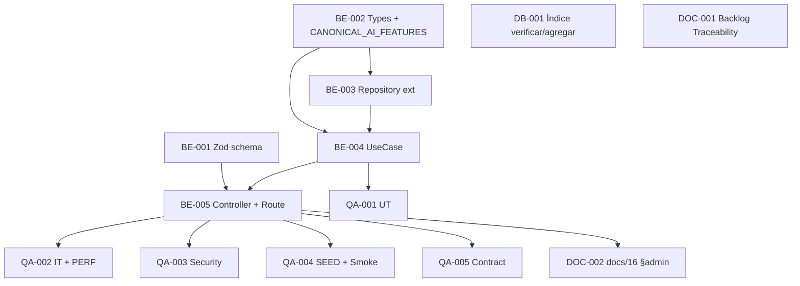

# Development Tasks — PB-P2-012 / US-115: Métricas mínimas de IA (JSON)

## 1. Metadata

| Field                                | Value                                                                                                |
| ------------------------------------ | ---------------------------------------------------------------------------------------------------- |
| User Story ID                        | US-115                                                                                                |
| Source User Story                    | `management/user-stories/US-115-ai-minimum-metrics.md`                                                |
| Source Technical Specification       | `management/technical-specs/P2/PB-P2-012/US-115-technical-spec.md`                                    |
| Decision Resolution Artifact         | `management/user-stories/decision-resolutions/US-115-decision-resolution.md`                          |
| Priority                             | P2 (Should Have)                                                                                      |
| Backlog ID                           | PB-P2-012                                                                                             |
| Backlog Title                        | Métricas mínimas de IA (JSON)                                                                          |
| Backlog Execution Order              | 12 (duodécimo ítem de P2)                                                                             |
| User Story Position in Backlog Item  | 1 de 1                                                                                                |
| Related User Stories in Backlog Item | US-115                                                                                                |
| Epic                                 | EPIC-OBS-001                                                                                          |
| Backlog Item Dependencies            | PB-P0-010 (LLMProvider entregada)                                                                    |
| Feature                              | Endpoint HTTP admin-only con métricas de IA en JSON                                                    |
| Module / Domain                      | Platform / Observability / AI (admin-governance module)                                                |
| Backlog Alignment Status             | Found                                                                                                 |
| Task Breakdown Status                | Ready for Sprint Planning                                                                             |
| Created Date                         | 2026-07-07                                                                                            |
| Last Updated                         | 2026-07-07                                                                                            |

---

## 2. Source Validation

| Source                       | Found | Used | Notes                            |
| ---------------------------- | ----- | ---- | -------------------------------- |
| User Story                   | Yes   | Yes  | `Approved with Minor Notes`.      |
| Technical Specification      | Yes   | Yes  | `Ready for Task Breakdown`.       |
| Decision Resolution Artifact | Yes   | Yes  | D0 (PO previa) + 7 Tech Recommendations D1..D7. |
| Product Backlog Prioritized  | Yes   | Yes  | PB-P2-012, posición 1 de 1.       |
| ADRs                         | No    | No   | Sin ADR ad-hoc.                   |

---

## 3. Backlog Execution Context

### Parent Backlog Item

**PB-P2-012 — Métricas mínimas de IA (JSON)**. Depende de PB-P0-010 (LLMProvider entregada). Formato JSON per Decisión PO 4.4 US-115.

### Execution Order Rationale

Después de PB-P0-010. Puede paralelizarse con US-116 (healthcheck).

### Related User Stories in Same Backlog Item

| User Story | Role in Backlog Item                                             | Suggested Order |
| ---------- | ---------------------------------------------------------------- | --------------- |
| US-115     | Endpoint admin + aggregation queries + envelope canonical         | 1               |

---

## 4. Task Breakdown Summary

| Area                         | Number of Tasks | Notes                                                              |
| ---------------------------- | --------------: | ------------------------------------------------------------------ |
| Backend                      |               5 | Schema + types + repository + use case + controller/wire.           |
| Frontend                     |               0 | No aplica.                                                          |
| API Contract                 |               0 | Documentation Alignment.                                            |
| Database / Prisma            |               1 | Índice opcional (si no existe).                                     |
| AI / PromptOps               |               0 | No aplica.                                                          |
| Security / Authorization     |               0 | Cubierto por QA (SEC-T-01/02).                                       |
| QA / Testing                 |               5 | UT + IT + Security + Smoke + SEED.                                   |
| Seed / Demo Data             |               0 | Reuso; verificación en QA.                                          |
| DevOps / Environment         |               0 | No aplica.                                                          |
| Observability / Audit        |               0 | No aplica (el endpoint es la métrica).                              |
| Documentation / Traceability |               2 | Backlog Traceability + docs/16 §admin.                              |
| **Total**                    |          **13** |                                                                    |

---

## 5. Traceability Matrix

| Acceptance Criterion              | Technical Spec Section                             | Task IDs                                                                                          |
| --------------------------------- | -------------------------------------------------- | ------------------------------------------------------------------------------------------------- |
| AC-01 — Shape canonical           | §7 Backend                                          | TASK-PB-P2-012-US-115-BE-002, BE-003, BE-004, BE-005, QA-002                                       |
| AC-02 — Query param window        | §7 Backend (Zod)                                    | TASK-PB-P2-012-US-115-BE-001, BE-005, QA-002                                                       |
| AC-03 — 401 sin sesión            | §12 Security                                        | QA-002                                                                                             |
| AC-04 — 403 sin admin             | §12 Security                                        | TASK-PB-P2-012-US-115-BE-005, QA-002                                                               |
| AC-05 — Features sin data         | §7 Backend (post-processing)                        | TASK-PB-P2-012-US-115-BE-004, QA-001, QA-002                                                       |
| AC-06 — Consistencia 24h ≤ all-time | §13 Testing                                        | TASK-PB-P2-012-US-115-QA-002                                                                       |
| AC-07 — Cálculo correcto          | §7 Backend (SQL)                                    | TASK-PB-P2-012-US-115-BE-003, BE-004, QA-001, QA-002                                                 |
| AC-08 — Performance NFR-PERF-001  | §7 Backend (índice), §10 DB                          | TASK-PB-P2-012-US-115-DB-001, QA-002                                                               |

---

## 6. Development Tasks

### TASK-PB-P2-012-US-115-BE-001 — Zod schema para query params

| Field                     | Value                                                              |
| ------------------------- | ------------------------------------------------------------------ |
| Area                      | Backend                                                            |
| Type                      | Implementation                                                     |
| Priority                  | Must                                                               |
| Estimate                  | XS                                                                 |
| Depends On                | —                                                                  |
| Source AC(s)              | AC-02                                                              |
| Technical Spec Section(s) | §7 Backend (Zod schema)                                             |
| Backlog ID                | PB-P2-012                                                          |
| User Story ID             | US-115                                                             |
| Owner Role                | Backend                                                            |
| Status                    | To Do                                                              |

#### Objective

Crear `src/shared/validation/ai-metrics.query.schema.ts` con Zod schema para `window ∈ {24h, all-time, both}` default `both`.

#### Definition of Done

- [ ] Schema exportado.
- [ ] UT del schema.

---

### TASK-PB-P2-012-US-115-BE-002 — Types + `CANONICAL_AI_FEATURES` constant

| Field                     | Value                                                              |
| ------------------------- | ------------------------------------------------------------------ |
| Area                      | Backend                                                            |
| Type                      | Implementation                                                     |
| Priority                  | Must                                                               |
| Estimate                  | XS                                                                 |
| Depends On                | —                                                                  |
| Source AC(s)              | AC-01                                                               |
| Technical Spec Section(s) | §7 Backend (types)                                                   |
| Backlog ID                | PB-P2-012                                                          |
| User Story ID             | US-115                                                             |
| Owner Role                | Backend                                                            |
| Status                    | To Do                                                              |

#### Objective

Exportar `AIFeatureType, AIMetricsWindow, AIFeatureMetric, AIWindowMetrics, AIMetricsResponse, CANONICAL_AI_FEATURES` en `src/modules/admin-governance/domain/types.ts` (7 features canónicas en orden fijo).

#### Definition of Done

- [ ] Types exportados.
- [ ] UT verifica orden y contenido de `CANONICAL_AI_FEATURES` (7 features).

---

### TASK-PB-P2-012-US-115-BE-003 — Extender `AIRecommendationRepository` con `getMetricsByWindow`

| Field                     | Value                                                                        |
| ------------------------- | ---------------------------------------------------------------------------- |
| Area                      | Backend                                                                      |
| Type                      | Implementation                                                               |
| Priority                  | Must                                                                         |
| Estimate                  | S                                                                            |
| Depends On                | TASK-PB-P2-012-US-115-BE-002                                                  |
| Source AC(s)              | AC-01, AC-07                                                                  |
| Technical Spec Section(s) | §7 Backend (Repository)                                                       |
| Backlog ID                | PB-P2-012                                                                    |
| User Story ID             | US-115                                                                       |
| Owner Role                | Backend                                                                      |
| Status                    | To Do                                                                        |

#### Objective

Agregar método `getMetricsByWindow(window: '24h' | 'all-time'): Promise<Record<AIFeatureType, RawMetric>>` con SQL agregado usando `prisma.$queryRaw` (parametrizado). Redondeos: `latency_avg_ms` a 1 decimal; rates a 4 decimales. Manejo de `NULLIF(COUNT(*), 0)` para evitar división por cero.

#### Definition of Done

- [ ] Método implementado con 2 variantes de query.
- [ ] UT del repositorio con DB ephemeral verifica cálculo correcto contra fixture.

---

### TASK-PB-P2-012-US-115-BE-004 — Implementar `GetAIMetricsUseCase`

| Field                     | Value                                                                                                       |
| ------------------------- | ----------------------------------------------------------------------------------------------------------- |
| Area                      | Backend                                                                                                     |
| Type                      | Implementation                                                                                              |
| Priority                  | Must                                                                                                        |
| Estimate                  | S                                                                                                           |
| Depends On                | TASK-PB-P2-012-US-115-BE-002, BE-003                                                                        |
| Source AC(s)              | AC-01, AC-05, AC-06, AC-07                                                                                  |
| Technical Spec Section(s) | §7 Backend (Use Case)                                                                                        |
| Backlog ID                | PB-P2-012                                                                                                   |
| User Story ID             | US-115                                                                                                      |
| Owner Role                | Backend                                                                                                     |
| Status                    | To Do                                                                                                       |

#### Objective

Implementar `GetAIMetricsUseCase.execute({ userId, window })`. Determina ventanas a incluir según `window`. Invoca repo, post-procesa fill de 7 features canónicas (con count=0/nulls para las ausentes). Retorna `AIMetricsResponse`.

#### Definition of Done

- [ ] Use case implementado.
- [ ] UT-01..UT-04 verdes (via QA-001).

---

### TASK-PB-P2-012-US-115-BE-005 — Implementar `AIMetricsController` + route registration

| Field                     | Value                                                                                    |
| ------------------------- | ---------------------------------------------------------------------------------------- |
| Area                      | Backend                                                                                  |
| Type                      | Implementation                                                                           |
| Priority                  | Must                                                                                     |
| Estimate                  | S                                                                                        |
| Depends On                | TASK-PB-P2-012-US-115-BE-001, BE-004                                                     |
| Source AC(s)              | AC-01, AC-02, AC-03, AC-04                                                                |
| Technical Spec Section(s) | §7 Backend (Controllers, Route)                                                            |
| Backlog ID                | PB-P2-012                                                                                |
| User Story ID             | US-115                                                                                   |
| Owner Role                | Backend                                                                                  |
| Status                    | To Do                                                                                    |

#### Objective

Crear `AIMetricsController.getMetrics` que aplica session → AdminRoleGuard → Zod validation → use case → `respond.success` (US-114 envelope). Registrar ruta `GET /api/v1/admin/ai-metrics` en `admin.router.ts`.

#### Definition of Done

- [ ] Controller implementado.
- [ ] Ruta registrada.
- [ ] IT-01..IT-08 verdes (via QA-002).

---

### TASK-PB-P2-012-US-115-DB-001 — Verificar/agregar índice `idx_ai_rec_created_at`

| Field                     | Value                                                                    |
| ------------------------- | ------------------------------------------------------------------------ |
| Area                      | Database / Prisma                                                        |
| Type                      | Setup                                                                    |
| Priority                  | Should                                                                   |
| Estimate                  | XS                                                                       |
| Depends On                | —                                                                        |
| Source AC(s)              | AC-08                                                                     |
| Technical Spec Section(s) | §10 Database                                                              |
| Backlog ID                | PB-P2-012                                                                |
| User Story ID             | US-115                                                                   |
| Owner Role                | Backend                                                                  |
| Status                    | To Do                                                                    |

#### Objective

Verificar existencia de `idx_ai_rec_created_at` en `schema.prisma`. Si no existe, agregar migración pequeña `@@index([createdAt], name: "idx_ai_rec_created_at")` y correr `prisma migrate dev`.

#### Definition of Done

- [ ] Índice verificado o agregado.
- [ ] Migración aplicada (si fue necesaria).

---

### TASK-PB-P2-012-US-115-QA-001 — Unit tests (UT-01..UT-04)

| Field                     | Value                                             |
| ------------------------- | ------------------------------------------------- |
| Area                      | QA / Testing                                      |
| Type                      | Test                                              |
| Priority                  | Must                                              |
| Estimate                  | S                                                 |
| Depends On                | TASK-PB-P2-012-US-115-BE-004                       |
| Source AC(s)              | AC-01, AC-05, AC-07                                |
| Technical Spec Section(s) | §13 Testing (Unit)                                 |
| Backlog ID                | PB-P2-012                                         |
| User Story ID             | US-115                                            |
| Owner Role                | QA                                                |
| Status                    | To Do                                             |

#### Objective

4 UTs del use case: data completa, data parcial (fill), single window, fixture conocido con métricas exactas.

#### Definition of Done

- [ ] 4 UTs verdes.

---

### TASK-PB-P2-012-US-115-QA-002 — Integration tests (IT-01..IT-08)

| Field                     | Value                                                                              |
| ------------------------- | ---------------------------------------------------------------------------------- |
| Area                      | QA / Testing                                                                       |
| Type                      | Test                                                                               |
| Priority                  | Must                                                                               |
| Estimate                  | M                                                                                  |
| Depends On                | TASK-PB-P2-012-US-115-BE-005                                                        |
| Source AC(s)              | AC-01..AC-08                                                                        |
| Technical Spec Section(s) | §13 Testing (Integration)                                                            |
| Backlog ID                | PB-P2-012                                                                          |
| User Story ID             | US-115                                                                             |
| Owner Role                | QA                                                                                 |
| Status                    | To Do                                                                              |

#### Objective

8 ITs contra DB ephemeral con Supertest: seed variado (24h vs all-time), seed vacío, query params, cross-role auth (401/403), shape, invariante, performance.

#### Definition of Done

- [ ] 8 ITs verdes.
- [ ] Test PERF etiquetado.

---

### TASK-PB-P2-012-US-115-QA-003 — Security tests (SEC-T-01, SEC-T-02)

| Field                     | Value                                                                       |
| ------------------------- | --------------------------------------------------------------------------- |
| Area                      | QA / Testing                                                                |
| Type                      | Test                                                                        |
| Priority                  | Must                                                                        |
| Estimate                  | XS                                                                          |
| Depends On                | TASK-PB-P2-012-US-115-BE-005                                                 |
| Source AC(s)              | SEC-02, SEC-04                                                               |
| Technical Spec Section(s) | §13 Testing (Security)                                                        |
| Backlog ID                | PB-P2-012                                                                   |
| User Story ID             | US-115                                                                      |
| Owner Role                | QA                                                                          |
| Status                    | To Do                                                                       |

#### Objective

SEC-T-01: response NO contiene keywords sensibles (`input_payload`, `output_payload`, `correlation_id`, `prompt_version_id`). SEC-T-02: query param con payload de injection (`?window=' OR 1=1--`) → 400. Etiquetados `@security`.

#### Definition of Done

- [ ] 2 tests verdes.

---

### TASK-PB-P2-012-US-115-QA-004 — SEED verification (SEED-T-01) + Smoke curl

| Field                     | Value                                                                       |
| ------------------------- | --------------------------------------------------------------------------- |
| Area                      | QA / Testing                                                                |
| Type                      | Test                                                                        |
| Priority                  | Should                                                                      |
| Estimate                  | XS                                                                          |
| Depends On                | TASK-PB-P2-012-US-115-BE-005                                                 |
| Source AC(s)              | AC-01 (demo)                                                                 |
| Technical Spec Section(s) | §13 Testing (Smoke + Seed)                                                    |
| Backlog ID                | PB-P2-012                                                                   |
| User Story ID             | US-115                                                                      |
| Owner Role                | QA / Backend                                                                 |
| Status                    | To Do                                                                       |

#### Objective

SEED-T-01: tras seed IA, endpoint retorna al menos AI-001..AI-005 con count > 0. Smoke curl: 3 escenarios (admin OK, sin cookie 401, organizer 403).

#### Definition of Done

- [ ] Test SEED verde.
- [ ] Smoke curl verdes en CI.

---

### TASK-PB-P2-012-US-115-QA-005 — Contract test MSW

| Field                     | Value                                             |
| ------------------------- | ------------------------------------------------- |
| Area                      | QA / Testing                                      |
| Type                      | Test                                              |
| Priority                  | Should                                            |
| Estimate                  | XS                                                |
| Depends On                | TASK-PB-P2-012-US-115-BE-005                       |
| Source AC(s)              | AC-01                                              |
| Technical Spec Section(s) | §13 Testing (Contract)                             |
| Backlog ID                | PB-P2-012                                         |
| User Story ID             | US-115                                            |
| Owner Role                | QA                                                |
| Status                    | To Do                                             |

#### Objective

Contract test con MSW validando shape del envelope contra el schema declarado.

#### Definition of Done

- [ ] Test verde.

---

### TASK-PB-P2-012-US-115-DOC-001 — Ampliar Traceability de PB-P2-012

| Field                     | Value                                                                    |
| ------------------------- | ------------------------------------------------------------------------ |
| Area                      | Documentation / Traceability                                             |
| Type                      | Documentation                                                            |
| Priority                  | Should                                                                   |
| Estimate                  | XS                                                                       |
| Depends On                | —                                                                        |
| Source AC(s)              | —                                                                        |
| Technical Spec Section(s) | §16 Documentation Alignment                                                |
| Backlog ID                | PB-P2-012                                                                |
| User Story ID             | US-115                                                                   |
| Owner Role                | Tech Lead / Documentation                                                 |
| Status                    | To Do                                                                    |

#### Objective

Ampliar `Traceability` de PB-P2-012 con `FR-AI-010, BR-AI-007/009/010, NFR-OBS-006, NFR-PERF-001 · Decisión PO 4.4 US-115 (JSON estructurado)`.

#### Definition of Done

- [ ] PR mergeado.

---

### TASK-PB-P2-012-US-115-DOC-002 — Agregar entrada en `docs/16 §admin endpoints`

| Field                     | Value                                                                   |
| ------------------------- | ----------------------------------------------------------------------- |
| Area                      | Documentation / Traceability                                            |
| Type                      | Documentation                                                           |
| Priority                  | Should                                                                  |
| Estimate                  | XS                                                                      |
| Depends On                | TASK-PB-P2-012-US-115-BE-005                                             |
| Source AC(s)              | AC-01                                                                    |
| Technical Spec Section(s) | §16 Documentation Alignment                                               |
| Backlog ID                | PB-P2-012                                                               |
| User Story ID             | US-115                                                                  |
| Owner Role                | Tech Lead / Documentation                                                |
| Status                    | To Do                                                                   |

#### Objective

Agregar entrada en `docs/16-API-Design-Specification.md §admin endpoints` para `GET /api/v1/admin/ai-metrics` con schema del envelope + query params + errors + roles.

#### Definition of Done

- [ ] PR mergeado.

---

## 7. Required QA Tasks

| Task ID                             | Test Type       | Purpose                                                              |
| ----------------------------------- | --------------- | -------------------------------------------------------------------- |
| TASK-PB-P2-012-US-115-QA-001        | Unit             | UT-01..UT-04.                                                         |
| TASK-PB-P2-012-US-115-QA-002        | Integration + PERF | IT-01..IT-08 (incluye cross-role + performance).                    |
| TASK-PB-P2-012-US-115-QA-003        | Security          | SEC-T-01 (no-PII) + SEC-T-02 (injection).                            |
| TASK-PB-P2-012-US-115-QA-004        | Seed + Smoke      | SEED-T-01 + Smoke curl × 3.                                          |
| TASK-PB-P2-012-US-115-QA-005        | Contract          | MSW envelope shape.                                                   |

---

## 8. Required Security Tasks

`No aplica como task independiente` — cubierto por QA-003 (SEC-T-01/SEC-T-02) etiquetado `@security`.

---

## 9. Required Seed / Demo Tasks

`No aplica` — reuso; verificación en QA-004.

---

## 10. Observability / Audit Tasks

`No aplica` — el endpoint ES la observabilidad; middleware US-113 auto-inyecta `correlationId` en logs.

---

## 11. Documentation / Traceability Tasks

| Task ID                       | Document / Artifact                | Purpose                                                             |
| ----------------------------- | ---------------------------------- | ------------------------------------------------------------------- |
| TASK-PB-P2-012-US-115-DOC-001 | PB-P2-012 Traceability              | Ampliar IDs canónicos.                                              |
| TASK-PB-P2-012-US-115-DOC-002 | `docs/16 §admin endpoints`         | Agregar entrada del endpoint.                                        |

---

## 12. Dependency Graph

---

## 13. Suggested Implementation Order

### Phase 1 — Foundation

1. TASK-PB-P2-012-US-115-BE-001 — Zod schema.
2. TASK-PB-P2-012-US-115-BE-002 — Types.
3. TASK-PB-P2-012-US-115-DB-001 — Verificar/agregar índice.

### Phase 2 — Core Implementation

4. TASK-PB-P2-012-US-115-BE-003 — Repository ext.
5. TASK-PB-P2-012-US-115-BE-004 — Use case.
6. TASK-PB-P2-012-US-115-BE-005 — Controller + route.

### Phase 3 — Validation / QA

7. TASK-PB-P2-012-US-115-QA-001 — UT.
8. TASK-PB-P2-012-US-115-QA-002 — IT + PERF.
9. TASK-PB-P2-012-US-115-QA-003 — Security.
10. TASK-PB-P2-012-US-115-QA-004 — SEED + Smoke.
11. TASK-PB-P2-012-US-115-QA-005 — Contract.

### Phase 4 — Documentation

12. TASK-PB-P2-012-US-115-DOC-001 — Backlog Traceability.
13. TASK-PB-P2-012-US-115-DOC-002 — docs/16 §admin.

---

## 14. Risks & Mitigations

| Risk                                                             | Impact                                    | Mitigation                                                                                                     | Related Task     |
| ---------------------------------------------------------------- | ----------------------------------------- | -------------------------------------------------------------------------------------------------------------- | ---------------- |
| Índice `idx_ai_rec_created_at` no existe                          | Query lenta                               | DB-001 verifica y agrega si falta.                                                                              | DB-001, QA-002   |
| Dataset crece más de decenas de miles                             | P95 > 1.5s                                | Aceptado MVP; QA-002 valida contra 100 rows; Future: cache/vista.                                              | QA-002           |
| División por cero                                                 | NaN en response                            | `NULLIF(COUNT(*), 0)` + post-processing fills nulls.                                                             | BE-003, BE-004   |
| Response expone PII                                                | Data leak                                 | SEC-T-01 verifica set exacto de campos.                                                                        | QA-003           |
| Injection en query param                                          | SQL injection                              | Zod strict + Prisma parametrizado; SEC-T-02.                                                                     | BE-001, QA-003   |
| Nueva feature IA no en enum                                       | Response incompleto                        | Diseño por type es intencional; nueva feature = nueva US Future.                                               | —                |

---

## 15. Out of Scope Confirmation

* Prometheus / OTel / APM.
* Log periódico.
* Dashboard visual.
* Cache runtime.
* Buckets adicionales.
* AdminAction.
* Cambios al schema `AIRecommendation`.
* Dimensiones adicionales.
* Métricas de costo IA.
* Frontend UI.

---

## 16. Readiness for Sprint Planning

| Check                                      | Status |
| ------------------------------------------ | ------ |
| Product Backlog mapping found              | Pass   |
| Every AC maps to tasks                     | Pass   |
| Technical Spec used when available         | Pass   |
| QA tasks included                          | Pass   |
| Security tasks included if applicable      | Pass (via QA-003) |
| Seed/demo tasks included if applicable     | Pass (QA-004)     |
| Observability tasks included if applicable | N/A (endpoint IS the metric) |
| Documentation tasks included if applicable | Pass   |
| Task dependencies clear                    | Pass   |
| Tasks small enough                         | Pass   |
| Ready for Sprint Planning                  | Yes    |

---

## 17. Final Recommendation

`Ready for Sprint Planning`

Las 13 tareas cubren AC-01..AC-08 y EC-01..EC-05, materializan D0–D7 y reutilizan infraestructura existente al máximo (AdminRoleGuard, respond.success, logger). Sin frontend, sin migración obligatoria, sin cambios de schema. Testing con foco explícito en shape estable, invariante de dominio (24h ≤ all-time), no-PII, injection defense y performance. 2 alineaciones documentales menores no bloqueantes.

---

Development Tasks created: Yes
Path: `management/development-tasks/P2/PB-P2-012/US-115-development-tasks.md`
Status: Ready for Sprint Planning
Technical Specification used: Yes
Backlog ID: PB-P2-012
Execution Order: 12 (duodécimo ítem de P2)
Next step: Sprint Planning / Roadmap.

Task groups: 5 Backend (schema + types + repository ext + use case + controller/wire), 1 Database (índice opcional), 5 QA (UT + IT + Security + SEED/Smoke + Contract), 2 Documentation Alignment.
Product Backlog mapping: Found (PB-P2-012, P2, posición 1 de 1).
Decision Resolution artifact used: Yes.
Warnings: 2 Documentation Alignment Required (no bloqueantes). DB-001 verifica índice; migración menor si falta. Riesgo aceptado: si dataset crece, Future cache/vista via ADR sin cambiar contract.
