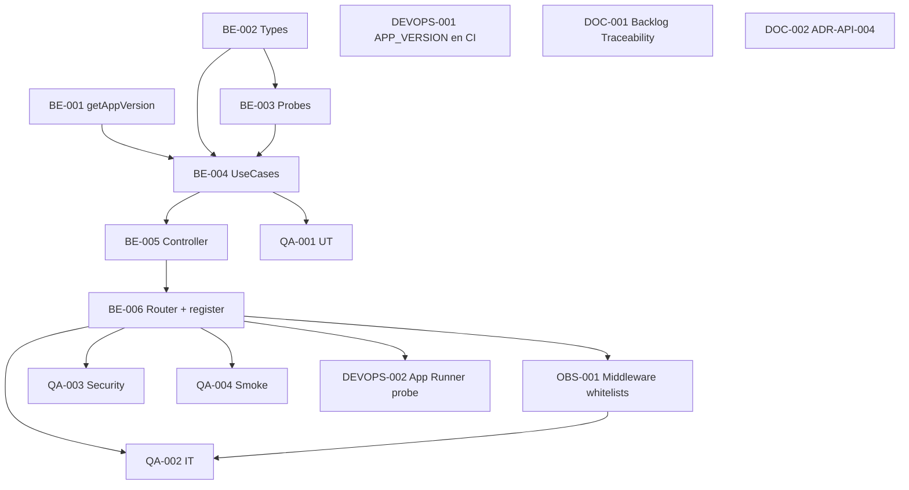

# Development Tasks — PB-P2-013 / US-116: Healthcheck y Readiness

## 1. Metadata

| Field                                | Value                                                                                    |
| ------------------------------------ | ---------------------------------------------------------------------------------------- |
| User Story ID                        | US-116                                                                                    |
| Source User Story                    | `management/user-stories/US-116-healthcheck-readiness-endpoint.md`                        |
| Source Technical Specification       | `management/technical-specs/P2/PB-P2-013/US-116-technical-spec.md`                        |
| Decision Resolution Artifact         | `management/user-stories/decision-resolutions/US-116-decision-resolution.md`               |
| Priority                             | P2 (Should Have)                                                                          |
| Backlog ID                           | PB-P2-013                                                                                 |
| Backlog Title                        | Healthcheck y readiness                                                                    |
| Backlog Execution Order              | 13 (decimotercer ítem de P2)                                                              |
| User Story Position in Backlog Item  | 1 de 1                                                                                    |
| Related User Stories in Backlog Item | US-116                                                                                    |
| Epic                                 | EPIC-OBS-001                                                                              |
| Backlog Item Dependencies            | PB-P0-002, PB-P0-004                                                                       |
| Feature                              | Endpoints HTTP públicos `/health` y `/health/ready`                                        |
| Module / Domain                      | Platform / Observability (`platform-health` module)                                        |
| Backlog Alignment Status             | Found                                                                                     |
| Task Breakdown Status                | Ready for Sprint Planning                                                                 |
| Created Date                         | 2026-07-07                                                                                |
| Last Updated                         | 2026-07-07                                                                                |

---

## 2. Source Validation

| Source                       | Found | Used | Notes                            |
| ---------------------------- | ----- | ---- | -------------------------------- |
| User Story                   | Yes   | Yes  | `Approved with Minor Notes`.      |
| Technical Specification      | Yes   | Yes  | `Ready for Task Breakdown`.       |
| Decision Resolution Artifact | Yes   | Yes  | D0 + D1..D9.                       |
| Product Backlog Prioritized  | Yes   | Yes  | PB-P2-013, posición 1 de 1.       |
| ADRs                         | Yes   | No   | Referenciados sin cambios.        |

---

## 3. Backlog Execution Context

### Parent Backlog Item

**PB-P2-013 — Healthcheck y readiness**. Depende de PB-P0-002 (backend skeleton) + PB-P0-004 (Prisma).

### Execution Order Rationale

Puede paralelizarse con US-113/114/115.

### Related User Stories in Same Backlog Item

| User Story | Role in Backlog Item              | Suggested Order |
| ---------- | --------------------------------- | --------------- |
| US-116     | Endpoint HTTP público health/ready | 1               |

---

## 4. Task Breakdown Summary

| Area                         | Number of Tasks | Notes                                                              |
| ---------------------------- | --------------: | ------------------------------------------------------------------ |
| Backend                      |               6 | Types + version util + PgProbe + AiProbe + UseCases + Controller/Router. |
| Frontend                     |               0 | No aplica.                                                          |
| API Contract                 |               0 | Ya publicado en `docs/16 §21`.                                        |
| Database / Prisma            |               0 | No cambios.                                                           |
| AI / PromptOps               |               0 | No aplica (sólo lee env vars).                                        |
| Security / Authorization     |               0 | Cubierto por QA (SEC-T-01/02).                                        |
| QA / Testing                 |               4 | UT + IT + Security + Smoke.                                            |
| Seed / Demo Data             |               0 | N/A.                                                                  |
| DevOps / Environment         |               2 | APP_VERSION en CI + App Runner probe config.                          |
| Observability / Audit        |               1 | Bypass en logger success (US-113) + exención en middlewares.           |
| Documentation / Traceability |               2 | Backlog Traceability + docs/22 ADR-API-004 nota.                       |
| **Total**                    |          **15** |                                                                    |

---

## 5. Traceability Matrix

| Acceptance Criterion  | Technical Spec Section  | Task IDs                                                                                    |
| --------------------- | ----------------------- | ------------------------------------------------------------------------------------------- |
| AC-01 — GET /health 200 | §7 (UseCase + Controller) | BE-002, BE-005, BE-006, QA-001, QA-002                                                       |
| AC-02 — GET /health/ready 200 | §7 (UseCase readiness) | BE-003, BE-004, BE-006, QA-001, QA-002                                                     |
| AC-03 — GET /health/ready 503 | §7.6, §14                | BE-003, BE-006, OBS-001, QA-002                                                              |
| AC-04 — Anonymous       | §5.2, §7.8                 | BE-006, OBS-001, QA-002                                                                     |
| AC-05 — Sin rate limit   | §7.9                       | OBS-001, QA-002                                                                             |
| AC-06 — Sin correlation ID | §7.9                    | OBS-001, QA-002                                                                             |
| AC-07 — Logging condicional | §7.7, §14                 | OBS-001, QA-002                                                                             |
| AC-08 — version util     | §7.2                       | BE-001, QA-001                                                                              |
| AC-09 — Performance      | §13.5                     | QA-002                                                                                      |

---

## 6. Development Tasks

### TASK-PB-P2-013-US-116-BE-001 — `getAppVersion()` util

| Field                     | Value                                                              |
| ------------------------- | ------------------------------------------------------------------ |
| Area                      | Backend                                                            |
| Type                      | Implementation                                                     |
| Priority                  | Must                                                               |
| Estimate                  | XS                                                                 |
| Depends On                | —                                                                  |
| Source AC(s)              | AC-08                                                              |
| Technical Spec Section(s) | §7.2                                                                |
| Backlog ID                | PB-P2-013                                                          |
| User Story ID             | US-116                                                             |
| Owner Role                | Backend                                                            |
| Status                    | To Do                                                              |

#### Objective

Crear `src/shared/config/app-version.ts` con precedencia APP_VERSION → package.json → "unknown", con caching en memoria.

#### Definition of Done

- [ ] `getAppVersion()` exportado.
- [ ] UT-01 verde.

---

### TASK-PB-P2-013-US-116-BE-002 — Types + DTOs (`domain/types.ts`)

| Field                     | Value                                                              |
| ------------------------- | ------------------------------------------------------------------ |
| Area                      | Backend                                                            |
| Type                      | Implementation                                                     |
| Priority                  | Must                                                               |
| Estimate                  | XS                                                                 |
| Depends On                | —                                                                  |
| Source AC(s)              | AC-01, AC-02                                                        |
| Technical Spec Section(s) | §6                                                                  |
| Backlog ID                | PB-P2-013                                                          |
| User Story ID             | US-116                                                             |
| Owner Role                | Backend                                                            |
| Status                    | To Do                                                              |

#### Objective

Crear `src/modules/platform-health/domain/types.ts` con `HealthResponseDto`, `ReadyResponseDto`, `ReadyDependencies`, `AiProviderStatus`.

#### Definition of Done

- [ ] Types exportados.

---

### TASK-PB-P2-013-US-116-BE-003 — `PostgresProbe` + `AiProviderProbe`

| Field                     | Value                                                              |
| ------------------------- | ------------------------------------------------------------------ |
| Area                      | Backend                                                            |
| Type                      | Implementation                                                     |
| Priority                  | Must                                                               |
| Estimate                  | S                                                                  |
| Depends On                | TASK-PB-P2-013-US-116-BE-002                                        |
| Source AC(s)              | AC-02, AC-03, EC-01, EC-02, EC-03                                    |
| Technical Spec Section(s) | §7.3, §7.4                                                          |
| Backlog ID                | PB-P2-013                                                          |
| User Story ID             | US-116                                                             |
| Owner Role                | Backend                                                            |
| Status                    | To Do                                                              |

#### Objective

Implementar `PostgresProbe.check()` con `Promise.race` timeout 500 ms y `AiProviderProbe.check()` config-based.

#### Definition of Done

- [ ] Ambos probes implementados.
- [ ] UT-02 verde.

---

### TASK-PB-P2-013-US-116-BE-004 — `GetHealthUseCase` + `GetReadinessUseCase`

| Field                     | Value                                                              |
| ------------------------- | ------------------------------------------------------------------ |
| Area                      | Backend                                                            |
| Type                      | Implementation                                                     |
| Priority                  | Must                                                               |
| Estimate                  | S                                                                  |
| Depends On                | TASK-PB-P2-013-US-116-BE-001, BE-002, BE-003                        |
| Source AC(s)              | AC-01, AC-02, AC-03                                                  |
| Technical Spec Section(s) | §7.5, §7.6                                                          |
| Backlog ID                | PB-P2-013                                                          |
| User Story ID             | US-116                                                             |
| Owner Role                | Backend                                                            |
| Status                    | To Do                                                              |

#### Objective

Implementar los dos use cases y la determinación de `status` / `httpStatus` per §7.6.

#### Definition of Done

- [ ] Ambos use cases implementados.
- [ ] UT-03, UT-04 verdes.

---

### TASK-PB-P2-013-US-116-BE-005 — `HealthController`

| Field                     | Value                                                              |
| ------------------------- | ------------------------------------------------------------------ |
| Area                      | Backend                                                            |
| Type                      | Implementation                                                     |
| Priority                  | Must                                                               |
| Estimate                  | S                                                                  |
| Depends On                | TASK-PB-P2-013-US-116-BE-004                                        |
| Source AC(s)              | AC-01, AC-02, AC-03, EC-07                                          |
| Technical Spec Section(s) | §7.7                                                                |
| Backlog ID                | PB-P2-013                                                          |
| User Story ID             | US-116                                                             |
| Owner Role                | Backend                                                            |
| Status                    | To Do                                                              |

#### Objective

Implementar `getHealth` y `getReadiness` con logging condicional (`warn` en 503, `error` en excepción) y manejo defensivo de fallos.

#### Definition of Done

- [ ] Controller implementado.

---

### TASK-PB-P2-013-US-116-BE-006 — Router + registro en `app/router.ts` + handler 405

| Field                     | Value                                                              |
| ------------------------- | ------------------------------------------------------------------ |
| Area                      | Backend                                                            |
| Type                      | Implementation                                                     |
| Priority                  | Must                                                               |
| Estimate                  | XS                                                                 |
| Depends On                | TASK-PB-P2-013-US-116-BE-005                                        |
| Source AC(s)              | AC-01, AC-02, AC-04, EC-07                                          |
| Technical Spec Section(s) | §7.8                                                                |
| Backlog ID                | PB-P2-013                                                          |
| User Story ID             | US-116                                                             |
| Owner Role                | Backend                                                            |
| Status                    | To Do                                                              |

#### Objective

Crear `platform-health.router.ts` con rutas GET + catch-all 405. Registrar en `app/router.ts` **antes** de `sessionGuard`, `csrfProtection`, `rateLimiter`, `correlationId`.

#### Definition of Done

- [ ] Rutas registradas.
- [ ] IT-01, IT-06, IT-10 verdes.

---

### TASK-PB-P2-013-US-116-OBS-001 — Whitelists en middlewares (rate limiter, correlation ID, logger success)

| Field                     | Value                                                                                   |
| ------------------------- | --------------------------------------------------------------------------------------- |
| Area                      | Observability / Middleware                                                              |
| Type                      | Implementation                                                                          |
| Priority                  | Must                                                                                    |
| Estimate                  | S                                                                                       |
| Depends On                | TASK-PB-P2-013-US-116-BE-006                                                             |
| Source AC(s)              | AC-05, AC-06, AC-07                                                                      |
| Technical Spec Section(s) | §7.9                                                                                     |
| Backlog ID                | PB-P2-013                                                                                |
| User Story ID             | US-116                                                                                  |
| Owner Role                | Backend                                                                                  |
| Status                    | To Do                                                                                    |

#### Objective

Exportar `HEALTH_PATHS` const compartido. Modificar `rate-limit.middleware.ts` (skip), `correlation-id.middleware.ts` de US-114 (no propagar a response ni body para estos paths), y `logger.middleware.ts` de US-113 (bypass access log si path ∈ health + status <500).

#### Definition of Done

- [ ] 3 middlewares con exención documentada.
- [ ] IT-07, IT-08, IT-09 verdes.

---

### TASK-PB-P2-013-US-116-QA-001 — Unit tests (UT-01..UT-04)

| Field                     | Value                                             |
| ------------------------- | ------------------------------------------------- |
| Area                      | QA / Testing                                      |
| Type                      | Test                                              |
| Priority                  | Must                                              |
| Estimate                  | S                                                 |
| Depends On                | TASK-PB-P2-013-US-116-BE-004                       |
| Source AC(s)              | AC-01, AC-02, AC-03, AC-08                        |
| Technical Spec Section(s) | §13.1                                              |
| Backlog ID                | PB-P2-013                                         |
| User Story ID             | US-116                                            |
| Owner Role                | QA                                                |
| Status                    | To Do                                             |

#### Objective

4 UTs: `getAppVersion` precedencia, `AiProviderProbe` matriz, `GetHealthUseCase` shape, `GetReadinessUseCase` combinaciones pg×ai.

#### Definition of Done

- [ ] 4 UTs verdes.

---

### TASK-PB-P2-013-US-116-QA-002 — Integration tests (IT-01..IT-10)

| Field                     | Value                                                                            |
| ------------------------- | -------------------------------------------------------------------------------- |
| Area                      | QA / Testing                                                                     |
| Type                      | Test                                                                             |
| Priority                  | Must                                                                             |
| Estimate                  | M                                                                                |
| Depends On                | TASK-PB-P2-013-US-116-BE-006, OBS-001                                             |
| Source AC(s)              | AC-01..AC-07, AC-09                                                              |
| Technical Spec Section(s) | §13.2, §13.5                                                                      |
| Backlog ID                | PB-P2-013                                                                        |
| User Story ID             | US-116                                                                           |
| Owner Role                | QA                                                                                |
| Status                    | To Do                                                                            |

#### Objective

10 ITs con Supertest: 200 base + variantes ai + 503 DB down + 405 + rate limiter bypass + correlation ID absence + logger bypass + cross-role.

#### Definition of Done

- [ ] 10 ITs verdes.
- [ ] Micro-benchmark PERF pasa (`/health` <100ms P95).

---

### TASK-PB-P2-013-US-116-QA-003 — Security tests (SEC-T-01, SEC-T-02)

| Field                     | Value                                                                       |
| ------------------------- | --------------------------------------------------------------------------- |
| Area                      | QA / Testing                                                                |
| Type                      | Test                                                                        |
| Priority                  | Must                                                                        |
| Estimate                  | XS                                                                          |
| Depends On                | TASK-PB-P2-013-US-116-BE-006                                                 |
| Source AC(s)              | SEC-02, SEC-03                                                               |
| Technical Spec Section(s) | §13.3                                                                        |
| Backlog ID                | PB-P2-013                                                                   |
| User Story ID             | US-116                                                                      |
| Owner Role                | QA                                                                          |
| Status                    | To Do                                                                       |

#### Objective

SEC-T-01: response no contiene keywords sensibles. SEC-T-02: excepción Prisma no expone stack. Etiquetados `@security`.

#### Definition of Done

- [ ] 2 tests verdes.

---

### TASK-PB-P2-013-US-116-QA-004 — Smoke tests (curl / CI)

| Field                     | Value                                                                       |
| ------------------------- | --------------------------------------------------------------------------- |
| Area                      | QA / Testing                                                                |
| Type                      | Test                                                                        |
| Priority                  | Should                                                                      |
| Estimate                  | XS                                                                          |
| Depends On                | TASK-PB-P2-013-US-116-BE-006                                                 |
| Source AC(s)              | AC-01, AC-02                                                                 |
| Technical Spec Section(s) | §13.4                                                                        |
| Backlog ID                | PB-P2-013                                                                   |
| User Story ID             | US-116                                                                      |
| Owner Role                | QA / DevOps                                                                  |
| Status                    | To Do                                                                       |

#### Objective

Agregar step de CI post-deploy con `curl -f -sS <url>/health` y `<url>/health/ready` con `jq -e`.

#### Definition of Done

- [ ] Smoke verde en CI.

---

### TASK-PB-P2-013-US-116-DEVOPS-001 — Inyectar `APP_VERSION` en CI/CD

| Field                     | Value                                                                     |
| ------------------------- | ------------------------------------------------------------------------- |
| Area                      | DevOps / Environment                                                      |
| Type                      | Setup                                                                     |
| Priority                  | Should                                                                    |
| Estimate                  | XS                                                                        |
| Depends On                | —                                                                         |
| Source AC(s)              | AC-08                                                                     |
| Technical Spec Section(s) | §15                                                                        |
| Backlog ID                | PB-P2-013                                                                 |
| User Story ID             | US-116                                                                    |
| Owner Role                | DevOps                                                                    |
| Status                    | To Do                                                                     |

#### Objective

Actualizar workflow GitHub Actions para setear `APP_VERSION=$GITHUB_SHA` (o tag) al construir la imagen Docker / correr App Runner deploy.

#### Definition of Done

- [ ] PR mergeado.

---

### TASK-PB-P2-013-US-116-DEVOPS-002 — Configurar probe de App Runner sobre `/health`

| Field                     | Value                                                                     |
| ------------------------- | ------------------------------------------------------------------------- |
| Area                      | DevOps / Environment                                                      |
| Type                      | Setup                                                                     |
| Priority                  | Should                                                                    |
| Estimate                  | XS                                                                        |
| Depends On                | TASK-PB-P2-013-US-116-BE-006                                               |
| Source AC(s)              | AC-01                                                                     |
| Technical Spec Section(s) | §15                                                                        |
| Backlog ID                | PB-P2-013                                                                 |
| User Story ID             | US-116                                                                    |
| Owner Role                | DevOps                                                                    |
| Status                    | To Do                                                                     |

#### Objective

En la configuración de App Runner (Terraform / consola), definir Health Check: path `/health`, port `3000`, interval `10s`, timeout `2s`, healthy=1, unhealthy=3.

#### Definition of Done

- [ ] Config aplicada en entorno demo.

---

### TASK-PB-P2-013-US-116-DOC-001 — Ampliar Traceability de PB-P2-013

| Field                     | Value                                                                    |
| ------------------------- | ------------------------------------------------------------------------ |
| Area                      | Documentation / Traceability                                             |
| Type                      | Documentation                                                            |
| Priority                  | Should                                                                   |
| Estimate                  | XS                                                                       |
| Depends On                | —                                                                        |
| Source AC(s)              | —                                                                        |
| Technical Spec Section(s) | §16                                                                        |
| Backlog ID                | PB-P2-013                                                                |
| User Story ID             | US-116                                                                   |
| Owner Role                | Tech Lead / Documentation                                                 |
| Status                    | To Do                                                                    |

#### Objective

Ampliar `Traceability` de PB-P2-013 con `NFR-PERF-001, NFR-OBS-006, NFR-PRIV-004, ADR-DEVOPS-003, ADR-API-004, docs/16 §21`.

#### Definition of Done

- [ ] PR mergeado.

---

### TASK-PB-P2-013-US-116-DOC-002 — Anotar excepción de correlation ID en ADR-API-004

| Field                     | Value                                                                   |
| ------------------------- | ----------------------------------------------------------------------- |
| Area                      | Documentation / Traceability                                            |
| Type                      | Documentation                                                           |
| Priority                  | Should                                                                  |
| Estimate                  | XS                                                                      |
| Depends On                | —                                                                       |
| Source AC(s)              | AC-06                                                                    |
| Technical Spec Section(s) | §16                                                                       |
| Backlog ID                | PB-P2-013                                                               |
| User Story ID             | US-116                                                                  |
| Owner Role                | Tech Lead / Documentation                                                |
| Status                    | To Do                                                                   |

#### Objective

Actualizar `docs/22-Architecture-Decision-Records.md` ADR-API-004 con nota explícita: `/health` y `/health/ready` NO propagan `X-Correlation-Id` per `docs/16 §21.4`.

#### Definition of Done

- [ ] PR mergeado.

---

## 7. Required QA Tasks

| Task ID                             | Test Type       | Purpose                                                              |
| ----------------------------------- | --------------- | -------------------------------------------------------------------- |
| TASK-PB-P2-013-US-116-QA-001        | Unit             | UT-01..UT-04.                                                         |
| TASK-PB-P2-013-US-116-QA-002        | Integration + PERF | IT-01..IT-10 + micro-benchmark.                                     |
| TASK-PB-P2-013-US-116-QA-003        | Security          | SEC-T-01 no-secrets + SEC-T-02 no-stack.                              |
| TASK-PB-P2-013-US-116-QA-004        | Smoke             | curl post-deploy en CI.                                                |

---

## 8. Required Security Tasks

`No aplica como task independiente` — cubierto por QA-003 etiquetado `@security`.

---

## 9. Required Seed / Demo Tasks

`No aplica`.

---

## 10. Observability / Audit Tasks

| Task ID                             | Purpose                                                                                    |
| ----------------------------------- | ------------------------------------------------------------------------------------------ |
| TASK-PB-P2-013-US-116-OBS-001       | Whitelist en 3 middlewares (rate limiter, correlation ID US-114, logger success US-113). |

---

## 11. Documentation / Traceability Tasks

| Task ID                       | Document / Artifact                          | Purpose                                                  |
| ----------------------------- | -------------------------------------------- | -------------------------------------------------------- |
| TASK-PB-P2-013-US-116-DOC-001 | PB-P2-013 Traceability                        | Ampliar IDs.                                              |
| TASK-PB-P2-013-US-116-DOC-002 | ADR-API-004                                    | Anotar excepción de correlation ID.                       |

---

## 12. Dependency Graph

---

## 13. Suggested Implementation Order

### Phase 1 — Foundation

1. BE-001 (getAppVersion).
2. BE-002 (Types).
3. DEVOPS-001 (APP_VERSION en CI, no bloquea BE).

### Phase 2 — Core Implementation

4. BE-003 (Probes).
5. BE-004 (UseCases).
6. BE-005 (Controller).
7. BE-006 (Router + registro).
8. OBS-001 (Middleware whitelists).

### Phase 3 — Validation / QA

9. QA-001 (UT).
10. QA-002 (IT + PERF).
11. QA-003 (Security).
12. QA-004 (Smoke).

### Phase 4 — DevOps + Documentation

13. DEVOPS-002 (App Runner probe config).
14. DOC-001 (Backlog Traceability).
15. DOC-002 (ADR-API-004 nota).

---

## 14. Risks & Mitigations

| Risk                                                        | Impact                     | Mitigation                                                                                   | Related Task    |
| ----------------------------------------------------------- | -------------------------- | -------------------------------------------------------------------------------------------- | --------------- |
| `SELECT 1` cuelga por pool exhausted                         | 503 falso positivo         | Timeout 500 ms via Promise.race.                                                              | BE-003, QA-002  |
| Middleware order incorrecto                                   | 401/403 en health           | IT-01, IT-10 validan.                                                                        | BE-006, QA-002  |
| Logging success bypass rompe alertas                          | Falta visibilidad           | Documentado; NFR-OBS-006 acepta stdout; 503 sí loggeado.                                       | OBS-001         |
| `package.json` no accesible en build                          | version="unknown"           | CI inyecta APP_VERSION; fallback.                                                            | BE-001, DEVOPS-001 |
| App Runner probe config drift                                 | Deploy falla                | DEVOPS-002 documenta config exacta.                                                          | DEVOPS-002      |

---

## 15. Out of Scope Confirmation

- APM / OTel / Prometheus.
- `/metrics` endpoint.
- Endpoint `/live`.
- Autenticación.
- Probe activo LLM externo.
- Migraciones DB.
- Cambios frontend.
- Alarmas CloudWatch (US-141 post-MVP).

---

## 16. Readiness for Sprint Planning

| Check                                      | Status |
| ------------------------------------------ | ------ |
| Product Backlog mapping found              | Pass   |
| Every AC maps to tasks                     | Pass   |
| Technical Spec used                        | Pass   |
| QA tasks included                          | Pass   |
| Security tasks included (via QA-003)       | Pass   |
| Seed/demo tasks included                   | N/A    |
| Observability tasks included               | Pass (OBS-001) |
| Documentation tasks included               | Pass   |
| Task dependencies clear                    | Pass   |
| Tasks small enough                         | Pass   |
| Ready for Sprint Planning                  | Yes    |

---

## 17. Final Recommendation

`Ready for Sprint Planning`

15 tareas cubren AC-01..AC-09 + EC-01..EC-07 y materializan D0–D9. Sin migraciones DB. Sin cambios frontend. Sin llamadas LLM externas. Testing con foco explícito en shape estable, semántica HTTP (200/503/degraded), no-PII, no-secrets, no-stack, y respeto a middlewares (rate limit, correlation ID, logger success). 2 tareas DevOps ligeras (APP_VERSION + probe config) y 2 documentation alignments no bloqueantes.

---

Development Tasks created: Yes
Path: `management/development-tasks/P2/PB-P2-013/US-116-development-tasks.md`
Status: Ready for Sprint Planning
Technical Specification used: Yes
Backlog ID: PB-P2-013
Execution Order: 13 (decimotercer ítem de P2)
Next step: Sprint Planning / Roadmap.

Task groups: 6 Backend (util + types + probes + use cases + controller + router/register), 1 Observability (middleware whitelists), 4 QA (UT + IT + Security + Smoke), 2 DevOps (APP_VERSION + App Runner probe config), 2 Documentation Alignment.
Product Backlog mapping: Found (PB-P2-013, P2, posición 1 de 1).
Decision Resolution artifact used: Yes.
Warnings: 2 Documentation Alignment (no bloqueantes). Riesgo aceptado: fallback `version="unknown"` cuando ni env ni package.json disponibles.
