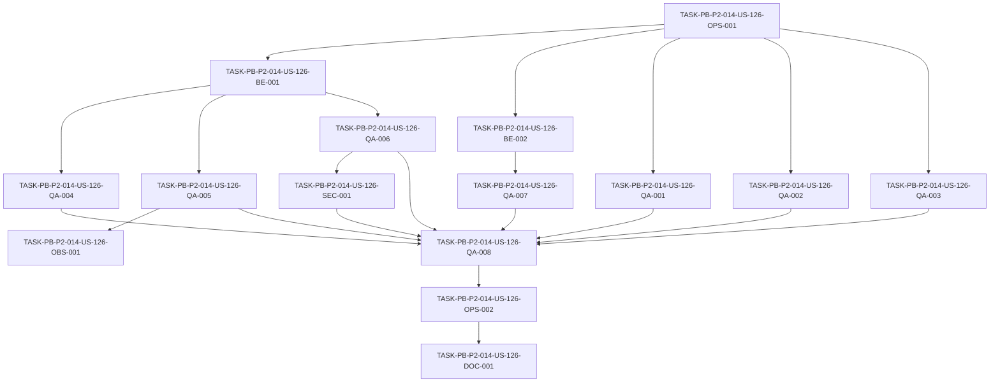

# Development Tasks — PB-P2-014 / US-126: Suite unit + integration backend

## 1. Metadata

| Field | Value |
|---|---|
| User Story ID | US-126 |
| Source User Story | `management/user-stories/US-126-unit-integration-backend-suite.md` |
| Source Technical Specification | `management/technical-specs/P2/PB-P2-014/US-126-technical-spec.md` |
| Decision Resolution Artifact | N/A (no existe) |
| Priority | P2 (Must Have) |
| Backlog ID | PB-P2-014 |
| Backlog Title | Suite unit/integration backend (≥50% coverage) |
| Backlog Execution Order | 14 (decimocuarto ítem de P2) |
| User Story Position in Backlog Item | 1 de 1 |
| Related User Stories in Backlog Item | US-126 |
| Epic | EPIC-QA-001 |
| Backlog Item Dependencies | PB-P0-015 (base de CI/pipeline) |
| Feature | Backend tests — suite unit + integration con Vitest |
| Module / Domain | QA / Testing (transversal al backend) |
| Backlog Alignment Status | Found |
| Task Breakdown Status | Ready for Sprint Planning |
| Created Date | 2026-07-07 |
| Last Updated | 2026-07-07 |

---

## 2. Source Validation

| Source | Found | Used | Notes |
|---|---|---|---|
| User Story | Yes | Yes | `Approved with Minor Notes`. |
| Technical Specification | Yes | Yes | `Ready for Task Breakdown`. Fuente primaria. |
| Decision Resolution Artifact | No | No | No existe para US-126. |
| Product Backlog Prioritized | Yes | Yes | PB-P2-014, P2, EPIC-QA-001. |
| ADRs | Yes | Yes | ADR-TEST-001 (Vitest + Supertest). |

---

## 3. Backlog Execution Context

### Parent Backlog Item

**PB-P2-014 — Suite unit/integration backend (≥50% coverage)** (EPIC-QA-001, P2, Must Have). Construir suite unit (domain + application + utils/schemas) e integration (use cases + repositorios + middlewares) con cobertura ≥50% en lógica crítica; CI bloquea merge si baja o si fallan; pruebas determinísticas. Trazabilidad: Doc 20 · NFR-TEST-*. Dependencia: PB-P0-015.

### Execution Order Rationale

Decimocuarto ítem de P2. Depende de PB-P0-015 (CI existente). Constituye la base ancha de la pirámide de pruebas (Doc 20) y habilita a las suites derivadas de calidad (contract PB-P2-015, E2E PB-P2-016) y a los quality gates (PB-P2-020).

### Related User Stories in Same Backlog Item

| User Story | Role in Backlog Item | Suggested Order |
|---|---|---|
| US-126 | Única historia (suite unit + integration) | 1 |

---

## 4. Task Breakdown Summary

| Area | Number of Tasks | Notes |
|---|---:|---|
| DevOps / Environment (OPS) | 2 | Config Vitest + gate de CI bloqueante |
| Backend (BE) | 2 | Helpers `test-db` y `mock-ai` + fixtures |
| QA / Testing (QA) | 8 | Suites unit e integration + cobertura/determinismo |
| Security / Authorization (SEC) | 1 | Casos negativos 401/403 de policy |
| Observability / Audit (OBS) | 1 | Sin secretos en logs; Correlation ID |
| Documentation (DOC) | 1 | Cómo ejecutar la suite + umbral |
| **Total** | **15** | |

---

## 5. Traceability Matrix

| Acceptance Criterion | Technical Spec Section | Task IDs |
|---|---|---|
| AC-01 (unit dominio/app/schemas) | §7, §13 | QA-001, QA-002, QA-003 |
| AC-02 (integration repos/constraints/middleware/IA) | §7, §10, §11, §12, §13 | BE-001, BE-002, QA-004, QA-005, QA-006, QA-007, SEC-001 |
| AC-03 (cobertura ≥50%) | §13, §16 | OPS-001, QA-008 |
| AC-04 (determinismo) | §13, §17 | BE-001, BE-002, QA-008 |
| AC-05 (gate CI bloqueante) | §13, §19 | OPS-002 |

---

## 6. Development Tasks

### TASK-PB-P2-014-US-126-OPS-001 — Configurar Vitest para backend (unit + integration + cobertura)

| Field | Value |
|---|---|
| Area | DevOps / Environment |
| Type | Setup |
| Priority | Must |
| Estimate | M |
| Depends On | — |
| Source AC(s) | AC-03 |
| Technical Spec Section(s) | §5 (Testing), §13, §16 |
| Backlog ID | PB-P2-014 |
| User Story ID | US-126 |
| Owner Role | DevOps |
| Status | To Do |

#### Objective
Configurar Vitest como runner unificado del backend con proyectos/config separados para unit e integration y reporte de cobertura c8/istanbul.

#### Scope
##### Include
* `vitest.config.*` con entornos unit e integration.
* Scripts npm (`test:unit`, `test:integration`, `test:coverage`).
* Reporter de cobertura (c8/istanbul) y estructura de carpetas base `tests/`.
##### Exclude
* Definición del umbral bloqueante (QA-008) y gate de CI (OPS-002).
* Suite API Supertest.

#### Implementation Notes
Respetar ADR-TEST-001 (Vitest). No incluir proveedores de IA reales.

#### Acceptance Criteria Covered
AC-03.

#### Definition of Done
- [ ] Vitest ejecuta `test:unit` y `test:integration` localmente.
- [ ] Reporte de cobertura se genera con `test:coverage`.
- [ ] Estructura de carpetas `tests/unit` y `tests/integration` creada.

---

### TASK-PB-P2-014-US-126-BE-001 — Helper `test-db` (PostgreSQL efímero + aislamiento)

| Field | Value |
|---|---|
| Area | Backend |
| Type | Setup |
| Priority | Must |
| Estimate | M |
| Depends On | OPS-001 |
| Source AC(s) | AC-02, AC-04 |
| Technical Spec Section(s) | §7 (Repository/Transactions), §10 |
| Backlog ID | PB-P2-014 |
| User Story ID | US-126 |
| Owner Role | Backend |
| Status | To Do |

#### Objective
Implementar `tests/helpers/test-db.ts` que aprovisiona una BD PostgreSQL efímera con las migraciones vigentes, con aislamiento (transacción/truncate) y cleanup automático.

#### Scope
##### Include
* Setup/teardown de BD efímera (contenedor o esquema temporal).
* Estrategia de aislamiento por test (rollback o truncate).
* Fail-fast con mensaje claro si la BD no está disponible (EC-01).
##### Exclude
* Cambios al esquema Prisma productivo.

#### Implementation Notes
Aplicar migraciones existentes; no crear migraciones nuevas.

#### Acceptance Criteria Covered
AC-02, AC-04.

#### Definition of Done
- [ ] Las pruebas de integración corren contra BD efímera aislada.
- [ ] Estado limpio entre pruebas (determinismo).
- [ ] Fail-fast verificado cuando la BD no está disponible.

---

### TASK-PB-P2-014-US-126-BE-002 — Helper `mock-ai` y fixtures base

| Field | Value |
|---|---|
| Area | Backend |
| Type | Setup |
| Priority | Must |
| Estimate | S |
| Depends On | OPS-001 |
| Source AC(s) | AC-02, AC-04 |
| Technical Spec Section(s) | §11, §13 |
| Backlog ID | PB-P2-014 |
| User Story ID | US-126 |
| Owner Role | Backend |
| Status | To Do |

#### Objective
Implementar `tests/helpers/mock-ai.ts` basado en `MockAIProvider` y fixtures base (`tests/fixtures/**`) conformes a los schemas del módulo IA.

#### Scope
##### Include
* Wrapper de `MockAIProvider` para pruebas.
* Fixtures de respuestas IA conformes a schema.
* Fixtures de usuarios/eventos base para integración.
##### Exclude
* Uso de `OpenAIProvider` real.

#### Implementation Notes
Prohibido `OPENAI_API_KEY` real; sin red externa.

#### Acceptance Criteria Covered
AC-02, AC-04.

#### Definition of Done
- [ ] `MockAIProvider` disponible como dependencia de prueba.
- [ ] Fixtures IA validan contra schema esperado.
- [ ] Sin dependencias de red externa.

---

### TASK-PB-P2-014-US-126-QA-001 — Suite unit: políticas de dominio (BR-*)

| Field | Value |
|---|---|
| Area | QA / Testing |
| Type | Test |
| Priority | Must |
| Estimate | M |
| Depends On | OPS-001 |
| Source AC(s) | AC-01 |
| Technical Spec Section(s) | §7, §13 |
| Backlog ID | PB-P2-014 |
| User Story ID | US-126 |
| Owner Role | QA |
| Status | To Do |

#### Objective
Escribir pruebas unitarias determinísticas de las políticas de dominio (reglas BR-*) en `tests/unit/domain`.

#### Scope
##### Include
* Casos positivos y negativos de las políticas de dominio existentes.
##### Exclude
* Integración con BD o middleware.

#### Implementation Notes
Dependencias mockeadas; sin side-effects.

#### Acceptance Criteria Covered
AC-01.

#### Definition of Done
- [ ] Políticas de dominio críticas cubiertas por unit tests.
- [ ] Suite verde y determinística.

---

### TASK-PB-P2-014-US-126-QA-002 — Suite unit: lógica de use cases (application)

| Field | Value |
|---|---|
| Area | QA / Testing |
| Type | Test |
| Priority | Must |
| Estimate | M |
| Depends On | OPS-001 |
| Source AC(s) | AC-01 |
| Technical Spec Section(s) | §7, §13 |
| Backlog ID | PB-P2-014 |
| User Story ID | US-126 |
| Owner Role | QA |
| Status | To Do |

#### Objective
Escribir pruebas unitarias de la lógica de los use cases (capa application) en `tests/unit/application` con repositorios/servicios mockeados.

#### Scope
##### Include
* Ramas de decisión y validaciones de use cases críticos.
##### Exclude
* Repositorio Prisma real (cubierto en integración).

#### Implementation Notes
Aislar dependencias con dobles de prueba.

#### Acceptance Criteria Covered
AC-01.

#### Definition of Done
- [ ] Use cases críticos cubiertos por unit tests.
- [ ] Suite verde y determinística.

---

### TASK-PB-P2-014-US-126-QA-003 — Suite unit: esquemas Zod y utils/mapeadores

| Field | Value |
|---|---|
| Area | QA / Testing |
| Type | Test |
| Priority | Must |
| Estimate | S |
| Depends On | OPS-001 |
| Source AC(s) | AC-01 |
| Technical Spec Section(s) | §7 (DTOs/Schemas), §13 |
| Backlog ID | PB-P2-014 |
| User Story ID | US-126 |
| Owner Role | QA |
| Status | To Do |

#### Objective
Escribir pruebas unitarias de validación, transformación y defaults de esquemas Zod, y de utilidades/mapeadores, en `tests/unit/schemas`.

#### Scope
##### Include
* Casos válidos e inválidos de parsing/transform.
##### Exclude
* Validación end-to-end de endpoints.

#### Implementation Notes
Cubrir defaults y mensajes de error relevantes.

#### Acceptance Criteria Covered
AC-01.

#### Definition of Done
- [ ] Esquemas Zod críticos cubiertos.
- [ ] Mapeadores/utils cubiertos.

---

### TASK-PB-P2-014-US-126-QA-004 — Suite integration: repositorios Prisma + constraints

| Field | Value |
|---|---|
| Area | QA / Testing |
| Type | Test |
| Priority | Must |
| Estimate | M |
| Depends On | BE-001 |
| Source AC(s) | AC-02 |
| Technical Spec Section(s) | §10, §13 |
| Backlog ID | PB-P2-014 |
| User Story ID | US-126 |
| Owner Role | QA |
| Status | To Do |

#### Objective
Escribir pruebas de integración de repositorios Prisma sobre BD efímera y de constraints (FK, unique, enum, soft delete) en `tests/integration/repositories`.

#### Scope
##### Include
* CRUD de repositorios críticos y comportamiento de constraints (fallan cuando deben).
##### Exclude
* Capa HTTP completa (Supertest).

#### Implementation Notes
Usar `test-db` para aislamiento.

#### Acceptance Criteria Covered
AC-02.

#### Definition of Done
- [ ] Repositorios críticos cubiertos en integración.
- [ ] Constraints validados (fallo esperado ante violación).

---

### TASK-PB-P2-014-US-126-QA-005 — Suite integration: use case + repositorio Prisma

| Field | Value |
|---|---|
| Area | QA / Testing |
| Type | Test |
| Priority | Must |
| Estimate | M |
| Depends On | BE-001 |
| Source AC(s) | AC-02 |
| Technical Spec Section(s) | §7, §13 |
| Backlog ID | PB-P2-014 |
| User Story ID | US-126 |
| Owner Role | QA |
| Status | To Do |

#### Objective
Escribir pruebas de integración use case + repositorio Prisma sobre BD efímera en `tests/integration/use-cases`.

#### Scope
##### Include
* Flujos de use cases críticos con persistencia real.
##### Exclude
* Endpoints HTTP end-to-end.

#### Implementation Notes
Reutilizar fixtures base (BE-002).

#### Acceptance Criteria Covered
AC-02.

#### Definition of Done
- [ ] Use cases críticos cubiertos con repositorio real.
- [ ] Suite verde y determinística.

---

### TASK-PB-P2-014-US-126-QA-006 — Suite integration: middleware auth + policy (positivos)

| Field | Value |
|---|---|
| Area | QA / Testing |
| Type | Test |
| Priority | Must |
| Estimate | S |
| Depends On | BE-001 |
| Source AC(s) | AC-02 |
| Technical Spec Section(s) | §12, §13 |
| Backlog ID | PB-P2-014 |
| User Story ID | US-126 |
| Owner Role | QA |
| Status | To Do |

#### Objective
Escribir pruebas de integración de los middlewares de autenticación y policy (casos positivos: acceso autorizado) en `tests/integration`.

#### Scope
##### Include
* Autenticación válida y autorización concedida por rol/ownership/assignment.
##### Exclude
* Casos negativos (SEC-001).

#### Implementation Notes
Complementa SEC-001 (negativos).

#### Acceptance Criteria Covered
AC-02.

#### Definition of Done
- [ ] Acceso autorizado cubierto por pruebas.

---

### TASK-PB-P2-014-US-126-QA-007 — Suite integration: módulo IA con MockAIProvider (schema)

| Field | Value |
|---|---|
| Area | QA / Testing |
| Type | Test |
| Priority | Must |
| Estimate | S |
| Depends On | BE-002 |
| Source AC(s) | AC-02 |
| Technical Spec Section(s) | §11, §13 |
| Backlog ID | PB-P2-014 |
| User Story ID | US-126 |
| Owner Role | QA |
| Status | To Do |

#### Objective
Escribir pruebas de integración del módulo IA usando `MockAIProvider`, validando conformidad de schema de la salida (no texto literal).

#### Scope
##### Include
* Aserciones sobre estructura/schema de la salida IA mock.
##### Exclude
* Llamadas a `OpenAIProvider` real.

#### Implementation Notes
`MockAIProvider` obligatorio (PT-04, AI-T-01).

#### Acceptance Criteria Covered
AC-02.

#### Definition of Done
- [ ] Módulo IA cubierto con MockAIProvider.
- [ ] Aserciones por schema, no por texto literal.

---

### TASK-PB-P2-014-US-126-QA-008 — Umbral de cobertura y verificación de determinismo

| Field | Value |
|---|---|
| Area | QA / Testing |
| Type | Test |
| Priority | Must |
| Estimate | S |
| Depends On | OPS-001, QA-001, QA-002, QA-003, QA-004, QA-005, QA-006, QA-007, SEC-001 |
| Source AC(s) | AC-03, AC-04 |
| Technical Spec Section(s) | §13, §16, §17 |
| Backlog ID | PB-P2-014 |
| User Story ID | US-126 |
| Owner Role | QA |
| Status | To Do |

#### Objective
Configurar el umbral bloqueante de cobertura (≥50% lógica crítica; metas aspiracionales 60/80% de Doc 20) y verificar determinismo (sin flakiness) de la suite completa.

#### Scope
##### Include
* Configuración de thresholds de cobertura en Vitest.
* Ejecución repetida para confirmar determinismo.
* Regla de no `.skip`/`xfail` en pruebas críticas.
##### Exclude
* Wiring del pipeline (OPS-002).

#### Implementation Notes
Confirmar umbral final con Tech Lead/QA Architect (Documentation Alignment no bloqueante).

#### Acceptance Criteria Covered
AC-03, AC-04.

#### Definition of Done
- [ ] Threshold de cobertura configurado y falla si no se cumple.
- [ ] Suite estable en corridas repetidas.
- [ ] Sin pruebas críticas saltadas.

---

### TASK-PB-P2-014-US-126-SEC-001 — Pruebas negativas de autorización (401/403) de policy

| Field | Value |
|---|---|
| Area | Security / Authorization |
| Type | Test |
| Priority | Must |
| Estimate | S |
| Depends On | QA-006 |
| Source AC(s) | AC-02 |
| Technical Spec Section(s) | §12 |
| Backlog ID | PB-P2-014 |
| User Story ID | US-126 |
| Owner Role | QA |
| Status | To Do |

#### Objective
Escribir pruebas negativas del middleware de policy: acceso anónimo (401) y denegación por rol/ownership/assignment (403).

#### Scope
##### Include
* 401 anónimo; 403 por rol, ownership y assignment.
##### Exclude
* Casos positivos (QA-006).

#### Implementation Notes
Obligatorias aunque no muevan el % de cobertura (Doc 20 §22).

#### Acceptance Criteria Covered
AC-02.

#### Definition of Done
- [ ] 401 anónimo cubierto.
- [ ] 403 por rol/ownership/assignment cubierto.

---

### TASK-PB-P2-014-US-126-OPS-002 — Gate de CI bloqueante (unit + integration + cobertura)

| Field | Value |
|---|---|
| Area | DevOps / Environment |
| Type | Setup |
| Priority | Must |
| Estimate | M |
| Depends On | QA-008 |
| Source AC(s) | AC-05 |
| Technical Spec Section(s) | §13 (CI Checks), §19 |
| Backlog ID | PB-P2-014 |
| User Story ID | US-126 |
| Owner Role | DevOps |
| Status | To Do |

#### Objective
Integrar la suite unit + integration como compuerta obligatoria de CI que bloquea el merge ante fallos, `.skip`/`xfail` críticos o cobertura insuficiente.

#### Scope
##### Include
* Job de CI que ejecuta `test:unit`, `test:integration` y valida cobertura.
* Bloqueo de merge en la rama protegida; `OPENAI_API_KEY` ausente en CI.
##### Exclude
* Suite API/E2E (otros ítems).
* Consolidación completa de quality gates (PB-P2-020).

#### Implementation Notes
Aprovechar la base de CI de PB-P0-015.

#### Acceptance Criteria Covered
AC-05.

#### Definition of Done
- [ ] CI ejecuta unit + integration en cada PR.
- [ ] Merge bloqueado ante fallo, skip crítico o cobertura baja.
- [ ] CI corre sin secretos de IA reales.

---

### TASK-PB-P2-014-US-126-OBS-001 — Verificar ausencia de secretos en logs y Correlation ID en pruebas

| Field | Value |
|---|---|
| Area | Observability / Audit |
| Type | Test |
| Priority | Should |
| Estimate | XS |
| Depends On | QA-005 |
| Source AC(s) | AC-02 |
| Technical Spec Section(s) | §14 |
| Backlog ID | PB-P2-014 |
| User Story ID | US-126 |
| Owner Role | QA |
| Status | To Do |

#### Objective
Verificar en las pruebas que los logs no contienen secretos y que el `Correlation ID` se propaga donde el use case bajo prueba lo requiera.

#### Scope
##### Include
* Aserción de no-secretos en logs de prueba.
* Verificación de propagación de Correlation ID donde aplique.
##### Exclude
* Implementación del logger (otros ítems de observabilidad).

#### Implementation Notes
SEC-03: sin secretos en logs.

#### Acceptance Criteria Covered
AC-02.

#### Definition of Done
- [ ] Prueba confirma ausencia de secretos en logs.
- [ ] Propagación de Correlation ID verificada donde aplica.

---

### TASK-PB-P2-014-US-126-DOC-001 — Documentar ejecución de la suite y umbral de cobertura

| Field | Value |
|---|---|
| Area | Documentation / Traceability |
| Type | Documentation |
| Priority | Should |
| Estimate | XS |
| Depends On | OPS-002 |
| Source AC(s) | AC-03, AC-05 |
| Technical Spec Section(s) | §16, §19 |
| Backlog ID | PB-P2-014 |
| User Story ID | US-126 |
| Owner Role | Tech Lead |
| Status | To Do |

#### Objective
Documentar cómo ejecutar la suite unit + integration, el umbral de cobertura vigente y la política de gate en CI.

#### Scope
##### Include
* Sección en README/CONTRIBUTING backend con comandos y umbral.
* Nota de Documentation Alignment (50% vs 60/80% Doc 20).
##### Exclude
* Cambios a Doc 20 (decisión de Tech Lead/QA Architect).

#### Implementation Notes
Registrar el umbral finalmente acordado.

#### Acceptance Criteria Covered
AC-03, AC-05.

#### Definition of Done
- [ ] Documentación de ejecución y umbral publicada.
- [ ] Nota de alineación de cobertura registrada.

---

## 7. Required QA Tasks

| Task ID | Test Type | Purpose |
|---|---|---|
| QA-001 | Unit | Políticas de dominio (BR-*) |
| QA-002 | Unit | Lógica de use cases |
| QA-003 | Unit | Esquemas Zod + utils/mapeadores |
| QA-004 | Integration | Repositorios Prisma + constraints |
| QA-005 | Integration | Use case + repositorio Prisma |
| QA-006 | Integration | Middleware auth + policy (positivos) |
| QA-007 | Integration | Módulo IA con MockAIProvider |
| QA-008 | Coverage/Determinism | Umbral de cobertura + determinismo |
| SEC-001 | Security (negative) | 401/403 de policy |
| OBS-001 | Observability | No-secretos en logs + Correlation ID |

---

## 8. Required Security Tasks

| Task ID | Security Concern | Purpose |
|---|---|---|
| SEC-001 | Autorización negativa (401/403) | Cubrir denegación por rol/ownership/assignment y acceso anónimo |
| QA-006 | Autorización positiva | Verificar acceso autorizado del middleware policy |

---

## 9. Required Seed / Demo Tasks

`No aplica` — la historia no modifica el seed productivo; usa fixtures propios de prueba.

---

## 10. Observability / Audit Tasks

| Task ID | Concern | Purpose |
|---|---|---|
| OBS-001 | Logs sin secretos + Correlation ID | Verificar SEC-03 y propagación de Correlation ID en pruebas |

---

## 11. Documentation / Traceability Tasks

| Task ID | Document / Artifact | Purpose |
|---|---|---|
| DOC-001 | README/CONTRIBUTING backend | Documentar ejecución de la suite y umbral de cobertura |

---

## 12. Dependency Graph

---

## 13. Suggested Implementation Order

### Phase 1 — Foundation
* OPS-001 (config Vitest)
* BE-001 (`test-db`), BE-002 (`mock-ai` + fixtures)

### Phase 2 — Core Implementation
* QA-001, QA-002, QA-003 (unit)
* QA-004, QA-005, QA-006, QA-007 (integration)

### Phase 3 — Validation / Security / QA
* SEC-001 (negativos de autorización)
* OBS-001 (logs/Correlation ID)
* QA-008 (umbral de cobertura + determinismo)
* OPS-002 (gate de CI bloqueante)

### Phase 4 — Documentation / Review
* DOC-001 (documentación de ejecución y umbral)

---

## 14. Risks & Mitigations

| Risk | Impact | Mitigation | Related Task |
|---|---|---|---|
| Flakiness por IA real/red externa | CI inestable | `MockAIProvider` obligatorio; sin `OPENAI_API_KEY` | BE-002, QA-007, OPS-002 |
| BD efímera mal aislada | Determinismo comprometido | Aislamiento por transacción/truncate + fail-fast | BE-001 |
| Cobertura sin pruebas negativas de auth | Falsa calidad | Casos 401/403 obligatorios | SEC-001 |
| Umbral ambiguo (50% vs 60/80%) | Fricción en PR | Fijar ≥50% ahora; confirmar meta con Tech Lead | QA-008, DOC-001 |
| Suite de integración lenta | CI lento | Base unit amplia y rápida; integración enfocada | QA-004..QA-007 |

---

## 15. Out of Scope Confirmation

* Suite API HTTP completa vía Supertest.
* Suite contract con MSW (PB-P2-015 / US-127).
* Suite E2E Playwright (PB-P2-016).
* Suite IA ampliada como ítem propio (PB-P2-017) y RBAC negativa extendida (PB-P2-018).
* Formalización completa de quality gates en GitHub Actions (PB-P2-020).
* Pruebas de frontend.
* Llamadas reales a proveedores de IA en CI.
* Cambios de esquema o seed productivo.

---

## 16. Readiness for Sprint Planning

| Check | Status |
|---|---|
| Product Backlog mapping found | Pass |
| Every AC maps to tasks | Pass |
| Technical Spec used when available | Pass |
| QA tasks included | Pass |
| Security tasks included if applicable | Pass |
| Seed/demo tasks included if applicable | N/A |
| Observability tasks included if applicable | Pass |
| Documentation tasks included if applicable | Pass |
| Task dependencies clear | Pass |
| Tasks small enough | Pass |
| Ready for Sprint Planning | Yes |

---

## 17. Final Recommendation

`Ready for Sprint Planning`

Las 15 tareas cubren todos los Acceptance Criteria (AC-01..AC-05), mapean a secciones del Technical Spec y respetan el orden de dependencias (foundation → suites → validación/gate → documentación). Se incluyen QA, seguridad (negativos de autorización), observabilidad y documentación. La única alerta es de Documentation Alignment **no bloqueante** (umbral de cobertura 50% vs 60/80%), gestionada en QA-008 y DOC-001. No hay bloqueos ni scope creep.
