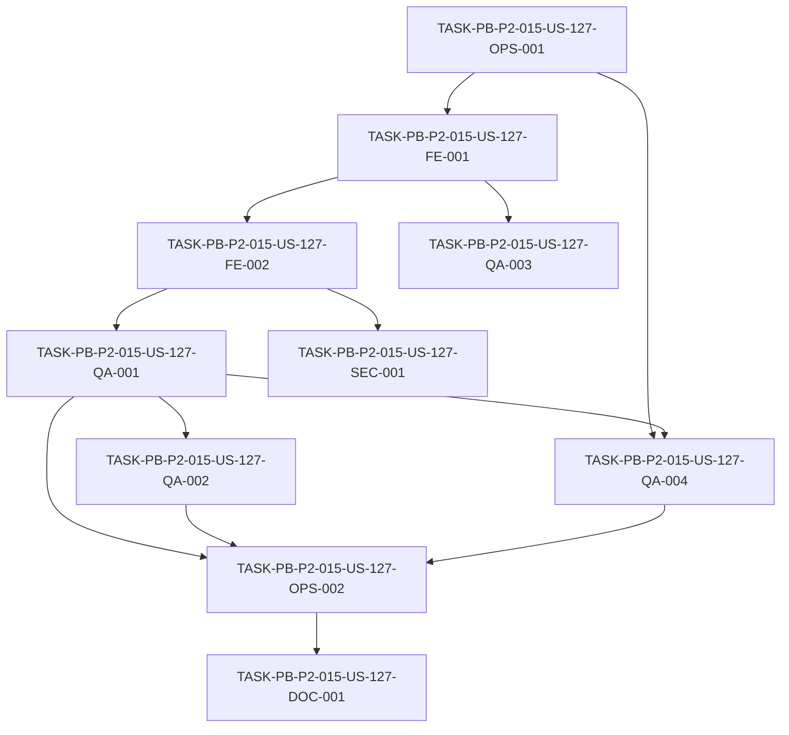

# Development Tasks — PB-P2-015 / US-127: Suite contract con MSW alineado a API

## 1. Metadata

| Field | Value |
|---|---|
| User Story ID | US-127 |
| Source User Story | `management/user-stories/US-127-contract-tests-with-msw.md` |
| Source Technical Specification | `management/technical-specs/P2/PB-P2-015/US-127-technical-spec.md` |
| Decision Resolution Artifact | N/A (no existe) |
| Priority | P2 (Must Have) |
| Backlog ID | PB-P2-015 |
| Backlog Title | Suite contract con MSW (tests de contrato frontend ↔ backend) |
| Backlog Execution Order | 15 (decimoquinto ítem de P2) |
| User Story Position in Backlog Item | 1 de 1 |
| Related User Stories in Backlog Item | US-127 |
| Epic | EPIC-QA-001 |
| Backlog Item Dependencies | PB-P0-005 (OpenAPI snapshot, best-effort), PB-P0-015 (base de CI) |
| Feature | Contract tests — MSW alineado al contrato real de la API |
| Module / Domain | QA / Testing (frontend contract) |
| Backlog Alignment Status | Found |
| Task Breakdown Status | Ready for Sprint Planning |
| Created Date | 2026-07-07 |
| Last Updated | 2026-07-07 |

---

## 2. Source Validation

| Source | Found | Used | Notes |
|---|---|---|---|
| User Story | Yes | Yes | `Approved with Minor Notes`. |
| Technical Specification | Yes | Yes | `Ready for Task Breakdown`. Fuente primaria. |
| Decision Resolution Artifact | No | No | No existe para US-127. |
| Product Backlog Prioritized | Yes | Yes | PB-P2-015, P2, EPIC-QA-001. |
| ADRs | Yes | Yes | ADR-TEST-001 (Vitest + Supertest). |

---

## 3. Backlog Execution Context

### Parent Backlog Item

**PB-P2-015 — Suite contract con MSW** (EPIC-QA-001, P2, Must Have). MSW del frontend alineado a respuestas reales del backend; tests detectan drift; generado desde OpenAPI cuando posible. Dependencias: PB-P0-005 (best-effort), PB-P0-015.

### Execution Order Rationale

Decimoquinto ítem de P2. Depende de PB-P0-015 (CI) y best-effort de PB-P0-005 (OpenAPI). Complementa a US-126 protegiendo el contrato frontend↔backend, antes de E2E (PB-P2-016) y de los quality gates (PB-P2-020).

### Related User Stories in Same Backlog Item

| User Story | Role in Backlog Item | Suggested Order |
|---|---|---|
| US-127 | Única historia (contract + MSW) | 1 |

---

## 4. Task Breakdown Summary

| Area | Number of Tasks | Notes |
|---|---:|---|
| DevOps / Environment (OPS) | 2 | Config MSW/Vitest + gate de CI |
| Frontend (FE) | 2 | Esquemas Zod compartidos + handlers MSW |
| QA / Testing (QA) | 4 | Contract positivos, drift, OpenAPI best-effort, determinismo |
| Security / Authorization (SEC) | 1 | Contratos de error 401/403 en MSW |
| Documentation (DOC) | 1 | Endpoints clave + fuente de contrato |
| **Total** | **10** | |

---

## 5. Traceability Matrix

| Acceptance Criterion | Technical Spec Section | Task IDs |
|---|---|---|
| AC-01 (handlers alineados) | §6, §9, §13 | FE-002 |
| AC-02 (validación Zod) | §6, §8, §13 | FE-001, QA-001 |
| AC-03 (drift) | §13, §17 | QA-002 |
| AC-04 (OpenAPI best-effort) | §16, §18 | QA-003 |
| AC-05 (determinismo + CI gate) | §13, §14 | QA-004, OPS-002 |

---

## 6. Development Tasks

### TASK-PB-P2-015-US-127-OPS-001 — Configurar MSW + Vitest para tests de contrato (frontend)

| Field | Value |
|---|---|
| Area | DevOps / Environment |
| Type | Setup |
| Priority | Must |
| Estimate | M |
| Depends On | — |
| Source AC(s) | AC-05 |
| Technical Spec Section(s) | §5 (Frontend/Testing), §8, §13 |
| Backlog ID | PB-P2-015 |
| User Story ID | US-127 |
| Owner Role | Frontend |
| Status | To Do |

#### Objective
Configurar MSW (server en memoria) y Vitest para la suite de contrato del frontend, con `onUnhandledRequest: 'error'` y estructura `frontend/tests/contract/**` y `frontend/tests/msw/**`.

#### Scope
##### Include
* MSW server + setup/reset entre tests.
* Config Vitest de la suite de contrato y script npm (`test:contract`).
##### Exclude
* Handlers específicos (FE-002) y gate de CI (OPS-002).

#### Implementation Notes
`onUnhandledRequest: 'error'` para prohibir red real (VR-04).

#### Acceptance Criteria Covered
AC-05.

#### Definition of Done
- [ ] MSW server configurado con reset entre tests.
- [ ] `test:contract` ejecuta la suite localmente.
- [ ] Peticiones no manejadas fallan (sin red real).

---

### TASK-PB-P2-015-US-127-FE-001 — Esquemas Zod compartidos de contrato

| Field | Value |
|---|---|
| Area | Frontend |
| Type | Implementation |
| Priority | Must |
| Estimate | M |
| Depends On | OPS-001 |
| Source AC(s) | AC-02 |
| Technical Spec Section(s) | §7, §8, §9 |
| Backlog ID | PB-P2-015 |
| User Story ID | US-127 |
| Owner Role | Frontend |
| Status | To Do |

#### Objective
Definir/compartir los esquemas Zod de contrato (request/response) para los endpoints clave, reutilizando los del backend cuando sea posible.

#### Scope
##### Include
* Esquemas Zod de respuesta (envelope `{ data | error }`) por endpoint clave.
* Estrategia de compartición (carpeta compartida o import).
##### Exclude
* Handlers MSW (FE-002).

#### Implementation Notes
Preferir reutilizar esquemas del backend para evitar duplicación.

#### Acceptance Criteria Covered
AC-02.

#### Definition of Done
- [ ] Esquemas Zod de contrato disponibles para endpoints clave.
- [ ] Reutilización/compartición documentada.

---

### TASK-PB-P2-015-US-127-FE-002 — Handlers MSW por endpoint clave alineados al contrato

| Field | Value |
|---|---|
| Area | Frontend |
| Type | Implementation |
| Priority | Must |
| Estimate | M |
| Depends On | FE-001 |
| Source AC(s) | AC-01 |
| Technical Spec Section(s) | §6, §9, §13 |
| Backlog ID | PB-P2-015 |
| User Story ID | US-127 |
| Owner Role | Frontend |
| Status | To Do |

#### Objective
Implementar handlers MSW para los endpoints clave, devolviendo respuestas cuya forma refleja el contrato real del backend (Doc 16).

#### Scope
##### Include
* Handlers de éxito (`{ data }`) conformes al schema por endpoint clave.
##### Exclude
* Handlers de error de autorización (SEC-001).

#### Implementation Notes
La lista de endpoints clave se confirma con Tech Lead (DOC-001).

#### Acceptance Criteria Covered
AC-01.

#### Definition of Done
- [ ] Handlers MSW para endpoints clave implementados.
- [ ] Respuestas conformes a la forma del contrato real.

---

### TASK-PB-P2-015-US-127-QA-001 — Tests de contrato: validación de forma vía Zod

| Field | Value |
|---|---|
| Area | QA / Testing |
| Type | Test |
| Priority | Must |
| Estimate | M |
| Depends On | FE-002 |
| Source AC(s) | AC-02 |
| Technical Spec Section(s) | §6, §13 |
| Backlog ID | PB-P2-015 |
| User Story ID | US-127 |
| Owner Role | QA |
| Status | To Do |

#### Objective
Escribir tests de contrato que validan la forma de cada respuesta mockeada contra el esquema Zod compartido.

#### Scope
##### Include
* Aserciones de conformidad de forma por endpoint clave.
##### Exclude
* Escenarios de drift (QA-002).

#### Implementation Notes
El test pasa solo si la respuesta cumple el contrato (VR-02).

#### Acceptance Criteria Covered
AC-02.

#### Definition of Done
- [ ] Cada endpoint clave validado contra su esquema Zod.
- [ ] Suite verde y determinística.

---

### TASK-PB-P2-015-US-127-QA-002 — Tests de detección de drift

| Field | Value |
|---|---|
| Area | QA / Testing |
| Type | Test |
| Priority | Must |
| Estimate | S |
| Depends On | QA-001 |
| Source AC(s) | AC-03 |
| Technical Spec Section(s) | §13, §17 |
| Backlog ID | PB-P2-015 |
| User Story ID | US-127 |
| Owner Role | QA |
| Status | To Do |

#### Objective
Verificar que la suite falla explícitamente cuando un DTO/handler no conforma con el esquema de contrato (drift).

#### Scope
##### Include
* Caso negativo: respuesta no conforme → test falla con mensaje claro identificando endpoint/DTO.
##### Exclude
* Sincronización real de contratos backend (fuera de alcance).

#### Implementation Notes
NT-01/NT-02: drift y respuesta no conforme.

#### Acceptance Criteria Covered
AC-03.

#### Definition of Done
- [ ] Test de drift falla ante DTO no conforme.
- [ ] Mensaje identifica el endpoint/DTO afectado.

---

### TASK-PB-P2-015-US-127-QA-003 — Integración con snapshot OpenAPI (best-effort)

| Field | Value |
|---|---|
| Area | QA / Testing |
| Type | Test |
| Priority | Should |
| Estimate | M |
| Depends On | FE-001 |
| Source AC(s) | AC-04 |
| Technical Spec Section(s) | §16, §18 |
| Backlog ID | PB-P2-015 |
| User Story ID | US-127 |
| Owner Role | QA |
| Status | To Do |

#### Objective
Cuando exista el snapshot OpenAPI (PB-P0-005), derivar handlers y/o validación de él; si no existe, usar Zod compartido y documentar el modo best-effort.

#### Scope
##### Include
* Detección de disponibilidad del snapshot OpenAPI.
* Validación/derivación desde OpenAPI cuando disponible.
* Fallback documentado a Zod compartido.
##### Exclude
* Generación del snapshot OpenAPI (PB-P0-005 / US-098).

#### Implementation Notes
EC-01: snapshot no disponible → fallback sin bloquear.

#### Acceptance Criteria Covered
AC-04.

#### Definition of Done
- [ ] Con OpenAPI presente, la validación/derivación se usa.
- [ ] Sin OpenAPI, fallback a Zod compartido documentado.

---

### TASK-PB-P2-015-US-127-QA-004 — Determinismo de la suite de contrato

| Field | Value |
|---|---|
| Area | QA / Testing |
| Type | Test |
| Priority | Must |
| Estimate | S |
| Depends On | OPS-001, QA-001 |
| Source AC(s) | AC-05 |
| Technical Spec Section(s) | §13, §14 |
| Backlog ID | PB-P2-015 |
| User Story ID | US-127 |
| Owner Role | QA |
| Status | To Do |

#### Objective
Verificar que la suite es determinística: MSW en memoria, sin red externa, con reset de handlers entre tests.

#### Scope
##### Include
* Ejecución repetida estable.
* Verificación de `onUnhandledRequest: 'error'` y reset.
##### Exclude
* Wiring del pipeline (OPS-002).

#### Implementation Notes
VR-04: sin llamadas de red reales.

#### Acceptance Criteria Covered
AC-05.

#### Definition of Done
- [ ] Suite estable en corridas repetidas.
- [ ] Sin red externa; handlers reseteados entre tests.

---

### TASK-PB-P2-015-US-127-SEC-001 — Contratos de error 401/403 representables en MSW

| Field | Value |
|---|---|
| Area | Security / Authorization |
| Type | Test |
| Priority | Must |
| Estimate | S |
| Depends On | FE-002 |
| Source AC(s) | AC-01 |
| Technical Spec Section(s) | §12 |
| Backlog ID | PB-P2-015 |
| User Story ID | US-127 |
| Owner Role | QA |
| Status | To Do |

#### Objective
Asegurar que los handlers MSW pueden representar contratos de error de autorización (401 anónimo, 403 denegado) con el envelope `{ error }` correcto, sin ocultarlos.

#### Scope
##### Include
* Handlers/tests para 401 y 403 conformes al contrato de error.
##### Exclude
* Autorización runtime (backend es source of truth).

#### Implementation Notes
SEC-04: MSW no debe ocultar contratos de error.

#### Acceptance Criteria Covered
AC-01.

#### Definition of Done
- [ ] 401 y 403 representables con envelope de error correcto.
- [ ] Tests verifican la forma del contrato de error.

---

### TASK-PB-P2-015-US-127-OPS-002 — Gate de CI bloqueante para la suite de contrato

| Field | Value |
|---|---|
| Area | DevOps / Environment |
| Type | Setup |
| Priority | Must |
| Estimate | S |
| Depends On | QA-001, QA-002, QA-004 |
| Source AC(s) | AC-05 |
| Technical Spec Section(s) | §13 (CI Checks), §19 |
| Backlog ID | PB-P2-015 |
| User Story ID | US-127 |
| Owner Role | DevOps |
| Status | To Do |

#### Objective
Integrar la suite de contrato como compuerta obligatoria de CI que bloquea el merge ante fallos de contrato, drift, handler faltante o red real detectada.

#### Scope
##### Include
* Job de CI que ejecuta `test:contract`.
* Bloqueo de merge en la rama protegida.
##### Exclude
* Consolidación completa de quality gates (PB-P2-020).

#### Implementation Notes
Aprovechar la base de CI de PB-P0-015.

#### Acceptance Criteria Covered
AC-05.

#### Definition of Done
- [ ] CI ejecuta la suite de contrato en cada PR.
- [ ] Merge bloqueado ante fallo de contrato/drift.

---

### TASK-PB-P2-015-US-127-DOC-001 — Documentar endpoints clave y fuente de contrato

| Field | Value |
|---|---|
| Area | Documentation / Traceability |
| Type | Documentation |
| Priority | Should |
| Estimate | XS |
| Depends On | OPS-002 |
| Source AC(s) | AC-01, AC-04 |
| Technical Spec Section(s) | §16, §19 |
| Backlog ID | PB-P2-015 |
| User Story ID | US-127 |
| Owner Role | Tech Lead |
| Status | To Do |

#### Objective
Documentar la lista de endpoints clave cubiertos y la fuente de contrato utilizada (snapshot OpenAPI vs esquemas Zod compartidos).

#### Scope
##### Include
* Lista de endpoints clave confirmada con Tech Lead.
* Nota de modo best-effort de OpenAPI.
##### Exclude
* Cambios a Doc 16.

#### Implementation Notes
Resuelve las dos alertas de Documentation Alignment no bloqueantes.

#### Acceptance Criteria Covered
AC-01, AC-04.

#### Definition of Done
- [ ] Lista de endpoints clave documentada.
- [ ] Fuente de contrato (OpenAPI/Zod) documentada.

---

## 7. Required QA Tasks

| Task ID | Test Type | Purpose |
|---|---|---|
| QA-001 | Contract | Validación de forma vía Zod |
| QA-002 | Contract (negative/drift) | Falla ante DTO no conforme |
| QA-003 | Contract (OpenAPI) | Derivación/validación best-effort desde OpenAPI |
| QA-004 | Determinism | MSW en memoria, sin red externa |
| SEC-001 | Security (contract) | Contratos de error 401/403 |

---

## 8. Required Security Tasks

| Task ID | Security Concern | Purpose |
|---|---|---|
| SEC-001 | Contratos de error de autorización | Representar 401/403 sin ocultarlos; envelope `{ error }` correcto |

---

## 9. Required Seed / Demo Tasks

`No aplica` — la historia no modifica el seed; los handlers usan payloads propios conformes al contrato.

---

## 10. Observability / Audit Tasks

`No aplica` — tests en memoria; solo se exige ausencia de secretos en handlers/logs (cubierto en SEC-001/QA-004 como criterio).

---

## 11. Documentation / Traceability Tasks

| Task ID | Document / Artifact | Purpose |
|---|---|---|
| DOC-001 | Documentación de la suite de contrato | Endpoints clave + fuente de contrato (OpenAPI/Zod) |

---

## 12. Dependency Graph

---

## 13. Suggested Implementation Order

### Phase 1 — Foundation
* OPS-001 (config MSW + Vitest)
* FE-001 (esquemas Zod compartidos)

### Phase 2 — Core Implementation
* FE-002 (handlers MSW por endpoint clave)
* QA-001 (validación de forma)
* QA-003 (OpenAPI best-effort)

### Phase 3 — Validation / Security / QA
* QA-002 (drift)
* SEC-001 (contratos de error 401/403)
* QA-004 (determinismo)
* OPS-002 (gate de CI)

### Phase 4 — Documentation / Review
* DOC-001 (endpoints clave + fuente de contrato)

---

## 14. Risks & Mitigations

| Risk | Impact | Mitigation | Related Task |
|---|---|---|---|
| MSW desalineado del backend real | Tests que "mienten" | Derivar de OpenAPI cuando exista; validar con Zod compartido | FE-002, QA-003 |
| Snapshot OpenAPI ausente | Menor automatización | Fallback a Zod compartido documentado | QA-003, DOC-001 |
| Drift no detectado | Incompatibilidad entre capas | Validación estricta de forma; test de drift | QA-002 |
| Red real accidental | No determinismo | `onUnhandledRequest: 'error'` | OPS-001, QA-004 |
| Ambigüedad en endpoints clave | Cobertura incompleta | Confirmar y documentar lista | DOC-001 |

---

## 15. Out of Scope Confirmation

* Suite unit + integration del backend (US-126 / PB-P2-014).
* Generación del snapshot OpenAPI (PB-P0-005 / US-098).
* Suite E2E Playwright (PB-P2-016).
* Suite completa de componentes/páginas del frontend.
* Llamadas de red reales al backend.
* Cambios de backend, esquema o seed.

---

## 16. Readiness for Sprint Planning

| Check | Status |
|---|---|
| Product Backlog mapping found | Pass |
| Every AC maps to tasks | Pass |
| Technical Spec used when available | Pass |
| QA tasks included | Pass |
| Security tasks included if applicable | Pass |
| Seed/demo tasks included if applicable | N/A |
| Observability tasks included if applicable | N/A |
| Documentation tasks included if applicable | Pass |
| Task dependencies clear | Pass |
| Tasks small enough | Pass |
| Ready for Sprint Planning | Yes |

---

## 17. Final Recommendation

`Ready for Sprint Planning`

Las 10 tareas cubren todos los Acceptance Criteria (AC-01..AC-05), mapean a secciones del Technical Spec y respetan el orden de dependencias (config → esquemas → handlers → tests → gate → documentación). Se incluyen QA (forma, drift, OpenAPI best-effort, determinismo), seguridad de contrato (401/403) y documentación. Las dos alertas de Documentation Alignment (disponibilidad de OpenAPI y lista de endpoints clave) son **no bloqueantes** y se gestionan en QA-003 y DOC-001. Sin bloqueos ni scope creep.
