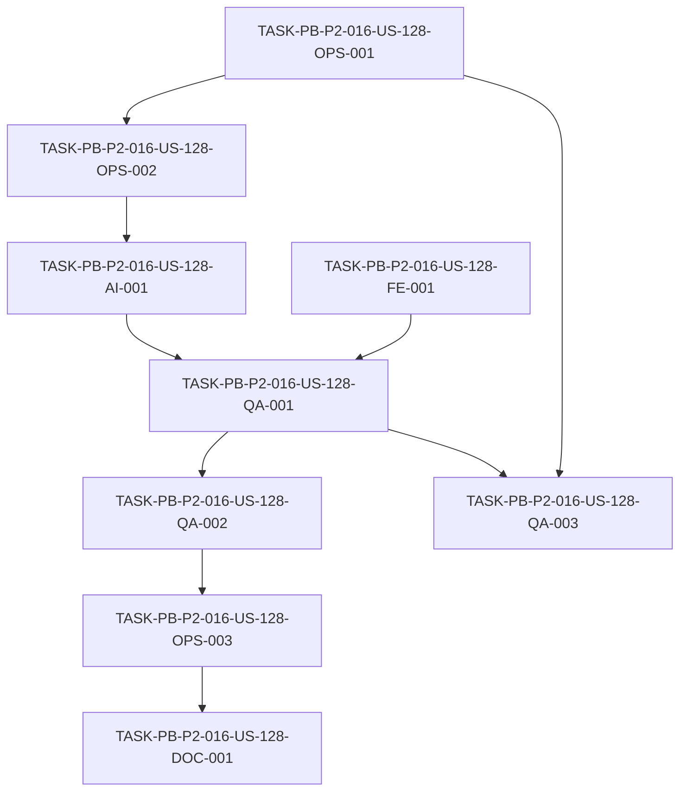

# Development Tasks — PB-P2-016 / US-128: Suite E2E Playwright sobre seed

## 1. Metadata

| Field | Value |
|---|---|
| User Story ID | US-128 |
| Source User Story | `management/user-stories/US-128-e2e-playwright-on-seed.md` |
| Source Technical Specification | `management/technical-specs/P2/PB-P2-016/US-128-technical-spec.md` |
| Decision Resolution Artifact | N/A (no existe) |
| Priority | P2 (Must Have) |
| Backlog ID | PB-P2-016 |
| Backlog Title | Suite E2E Playwright sobre seed (flujo demo principal) |
| Backlog Execution Order | 16 (decimosexto ítem de P2) |
| User Story Position in Backlog Item | 1 de 1 |
| Related User Stories in Backlog Item | US-128 |
| Epic | EPIC-QA-001 |
| Backlog Item Dependencies | PB-P0-014 (seed idempotente), PB-P0-015 (base de CI) |
| Feature | E2E principal — Playwright sobre seed reproducible |
| Module / Domain | QA / Demo |
| Backlog Alignment Status | Found |
| Task Breakdown Status | Ready for Sprint Planning |
| Created Date | 2026-07-07 |
| Last Updated | 2026-07-07 |

---

## 2. Source Validation

| Source | Found | Used | Notes |
|---|---|---|---|
| User Story | Yes | Yes | `Approved with Minor Notes`. |
| Technical Specification | Yes | Yes | `Ready for Task Breakdown`. Fuente primaria. |
| Decision Resolution Artifact | No | No | No existe para US-128. |
| Product Backlog Prioritized | Yes | Yes | PB-P2-016, P2, EPIC-QA-001. |
| ADRs | Yes | Yes | ADR-TEST-001 (E2E con Playwright, Doc 20 §21). |

---

## 3. Backlog Execution Context

### Parent Backlog Item

**PB-P2-016 — Suite E2E Playwright sobre seed** (EPIC-QA-001, P2, Must Have). Playwright sobre seed reproducible del camino demo: auth → event → AI plan → tasks → budget → vendors → QR → quote → compare → booking → review. Flujo pasa en CI; screenshots en fallo; runs sobre seed reset. Dependencias: PB-P0-014, PB-P0-015. Demo readiness depende de esta suite.

### Execution Order Rationale

Decimosexto ítem de P2. Depende de PB-P0-014 (seed) y PB-P0-015 (CI). Cúspide de la pirámide de pruebas; se apoya en US-126 (unit+integration) y US-127 (contract) y precede a los quality gates (PB-P2-020).

### Related User Stories in Same Backlog Item

| User Story | Role in Backlog Item | Suggested Order |
|---|---|---|
| US-128 | Única historia (E2E demo) | 1 |

---

## 4. Task Breakdown Summary

| Area | Number of Tasks | Notes |
|---|---:|---|
| DevOps / Environment (OPS) | 3 | Playwright config + seed reset env + gate de CI |
| AI / PromptOps (AI) | 1 | MockAIProvider en entorno E2E |
| Frontend (FE) | 1 | Selectores estables (`data-testid`/roles) |
| QA / Testing (QA) | 3 | Specs camino demo + smoke/reproducibilidad + evidencia |
| Documentation (DOC) | 1 | Entorno E2E + política de retries |
| **Total** | **9** | |

---

## 5. Traceability Matrix

| Acceptance Criterion | Technical Spec Section | Task IDs |
|---|---|---|
| AC-01 (camino demo end-to-end) | §6, §13 | QA-001 |
| AC-02 (reproducibilidad seed reset) | §10, §15 | OPS-002, QA-002 |
| AC-03 (evidencia en fallo) | §6, §14 | OPS-001, QA-003 |
| AC-04 (IA determinística) | §11 | AI-001 |
| AC-05 (gate CI) | §13, §19 | OPS-003 |

---

## 6. Development Tasks

### TASK-PB-P2-016-US-128-OPS-001 — Configurar Playwright (trace/screenshot on failure, retries, reporter)

| Field | Value |
|---|---|
| Area | DevOps / Environment |
| Type | Setup |
| Priority | Must |
| Estimate | M |
| Depends On | — |
| Source AC(s) | AC-03 |
| Technical Spec Section(s) | §5 (Testing), §6, §14 |
| Backlog ID | PB-P2-016 |
| User Story ID | US-128 |
| Owner Role | QA |
| Status | To Do |

#### Objective
Configurar Playwright con `screenshot: 'only-on-failure'`, `trace: 'retain-on-failure'`, retries acotados, reporter y estructura `frontend/tests/e2e/**`.

#### Scope
##### Include
* `playwright.config.*`, proyectos/browsers, reporter, retries, artefactos on failure.
* Script npm (`test:e2e`, `test:e2e:smoke`).
##### Exclude
* Setup de entorno/seed (OPS-002) y gate de CI (OPS-003).

#### Implementation Notes
Objetivos de duración: smoke <5 min, suite completa <20 min (Doc 20 §21).

#### Acceptance Criteria Covered
AC-03.

#### Definition of Done
- [ ] Playwright ejecuta `test:e2e` localmente.
- [ ] Screenshot y trace se generan solo en fallo.
- [ ] Retries acotados configurados.

---

### TASK-PB-P2-016-US-128-OPS-002 — Setup de entorno E2E + seed reset previo

| Field | Value |
|---|---|
| Area | DevOps / Environment |
| Type | Setup |
| Priority | Must |
| Estimate | M |
| Depends On | OPS-001 |
| Source AC(s) | AC-02 |
| Technical Spec Section(s) | §7, §10, §15 |
| Backlog ID | PB-P2-016 |
| User Story ID | US-128 |
| Owner Role | DevOps |
| Status | To Do |

#### Objective
Configurar el entorno de ejecución E2E (app frontend + backend con seed) y aplicar seed reset idempotente (PB-P0-014) antes de cada corrida, con fail-fast si no completa.

#### Scope
##### Include
* Arranque del entorno E2E (local con seed o desplegado, según Tech Lead).
* Ejecución de `npm run seed` (reset) previa a la suite; fail-fast en fallo (VR-01/EC-01).
##### Exclude
* Creación/modificación del seed (PB-P0-014).

#### Implementation Notes
Confirmar entorno con Tech Lead (nota no bloqueante, DOC-001).

#### Acceptance Criteria Covered
AC-02.

#### Definition of Done
- [ ] Entorno E2E arranca con datos del seed.
- [ ] Seed reset se aplica antes de la corrida.
- [ ] Fail-fast verificado si el seed reset no completa.

---

### TASK-PB-P2-016-US-128-AI-001 — MockAIProvider en el entorno E2E

| Field | Value |
|---|---|
| Area | AI / PromptOps |
| Type | Setup |
| Priority | Must |
| Estimate | S |
| Depends On | OPS-002 |
| Source AC(s) | AC-04 |
| Technical Spec Section(s) | §11 |
| Backlog ID | PB-P2-016 |
| User Story ID | US-128 |
| Owner Role | AI |
| Status | To Do |

#### Objective
Asegurar que el backend del entorno E2E usa `MockAIProvider` (sin `OPENAI_API_KEY`) para los pasos de IA del camino demo.

#### Scope
##### Include
* Configuración del entorno para forzar `MockAIProvider`.
* Fixtures mock conformes a schema para plan/checklist/presupuesto/comparación.
##### Exclude
* Escenarios de error/fallback de IA (PB-P2-017).

#### Implementation Notes
Determinismo (Doc 20 §25.4, PT-04); sin llamadas externas.

#### Acceptance Criteria Covered
AC-04.

#### Definition of Done
- [ ] Entorno E2E usa `MockAIProvider`.
- [ ] Pasos de IA del flujo son determinísticos.

---

### TASK-PB-P2-016-US-128-FE-001 — Selectores estables (`data-testid`/roles) en el camino demo

| Field | Value |
|---|---|
| Area | Frontend |
| Type | Implementation |
| Priority | Should |
| Estimate | S |
| Depends On | — |
| Source AC(s) | AC-01 |
| Technical Spec Section(s) | §8, §17 |
| Backlog ID | PB-P2-016 |
| User Story ID | US-128 |
| Owner Role | Frontend |
| Status | To Do |

#### Objective
Añadir `data-testid`/roles estables en los componentes del camino demo donde falten, para selectores E2E robustos.

#### Scope
##### Include
* Identificadores estables en formularios/acciones del camino demo (login, evento, quote, review).
##### Exclude
* Cambios funcionales de UI.

#### Implementation Notes
Solo donde el E2E lo requiera; minimizar cambios.

#### Acceptance Criteria Covered
AC-01.

#### Definition of Done
- [ ] Selectores estables disponibles para los pasos del camino demo.

---

### TASK-PB-P2-016-US-128-QA-001 — Specs E2E del camino demo del organizador

| Field | Value |
|---|---|
| Area | QA / Testing |
| Type | Test |
| Priority | Must |
| Estimate | L |
| Depends On | AI-001, FE-001 |
| Source AC(s) | AC-01 |
| Technical Spec Section(s) | §6, §13 |
| Backlog ID | PB-P2-016 |
| User Story ID | US-128 |
| Owner Role | QA |
| Status | To Do |

#### Objective
Escribir los specs Playwright que recorren el camino demo end-to-end: auth → event → plan IA (Mock) → tasks → budget → vendors → quote request → compare quotes → booking intent → review.

#### Scope
##### Include
* Pasos TS-01..TS-07 (Doc 20 §25.1) sobre datos del seed.
* Human-in-the-loop IA (aceptar/editar/rechazar).
##### Exclude
* Escenarios negativos de seguridad/A11Y (otras suites).

#### Implementation Notes
Aprovechar datos preexistentes del seed (vendors aprobados, quotes).

#### Acceptance Criteria Covered
AC-01.

#### Definition of Done
- [ ] Camino demo completo cubierto por specs.
- [ ] Suite verde sobre seed.

---

### TASK-PB-P2-016-US-128-QA-002 — Smoke subset + verificación de reproducibilidad

| Field | Value |
|---|---|
| Area | QA / Testing |
| Type | Test |
| Priority | Must |
| Estimate | S |
| Depends On | QA-001 |
| Source AC(s) | AC-02 |
| Technical Spec Section(s) | §13, §15 |
| Backlog ID | PB-P2-016 |
| User Story ID | US-128 |
| Owner Role | QA |
| Status | To Do |

#### Objective
Definir un subset smoke (rápido) del camino demo para PR y verificar la reproducibilidad de la suite sobre seed reset en corridas repetidas.

#### Scope
##### Include
* Etiquetado/selección de smoke E2E.
* Ejecución repetida para confirmar reproducibilidad.
##### Exclude
* Wiring del pipeline (OPS-003).

#### Implementation Notes
Objetivo smoke <5 min (Doc 20 §21).

#### Acceptance Criteria Covered
AC-02.

#### Definition of Done
- [ ] Smoke subset definido y verde.
- [ ] Reproducibilidad confirmada en corridas repetidas.

---

### TASK-PB-P2-016-US-128-QA-003 — Verificación de evidencia (screenshot/trace) en fallo

| Field | Value |
|---|---|
| Area | QA / Testing |
| Type | Test |
| Priority | Must |
| Estimate | XS |
| Depends On | OPS-001, QA-001 |
| Source AC(s) | AC-03 |
| Technical Spec Section(s) | §6, §14 |
| Backlog ID | PB-P2-016 |
| User Story ID | US-128 |
| Owner Role | QA |
| Status | To Do |

#### Objective
Verificar que ante un fallo E2E se generan screenshot y trace adjuntos al reporte, sin secretos.

#### Scope
##### Include
* Simular un fallo y confirmar artefactos de evidencia.
* Confirmar ausencia de secretos en artefactos (SEC-03).
##### Exclude
* —

#### Implementation Notes
VR-04.

#### Acceptance Criteria Covered
AC-03.

#### Definition of Done
- [ ] Screenshot y trace se adjuntan en fallo.
- [ ] Sin secretos en artefactos de evidencia.

---

### TASK-PB-P2-016-US-128-OPS-003 — Gate de CI (smoke E2E en PR + suite completa pre-demo)

| Field | Value |
|---|---|
| Area | DevOps / Environment |
| Type | Setup |
| Priority | Must |
| Estimate | M |
| Depends On | QA-002 |
| Source AC(s) | AC-05 |
| Technical Spec Section(s) | §13 (CI Checks), §19 |
| Backlog ID | PB-P2-016 |
| User Story ID | US-128 |
| Owner Role | DevOps |
| Status | To Do |

#### Objective
Integrar el smoke E2E como compuerta obligatoria en cada PR y la suite completa como compuerta pre-demo/merge protegido; bloquear ante fallo del camino crítico.

#### Scope
##### Include
* Job de CI que aplica seed reset y ejecuta smoke E2E en PR.
* Ejecución de la suite completa pre-demo; publicación de artefactos de evidencia.
##### Exclude
* Consolidación completa de quality gates (PB-P2-020).

#### Implementation Notes
Aprovechar la base de CI de PB-P0-015; sin secretos de IA reales.

#### Acceptance Criteria Covered
AC-05.

#### Definition of Done
- [ ] Smoke E2E corre en cada PR y bloquea ante fallo.
- [ ] Suite completa pre-demo disponible y bloqueante.
- [ ] Artefactos de evidencia publicados en CI.

---

### TASK-PB-P2-016-US-128-DOC-001 — Documentar entorno E2E y política de retries

| Field | Value |
|---|---|
| Area | Documentation / Traceability |
| Type | Documentation |
| Priority | Should |
| Estimate | XS |
| Depends On | OPS-003 |
| Source AC(s) | AC-02, AC-05 |
| Technical Spec Section(s) | §16, §19 |
| Backlog ID | PB-P2-016 |
| User Story ID | US-128 |
| Owner Role | Tech Lead |
| Status | To Do |

#### Objective
Documentar el entorno de ejecución E2E elegido (local con seed vs desplegado), el comando de seed reset y la política de retries en CI.

#### Scope
##### Include
* Sección en README/CONTRIBUTING sobre cómo correr la suite E2E y el smoke.
* Nota de Documentation Alignment (entorno/retries).
##### Exclude
* —

#### Implementation Notes
Resuelve la alerta de Documentation Alignment no bloqueante.

#### Acceptance Criteria Covered
AC-02, AC-05.

#### Definition of Done
- [ ] Entorno E2E y comandos documentados.
- [ ] Política de retries registrada.

---

## 7. Required QA Tasks

| Task ID | Test Type | Purpose |
|---|---|---|
| QA-001 | E2E | Camino demo del organizador end-to-end |
| QA-002 | E2E (smoke/reproducibility) | Smoke subset + reproducibilidad sobre seed reset |
| QA-003 | E2E (evidence) | Screenshot/trace en fallo, sin secretos |

---

## 8. Required Security Tasks

`No aplica como suite dedicada` — la historia ejercita solo el login real; los escenarios negativos de seguridad se cubren en PB-P2-018. Requisito transversal: sin secretos en logs/traces/screenshots (verificado en QA-003).

---

## 9. Required Seed / Demo Tasks

| Task ID | Seed/Demo Concern | Purpose |
|---|---|---|
| OPS-002 | Seed reset previo (consumo de PB-P0-014) | Reproducibilidad del entorno E2E |

---

## 10. Observability / Audit Tasks

`No aplica` — tests E2E; solo se exige ausencia de secretos en artefactos (QA-003) y evidencia de fallo publicada en CI (OPS-003).

---

## 11. Documentation / Traceability Tasks

| Task ID | Document / Artifact | Purpose |
|---|---|---|
| DOC-001 | README/CONTRIBUTING E2E | Entorno E2E + seed reset + política de retries |

---

## 12. Dependency Graph

---

## 13. Suggested Implementation Order

### Phase 1 — Foundation
* OPS-001 (Playwright config)
* OPS-002 (entorno + seed reset), AI-001 (MockAIProvider)
* FE-001 (selectores estables)

### Phase 2 — Core Implementation
* QA-001 (specs del camino demo)

### Phase 3 — Validation / Security / QA
* QA-002 (smoke + reproducibilidad)
* QA-003 (evidencia en fallo)
* OPS-003 (gate de CI)

### Phase 4 — Documentation / Review
* DOC-001 (entorno E2E + retries)

---

## 14. Risks & Mitigations

| Risk | Impact | Mitigation | Related Task |
|---|---|---|---|
| Flakiness E2E | CI inestable | Selectores estables, auto-waiting, retries acotados | FE-001, OPS-001, QA-002 |
| Seed reset fallido | Corrida no reproducible | Fail-fast en setup | OPS-002 |
| IA real en E2E | No determinismo | `MockAIProvider` obligatorio | AI-001 |
| Suite E2E lenta | CI/demo lento | Smoke subset en PR; suite completa pre-demo | QA-002, OPS-003 |
| Datos demo insuficientes | Pasos del flujo fallan | Depender de volúmenes mínimos de PB-P0-014 | OPS-002 |

---

## 15. Out of Scope Confirmation

* Suite unit + integration del backend (US-126 / PB-P2-014).
* Suite contract con MSW (US-127 / PB-P2-015).
* Suite IA ampliada (PB-P2-017) y error/fallback de IA.
* Suite RBAC/seguridad negativa (PB-P2-018).
* Suite A11Y (PB-P2-019).
* Creación/modificación del seed (PB-P0-014) y del backend/DB.
* Llamadas reales a proveedores de IA en CI.

---

## 16. Readiness for Sprint Planning

| Check | Status |
|---|---|
| Product Backlog mapping found | Pass |
| Every AC maps to tasks | Pass |
| Technical Spec used when available | Pass |
| QA tasks included | Pass |
| Security tasks included if applicable | N/A (login real; negativos en PB-P2-018) |
| Seed/demo tasks included if applicable | Pass |
| Observability tasks included if applicable | N/A |
| Documentation tasks included if applicable | Pass |
| Task dependencies clear | Pass |
| Tasks small enough | Pass (QA-001 estimada L; revisar división por sub-flujos si excede) |
| Ready for Sprint Planning | Yes |

---

## 17. Final Recommendation

`Ready for Sprint Planning`

Las 9 tareas cubren todos los Acceptance Criteria (AC-01..AC-05), mapean a secciones del Technical Spec y respetan el orden de dependencias (config → entorno/seed/IA/selectores → specs → smoke/evidencia/gate → documentación). Se incluyen QA (camino demo, smoke, evidencia), seed/demo (reset), IA (MockAIProvider) y documentación. La única alerta es de Documentation Alignment **no bloqueante** (entorno E2E/retries), gestionada en OPS-002/DOC-001. `QA-001` está estimada como `L`: si al implementar excede, dividir por sub-flujos (auth/event/IA vs vendors/quote/booking/review). Sin bloqueos ni scope creep.
