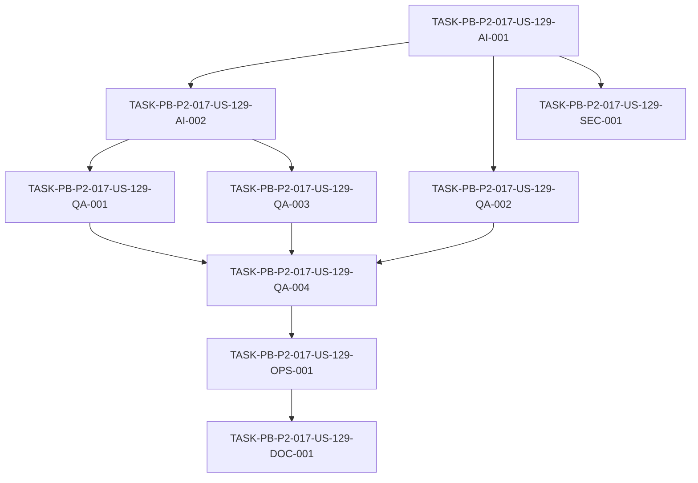

# Development Tasks — PB-P2-017 / US-129: Suite IA con MockAIProvider

## 1. Metadata

| Field | Value |
|---|---|
| User Story ID | US-129 |
| Source User Story | `management/user-stories/US-129-ai-tests-with-mock-provider.md` |
| Source Technical Specification | `management/technical-specs/P2/PB-P2-017/US-129-technical-spec.md` |
| Decision Resolution Artifact | N/A (no existe) |
| Priority | P2 (Must Have) |
| Backlog ID | PB-P2-017 |
| Backlog Title | Suite IA con MockAIProvider (tests deterministas) |
| Backlog Execution Order | 17 (decimoséptimo ítem de P2) |
| User Story Position in Backlog Item | 1 de 1 |
| Related User Stories in Backlog Item | US-129 |
| Epic | EPIC-QA-001 |
| Backlog Item Dependencies | PB-P0-009, PB-P0-010, PB-P0-011, PB-P0-015 |
| Feature | AI tests deterministic — MockAIProvider |
| Module / Domain | QA / AI |
| Backlog Alignment Status | Found |
| Task Breakdown Status | Ready for Sprint Planning |
| Created Date | 2026-07-07 |
| Last Updated | 2026-07-07 |

---

## 2. Source Validation

| Source | Found | Used | Notes |
|---|---|---|---|
| User Story | Yes | Yes | `Approved with Minor Notes`. |
| Technical Specification | Yes | Yes | `Ready for Task Breakdown`. Fuente primaria. |
| Decision Resolution Artifact | No | No | No existe para US-129. |
| Product Backlog Prioritized | Yes | Yes | PB-P2-017, P2, EPIC-QA-001. |
| ADRs | Yes | Yes | ADR-TEST-001 (Vitest); MockAIProvider obligatorio. |

---

## 3. Backlog Execution Context

### Parent Backlog Item

**PB-P2-017 — Suite IA con MockAIProvider** (EPIC-QA-001, P2, Must Have). Tests por feature IA con outputs deterministas del Mock, validación Zod, timeout 60s y reintentos. Mock activado por env en CI; cobertura de las 7 features IA del MVP; tests <60s. Dependencias: PB-P0-009..011, PB-P0-015.

### Execution Order Rationale

Decimoséptimo ítem de P2. Depende de la capa de IA base (PB-P0-009..011) y de la CI (PB-P0-015). Suite dedicada de IA que complementa a US-126.

### Related User Stories in Same Backlog Item

| User Story | Role in Backlog Item | Suggested Order |
|---|---|---|
| US-129 | Única historia (suite IA determinista) | 1 |

---

## 4. Task Breakdown Summary

| Area | Number of Tasks | Notes |
|---|---:|---|
| AI / PromptOps (AI) | 2 | Activación Mock por env + fixtures por feature |
| QA / Testing (QA) | 4 | Por feature, timeout/fallback/JSON, persistencia, determinismo/<60s |
| Security / Authorization (SEC) | 1 | Prohibir IA real en CI; sin secretos/PII |
| DevOps / Environment (OPS) | 1 | Gate de CI |
| Documentation (DOC) | 1 | Set de 7 features + activación Mock |
| **Total** | **9** | |

---

## 5. Traceability Matrix

| Acceptance Criterion | Technical Spec Section | Task IDs |
|---|---|---|
| AC-01 (Mock por env en CI) | §5, §11 | AI-001, SEC-001 |
| AC-02 (7 features + Zod) | §11, §13 | AI-002, QA-001 |
| AC-03 (timeout/JSON) | §7, §11, §13 | QA-002 |
| AC-04 (persistencia AIRecommendation) | §10, §11 | QA-003 |
| AC-05 (determinismo/<60s/CI) | §13, §17 | QA-004, OPS-001 |

---

## 6. Development Tasks

### TASK-PB-P2-017-US-129-AI-001 — Activación de MockAIProvider por variable de entorno

| Field | Value |
|---|---|
| Area | AI / PromptOps |
| Type | Setup |
| Priority | Must |
| Estimate | S |
| Depends On | — |
| Source AC(s) | AC-01 |
| Technical Spec Section(s) | §5, §11 |
| Backlog ID | PB-P2-017 |
| User Story ID | US-129 |
| Owner Role | AI |
| Status | To Do |

#### Objective
Configurar la activación de `MockAIProvider` por variable de entorno para el entorno de prueba/CI, garantizando que no se use `OpenAIProvider` real.

#### Scope
##### Include
* Helper/env que fuerza `MockAIProvider` vía `LLMProvider`.
* Verificación de ausencia de `OPENAI_API_KEY` en CI.
##### Exclude
* Fixtures (AI-002) y tests (QA-*).

#### Implementation Notes
BR-AI-005; Doc 20 §7 AI-T-01.

#### Acceptance Criteria Covered
AC-01.

#### Definition of Done
- [ ] `MockAIProvider` se activa por env en pruebas/CI.
- [ ] IA real bloqueada (sin `OPENAI_API_KEY`).

---

### TASK-PB-P2-017-US-129-AI-002 — Fixtures deterministas por feature de IA

| Field | Value |
|---|---|
| Area | AI / PromptOps |
| Type | Setup |
| Priority | Must |
| Estimate | M |
| Depends On | AI-001 |
| Source AC(s) | AC-02 |
| Technical Spec Section(s) | §11, §13 |
| Backlog ID | PB-P2-017 |
| User Story ID | US-129 |
| Owner Role | AI |
| Status | To Do |

#### Objective
Crear fixtures versionados (`tests/fixtures/ai-responses/**`) por cada una de las 7 features (AI-001..006, AI-008), con input/output conformes a esquema y idioma parametrizado.

#### Scope
##### Include
* Fixtures de input y salida mock por feature.
* Idioma parametrizado (BR-AI-011).
##### Exclude
* Aserciones (QA-001).

#### Implementation Notes
Sin PII real (SEC-03).

#### Acceptance Criteria Covered
AC-02.

#### Definition of Done
- [ ] Fixtures por feature disponibles y conformes a schema.
- [ ] Idioma parametrizado en el input.

---

### TASK-PB-P2-017-US-129-QA-001 — Tests por feature con validación Zod estricta

| Field | Value |
|---|---|
| Area | QA / Testing |
| Type | Test |
| Priority | Must |
| Estimate | L |
| Depends On | AI-002 |
| Source AC(s) | AC-02 |
| Technical Spec Section(s) | §11, §13 |
| Backlog ID | PB-P2-017 |
| User Story ID | US-129 |
| Owner Role | QA |
| Status | To Do |

#### Objective
Escribir tests deterministas por cada feature (AI-001 plan, AI-002 checklist, AI-003 presupuesto, AI-004 categorías, AI-005 brief, AI-006 resumen comparativo, AI-008 priorización) validando la salida contra su esquema Zod con asserts estrictos.

#### Scope
##### Include
* 7 specs (uno por feature) con asserts de estructura/schema.
##### Exclude
* Timeout/JSON (QA-002) y persistencia (QA-003).

#### Implementation Notes
Asserts sobre schema, no texto literal (evitar falsos positivos).

#### Acceptance Criteria Covered
AC-02.

#### Definition of Done
- [ ] 7 features cubiertas con validación Zod estricta.
- [ ] Suite verde y determinística.

---

### TASK-PB-P2-017-US-129-QA-002 — Tests de timeout 60s, fallback y JSON inválido

| Field | Value |
|---|---|
| Area | QA / Testing |
| Type | Test |
| Priority | Must |
| Estimate | M |
| Depends On | AI-001 |
| Source AC(s) | AC-03 |
| Technical Spec Section(s) | §7, §11, §13 |
| Backlog ID | PB-P2-017 |
| User Story ID | US-129 |
| Owner Role | QA |
| Status | To Do |

#### Objective
Verificar el comportamiento transversal: timeout 60s → error controlado + `fallbackUsed=true`; JSON inválido → error semántico sin crash; reintentos según PB-P0-011.

#### Scope
##### Include
* Timeout simulado con fake timers (sin espera real de 60s).
* JSON inválido → error semántico manejado.
* Reintentos.
##### Exclude
* Cobertura por feature (QA-001).

#### Implementation Notes
Usar fake timers para no penalizar el tiempo total (<60s).

#### Acceptance Criteria Covered
AC-03.

#### Definition of Done
- [ ] Timeout produce `fallbackUsed=true`.
- [ ] JSON inválido produce error semántico sin crash.
- [ ] Reintentos verificados.

---

### TASK-PB-P2-017-US-129-QA-003 — Tests de persistencia de AIRecommendation

| Field | Value |
|---|---|
| Area | QA / Testing |
| Type | Test |
| Priority | Must |
| Estimate | M |
| Depends On | AI-002 |
| Source AC(s) | AC-04 |
| Technical Spec Section(s) | §10, §11 |
| Backlog ID | PB-P2-017 |
| User Story ID | US-129 |
| Owner Role | QA |
| Status | To Do |

#### Objective
Validar que `AIRecommendation` persiste con `llm_provider`, `prompt_version_id`, `latency_ms` y `fallback_used` conforme al contrato (BR-AI-007/010), usando BD efímera.

#### Scope
##### Include
* Verificación de campos clave de `AIRecommendation`.
* BD efímera + reset (reutilizar helper `test-db` si existe).
##### Exclude
* Cambios de esquema.

#### Implementation Notes
Sin PII real en registros de prueba.

#### Acceptance Criteria Covered
AC-04.

#### Definition of Done
- [ ] Persistencia de `AIRecommendation` validada con campos clave.
- [ ] Aislamiento por test.

---

### TASK-PB-P2-017-US-129-QA-004 — Determinismo y tiempo total <60s

| Field | Value |
|---|---|
| Area | QA / Testing |
| Type | Test |
| Priority | Must |
| Estimate | S |
| Depends On | QA-001, QA-002, QA-003 |
| Source AC(s) | AC-05 |
| Technical Spec Section(s) | §13, §17 |
| Backlog ID | PB-P2-017 |
| User Story ID | US-129 |
| Owner Role | QA |
| Status | To Do |

#### Objective
Verificar que la suite IA es determinística (0 falsos positivos) en corridas repetidas y que el tiempo total es <60s.

#### Scope
##### Include
* Ejecución repetida estable.
* Medición/objetivo de tiempo total <60s (fake timers en timeouts).
##### Exclude
* Wiring del pipeline (OPS-001).

#### Implementation Notes
VR-04: alertar/fallar si excede 60s.

#### Acceptance Criteria Covered
AC-05.

#### Definition of Done
- [ ] Suite estable en corridas repetidas (0 falsos positivos).
- [ ] Tiempo total <60s.

---

### TASK-PB-P2-017-US-129-SEC-001 — Prohibir IA real en CI y evitar secretos/PII

| Field | Value |
|---|---|
| Area | Security / Authorization |
| Type | Test |
| Priority | Must |
| Estimate | XS |
| Depends On | AI-001 |
| Source AC(s) | AC-01 |
| Technical Spec Section(s) | §12 |
| Backlog ID | PB-P2-017 |
| User Story ID | US-129 |
| Owner Role | QA |
| Status | To Do |

#### Objective
Verificar que en CI no se ejecuta IA real (sin `OPENAI_API_KEY`) y que los fixtures/logs no contienen secretos ni PII real.

#### Scope
##### Include
* Aserción/guardrail de ausencia de `OPENAI_API_KEY` en CI.
* Verificación de fixtures/logs sin secretos/PII.
##### Exclude
* —

#### Implementation Notes
SEC-02, SEC-03; Doc 20 §26 (sin PII real).

#### Acceptance Criteria Covered
AC-01.

#### Definition of Done
- [ ] IA real bloqueada en CI (verificado).
- [ ] Sin secretos ni PII en fixtures/logs.

---

### TASK-PB-P2-017-US-129-OPS-001 — Gate de CI para la suite IA

| Field | Value |
|---|---|
| Area | DevOps / Environment |
| Type | Setup |
| Priority | Must |
| Estimate | S |
| Depends On | QA-004 |
| Source AC(s) | AC-05 |
| Technical Spec Section(s) | §13 (CI Checks), §19 |
| Backlog ID | PB-P2-017 |
| User Story ID | US-129 |
| Owner Role | DevOps |
| Status | To Do |

#### Objective
Integrar la suite IA como compuerta obligatoria de CI (Mock por env), que bloquea el merge ante fallos y verifica el objetivo de <60s.

#### Scope
##### Include
* Job de CI que ejecuta la suite IA con `MockAIProvider`.
* Bloqueo de merge ante fallos; sin `OPENAI_API_KEY`.
##### Exclude
* Consolidación completa de quality gates (PB-P2-020).

#### Implementation Notes
Aprovechar la base de CI de PB-P0-015.

#### Acceptance Criteria Covered
AC-05.

#### Definition of Done
- [ ] CI ejecuta la suite IA en cada PR.
- [ ] Merge bloqueado ante fallo.
- [ ] CI sin IA real.

---

### TASK-PB-P2-017-US-129-DOC-001 — Documentar set de 7 features y activación del Mock

| Field | Value |
|---|---|
| Area | Documentation / Traceability |
| Type | Documentation |
| Priority | Should |
| Estimate | XS |
| Depends On | OPS-001 |
| Source AC(s) | AC-01, AC-02 |
| Technical Spec Section(s) | §16, §19 |
| Backlog ID | PB-P2-017 |
| User Story ID | US-129 |
| Owner Role | Tech Lead |
| Status | To Do |

#### Objective
Documentar el set de 7 features cubiertas (AI-001..006, AI-008), la decisión sobre AI-007 y la forma de activar `MockAIProvider` por env.

#### Scope
##### Include
* Documentación del set de features y variable de entorno del Mock.
* Nota de Documentation Alignment (inclusión de AI-007).
##### Exclude
* —

#### Implementation Notes
Resuelve la alerta no bloqueante sobre el set de features.

#### Acceptance Criteria Covered
AC-01, AC-02.

#### Definition of Done
- [ ] Set de 7 features documentado.
- [ ] Activación del Mock por env documentada.
- [ ] Decisión sobre AI-007 registrada.

---

## 7. Required QA Tasks

| Task ID | Test Type | Purpose |
|---|---|---|
| QA-001 | Unit/AI | 7 features con validación Zod estricta |
| QA-002 | AI (negative) | Timeout/fallback/JSON inválido/reintentos |
| QA-003 | Integration/AI | Persistencia de `AIRecommendation` |
| QA-004 | Determinism | 0 falsos positivos + tiempo <60s |
| SEC-001 | Security | Sin IA real en CI; sin secretos/PII |

---

## 8. Required Security Tasks

| Task ID | Security Concern | Purpose |
|---|---|---|
| SEC-001 | IA real / secretos / PII | Bloquear IA real en CI; sin secretos ni PII en fixtures/logs |

---

## 9. Required Seed / Demo Tasks

`No aplica` — la historia no modifica el seed; usa fixtures propios de prueba.

---

## 10. Observability / Audit Tasks

`No aplica como tarea dedicada` — la validación de `latencyMs` y `AIRecommendation` se cubre en QA-003; ausencia de secretos en logs en SEC-001.

---

## 11. Documentation / Traceability Tasks

| Task ID | Document / Artifact | Purpose |
|---|---|---|
| DOC-001 | Documentación de la suite IA | Set de 7 features + activación del Mock por env + decisión AI-007 |

---

## 12. Dependency Graph

---

## 13. Suggested Implementation Order

### Phase 1 — Foundation
* AI-001 (activación Mock por env)
* AI-002 (fixtures por feature)

### Phase 2 — Core Implementation
* QA-001 (tests por feature)
* QA-002 (timeout/fallback/JSON)
* QA-003 (persistencia)

### Phase 3 — Validation / Security / QA
* SEC-001 (sin IA real / sin secretos)
* QA-004 (determinismo + <60s)
* OPS-001 (gate de CI)

### Phase 4 — Documentation / Review
* DOC-001 (set de features + activación Mock)

---

## 14. Risks & Mitigations

| Risk | Impact | Mitigation | Related Task |
|---|---|---|---|
| Asserts sobre texto literal | Falsos positivos | Asserts por schema/estructura | QA-001 |
| IA real en CI | Costos/flakiness | `MockAIProvider` por env; sin `OPENAI_API_KEY` | AI-001, SEC-001 |
| Suite lenta (>60s) | Objetivo incumplido | Fake timers para timeouts; fixtures ligeros | QA-002, QA-004 |
| Persistencia frágil | Tests inestables | BD efímera + reset | QA-003 |
| Ambigüedad de las 7 features | Cobertura incorrecta | Documentar set; confirmar AI-007 | DOC-001 |

---

## 15. Out of Scope Confirmation

* Pruebas con `OpenAIProvider` real en CI.
* HITL de IA en UI (frontend/E2E, US-128).
* Feature AI-007 (bio proveedor) salvo confirmación de Tech Lead.
* Generación de imágenes IA (BR-AI-015).
* Suite unit+integration general (US-126), contract (US-127), E2E (US-128).
* Cambios en la capa de IA productiva o en el esquema.

---

## 16. Readiness for Sprint Planning

| Check | Status |
|---|---|
| Product Backlog mapping found | Pass |
| Every AC maps to tasks | Pass |
| Technical Spec used when available | Pass |
| QA tasks included | Pass |
| Security tasks included if applicable | Pass |
| Seed/demo tasks included if applicable | N/A |
| Observability tasks included if applicable | N/A (cubierto en QA-003/SEC-001) |
| Documentation tasks included if applicable | Pass |
| Task dependencies clear | Pass |
| Tasks small enough | Pass (QA-001 estimada L; dividir por feature si excede) |
| Ready for Sprint Planning | Yes |

---

## 17. Final Recommendation

`Ready for Sprint Planning`

Las 9 tareas cubren todos los Acceptance Criteria (AC-01..AC-05), mapean a secciones del Technical Spec y respetan el orden de dependencias (activación Mock/fixtures → tests por feature/timeout/persistencia → seguridad/determinismo/gate → documentación). Se incluyen QA (por feature, timeout/fallback/JSON, persistencia, determinismo), seguridad (sin IA real/secretos) y documentación. La única alerta es de Documentation Alignment **no bloqueante** (definición del set de 7 features / AI-007), gestionada en DOC-001. `QA-001` está estimada como `L`; si al implementar excede, dividir por feature. Sin bloqueos ni scope creep.
