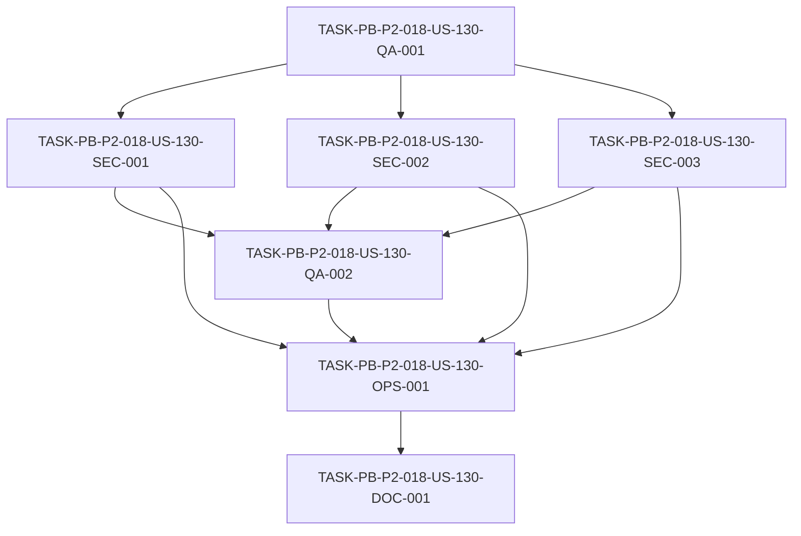

# Development Tasks — PB-P2-018 / US-130: Suite RBAC negativa extendida

## 1. Metadata

| Field | Value |
|---|---|
| User Story ID | US-130 |
| Source User Story | `management/user-stories/US-130-rbac-negative-suite.md` |
| Source Technical Specification | `management/technical-specs/P2/PB-P2-018/US-130-technical-spec.md` |
| Decision Resolution Artifact | N/A (no existe) |
| Priority | P2 (Must Have) |
| Backlog ID | PB-P2-018 |
| Backlog Title | Suite RBAC negativa extendida (RBAC + ownership + assignment por dominio) |
| Backlog Execution Order | 18 (decimoctavo ítem de P2) |
| User Story Position in Backlog Item | 1 de 1 |
| Related User Stories in Backlog Item | US-130 |
| Epic | EPIC-QA-001 |
| Backlog Item Dependencies | PB-P0-008 (suite base de tests negativos RBAC + ownership) |
| Feature | Tests negativos RBAC/ownership/assignment |
| Module / Domain | QA / Security |
| Backlog Alignment Status | Found |
| Task Breakdown Status | Ready for Sprint Planning |
| Created Date | 2026-07-07 |
| Last Updated | 2026-07-07 |

---

## 2. Source Validation

| Source | Found | Used | Notes |
|---|---|---|---|
| User Story | Yes | Yes | `Approved with Minor Notes`. |
| Technical Specification | Yes | Yes | `Ready for Task Breakdown`. Fuente primaria. |
| Decision Resolution Artifact | No | No | No existe para US-130. |
| Product Backlog Prioritized | Yes | Yes | PB-P2-018, P2, EPIC-QA-001. |
| ADRs | Yes | Yes | ADR-SEC-001 (autorización); ADR-TEST-001 (Supertest). |

---

## 3. Backlog Execution Context

### Parent Backlog Item

**PB-P2-018 — Suite RBAC negativa extendida** (EPIC-QA-001, P2, Must Have). Extiende PB-P0-008 con casos negativos por dominio: organizer/vendor/admin invadiendo recursos ajenos, escalamiento de privilegios, assignment incorrecto en QR/Quote. Cobertura por dominio; fallos hacen fallar el merge. Dependencia: PB-P0-008.

### Execution Order Rationale

Decimoctavo ítem de P2. Depende de PB-P0-008 (base negativa) y la extiende con cobertura por dominio. Complementa a US-126 con una suite API negativa exhaustiva.

### Related User Stories in Same Backlog Item

| User Story | Role in Backlog Item | Suggested Order |
|---|---|---|
| US-130 | Única historia (RBAC negativa extendida) | 1 |

---

## 4. Task Breakdown Summary

| Area | Number of Tasks | Notes |
|---|---:|---|
| QA / Testing (QA) | 2 | Fixtures/helper + aserción de envelope sin fuga |
| Security / Authorization (SEC) | 3 | Organizer (ownership), Vendor (assignment), Admin/escalamiento/aislamiento |
| DevOps / Environment (OPS) | 1 | Gate de cobertura de endpoints sensibles + CI |
| Documentation (DOC) | 1 | Matriz endpoint×rol + convención 403/404 |
| **Total** | **7** | |

---

## 5. Traceability Matrix

| Acceptance Criterion | Technical Spec Section | Task IDs |
|---|---|---|
| AC-01 (cobertura por endpoint) | §6, §13, §16 | OPS-001, SEC-001, SEC-002, SEC-003 |
| AC-02 (por dominio) | §12, §13 | SEC-001, SEC-002, SEC-003 |
| AC-03 (envelope sin fuga) | §7, §12 | QA-002 |
| AC-04 (backend SoT) | §5, §9 | QA-001 |
| AC-05 (gate CI) | §13, §19 | OPS-001 |

---

## 6. Development Tasks

### TASK-PB-P2-018-US-130-QA-001 — Fixtures multi-cuenta por rol + helper de autenticación de prueba

| Field | Value |
|---|---|
| Area | QA / Testing |
| Type | Setup |
| Priority | Must |
| Estimate | M |
| Depends On | — |
| Source AC(s) | AC-04 |
| Technical Spec Section(s) | §5, §9, §10 |
| Backlog ID | PB-P2-018 |
| User Story ID | US-130 |
| Owner Role | QA |
| Status | To Do |

#### Objective
Crear fixtures de recursos protegidos con múltiples cuentas por rol (organizer A/B, vendor asignado/no asignado, admin/no-admin) y un helper de autenticación de prueba por rol, sobre BD efímera (Supertest).

#### Scope
##### Include
* Fixtures de Event, VendorProfile, QuoteRequest, Quote, Review con cuentas por rol.
* Helper para autenticar como cada rol/cuenta en tests API.
##### Exclude
* Los casos negativos (SEC-*).

#### Implementation Notes
Reutilizar helper `test-db` de US-126 si existe; sin PII real.

#### Acceptance Criteria Covered
AC-04.

#### Definition of Done
- [ ] Fixtures multi-cuenta por rol disponibles.
- [ ] Helper de auth de prueba por rol funcional.
- [ ] Tests golpean la API directamente (backend source of truth).

---

### TASK-PB-P2-018-US-130-SEC-001 — Casos negativos organizer (ownership + aislamiento)

| Field | Value |
|---|---|
| Area | Security / Authorization |
| Type | Test |
| Priority | Must |
| Estimate | M |
| Depends On | QA-001 |
| Source AC(s) | AC-01, AC-02 |
| Technical Spec Section(s) | §12, §13 |
| Backlog ID | PB-P2-018 |
| User Story ID | US-130 |
| Owner Role | QA |
| Status | To Do |

#### Objective
Escribir casos negativos donde un `organizer` accede a eventos/recursos ajenos y donde se rompe el aislamiento entre cuentas del mismo rol, esperando 403/404 (BR-AUTH-006, BR-AUTH-009).

#### Scope
##### Include
* organizer A → recurso de organizer B → 403/404.
* Aislamiento de datos entre cuentas organizer.
* Anónimo → endpoint privado de organizer → 401.
##### Exclude
* Casos de vendor/admin (SEC-002/003).

#### Implementation Notes
Seguir convención 403 vs 404 de Doc 19.

#### Acceptance Criteria Covered
AC-01, AC-02.

#### Definition of Done
- [ ] organizer → recurso ajeno cubierto (403/404).
- [ ] Aislamiento entre cuentas verificado.
- [ ] 401 anónimo cubierto.

---

### TASK-PB-P2-018-US-130-SEC-002 — Casos negativos vendor (assignment + brief)

| Field | Value |
|---|---|
| Area | Security / Authorization |
| Type | Test |
| Priority | Must |
| Estimate | M |
| Depends On | QA-001 |
| Source AC(s) | AC-01, AC-02 |
| Technical Spec Section(s) | §12, §13 |
| Backlog ID | PB-P2-018 |
| User Story ID | US-130 |
| Owner Role | QA |
| Status | To Do |

#### Objective
Escribir casos negativos donde un `vendor` accede a `QuoteRequest`/`Quote` no asignadas o a datos del evento más allá del brief, esperando 403/404 (BR-AUTH-007).

#### Scope
##### Include
* vendor → QR/Quote no asignada → 403/404.
* vendor → datos del evento más allá del brief → 403/404.
##### Exclude
* Casos de organizer/admin.

#### Implementation Notes
Assignment-based authorization; convención 403 vs 404 de Doc 19.

#### Acceptance Criteria Covered
AC-01, AC-02.

#### Definition of Done
- [ ] vendor → QR/Quote no asignada cubierto (403/404).
- [ ] vendor → evento más allá del brief cubierto (403/404).

---

### TASK-PB-P2-018-US-130-SEC-003 — Casos negativos admin, escalamiento de privilegios y panel restringido

| Field | Value |
|---|---|
| Area | Security / Authorization |
| Type | Test |
| Priority | Must |
| Estimate | M |
| Depends On | QA-001 |
| Source AC(s) | AC-01, AC-02 |
| Technical Spec Section(s) | §12, §13 |
| Backlog ID | PB-P2-018 |
| User Story ID | US-130 |
| Owner Role | QA |
| Status | To Do |

#### Objective
Escribir casos negativos de acceso no-admin al panel admin (403), y de escalamiento de privilegios entre roles (un rol intentando operaciones de otro), esperando 403 (BR-AUTH-008/010).

#### Scope
##### Include
* rol no-admin → panel/operaciones admin → 403.
* escalamiento de privilegios entre roles → 403.
##### Exclude
* Casos de ownership/assignment (SEC-001/002).

#### Implementation Notes
Panel admin restringido (BR-AUTH-010).

#### Acceptance Criteria Covered
AC-01, AC-02.

#### Definition of Done
- [ ] no-admin → panel admin cubierto (403).
- [ ] escalamiento de privilegios cubierto (403).

---

### TASK-PB-P2-018-US-130-QA-002 — Aserción de envelope de error estándar sin fuga de datos

| Field | Value |
|---|---|
| Area | QA / Testing |
| Type | Test |
| Priority | Must |
| Estimate | S |
| Depends On | SEC-001, SEC-002, SEC-003 |
| Source AC(s) | AC-03 |
| Technical Spec Section(s) | §7, §12 |
| Backlog ID | PB-P2-018 |
| User Story ID | US-130 |
| Owner Role | QA |
| Status | To Do |

#### Objective
Verificar que las respuestas 403/404 usan el envelope de error estándar (`{ error }`) y no filtran datos del recurso protegido ni detalles internos.

#### Scope
##### Include
* Aserciones de forma del envelope de error.
* Verificación de ausencia de datos del recurso en el body y en logs.
##### Exclude
* —

#### Implementation Notes
SEC-03; NT-08.

#### Acceptance Criteria Covered
AC-03.

#### Definition of Done
- [ ] 403/404 usan envelope estándar.
- [ ] Sin fuga de datos del recurso ni secretos en logs.

---

### TASK-PB-P2-018-US-130-OPS-001 — Gate de cobertura de endpoints sensibles + compuerta de CI

| Field | Value |
|---|---|
| Area | DevOps / Environment |
| Type | Setup |
| Priority | Must |
| Estimate | M |
| Depends On | SEC-001, SEC-002, SEC-003, QA-002 |
| Source AC(s) | AC-01, AC-05 |
| Technical Spec Section(s) | §13 (CI Checks), §16, §19 |
| Backlog ID | PB-P2-018 |
| User Story ID | US-130 |
| Owner Role | DevOps |
| Status | To Do |

#### Objective
Configurar un gate de cobertura que exija ≥1 caso negativo por endpoint sensible e integrar la suite negativa como compuerta de CI que bloquea el merge ante fallos.

#### Scope
##### Include
* Gate de cobertura de endpoints sensibles (falla si falta un negativo).
* Job de CI que ejecuta la suite negativa; bloquea el merge ante fallo.
##### Exclude
* Consolidación completa de quality gates (PB-P2-020).

#### Implementation Notes
La suite negativa no es opcional (Nota PB-P0-008).

#### Acceptance Criteria Covered
AC-01, AC-05.

#### Definition of Done
- [ ] Gate falla si un endpoint sensible no tiene caso negativo.
- [ ] CI ejecuta la suite negativa y bloquea merge ante fallo.

---

### TASK-PB-P2-018-US-130-DOC-001 — Documentar matriz endpoint×rol y convención 403 vs 404

| Field | Value |
|---|---|
| Area | Documentation / Traceability |
| Type | Documentation |
| Priority | Should |
| Estimate | XS |
| Depends On | OPS-001 |
| Source AC(s) | AC-01, AC-03 |
| Technical Spec Section(s) | §16, §19 |
| Backlog ID | PB-P2-018 |
| User Story ID | US-130 |
| Owner Role | Tech Lead |
| Status | To Do |

#### Objective
Documentar el inventario de endpoints sensibles cubiertos, la matriz endpoint×rol y la convención 403 vs 404 por tipo de recurso (Doc 19).

#### Scope
##### Include
* Matriz endpoint×rol con el resultado esperado (401/403/404).
* Convención 403 vs 404 documentada.
* Nota de Documentation Alignment.
##### Exclude
* Cambios a Doc 19.

#### Implementation Notes
Resuelve las dos alertas de Documentation Alignment no bloqueantes.

#### Acceptance Criteria Covered
AC-01, AC-03.

#### Definition of Done
- [ ] Matriz endpoint×rol documentada.
- [ ] Convención 403/404 registrada.

---

## 7. Required QA Tasks

| Task ID | Test Type | Purpose |
|---|---|---|
| SEC-001 | API/Security | Organizer ownership + aislamiento + 401 anónimo |
| SEC-002 | API/Security | Vendor assignment + brief |
| SEC-003 | API/Security | Admin/escalamiento/panel restringido |
| QA-002 | API/Security | Envelope estándar sin fuga de datos |

---

## 8. Required Security Tasks

| Task ID | Security Concern | Purpose |
|---|---|---|
| SEC-001 | Ownership / aislamiento (organizer) | 403/404 ante recurso ajeno; aislamiento entre cuentas |
| SEC-002 | Assignment (vendor) | 403/404 ante QR/Quote no asignada y evento más allá del brief |
| SEC-003 | RBAC / escalamiento / panel admin | 403 ante no-admin y escalamiento de privilegios |
| QA-002 | Fuga de datos | 403/404 con envelope estándar sin filtrar datos |

---

## 9. Required Seed / Demo Tasks

`No aplica` — la historia no modifica el seed; usa fixtures de prueba con múltiples cuentas por rol.

---

## 10. Observability / Audit Tasks

`No aplica como tarea dedicada` — la verificación de no-fuga en logs se cubre en QA-002.

---

## 11. Documentation / Traceability Tasks

| Task ID | Document / Artifact | Purpose |
|---|---|---|
| DOC-001 | Documentación de la suite RBAC negativa | Matriz endpoint×rol + convención 403/404 |

---

## 12. Dependency Graph

---

## 13. Suggested Implementation Order

### Phase 1 — Foundation
* QA-001 (fixtures multi-cuenta + helper auth)

### Phase 2 — Core Implementation
* SEC-001 (organizer ownership/aislamiento)
* SEC-002 (vendor assignment/brief)
* SEC-003 (admin/escalamiento/panel)

### Phase 3 — Validation / Security / QA
* QA-002 (envelope sin fuga)
* OPS-001 (gate de cobertura + CI)

### Phase 4 — Documentation / Review
* DOC-001 (matriz endpoint×rol + convención 403/404)

---

## 14. Risks & Mitigations

| Risk | Impact | Mitigation | Related Task |
|---|---|---|---|
| Cobertura incompleta de endpoints | Seguridad aparente | Gate de cobertura que falla si falta un negativo | OPS-001 |
| Fuga de datos en 403/404 | Riesgo de seguridad | Aserción de envelope sin datos del recurso | QA-002 |
| Ambigüedad 403 vs 404 | Inconsistencia | Convención documentada de Doc 19 | DOC-001 |
| Duplicación con PB-P0-008 | Esfuerzo redundante | Extender, no reimplementar; reutilizar fixtures | QA-001 |
| Fixtures multi-cuenta frágiles | Setup inestable | Helper `test-db` + fixtures por rol reutilizables | QA-001 |

---

## 15. Out of Scope Confirmation

* Casos positivos de autorización (suites funcionales + US-126).
* Duplicar la base PB-P0-008.
* Anti-bot/captcha, rate limit (429), validación de uploads (415/413).
* Guardas de ruta del frontend.
* E2E (US-128), contract (US-127), IA (US-129), A11Y (PB-P2-019).

---

## 16. Readiness for Sprint Planning

| Check | Status |
|---|---|
| Product Backlog mapping found | Pass |
| Every AC maps to tasks | Pass |
| Technical Spec used when available | Pass |
| QA tasks included | Pass |
| Security tasks included if applicable | Pass |
| Seed/demo tasks included if applicable | N/A |
| Observability tasks included if applicable | N/A (cubierto en QA-002) |
| Documentation tasks included if applicable | Pass |
| Task dependencies clear | Pass |
| Tasks small enough | Pass |
| Ready for Sprint Planning | Yes |

---

## 17. Final Recommendation

`Ready for Sprint Planning`

Las 7 tareas cubren todos los Acceptance Criteria (AC-01..AC-05), mapean a secciones del Technical Spec y respetan el orden de dependencias (fixtures/helper → casos por dominio → envelope sin fuga → gate de cobertura/CI → documentación). Se incluyen seguridad (ownership, assignment, escalamiento, aislamiento, panel admin), QA (envelope sin fuga) y documentación. Las dos alertas de Documentation Alignment (inventario de endpoints sensibles y convención 403 vs 404) son **no bloqueantes**, gestionadas en DOC-001. Sin bloqueos ni scope creep.
