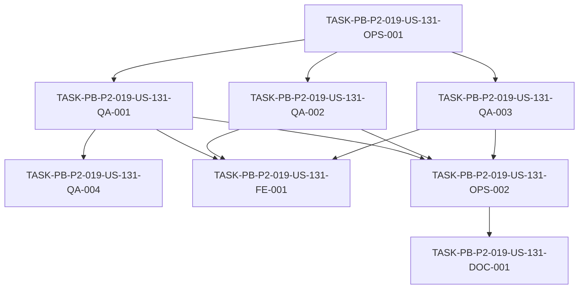

# Development Tasks — PB-P2-019 / US-131: Suite A11Y mínima

## 1. Metadata

| Field | Value |
|---|---|
| User Story ID | US-131 |
| Source User Story | `management/user-stories/US-131-a11y-minimum-suite.md` |
| Source Technical Specification | `management/technical-specs/P2/PB-P2-019/US-131-technical-spec.md` |
| Decision Resolution Artifact | N/A (no existe) |
| Priority | P2 (Must Have) |
| Backlog ID | PB-P2-019 |
| Backlog Title | Suite A11Y mínima (teclado, foco, ARIA, contraste) |
| Backlog Execution Order | 19 (decimonoveno ítem de P2) |
| User Story Position in Backlog Item | 1 de 1 |
| Related User Stories in Backlog Item | US-131 |
| Epic | EPIC-QA-001 |
| Backlog Item Dependencies | PB-P0-012 (Frontend Bootstrap & i18n), PB-P0-013 (Data Layer + Layouts) |
| Feature | Accesibilidad mínima — axe-core + verificación manual |
| Module / Domain | QA / FE |
| Backlog Alignment Status | Found |
| Task Breakdown Status | Ready for Sprint Planning |
| Created Date | 2026-07-07 |
| Last Updated | 2026-07-07 |

---

## 2. Source Validation

| Source | Found | Used | Notes |
|---|---|---|---|
| User Story | Yes | Yes | `Approved with Minor Notes`. |
| Technical Specification | Yes | Yes | `Ready for Task Breakdown`. Fuente primaria. |
| Decision Resolution Artifact | No | No | No existe para US-131. |
| Product Backlog Prioritized | Yes | Yes | PB-P2-019, P2, EPIC-QA-001. |
| ADRs | Yes | Yes | ADR-TEST-001 (Vitest + Testing Library + Playwright). |

---

## 3. Backlog Execution Context

### Parent Backlog Item

**PB-P2-019 — Suite A11Y mínima** (EPIC-QA-001, P2, Must Have). Tests automatizados (axe-core) y manuales mínimos en las rutas demo principales; criterios WCAG AA básicos. axe-core sin violaciones críticas; navegación por teclado; roles ARIA correctos. Dependencias: PB-P0-012, PB-P0-013.

### Execution Order Rationale

Decimonoveno ítem de P2. Depende de la base del frontend (PB-P0-012/013). Complementa la suite frontend y E2E enfocándose en accesibilidad mínima verificable.

### Related User Stories in Same Backlog Item

| User Story | Role in Backlog Item | Suggested Order |
|---|---|---|
| US-131 | Única historia (A11Y mínima) | 1 |

---

## 4. Task Breakdown Summary

| Area | Number of Tasks | Notes |
|---|---:|---|
| DevOps / Environment (OPS) | 2 | Integración axe-core + gate de CI |
| QA / Testing (QA) | 4 | Auditorías axe, teclado/foco/ARIA, contraste/modales, checklist manual |
| Frontend (FE) | 1 | Ajustes menores de A11Y |
| Documentation (DOC) | 1 | Inventario de rutas + nota de alineación |
| **Total** | **8** | |

---

## 5. Traceability Matrix

| Acceptance Criterion | Technical Spec Section | Task IDs |
|---|---|---|
| AC-01 (axe sin críticas) | §5, §13 | OPS-001, QA-001 |
| AC-02 (teclado) | §8, §13 | QA-002 |
| AC-03 (ARIA/foco/labels) | §8, §13 | QA-002 |
| AC-04 (contraste/modales) | §8, §13 | QA-003 |
| AC-05 (gate CI) | §13, §19 | OPS-002 |

---

## 6. Development Tasks

### TASK-PB-P2-019-US-131-OPS-001 — Integrar axe-core en la suite frontend

| Field | Value |
|---|---|
| Area | DevOps / Environment |
| Type | Setup |
| Priority | Must |
| Estimate | S |
| Depends On | — |
| Source AC(s) | AC-01 |
| Technical Spec Section(s) | §5, §13 |
| Backlog ID | PB-P2-019 |
| User Story ID | US-131 |
| Owner Role | Frontend |
| Status | To Do |

#### Objective
Integrar axe-core en Testing Library y/o Playwright, con estructura `frontend/tests/a11y/**` y script npm (`test:a11y`), configurando el umbral de "violaciones críticas".

#### Scope
##### Include
* Setup de axe-core (jest-axe/@axe-core/playwright o equivalente).
* Script y config de la suite A11Y.
##### Exclude
* Auditorías por ruta (QA-001) y gate de CI (OPS-002).

#### Implementation Notes
Doc 20 §11/§a11y; axe recomendado.

#### Acceptance Criteria Covered
AC-01.

#### Definition of Done
- [ ] axe-core integrado y `test:a11y` ejecuta localmente.
- [ ] Umbral de violaciones críticas configurado.

---

### TASK-PB-P2-019-US-131-QA-001 — Auditorías axe-core por ruta demo

| Field | Value |
|---|---|
| Area | QA / Testing |
| Type | Test |
| Priority | Must |
| Estimate | M |
| Depends On | OPS-001 |
| Source AC(s) | AC-01 |
| Technical Spec Section(s) | §8, §13 |
| Backlog ID | PB-P2-019 |
| User Story ID | US-131 |
| Owner Role | QA |
| Status | To Do |

#### Objective
Ejecutar auditorías axe-core sobre las rutas demo principales (login, creación de evento, comparación de cotizaciones) y verificar 0 violaciones críticas.

#### Scope
##### Include
* Auditoría axe por ruta demo del inventario.
##### Exclude
* Tests de teclado/foco (QA-002).

#### Implementation Notes
Limitar a violaciones críticas; complementar con checklist (QA-004).

#### Acceptance Criteria Covered
AC-01.

#### Definition of Done
- [ ] Rutas demo auditadas con axe-core.
- [ ] 0 violaciones críticas (o issues abiertos para FE-001).

---

### TASK-PB-P2-019-US-131-QA-002 — Tests de teclado, foco visible, ARIA y labels

| Field | Value |
|---|---|
| Area | QA / Testing |
| Type | Test |
| Priority | Must |
| Estimate | M |
| Depends On | OPS-001 |
| Source AC(s) | AC-02, AC-03 |
| Technical Spec Section(s) | §8, §13 |
| Backlog ID | PB-P2-019 |
| User Story ID | US-131 |
| Owner Role | QA |
| Status | To Do |

#### Objective
Escribir tests de navegación por teclado (Tab/Shift+Tab/Enter) en flujos críticos, foco visible, roles ARIA correctos y labels/errores de formulario accesibles.

#### Scope
##### Include
* Recorridos de teclado en flujos críticos.
* Aserciones de foco visible, ARIA y labels/errores (NFR-A11Y-002/003/004).
##### Exclude
* Contraste y modales (QA-003).

#### Implementation Notes
ARIA solo donde no hay equivalente nativo.

#### Acceptance Criteria Covered
AC-02, AC-03.

#### Definition of Done
- [ ] Flujos críticos navegables por teclado.
- [ ] Foco visible, ARIA y labels/errores verificados.

---

### TASK-PB-P2-019-US-131-QA-003 — Contraste ≥4.5:1 y gestión de foco en modales

| Field | Value |
|---|---|
| Area | QA / Testing |
| Type | Test |
| Priority | Must |
| Estimate | S |
| Depends On | OPS-001 |
| Source AC(s) | AC-04 |
| Technical Spec Section(s) | §8, §13 |
| Backlog ID | PB-P2-019 |
| User Story ID | US-131 |
| Owner Role | QA |
| Status | To Do |

#### Objective
Verificar contraste mínimo (≥4.5:1) sobre la paleta principal y la gestión de foco en modales (focus trap + restauración al cerrar).

#### Scope
##### Include
* Verificación de contraste (axe/checker sobre design tokens).
* Tests de focus trap y restauración en modales.
##### Exclude
* —

#### Implementation Notes
NFR-A11Y-005; Doc 20 §a11y (modales).

#### Acceptance Criteria Covered
AC-04.

#### Definition of Done
- [ ] Contraste ≥4.5:1 verificado.
- [ ] Focus trap y restauración en modales verificados.

---

### TASK-PB-P2-019-US-131-FE-001 — Ajustes menores de accesibilidad

| Field | Value |
|---|---|
| Area | Frontend |
| Type | Implementation |
| Priority | Should |
| Estimate | M |
| Depends On | QA-001, QA-002, QA-003 |
| Source AC(s) | AC-01, AC-03, AC-04 |
| Technical Spec Section(s) | §8, §17 |
| Backlog ID | PB-P2-019 |
| User Story ID | US-131 |
| Owner Role | Frontend |
| Status | To Do |

#### Objective
Aplicar ajustes menores de A11Y (labels/roles/foco/contraste) en los componentes de las rutas demo donde las auditorías/tests detecten hallazgos, sin cambios funcionales.

#### Scope
##### Include
* Correcciones puntuales derivadas de QA-001..003.
##### Exclude
* Rediseño de UI o cambios funcionales.

#### Implementation Notes
ARIA solo donde no hay equivalente nativo.

#### Acceptance Criteria Covered
AC-01, AC-03, AC-04.

#### Definition of Done
- [ ] Hallazgos de A11Y corregidos en rutas demo.
- [ ] Auditorías/tests en verde tras los ajustes.

---

### TASK-PB-P2-019-US-131-QA-004 — Checklist manual mínimo de accesibilidad

| Field | Value |
|---|---|
| Area | QA / Testing |
| Type | Test |
| Priority | Should |
| Estimate | S |
| Depends On | QA-001 |
| Source AC(s) | AC-03, AC-04 |
| Technical Spec Section(s) | §13 |
| Backlog ID | PB-P2-019 |
| User Story ID | US-131 |
| Owner Role | QA |
| Status | To Do |

#### Objective
Definir y ejecutar un checklist manual mínimo para lo que axe-core no cubre (orden de foco, anuncios de lector básico, restauración de foco).

#### Scope
##### Include
* Checklist manual documentado y ejecutado sobre rutas demo.
##### Exclude
* Auditoría completa con lector de pantalla.

#### Implementation Notes
Complementa las auditorías automatizadas (Doc 20 §a11y).

#### Acceptance Criteria Covered
AC-03, AC-04.

#### Definition of Done
- [ ] Checklist manual definido y ejecutado.
- [ ] Hallazgos registrados (o derivados a FE-001).

---

### TASK-PB-P2-019-US-131-OPS-002 — Gate de CI para la suite A11Y

| Field | Value |
|---|---|
| Area | DevOps / Environment |
| Type | Setup |
| Priority | Must |
| Estimate | S |
| Depends On | QA-001, QA-002, QA-003 |
| Source AC(s) | AC-05 |
| Technical Spec Section(s) | §13 (CI Checks), §19 |
| Backlog ID | PB-P2-019 |
| User Story ID | US-131 |
| Owner Role | DevOps |
| Status | To Do |

#### Objective
Integrar la suite A11Y como compuerta obligatoria de CI que bloquea el merge ante violaciones críticas de axe-core.

#### Scope
##### Include
* Job de CI que ejecuta `test:a11y`; publica reporte de axe.
* Bloqueo de merge ante violaciones críticas.
##### Exclude
* Consolidación completa de quality gates (PB-P2-020).

#### Implementation Notes
Aprovechar la base de CI (PB-P0-015).

#### Acceptance Criteria Covered
AC-05.

#### Definition of Done
- [ ] CI ejecuta la suite A11Y en cada PR.
- [ ] Merge bloqueado ante violaciones críticas.

---

### TASK-PB-P2-019-US-131-DOC-001 — Documentar inventario de rutas demo y nota de alineación

| Field | Value |
|---|---|
| Area | Documentation / Traceability |
| Type | Documentation |
| Priority | Should |
| Estimate | XS |
| Depends On | OPS-002 |
| Source AC(s) | AC-01 |
| Technical Spec Section(s) | §16, §19 |
| Backlog ID | PB-P2-019 |
| User Story ID | US-131 |
| Owner Role | Tech Lead |
| Status | To Do |

#### Objective
Documentar el inventario de rutas demo auditadas y la nota de alineación (NFR-A11Y Should Have vs suite Must Have; sin conformidad WCAG completa).

#### Scope
##### Include
* Inventario de rutas demo auditadas.
* Nota de Documentation Alignment.
##### Exclude
* Cambios a Doc 10/Doc 20.

#### Implementation Notes
Resuelve las dos alertas de Documentation Alignment no bloqueantes.

#### Acceptance Criteria Covered
AC-01.

#### Definition of Done
- [ ] Inventario de rutas demo documentado.
- [ ] Nota de alineación registrada.

---

## 7. Required QA Tasks

| Task ID | Test Type | Purpose |
|---|---|---|
| QA-001 | A11Y (axe) | Auditorías axe-core por ruta demo (sin críticas) |
| QA-002 | A11Y | Teclado, foco visible, ARIA, labels/errores |
| QA-003 | A11Y | Contraste ≥4.5:1 + focus trap/restauración modales |
| QA-004 | A11Y (manual) | Checklist manual mínimo |

---

## 8. Required Security Tasks

`No aplica` — la historia no introduce autorización; requisito transversal de no exponer secretos en reportes (cubierto en config de la suite).

---

## 9. Required Seed / Demo Tasks

`No aplica` — la historia no modifica el seed; usa MSW/fixtures para renderizar estados.

---

## 10. Observability / Audit Tasks

`No aplica` — los reportes de axe-core se publican como artefactos de CI (OPS-002).

---

## 11. Documentation / Traceability Tasks

| Task ID | Document / Artifact | Purpose |
|---|---|---|
| DOC-001 | Documentación de la suite A11Y | Inventario de rutas demo + nota de alineación NFR/suite |

---

## 12. Dependency Graph

---

## 13. Suggested Implementation Order

### Phase 1 — Foundation
* OPS-001 (integrar axe-core)

### Phase 2 — Core Implementation
* QA-001 (auditorías por ruta demo)
* QA-002 (teclado/foco/ARIA/labels)
* QA-003 (contraste/modales)

### Phase 3 — Validation / Security / QA
* FE-001 (ajustes menores de A11Y)
* QA-004 (checklist manual)
* OPS-002 (gate de CI)

### Phase 4 — Documentation / Review
* DOC-001 (inventario de rutas + nota de alineación)

---

## 14. Risks & Mitigations

| Risk | Impact | Mitigation | Related Task |
|---|---|---|---|
| Falsos positivos de axe | Ruido/falsa confianza | Limitar a críticas + checklist manual | QA-001, QA-004 |
| Cobertura incompleta de rutas | Accesibilidad aparente | Inventario verificado | DOC-001, QA-001 |
| Contraste dependiente de paleta | Fallos difusos | Verificar contra design tokens | QA-003 |
| ARIA mal usado | Regresiones | ARIA solo sin equivalente nativo | QA-002, FE-001 |
| Flakiness en teclado/foco | CI inestable | Selectores estables + esperas de foco | QA-002 |

---

## 15. Out of Scope Confirmation

* Certificación formal WCAG 2.1 AA completa (NFR-FUT-002).
* Auditoría exhaustiva de todas las páginas.
* Auditoría completa con lector de pantalla más allá del mínimo.
* Suites de US-126/127/128/129/130.
* Cambios funcionales de UI o de backend.

---

## 16. Readiness for Sprint Planning

| Check | Status |
|---|---|
| Product Backlog mapping found | Pass |
| Every AC maps to tasks | Pass |
| Technical Spec used when available | Pass |
| QA tasks included | Pass |
| Security tasks included if applicable | N/A |
| Seed/demo tasks included if applicable | N/A |
| Observability tasks included if applicable | N/A |
| Documentation tasks included if applicable | Pass |
| Task dependencies clear | Pass |
| Tasks small enough | Pass |
| Ready for Sprint Planning | Yes |

---

## 17. Final Recommendation

`Ready for Sprint Planning`

Las 8 tareas cubren todos los Acceptance Criteria (AC-01..AC-05), mapean a secciones del Technical Spec y respetan el orden de dependencias (integración axe → auditorías/tests → ajustes FE/checklist/gate → documentación). Se incluyen QA (axe, teclado/foco/ARIA, contraste/modales, manual), FE (ajustes menores) y documentación. Las dos alertas de Documentation Alignment (NFR Should Have vs suite Must Have; inventario de rutas demo) son **no bloqueantes**, gestionadas en DOC-001. Sin bloqueos ni scope creep.
