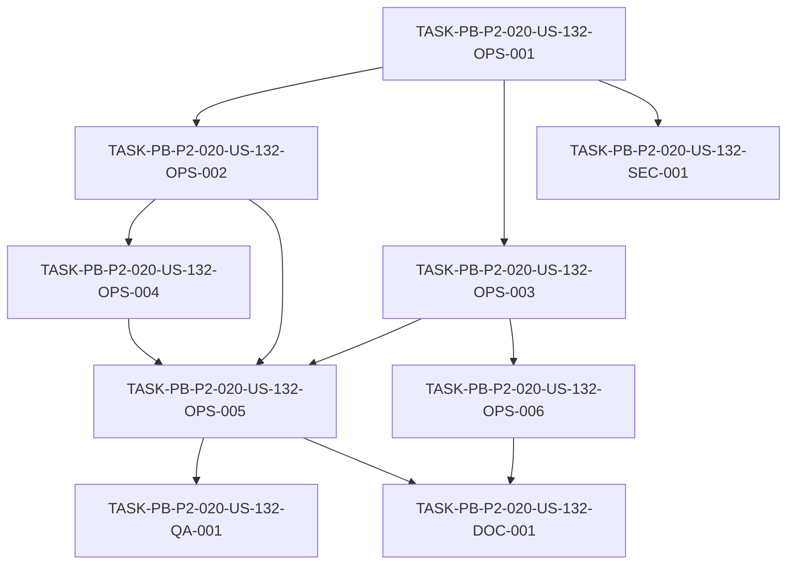

# Development Tasks — PB-P2-020 / US-132: Quality gates en GitHub Actions

## 1. Metadata

| Field | Value |
|---|---|
| User Story ID | US-132 |
| Source User Story | `management/user-stories/US-132-quality-gates-github-actions.md` |
| Source Technical Specification | `management/technical-specs/P2/PB-P2-020/US-132-technical-spec.md` |
| Decision Resolution Artifact | N/A (no existe) |
| Priority | P2 (Must Have) |
| Backlog ID | PB-P2-020 |
| Backlog Title | Quality gates en GitHub Actions (CI bloquea merge) |
| Backlog Execution Order | 20 (vigésimo ítem de P2) |
| User Story Position in Backlog Item | 1 de 1 |
| Related User Stories in Backlog Item | US-132 |
| Epic | EPIC-QA-001 |
| Backlog Item Dependencies | PB-P0-017 (pipeline base CI), PB-P2-014..019 (suites US-126..131) |
| Feature | CI quality gates — GitHub Actions |
| Module / Domain | QA / DevOps |
| Backlog Alignment Status | Found |
| Task Breakdown Status | Ready for Sprint Planning |
| Created Date | 2026-07-07 |
| Last Updated | 2026-07-07 |

---

## 2. Source Validation

| Source | Found | Used | Notes |
|---|---|---|---|
| User Story | Yes | Yes | `Approved with Minor Notes`. |
| Technical Specification | Yes | Yes | `Ready for Task Breakdown`. Fuente primaria. |
| Decision Resolution Artifact | No | No | No existe para US-132. |
| Product Backlog Prioritized | Yes | Yes | PB-P2-020, P2, EPIC-QA-001. |
| ADRs | Yes | Yes | ADR-DEVOPS-001 (GitHub Actions/AWS), ADR-TEST-001. |

---

## 3. Backlog Execution Context

### Parent Backlog Item

**PB-P2-020 — Quality gates en GitHub Actions** (EPIC-QA-001, P2, Must Have). Workflow GitHub Actions con quality gates: lint, typecheck, unit, integration, contract, E2E selectivo, RBAC, coverage. PR a `main` requiere gates verdes; cobertura ≥50% lógica crítica; E2E selectivo en main, completo en release. Dependencias: PB-P0-017, PB-P2-014..019.

### Execution Order Rationale

Vigésimo ítem de P2. Historia consolidadora: depende del pipeline base (PB-P0-017) y de las suites de calidad de P2 (US-126..131), integrándolas con branch protection.

### Related User Stories in Same Backlog Item

| User Story | Role in Backlog Item | Suggested Order |
|---|---|---|
| US-132 | Única historia (consolidación de gates) | 1 |

---

## 4. Task Breakdown Summary

| Area | Number of Tasks | Notes |
|---|---:|---|
| DevOps / Environment (OPS) | 6 | pr.yml base, compuertas BE, compuertas FE, cobertura/migraciones/seed, branch protection, release |
| Security / Authorization (SEC) | 1 | Secrets + forzar MockAIProvider |
| QA / Testing (QA) | 1 | Verificación negativa (gate rojo → no merge) |
| Documentation (DOC) | 1 | Required checks + política E2E |
| **Total** | **9** | |

---

## 5. Traceability Matrix

| Acceptance Criterion | Technical Spec Section | Task IDs |
|---|---|---|
| AC-01 (compuertas en PR) | §6, §13 | OPS-001, OPS-002, OPS-003, OPS-004 |
| AC-02 (branch protection) | §6, §12 | OPS-005 |
| AC-03 (cobertura gate) | §13 | OPS-004 |
| AC-04 (E2E selectivo/completo) | §5, §13 | OPS-003, OPS-006 |
| AC-05 (determinismo/seguridad) | §11, §12 | SEC-001 |

---

## 6. Development Tasks

### TASK-PB-P2-020-US-132-OPS-001 — Workflow `pr.yml` base + cache (lint/typecheck/build)

| Field | Value |
|---|---|
| Area | DevOps / Environment |
| Type | Setup |
| Priority | Must |
| Estimate | M |
| Depends On | — |
| Source AC(s) | AC-01 |
| Technical Spec Section(s) | §6, §13 |
| Backlog ID | PB-P2-020 |
| User Story ID | US-132 |
| Owner Role | DevOps |
| Status | To Do |

#### Objective
Crear/extender `.github/workflows/pr.yml` (PR a `main`/`qa`) con jobs base de lint, typecheck y build (FE+BE) y cache de dependencias, extendiendo PB-P0-017.

#### Scope
##### Include
* Jobs de lint (ESLint FE+BE), typecheck (TS strict), build verification.
* Cache npm/pnpm; checks visibles en el PR.
##### Exclude
* Integración de suites de test (OPS-002/003) y branch protection (OPS-005).

#### Implementation Notes
ADR-DEVOPS-001; Doc 21 §16.

#### Acceptance Criteria Covered
AC-01.

#### Definition of Done
- [ ] `pr.yml` ejecuta lint/typecheck/build en PR.
- [ ] Cache de dependencias activo; checks visibles.

---

### TASK-PB-P2-020-US-132-OPS-002 — Integrar compuertas de backend (unit/integration/RBAC/IA)

| Field | Value |
|---|---|
| Area | DevOps / Environment |
| Type | Setup |
| Priority | Must |
| Estimate | M |
| Depends On | OPS-001 |
| Source AC(s) | AC-01 |
| Technical Spec Section(s) | §7, §13 |
| Backlog ID | PB-P2-020 |
| User Story ID | US-132 |
| Owner Role | DevOps |
| Status | To Do |

#### Objective
Integrar como jobs de CI las suites de backend: unit+integration (US-126), RBAC negativa (US-130) e IA con MockAIProvider (US-129), sobre PostgreSQL efímero.

#### Scope
##### Include
* Jobs para unit/integration, RBAC negativa e IA (Mock).
* PostgreSQL efímero para jobs que lo requieran.
##### Exclude
* Compuertas frontend (OPS-003).

#### Implementation Notes
Integrar a medida que cada suite esté disponible; registrar pendientes.

#### Acceptance Criteria Covered
AC-01.

#### Definition of Done
- [ ] Jobs de unit/integration, RBAC e IA corren en PR.
- [ ] BD efímera disponible para los jobs.

---

### TASK-PB-P2-020-US-132-OPS-003 — Integrar compuertas de frontend (contract/E2E smoke/A11Y)

| Field | Value |
|---|---|
| Area | DevOps / Environment |
| Type | Setup |
| Priority | Must |
| Estimate | M |
| Depends On | OPS-001 |
| Source AC(s) | AC-01, AC-04 |
| Technical Spec Section(s) | §8, §13 |
| Backlog ID | PB-P2-020 |
| User Story ID | US-132 |
| Owner Role | DevOps |
| Status | To Do |

#### Objective
Integrar como jobs de CI las suites de frontend: contract/MSW (US-127), E2E smoke (US-128) y A11Y (US-131).

#### Scope
##### Include
* Jobs para contract, E2E smoke (subset) y A11Y (axe-core).
##### Exclude
* E2E completo en release (OPS-006).

#### Implementation Notes
E2E smoke en PR (Doc 21 §16).

#### Acceptance Criteria Covered
AC-01, AC-04.

#### Definition of Done
- [ ] Jobs de contract, E2E smoke y A11Y corren en PR.

---

### TASK-PB-P2-020-US-132-OPS-004 — Cobertura ≥50% + validación de migraciones y seed

| Field | Value |
|---|---|
| Area | DevOps / Environment |
| Type | Setup |
| Priority | Must |
| Estimate | M |
| Depends On | OPS-002 |
| Source AC(s) | AC-01, AC-03 |
| Technical Spec Section(s) | §10, §13 |
| Backlog ID | PB-P2-020 |
| User Story ID | US-132 |
| Owner Role | DevOps |
| Status | To Do |

#### Objective
Añadir compuertas de cobertura (≥50% lógica crítica), validación de migraciones (`prisma migrate validate`) y validación de idempotencia del seed.

#### Scope
##### Include
* Gate de cobertura agregada ≥50% crítica.
* `prisma migrate validate`; seed idempotencia.
##### Exclude
* Branch protection (OPS-005).

#### Implementation Notes
Doc 20 §22.

#### Acceptance Criteria Covered
AC-01, AC-03.

#### Definition of Done
- [ ] Gate de cobertura ≥50% crítica activo.
- [ ] Migraciones y seed validados en CI.

---

### TASK-PB-P2-020-US-132-OPS-005 — Branch protection sobre `main` con required checks

| Field | Value |
|---|---|
| Area | DevOps / Environment |
| Type | Setup |
| Priority | Must |
| Estimate | S |
| Depends On | OPS-002, OPS-003, OPS-004 |
| Source AC(s) | AC-02 |
| Technical Spec Section(s) | §6, §12 |
| Backlog ID | PB-P2-020 |
| User Story ID | US-132 |
| Owner Role | DevOps |
| Status | To Do |

#### Objective
Configurar branch protection sobre `main` marcando las compuertas requeridas como required status checks, de modo que un PR con checks rojos no pueda mergearse.

#### Scope
##### Include
* Required status checks en `main`.
* Documentar la configuración (no versionable directamente).
##### Exclude
* Deploy.

#### Implementation Notes
Confirmar la lista de required con Tech Lead (DOC-001).

#### Acceptance Criteria Covered
AC-02.

#### Definition of Done
- [ ] `main` requiere checks verdes para mergear.
- [ ] PR con gate rojo no se puede mergear.

---

### TASK-PB-P2-020-US-132-OPS-006 — Release con E2E completo

| Field | Value |
|---|---|
| Area | DevOps / Environment |
| Type | Setup |
| Priority | Should |
| Estimate | S |
| Depends On | OPS-003 |
| Source AC(s) | AC-04 |
| Technical Spec Section(s) | §5, §13 |
| Backlog ID | PB-P2-020 |
| User Story ID | US-132 |
| Owner Role | DevOps |
| Status | To Do |

#### Objective
Configurar la ejecución de la suite E2E completa en el flujo de release (vs smoke en PR), según la política definida.

#### Scope
##### Include
* Trigger de E2E completo en release.
##### Exclude
* Deploy a AWS.

#### Implementation Notes
Doc 21 §16 (smoke en PR / completo en release).

#### Acceptance Criteria Covered
AC-04.

#### Definition of Done
- [ ] E2E completo corre en release.
- [ ] Smoke E2E permanece en PR.

---

### TASK-PB-P2-020-US-132-SEC-001 — Secrets vía GitHub Secrets y forzar MockAIProvider

| Field | Value |
|---|---|
| Area | Security / Authorization |
| Type | Setup |
| Priority | Must |
| Estimate | S |
| Depends On | OPS-001 |
| Source AC(s) | AC-05 |
| Technical Spec Section(s) | §11, §12 |
| Backlog ID | PB-P2-020 |
| User Story ID | US-132 |
| Owner Role | DevOps |
| Status | To Do |

#### Objective
Configurar los secrets vía GitHub Secrets (OIDC hacia AWS recomendado para deploy futuro), garantizar que CI usa `MockAIProvider` (sin `OPENAI_API_KEY`) y que no se exponen secretos en logs.

#### Scope
##### Include
* Config de secrets; ausencia de `OPENAI_API_KEY` en CI.
* Verificación de no-exposición de secretos en logs.
##### Exclude
* Deploy/OIDC productivo (fases futuras).

#### Implementation Notes
SEC-02, SEC-03; Doc 20 §21.

#### Acceptance Criteria Covered
AC-05.

#### Definition of Done
- [ ] CI usa `MockAIProvider`; sin `OPENAI_API_KEY`.
- [ ] Secrets gestionados; sin secretos en logs.

---

### TASK-PB-P2-020-US-132-QA-001 — Verificación negativa: gate rojo bloquea merge

| Field | Value |
|---|---|
| Area | QA / Testing |
| Type | Test |
| Priority | Must |
| Estimate | S |
| Depends On | OPS-005 |
| Source AC(s) | AC-02 |
| Technical Spec Section(s) | §13, §17 |
| Backlog ID | PB-P2-020 |
| User Story ID | US-132 |
| Owner Role | QA |
| Status | To Do |

#### Objective
Verificar, con un PR de prueba, que un fallo en una compuerta requerida (lint/typecheck/test/coverage/RBAC/A11Y) bloquea el merge, y que la ausencia de una compuerta requerida hace fail-fast.

#### Scope
##### Include
* PR de prueba que rompe una compuerta → merge bloqueado.
* Verificación de fail-fast ante compuerta ausente.
##### Exclude
* —

#### Implementation Notes
NT-01/NT-02.

#### Acceptance Criteria Covered
AC-02.

#### Definition of Done
- [ ] Gate rojo bloquea el merge (verificado).
- [ ] Compuerta ausente hace fail-fast.

---

### TASK-PB-P2-020-US-132-DOC-001 — Documentar required checks y política E2E

| Field | Value |
|---|---|
| Area | Documentation / Traceability |
| Type | Documentation |
| Priority | Should |
| Estimate | XS |
| Depends On | OPS-005, OPS-006 |
| Source AC(s) | AC-01, AC-04 |
| Technical Spec Section(s) | §16, §19 |
| Backlog ID | PB-P2-020 |
| User Story ID | US-132 |
| Owner Role | Tech Lead |
| Status | To Do |

#### Objective
Documentar la lista final de compuertas **requeridas** para el merge, la política de E2E selectivo (PR) vs completo (release), y el estado de integración de las suites US-126..131.

#### Scope
##### Include
* Lista de required checks + política E2E.
* Estado de integración de compuertas (pendientes marcadas).
##### Exclude
* Cambios a Doc 20/Doc 21.

#### Implementation Notes
Resuelve las alertas de Documentation Alignment no bloqueantes.

#### Acceptance Criteria Covered
AC-01, AC-04.

#### Definition of Done
- [ ] Required checks documentados.
- [ ] Política E2E y estado de integración registrados.

---

## 7. Required QA Tasks

| Task ID | Test Type | Purpose |
|---|---|---|
| QA-001 | CI (negative) | Gate rojo bloquea merge; compuerta ausente hace fail-fast |

---

## 8. Required Security Tasks

| Task ID | Security Concern | Purpose |
|---|---|---|
| SEC-001 | Secrets / IA real | GitHub Secrets; `MockAIProvider` en CI; sin secretos en logs |

---

## 9. Required Seed / Demo Tasks

| Task ID | Seed/Demo Concern | Purpose |
|---|---|---|
| OPS-004 | Validación de idempotencia del seed | Compuerta de seed en CI (consumo, no modificación) |

---

## 10. Observability / Audit Tasks

`No aplica` — el estado de checks y los reportes de compuertas se publican como artefactos de CI (OPS-002..004).

---

## 11. Documentation / Traceability Tasks

| Task ID | Document / Artifact | Purpose |
|---|---|---|
| DOC-001 | Documentación de CI/quality gates | Required checks + política E2E + estado de integración |

---

## 12. Dependency Graph

---

## 13. Suggested Implementation Order

### Phase 1 — Foundation
* OPS-001 (`pr.yml` base + cache)
* SEC-001 (secrets + MockAIProvider)

### Phase 2 — Core Implementation
* OPS-002 (compuertas backend)
* OPS-003 (compuertas frontend)
* OPS-004 (cobertura + migraciones + seed)

### Phase 3 — Validation / Security / QA
* OPS-005 (branch protection)
* OPS-006 (E2E completo en release)
* QA-001 (verificación negativa)

### Phase 4 — Documentation / Review
* DOC-001 (required checks + política E2E)

---

## 14. Risks & Mitigations

| Risk | Impact | Mitigation | Related Task |
|---|---|---|---|
| Compuerta ausente = verde | Falsa calidad | Fail-fast; no marcar verde si falta | QA-001, OPS-002/003 |
| Flakiness de E2E en el gate | CI inestable | Smoke en PR; completo en release; retries acotados | OPS-003, OPS-006 |
| CI lento | Merge lento | Cache; paralelización de jobs | OPS-001 |
| IA real en CI | Costos/flakiness | `MockAIProvider`; sin `OPENAI_API_KEY` | SEC-001 |
| Branch protection mal configurada | Merge de PRs rojos | Required checks explícitos | OPS-005 |
| Suites US-126..131 no disponibles aún | Compuertas incompletas | Integrar a medida que existan; documentar pendientes | DOC-001 |

---

## 15. Out of Scope Confirmation

* Despliegue a AWS (PB-P2-021..026).
* Implementación de las suites US-126..131 (se consolidan).
* Reimplementar el pipeline base PB-P0-017 (se extiende).
* Certificación de cumplimiento formal.
* Relajar umbrales (cobertura, no-skip crítico, seguridad).

---

## 16. Readiness for Sprint Planning

| Check | Status |
|---|---|
| Product Backlog mapping found | Pass |
| Every AC maps to tasks | Pass |
| Technical Spec used when available | Pass |
| QA tasks included | Pass |
| Security tasks included if applicable | Pass |
| Seed/demo tasks included if applicable | Pass (validación de seed) |
| Observability tasks included if applicable | N/A |
| Documentation tasks included if applicable | Pass |
| Task dependencies clear | Pass |
| Tasks small enough | Pass |
| Ready for Sprint Planning | Yes |

---

## 17. Final Recommendation

`Ready for Sprint Planning`

Las 9 tareas cubren todos los Acceptance Criteria (AC-01..AC-05), mapean a secciones del Technical Spec y respetan el orden de dependencias (`pr.yml` base → compuertas BE/FE → cobertura/migraciones/seed → branch protection/release → verificación/documentación). Se incluyen DevOps (workflow + gates + branch protection + release), seguridad (secrets + MockAIProvider), QA (verificación negativa), seed (validación) y documentación. Las alertas de Documentation Alignment (required checks, política E2E, disponibilidad de suites) son **no bloqueantes**, gestionadas en DOC-001. **Dependencia de entrega:** la integración efectiva de cada compuerta depende de que su suite (US-126..131) esté disponible; se integran incrementalmente y se marcan pendientes. Sin bloqueos ni scope creep.
