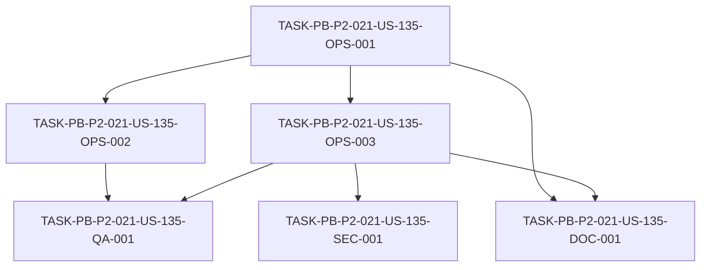

# Development Tasks — PB-P2-021 / US-135: Deploy frontend en AWS Amplify

## 1. Metadata

| Field | Value |
|---|---|
| User Story ID | US-135 |
| Source User Story | `management/user-stories/US-135-deploy-frontend-amplify.md` |
| Source Technical Specification | `management/technical-specs/P2/PB-P2-021/US-135-technical-spec.md` |
| Decision Resolution Artifact | N/A (no existe) |
| Priority | P2 (Must Have) |
| Backlog ID | PB-P2-021 |
| Backlog Title | Deploy frontend en AWS Amplify Hosting |
| Backlog Execution Order | 21 (vigésimo primer ítem de P2) |
| User Story Position in Backlog Item | 1 de 1 |
| Related User Stories in Backlog Item | US-135 |
| Epic | EPIC-OPS-001 |
| Backlog Item Dependencies | PB-P0-012 (Frontend Bootstrap & i18n), PB-P0-017 (pipeline CI) |
| Feature | Amplify Hosting — deploy del frontend Next.js |
| Module / Domain | DevOps |
| Backlog Alignment Status | Found |
| Task Breakdown Status | Ready for Sprint Planning |
| Created Date | 2026-07-07 |
| Last Updated | 2026-07-07 |

---

## 2. Source Validation

| Source | Found | Used | Notes |
|---|---|---|---|
| User Story | Yes | Yes | `Approved with Minor Notes`. |
| Technical Specification | Yes | Yes | `Ready for Task Breakdown`. Fuente primaria. |
| Decision Resolution Artifact | No | No | No existe para US-135. |
| Product Backlog Prioritized | Yes | Yes | PB-P2-021, P2, EPIC-OPS-001. |
| ADRs | Yes | Yes | ADR-DEVOPS-001 (AWS/Amplify). |

---

## 3. Backlog Execution Context

### Parent Backlog Item

**PB-P2-021 — Deploy frontend en AWS Amplify** (EPIC-OPS-001, P2, Must Have). Amplify Hosting conectado al repo, build automatizado por branch, env vars, dominio QA/Demo. URL Amplify operativa; build verde por push; variables por ambiente. Dependencias: PB-P0-012, PB-P0-017.

### Execution Order Rationale

Vigésimo primer ítem de P2. Depende del frontend base (PB-P0-012) y del pipeline CI (PB-P0-017). Primera de la franja de despliegue AWS de P2; consume la URL del backend de PB-P2-022.

### Related User Stories in Same Backlog Item

| User Story | Role in Backlog Item | Suggested Order |
|---|---|---|
| US-135 | Única historia (deploy frontend Amplify) | 1 |

---

## 4. Task Breakdown Summary

| Area | Number of Tasks | Notes |
|---|---:|---|
| DevOps / Environment (OPS) | 3 | Conexión+mappings, build settings, env vars/API base |
| Security / Authorization (SEC) | 1 | Cookies/CORS + no exponer sensibles |
| QA / Testing (QA) | 1 | Smoke de URL + rollback |
| Documentation (DOC) | 1 | Branch mappings + env vars + nota de prioridad |
| **Total** | **6** | |

---

## 5. Traceability Matrix

| Acceptance Criterion | Technical Spec Section | Task IDs |
|---|---|---|
| AC-01 (Amplify + branch mappings) | §6, §8 | OPS-001 |
| AC-02 (build verde + URL) | §5, §6, §13 | OPS-002, QA-001 |
| AC-03 (env vars por ambiente) | §6, §12 | OPS-003, SEC-001 |
| AC-04 (API base + cookies/CORS) | §9, §12 | OPS-003, SEC-001 |
| AC-05 (rollback) | §6, §17 | QA-001 |

---

## 6. Development Tasks

### TASK-PB-P2-021-US-135-OPS-001 — Conectar Amplify al repo + branch mappings

| Field | Value |
|---|---|
| Area | DevOps / Environment |
| Type | Setup |
| Priority | Must |
| Estimate | S |
| Depends On | — |
| Source AC(s) | AC-01 |
| Technical Spec Section(s) | §6, §8 |
| Backlog ID | PB-P2-021 |
| User Story ID | US-135 |
| Owner Role | DevOps |
| Status | To Do |

#### Objective
Conectar AWS Amplify Hosting al repositorio GitHub del frontend y configurar los branch mappings (`main` → Demo, `staging`/`qa` → QA), de modo que un push a una rama mapeada dispare un build.

#### Scope
##### Include
* Integración Amplify ↔ GitHub.
* Branch mappings por ambiente.
##### Exclude
* Build settings (OPS-002) y env vars (OPS-003).

#### Implementation Notes
Confirmar nombres de rama con Tech Lead (DOC-001).

#### Acceptance Criteria Covered
AC-01.

#### Definition of Done
- [ ] Amplify conectado al repo.
- [ ] Branch mappings configurados; push dispara build.

---

### TASK-PB-P2-021-US-135-OPS-002 — Build settings de Amplify

| Field | Value |
|---|---|
| Area | DevOps / Environment |
| Type | Setup |
| Priority | Must |
| Estimate | S |
| Depends On | OPS-001 |
| Source AC(s) | AC-02 |
| Technical Spec Section(s) | §5, §6, §13 |
| Backlog ID | PB-P2-021 |
| User Story ID | US-135 |
| Owner Role | DevOps |
| Status | To Do |

#### Objective
Configurar el build de Amplify (`amplify.yml` o consola): `npm ci` → `lint` → `typecheck` → `test` → `build`, publicando la URL pública del ambiente.

#### Scope
##### Include
* Build command y artefactos de Next.js App Router.
* Publicación de la URL pública.
##### Exclude
* Env vars (OPS-003).

#### Implementation Notes
Deploy solo si el build es verde; Amplify no promueve builds fallidos (EC-01).

#### Acceptance Criteria Covered
AC-02.

#### Definition of Done
- [ ] Build verde por push publica la URL.
- [ ] Build fallido no se promueve (build anterior activo).

---

### TASK-PB-P2-021-US-135-OPS-003 — Variables de entorno públicas por ambiente + API base

| Field | Value |
|---|---|
| Area | DevOps / Environment |
| Type | Setup |
| Priority | Must |
| Estimate | S |
| Depends On | OPS-001 |
| Source AC(s) | AC-03, AC-04 |
| Technical Spec Section(s) | §6, §9 |
| Backlog ID | PB-P2-021 |
| User Story ID | US-135 |
| Owner Role | DevOps |
| Status | To Do |

#### Objective
Configurar las variables públicas (`NEXT_PUBLIC_API_BASE_URL`, `NEXT_PUBLIC_APP_ENV`, `NEXT_PUBLIC_CAPTCHA_SITE_KEY`) por ambiente, con `NEXT_PUBLIC_API_BASE_URL` apuntando al backend (App Runner) correcto por ambiente.

#### Scope
##### Include
* Env vars públicas por ambiente (Demo/QA).
* `NEXT_PUBLIC_API_BASE_URL` por ambiente.
##### Exclude
* Variables sensibles (nunca en el frontend).

#### Implementation Notes
Coordinar URLs del backend con PB-P2-022; VR-03/VR-04 (fail-fast si falta).

#### Acceptance Criteria Covered
AC-03, AC-04.

#### Definition of Done
- [ ] Variables públicas por ambiente configuradas.
- [ ] `NEXT_PUBLIC_API_BASE_URL` correcto por ambiente.
- [ ] Ninguna variable sensible expuesta al cliente.

---

### TASK-PB-P2-021-US-135-SEC-001 — Cookies/CORS y no exposición de secretos

| Field | Value |
|---|---|
| Area | Security / Authorization |
| Type | Setup |
| Priority | Must |
| Estimate | S |
| Depends On | OPS-003 |
| Source AC(s) | AC-04 |
| Technical Spec Section(s) | §12 |
| Backlog ID | PB-P2-021 |
| User Story ID | US-135 |
| Owner Role | DevOps |
| Status | To Do |

#### Objective
Documentar y verificar la asunción de cookies/CORS (`SameSite=None; Secure`, `credentials: true`) para el cruce Amplify ↔ App Runner, y garantizar que no se exponen variables sensibles ni secretos en logs.

#### Scope
##### Include
* Verificación de cookies HTTP-only cross-domain funcionando.
* Confirmación de que solo `NEXT_PUBLIC_*` llega al cliente; sin secretos en logs.
##### Exclude
* Configuración CORS del backend (PB-P2-022).

#### Implementation Notes
Doc 21 §9.5/§9.8; SEC-02/SEC-03.

#### Acceptance Criteria Covered
AC-04.

#### Definition of Done
- [ ] Cookies cross-domain verificadas (o asunción documentada).
- [ ] Sin variables sensibles ni secretos expuestos.

---

### TASK-PB-P2-021-US-135-QA-001 — Smoke de la URL pública + verificación de rollback

| Field | Value |
|---|---|
| Area | QA / Testing |
| Type | Test |
| Priority | Must |
| Estimate | S |
| Depends On | OPS-002, OPS-003 |
| Source AC(s) | AC-02, AC-05 |
| Technical Spec Section(s) | §13, §17 |
| Backlog ID | PB-P2-021 |
| User Story ID | US-135 |
| Owner Role | QA |
| Status | To Do |

#### Objective
Ejecutar un smoke de la URL pública tras el deploy (rutas accesibles, carga básica) y verificar que el rollback a un build anterior de Amplify funciona.

#### Scope
##### Include
* Smoke de la URL pública (Demo/QA).
* Verificación de rollback (build previo o revertir commit).
##### Exclude
* E2E completo (US-128).

#### Implementation Notes
Doc 21 §9.7.

#### Acceptance Criteria Covered
AC-02, AC-05.

#### Definition of Done
- [ ] Smoke de la URL pública verde.
- [ ] Rollback verificado.

---

### TASK-PB-P2-021-US-135-DOC-001 — Documentar branch mappings, env vars y nota de prioridad

| Field | Value |
|---|---|
| Area | Documentation / Traceability |
| Type | Documentation |
| Priority | Should |
| Estimate | XS |
| Depends On | OPS-001, OPS-003 |
| Source AC(s) | AC-01, AC-03 |
| Technical Spec Section(s) | §16, §19 |
| Backlog ID | PB-P2-021 |
| User Story ID | US-135 |
| Owner Role | Tech Lead |
| Status | To Do |

#### Objective
Documentar los branch mappings finales por ambiente, las variables públicas por ambiente y la nota de reconciliación de prioridad (P0 → P2, backlog autoritativo).

#### Scope
##### Include
* Tabla de branch mappings y env vars por ambiente.
* Nota de Documentation Alignment (prioridad; URLs dependientes de PB-P2-022).
##### Exclude
* Cambios a Doc 21.

#### Implementation Notes
Resuelve las alertas de Documentation Alignment no bloqueantes.

#### Acceptance Criteria Covered
AC-01, AC-03.

#### Definition of Done
- [ ] Branch mappings y env vars documentados.
- [ ] Nota de prioridad y dependencia de URLs registrada.

---

## 7. Required QA Tasks

| Task ID | Test Type | Purpose |
|---|---|---|
| QA-001 | Deploy smoke | Smoke de URL pública + verificación de rollback |

---

## 8. Required Security Tasks

| Task ID | Security Concern | Purpose |
|---|---|---|
| SEC-001 | Cookies/CORS + secretos | `SameSite=None; Secure` + `credentials: true`; sin variables sensibles/secretos expuestos |

---

## 9. Required Seed / Demo Tasks

`No aplica` — el frontend consume el backend; el seed lo gestiona el backend (PB-P0-014).

---

## 10. Observability / Audit Tasks

`No aplica` — el estado del build es visible en Amplify; sin secretos en logs (SEC-001).

---

## 11. Documentation / Traceability Tasks

| Task ID | Document / Artifact | Purpose |
|---|---|---|
| DOC-001 | Documentación de deploy frontend | Branch mappings + env vars por ambiente + nota de prioridad |

---

## 12. Dependency Graph

---

## 13. Suggested Implementation Order

### Phase 1 — Foundation
* OPS-001 (conectar Amplify + branch mappings)

### Phase 2 — Core Implementation
* OPS-002 (build settings)
* OPS-003 (env vars por ambiente + API base)

### Phase 3 — Validation / Security / QA
* SEC-001 (cookies/CORS + no exponer sensibles)
* QA-001 (smoke + rollback)

### Phase 4 — Documentation / Review
* DOC-001 (branch mappings + env vars + nota de prioridad)

---

## 14. Risks & Mitigations

| Risk | Impact | Mitigation | Related Task |
|---|---|---|---|
| Cookies cross-domain no funcionan | Sesión rota en demo | `SameSite=None; Secure` + CORS `credentials: true` | SEC-001 |
| Variable sensible expuesta | Riesgo de seguridad | Solo `NEXT_PUBLIC_*`; revisión de config | OPS-003, SEC-001 |
| Build roto publicado | Demo caída | Amplify no promueve fallidos; rollback | OPS-002, QA-001 |
| URL del backend no disponible | Config incompleta | Coordinar con PB-P2-022; documentar | OPS-003, DOC-001 |
| Branch mappings inconsistentes | Deploy al ambiente equivocado | Documentar y confirmar | OPS-001, DOC-001 |

---

## 15. Out of Scope Confirmation

* Deploy del backend (PB-P2-022), RDS (PB-P2-023), Secrets Manager (PB-P2-024).
* Custom domain / Route 53 (opcional/futuro).
* El workflow de quality gates (US-132 / PB-P0-017).
* Cambios funcionales del frontend.

---

## 16. Readiness for Sprint Planning

| Check | Status |
|---|---|
| Product Backlog mapping found | Pass |
| Every AC maps to tasks | Pass |
| Technical Spec used when available | Pass |
| QA tasks included | Pass |
| Security tasks included if applicable | Pass |
| Seed/demo tasks included if applicable | N/A |
| Observability tasks included if applicable | N/A |
| Documentation tasks included if applicable | Pass |
| Task dependencies clear | Pass |
| Tasks small enough | Pass |
| Ready for Sprint Planning | Yes |

---

## 17. Final Recommendation

`Ready for Sprint Planning`

Las 6 tareas cubren todos los Acceptance Criteria (AC-01..AC-05), mapean a secciones del Technical Spec y respetan el orden de dependencias (conectar Amplify → build/env vars → cookies-CORS/smoke → documentación). Se incluyen DevOps (hosting + build + env vars), seguridad (cookies/CORS + no exponer sensibles), QA (smoke + rollback) y documentación. Las alertas de Documentation Alignment (prioridad P0→P2 reconciliada; nombres de rama; URLs del backend dependientes de PB-P2-022) son **no bloqueantes**, gestionadas en DOC-001. Sin bloqueos ni scope creep.
