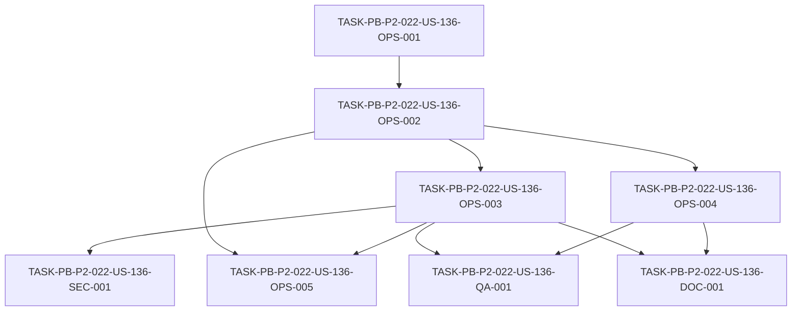

# Development Tasks — PB-P2-022 / US-136: Deploy backend en servicio gestionado AWS

## 1. Metadata

| Field | Value |
|---|---|
| User Story ID | US-136 |
| Source User Story | `management/user-stories/US-136-deploy-backend-managed-service.md` |
| Source Technical Specification | `management/technical-specs/P2/PB-P2-022/US-136-technical-spec.md` |
| Decision Resolution Artifact | N/A (no existe) |
| Priority | P2 (Must Have) |
| Backlog ID | PB-P2-022 |
| Backlog Title | Deploy backend en servicio gestionado AWS (App Runner) |
| Backlog Execution Order | 22 (vigésimo segundo ítem de P2) |
| User Story Position in Backlog Item | 1 de 1 |
| Related User Stories in Backlog Item | US-136 |
| Epic | EPIC-OPS-001 |
| Backlog Item Dependencies | PB-P0-016 (Dockerfile backend), PB-P0-017 (pipeline CI) |
| Feature | App Runner — deploy del backend dockerizado |
| Module / Domain | DevOps |
| Backlog Alignment Status | Found |
| Task Breakdown Status | Ready for Sprint Planning |
| Created Date | 2026-07-07 |
| Last Updated | 2026-07-07 |

---

## 2. Source Validation

| Source | Found | Used | Notes |
|---|---|---|---|
| User Story | Yes | Yes | `Approved with Minor Notes`. |
| Technical Specification | Yes | Yes | `Ready for Task Breakdown`. Fuente primaria. |
| Decision Resolution Artifact | No | No | No existe para US-136. |
| Product Backlog Prioritized | Yes | Yes | PB-P2-022, P2, EPIC-OPS-001. |
| ADRs | Yes | Yes | ADR-DEVOPS-001 (AWS/App Runner). |

---

## 3. Backlog Execution Context

### Parent Backlog Item

**PB-P2-022 — Deploy backend en servicio gestionado AWS** (EPIC-OPS-001, P2, Must Have). Backend dockerizado en App Runner con escalamiento mínimo, variables de entorno y healthcheck. Servicio gestionado configurado; deploy automatizado; `/healthz` accesible. Dependencias: PB-P0-016, PB-P0-017.

### Execution Order Rationale

Vigésimo segundo ítem de P2. Depende del Dockerfile (PB-P0-016) y del CI (PB-P0-017). Provee la URL del backend que consume Amplify (US-135); coordina con RDS (PB-P2-023) y Secrets (PB-P2-024).

### Related User Stories in Same Backlog Item

| User Story | Role in Backlog Item | Suggested Order |
|---|---|---|
| US-136 | Única historia (deploy backend) | 1 |

---

## 4. Task Breakdown Summary

| Area | Number of Tasks | Notes |
|---|---:|---|
| DevOps / Environment (OPS) | 5 | ECR/imagen, App Runner, env/secretos/escalado/logs, healthcheck, deploy automatizado |
| Security / Authorization (SEC) | 1 | CORS/cookies + imagen sin secretos |
| QA / Testing (QA) | 1 | Smoke de URL + `/healthz` |
| Documentation (DOC) | 1 | env/secretos + naming healthcheck + prioridad |
| **Total** | **8** | |

---

## 5. Traceability Matrix

| Acceptance Criterion | Technical Spec Section | Task IDs |
|---|---|---|
| AC-01 (App Runner configurado) | §5, §6 | OPS-001, OPS-002 |
| AC-02 (deploy automatizado) | §6, §13 | OPS-005 |
| AC-03 (healthcheck) | §7, §9 | OPS-004 |
| AC-04 (vars/secretos) | §5, §12 | OPS-003, SEC-001 |
| AC-05 (CORS/cookies/escalado) | §12, §14 | OPS-003, SEC-001 |

---

## 6. Development Tasks

### TASK-PB-P2-022-US-136-OPS-001 — ECR repo + build & push de la imagen del backend

| Field | Value |
|---|---|
| Area | DevOps / Environment |
| Type | Setup |
| Priority | Must |
| Estimate | S |
| Depends On | — |
| Source AC(s) | AC-01 |
| Technical Spec Section(s) | §5, §6 |
| Backlog ID | PB-P2-022 |
| User Story ID | US-136 |
| Owner Role | DevOps |
| Status | To Do |

#### Objective
Crear el repositorio Amazon ECR (privado) y publicar la imagen Docker multi-stage del backend (PB-P0-016).

#### Scope
##### Include
* ECR repo privado.
* Build & push inicial de la imagen (sin secretos).
##### Exclude
* Servicio App Runner (OPS-002) y automatización (OPS-005).

#### Implementation Notes
`.dockerignore` de PB-P0-016; imagen sin credenciales.

#### Acceptance Criteria Covered
AC-01.

#### Definition of Done
- [ ] ECR repo creado.
- [ ] Imagen publicada sin secretos.

---

### TASK-PB-P2-022-US-136-OPS-002 — Servicio App Runner desde la imagen ECR

| Field | Value |
|---|---|
| Area | DevOps / Environment |
| Type | Setup |
| Priority | Must |
| Estimate | M |
| Depends On | OPS-001 |
| Source AC(s) | AC-01 |
| Technical Spec Section(s) | §5, §6 |
| Backlog ID | PB-P2-022 |
| User Story ID | US-136 |
| Owner Role | DevOps |
| Status | To Do |

#### Objective
Configurar el servicio App Runner consumiendo la imagen del backend desde ECR, exponiendo una URL pública HTTPS.

#### Scope
##### Include
* Servicio App Runner desde ECR; puerto (`PORT`) correcto.
* URL pública operativa.
##### Exclude
* Env/secretos (OPS-003) y healthcheck (OPS-004).

#### Implementation Notes
Sin Kubernetes (P-09); App Runner termina HTTPS.

#### Acceptance Criteria Covered
AC-01.

#### Definition of Done
- [ ] App Runner corre la imagen; URL pública operativa.

---

### TASK-PB-P2-022-US-136-OPS-003 — Variables de runtime, secretos, escalamiento y CloudWatch

| Field | Value |
|---|---|
| Area | DevOps / Environment |
| Type | Setup |
| Priority | Must |
| Estimate | M |
| Depends On | OPS-002 |
| Source AC(s) | AC-04, AC-05 |
| Technical Spec Section(s) | §5, §12, §14 |
| Backlog ID | PB-P2-022 |
| User Story ID | US-136 |
| Owner Role | DevOps |
| Status | To Do |

#### Objective
Configurar las variables de entorno de runtime, referenciar los secretos desde Secrets Manager/SSM (incl. `DATABASE_URL`), fijar el escalamiento mínimo (min 1, max 2–3) y los logs en CloudWatch.

#### Scope
##### Include
* Env vars de runtime; secretos vía Secrets Manager/SSM.
* Escalamiento min/max; CloudWatch logs (retención 14–30 días).
* Fail-fast si falta una variable/secreto requerido.
##### Exclude
* Provisión de RDS/Secrets (PB-P2-023/024).

#### Implementation Notes
Imagen sin secretos; coordinar `DATABASE_URL` con PB-P2-023.

#### Acceptance Criteria Covered
AC-04, AC-05.

#### Definition of Done
- [ ] Vars/secretos en runtime; imagen sin secretos.
- [ ] Escalamiento min 1/max 2–3; logs en CloudWatch.
- [ ] Fail-fast ante variable/secreto ausente.

---

### TASK-PB-P2-022-US-136-OPS-004 — Health check `/healthz` en App Runner

| Field | Value |
|---|---|
| Area | DevOps / Environment |
| Type | Setup |
| Priority | Must |
| Estimate | S |
| Depends On | OPS-002 |
| Source AC(s) | AC-03 |
| Technical Spec Section(s) | §7, §9 |
| Backlog ID | PB-P2-022 |
| User Story ID | US-136 |
| Owner Role | DevOps |
| Status | To Do |

#### Objective
Configurar `GET /healthz` (US-116) como health check de App Runner, de modo que solo se enrute tráfico cuando el servicio esté sano.

#### Scope
##### Include
* Health check `/healthz` en App Runner.
* Verificación de que un healthcheck fallido no enruta (EC-01).
##### Exclude
* Implementación del endpoint (US-116).

#### Implementation Notes
Naming `/healthz` (consistente con US-116/backlog).

#### Acceptance Criteria Covered
AC-03.

#### Definition of Done
- [ ] `/healthz` configurado como health check.
- [ ] Instancia no sana no recibe tráfico.

---

### TASK-PB-P2-022-US-136-SEC-001 — CORS/cookies e imagen sin secretos

| Field | Value |
|---|---|
| Area | Security / Authorization |
| Type | Setup |
| Priority | Must |
| Estimate | S |
| Depends On | OPS-003 |
| Source AC(s) | AC-04, AC-05 |
| Technical Spec Section(s) | §12 |
| Backlog ID | PB-P2-022 |
| User Story ID | US-136 |
| Owner Role | DevOps |
| Status | To Do |

#### Objective
Configurar `CORS_ALLOWED_ORIGINS` con el dominio Amplify y las cookies (`HttpOnly; Secure; SameSite=None`), y verificar que la imagen y los logs no contienen secretos.

#### Scope
##### Include
* CORS restringido a Amplify; cookies cross-domain.
* Verificación de imagen/logs sin secretos.
##### Exclude
* CORS del frontend (US-135).

#### Implementation Notes
Doc 21 §10.6; SEC-02/SEC-03.

#### Acceptance Criteria Covered
AC-04, AC-05.

#### Definition of Done
- [ ] CORS a Amplify y cookies `SameSite=None; Secure` configurados.
- [ ] Imagen y logs sin secretos (verificado).

---

### TASK-PB-P2-022-US-136-OPS-005 — Deploy automatizado en GitHub Actions

| Field | Value |
|---|---|
| Area | DevOps / Environment |
| Type | Setup |
| Priority | Must |
| Estimate | M |
| Depends On | OPS-002, OPS-003 |
| Source AC(s) | AC-02 |
| Technical Spec Section(s) | §6, §13 |
| Backlog ID | PB-P2-022 |
| User Story ID | US-136 |
| Owner Role | DevOps |
| Status | To Do |

#### Objective
Automatizar el deploy vía GitHub Actions: build & push de la imagen a ECR y deploy/redeploy en App Runner tras los quality gates (PB-P0-017).

#### Scope
##### Include
* Workflow que construye, publica y despliega la imagen.
* OIDC hacia AWS recomendado; sin secretos en logs.
##### Exclude
* Los quality gates en sí (US-132/PB-P0-017).

#### Implementation Notes
Preferir redeploy de imagen previa a parches en caliente (P-12).

#### Acceptance Criteria Covered
AC-02.

#### Definition of Done
- [ ] Build & push a ECR automatizado.
- [ ] App Runner despliega/redespliega la nueva imagen.

---

### TASK-PB-P2-022-US-136-QA-001 — Smoke de la URL del backend y `/healthz`

| Field | Value |
|---|---|
| Area | QA / Testing |
| Type | Test |
| Priority | Must |
| Estimate | S |
| Depends On | OPS-003, OPS-004 |
| Source AC(s) | AC-01, AC-03 |
| Technical Spec Section(s) | §13 |
| Backlog ID | PB-P2-022 |
| User Story ID | US-136 |
| Owner Role | QA |
| Status | To Do |

#### Objective
Ejecutar un smoke tras el deploy: la URL pública del backend responde y `GET /healthz` devuelve 200.

#### Scope
##### Include
* Smoke de la URL pública y de `/healthz`.
##### Exclude
* E2E completo (US-128).

#### Implementation Notes
Verificar tras cada deploy.

#### Acceptance Criteria Covered
AC-01, AC-03.

#### Definition of Done
- [ ] URL del backend responde.
- [ ] `/healthz` responde 200.

---

### TASK-PB-P2-022-US-136-DOC-001 — Documentar env/secretos, naming healthcheck y nota de prioridad

| Field | Value |
|---|---|
| Area | Documentation / Traceability |
| Type | Documentation |
| Priority | Should |
| Estimate | XS |
| Depends On | OPS-003, OPS-004 |
| Source AC(s) | AC-04 |
| Technical Spec Section(s) | §16, §19 |
| Backlog ID | PB-P2-022 |
| User Story ID | US-136 |
| Owner Role | Tech Lead |
| Status | To Do |

#### Objective
Documentar las variables/secretos de runtime, el naming del healthcheck (`/healthz` vs `/health` de Doc 21) y la nota de reconciliación de prioridad (P0 → P2).

#### Scope
##### Include
* Tabla de env/secretos por ambiente.
* Nota de naming healthcheck y de prioridad; dependencia de RDS/Secrets (PB-P2-023/024).
##### Exclude
* Cambios a Doc 21.

#### Implementation Notes
Resuelve las alertas de Documentation Alignment no bloqueantes.

#### Acceptance Criteria Covered
AC-04.

#### Definition of Done
- [ ] Env/secretos documentados.
- [ ] Naming healthcheck y nota de prioridad registrados.

---

## 7. Required QA Tasks

| Task ID | Test Type | Purpose |
|---|---|---|
| QA-001 | Deploy smoke | URL del backend + `/healthz` |

---

## 8. Required Security Tasks

| Task ID | Security Concern | Purpose |
|---|---|---|
| SEC-001 | CORS/cookies + secretos | CORS a Amplify; cookies `SameSite=None; Secure`; imagen/logs sin secretos |

---

## 9. Required Seed / Demo Tasks

`No aplica` — el seed se gestiona en su historia; esta despliega el backend.

---

## 10. Observability / Audit Tasks

`No aplica como tarea dedicada` — CloudWatch logs y retención se configuran en OPS-003; sin secretos en logs (SEC-001).

---

## 11. Documentation / Traceability Tasks

| Task ID | Document / Artifact | Purpose |
|---|---|---|
| DOC-001 | Documentación de deploy backend | env/secretos + naming healthcheck + nota de prioridad |

---

## 12. Dependency Graph

---

## 13. Suggested Implementation Order

### Phase 1 — Foundation
* OPS-001 (ECR + imagen)
* OPS-002 (servicio App Runner)

### Phase 2 — Core Implementation
* OPS-003 (env/secretos + escalado + CloudWatch)
* OPS-004 (health check `/healthz`)
* OPS-005 (deploy automatizado)

### Phase 3 — Validation / Security / QA
* SEC-001 (CORS/cookies + sin secretos)
* QA-001 (smoke de URL + `/healthz`)

### Phase 4 — Documentation / Review
* DOC-001 (env/secretos + naming + prioridad)

---

## 14. Risks & Mitigations

| Risk | Impact | Mitigation | Related Task |
|---|---|---|---|
| Secretos en la imagen | Riesgo de seguridad | `.dockerignore` + Secrets Manager/SSM; verificación | OPS-001, SEC-001 |
| Cookies cross-domain no funcionan | Sesión rota | `SameSite=None; Secure` + CORS a Amplify | SEC-001 |
| Healthcheck mal configurado | Tráfico a instancias no sanas | `/healthz` como health check | OPS-004 |
| RDS/Secrets no disponibles | Deploy incompleto | Coordinar con PB-P2-023/024; documentar | OPS-003, DOC-001 |
| Límites de App Runner | Degradación bajo carga | Escalamiento modesto (min 1/max 2–3) | OPS-003 |

---

## 15. Out of Scope Confirmation

* Provisión de RDS (PB-P2-023) y Secrets Manager (PB-P2-024).
* Custom domain / Route 53, WAF, SES.
* El Dockerfile (PB-P0-016) y el workflow de quality gates (US-132/PB-P0-017).
* Kubernetes/clusters.
* Cambios de lógica del backend.

---

## 16. Readiness for Sprint Planning

| Check | Status |
|---|---|
| Product Backlog mapping found | Pass |
| Every AC maps to tasks | Pass |
| Technical Spec used when available | Pass |
| QA tasks included | Pass |
| Security tasks included if applicable | Pass |
| Seed/demo tasks included if applicable | N/A |
| Observability tasks included if applicable | Pass (CloudWatch en OPS-003) |
| Documentation tasks included if applicable | Pass |
| Task dependencies clear | Pass |
| Tasks small enough | Pass |
| Ready for Sprint Planning | Yes |

---

## 17. Final Recommendation

`Ready for Sprint Planning`

Las 8 tareas cubren todos los Acceptance Criteria (AC-01..AC-05), mapean a secciones del Technical Spec y respetan el orden de dependencias (ECR/imagen → App Runner → env/secretos/healthcheck/deploy → CORS-cookies/smoke → documentación). Se incluyen DevOps (App Runner + ECR + env/secretos + escalado + CloudWatch + deploy automatizado), seguridad (CORS/cookies + sin secretos), QA (smoke) y documentación. Las alertas de Documentation Alignment (prioridad P0→P2 reconciliada; naming `/healthz`; App Runner elegido; RDS/Secrets dependientes de PB-P2-023/024) son **no bloqueantes**, gestionadas en DOC-001. Sin bloqueos ni scope creep.
