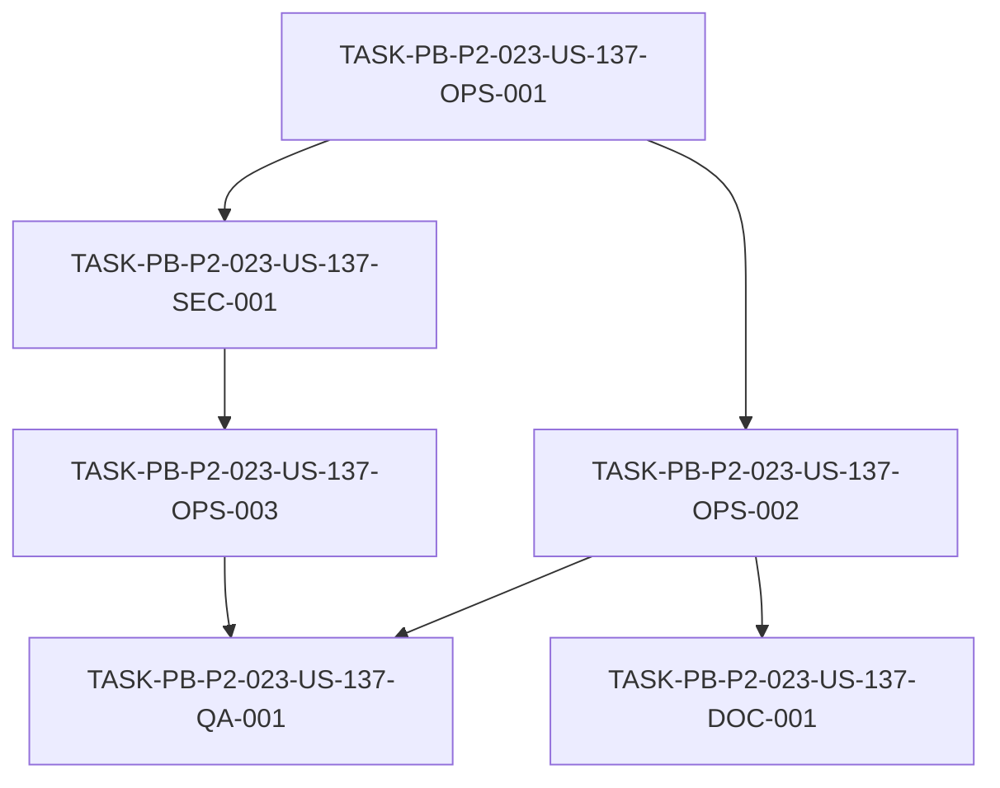

# Development Tasks — PB-P2-023 / US-137: Conectar RDS PostgreSQL

## 1. Metadata

| Field | Value |
|---|---|
| User Story ID | US-137 |
| Source User Story | `management/user-stories/US-137-connect-rds-postgresql.md` |
| Source Technical Specification | `management/technical-specs/P2/PB-P2-023/US-137-technical-spec.md` |
| Decision Resolution Artifact | N/A (no existe) |
| Priority | P2 (Must Have) |
| Backlog ID | PB-P2-023 |
| Backlog Title | RDS PostgreSQL gestionado (conectado al backend) |
| Backlog Execution Order | 23 (vigésimo tercer ítem de P2) |
| User Story Position in Backlog Item | 1 de 1 |
| Related User Stories in Backlog Item | US-137 |
| Epic | EPIC-OPS-001 |
| Backlog Item Dependencies | PB-P0-001 (schema/migraciones), PB-P2-022 (backend en App Runner) |
| Feature | RDS PostgreSQL gestionado |
| Module / Domain | DevOps / DB |
| Backlog Alignment Status | Found |
| Task Breakdown Status | Ready for Sprint Planning |
| Created Date | 2026-07-07 |
| Last Updated | 2026-07-07 |

---

## 2. Source Validation

| Source | Found | Used | Notes |
|---|---|---|---|
| User Story | Yes | Yes | `Approved with Minor Notes`. |
| Technical Specification | Yes | Yes | `Ready for Task Breakdown`. Fuente primaria. |
| Decision Resolution Artifact | No | No | No existe para US-137. |
| Product Backlog Prioritized | Yes | Yes | PB-P2-023, P2, EPIC-OPS-001. |
| ADRs | Yes | Yes | ADR-DB-001 (PostgreSQL), ADR-DEVOPS-001. |

---

## 3. Backlog Execution Context

### Parent Backlog Item

**PB-P2-023 — RDS PostgreSQL gestionado** (EPIC-OPS-001, P2, Must Have). RDS PostgreSQL en QA/Demo, SG restringido al backend, backups automáticos, conexión por env var. RDS reachable solo desde backend; `DATABASE_URL` por env; migrations corren contra RDS en pipeline. Dependencias: PB-P0-001, PB-P2-022.

### Execution Order Rationale

Vigésimo tercer ítem de P2. Depende del esquema/migraciones (PB-P0-001) y del backend desplegado (PB-P2-022). Provee la persistencia gestionada consumida por el backend.

### Related User Stories in Same Backlog Item

| User Story | Role in Backlog Item | Suggested Order |
|---|---|---|
| US-137 | Única historia (RDS gestionado) | 1 |

---

## 4. Task Breakdown Summary

| Area | Number of Tasks | Notes |
|---|---:|---|
| DevOps / Environment (OPS) | 3 | RDS+SG, backups/snapshots, migraciones+pool |
| Security / Authorization (SEC) | 1 | DATABASE_URL en Secrets Manager/SSM + SG |
| QA / Testing (QA) | 1 | Conexión + SG restringido + backups |
| Documentation (DOC) | 1 | Restore + estrategia por entorno + prioridad |
| **Total** | **6** | |

---

## 5. Traceability Matrix

| Acceptance Criterion | Technical Spec Section | Task IDs |
|---|---|---|
| AC-01 (RDS + SG) | §5, §10 | OPS-001 |
| AC-02 (backups) | §10 | OPS-002 |
| AC-03 (conexión por secreto) | §7, §12 | SEC-001, OPS-003 |
| AC-04 (migraciones en pipeline) | §10, §13 | OPS-003 |
| AC-05 (restore) | §10, §17 | DOC-001 |

---

## 6. Development Tasks

### TASK-PB-P2-023-US-137-OPS-001 — Provisionar RDS por entorno + security group restringido

| Field | Value |
|---|---|
| Area | DevOps / Environment |
| Type | Setup |
| Priority | Must |
| Estimate | M |
| Depends On | — |
| Source AC(s) | AC-01 |
| Technical Spec Section(s) | §5, §10 |
| Backlog ID | PB-P2-023 |
| User Story ID | US-137 |
| Owner Role | DevOps |
| Status | To Do |

#### Objective
Provisionar la instancia RDS PostgreSQL por entorno (QA/Demo): `db.t*` pequeña, GP3, Single-AZ, con un security group que restringe el acceso exclusivamente al backend (App Runner).

#### Scope
##### Include
* Instancia RDS por entorno; versión PostgreSQL compatible con Prisma.
* Security group solo backend; sin IP pública.
##### Exclude
* Backups (OPS-002) y migraciones (OPS-003).

#### Implementation Notes
Single-AZ MVP (Multi-AZ futuro); ADR-DB-001.

#### Acceptance Criteria Covered
AC-01.

#### Definition of Done
- [ ] RDS provisionado por entorno.
- [ ] SG restringe acceso solo al backend.
- [ ] Sin acceso público ni desde el frontend.

---

### TASK-PB-P2-023-US-137-OPS-002 — Backups automáticos + snapshots manuales

| Field | Value |
|---|---|
| Area | DevOps / Environment |
| Type | Setup |
| Priority | Must |
| Estimate | S |
| Depends On | OPS-001 |
| Source AC(s) | AC-02 |
| Technical Spec Section(s) | §10 |
| Backlog ID | PB-P2-023 |
| User Story ID | US-137 |
| Owner Role | DevOps |
| Status | To Do |

#### Objective
Habilitar backups automáticos de RDS (retención 7 días) y establecer el procedimiento de snapshots manuales antes de cambios mayores/demo.

#### Scope
##### Include
* Backups automáticos (7 días).
* Snapshot manual pre-cambio mayor.
##### Exclude
* Procedimiento de restore documentado (DOC-001).

#### Implementation Notes
Doc 21 §11.4.

#### Acceptance Criteria Covered
AC-02.

#### Definition of Done
- [ ] Backups automáticos habilitados (7 días).
- [ ] Snapshot manual verificado.

---

### TASK-PB-P2-023-US-137-SEC-001 — `DATABASE_URL` en Secrets Manager/SSM + verificación del SG

| Field | Value |
|---|---|
| Area | Security / Authorization |
| Type | Setup |
| Priority | Must |
| Estimate | S |
| Depends On | OPS-001 |
| Source AC(s) | AC-03 |
| Technical Spec Section(s) | §7, §12 |
| Backlog ID | PB-P2-023 |
| User Story ID | US-137 |
| Owner Role | DevOps |
| Status | To Do |

#### Objective
Almacenar `DATABASE_URL`/credenciales en Secrets Manager/SSM (no en repo/imagen), referenciarlas desde el backend y verificar que el security group bloquea el acceso externo; sin secretos en logs.

#### Scope
##### Include
* `DATABASE_URL` en Secrets Manager/SSM.
* Verificación de que el acceso externo está bloqueado.
##### Exclude
* Provisión de Secrets Manager (PB-P2-024).

#### Implementation Notes
SEC-02/SEC-03; Doc 21 §11.5.

#### Acceptance Criteria Covered
AC-03.

#### Definition of Done
- [ ] `DATABASE_URL` en Secrets Manager/SSM; no en repo.
- [ ] Acceso externo bloqueado (verificado).
- [ ] Sin cadenas de conexión/secretos en logs.

---

### TASK-PB-P2-023-US-137-OPS-003 — Migraciones contra RDS en el pipeline + pool Prisma

| Field | Value |
|---|---|
| Area | DevOps / Environment |
| Type | Setup |
| Priority | Must |
| Estimate | M |
| Depends On | SEC-001 |
| Source AC(s) | AC-03, AC-04 |
| Technical Spec Section(s) | §10, §13 |
| Backlog ID | PB-P2-023 |
| User Story ID | US-137 |
| Owner Role | DevOps |
| Status | To Do |

#### Objective
Integrar en el pipeline la validación de migraciones en CI (`prisma migrate diff`, `migrate deploy --dry-run`) y su aplicación en el entorno (`prisma migrate deploy`) contra RDS antes de servir tráfico; configurar el pool de conexiones Prisma moderado.

#### Scope
##### Include
* `migrate diff`/`--dry-run` en CI; `migrate deploy` en entorno.
* Pool Prisma moderado acorde a App Runner.
* Bloqueo de migraciones destructivas sin plan.
##### Exclude
* Cambios de esquema (PB-P0-001).

#### Implementation Notes
Doc 21 §11.3; cambios destructivos requieren plan.

#### Acceptance Criteria Covered
AC-03, AC-04.

#### Definition of Done
- [ ] Migraciones validadas en CI y aplicadas contra RDS en el entorno.
- [ ] Pool Prisma moderado configurado.
- [ ] Migración destructiva sin plan bloqueada.

---

### TASK-PB-P2-023-US-137-QA-001 — Verificación de conexión, SG y backups

| Field | Value |
|---|---|
| Area | QA / Testing |
| Type | Test |
| Priority | Must |
| Estimate | S |
| Depends On | OPS-002, OPS-003 |
| Source AC(s) | AC-01, AC-02, AC-03 |
| Technical Spec Section(s) | §13 |
| Backlog ID | PB-P2-023 |
| User Story ID | US-137 |
| Owner Role | QA |
| Status | To Do |

#### Objective
Verificar que el backend conecta a RDS vía `DATABASE_URL`, que el acceso externo está bloqueado por el SG y que los backups automáticos están habilitados.

#### Scope
##### Include
* Verificación de conexión backend↔RDS.
* Intento de acceso externo → bloqueado.
* Verificación de backups.
##### Exclude
* E2E de aplicación (US-128).

#### Implementation Notes
NT-01/NT-02.

#### Acceptance Criteria Covered
AC-01, AC-02, AC-03.

#### Definition of Done
- [ ] Conexión backend↔RDS verificada.
- [ ] Acceso externo bloqueado.
- [ ] Backups habilitados verificados.

---

### TASK-PB-P2-023-US-137-DOC-001 — Documentar restore, estrategia por entorno y nota de prioridad

| Field | Value |
|---|---|
| Area | Documentation / Traceability |
| Type | Documentation |
| Priority | Should |
| Estimate | XS |
| Depends On | OPS-002 |
| Source AC(s) | AC-05 |
| Technical Spec Section(s) | §16, §19 |
| Backlog ID | PB-P2-023 |
| User Story ID | US-137 |
| Owner Role | Tech Lead |
| Status | To Do |

#### Objective
Documentar el procedimiento de restore (restaurar snapshot a una nueva instancia y rotar `DATABASE_URL`), la estrategia por entorno (DBs distintas vs instancias separadas) y la nota de reconciliación de prioridad (P0 → P2).

#### Scope
##### Include
* Procedimiento de restore.
* Estrategia por entorno + nota de prioridad.
##### Exclude
* Cambios a Doc 21.

#### Implementation Notes
Resuelve las alertas de Documentation Alignment no bloqueantes.

#### Acceptance Criteria Covered
AC-05.

#### Definition of Done
- [ ] Procedimiento de restore documentado.
- [ ] Estrategia por entorno y nota de prioridad registradas.

---

## 7. Required QA Tasks

| Task ID | Test Type | Purpose |
|---|---|---|
| QA-001 | Config/Deploy | Conexión backend↔RDS + SG restringido + backups |

---

## 8. Required Security Tasks

| Task ID | Security Concern | Purpose |
|---|---|---|
| SEC-001 | Secretos + SG | `DATABASE_URL` en Secrets Manager/SSM; acceso externo bloqueado; sin secretos en logs |

---

## 9. Required Seed / Demo Tasks

`No aplica` — el contenido del seed se ejecuta vía backend (PB-P0-014).

---

## 10. Observability / Audit Tasks

`No aplica como tarea dedicada` — métricas básicas de RDS opcionales; sin secretos en logs (SEC-001).

---

## 11. Documentation / Traceability Tasks

| Task ID | Document / Artifact | Purpose |
|---|---|---|
| DOC-001 | Documentación de RDS | Restore + estrategia por entorno + nota de prioridad |

---

## 12. Dependency Graph

---

## 13. Suggested Implementation Order

### Phase 1 — Foundation
* OPS-001 (RDS + SG)

### Phase 2 — Core Implementation
* OPS-002 (backups/snapshots)
* SEC-001 (`DATABASE_URL` en Secrets Manager/SSM)
* OPS-003 (migraciones + pool Prisma)

### Phase 3 — Validation / Security / QA
* QA-001 (conexión + SG + backups)

### Phase 4 — Documentation / Review
* DOC-001 (restore + estrategia por entorno + prioridad)

---

## 14. Risks & Mitigations

| Risk | Impact | Mitigation | Related Task |
|---|---|---|---|
| Acceso público a RDS | Riesgo de seguridad | SG restringido; sin IP pública | OPS-001, QA-001 |
| `DATABASE_URL` filtrada | Riesgo de seguridad | Secrets Manager/SSM; sin secretos en logs | SEC-001 |
| Migración destructiva sin plan | Pérdida de datos | Plan documentado obligatorio | OPS-003 |
| Pérdida de datos | Indisponibilidad | Backups 7 días + snapshots + restore documentado | OPS-002, DOC-001 |
| Pool inadecuado | Saturación | Pool Prisma moderado | OPS-003 |

---

## 15. Out of Scope Confirmation

* Multi-AZ, réplicas, particionamiento, sharding, multi-región.
* Acceso directo del frontend a la BD.
* Provisión de Secrets Manager (PB-P2-024).
* Contenido del seed (PB-P0-014).

---

## 16. Readiness for Sprint Planning

| Check | Status |
|---|---|
| Product Backlog mapping found | Pass |
| Every AC maps to tasks | Pass |
| Technical Spec used when available | Pass |
| QA tasks included | Pass |
| Security tasks included if applicable | Pass |
| Seed/demo tasks included if applicable | N/A |
| Observability tasks included if applicable | N/A |
| Documentation tasks included if applicable | Pass |
| Task dependencies clear | Pass |
| Tasks small enough | Pass |
| Ready for Sprint Planning | Yes |

---

## 17. Final Recommendation

`Ready for Sprint Planning`

Las 6 tareas cubren todos los Acceptance Criteria (AC-01..AC-05), mapean a secciones del Technical Spec y respetan el orden de dependencias (RDS+SG → backups/secretos/migraciones → verificación → documentación). Se incluyen DevOps (RDS + SG + backups + migraciones + pool), seguridad (`DATABASE_URL` + SG), QA (conexión/SG/backups) y documentación (restore). Las alertas de Documentation Alignment (prioridad P0→P2 reconciliada; estrategia por entorno; Secrets dependiente de PB-P2-024) son **no bloqueantes**, gestionadas en DOC-001. Sin bloqueos ni scope creep.
