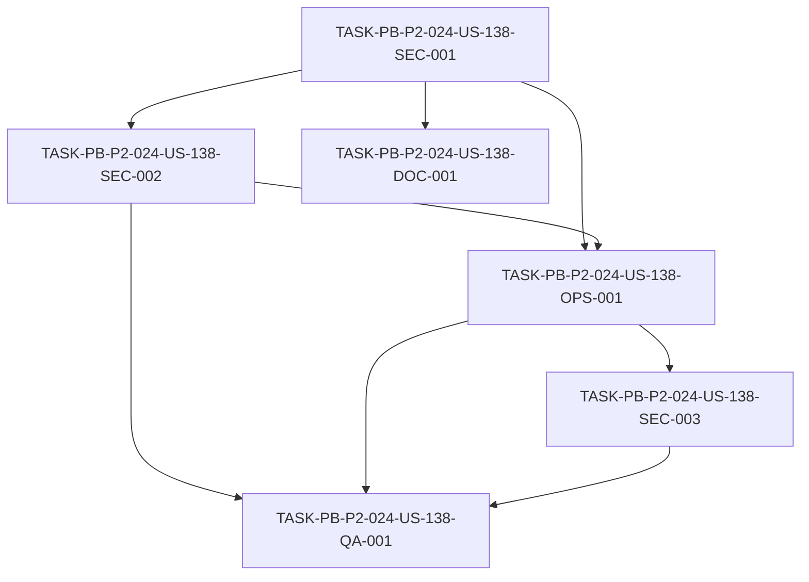

# Development Tasks — PB-P2-024 / US-138: Configurar Secrets Manager

## 1. Metadata

| Field | Value |
|---|---|
| User Story ID | US-138 |
| Source User Story | `management/user-stories/US-138-configure-secrets-manager.md` |
| Source Technical Specification | `management/technical-specs/P2/PB-P2-024/US-138-technical-spec.md` |
| Decision Resolution Artifact | N/A (no existe) |
| Priority | P2 (Must Have) |
| Backlog ID | PB-P2-024 |
| Backlog Title | Secrets en AWS Secrets Manager |
| Backlog Execution Order | 24 (vigésimo cuarto ítem de P2) |
| User Story Position in Backlog Item | 1 de 1 |
| Related User Stories in Backlog Item | US-138 |
| Epic | EPIC-OPS-001 |
| Backlog Item Dependencies | PB-P2-022 (backend en App Runner) |
| Feature | Secrets (AWS Secrets Manager) |
| Module / Domain | DevOps / Security |
| Backlog Alignment Status | Found |
| Task Breakdown Status | Ready for Sprint Planning |
| Created Date | 2026-07-07 |
| Last Updated | 2026-07-07 |

---

## 2. Source Validation

| Source | Found | Used | Notes |
|---|---|---|---|
| User Story | Yes | Yes | `Approved with Minor Notes`. |
| Technical Specification | Yes | Yes | `Ready for Task Breakdown`. Fuente primaria. |
| Decision Resolution Artifact | No | No | No existe para US-138. |
| Product Backlog Prioritized | Yes | Yes | PB-P2-024, P2, EPIC-OPS-001. |
| ADRs | Yes | Yes | ADR-SEC-001, ADR-DEVOPS-001. |

---

## 3. Backlog Execution Context

### Parent Backlog Item

**PB-P2-024 — Secrets Manager** (EPIC-OPS-001, P2, Must Have). Almacenar `OPENAI_API_KEY`, `CAPTCHA_SECRET`, `COOKIE_SIGNING_KEY` y otros en Secrets Manager. Rotación documentada. Secrets fuera del repo; IAM scope mínimo; rotación en runbook. Dependencia: PB-P2-022.

### Execution Order Rationale

Vigésimo cuarto ítem de P2. Depende del backend desplegado (PB-P2-022). Provee la gestión segura de secretos que consumen US-136 y US-137.

### Related User Stories in Same Backlog Item

| User Story | Role in Backlog Item | Suggested Order |
|---|---|---|
| US-138 | Única historia (Secrets Manager) | 1 |

---

## 4. Task Breakdown Summary

| Area | Number of Tasks | Notes |
|---|---:|---|
| Security / Authorization (SEC) | 3 | Crear secretos, IAM least-privilege, fail-fast/sin-logs |
| DevOps / Environment (OPS) | 1 | Referencia en App Runner + `.env.example` |
| QA / Testing (QA) | 1 | Verificación de secretos/IAM/logs |
| Documentation (DOC) | 1 | Runbook de rotación + naming + prioridad |
| **Total** | **6** | |

---

## 5. Traceability Matrix

| Acceptance Criterion | Technical Spec Section | Task IDs |
|---|---|---|
| AC-01 (secretos fuera del repo) | §4, §12 | SEC-001 |
| AC-02 (IAM mínimo) | §12 | SEC-002 |
| AC-03 (`.env.example`) | §5, §12 | OPS-001 |
| AC-04 (sin secretos en logs) | §7, §14 | SEC-003 |
| AC-05 (rotación) | §16, §19 | DOC-001 |

---

## 6. Development Tasks

### TASK-PB-P2-024-US-138-SEC-001 — Crear los secretos del backend en Secrets Manager por entorno

| Field | Value |
|---|---|
| Area | Security / Authorization |
| Type | Setup |
| Priority | Must |
| Estimate | S |
| Depends On | — |
| Source AC(s) | AC-01 |
| Technical Spec Section(s) | §4, §12 |
| Backlog ID | PB-P2-024 |
| User Story ID | US-138 |
| Owner Role | DevOps |
| Status | To Do |

#### Objective
Crear en AWS Secrets Manager, por entorno (QA/Demo), los secretos del backend: `DATABASE_URL`, `SESSION_SECRET`, `COOKIE_SECRET`, `CAPTCHA_SECRET_KEY`, `OPENAI_API_KEY` (nombres canónicos de Doc 21 §14.2).

#### Scope
##### Include
* Secretos por entorno con valores reales fuera del repo.
##### Exclude
* Variables de config no secretas (App Runner env).

#### Implementation Notes
Ningún secreto en repo/imagen (P-04).

#### Acceptance Criteria Covered
AC-01.

#### Definition of Done
- [ ] Secretos creados en Secrets Manager por entorno.
- [ ] Ninguno vive en repo/env plano.

---

### TASK-PB-P2-024-US-138-SEC-002 — Política IAM least-privilege para el rol de App Runner

| Field | Value |
|---|---|
| Area | Security / Authorization |
| Type | Setup |
| Priority | Must |
| Estimate | S |
| Depends On | SEC-001 |
| Source AC(s) | AC-02 |
| Technical Spec Section(s) | §12 |
| Backlog ID | PB-P2-024 |
| User Story ID | US-138 |
| Owner Role | DevOps |
| Status | To Do |

#### Objective
Configurar una política IAM de mínimo alcance que permita al rol de App Runner leer únicamente los secretos de su entorno, sin acceso a otros.

#### Scope
##### Include
* Política IAM least-privilege por entorno.
##### Exclude
* OIDC de CI (US-136/US-132).

#### Implementation Notes
Señalar/bloquear permisos excesivos (EC-02).

#### Acceptance Criteria Covered
AC-02.

#### Definition of Done
- [ ] Rol de App Runner lee solo los secretos de su entorno.
- [ ] Sin acceso a secretos de otros entornos.

---

### TASK-PB-P2-024-US-138-OPS-001 — Referencia de secretos en App Runner + `.env.example`

| Field | Value |
|---|---|
| Area | DevOps / Environment |
| Type | Setup |
| Priority | Must |
| Estimate | S |
| Depends On | SEC-001, SEC-002 |
| Source AC(s) | AC-01, AC-03 |
| Technical Spec Section(s) | §5, §12 |
| Backlog ID | PB-P2-024 |
| User Story ID | US-138 |
| Owner Role | DevOps |
| Status | To Do |

#### Objective
Referenciar los secretos desde la configuración de App Runner en runtime y crear/actualizar `.env.example` con los nombres de todas las variables (secretos + config) y sin valores reales.

#### Scope
##### Include
* Referencia de secretos en App Runner.
* `.env.example` con nombres/sin valores (Doc 21 §14.6).
##### Exclude
* Provisión de App Runner (PB-P2-022).

#### Implementation Notes
Coordinar con US-136 (App Runner) y US-137 (`DATABASE_URL`).

#### Acceptance Criteria Covered
AC-01, AC-03.

#### Definition of Done
- [ ] App Runner referencia los secretos en runtime.
- [ ] `.env.example` con nombres y sin valores.

---

### TASK-PB-P2-024-US-138-SEC-003 — Validación fail-fast y ausencia de secretos en logs

| Field | Value |
|---|---|
| Area | Security / Authorization |
| Type | Implementation |
| Priority | Must |
| Estimate | S |
| Depends On | OPS-001 |
| Source AC(s) | AC-04 |
| Technical Spec Section(s) | §7, §14 |
| Backlog ID | PB-P2-024 |
| User Story ID | US-138 |
| Owner Role | Backend |
| Status | To Do |

#### Objective
Validar la presencia de los secretos requeridos al arrancar el backend (fail-fast sin exponer valores) y garantizar que ningún secreto/cadena de conexión aparece en logs o artefactos.

#### Scope
##### Include
* Validación fail-fast de secretos requeridos.
* Enmascarado/omisión de secretos en logs; escaneo de secretos recomendado en CI.
##### Exclude
* Rotación (DOC-001).

#### Implementation Notes
EC-01; SEC-03.

#### Acceptance Criteria Covered
AC-04.

#### Definition of Done
- [ ] Arranque fail-fast si falta un secreto (sin exponer valor).
- [ ] Sin secretos en logs/artefactos (verificado).

---

### TASK-PB-P2-024-US-138-QA-001 — Verificación de secretos, IAM y logs

| Field | Value |
|---|---|
| Area | QA / Testing |
| Type | Test |
| Priority | Must |
| Estimate | S |
| Depends On | SEC-002, OPS-001, SEC-003 |
| Source AC(s) | AC-01, AC-02, AC-04 |
| Technical Spec Section(s) | §13 |
| Backlog ID | PB-P2-024 |
| User Story ID | US-138 |
| Owner Role | QA |
| Status | To Do |

#### Objective
Verificar que el backend lee los secretos desde Secrets Manager, que el IAM es de mínimo alcance, que `.env.example` no tiene valores y que no hay secretos en logs.

#### Scope
##### Include
* Verificación de lectura de secretos, IAM mínimo, `.env.example`, logs.
##### Exclude
* Pruebas de aplicación (otras suites).

#### Implementation Notes
NT-01..NT-04.

#### Acceptance Criteria Covered
AC-01, AC-02, AC-04.

#### Definition of Done
- [ ] Lectura de secretos verificada.
- [ ] IAM mínimo verificado; sin secretos en logs.

---

### TASK-PB-P2-024-US-138-DOC-001 — Runbook de rotación + naming + nota de prioridad

| Field | Value |
|---|---|
| Area | Documentation / Traceability |
| Type | Documentation |
| Priority | Should |
| Estimate | XS |
| Depends On | SEC-001 |
| Source AC(s) | AC-05 |
| Technical Spec Section(s) | §16, §19 |
| Backlog ID | PB-P2-024 |
| User Story ID | US-138 |
| Owner Role | Tech Lead |
| Status | To Do |

#### Objective
Documentar el runbook de rotación manual (actualizar el secreto en Secrets Manager y refrescar/redeploy del servicio), el naming canónico de secretos (Doc 21 §14.2) y la nota de reconciliación de prioridad (P0 → P2).

#### Scope
##### Include
* Runbook de rotación manual.
* Naming de secretos + nota de prioridad.
##### Exclude
* Rotación automática (fuera de alcance).

#### Implementation Notes
Resuelve las alertas de Documentation Alignment no bloqueantes.

#### Acceptance Criteria Covered
AC-05.

#### Definition of Done
- [ ] Runbook de rotación documentado.
- [ ] Naming de secretos y nota de prioridad registrados.

---

## 7. Required QA Tasks

| Task ID | Test Type | Purpose |
|---|---|---|
| QA-001 | Config/Security | Lectura de secretos + IAM mínimo + `.env.example` + sin secretos en logs |

---

## 8. Required Security Tasks

| Task ID | Security Concern | Purpose |
|---|---|---|
| SEC-001 | Secretos fuera del repo | Crear secretos en Secrets Manager por entorno |
| SEC-002 | IAM least-privilege | Rol de App Runner lee solo su entorno |
| SEC-003 | Fail-fast + logs | Validar secretos al arrancar; sin secretos en logs |

---

## 9. Required Seed / Demo Tasks

`No aplica` — la historia no modifica seed/datos.

---

## 10. Observability / Audit Tasks

`No aplica como tarea dedicada` — la ausencia de secretos en logs se cubre en SEC-003; errores de acceso a secretos visibles sin exponer valores.

---

## 11. Documentation / Traceability Tasks

| Task ID | Document / Artifact | Purpose |
|---|---|---|
| DOC-001 | Runbook de secretos | Rotación manual + naming + nota de prioridad |

---

## 12. Dependency Graph

---

## 13. Suggested Implementation Order

### Phase 1 — Foundation
* SEC-001 (crear secretos)

### Phase 2 — Core Implementation
* SEC-002 (IAM least-privilege)
* OPS-001 (referencia en App Runner + `.env.example`)

### Phase 3 — Validation / Security / QA
* SEC-003 (fail-fast + sin secretos en logs)
* QA-001 (verificación)

### Phase 4 — Documentation / Review
* DOC-001 (runbook + naming + prioridad)

---

## 14. Risks & Mitigations

| Risk | Impact | Mitigation | Related Task |
|---|---|---|---|
| Secreto en el repo | Exposición | Escaneo + `.env.example` sin valores | OPS-001, SEC-003 |
| IAM demasiado amplio | Exposición lateral | Política de mínimo alcance | SEC-002 |
| Secreto en logs | Fuga | Enmascarar/omitir; revisión | SEC-003 |
| Secreto ausente en runtime | Servicio caído | Fail-fast al arrancar | SEC-003 |
| Rotación no documentada | Riesgo operativo | Runbook de rotación manual | DOC-001 |

---

## 15. Out of Scope Confirmation

* Rotación automática de secretos.
* Variables de configuración no secretas (App Runner env).
* Provisión de App Runner (PB-P2-022) y RDS (PB-P2-023).
* Configuración de OIDC/GitHub Actions en detalle.

---

## 16. Readiness for Sprint Planning

| Check | Status |
|---|---|
| Product Backlog mapping found | Pass |
| Every AC maps to tasks | Pass |
| Technical Spec used when available | Pass |
| QA tasks included | Pass |
| Security tasks included if applicable | Pass |
| Seed/demo tasks included if applicable | N/A |
| Observability tasks included if applicable | N/A (cubierto en SEC-003) |
| Documentation tasks included if applicable | Pass |
| Task dependencies clear | Pass |
| Tasks small enough | Pass |
| Ready for Sprint Planning | Yes |

---

## 17. Final Recommendation

`Ready for Sprint Planning`

Las 6 tareas cubren todos los Acceptance Criteria (AC-01..AC-05), mapean a secciones del Technical Spec y respetan el orden de dependencias (crear secretos → IAM/referencia → fail-fast/sin-logs/verificación → runbook). Se incluyen seguridad (secretos + IAM + fail-fast/logs), DevOps (referencia + `.env.example`), QA (verificación) y documentación (runbook de rotación). Las alertas de Documentation Alignment (prioridad P0→P2 reconciliada; naming canónico Doc 21 §14.2; dependencias PB-P2-022/023) son **no bloqueantes**, gestionadas en DOC-001. Sin bloqueos ni scope creep.
