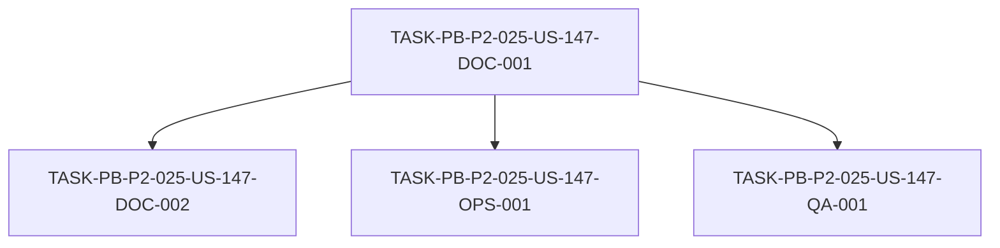

# Development Tasks — PB-P2-025 / US-147: Crear índice de ADRs

## 1. Metadata

| Field | Value |
|---|---|
| User Story ID | US-147 |
| Source User Story | `management/user-stories/US-147-adr-index.md` |
| Source Technical Specification | `management/technical-specs/P2/PB-P2-025/US-147-technical-spec.md` |
| Decision Resolution Artifact | N/A (no existe) |
| Priority | P2 (Should Have) |
| Backlog ID | PB-P2-025 |
| Backlog Title | Trazabilidad US ↔ FRD/UC/BR (matriz canónica) — "ADR index + matriz canónica" |
| Backlog Execution Order | 25 (vigésimo quinto ítem de P2) |
| User Story Position in Backlog Item | 1 de 2 (US-147 índice de ADRs; US-148 matriz) |
| Related User Stories in Backlog Item | US-147, US-148 |
| Epic | EPIC-ACAD-001 — Academic Traceability |
| Backlog Item Dependencies | — |
| Feature | Índice ADRs |
| Module / Domain | Demo / Académica |
| Backlog Alignment Status | Found (mapping dual resuelto por PO → PB-P2-025) |
| Task Breakdown Status | Ready for Sprint Planning |
| Created Date | 2026-07-07 |
| Last Updated | 2026-07-07 |

---

## 2. Source Validation

| Source | Found | Used | Notes |
|---|---|---|---|
| User Story | Yes | Yes | `Approved with Minor Notes`. |
| Technical Specification | Yes | Yes | `Ready for Task Breakdown`. Fuente primaria. |
| Decision Resolution Artifact | No | No | No existe para US-147. |
| Product Backlog Prioritized | Yes | Yes | PB-P2-025 (resuelto por PO). |
| ADRs | Yes | Yes | Doc 22 (46 ADRs aceptados). |

---

## 3. Backlog Execution Context

### Parent Backlog Item

**PB-P2-025 — ADR index + matriz canónica de trazabilidad** (EPIC-ACAD-001, P2, Should Have). (a) índice de ADRs ≥5 aceptados; (b) matriz US ↔ FRD/UC/BR/NFR/ADR. Índice ADR vivo; matriz 100% US; validación CI opcional. **US-147 cubre la parte (a)**; US-148 la parte (b).

### Execution Order Rationale

Vigésimo quinto ítem de P2. Historia académica sin dependencias de código. US-147 aparecía también en PB-P3-008 (P3); el PO eligió PB-P2-025 como canónico.

### Related User Stories in Same Backlog Item

| User Story | Role in Backlog Item | Suggested Order |
|---|---|---|
| US-147 | Índice de ADRs (parte a) | 1 |
| US-148 | Matriz de trazabilidad (parte b) | 2 |

---

## 4. Task Breakdown Summary

| Area | Number of Tasks | Notes |
|---|---:|---|
| Documentation (DOC) | 2 | Crear índice + documentar sincronización |
| DevOps / Environment (OPS) | 1 | Validación de cobertura en CI (opcional) |
| QA / Testing (QA) | 1 | Verificar cobertura del índice vs Doc 22 |
| **Total** | **4** | |

---

## 5. Traceability Matrix

| Acceptance Criterion | Technical Spec Section | Task IDs |
|---|---|---|
| AC-01 (índice de aceptados) | §4, §6 | DOC-001 |
| AC-02 (navegable) | §6 | DOC-001 |
| AC-03 (estados claros) | §6, §13 | DOC-001, QA-001 |
| AC-04 (índice vivo) | §6 | DOC-002 |
| AC-05 (CI opcional) | §13 | OPS-001 |

---

## 6. Development Tasks

### TASK-PB-P2-025-US-147-DOC-001 — Crear el índice maestro de ADRs aceptados

| Field | Value |
|---|---|
| Area | Documentation / Traceability |
| Type | Documentation |
| Priority | Must |
| Estimate | S |
| Depends On | — |
| Source AC(s) | AC-01, AC-02, AC-03 |
| Technical Spec Section(s) | §4, §6 |
| Backlog ID | PB-P2-025 |
| User Story ID | US-147 |
| Owner Role | Tech Lead |
| Status | To Do |

#### Objective
Crear el índice maestro de ADRs (sugerido `management/artifacts/ADR-Index.md`) listando todos los ADRs aceptados del Doc 22 (≥5; hoy 46) con título, estado, categoría y enlace (ancla) a su sección.

#### Scope
##### Include
* Formato del índice (título, estado, categoría, enlace).
* Poblar con los ADRs aceptados del Doc 22; estados claros.
##### Exclude
* La matriz de trazabilidad (US-148).

#### Implementation Notes
Doc 22 es la fuente de verdad; el índice la referencia, no la reemplaza.

#### Acceptance Criteria Covered
AC-01, AC-02, AC-03.

#### Definition of Done
- [ ] Índice creado con ≥5 ADRs aceptados (título/estado/categoría/enlace).
- [ ] Navegable hacia el Doc 22; estados claros.

---

### TASK-PB-P2-025-US-147-DOC-002 — Documentar el proceso de sincronización (índice vivo)

| Field | Value |
|---|---|
| Area | Documentation / Traceability |
| Type | Documentation |
| Priority | Should |
| Estimate | XS |
| Depends On | DOC-001 |
| Source AC(s) | AC-04 |
| Technical Spec Section(s) | §6 |
| Backlog ID | PB-P2-025 |
| User Story ID | US-147 |
| Owner Role | Tech Lead |
| Status | To Do |

#### Objective
Documentar el proceso para mantener el índice sincronizado con el Doc 22 (manual o script) ante altas, cambios de estado o `Superseded`.

#### Scope
##### Include
* Proceso de sincronización documentado; manejo de `Superseded` (estado + enlace de reemplazo).
##### Exclude
* Automatización obligatoria.

#### Implementation Notes
EC-01/EC-02.

#### Acceptance Criteria Covered
AC-04.

#### Definition of Done
- [ ] Proceso de sincronización documentado.
- [ ] Manejo de `Superseded` definido.

---

### TASK-PB-P2-025-US-147-OPS-001 — Validación de cobertura del índice en CI (opcional)

| Field | Value |
|---|---|
| Area | DevOps / Environment |
| Type | Setup |
| Priority | Could |
| Estimate | S |
| Depends On | DOC-001 |
| Source AC(s) | AC-05 |
| Technical Spec Section(s) | §13 |
| Backlog ID | PB-P2-025 |
| User Story ID | US-147 |
| Owner Role | DevOps |
| Status | To Do |

#### Objective
(Opcional) Añadir una validación en CI que compare el índice con la tabla de ADRs aceptados del Doc 22 y señale desactualizaciones (no bloqueante).

#### Scope
##### Include
* Script/paso de CI que verifica cobertura índice↔Doc 22.
##### Exclude
* Compuerta bloqueante obligatoria.

#### Implementation Notes
Opcional; confirmar activación con Tech Lead.

#### Acceptance Criteria Covered
AC-05.

#### Definition of Done
- [ ] (Si se activa) validación de cobertura en CI, no bloqueante.

---

### TASK-PB-P2-025-US-147-QA-001 — Verificar cobertura y estados del índice

| Field | Value |
|---|---|
| Area | QA / Testing |
| Type | Test |
| Priority | Must |
| Estimate | XS |
| Depends On | DOC-001 |
| Source AC(s) | AC-01, AC-03 |
| Technical Spec Section(s) | §13 |
| Backlog ID | PB-P2-025 |
| User Story ID | US-147 |
| Owner Role | QA |
| Status | To Do |

#### Objective
Verificar que el índice cubre los ADRs aceptados del Doc 22 (≥5), que cada entrada tiene título/estado/enlace y que los estados coinciden con el Doc 22.

#### Scope
##### Include
* Revisión de cobertura, campos y estados vs Doc 22.
##### Exclude
* Validación automatizada (OPS-001).

#### Implementation Notes
NT-01/NT-02.

#### Acceptance Criteria Covered
AC-01, AC-03.

#### Definition of Done
- [ ] Cobertura ≥5 verificada.
- [ ] Campos y estados consistentes con el Doc 22.

---

## 7. Required QA Tasks

| Task ID | Test Type | Purpose |
|---|---|---|
| QA-001 | Docs/Coverage | Cobertura, campos y estados del índice vs Doc 22 |

---

## 8. Required Security Tasks

`No aplica` — artefacto documental sin secretos.

---

## 9. Required Seed / Demo Tasks

`No aplica`.

---

## 10. Observability / Audit Tasks

`No aplica`.

---

## 11. Documentation / Traceability Tasks

| Task ID | Document / Artifact | Purpose |
|---|---|---|
| DOC-001 | `management/artifacts/ADR-Index.md` | Índice maestro de ADRs aceptados |
| DOC-002 | Proceso de sincronización | Mantener el índice vivo |

---

## 12. Dependency Graph

---

## 13. Suggested Implementation Order

### Phase 1 — Foundation
* DOC-001 (crear el índice)

### Phase 2 — Core Implementation
* DOC-002 (proceso de sincronización)

### Phase 3 — Validation / QA
* QA-001 (verificación de cobertura/estados)
* OPS-001 (validación en CI, opcional)

### Phase 4 — Documentation / Review
* (incluido en DOC-001/DOC-002)

---

## 14. Risks & Mitigations

| Risk | Impact | Mitigation | Related Task |
|---|---|---|---|
| Índice desactualizado | Evidencia inconsistente | Proceso de sincronización + validación opcional | DOC-002, OPS-001 |
| Duplicación de fuente de verdad | Confusión | El índice referencia el Doc 22 | DOC-001 |
| Enlaces rotos | Navegación fallida | Anclas estables; verificar enlaces | DOC-001, QA-001 |

---

## 15. Out of Scope Confirmation

* La matriz canónica de trazabilidad US ↔ FRD/UC/BR/NFR/ADR (US-148).
* Autoría de nuevos ADRs o modificación de ADRs existentes.
* Validación bloqueante obligatoria en CI.

---

## 16. Readiness for Sprint Planning

| Check | Status |
|---|---|
| Product Backlog mapping found | Pass |
| Every AC maps to tasks | Pass |
| Technical Spec used when available | Pass |
| QA tasks included | Pass |
| Security tasks included if applicable | N/A |
| Seed/demo tasks included if applicable | N/A |
| Observability tasks included if applicable | N/A |
| Documentation tasks included if applicable | Pass |
| Task dependencies clear | Pass |
| Tasks small enough | Pass |
| Ready for Sprint Planning | Yes |

---

## 17. Final Recommendation

`Ready for Sprint Planning`

Las 4 tareas cubren todos los Acceptance Criteria (AC-01..AC-05), mapean a secciones del Technical Spec y respetan el orden de dependencias (crear índice → sincronización → verificación/validación). Se incluyen documentación (índice + proceso), QA (cobertura/estados) y DevOps (validación CI opcional). El alcance está delimitado frente a **US-148** (matriz de trazabilidad) dentro del mismo ítem PB-P2-025. Las alertas de Documentation Alignment (mapping dual resuelto por PO; ubicación del índice; validación CI opcional) son **no bloqueantes**. Sin bloqueos ni scope creep.
