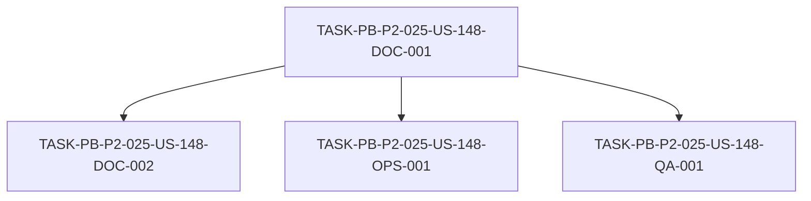

# Development Tasks — PB-P2-025 / US-148: Trazabilidad US → FRD/UC/BR

## 1. Metadata

| Field | Value |
|---|---|
| User Story ID | US-148 |
| Source User Story | `management/user-stories/US-148-us-frd-uc-traceability.md` |
| Source Technical Specification | `management/technical-specs/P2/PB-P2-025/US-148-technical-spec.md` |
| Decision Resolution Artifact | N/A (no existe) |
| Priority | P2 (Should Have) |
| Backlog ID | PB-P2-025 |
| Backlog Title | Trazabilidad US ↔ FRD/UC/BR (matriz canónica) — "ADR index + matriz canónica" |
| Backlog Execution Order | 25 (vigésimo quinto ítem de P2) |
| User Story Position in Backlog Item | 2 de 2 (US-147 índice de ADRs; US-148 matriz) |
| Related User Stories in Backlog Item | US-147, US-148 |
| Epic | EPIC-ACAD-001 — Academic Traceability |
| Backlog Item Dependencies | — |
| Feature | Traceability matrix US |
| Module / Domain | Demo / Académica |
| Backlog Alignment Status | Found (mapping dual resuelto → PB-P2-025) |
| Task Breakdown Status | Ready for Sprint Planning |
| Created Date | 2026-07-07 |
| Last Updated | 2026-07-07 |

---

## 2. Source Validation

| Source | Found | Used | Notes |
|---|---|---|---|
| User Story | Yes | Yes | `Approved with Minor Notes`. |
| Technical Specification | Yes | Yes | `Ready for Task Breakdown`. Fuente primaria. |
| Decision Resolution Artifact | No | No | No existe para US-148. |
| Product Backlog Prioritized | Yes | Yes | PB-P2-025 (canónico). |
| Coverage Matrix | Yes | Yes | `2-User-Stories-Coverage-Matrix.md` (Epic→Feature→US). |

---

## 3. Backlog Execution Context

### Parent Backlog Item

**PB-P2-025 — ADR index + matriz canónica de trazabilidad** (EPIC-ACAD-001, P2, Should Have). (a) índice de ADRs; (b) matriz US ↔ FRD/UC/BR/NFR/ADR. Matriz cubre 100% US; validación CI opcional. **US-148 cubre la parte (b)**; US-147 la parte (a).

### Execution Order Rationale

Vigésimo quinto ítem de P2. Historia académica sin dependencias de código. US-148 aparecía también en PB-P3-009 (P3, validación); el ítem canónico es PB-P2-025 (matriz). PB-P3-009 (validación) es separada.

### Related User Stories in Same Backlog Item

| User Story | Role in Backlog Item | Suggested Order |
|---|---|---|
| US-147 | Índice de ADRs (parte a) | 1 |
| US-148 | Matriz de trazabilidad (parte b) | 2 |

---

## 4. Task Breakdown Summary

| Area | Number of Tasks | Notes |
|---|---:|---|
| Documentation (DOC) | 2 | Crear matriz + documentar sincronización |
| DevOps / Environment (OPS) | 1 | Validación de cobertura 100% en CI (opcional) |
| QA / Testing (QA) | 1 | Verificar cobertura 100% y consistencia |
| **Total** | **4** | |

---

## 5. Traceability Matrix

| Acceptance Criterion | Technical Spec Section | Task IDs |
|---|---|---|
| AC-01 (matriz canónica) | §4, §6 | DOC-001 |
| AC-02 (100% US) | §6, §13 | DOC-001, QA-001 |
| AC-03 (referencias mínimas) | §6 | DOC-001 |
| AC-04 (matriz viva) | §6 | DOC-002 |
| AC-05 (CI opcional) | §13 | OPS-001 |

---

## 6. Development Tasks

### TASK-PB-P2-025-US-148-DOC-001 — Crear la matriz de trazabilidad US ↔ FRD/UC/BR/NFR/ADR

| Field | Value |
|---|---|
| Area | Documentation / Traceability |
| Type | Documentation |
| Priority | Must |
| Estimate | M |
| Depends On | — |
| Source AC(s) | AC-01, AC-02, AC-03 |
| Technical Spec Section(s) | §4, §6 |
| Backlog ID | PB-P2-025 |
| User Story ID | US-148 |
| Owner Role | Business Analyst |
| Status | To Do |

#### Objective
Crear `management/artifacts/User-Stories-Traceability-Matrix.md` con columnas (US·Título·Epic/Feature·FRD·UC·BR·NFR·ADR·Notas), poblada desde las secciones `Traceability` de todas las US (cobertura 100%), marcando las US transversales como `Transversal` sin inventar IDs.

#### Scope
##### Include
* Estructura de la matriz + poblado del 100% de las US.
* Marcado de transversales.
##### Exclude
* Validación/reporte de gaps (PB-P3-009); índice de ADRs (US-147).

#### Implementation Notes
Fuente = sección `Traceability` de cada US; no inventar IDs.

#### Acceptance Criteria Covered
AC-01, AC-02, AC-03.

#### Definition of Done
- [ ] Matriz creada con el 100% de las US.
- [ ] US funcionales con ≥1 FRD/UC/BR; transversales marcadas.

---

### TASK-PB-P2-025-US-148-DOC-002 — Documentar el proceso de sincronización (matriz viva)

| Field | Value |
|---|---|
| Area | Documentation / Traceability |
| Type | Documentation |
| Priority | Should |
| Estimate | XS |
| Depends On | DOC-001 |
| Source AC(s) | AC-04 |
| Technical Spec Section(s) | §6 |
| Backlog ID | PB-P2-025 |
| User Story ID | US-148 |
| Owner Role | Business Analyst |
| Status | To Do |

#### Objective
Documentar el proceso para mantener la matriz sincronizada con las US (manual o script) ante altas/cambios de trazabilidad.

#### Scope
##### Include
* Proceso de sincronización documentado.
##### Exclude
* Automatización obligatoria.

#### Implementation Notes
EC-02; considerar script si el volumen (~150 US) lo amerita.

#### Acceptance Criteria Covered
AC-04.

#### Definition of Done
- [ ] Proceso de sincronización documentado.

---

### TASK-PB-P2-025-US-148-OPS-001 — Validación de cobertura 100% de la matriz en CI (opcional)

| Field | Value |
|---|---|
| Area | DevOps / Environment |
| Type | Setup |
| Priority | Could |
| Estimate | S |
| Depends On | DOC-001 |
| Source AC(s) | AC-05 |
| Technical Spec Section(s) | §13 |
| Backlog ID | PB-P2-025 |
| User Story ID | US-148 |
| Owner Role | DevOps |
| Status | To Do |

#### Objective
(Opcional) Añadir una validación en CI que confirme que la matriz cubre el 100% de las US del backlog y señale ausencias (no bloqueante).

#### Scope
##### Include
* Script/paso de CI de cobertura 100%.
##### Exclude
* Validación/reporte de gaps FRD/UC/BR (PB-P3-009); compuerta bloqueante.

#### Implementation Notes
Opcional; confirmar activación con Tech Lead.

#### Acceptance Criteria Covered
AC-05.

#### Definition of Done
- [ ] (Si se activa) validación de cobertura 100% en CI, no bloqueante.

---

### TASK-PB-P2-025-US-148-QA-001 — Verificar cobertura 100% y consistencia

| Field | Value |
|---|---|
| Area | QA / Testing |
| Type | Test |
| Priority | Must |
| Estimate | S |
| Depends On | DOC-001 |
| Source AC(s) | AC-02 |
| Technical Spec Section(s) | §13 |
| Backlog ID | PB-P2-025 |
| User Story ID | US-148 |
| Owner Role | QA |
| Status | To Do |

#### Objective
Verificar que la matriz incluye el 100% de las US del backlog, que las referencias son consistentes con las secciones `Traceability` de las US y que no hay IDs inventados.

#### Scope
##### Include
* Revisión de cobertura, consistencia y ausencia de IDs inventados.
##### Exclude
* Validación automatizada (OPS-001).

#### Implementation Notes
NT-01/NT-02.

#### Acceptance Criteria Covered
AC-02.

#### Definition of Done
- [ ] Cobertura 100% verificada.
- [ ] Referencias consistentes; sin IDs inventados.

---

## 7. Required QA Tasks

| Task ID | Test Type | Purpose |
|---|---|---|
| QA-001 | Docs/Coverage | Cobertura 100% + consistencia de la matriz vs secciones `Traceability` |

---

## 8. Required Security Tasks

`No aplica` — artefacto documental sin secretos.

---

## 9. Required Seed / Demo Tasks

`No aplica`.

---

## 10. Observability / Audit Tasks

`No aplica`.

---

## 11. Documentation / Traceability Tasks

| Task ID | Document / Artifact | Purpose |
|---|---|---|
| DOC-001 | `management/artifacts/User-Stories-Traceability-Matrix.md` | Matriz canónica US ↔ FRD/UC/BR/NFR/ADR |
| DOC-002 | Proceso de sincronización | Mantener la matriz viva |

---

## 12. Dependency Graph

---

## 13. Suggested Implementation Order

### Phase 1 — Foundation
* DOC-001 (crear la matriz)

### Phase 2 — Core Implementation
* DOC-002 (proceso de sincronización)

### Phase 3 — Validation / QA
* QA-001 (verificación de cobertura/consistencia)
* OPS-001 (validación en CI, opcional)

### Phase 4 — Documentation / Review
* (incluido en DOC-001/DOC-002)

---

## 14. Risks & Mitigations

| Risk | Impact | Mitigation | Related Task |
|---|---|---|---|
| Matriz desactualizada | Evidencia inconsistente | Proceso de sincronización + validación opcional | DOC-002, OPS-001 |
| IDs inventados | Trazabilidad falsa | Regla: no inventar; usar `Transversal` | DOC-001, QA-001 |
| Confusión con matriz de cobertura | Duplicación aparente | Documentar la distinción | DOC-001 |
| Volumen alto (~150 US) | Esfuerzo manual | Considerar script de consolidación | DOC-002 |

---

## 15. Out of Scope Confirmation

* Herramienta de validación/reporte de gaps FRD/UC/BR (PB-P3-009).
* Índice de ADRs (US-147).
* Autoría/modificación de FRD/UC/BR/NFR/ADR.
* Validación bloqueante obligatoria en CI.

---

## 16. Readiness for Sprint Planning

| Check | Status |
|---|---|
| Product Backlog mapping found | Pass |
| Every AC maps to tasks | Pass |
| Technical Spec used when available | Pass |
| QA tasks included | Pass |
| Security tasks included if applicable | N/A |
| Seed/demo tasks included if applicable | N/A |
| Observability tasks included if applicable | N/A |
| Documentation tasks included if applicable | Pass |
| Task dependencies clear | Pass |
| Tasks small enough | Pass |
| Ready for Sprint Planning | Yes |

---

## 17. Final Recommendation

`Ready for Sprint Planning`

Las 4 tareas cubren todos los Acceptance Criteria (AC-01..AC-05), mapean a secciones del Technical Spec y respetan el orden de dependencias (crear matriz → sincronización → verificación/validación). Se incluyen documentación (matriz + proceso), QA (cobertura/consistencia) y DevOps (validación CI opcional). El alcance está delimitado frente a **US-147** (índice de ADRs) dentro de PB-P2-025 y frente a **PB-P3-009** (validación/reporte de gaps). Las alertas de Documentation Alignment (mapping dual resuelto; distinción vs matriz de cobertura; validación CI opcional) son **no bloqueantes**. Sin bloqueos ni scope creep.
