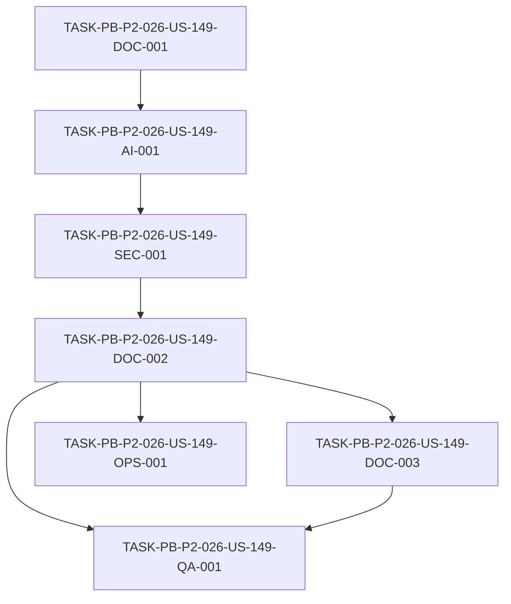

# Development Tasks — PB-P2-026 / US-149: Documentar prompts y outputs ejemplares

## 1. Metadata

| Field | Value |
|---|---|
| User Story ID | US-149 |
| Source User Story | `management/user-stories/US-149-document-prompt-outputs.md` |
| Source Technical Specification | `management/technical-specs/P2/PB-P2-026/US-149-technical-spec.md` |
| Decision Resolution Artifact | No aplica |
| Priority | P2 |
| Backlog ID | PB-P2-026 |
| Backlog Title | Catálogo de prompts y outputs ejemplares |
| Backlog Execution Order | P2 — Item 26 (último de la sección P2) |
| User Story Position in Backlog Item | 1 de 1 |
| Related User Stories in Backlog Item | US-149 (única) |
| Epic | EPIC-ACAD-001 — Academic Traceability |
| Backlog Item Dependencies | PB-P0-010 (Prompt Registry & AIRecommendation Persistence) |
| Feature | Prompts ejemplares |
| Module / Domain | Demo / Académica / AI (PromptOps) |
| Backlog Alignment Status | Found |
| Task Breakdown Status | Ready for Sprint Planning |
| Created Date | 2026-07-07 |
| Last Updated | 2026-07-07 |

---

## 2. Source Validation

| Source | Found | Used | Notes |
|---|---|---|---|
| User Story | Yes | Yes | Approved with Minor Notes |
| Technical Specification | Yes | Yes | Ready for Task Breakdown; fuente primaria |
| Decision Resolution Artifact | No | No | No existe para US-149 |
| Product Backlog Prioritized | Yes | Yes | PB-P2-026 mapeado |
| ADRs | Yes | Yes | ADR-AI-001, ADR-AI-005, ADR-AI-006 (referencia) |

---

## 3. Backlog Execution Context

### Parent Backlog Item

**PB-P2-026 — Catálogo de prompts y outputs ejemplares** (P2, Should Have, EPIC-ACAD-001). Mantener `management/artifacts/AI-Prompt-Evidence-Catalog.md` con prompts versionados por feature IA, ejemplos de input/output sanitizados y trazabilidad a `AIPromptVersion` y a IDs de `AIRecommendation` reales. Depende de PB-P0-010.

### Execution Order Rationale

US-149 pertenece a PB-P2-026 (P2). Se ejecuta tras existir la infraestructura de PromptOps (PB-P0-010) y tras contar con `AIRecommendation` reales de las 7 features IA del MVP. No bloquea runtime: es un artefacto documental. Por decisión del PO, el ítem canónico de entrega es PB-P2-026; PB-P3-010 completará ejemplos representativos como historia separada.

### Related User Stories in Same Backlog Item

| User Story | Role in Backlog Item | Suggested Order |
|---|---|---|
| US-149 | Creación/mantenimiento del catálogo con ≥1 ejemplo por feature IA | 1 |

---

## 4. Task Breakdown Summary

| Area | Number of Tasks | Notes |
|---|---:|---|
| AI / PromptOps | 1 | Recopilación de prompts versionados + `AIRecommendation` reales por feature (7) |
| Security / Authorization | 1 | Sanitización obligatoria (sin PII/secretos) con validación humana |
| Documentation / Traceability | 3 | Plantilla, redacción del catálogo con evidencia PromptOps, proceso de sincronización |
| QA / Testing | 1 | Cobertura por feature + trazabilidad + sanitización |
| DevOps / Environment | 1 | (Opcional/Could) check de cobertura + secret-scan en CI |
| **Total** | **7** | Rango: DOC-001..003, AI-001, SEC-001, QA-001, OPS-001 |

---

## 5. Traceability Matrix

| Acceptance Criterion | Technical Spec Section | Task IDs |
|---|---|---|
| AC-01: Catálogo con un ejemplo por feature IA | §6, §11, §18 | TASK-PB-P2-026-US-149-AI-001, TASK-PB-P2-026-US-149-DOC-002, TASK-PB-P2-026-US-149-QA-001 |
| AC-02: Trazabilidad a AIPromptVersion y AIRecommendation | §6, §10, §11 | TASK-PB-P2-026-US-149-AI-001, TASK-PB-P2-026-US-149-DOC-002, TASK-PB-P2-026-US-149-QA-001 |
| AC-03: Datos sanitizados | §12, §13 | TASK-PB-P2-026-US-149-SEC-001, TASK-PB-P2-026-US-149-QA-001 |
| AC-04: Catálogo vivo | §13, §17, §19 | TASK-PB-P2-026-US-149-DOC-003, TASK-PB-P2-026-US-149-OPS-001 |
| AC-05: Evidencia de PromptOps responsable | §5, §11 | TASK-PB-P2-026-US-149-DOC-002 |

Todos los AC mapean a al menos una tarea.

---

## 6. Development Tasks

### TASK-PB-P2-026-US-149-DOC-001 — Definir plantilla y estructura del catálogo de evidencia

| Field | Value |
|---|---|
| Area | Documentation / Traceability |
| Type | Setup |
| Priority | Must |
| Estimate | S |
| Depends On | — |
| Source AC(s) | AC-01, AC-02, AC-05 |
| Technical Spec Section(s) | §3, §6, §18 |
| Backlog ID | PB-P2-026 |
| User Story ID | US-149 |
| Owner Role | AI / Tech Lead |
| Status | To Do |

#### Objective

Crear el archivo `management/artifacts/AI-Prompt-Evidence-Catalog.md` con una plantilla que defina una sección por feature IA del MVP (AI-001, AI-002, AI-003, AI-004, AI-005, AI-006, AI-008) y los campos requeridos por ejemplo.

#### Scope

##### Include

- Estructura de encabezado del catálogo y propósito (evidencia AI4Devs / PromptOps responsable).
- Una sección por cada una de las 7 features IA del MVP.
- Campos por ejemplo: Feature, `prompt_version_id`/`promptVersion`, prompt versionado, input sanitizado, output sanitizado, IDs de `AIRecommendation`, notas.
- Sección para evidencia de PromptOps (versionado, human-in-the-loop, abstracción de proveedor).

##### Exclude

- Contenido real de ejemplos (se llena en DOC-002).
- AI-007 (fuera del MVP).

#### Implementation Notes

Alinear con Doc 17 (PromptOps) y Doc 7 (features IA). Mantener identificadores técnicos en inglés. Español LATAM neutral para prosa.

#### Acceptance Criteria Covered

AC-01 (estructura de cobertura por feature), AC-02 (campos de trazabilidad), AC-05 (sección de evidencia PromptOps).

#### Definition of Done

- [ ] Existe `management/artifacts/AI-Prompt-Evidence-Catalog.md` con 7 secciones (una por feature IA del MVP).
- [ ] Cada sección incluye los campos de prompt, input, output, `promptVersion` y `AIRecommendation`.
- [ ] Incluye sección de evidencia de PromptOps responsable.

---

### TASK-PB-P2-026-US-149-AI-001 — Recopilar prompts versionados y AIRecommendation reales por feature

| Field | Value |
|---|---|
| Area | AI / PromptOps |
| Type | Implementation |
| Priority | Must |
| Estimate | M |
| Depends On | TASK-PB-P2-026-US-149-DOC-001 |
| Source AC(s) | AC-01, AC-02 |
| Technical Spec Section(s) | §10, §11, §18 |
| Backlog ID | PB-P2-026 |
| User Story ID | US-149 |
| Owner Role | AI |
| Status | To Do |

#### Objective

Para cada una de las 7 features IA del MVP, recopilar la versión de prompt vigente (Prompt Registry / `AIPromptVersion`) y seleccionar al menos un `AIRecommendation` real con `input_payload`/`output_payload` de ejemplo.

#### Scope

##### Include

- Lectura de solo referencia sobre `ai_prompt_versions` y `ai_recommendations`.
- Mapeo por feature: `prompt_version_id` + IDs de `AIRecommendation` reales.
- Selección de ejemplos representativos (≥1 por feature).
- Documentar opcionalmente un caso con `fallback_used=true` (BR-AI-009) como evidencia.

##### Exclude

- Persistir nuevos `AIRecommendation` o modificar `AIPromptVersion`.
- Invocar `LLMProvider` o cualquier proveedor de IA.
- Completar todos los ejemplos representativos (PB-P3-010).

#### Implementation Notes

Datos de solo lectura; extracción manual/curada, no acceso programático de runtime. Si una feature no tiene ejecuciones reales, señalarla como incompleta (no inventar IDs) — ver EC-02/NT-01.

#### Acceptance Criteria Covered

AC-01 (cobertura por feature), AC-02 (trazabilidad a `promptVersion` y `AIRecommendation`).

#### Definition of Done

- [ ] Se identificó `prompt_version_id` vigente por feature (7).
- [ ] Se seleccionó ≥1 `AIRecommendation` real por feature con input/output de ejemplo.
- [ ] Las features sin ejecuciones reales quedan marcadas como incompletas (sin IDs inventados).

---

### TASK-PB-P2-026-US-149-SEC-001 — Sanitizar input/output antes de la inclusión

| Field | Value |
|---|---|
| Area | Security / Authorization |
| Type | Implementation |
| Priority | Must |
| Estimate | M |
| Depends On | TASK-PB-P2-026-US-149-AI-001 |
| Source AC(s) | AC-03 |
| Technical Spec Section(s) | §12, §13 |
| Backlog ID | PB-P2-026 |
| User Story ID | US-149 |
| Owner Role | AI / Tech Lead |
| Status | To Do |

#### Objective

Aplicar sanitización obligatoria a los ejemplos de `input_payload`/`output_payload`: enmascarar/reemplazar PII y eliminar cualquier secreto o API key antes de su inclusión, con validación humana (human-in-the-loop).

#### Scope

##### Include

- Enmascarado de PII (nombres, correos, teléfonos, direcciones, datos personales).
- Eliminación de secretos (`OPENAI_API_KEY`, tokens, credenciales).
- Revisión humana previa a la inclusión (EC-01).

##### Exclude

- Inclusión de cualquier dato sin sanitizar (bloqueo, NT-02).

#### Implementation Notes

Cumplir Doc 19 (SEC-01..03). Ante PII/secreto sin sanitizar, bloquear la inclusión. Sin secretos/PII en logs.

#### Acceptance Criteria Covered

AC-03 (datos sanitizados).

#### Definition of Done

- [ ] Todo input/output incluido está sanitizado (sin PII).
- [ ] No hay secretos ni `OPENAI_API_KEY` en el material a incluir.
- [ ] Validación humana registrada antes de la inclusión.

---

### TASK-PB-P2-026-US-149-DOC-002 — Redactar el catálogo con ejemplos y evidencia de PromptOps

| Field | Value |
|---|---|
| Area | Documentation / Traceability |
| Type | Documentation |
| Priority | Must |
| Estimate | M |
| Depends On | TASK-PB-P2-026-US-149-SEC-001 |
| Source AC(s) | AC-01, AC-02, AC-05 |
| Technical Spec Section(s) | §5, §6, §11 |
| Backlog ID | PB-P2-026 |
| User Story ID | US-149 |
| Owner Role | AI / PO |
| Status | To Do |

#### Objective

Poblar `AI-Prompt-Evidence-Catalog.md` con ≥1 ejemplo sanitizado por feature (prompt versionado + input/output + `promptVersion` + IDs de `AIRecommendation`) y completar la sección de evidencia de PromptOps responsable.

#### Scope

##### Include

- ≥1 ejemplo sanitizado por cada feature IA del MVP (7).
- Referencias `prompt_version_id`/`promptVersion` y IDs de `AIRecommendation` por ejemplo.
- Sección de evidencia de PromptOps con referencias a ADR-AI-006 (versionado), ADR-AI-005 (human-in-the-loop) y ADR-AI-001 (abstracción de proveedor).

##### Exclude

- Ejemplos representativos completos (PB-P3-010).
- Contenido sin sanitizar.

#### Implementation Notes

Usar solo material sanitizado de SEC-001. Español LATAM neutral; identificadores/prompts técnicos en su forma canónica.

#### Acceptance Criteria Covered

AC-01, AC-02, AC-05.

#### Definition of Done

- [ ] El catálogo contiene ≥1 ejemplo sanitizado por feature (7).
- [ ] Cada ejemplo referencia `promptVersion` y ≥1 `AIRecommendation` real.
- [ ] La sección de PromptOps referencia ADR-AI-001/005/006.

---

### TASK-PB-P2-026-US-149-DOC-003 — Documentar el proceso de sincronización y sanitización (catálogo vivo)

| Field | Value |
|---|---|
| Area | Documentation / Traceability |
| Type | Documentation |
| Priority | Should |
| Estimate | S |
| Depends On | TASK-PB-P2-026-US-149-DOC-002 |
| Source AC(s) | AC-04 |
| Technical Spec Section(s) | §17, §19 |
| Backlog ID | PB-P2-026 |
| User Story ID | US-149 |
| Owner Role | AI / PO |
| Status | To Do |

#### Objective

Documentar dentro del catálogo (o artefacto asociado) el proceso para mantenerlo sincronizado ante cambios de prompt o feature, incluyendo el paso de sanitización obligatoria.

#### Scope

##### Include

- Procedimiento de actualización del catálogo ante cambios de prompt/feature.
- Paso de sanitización obligatoria en el proceso.
- Responsables (AI Engineer / PO).

##### Exclude

- Automatización obligatoria (la validación en CI es opcional → OPS-001).

#### Implementation Notes

El objetivo es evitar que el catálogo quede desactualizado (VR-04, AC-04).

#### Acceptance Criteria Covered

AC-04 (catálogo vivo).

#### Definition of Done

- [ ] Existe una sección/proceso documentado de sincronización.
- [ ] El proceso incluye el gate de sanitización.
- [ ] Se identifican responsables del mantenimiento.

---

### TASK-PB-P2-026-US-149-QA-001 — Verificar cobertura, trazabilidad y sanitización del catálogo

| Field | Value |
|---|---|
| Area | QA / Testing |
| Type | Test |
| Priority | Must |
| Estimate | S |
| Depends On | TASK-PB-P2-026-US-149-DOC-002, TASK-PB-P2-026-US-149-DOC-003 |
| Source AC(s) | AC-01, AC-02, AC-03 |
| Technical Spec Section(s) | §13 |
| Backlog ID | PB-P2-026 |
| User Story ID | US-149 |
| Owner Role | QA |
| Status | To Do |

#### Objective

Verificar que el catálogo cumple: ≥1 ejemplo por feature (7), trazabilidad `promptVersion` + `AIRecommendation` por ejemplo, y ausencia de PII/secretos.

#### Scope

##### Include

- TS-01: cobertura ≥1 ejemplo por feature IA (7).
- TS-02: cada ejemplo referencia `promptVersion` y `AIRecommendation`.
- TS-03: ejemplos sanitizados (sin PII/secretos).
- NT-01: feature IA sin ejemplo → señalada como incompleta.
- NT-02: output con PII/secreto sin sanitizar → bloqueado.
- AUTH-TS-01: catálogo generado/actualizado → success.

##### Exclude

- Pruebas de runtime de IA (no aplica).

#### Implementation Notes

Verificación de tipo documentación/seguridad; revisión manual y, si se implementa OPS-001, apoyo del check automatizado.

#### Acceptance Criteria Covered

AC-01, AC-02, AC-03.

#### Definition of Done

- [ ] Confirmadas las 7 secciones con ≥1 ejemplo cada una.
- [ ] Confirmada la trazabilidad por ejemplo (`promptVersion` + `AIRecommendation`).
- [ ] Confirmada la ausencia de PII/secretos; casos incompletos señalados.

---

### TASK-PB-P2-026-US-149-OPS-001 — (Opcional) Check de cobertura y secret-scan en CI

| Field | Value |
|---|---|
| Area | DevOps / Environment |
| Type | Implementation |
| Priority | Could |
| Estimate | S |
| Depends On | TASK-PB-P2-026-US-149-DOC-002 |
| Source AC(s) | AC-04 |
| Technical Spec Section(s) | §13, §17, §19 |
| Backlog ID | PB-P2-026 |
| User Story ID | US-149 |
| Owner Role | DevOps / Tech Lead |
| Status | To Do |

#### Objective

Opcionalmente, agregar en CI una verificación de cobertura por feature (7 secciones presentes) y un secret-scan sobre `AI-Prompt-Evidence-Catalog.md`. Sujeto a aprobación del Tech Lead (nota de aprobación no bloqueante).

#### Scope

##### Include

- Check de presencia de las 7 secciones por feature.
- Secret-scan del archivo del catálogo.

##### Exclude

- Cualquier ejecución de IA.
- Cambios de infraestructura no relacionados.

#### Implementation Notes

Tarea opcional; confirmar con Tech Lead antes de implementar. No bloquea el cierre de la User Story.

#### Acceptance Criteria Covered

AC-04 (apoyo a catálogo vivo).

#### Definition of Done

- [ ] Confirmada con Tech Lead la conveniencia del check en CI.
- [ ] Si se aprueba: CI verifica cobertura por feature y ejecuta secret-scan del catálogo.
- [ ] Si no se aprueba: se documenta la decisión de no automatizar.

---

## 7. Required QA Tasks

| Task ID | Test Type | Purpose |
|---|---|---|
| TASK-PB-P2-026-US-149-QA-001 | Docs / Security | Verificar cobertura por feature, trazabilidad y sanitización (TS-01/02/03, NT-01/02, AUTH-TS-01) |

---

## 8. Required Security Tasks

| Task ID | Security Concern | Purpose |
|---|---|---|
| TASK-PB-P2-026-US-149-SEC-001 | Sanitización de PII/secretos | Enmascarar PII y eliminar secretos antes de la inclusión (SEC-01..03, EC-01, NT-02) |

---

## 9. Required Seed / Demo Tasks

`No aplica`.

El catálogo referencia `AIRecommendation` reales de solo lectura; no requiere seed nuevo. Si se citaran datos de demo, deben estar igualmente sanitizados (cubierto por SEC-001).

---

## 10. Observability / Audit Tasks

`No aplica`.

Sin `AdminAction` ni logging de runtime. Requisito transversal (sin secretos/PII en logs) cubierto por SEC-001.

---

## 11. Documentation / Traceability Tasks

| Task ID | Document / Artifact | Purpose |
|---|---|---|
| TASK-PB-P2-026-US-149-DOC-001 | `AI-Prompt-Evidence-Catalog.md` | Definir plantilla/estructura por feature |
| TASK-PB-P2-026-US-149-DOC-002 | `AI-Prompt-Evidence-Catalog.md` | Redactar ejemplos sanitizados + evidencia PromptOps |
| TASK-PB-P2-026-US-149-DOC-003 | `AI-Prompt-Evidence-Catalog.md` | Documentar proceso de sincronización/sanitización |

---

## 12. Dependency Graph

---

## 13. Suggested Implementation Order

### Phase 1 — Foundation

- TASK-PB-P2-026-US-149-DOC-001 (plantilla/estructura).

### Phase 2 — Core Implementation

- TASK-PB-P2-026-US-149-AI-001 (recopilación de prompts + `AIRecommendation`).
- TASK-PB-P2-026-US-149-SEC-001 (sanitización).
- TASK-PB-P2-026-US-149-DOC-002 (redacción del catálogo).
- TASK-PB-P2-026-US-149-DOC-003 (proceso de sincronización).

### Phase 3 — Validation / Security / QA

- TASK-PB-P2-026-US-149-QA-001 (cobertura + trazabilidad + sanitización).
- TASK-PB-P2-026-US-149-OPS-001 (opcional CI, si el Tech Lead lo aprueba).

### Phase 4 — Documentation / Review

- Revisión final del catálogo y cierre de notas del Tech Lead (validación de sanitización).

---

## 14. Risks & Mitigations

| Risk | Impact | Mitigation | Related Task |
|---|---|---|---|
| Fuga de PII/secretos al copiar payloads reales | Alto | Sanitización obligatoria + revisión humana; opcional secret-scan | SEC-001, QA-001, OPS-001 |
| Catálogo desactualizado ante cambios de prompt/feature | Medio | Proceso de sincronización documentado; opcional check de cobertura CI | DOC-003, OPS-001 |
| `AIRecommendation` reales no disponibles para una feature | Medio | Señalar feature como incompleta; no inventar IDs (EC-02/NT-01) | AI-001, QA-001 |
| Confusión de alcance con PB-P3-010 | Bajo | Alcance explícito: ≥1 ejemplo por feature (US-149) vs ejemplos representativos (PB-P3-010) | DOC-002 |

---

## 15. Out of Scope Confirmation

- Completar el catálogo con todos los ejemplos representativos por feature (PB-P3-010).
- Autoría de nuevos prompts o cambios de PromptOps.
- Invocación de IA en runtime; ejecución de `LLMProvider`.
- Persistir nuevos `AIRecommendation` o modificar `AIPromptVersion`.
- Índice de ADRs (US-147) y matriz de trazabilidad (US-148).
- AI-007 (bio/paquetes del proveedor), fuera de las 7 features del MVP.
- Entidades, endpoints, migraciones o componentes de UI.

---

## 16. Readiness for Sprint Planning

| Check | Status |
|---|---|
| Product Backlog mapping found | Pass |
| Every AC maps to tasks | Pass |
| Technical Spec used when available | Pass |
| QA tasks included | Pass |
| Security tasks included if applicable | Pass |
| Seed/demo tasks included if applicable | N/A |
| Observability tasks included if applicable | N/A |
| Documentation tasks included if applicable | Pass |
| Task dependencies clear | Pass |
| Tasks small enough | Pass |
| Ready for Sprint Planning | Yes |

---

## 17. Final Recommendation

`Ready for Sprint Planning`

Las tareas cubren la totalidad del alcance documental de US-149: definición de plantilla, recopilación de prompts versionados y `AIRecommendation` reales, sanitización obligatoria con human-in-the-loop, redacción del catálogo con evidencia de PromptOps responsable, proceso de sincronización y verificación de QA. Todas las tareas son atómicas, verificables y ≤ M. Cada Acceptance Criterion mapea a al menos una tarea y cada tarea referencia secciones de la Especificación Técnica. La única tarea opcional (OPS-001, check en CI) queda como `Could` y sujeta a aprobación del Tech Lead, consistente con la nota no bloqueante de aprobación. Sin bloqueos: procede a Sprint Planning.
