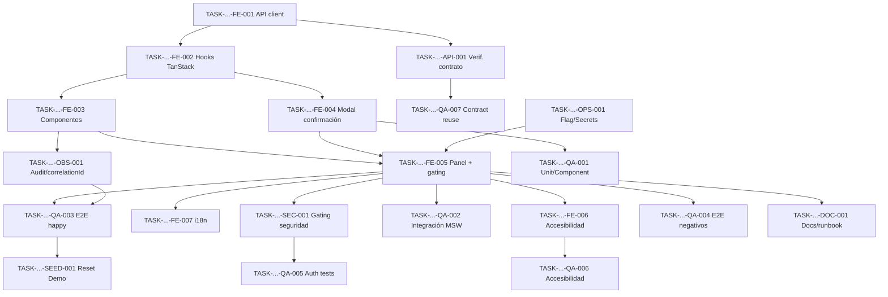

# Development Tasks — PB-P3-001 / US-140: Reset surgical del entorno Demo desde panel admin

## 1. Metadata

| Field | Value |
|---|---|
| User Story ID | US-140 |
| Source User Story | `management/user-stories/US-140-seed-reset-endpoint-demo.md` |
| Source Technical Specification | `management/technical-specs/P3/PB-P3-001/US-140-technical-spec.md` |
| Decision Resolution Artifact | No existe (no requerido) |
| Priority | P3 |
| Backlog ID | PB-P3-001 |
| Backlog Title | Reset surgical del entorno Demo desde panel admin |
| Backlog Execution Order | P3 #1 (primer item del bloque P3 — Demo Polish / Academic Evidence) |
| User Story Position in Backlog Item | 1 de 1 (única US del backlog item) |
| Related User Stories in Backlog Item | US-140 |
| Epic | EPIC-OPS-001 / EPIC-SEED-001 |
| Backlog Item Dependencies | PB-P0-014 (US-085/US-086), PB-P2-022, PB-P2-023, PB-P2-024 |
| Feature | Reset del entorno Demo (panel admin) |
| Module / Domain | Admin / Seed / DevOps (frontend admin sobre backend reutilizado) |
| Backlog Alignment Status | Found |
| Task Breakdown Status | Ready for Sprint Planning |
| Created Date | 2026-07-07 |
| Last Updated | 2026-07-07 |

---

## 2. Source Validation

| Source | Found | Used | Notes |
|---|---|---|---|
| User Story | Yes | Yes | `US-140-seed-reset-endpoint-demo.md` — Status: Approved with Minor Notes (2026-07-07). |
| Technical Specification | Yes | Yes | `US-140-technical-spec.md` — Status: Ready for Task Breakdown. Fuente primaria. |
| Decision Resolution Artifact | No | No | Confirmado inexistente; no requerido. |
| Product Backlog Prioritized | Yes | Yes | `4-Product-Backlog-Prioritized.md` §PB-P3-001 (línea 2157). Mapping confirmado. |
| ADRs | Yes | Yes | ADR-SEC-003, ADR-SEC-005, ADR-TEST-001, ADR-DEVOPS-001 (referenciados; no reabiertos). |

---

## 3. Backlog Execution Context

### Parent Backlog Item

**PB-P3-001 — Reset surgical del entorno Demo desde panel admin** (P3, MoSCoW Must Have). Pertenece al bloque **P3 — Demo Polish / Academic Evidence** y entrega la experiencia operativa frontend para reiniciar el entorno Demo bajo demanda desde el panel admin (FR-DEMO-001 / UC-DEMO-001), reutilizando el motor de reset ya entregado por US-086. Acceptance Summary del backlog: `404` si no es Demo, acción auditada, reset idempotente. Dependencias: PB-P0-014 (core `ResetDemoUseCase` + endpoint + `ResetReportDto`) y PB-P2-022..024 (deploy AWS, RDS gestionado, Secrets Manager).

### Execution Order Rationale

El orden de ejecución no lo define el número de la User Story sino la posición dentro del Product Backlog Prioritized. PB-P3-001 es el **primer** item listado del bloque P3 y encabeza la etapa "Demo seed"; su orden de ejecución dentro de P3 es **#1**. Su dependencia dura PB-P0-014 (US-086) ya fue entregada en P0, por lo que US-140 puede ejecutarse al arrancar P3 y precede a los items que la referencian como dependencia: PB-P3-004 (checklist pre-demo) y PB-P3-007 (smoke test sobre Demo URL).

### Related User Stories in Same Backlog Item

| User Story | Role in Backlog Item | Suggested Order |
|---|---|---|
| US-140 | Panel admin (frontend) que dispara el reset reutilizando el endpoint de US-086 | 1 (única US del backlog item) |

---

## 4. Task Breakdown Summary

| Area | Number of Tasks | Notes |
|---|---:|---|
| Product / Analysis (PO) | 0 | No aplica — alcance claro, sin decisiones abiertas. |
| Backend (BE) | 0 | No aplica — reutiliza US-086; ningún use case nuevo. Verificación de contrato bajo API/QA. |
| Frontend (FE) | 7 | API client tipado, hooks TanStack, componentes, modal, panel/gating, accesibilidad, i18n. |
| API Contract (API) | 1 | Verificación/consumo del contrato reutilizado de US-086. |
| Database / Prisma (DB) | 0 | No aplica — sin modelos ni migraciones. |
| AI / PromptOps (AI) | 0 | No aplica — sin invocación de IA. |
| Security / Authorization (SEC) | 1 | Verificación de gating `404`/`401`/`403`, anti-fingerprinting, sin datos sensibles en UI. |
| QA / Testing (QA) | 7 | Unit, integración MSW, E2E happy/idempotencia/status, E2E negativos, auth, accesibilidad, reuso contract tests. |
| Seed / Demo Data (SEED) | 1 | Verificación del escenario de reset Demo (estado converge al seed conocido). |
| DevOps / Environment (OPS) | 1 | `SEED_DEMO_ENABLED` solo en Demo; secretos vía Secrets Manager. |
| Observability / Audit (OBS) | 1 | Verificar `AdminAction` + `X-Correlation-Id` reflejado en UI. |
| Documentation / Traceability (DOC) | 1 | Docs del panel + runbook + alineaciones documentales no bloqueantes. |
| **Total** | **20** | |

---

## 5. Traceability Matrix

| Acceptance Criterion | Technical Spec Section | Task IDs |
|---|---|---|
| AC-01 — Reset en Demo → `202` + `ResetReport` | §6, §8 (Components/Data Fetching/States), §9 | TASK-...-FE-001, FE-002, FE-003, FE-005, API-001, QA-003 |
| AC-02 — Reset idempotente (NFR-DEMO-003) | §6, §13 (E2E TS-02) | TASK-...-FE-005, QA-003, SEED-001 |
| AC-03 — Acción auditada con `correlationId` | §7, §12 (Audit), §14 | TASK-...-FE-003, FE-005, OBS-001, QA-003 |
| EC-01 — No Demo → `404` / control no expuesto | §4, §8 (gating), §12, §16 | TASK-...-FE-005, SEC-001, QA-004 |
| EC-02 — Reset en curso → `409` | §6, §8 (States), §17 | TASK-...-FE-002, FE-005, QA-004 |
| EC-03 — Falla parcial → `500` controlado | §6, §8 (Error state), §12 | TASK-...-FE-002, FE-005, SEC-001, QA-004 |
| VR-01 — Solo `SEED_DEMO_ENABLED=true` | §4, §8, §12 | TASK-...-FE-005, SEC-001, OPS-001, QA-004 |
| VR-02 — Confirmación explícita obligatoria | §8 (Forms) | TASK-...-FE-004, QA-001 |
| VR-03 — Body opcional `reason` (Zod strict ≤500) | §8 (Forms), §9 | TASK-...-FE-004, QA-001 |
| SEC-01/02/03 — RBAC + doble gate + `404` anti-fingerprinting | §12 | TASK-...-SEC-001, QA-005 |
| SEC-04 — Sin secretos/tokens en UI/logs | §12 (Sensitive Data) | TASK-...-SEC-001, OPS-001, QA-005 |
| SEC-05 — Auditoría obligatoria `AdminAction` | §12, §14 | TASK-...-OBS-001, QA-003 |
| Accesibilidad (teclado/foco/ARIA/aria-live) | §8 (Accessibility) | TASK-...-FE-004, FE-006, QA-006 |
| i18n 4 locales | §8 (i18n) | TASK-...-FE-007 |

Cada Acceptance Criterion mapea a al menos una tarea.

---

## 6. Development Tasks

### TASK-PB-P3-001-US-140-FE-001 — Cliente API tipado (`resetDemoSeed`, `getSeedStatus`)

| Field | Value |
|---|---|
| Area | Frontend |
| Type | Implementation |
| Priority | Must |
| Estimate | S |
| Depends On | — |
| Source AC(s) | AC-01, VR-03 |
| Technical Spec Section(s) | §8 (Data Fetching), §9 (API Contract) |
| Backlog ID | PB-P3-001 |
| User Story ID | US-140 |
| Owner Role | Frontend |
| Status | To Do |

#### Objective
Crear el cliente API tipado que consume los endpoints reutilizados de US-086, tipando request/response con los contratos verbatim (`ResetReportDto`, `SeedStatusResponseDto`, `ResetRequestSchema`).

#### Scope
##### Include
- `seed-admin.client.ts` con `resetDemoSeed(input?: { reason?: string }): Promise<ResetReportDto>` y `getSeedStatus(): Promise<SeedStatusResponseDto>`.
- Reexport/import de tipos y schema desde el contrato de US-086 (`types/`).
- Envío con credenciales (cookie HTTP-only) y lectura de `X-Correlation-Id` de la respuesta.
##### Exclude
- Definición o modificación del contrato (propiedad de US-086).
- Implementación de endpoints backend.

#### Implementation Notes
- Reusar el tipo `ResetReportDto` verbatim; no duplicar definiciones (mitiga riesgo de divergencia).
- No almacenar tokens en el cliente; sin secretos en estado ni logs.

#### Acceptance Criteria Covered
AC-01, VR-03.

#### Definition of Done
- [ ] Métodos `resetDemoSeed()` y `getSeedStatus()` tipados y exportados.
- [ ] Tipos importados/reexportados verbatim de US-086 (sin redefinir).
- [ ] `X-Correlation-Id` leído desde la respuesta.
- [ ] Type-check verde.

---

### TASK-PB-P3-001-US-140-FE-002 — Hooks TanStack Query (mutation + query) con mapeo de estados

| Field | Value |
|---|---|
| Area | Frontend |
| Type | Implementation |
| Priority | Must |
| Estimate | M |
| Depends On | TASK-PB-P3-001-US-140-FE-001 |
| Source AC(s) | AC-01, EC-02, EC-03 |
| Technical Spec Section(s) | §8 (State Management, Data Fetching) |
| Backlog ID | PB-P3-001 |
| User Story ID | US-140 |
| Owner Role | Frontend |
| Status | To Do |

#### Objective
Implementar `useResetDemoMutation()` y `useSeedStatusQuery()` con TanStack Query, mapeando los códigos HTTP `202/400/401/403/404/409/500` a estados de UI e invalidando el status tras un reset exitoso.

#### Scope
##### Include
- `useSeedStatusQuery()` → `GET /seed/status` (alimenta empty/gating).
- `useResetDemoMutation()` → `POST /seed/reset`; on success invalida la query de status.
- Mapeo de códigos: `202` success; `409` "reset en curso"; `404` no disponible; `401/403` sin permiso; `400` validación; `500` error controlado.
- Sin reintento automático en `409`/`500`.
##### Exclude
- Lógica de autorización (delegada al backend).
- Componentes de UI.

#### Implementation Notes
- Sin Redux/Zustand (Doc 15 principio 13); server-state solo en TanStack Query.
- El `404` se trata como señal autoritativa de "no disponible en este entorno".

#### Acceptance Criteria Covered
AC-01, EC-02, EC-03.

#### Definition of Done
- [ ] Hooks implementados con mapeo completo de `202/400/401/403/404/409/500`.
- [ ] Invalidación de status query tras reset exitoso.
- [ ] Sin reintento automático ante `409`/`500`.
- [ ] Tests de hooks (cubiertos en QA-001).

---

### TASK-PB-P3-001-US-140-FE-003 — Componentes presentacionales (`SeedStatusView`, `ResetReportView`, `DemoResetButton`)

| Field | Value |
|---|---|
| Area | Frontend |
| Type | Implementation |
| Priority | Must |
| Estimate | M |
| Depends On | TASK-PB-P3-001-US-140-FE-002 |
| Source AC(s) | AC-01, AC-03 |
| Technical Spec Section(s) | §8 (Components, States) |
| Backlog ID | PB-P3-001 |
| User Story ID | US-140 |
| Owner Role | Frontend |
| Status | To Do |

#### Objective
Construir los componentes presentacionales puros: botón de reset con estados, render del `ResetReportDto` (incluyendo `correlationId`) y empty state desde `seed/status`.

#### Scope
##### Include
- `DemoResetButton` — estados enabled/disabled/loading; labels y ARIA base.
- `ResetReportView` — tabla de conteos `entitiesDeleted`/`entitiesReseeded`, `seedVersion`, `durationMs`, `correlationId` visible.
- `SeedStatusView` — empty state con `lastRunAt`/`recordCount`.
##### Exclude
- Orquestación/gating (FE-005).
- Modal de confirmación (FE-004).

#### Implementation Notes
- Componentes presentacionales puros; datos vía props desde hooks/panel.
- El `correlationId` se muestra para trazabilidad (AC-03); sin PII ni secretos.

#### Acceptance Criteria Covered
AC-01, AC-03.

#### Definition of Done
- [ ] Tres componentes renderizan correctamente sus props.
- [ ] `ResetReportView` muestra conteos, `seedVersion`, `durationMs`, `correlationId`.
- [ ] Sin strings hardcoded (claves i18n de FE-007).
- [ ] Tests de componente (QA-001).

---

### TASK-PB-P3-001-US-140-FE-004 — Modal de confirmación accesible (`DemoResetConfirmModal`, RHF + Zod)

| Field | Value |
|---|---|
| Area | Frontend |
| Type | Implementation |
| Priority | Must |
| Estimate | M |
| Depends On | TASK-PB-P3-001-US-140-FE-002 |
| Source AC(s) | VR-02, VR-03 |
| Technical Spec Section(s) | §8 (Forms, Accessibility) |
| Backlog ID | PB-P3-001 |
| User Story ID | US-140 |
| Owner Role | Frontend |
| Status | To Do |

#### Objective
Implementar el modal de confirmación obligatorio con React Hook Form + Zod, con `reason` opcional validado (schema alineado verbatim a `ResetRequestSchema` de US-086) y gestión de foco accesible.

#### Scope
##### Include
- Schema cliente `{ reason?: string (min 1, max 500) }.strict()` alineado a US-086.
- Confirmación explícita obligatoria (VR-02) antes de disparar la mutation; Cancelar no dispara nada.
- Accesibilidad base del modal: `role`/`aria-modal`, focus trap, foco inicial en acción segura, retorno de foco al disparador, cierre con Esc/Cancelar.
##### Exclude
- Invocación directa del endpoint (delegada a la mutation vía panel).
- Refinamiento avanzado de accesibilidad transversal (FE-006).

#### Implementation Notes
- Validación cliente re-validada por backend (`400` ante campo desconocido); no relajar `.strict()`.

#### Acceptance Criteria Covered
VR-02, VR-03.

#### Definition of Done
- [ ] Modal bloquea la invocación hasta confirmación explícita.
- [ ] Validación `reason` ≤ 500 con Zod strict; campo desconocido rechazado en cliente.
- [ ] Focus trap, `aria-modal`, retorno de foco y cierre con teclado funcionando.
- [ ] Tests de modal (QA-001) y accesibilidad (QA-006).

---

### TASK-PB-P3-001-US-140-FE-005 — Panel contenedor con gating condicional y orquestación de estados (`DemoResetPanel`)

| Field | Value |
|---|---|
| Area | Frontend |
| Type | Implementation |
| Priority | Must |
| Estimate | M |
| Depends On | TASK-PB-P3-001-US-140-FE-003, TASK-PB-P3-001-US-140-FE-004 |
| Source AC(s) | AC-01, AC-02, AC-03, EC-01, EC-02, EC-03, VR-01 |
| Technical Spec Section(s) | §8 (Routes/Pages, Components, States), §4 (Scope), §16 |
| Backlog ID | PB-P3-001 |
| User Story ID | US-140 |
| Owner Role | Frontend |
| Status | To Do |

#### Objective
Ensamblar `DemoResetPanel` en el route group `(admin)` como Client Component: orquesta status query, botón, modal y reporte; decide el gating condicional a `SEED_DEMO_ENABLED`/`404`; mapea los estados loading/empty/error/success.

#### Scope
##### Include
- Montaje condicional del control según flag y `404` autoritativo del backend (VR-01, EC-01): control oculto/deshabilitado + estado informativo neutro sin revelar el endpoint.
- Flujo: botón → modal → mutation → `ResetReportView`; refresco del status tras éxito.
- Estados: loading (botón deshabilitado + spinner, sin reintento), empty (`SeedStatusView`), error (mensaje neutral + `correlationId`; `409` "reset en curso"; `404` "no disponible"), success (`ResetReportView`).
##### Exclude
- Reimplementación del motor de reset o autorización (US-086 / backend).
- Definición del contrato.

#### Implementation Notes
- Ante `404` no exponer mensajes que revelen la existencia del endpoint (THR-012).
- La idempotencia (AC-02) se garantiza por el core; el panel permite reejecutar y muestra conteos convergentes.

#### Acceptance Criteria Covered
AC-01, AC-02, AC-03, EC-01, EC-02, EC-03, VR-01.

#### Definition of Done
- [ ] Control visible solo en Demo; oculto/deshabilitado + estado neutro fuera de Demo (`404`).
- [ ] Flujo completo botón → modal → reset → reporte operativo.
- [ ] Los cuatro estados (loading/empty/error/success) mapeados y renderizados.
- [ ] Sin exposición del endpoint ante `404`; error state sin stack/SQL/PII.

---

### TASK-PB-P3-001-US-140-FE-006 — Accesibilidad transversal (foco, ARIA, `aria-live`)

| Field | Value |
|---|---|
| Area | Frontend |
| Type | Implementation |
| Priority | Should |
| Estimate | S |
| Depends On | TASK-PB-P3-001-US-140-FE-005 |
| Source AC(s) | AC-01 (UX accesible), EC-03 |
| Technical Spec Section(s) | §8 (Accessibility) |
| Backlog ID | PB-P3-001 |
| User Story ID | US-140 |
| Owner Role | Frontend |
| Status | To Do |

#### Objective
Completar la accesibilidad del panel: `aria-disabled`/`aria-busy` en el botón durante loading, y anuncio de resultado (success/error) por región `aria-live` para lectores de pantalla.

#### Scope
##### Include
- `aria-disabled`/`aria-busy` en el botón durante el request.
- Región `aria-live` que anuncia success/error.
- Verificación de labels accesibles del control.
##### Exclude
- Focus trap del modal (ya en FE-004).

#### Implementation Notes
- El anuncio no debe incluir datos sensibles; solo mensaje neutral + `correlationId`.

#### Acceptance Criteria Covered
AC-01 (accesibilidad), EC-03 (anuncio de error).

#### Definition of Done
- [ ] Botón expone `aria-busy`/`aria-disabled` en loading.
- [ ] `aria-live` anuncia el resultado.
- [ ] Tests de accesibilidad (QA-006) verdes.

---

### TASK-PB-P3-001-US-140-FE-007 — i18n del panel en 4 locales (next-intl)

| Field | Value |
|---|---|
| Area | Frontend |
| Type | Implementation |
| Priority | Must |
| Estimate | S |
| Depends On | TASK-PB-P3-001-US-140-FE-005 |
| Source AC(s) | AC-01 (UX), EC-01, EC-02, EC-03 |
| Technical Spec Section(s) | §8 (i18n) |
| Backlog ID | PB-P3-001 |
| User Story ID | US-140 |
| Owner Role | Frontend |
| Status | To Do |

#### Objective
Externalizar toda la copy del panel a next-intl en `es-LATAM` (default), `es-ES`, `pt`, `en`: botón, modal, estados, mensajes de error y reporte.

#### Scope
##### Include
- Claves i18n en `messages/{es-LATAM,es-ES,pt,en}.json` para botón, modal, loading/empty/error/success, `404`/`409` y reporte.
- Verificación de ausencia de strings hardcoded.
##### Exclude
- Nuevos locales fuera de los cuatro requeridos.

#### Implementation Notes
- Sin strings hardcoded (Doc 15 principio 7); lint contra hardcoded strings.

#### Acceptance Criteria Covered
AC-01, EC-01, EC-02, EC-03 (mensajes localizados).

#### Definition of Done
- [ ] Claves presentes y consistentes en los 4 locales.
- [ ] Sin strings hardcoded en el panel.
- [ ] Lint i18n verde.

---

### TASK-PB-P3-001-US-140-API-001 — Verificación del contrato reutilizado de US-086

| Field | Value |
|---|---|
| Area | API Contract |
| Type | Review |
| Priority | Must |
| Estimate | S |
| Depends On | TASK-PB-P3-001-US-140-FE-001 |
| Source AC(s) | AC-01, AC-03, EC-02, EC-03 |
| Technical Spec Section(s) | §7, §9 |
| Backlog ID | PB-P3-001 |
| User Story ID | US-140 |
| Owner Role | Tech Lead |
| Status | To Do |

#### Objective
Verificar que el cliente y los tipos consumidos coinciden con el contrato entregado por US-086, sin reimplementar backend: forma de `ResetReportDto`/`SeedStatusResponseDto`, códigos de estado y presencia de `X-Correlation-Id`.

#### Scope
##### Include
- Confrontar tipos cliente contra `management/technical-specs/P0/PB-P0-014/US-086-technical-spec.md` §9.
- Verificar cobertura de códigos `202/400/401/403/404/409/500` y header `X-Correlation-Id`.
##### Exclude
- Modificar el contrato o el backend (propiedad de US-086).

#### Implementation Notes
- Cualquier divergencia se coordina en US-086; no se resuelve reabriendo aquí.

#### Acceptance Criteria Covered
AC-01, AC-03, EC-02, EC-03.

#### Definition of Done
- [ ] Tipos cliente confirmados verbatim contra US-086.
- [ ] Códigos de estado y `X-Correlation-Id` verificados.
- [ ] Sin cambios al contrato de US-086.

---

### TASK-PB-P3-001-US-140-SEC-001 — Verificación de gating de seguridad y no exposición de datos sensibles

| Field | Value |
|---|---|
| Area | Security / Authorization |
| Type | Review |
| Priority | Must |
| Estimate | S |
| Depends On | TASK-PB-P3-001-US-140-FE-005 |
| Source AC(s) | EC-01, EC-03, VR-01, SEC-01, SEC-02, SEC-03, SEC-04 |
| Technical Spec Section(s) | §12, §16, §17 |
| Backlog ID | PB-P3-001 |
| User Story ID | US-140 |
| Owner Role | Tech Lead |
| Status | To Do |

#### Objective
Verificar (sin reimplementar) que el backend aplica el doble gate y que la UI respeta el comportamiento de seguridad: `404` anti-fingerprinting, `401`/`403` reflejados como sin permiso, y sin secretos/tokens/stack/SQL/PII en el cliente ni en estados de error.

#### Scope
##### Include
- Confirmar que ante `404` el control no se expone y no se revela el endpoint (THR-012).
- Confirmar que `401`/`403` se muestran como sin permiso (autorización delegada al backend).
- Confirmar ausencia de secretos/tokens en estado del cliente y logs de navegador; error state solo mensaje neutral + `correlationId`.
##### Exclude
- Implementar lógica de autorización en el frontend.

#### Implementation Notes
- Backend es única fuente de verdad (ADR-SEC-003); esta tarea es verificación.

#### Acceptance Criteria Covered
EC-01, EC-03, VR-01, SEC-01..04.

#### Definition of Done
- [ ] `404` no revela el endpoint (verificado, ver QA-005 AUTH-TS-04).
- [ ] `401`/`403` reflejados como sin permiso.
- [ ] Sin secretos/tokens/stack/SQL/PII en UI ni cliente.

---

### TASK-PB-P3-001-US-140-OBS-001 — Verificación de auditoría y `X-Correlation-Id` en UI

| Field | Value |
|---|---|
| Area | Observability / Audit |
| Type | Review |
| Priority | Must |
| Estimate | S |
| Depends On | TASK-PB-P3-001-US-140-FE-003 |
| Source AC(s) | AC-03, SEC-05 |
| Technical Spec Section(s) | §14, §12 (Audit) |
| Backlog ID | PB-P3-001 |
| User Story ID | US-140 |
| Owner Role | Tech Lead |
| Status | To Do |

#### Objective
Verificar que el `AdminAction` (`SEED_RESET`/`SEED_RESET_FAILED`) que registra el backend usa el mismo `correlationId` que aparece en la respuesta/`X-Correlation-Id`, y que el panel muestra ese `correlationId` en success y error.

#### Scope
##### Include
- Confirmar coincidencia del `correlationId` mostrado en UI vs. auditado (éxito y fallo).
- Confirmar que el panel surface el `correlationId` en success y error.
##### Exclude
- Escribir `AdminAction` o logging backend (propiedad de US-086).

#### Implementation Notes
- Los logs `seed.reset.{started,completed,failed}` los emite US-086; no se agregan aquí.

#### Acceptance Criteria Covered
AC-03, SEC-05.

#### Definition of Done
- [ ] `correlationId` de UI coincide con el auditado en éxito y fallo.
- [ ] `correlationId` visible en estados success y error.

---

### TASK-PB-P3-001-US-140-QA-001 — Tests unit/componente (Vitest + Testing Library)

| Field | Value |
|---|---|
| Area | QA / Testing |
| Type | Test |
| Priority | Must |
| Estimate | M |
| Depends On | TASK-PB-P3-001-US-140-FE-004 |
| Source AC(s) | AC-01, AC-03, VR-02, VR-03 |
| Technical Spec Section(s) | §13 (Unit Tests) |
| Backlog ID | PB-P3-001 |
| User Story ID | US-140 |
| Owner Role | QA |
| Status | To Do |

#### Objective
Cubrir con Vitest + Testing Library los componentes y hooks: botón (estados/ARIA), modal (validación `reason`, confirmación obligatoria, cancelar no dispara), `ResetReportView`, `SeedStatusView`, y el mapeo de códigos en los hooks.

#### Scope
##### Include
- `DemoResetButton`, `DemoResetConfirmModal`, `ResetReportView`, `SeedStatusView`.
- Hooks: mapeo `202/400/401/403/404/409/500` e invalidación del status tras éxito.
##### Exclude
- E2E e integración con MSW (QA-002/003/004).

#### Acceptance Criteria Covered
AC-01, AC-03, VR-02, VR-03.

#### Definition of Done
- [ ] Suites unit de componentes y hooks verdes.
- [ ] Validación `reason` y confirmación obligatoria cubiertas.
- [ ] Mapeo de códigos e invalidación cubiertos.

---

### TASK-PB-P3-001-US-140-QA-002 — Tests de integración con MSW

| Field | Value |
|---|---|
| Area | QA / Testing |
| Type | Test |
| Priority | Must |
| Estimate | M |
| Depends On | TASK-PB-P3-001-US-140-FE-005 |
| Source AC(s) | AC-01, EC-01, EC-02, EC-03, VR-01 |
| Technical Spec Section(s) | §13 (Integration Tests — MSW) |
| Backlog ID | PB-P3-001 |
| User Story ID | US-140 |
| Owner Role | QA |
| Status | To Do |

#### Objective
Con handlers MSW para `POST /seed/reset` y `GET /seed/status`, verificar gating (flag on/off), success con `ResetReport`, empty state, errores y estado "reset en curso".

#### Scope
##### Include
- Escenarios: gating on/off, success `202`, empty, `409`, `500`, `404`.
##### Exclude
- Flujo E2E de navegador (QA-003/004).

#### Acceptance Criteria Covered
AC-01, EC-01, EC-02, EC-03, VR-01.

#### Definition of Done
- [ ] Handlers MSW cubren éxito, empty, `404`, `409`, `500`.
- [ ] Gating on/off verificado.
- [ ] Suite verde en CI.

---

### TASK-PB-P3-001-US-140-QA-003 — E2E happy path + idempotencia + status (Playwright)

| Field | Value |
|---|---|
| Area | QA / Testing |
| Type | Test |
| Priority | Must |
| Estimate | M |
| Depends On | TASK-PB-P3-001-US-140-FE-005, TASK-PB-P3-001-US-140-OBS-001 |
| Source AC(s) | AC-01, AC-02, AC-03 |
| Technical Spec Section(s) | §13 (E2E TS-01/TS-02/TS-04) |
| Backlog ID | PB-P3-001 |
| User Story ID | US-140 |
| Owner Role | QA |
| Status | To Do |

#### Objective
E2E Playwright del flujo panel → confirmación → reset → reporte (TS-01), doble ejecución idempotente (TS-02) y refresco de `SeedStatusView` tras el reset (TS-04), verificando `correlationId` en el reporte.

#### Scope
##### Include
- TS-01 admin Demo → confirmar → `202` + `ResetReport`.
- TS-02 doble ejecución → conteos equivalentes en UI.
- TS-04 status refleja `lastRunAt`/`recordCount`.
- Verificación de `correlationId` visible (AC-03).
##### Exclude
- Negativos de autorización/gating (QA-004/005).

#### Implementation Notes
- Requiere backend US-086 desplegado en Demo (`SEED_DEMO_ENABLED=true`).

#### Acceptance Criteria Covered
AC-01, AC-02, AC-03.

#### Definition of Done
- [ ] TS-01, TS-02, TS-04 verdes.
- [ ] `correlationId` verificado en el reporte.

---

### TASK-PB-P3-001-US-140-QA-004 — E2E negativos (NT-01/NT-02/NT-03)

| Field | Value |
|---|---|
| Area | QA / Testing |
| Type | Test |
| Priority | Must |
| Estimate | M |
| Depends On | TASK-PB-P3-001-US-140-FE-005 |
| Source AC(s) | EC-01, EC-02, EC-03, VR-01 |
| Technical Spec Section(s) | §13 (Negative Tests) |
| Backlog ID | PB-P3-001 |
| User Story ID | US-140 |
| Owner Role | QA |
| Status | To Do |

#### Objective
E2E de los escenarios negativos: no Demo/`404` (NT-01, control no expuesto), concurrencia/`409` (NT-02), y falla inyectada/`500` con `correlationId` sin stack traces (NT-03).

#### Scope
##### Include
- NT-01 `SEED_DEMO_ENABLED=false` → control no expuesto / estado informativo (`404`).
- NT-02 reset en curso + segundo disparo → "reset en curso" (`409`).
- NT-03 falla inyectada → error neutral con `correlationId` (`500`), sin stack/SQL.
##### Exclude
- Happy path (QA-003).

#### Acceptance Criteria Covered
EC-01, EC-02, EC-03, VR-01.

#### Definition of Done
- [ ] NT-01, NT-02, NT-03 verdes.
- [ ] Error state sin stack/SQL/PII verificado.

---

### TASK-PB-P3-001-US-140-QA-005 — Tests de autorización (AUTH-TS-01..04)

| Field | Value |
|---|---|
| Area | QA / Testing |
| Type | Test |
| Priority | Must |
| Estimate | S |
| Depends On | TASK-PB-P3-001-US-140-SEC-001 |
| Source AC(s) | EC-01, SEC-01, SEC-02, SEC-03 |
| Technical Spec Section(s) | §13 (Security Tests) |
| Backlog ID | PB-P3-001 |
| User Story ID | US-140 |
| Owner Role | QA |
| Status | To Do |

#### Objective
Verificar los escenarios de autorización: admin Demo → `202` (AUTH-TS-01); `organizer`/`vendor` → `403` (AUTH-TS-02); anónimo → `401` (AUTH-TS-03); `404` sin revelar el endpoint (AUTH-TS-04).

#### Scope
##### Include
- AUTH-TS-01..04, reutilizando aserciones sobre respuestas y UI.
##### Exclude
- Reimplementar autorización backend (US-086).

#### Acceptance Criteria Covered
EC-01, SEC-01, SEC-02, SEC-03.

#### Definition of Done
- [ ] AUTH-TS-01..04 verdes.
- [ ] `404` sin headers reveladores verificado.

---

### TASK-PB-P3-001-US-140-QA-006 — Tests de accesibilidad (teclado, foco, ARIA)

| Field | Value |
|---|---|
| Area | QA / Testing |
| Type | Test |
| Priority | Should |
| Estimate | S |
| Depends On | TASK-PB-P3-001-US-140-FE-006 |
| Source AC(s) | AC-01 (UX accesible), VR-02 |
| Technical Spec Section(s) | §13 (Accessibility Tests) |
| Backlog ID | PB-P3-001 |
| User Story ID | US-140 |
| Owner Role | QA |
| Status | To Do |

#### Objective
Verificar navegación por teclado del botón y modal, focus trap y retorno de foco al disparador, labels/ARIA y anuncio por `aria-live`.

#### Scope
##### Include
- Teclado en botón y modal; focus trap; retorno de foco; `aria-live`.
##### Exclude
- Auditorías de accesibilidad fuera del panel.

#### Acceptance Criteria Covered
AC-01 (accesibilidad), VR-02.

#### Definition of Done
- [ ] Navegación por teclado y focus trap verificados.
- [ ] Retorno de foco y `aria-live` verificados.

---

### TASK-PB-P3-001-US-140-QA-007 — Reuso de contract tests de US-086 (Supertest) como regresión

| Field | Value |
|---|---|
| Area | QA / Testing |
| Type | Test |
| Priority | Should |
| Estimate | S |
| Depends On | TASK-PB-P3-001-US-140-API-001 |
| Source AC(s) | AC-01, AC-03 |
| Technical Spec Section(s) | §13 (API Tests — contract reuse) |
| Backlog ID | PB-P3-001 |
| User Story ID | US-140 |
| Owner Role | QA |
| Status | To Do |

#### Objective
Reutilizar (no reimplementar) los contract/API tests Supertest de US-086 como regresión del contrato consumido, asegurando que los tipos usados por el frontend coinciden con el contrato entregado.

#### Scope
##### Include
- Ejecutar/incluir los contract tests de US-086 en la verificación de regresión del consumo.
##### Exclude
- Escribir nuevos tests de backend.

#### Acceptance Criteria Covered
AC-01, AC-03.

#### Definition of Done
- [ ] Contract tests de US-086 pasan como regresión del contrato consumido.
- [ ] Type-check del consumo (`ResetReportDto`) verde.

---

### TASK-PB-P3-001-US-140-SEED-001 — Verificación del escenario de reset Demo (estado converge al seed)

| Field | Value |
|---|---|
| Area | Seed / Demo Data |
| Type | Test |
| Priority | Must |
| Estimate | S |
| Depends On | TASK-PB-P3-001-US-140-QA-003 |
| Source AC(s) | AC-02 |
| Technical Spec Section(s) | §15 (Seed/Demo Data Impact) |
| Backlog ID | PB-P3-001 |
| User Story ID | US-140 |
| Owner Role | QA |
| Status | To Do |

#### Objective
Verificar (E2E sobre entorno Demo) que tras el reset el estado converge al seed conocido y que la UI lo refleja, habilitando la demo reproducible (FR-DEMO-001) y los items dependientes PB-P3-004/PB-P3-007.

#### Scope
##### Include
- Verificar convergencia del estado seed y su reflejo en la UI post-reset.
##### Exclude
- Invariantes de datos internos (`is_seed=false` preservado, volúmenes BR-SEED-002) → cubiertos por tests de US-086.

#### Acceptance Criteria Covered
AC-02.

#### Definition of Done
- [ ] Post-reset la UI refleja el estado seed conocido.
- [ ] Escenario de demo reproducible verificado en Demo.

---

### TASK-PB-P3-001-US-140-OPS-001 — Asegurar `SEED_DEMO_ENABLED` solo en Demo y secretos vía Secrets Manager

| Field | Value |
|---|---|
| Area | DevOps / Environment |
| Type | Setup |
| Priority | Must |
| Estimate | S |
| Depends On | — |
| Source AC(s) | EC-01, VR-01, SEC-04 |
| Technical Spec Section(s) | §12 (Security), §15, §16 |
| Backlog ID | PB-P3-001 |
| User Story ID | US-140 |
| Owner Role | DevOps |
| Status | To Do |

#### Objective
Confirmar/configurar que `SEED_DEMO_ENABLED=true` esté activo únicamente en el entorno Demo (y Dev) y que los secretos se gestionen vía Secrets Manager (PB-P2-024); fuera de Demo la ruta responde `404`.

#### Scope
##### Include
- Verificar el valor del flag por entorno (solo Demo/Dev).
- Confirmar secretos vía Secrets Manager; sin secretos en repo.
##### Exclude
- Provisión de infraestructura AWS (PB-P2-022..024).

#### Acceptance Criteria Covered
EC-01, VR-01, SEC-04.

#### Definition of Done
- [ ] `SEED_DEMO_ENABLED=true` solo en Demo/Dev confirmado.
- [ ] Secretos vía Secrets Manager; sin secretos en repo.

---

### TASK-PB-P3-001-US-140-DOC-001 — Documentación del panel + runbook + alineaciones documentales

| Field | Value |
|---|---|
| Area | Documentation / Traceability |
| Type | Documentation |
| Priority | Should |
| Estimate | S |
| Depends On | TASK-PB-P3-001-US-140-FE-005 |
| Source AC(s) | AC-01, EC-01, VR-01 |
| Technical Spec Section(s) | §16 (Documentation Alignment), §18 |
| Backlog ID | PB-P3-001 |
| User Story ID | US-140 |
| Owner Role | Tech Lead |
| Status | To Do |

#### Objective
Documentar el panel de reset Demo (uso, estados, gating) y actualizar el runbook de demo, registrando las dos alineaciones documentales no bloqueantes sin reabrir decisiones de US-086.

#### Scope
##### Include
- Docs del panel: uso, estados (loading/empty/error/success), gating por flag/`404`.
- Runbook de demo: registrar equivalencia `APP_ENV=demo` ⇔ `SEED_DEMO_ENABLED=true`.
- Nota de adopción de `404` sobre `403` (THR-012); recomendar alinear Doc 19 §587/§1205 en próxima revisión.
##### Exclude
- Modificar decisiones formalizadas en US-086.

#### Implementation Notes
- Ambas alineaciones son no bloqueantes (§16 spec); no reabrir US-086.

#### Acceptance Criteria Covered
AC-01, EC-01, VR-01 (documentación de comportamiento).

#### Definition of Done
- [ ] Docs del panel actualizadas.
- [ ] Runbook con equivalencia del gate registrada.
- [ ] Nota de adopción de `404` documentada (recomendación a Doc 19).

---

## 7. Required QA Tasks

| Task ID | Test Type | Purpose |
|---|---|---|
| TASK-PB-P3-001-US-140-QA-001 | Unit/Component (Vitest + TL) | Componentes, modal, hooks y mapeo de códigos. |
| TASK-PB-P3-001-US-140-QA-002 | Integration (MSW) | Gating, success, empty, `409`/`500`/`404`. |
| TASK-PB-P3-001-US-140-QA-003 | E2E (Playwright) | Happy path (TS-01), idempotencia (TS-02), status (TS-04). |
| TASK-PB-P3-001-US-140-QA-004 | E2E negativos (Playwright) | NT-01 `404`, NT-02 `409`, NT-03 `500`. |
| TASK-PB-P3-001-US-140-QA-005 | Security/Auth | AUTH-TS-01..04. |
| TASK-PB-P3-001-US-140-QA-006 | Accessibility | Teclado, foco, ARIA, `aria-live`. |
| TASK-PB-P3-001-US-140-QA-007 | Contract reuse (Supertest) | Regresión del contrato consumido de US-086. |
| TASK-PB-P3-001-US-140-SEED-001 | E2E Demo (seed) | Convergencia al estado seed conocido. |

---

## 8. Required Security Tasks

| Task ID | Security Concern | Purpose |
|---|---|---|
| TASK-PB-P3-001-US-140-SEC-001 | Gating `404`/`401`/`403`, anti-fingerprinting, datos sensibles | Verificar comportamiento de seguridad reflejado en UI sin reimplementar autorización. |
| TASK-PB-P3-001-US-140-QA-005 | Autorización negativa | AUTH-TS-01..04 como pruebas de gating. |
| TASK-PB-P3-001-US-140-OPS-001 | Secretos + flag por entorno | `SEED_DEMO_ENABLED` solo en Demo; secretos vía Secrets Manager. |

---

## 9. Required Seed / Demo Tasks

| Task ID | Seed/Demo Concern | Purpose |
|---|---|---|
| TASK-PB-P3-001-US-140-SEED-001 | Convergencia al seed conocido | Verificar que tras el reset la UI refleja el estado seed reproducible (FR-DEMO-001). |
| TASK-PB-P3-001-US-140-OPS-001 | Habilitación por entorno | Garantizar `SEED_DEMO_ENABLED=true` solo en Demo. |

---

## 10. Observability / Audit Tasks

| Task ID | Concern | Purpose |
|---|---|---|
| TASK-PB-P3-001-US-140-OBS-001 | `AdminAction` + `X-Correlation-Id` | Verificar coincidencia del `correlationId` auditado y mostrado en UI (éxito/fallo). |

---

## 11. Documentation / Traceability Tasks

| Task ID | Document / Artifact | Purpose |
|---|---|---|
| TASK-PB-P3-001-US-140-DOC-001 | Docs del panel + runbook de demo | Documentar uso/estados/gating; registrar alineaciones documentales no bloqueantes (§16). |

---

## 12. Dependency Graph

---

## 13. Suggested Implementation Order

### Phase 1 — Foundation
- TASK-PB-P3-001-US-140-OPS-001 (flag/secrets por entorno — puede iniciar en paralelo).
- TASK-PB-P3-001-US-140-FE-001 (cliente API tipado).
- TASK-PB-P3-001-US-140-FE-002 (hooks TanStack).
- TASK-PB-P3-001-US-140-API-001 (verificación del contrato).

### Phase 2 — Core Implementation
- TASK-PB-P3-001-US-140-FE-003 (componentes presentacionales).
- TASK-PB-P3-001-US-140-FE-004 (modal accesible).
- TASK-PB-P3-001-US-140-FE-005 (panel + gating + estados).
- TASK-PB-P3-001-US-140-FE-006 (accesibilidad transversal).
- TASK-PB-P3-001-US-140-FE-007 (i18n 4 locales).

### Phase 3 — Validation / Security / QA
- TASK-PB-P3-001-US-140-SEC-001, OBS-001.
- TASK-PB-P3-001-US-140-QA-001, QA-002, QA-003, QA-004, QA-005, QA-006, QA-007.
- TASK-PB-P3-001-US-140-SEED-001.

### Phase 4 — Documentation / Review
- TASK-PB-P3-001-US-140-DOC-001.

---

## 14. Risks & Mitigations

| Risk | Impact | Mitigation | Related Task |
|---|---|---|---|
| Divergencia entre el tipo cliente y el `ResetReportDto` real de US-086 | Errores de render/runtime | Reusar tipo verbatim; type-check en CI; contract tests. | FE-001, API-001, QA-007 |
| Fuga de la existencia del endpoint fuera de Demo | Fingerprinting (THR-012) | Tratar `404` como "no disponible"; sin mensajes reveladores; AUTH-TS-04. | FE-005, SEC-001, QA-005 |
| Doble disparo del reset | Confusión / `409` | Deshabilitar botón en loading; "reset en curso"; sin reintento. | FE-002, FE-005, QA-004 |
| Datos sensibles/stack en error state | Fuga de información | Mensaje neutral + solo `correlationId`; NT-03. | FE-005, SEC-001, QA-004 |
| Modal no accesible | Barrera de accesibilidad | Focus trap, `aria-modal`, retorno de foco, `aria-live`; tests. | FE-004, FE-006, QA-006 |
| Copy hardcodeada rompe i18n | Inconsistencia de locales | Todas las cadenas vía next-intl (4 locales); lint. | FE-007 |
| Cambio futuro del contrato en US-086 | Ruptura del consumo | Contrato es propiedad de US-086; contract tests detectan ruptura. | API-001, QA-007 |

---

## 15. Out of Scope Confirmation

No se implementa como parte de US-140:

- Motor de reset core (`ResetDemoUseCase`, deletes por lote filtrados por `is_seed=true`, orden FK, lock de concurrencia) → US-086 (PB-P0-014). Se reutiliza.
- Definición o cambio del contrato `ResetReportDto` / `ResetRequestSchema` → US-086.
- Endpoints backend `POST /api/v1/admin/seed/reset` y `GET /api/v1/admin/seed/status` → US-086.
- Runner CLI `npm run seed` / `seed:reset` → US-085.
- Lógica de autorización en el frontend (backend es única fuente de verdad).
- Migraciones o cambios de esquema Prisma.
- Resets parciales, snapshots, backups previos, reset programado (cron).
- Ejecución del reset en producción o fuera de Demo.
- Invocación de IA.
- Pagos, contratos, chat en tiempo real, WhatsApp, push nativo (guardrails MVP).

---

## 16. Readiness for Sprint Planning

| Check | Status |
|---|---|
| Product Backlog mapping found | Pass |
| Every AC maps to tasks | Pass |
| Technical Spec used when available | Pass |
| QA tasks included | Pass |
| Security tasks included if applicable | Pass |
| Seed/demo tasks included if applicable | Pass |
| Observability tasks included if applicable | Pass |
| Documentation tasks included if applicable | Pass |
| Task dependencies clear | Pass |
| Tasks small enough | Pass |
| Ready for Sprint Planning | Yes |

---

## 17. Final Recommendation

**Ready for Sprint Planning.**

US-140 (PB-P3-001) tiene un alcance frontend claro y acotado: entrega la experiencia operativa del panel admin para disparar el reset surgical del entorno Demo, reutilizando verbatim el endpoint `POST /api/v1/admin/seed/reset`, `GET /api/v1/admin/seed/status` y el contrato `ResetReportDto` ya entregados por US-086 (PB-P0-014). No se generan tareas backend de reimplementación (BE = reutiliza US-086), DB (sin migraciones) ni AI (sin IA). Todas las Acceptance Criteria (AC-01..03, EC-01..03), reglas de validación (VR-01..03), reglas de seguridad (SEC-01..05), escenarios QA (TS-01/02/04, NT-01..03, AUTH-TS-01..04), accesibilidad, observabilidad, seed/demo y documentación mapean a al menos una tarea. Las dos alineaciones documentales (§16) son no bloqueantes y se registran en DOC-001 sin reabrir decisiones de US-086. Sin blockers. Siguiente paso: Sprint Planning / Roadmap (R4 — Demo Readiness).
