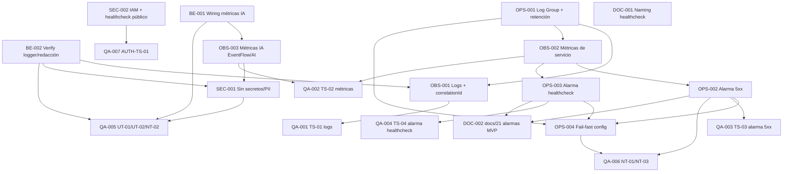

# Development Tasks — PB-P3-002 / US-141: Monitoring CloudWatch mínimo (logs, métricas y alarmas)

## 1. Metadata

| Field | Value |
|---|---|
| User Story ID | US-141 |
| Source User Story | `management/user-stories/US-141-healthcheck-readiness-monitoring.md` |
| Source Technical Specification | `management/technical-specs/P3/PB-P3-002/US-141-technical-spec.md` |
| Decision Resolution Artifact | N/A — no existe `management/user-stories/decision-resolutions/US-141-decision-resolution.md` |
| Priority | P3 (Must Have) |
| Backlog ID | PB-P3-002 |
| Backlog Title | Monitoring CloudWatch mínimo — Logs y métricas básicas en CloudWatch + alarmas mínimas |
| Backlog Execution Order | P3 #2 (segundo ítem del bloque P3, por posición en el Product Backlog Prioritized) |
| User Story Position in Backlog Item | 1 de 1 |
| Related User Stories in Backlog Item | US-141 (única) |
| Epic | EPIC-OPS-001 |
| Backlog Item Dependencies | PB-P2-010, PB-P2-011, PB-P2-012, PB-P2-013 (US-116), PB-P2-022 (US-136) |
| Feature | Observabilidad operacional en CloudWatch (logs + métricas + alarmas mínimas) |
| Module / Domain | DevOps / Observability |
| Backlog Alignment Status | Found |
| Task Breakdown Status | Ready for Sprint Planning |
| Created Date | 2026-07-07 |
| Last Updated | 2026-07-07 |

---

## 2. Source Validation

| Source | Found | Used | Notes |
|---|---|---|---|
| User Story | Yes | Yes | `US-141-healthcheck-readiness-monitoring.md` — Status: Approved with Minor Notes. AC-01..04, EC-01/02, VR-01..03, SEC-01..03, TS-01..04, NT-01..03, AUTH-TS-01. |
| Technical Specification | Yes | Yes | `US-141-technical-spec.md` — Status: Ready for Task Breakdown. Fuente primaria de implementación. |
| Decision Resolution Artifact | No | No | No existe artefacto de decisión para US-141. Confirmado. |
| Product Backlog Prioritized | Yes | Yes | `management/artifacts/4-Product-Backlog-Prioritized.md` — PB-P3-002 confirmado (línea 2178). |
| ADRs | Yes | Yes | ADR-DEVOPS-001 (AWS/App Runner/CloudWatch), ADR-TEST-001 (Vitest + Supertest) referenciados como contexto; no se reabren. |

---

## 3. Backlog Execution Context

### Parent Backlog Item

**PB-P3-002 — Monitoring CloudWatch mínimo** (EPIC-OPS-001, P3, MoSCoW **Must Have**, Type DevOps, Primary Role System). Descripción de backlog: *"Backend envía logs y métricas a CloudWatch. Alarma mínima para errores 5xx y caída de healthcheck."* Acceptance Summary: *Logs visibles en CloudWatch · 1+ alarma activa · Métricas IA llegan.* Trazabilidad: Doc 21 · NFR-OBS-*. Dependencias: PB-P2-010..013, PB-P2-022.

Es la capa **mínima viable de monitoreo** sobre el backend ya desplegado en AWS App Runner (US-136 / PB-P2-022), que ya expone los endpoints de salud (US-116 / PB-P2-013). No reimplementa infraestructura entregada: **agrega** verificación de visibilidad de logs, emisión/verificación de métricas (servicio + operativas de IA) y configuración de alarmas mínimas.

### Execution Order Rationale

Por **posición en el backlog**, PB-P3-002 es el **segundo ítem del bloque P3** (después de PB-P3-001 — reset del entorno Demo). El orden numérico se deriva de la secuencia `PB-P3-001, PB-P3-002, PB-P3-003, …` en `management/artifacts/4-Product-Backlog-Prioritized.md`. Se ejecuta en P3 porque **depende** de que el backend esté desplegado (PB-P2-022), de que los endpoints de salud existan (PB-P2-013) y de la base de plataforma P2 (PB-P2-010..012); todas esas dependencias están entregadas. El número de User Story (141) **no** define el orden de ejecución.

### Related User Stories in Same Backlog Item

| User Story | Role in Backlog Item | Suggested Order |
|---|---|---|
| US-141 | Única historia del ítem (observabilidad CloudWatch: logs + métricas + alarmas) | 1 |

---

## 4. Task Breakdown Summary

| Area | Number of Tasks | Notes |
|---|---:|---|
| Product / Analysis (PO) | 0 | No aplica — historia técnica sin ambigüedad funcional (Tech Spec Ready). |
| Database / Prisma (DB) | 0 | No aplica — sin modelos/migraciones/seed. |
| Backend (BE) | 2 | Reutilización mínima: wiring de emisión de métricas de IA; verificación de redacción/estructura del logger. Sin endpoints nuevos. |
| API Contract (API) | 0 | No aplica — solo observa `GET /health` `GET /health/ready` (propiedad de US-116). |
| AI / PromptOps (AI) | 0 | No aplica — solo métricas operativas de IA (cubiertas en OBS/BE). |
| Security / Authorization (SEC) | 2 | Sin secretos/PII en logs/métricas (VR-03); IAM mínimo + healthcheck público no autenticado. |
| Frontend (FE) | 0 | No aplica — sin UI. |
| Seed / Demo (SEED) | 0 | No aplica — sin datos de seed. |
| DevOps / Environment (OPS) | 4 | Log Group + retención; alarma 5xx; alarma healthcheck; fail-fast de config (IaC/setup). |
| Observability / Audit (OBS) | 3 | Logs estructurados con `correlationId`; métricas de servicio; métricas operativas de IA. |
| QA / Testing (QA) | 7 | TS-01..04, NT-01..03, UT-01/02, AUTH-TS-01. |
| Documentation / Traceability (DOC) | 2 | Naming `/healthz` `/readyz` → `/health` `/health/ready`; promoción de alarmas mínimas al MVP en docs/21. |
| **Total** | **20** | |

---

## 5. Traceability Matrix

| Acceptance Criterion | Technical Spec Section | Task IDs |
|---|---|---|
| AC-01 (logs visibles/consultables en CloudWatch Logs) | §4, §6, §7 Observability, §14 Logs/Correlation ID | TASK-PB-P3-002-US-141-OPS-001, TASK-PB-P3-002-US-141-OBS-001, TASK-PB-P3-002-US-141-BE-002, TASK-PB-P3-002-US-141-QA-001 |
| AC-02 (métricas básicas + de IA a CloudWatch) | §4, §6, §11, §14 Metrics | TASK-PB-P3-002-US-141-BE-001, TASK-PB-P3-002-US-141-OBS-002, TASK-PB-P3-002-US-141-OBS-003, TASK-PB-P3-002-US-141-QA-002 |
| AC-03 (≥1 alarma activa de 5xx) | §6, §7 Validation (VR-01), §14 Alarmas | TASK-PB-P3-002-US-141-OPS-002, TASK-PB-P3-002-US-141-OPS-004, TASK-PB-P3-002-US-141-QA-003 |
| AC-04 (alarma de caída/indisponibilidad del healthcheck) | §6, §7 Validation (VR-02), §9, §14 Alarmas | TASK-PB-P3-002-US-141-OPS-003, TASK-PB-P3-002-US-141-OPS-004, TASK-PB-P3-002-US-141-QA-004, TASK-PB-P3-002-US-141-QA-007 |
| EC-01 (dependencia caída → no saludable) | §6 EC-01, §7 Error Handling, §14 Alarmas | TASK-PB-P3-002-US-141-OPS-003, TASK-PB-P3-002-US-141-QA-004 |
| EC-02 (pico transitorio de 5xx sin falso positivo) | §6 EC-02, §14 Alarmas, §17 | TASK-PB-P3-002-US-141-OPS-002, TASK-PB-P3-002-US-141-QA-006 |
| VR-01 (≥1 alarma activa 5xx; fail-fast) | §7 Validation, §13 CI Checks | TASK-PB-P3-002-US-141-OPS-002, TASK-PB-P3-002-US-141-OPS-004, TASK-PB-P3-002-US-141-QA-006 |
| VR-02 (alarma healthcheck; fail-fast) | §7 Validation, §13 CI Checks | TASK-PB-P3-002-US-141-OPS-003, TASK-PB-P3-002-US-141-OPS-004, TASK-PB-P3-002-US-141-QA-006 |
| VR-03 / SEC-02 / SEC-03 (sin secretos/PII en logs/métricas) | §5, §7, §12, §14 | TASK-PB-P3-002-US-141-BE-002, TASK-PB-P3-002-US-141-SEC-001, TASK-PB-P3-002-US-141-QA-005 |
| SEC-01 / AUTH-TS-01 (healthcheck público no autenticado) | §5 Security, §9, §12 | TASK-PB-P3-002-US-141-SEC-002, TASK-PB-P3-002-US-141-QA-007 |
| IAM permisos mínimos (PutMetricData / setup alarmas) | §5 Security, §12 Ownership/Role Rules | TASK-PB-P3-002-US-141-SEC-002, TASK-PB-P3-002-US-141-BE-001 |
| Doc alignment (naming healthcheck; alarmas MVP) | §16 | TASK-PB-P3-002-US-141-DOC-001, TASK-PB-P3-002-US-141-DOC-002 |

> Cobertura: cada AC (AC-01..04, EC-01/02) mapea a ≥1 tarea; cada tarea mapea a ≥1 sección de la Tech Spec y ≥1 AC/regla.

---

## 6. Development Tasks

### TASK-PB-P3-002-US-141-OPS-001 — Verificar Log Group del servicio y fijar retención 14–30 días

| Field | Value |
|---|---|
| Area | DevOps / Environment |
| Type | Setup |
| Priority | Must |
| Estimate | S |
| Depends On | — |
| Source AC(s) | AC-01 |
| Technical Spec Section(s) | §4 In Scope, §6 (AC-01), §14 Logs |
| Backlog ID | PB-P3-002 |
| User Story ID | US-141 |
| Owner Role | DevOps |
| Status | To Do |

#### Objective
Confirmar que el CloudWatch Log Group alimentado por App Runner (US-136) recibe los logs del backend y establecer una retención de **14–30 días** (docs/21 §30).

#### Scope
##### Include
- Identificar el Log Group asociado al servicio App Runner del backend.
- Confirmar ingesta de logs desde stdout/stderr.
- Configurar/confirmar retención 14–30 días.
- Documentar el nombre del Log Group y el valor de retención aplicado.
##### Exclude
- Reimplementar el envío base de logs (propiedad de US-136).
- Crear endpoints o modificar el logger de aplicación.

#### Implementation Notes
Reutilizar el patrón de configuración de App Runner de US-136. Retención acotada por costo (docs/21 §30). No versionar secretos; IaC opcional (no obligatoria).

#### Acceptance Criteria Covered
- AC-01 (premisa de visibilidad y persistencia de logs).

#### Definition of Done
- [ ] Log Group del servicio identificado y documentado.
- [ ] Retención configurada en 14–30 días y verificada.
- [ ] Ingesta de logs del backend confirmada en el Log Group.

---

### TASK-PB-P3-002-US-141-OPS-002 — Configurar alarma de 5xx (umbral + evaluationPeriods + datapointsToAlarm + treatMissingData)

| Field | Value |
|---|---|
| Area | DevOps / Environment |
| Type | Setup |
| Priority | Must |
| Estimate | M |
| Depends On | TASK-PB-P3-002-US-141-OBS-002 |
| Source AC(s) | AC-03, EC-02 |
| Technical Spec Section(s) | §6 (AC-03, EC-02), §7 Validation (VR-01), §14 Alarmas |
| Backlog ID | PB-P3-002 |
| User Story ID | US-141 |
| Owner Role | DevOps |
| Status | To Do |

#### Objective
Crear ≥1 alarma de CloudWatch **activa** sobre la métrica de respuestas 5xx (App Runner `5xxStatusResponses` o metric filter/custom), con umbral y periodos que eviten falsos positivos.

#### Scope
##### Include
- Definir métrica fuente de 5xx y umbral (`threshold`) según objetivo (conteo/tasa sostenida).
- Configurar `evaluationPeriods ≥ 2`, `datapointsToAlarm` y `treatMissingData` conservador.
- Dejar la alarma en estado activo (cumple "1+ alarma activa").
##### Exclude
- Alarmas de latencia/percentiles o de fallo del LLM (futuro, Out of Scope).
- On-call/PagerDuty/rutas de notificación avanzadas (SNS simple opcional, decisión de Tech Lead).

#### Implementation Notes
`evaluationPeriods ≥ 2` + `datapointsToAlarm` diferencian pico transitorio (EC-02) de degradación sostenida. Documentar los valores elegidos.

#### Acceptance Criteria Covered
- AC-03 (≥1 alarma activa de 5xx). EC-02 (configuración anti falso positivo).

#### Definition of Done
- [ ] Alarma de 5xx creada y en estado activo.
- [ ] `threshold`, `evaluationPeriods (≥2)`, `datapointsToAlarm` y `treatMissingData` configurados y documentados.
- [ ] La alarma referencia una métrica de 5xx consultable.

---

### TASK-PB-P3-002-US-141-OPS-003 — Configurar alarma de caída/indisponibilidad del healthcheck

| Field | Value |
|---|---|
| Area | DevOps / Environment |
| Type | Setup |
| Priority | Must |
| Estimate | M |
| Depends On | TASK-PB-P3-002-US-141-OBS-002 |
| Source AC(s) | AC-04, EC-01 |
| Technical Spec Section(s) | §6 (AC-04, EC-01), §7 Validation (VR-02), §9, §14 Alarmas |
| Backlog ID | PB-P3-002 |
| User Story ID | US-141 |
| Owner Role | DevOps |
| Status | To Do |

#### Objective
Crear una alarma de CloudWatch que detecte indisponibilidad sostenida del servicio/healthcheck (`GET /health`, propiedad de US-116) usando una métrica de disponibilidad/health o un proxy (fallos de request / `ActiveInstances`).

#### Scope
##### Include
- Seleccionar métrica de disponibilidad/health o proxy adecuado en `AWS/AppRunner`.
- Configurar evaluación multi-periodo y `treatMissingData` conservador para tolerar picos transitorios (EC-01; NFR-REL-002).
- Documentar la métrica/proxy elegido y su justificación (RISK: métrica de disponibilidad no directa en App Runner).
##### Exclude
- Modificar la lógica o el contrato de `/health` `/health/ready` (US-116).
- Crear nuevos endpoints o autorización runtime.

#### Implementation Notes
Ante ausencia de métrica de disponibilidad directa, usar proxy y validar con QA-004 (TS-04). Decisión de calibración corresponde al Tech Lead.

#### Acceptance Criteria Covered
- AC-04 (alarma de caída/indisponibilidad). EC-01 (dependencia caída → no saludable, multi-periodo).

#### Definition of Done
- [ ] Alarma de healthcheck/disponibilidad creada y activa.
- [ ] Evaluación multi-periodo y `treatMissingData` conservador configurados.
- [ ] Métrica/proxy elegido documentado con su justificación.

---

### TASK-PB-P3-002-US-141-OPS-004 — Validación fail-fast de la configuración de alarmas/log group en setup/IaC

| Field | Value |
|---|---|
| Area | DevOps / Environment |
| Type | Setup |
| Priority | Must |
| Estimate | S |
| Depends On | TASK-PB-P3-002-US-141-OPS-001, TASK-PB-P3-002-US-141-OPS-002, TASK-PB-P3-002-US-141-OPS-003 |
| Source AC(s) | AC-03, AC-04 |
| Technical Spec Section(s) | §7 Validation (VR-01/VR-02), §7 Error Handling, §13 CI Checks |
| Backlog ID | PB-P3-002 |
| User Story ID | US-141 |
| Owner Role | DevOps |
| Status | To Do |

#### Objective
Garantizar que la ausencia o invalidez de la configuración de alarmas (5xx y healthcheck) o del Log Group produzca **fail-fast** en el paso de setup/IaC, evitando declarar el entorno "monitoreado" sin monitoreo.

#### Scope
##### Include
- Paso de validación en setup/IaC que verifica existencia de la alarma 5xx (VR-01) y de la alarma healthcheck (VR-02).
- Fallar el paso (no despliegue silencioso) si falta o es inválida.
- Integración como quality gate previo a considerar el entorno monitoreado.
##### Exclude
- IaC obligatoria completa (queda opcional; validación puede ser script de verificación).

#### Implementation Notes
Alinear con quality gates de PB-P0-017 (§13 CI Checks). Base para el test negativo NT-01 (QA-006).

#### Acceptance Criteria Covered
- AC-03, AC-04 (garantía de existencia efectiva de alarmas vía fail-fast).

#### Definition of Done
- [ ] Paso de validación implementado y falla ante config faltante/inválida (VR-01/VR-02).
- [ ] Documentado como gate previo a "entorno monitoreado".
- [ ] Verificable de forma reproducible (soporta NT-01).

---

### TASK-PB-P3-002-US-141-OBS-001 — Verificar logs estructurados JSON con correlationId visibles y consultables

| Field | Value |
|---|---|
| Area | Observability / Audit |
| Type | Test |
| Priority | Must |
| Estimate | S |
| Depends On | TASK-PB-P3-002-US-141-OPS-001, TASK-PB-P3-002-US-141-BE-002 |
| Source AC(s) | AC-01 |
| Technical Spec Section(s) | §5 Backend, §7 Observability, §14 Logs/Correlation ID |
| Backlog ID | PB-P3-002 |
| User Story ID | US-141 |
| Owner Role | DevOps |
| Status | To Do |

#### Objective
Verificar que los logs del backend en CloudWatch Logs son **JSON estructurado**, incluyen `correlationId` (US-114) y son consultables por filtro, sin datos sensibles.

#### Scope
##### Include
- Consulta por `correlationId` en el Log Group.
- Confirmar formato JSON line y presencia de eventos base (request, error, AI provider) según docs/21 §19.2.
- Confirmar ausencia de secretos/PII en la muestra revisada.
##### Exclude
- Reescribir el logger o el middleware de correlation ID (US-113/US-114).

#### Implementation Notes
Preserva `correlationId` por request (checklist §32.8). Insumo de la verificación formal QA-001 (TS-01).

#### Acceptance Criteria Covered
- AC-01 (logs visibles/consultables con correlationId, sin datos sensibles).

#### Definition of Done
- [ ] Logs consultables por `correlationId` demostrado.
- [ ] Formato JSON estructurado confirmado.
- [ ] Muestra sin secretos/PII confirmada.

---

### TASK-PB-P3-002-US-141-OBS-002 — Verificar métricas básicas del servicio en CloudWatch Metrics

| Field | Value |
|---|---|
| Area | Observability / Audit |
| Type | Test |
| Priority | Must |
| Estimate | S |
| Depends On | TASK-PB-P3-002-US-141-OPS-001 |
| Source AC(s) | AC-02 |
| Technical Spec Section(s) | §4 In Scope, §6 (AC-02), §14 Metrics |
| Backlog ID | PB-P3-002 |
| User Story ID | US-141 |
| Owner Role | DevOps |
| Status | To Do |

#### Objective
Confirmar que las métricas básicas del servicio (`AWS/AppRunner`: `RequestCount`, `4xxStatusResponses`, `5xxStatusResponses`, `ActiveInstances`) están disponibles y consultables como base para las alarmas.

#### Scope
##### Include
- Verificar disponibilidad/consultabilidad de las métricas de servicio en el namespace `AWS/AppRunner`.
- Documentar qué métrica alimenta la alarma de 5xx y el proxy de disponibilidad.
##### Exclude
- Métricas de APM/tracing/latencia-percentiles (Out of Scope).

#### Implementation Notes
Base directa para OPS-002 (5xx) y OPS-003 (healthcheck/disponibilidad).

#### Acceptance Criteria Covered
- AC-02 (métricas básicas del servicio llegando/consultables).

#### Definition of Done
- [ ] Métricas de servicio confirmadas y consultables.
- [ ] Métrica fuente de 5xx y proxy de disponibilidad documentados.

---

### TASK-PB-P3-002-US-141-OBS-003 — Definir y verificar métricas operativas de IA en namespace EventFlow/AI

| Field | Value |
|---|---|
| Area | Observability / Audit |
| Type | Test |
| Priority | Must |
| Estimate | S |
| Depends On | TASK-PB-P3-002-US-141-BE-001 |
| Source AC(s) | AC-02 |
| Technical Spec Section(s) | §6 (AC-02), §11 Safety Rules, §14 Metrics |
| Backlog ID | PB-P3-002 |
| User Story ID | US-141 |
| Owner Role | DevOps |
| Status | To Do |

#### Objective
Verificar que las métricas operativas de IA llegan a CloudWatch Metrics en el namespace `EventFlow/AI`: `AiInvocations` (dimensión `provider`), `AiErrors`, `AiTimeouts`, `AiFallbackToMock` (NFR-OBS-002), **sin** contenido sensible.

#### Scope
##### Include
- Confirmar presencia y consultabilidad de los 4 contadores con dimensiones correctas.
- Confirmar que solo se emiten contadores/dimensiones (nunca prompts/respuestas/PII).
##### Exclude
- Rediseñar la instrumentación de IA (reutiliza US-115).
- Alarmas sobre métricas de IA (no requeridas por AC).

#### Implementation Notes
Emisión sin payload sensible (docs/21 §19.2/§19.3). Insumo de QA-002 (TS-02) y validado a nivel unitario en QA-005 (UT-01).

#### Acceptance Criteria Covered
- AC-02 (las métricas de IA llegan y son consultables).

#### Definition of Done
- [ ] Los 4 contadores IA visibles en `EventFlow/AI` con dimensiones correctas.
- [ ] Confirmado que no se emite contenido sensible.

---

### TASK-PB-P3-002-US-141-BE-001 — Wiring de emisión de métricas operativas de IA a CloudWatch (reuse US-115)

| Field | Value |
|---|---|
| Area | Backend |
| Type | Implementation |
| Priority | Must |
| Estimate | S |
| Depends On | — |
| Source AC(s) | AC-02 |
| Technical Spec Section(s) | §5 Backend, §7 Modules, §11 |
| Backlog ID | PB-P3-002 |
| User Story ID | US-141 |
| Owner Role | Backend |
| Status | To Do |

#### Objective
Asegurar el shipping de las métricas operativas de IA (`AiInvocations`/`AiErrors`/`AiTimeouts`/`AiFallbackToMock`) hacia CloudWatch desde la instrumentación existente de la capa `LLMProvider` (US-115), **sin crear endpoints nuevos** ni rediseñar la instrumentación.

#### Scope
##### Include
- Confirmar/conectar el emisor (custom metrics `PutMetricData` o metric filter) con los contadores y dimensiones definidos.
- Garantizar que el emisor no publica contenido de prompts/respuestas ni PII.
- Contemplar el uso del permiso IAM `cloudwatch:PutMetricData` (coordinado con SEC-002).
##### Exclude
- Nuevos endpoints HTTP o autorización runtime.
- Invocación de IA, prompts, `AIRecommendation` o fallback de IA (No aplica).

#### Implementation Notes
Reutiliza la instrumentación de IA de US-115; solo asegura el shipping. No escribir lógica de negocio nueva. Emisor unit-testeable (validado en QA-005 / UT-01).

#### Acceptance Criteria Covered
- AC-02 (emisión efectiva de métricas de IA).

#### Definition of Done
- [ ] Emisor de métricas de IA conectado a CloudWatch (o metric filter equivalente).
- [ ] Contadores y dimensiones correctos, sin payload sensible.
- [ ] Sin endpoints nuevos ni cambios de contrato.

---

### TASK-PB-P3-002-US-141-BE-002 — Verificar logger estructurado, correlationId y redacción (reuse US-113/US-114/US-136)

| Field | Value |
|---|---|
| Area | Backend |
| Type | Review |
| Priority | Must |
| Estimate | XS |
| Depends On | — |
| Source AC(s) | AC-01 |
| Technical Spec Section(s) | §5 Backend, §7 Modules/Observability, §14 Logs |
| Backlog ID | PB-P3-002 |
| User Story ID | US-141 |
| Owner Role | Backend |
| Status | To Do |

#### Objective
Verificar (sin reescribir) que el logger existente emite JSON estructurado con `correlationId` y aplica redacción de claves sensibles antes de que los logs lleguen a CloudWatch (VR-03).

#### Scope
##### Include
- Revisar la configuración de redacción del logger (US-113) para claves sensibles (`DATABASE_URL`, `PASSWORD`, `TOKEN`, `SECRET`, `PRIVATE_KEY`, `SESSION_SECRET`).
- Confirmar propagación de `correlationId` (US-114).
##### Exclude
- Reescribir o rediseñar el logger/middleware (propiedad de US-113/US-114).

#### Implementation Notes
Verificación de reutilización, no implementación nueva. Insumo de QA-005 (UT-02/NT-02) y de OBS-001.

#### Acceptance Criteria Covered
- AC-01 (logs estructurados con correlationId y sin datos sensibles).

#### Definition of Done
- [ ] Redacción de claves sensibles confirmada en el logger.
- [ ] Propagación de `correlationId` confirmada.

---

### TASK-PB-P3-002-US-141-SEC-001 — Garantizar ausencia de secretos/PII en logs y métricas (VR-03)

| Field | Value |
|---|---|
| Area | Security / Authorization |
| Type | Review |
| Priority | Must |
| Estimate | S |
| Depends On | TASK-PB-P3-002-US-141-BE-002, TASK-PB-P3-002-US-141-OBS-003 |
| Source AC(s) | AC-01, AC-02 |
| Technical Spec Section(s) | §5 Security, §7 Validation (VR-03), §12 |
| Backlog ID | PB-P3-002 |
| User Story ID | US-141 |
| Owner Role | Tech Lead |
| Status | To Do |

#### Objective
Revisar y confirmar que ni los logs ni las métricas (servicio e IA) contienen secretos ni PII (VR-03; SEC-02/SEC-03; SEC-PRIN-005); cualquier exposición se bloquea y corrige.

#### Scope
##### Include
- Revisión de la superficie de logs (eventos base) y de las dimensiones de métricas.
- Confirmar que los valores sensibles solo se manejan vía Secrets Manager / SSM (docs/21 §10.5).
- Registrar hallazgos y acciones correctivas si aplican.
##### Exclude
- Rediseño del sistema de logging.

#### Implementation Notes
Escenario negativo de autorización: config que exponga secretos/PII → bloqueo y corrección. Validado por QA-005 (NT-02).

#### Acceptance Criteria Covered
- AC-01, AC-02 (garantía de no exposición de datos sensibles en logs/métricas).

#### Definition of Done
- [ ] Revisión de logs y métricas sin secretos/PII completada.
- [ ] Manejo de valores sensibles confirmado vía Secrets Manager / SSM.
- [ ] Hallazgos/correcciones registrados.

---

### TASK-PB-P3-002-US-141-SEC-002 — IAM mínimo para métricas/alarmas y confirmación de healthcheck público no autenticado

| Field | Value |
|---|---|
| Area | Security / Authorization |
| Type | Setup |
| Priority | Must |
| Estimate | S |
| Depends On | — |
| Source AC(s) | AC-04 |
| Technical Spec Section(s) | §5 Security, §12 Ownership/Role Rules, §9 |
| Backlog ID | PB-P3-002 |
| User Story ID | US-141 |
| Owner Role | DevOps |
| Status | To Do |

#### Objective
Configurar roles IAM con permisos mínimos (`cloudwatch:PutMetricData` para el rol de App Runner; permisos de creación de log groups/metric filters/alarmas para el rol de setup/IaC) y confirmar que el healthcheck sigue **público y no autenticado** (SEC-01), sin exponer datos sensibles.

#### Scope
##### Include
- Definir/confirmar permisos IAM mínimos para publicar métricas y crear alarmas (docs/21 §20 fila IAM).
- Confirmar que `GET /health` permanece público, liviano y sin datos sensibles (no se modifica).
##### Exclude
- Modificar el contrato o la lógica del healthcheck (US-116).
- Autorización runtime nueva.

#### Implementation Notes
Principio de mínimo privilegio. Base de la verificación AUTH-TS-01 (QA-007).

#### Acceptance Criteria Covered
- AC-04 (la alarma observa un endpoint público liviano); SEC-01.

#### Definition of Done
- [ ] Permisos IAM mínimos definidos/confirmados para métricas y alarmas.
- [ ] Healthcheck confirmado como público, liviano y sin datos sensibles.

---

### TASK-PB-P3-002-US-141-QA-001 — TS-01: Logs visibles y consultables en CloudWatch Logs

| Field | Value |
|---|---|
| Area | QA / Testing |
| Type | Test |
| Priority | Must |
| Estimate | S |
| Depends On | TASK-PB-P3-002-US-141-OBS-001 |
| Source AC(s) | AC-01 |
| Technical Spec Section(s) | §13 Integration/Infra (TS-01), §14 Logs |
| Backlog ID | PB-P3-002 |
| User Story ID | US-141 |
| Owner Role | QA |
| Status | To Do |

#### Objective
Verificar que los logs del backend son visibles y consultables en el Log Group mediante query por `correlationId`.

#### Scope
##### Include
- Ejecutar consulta por `correlationId` y validar resultados.
- Confirmar visibilidad de eventos base.
##### Exclude
- Pruebas de UI (no aplica).

#### Implementation Notes
Verificación infra/integración documentada y reproducible.

#### Acceptance Criteria Covered
- AC-01.

#### Definition of Done
- [ ] Query por `correlationId` retorna logs esperados.
- [ ] Evidencia reproducible registrada.

---

### TASK-PB-P3-002-US-141-QA-002 — TS-02: Métricas de servicio y de IA llegan a CloudWatch Metrics

| Field | Value |
|---|---|
| Area | QA / Testing |
| Type | Test |
| Priority | Must |
| Estimate | S |
| Depends On | TASK-PB-P3-002-US-141-OBS-002, TASK-PB-P3-002-US-141-OBS-003 |
| Source AC(s) | AC-02 |
| Technical Spec Section(s) | §13 Integration/Infra (TS-02), §14 Metrics |
| Backlog ID | PB-P3-002 |
| User Story ID | US-141 |
| Owner Role | QA |
| Status | To Do |

#### Objective
Verificar que las métricas básicas del servicio y las métricas operativas de IA (`AiInvocations`/`AiErrors`/`AiTimeouts`/`AiFallbackToMock`) llegan a CloudWatch Metrics y son consultables.

#### Scope
##### Include
- Consultar métricas de servicio en `AWS/AppRunner`.
- Consultar contadores de IA en `EventFlow/AI` con dimensiones correctas.
##### Exclude
- Validación de contenido de prompts (no se emite).

#### Implementation Notes
Complementa la validación unitaria del emisor (QA-005 / UT-01).

#### Acceptance Criteria Covered
- AC-02.

#### Definition of Done
- [ ] Métricas de servicio consultables.
- [ ] Contadores de IA consultables con dimensiones correctas.

---

### TASK-PB-P3-002-US-141-QA-003 — TS-03: Alarma de 5xx transiciona a ALARM bajo umbral simulado

| Field | Value |
|---|---|
| Area | QA / Testing |
| Type | Test |
| Priority | Must |
| Estimate | M |
| Depends On | TASK-PB-P3-002-US-141-OPS-002 |
| Source AC(s) | AC-03 |
| Technical Spec Section(s) | §13 Integration/Infra (TS-03), §14 Alarmas |
| Backlog ID | PB-P3-002 |
| User Story ID | US-141 |
| Owner Role | QA |
| Status | To Do |

#### Objective
Verificar que la alarma de 5xx está activa y transiciona a `ALARM` bajo un umbral simulado (carga/inyección de 5xx en entorno de prueba).

#### Scope
##### Include
- Simular superación sostenida del umbral de 5xx.
- Confirmar transición a `ALARM` y retorno a `OK` al normalizar.
##### Exclude
- Inyección en entorno productivo sin aislamiento.

#### Implementation Notes
Equivalente E2E operacional (§13 E2E). Usar entorno de prueba aislado.

#### Acceptance Criteria Covered
- AC-03.

#### Definition of Done
- [ ] Transición a `ALARM` demostrada bajo umbral simulado.
- [ ] Retorno a `OK` al normalizar confirmado.

---

### TASK-PB-P3-002-US-141-QA-004 — TS-04: Alarma de healthcheck detecta indisponibilidad simulada

| Field | Value |
|---|---|
| Area | QA / Testing |
| Type | Test |
| Priority | Must |
| Estimate | M |
| Depends On | TASK-PB-P3-002-US-141-OPS-003 |
| Source AC(s) | AC-04, EC-01 |
| Technical Spec Section(s) | §13 Integration/Infra (TS-04), §14 Alarmas |
| Backlog ID | PB-P3-002 |
| User Story ID | US-141 |
| Owner Role | QA |
| Status | To Do |

#### Objective
Verificar que la alarma de healthcheck/disponibilidad pasa a `ALARM` ante indisponibilidad sostenida simulada del servicio (incluye escenario EC-01: dependencia caída → readiness fallido).

#### Scope
##### Include
- Simular servicio no saludable sostenido (o readiness fallido) en entorno de prueba.
- Confirmar transición a `ALARM` tras la evaluación multi-periodo.
##### Exclude
- Modificar la lógica de readiness (US-116).

#### Implementation Notes
Valida la calibración del proxy elegido en OPS-003.

#### Acceptance Criteria Covered
- AC-04, EC-01.

#### Definition of Done
- [ ] Transición a `ALARM` demostrada bajo indisponibilidad simulada.
- [ ] Comportamiento multi-periodo confirmado (sin flapping).

---

### TASK-PB-P3-002-US-141-QA-005 — UT-01/UT-02 + NT-02: Emisor de métricas de IA, redacción y no exposición de secretos

| Field | Value |
|---|---|
| Area | QA / Testing |
| Type | Test |
| Priority | Must |
| Estimate | M |
| Depends On | TASK-PB-P3-002-US-141-BE-001, TASK-PB-P3-002-US-141-BE-002, TASK-PB-P3-002-US-141-SEC-001 |
| Source AC(s) | AC-02, AC-01 |
| Technical Spec Section(s) | §13 Unit Tests (UT-01/UT-02), §13 Security Tests (NT-02) |
| Backlog ID | PB-P3-002 |
| User Story ID | US-141 |
| Owner Role | QA |
| Status | To Do |

#### Objective
Cubrir con Vitest la superficie unitaria: UT-01 (el emisor publica los contadores de IA con dimensiones correctas y sin payload sensible, con mock del cliente CloudWatch), UT-02 (el logger nunca emite claves sensibles) y NT-02 (un log con valor sensible es redactado/bloqueado).

#### Scope
##### Include
- UT-01: verificar contadores/dimensiones del emisor sin payload sensible (mock CloudWatch).
- UT-02: verificar redacción de claves sensibles (`DATABASE_URL`, `PASSWORD`, `TOKEN`, `SECRET`, `PRIVATE_KEY`, `SESSION_SECRET`).
- NT-02: valor sensible en log → no aparece en la salida.
- Integrar en el pipeline (quality gates PB-P0-017).
##### Exclude
- Tests de UI/accesibilidad (no aplica).

#### Implementation Notes
Vitest (ADR-TEST-001). Ejecución en CI (§13 CI Checks).

#### Acceptance Criteria Covered
- AC-02 (emisor de IA), AC-01/VR-03 (redacción).

#### Definition of Done
- [ ] UT-01 verde (contadores/dimensiones, sin payload sensible).
- [ ] UT-02 verde (redacción de claves sensibles).
- [ ] NT-02 verde (secreto no aparece en la salida).
- [ ] Tests integrados al pipeline.

---

### TASK-PB-P3-002-US-141-QA-006 — NT-01/NT-03: Fail-fast de config faltante y pico transitorio de 5xx sin falso positivo

| Field | Value |
|---|---|
| Area | QA / Testing |
| Type | Test |
| Priority | Must |
| Estimate | S |
| Depends On | TASK-PB-P3-002-US-141-OPS-004, TASK-PB-P3-002-US-141-OPS-002 |
| Source AC(s) | AC-03, EC-02 |
| Technical Spec Section(s) | §13 Negative Tests (NT-01/NT-03), §7 Validation (VR-01/VR-02) |
| Backlog ID | PB-P3-002 |
| User Story ID | US-141 |
| Owner Role | QA |
| Status | To Do |

#### Objective
Verificar NT-01 (configuración de alarma faltante/inválida → fail-fast en setup/IaC) y NT-03 (pico transitorio de 5xx dentro del periodo de evaluación no dispara falso positivo permanente; la alarma vuelve a `OK`).

#### Scope
##### Include
- NT-01: ejecutar setup/IaC con config de alarma ausente/inválida y confirmar fallo (VR-01/VR-02).
- NT-03: simular pico breve de 5xx y confirmar que no se dispara falso positivo permanente (EC-02).
##### Exclude
- Configuración productiva sin aislamiento.

#### Implementation Notes
NT-01 valida el gate de OPS-004; NT-03 valida la calibración `evaluationPeriods`/`datapointsToAlarm` de OPS-002.

#### Acceptance Criteria Covered
- AC-03, EC-02 (y garantía VR-01/VR-02 vía fail-fast).

#### Definition of Done
- [ ] NT-01: setup/IaC falla ante config faltante/inválida.
- [ ] NT-03: pico transitorio no genera falso positivo permanente; alarma vuelve a `OK`.

---

### TASK-PB-P3-002-US-141-QA-007 — AUTH-TS-01: `GET /health` accesible sin autenticación y sin datos sensibles

| Field | Value |
|---|---|
| Area | QA / Testing |
| Type | Test |
| Priority | Must |
| Estimate | XS |
| Depends On | TASK-PB-P3-002-US-141-SEC-002 |
| Source AC(s) | AC-04 |
| Technical Spec Section(s) | §13 API Tests (AUTH-TS-01), §5 Security, §9 |
| Backlog ID | PB-P3-002 |
| User Story ID | US-141 |
| Owner Role | QA |
| Status | To Do |

#### Objective
Verificar que `GET /health` es accesible sin autenticación y responde con payload liviano sin exponer datos sensibles (premisa de observabilidad; contrato validado formalmente en US-116).

#### Scope
##### Include
- Solicitud sin credenciales a `GET /health` → 200 OK, payload liviano.
- Confirmar ausencia de datos sensibles/internos en la respuesta.
##### Exclude
- Validación formal del contrato de salud (propiedad de US-116).

#### Implementation Notes
Supertest (ADR-TEST-001). Verifica la premisa de que la alarma observa un endpoint público liviano (SEC-01).

#### Acceptance Criteria Covered
- AC-04 (endpoint público observado); SEC-01.

#### Definition of Done
- [ ] `GET /health` responde 200 OK sin autenticación.
- [ ] Payload liviano sin datos sensibles confirmado.

---

### TASK-PB-P3-002-US-141-DOC-001 — Alinear naming residual `/healthz` `/readyz` → `/health` `/health/ready`

| Field | Value |
|---|---|
| Area | Documentation / Traceability |
| Type | Documentation |
| Priority | Should |
| Estimate | XS |
| Depends On | — |
| Source AC(s) | AC-04 |
| Technical Spec Section(s) | §9, §16 (fila 1) |
| Backlog ID | PB-P3-002 |
| User Story ID | US-141 |
| Owner Role | Tech Lead |
| Status | To Do |

#### Objective
Unificar las referencias residuales `/healthz` `/readyz` hacia los paths canónicos `GET /health` y `GET /health/ready` (docs/21 §10.4; US-116) en artefactos de backlog/épica. Nota **no bloqueante**.

#### Scope
##### Include
- Localizar y corregir referencias residuales en backlog/épica EPIC-OPS.
- Mantener consistencia con los paths canónicos.
##### Exclude
- Modificar la User Story, la Tech Spec o artefactos de decisión.
- Cambiar el contrato del endpoint (US-116).

#### Implementation Notes
Solo alineación documental; no bloquea implementación (§16).

#### Acceptance Criteria Covered
- AC-04 (consistencia del path observado).

#### Definition of Done
- [ ] Referencias residuales `/healthz` `/readyz` unificadas a `/health` `/health/ready`.
- [ ] Sin cambios al contrato del endpoint.

---

### TASK-PB-P3-002-US-141-DOC-002 — Anotar en docs/21 la promoción de alarmas mínimas (5xx + healthcheck) al MVP

| Field | Value |
|---|---|
| Area | Documentation / Traceability |
| Type | Documentation |
| Priority | Should |
| Estimate | XS |
| Depends On | TASK-PB-P3-002-US-141-OPS-002, TASK-PB-P3-002-US-141-OPS-003 |
| Source AC(s) | AC-03, AC-04 |
| Technical Spec Section(s) | §16 (fila 2), §18 |
| Backlog ID | PB-P3-002 |
| User Story ID | US-141 |
| Owner Role | Tech Lead |
| Status | To Do |

#### Objective
Anotar en docs/21 que las alarmas mínimas de 5xx y healthcheck forman parte del MVP (PB-P3-002), manteniendo latencia/LLM como futuro; documentar namespaces de métricas (`EventFlow/AI`) y retención de logs (14–30 días). Nota **no bloqueante**.

#### Scope
##### Include
- Nota en docs/21 promoviendo el subconjunto mínimo de alarmas al MVP.
- Documentar namespaces de métricas y política de retención aplicada.
##### Exclude
- Reabrir la clasificación "futuro" de alarmas de latencia/LLM.
- Modificar la User Story o la Tech Spec.

#### Implementation Notes
Alinea la documentación con lo entregado (§16 fila 2, §18). No bloquea implementación.

#### Acceptance Criteria Covered
- AC-03, AC-04 (registro documental de las alarmas MVP).

#### Definition of Done
- [ ] docs/21 anota alarmas mínimas 5xx + healthcheck como parte del MVP.
- [ ] Namespaces de métricas y retención documentados.
- [ ] Latencia/LLM permanecen como futuro.

---

## 7. Required QA Tasks

| Task ID | Test Type | Purpose |
|---|---|---|
| TASK-PB-P3-002-US-141-QA-001 | Integration / Infra (TS-01) | Logs visibles y consultables por `correlationId` en el Log Group. |
| TASK-PB-P3-002-US-141-QA-002 | Integration / Infra (TS-02) | Métricas de servicio y de IA llegando y consultables en CloudWatch Metrics. |
| TASK-PB-P3-002-US-141-QA-003 | Infra / Integration (TS-03) | Alarma de 5xx transiciona a `ALARM` bajo umbral simulado. |
| TASK-PB-P3-002-US-141-QA-004 | Infra / Integration (TS-04) | Alarma de healthcheck a `ALARM` ante indisponibilidad simulada (EC-01). |
| TASK-PB-P3-002-US-141-QA-005 | Unit + Security (UT-01/UT-02/NT-02) | Emisor de métricas de IA, redacción del logger y no exposición de secretos. |
| TASK-PB-P3-002-US-141-QA-006 | Negative (NT-01/NT-03) | Fail-fast de config faltante y pico transitorio de 5xx sin falso positivo. |
| TASK-PB-P3-002-US-141-QA-007 | API / Auth (AUTH-TS-01) | `GET /health` público no autenticado, payload liviano sin datos sensibles. |

---

## 8. Required Security Tasks

| Task ID | Security Concern | Purpose |
|---|---|---|
| TASK-PB-P3-002-US-141-SEC-001 | Sin secretos/PII en logs y métricas (VR-03; SEC-02/03; SEC-PRIN-005) | Revisar y confirmar no exposición de datos sensibles; bloquear y corregir si aparecen. |
| TASK-PB-P3-002-US-141-SEC-002 | IAM mínimo + healthcheck público no autenticado (SEC-01) | Permisos mínimos para `PutMetricData`/alarmas; confirmar healthcheck público liviano. |
| TASK-PB-P3-002-US-141-BE-002 | Redacción del logger (VR-03) | Verificar redacción de claves sensibles antes de CloudWatch. |
| TASK-PB-P3-002-US-141-QA-005 | Verificación de redacción/no exposición (NT-02) | Test de que un valor sensible no aparece en la salida. |
| TASK-PB-P3-002-US-141-QA-007 | Healthcheck público (SEC-01) | Verificar acceso sin autenticación y sin datos sensibles. |

---

## 9. Required Seed / Demo Tasks

`No aplica`.

La historia no requiere datos de seed ni interactúa con el reset del entorno demo (PB-P3-001) (Tech Spec §15). Provee evidencia de operabilidad para la demo académica de forma transversal (logs/métricas/alarmas), sin generar datos.

---

## 10. Observability / Audit Tasks

| Task ID | Concern | Purpose |
|---|---|---|
| TASK-PB-P3-002-US-141-OBS-001 | Logs estructurados + `correlationId` | Verificar visibilidad/consultabilidad de logs JSON sin datos sensibles. |
| TASK-PB-P3-002-US-141-OBS-002 | Métricas básicas del servicio | Confirmar métricas `AWS/AppRunner` disponibles y consultables. |
| TASK-PB-P3-002-US-141-OBS-003 | Métricas operativas de IA | Verificar `AiInvocations/AiErrors/AiTimeouts/AiFallbackToMock` en `EventFlow/AI`. |
| TASK-PB-P3-002-US-141-OPS-001 | Retención de logs | Fijar retención 14–30 días en el Log Group. |
| TASK-PB-P3-002-US-141-OPS-002 | Alarma 5xx | Alarma activa con umbral/periodos anti falso positivo. |
| TASK-PB-P3-002-US-141-OPS-003 | Alarma healthcheck/disponibilidad | Detección de indisponibilidad sostenida. |

---

## 11. Documentation / Traceability Tasks

| Task ID | Document / Artifact | Purpose |
|---|---|---|
| TASK-PB-P3-002-US-141-DOC-001 | Backlog / EPIC-OPS | Unificar naming residual `/healthz` `/readyz` → `/health` `/health/ready` (no bloqueante). |
| TASK-PB-P3-002-US-141-DOC-002 | docs/21 | Anotar promoción de alarmas mínimas (5xx + healthcheck) al MVP; namespaces y retención (no bloqueante). |

---

## 12. Dependency Graph

---

## 13. Suggested Implementation Order

### Phase 1 — Foundation
- TASK-PB-P3-002-US-141-OPS-001 — Log Group + retención 14–30 días.
- TASK-PB-P3-002-US-141-BE-002 — Verificar logger estructurado/redacción/correlationId.
- TASK-PB-P3-002-US-141-BE-001 — Wiring de emisión de métricas de IA.

### Phase 2 — Core Implementation
- TASK-PB-P3-002-US-141-OBS-001 — Verificar logs + correlationId.
- TASK-PB-P3-002-US-141-OBS-002 — Verificar métricas de servicio.
- TASK-PB-P3-002-US-141-OBS-003 — Verificar métricas operativas de IA.
- TASK-PB-P3-002-US-141-OPS-002 — Alarma de 5xx.
- TASK-PB-P3-002-US-141-OPS-003 — Alarma de healthcheck/disponibilidad.
- TASK-PB-P3-002-US-141-SEC-002 — IAM mínimo + healthcheck público.

### Phase 3 — Validation / Security / QA
- TASK-PB-P3-002-US-141-OPS-004 — Fail-fast de config (IaC/setup).
- TASK-PB-P3-002-US-141-SEC-001 — Sin secretos/PII en logs/métricas.
- TASK-PB-P3-002-US-141-QA-001 — TS-01 logs.
- TASK-PB-P3-002-US-141-QA-002 — TS-02 métricas.
- TASK-PB-P3-002-US-141-QA-003 — TS-03 alarma 5xx.
- TASK-PB-P3-002-US-141-QA-004 — TS-04 alarma healthcheck.
- TASK-PB-P3-002-US-141-QA-005 — UT-01/UT-02/NT-02.
- TASK-PB-P3-002-US-141-QA-006 — NT-01/NT-03.
- TASK-PB-P3-002-US-141-QA-007 — AUTH-TS-01.

### Phase 4 — Documentation / Review
- TASK-PB-P3-002-US-141-DOC-001 — Naming healthcheck.
- TASK-PB-P3-002-US-141-DOC-002 — Nota alarmas MVP en docs/21.

---

## 14. Risks & Mitigations

| Risk | Impact | Mitigation | Related Task |
|---|---|---|---|
| Falsos positivos por picos transitorios de 5xx | Ruido de alarmas / pérdida de confianza | `evaluationPeriods ≥ 2` + `datapointsToAlarm` + umbral sostenido (EC-02) | OPS-002, QA-006 |
| Alarma de healthcheck oscilante (flapping) | Alertas intermitentes | Evaluación multi-periodo + `treatMissingData` conservador (EC-01; NFR-REL-002) | OPS-003, QA-004 |
| Secretos/PII filtrados en logs o métricas | Riesgo de seguridad | Redacción obligatoria + tests UT-02/NT-02 (VR-03) | BE-002, SEC-001, QA-005 |
| Métricas de IA no publicadas (config faltante) | AC-02 incompleto | Verificar shipping (TS-02); UT-01 valida el emisor; permiso IAM `PutMetricData` | BE-001, OBS-003, QA-002, QA-005 |
| Config de alarma ausente al desplegar | Entorno sin monitoreo silencioso | Fail-fast en setup/IaC (VR-01/VR-02; NT-01) | OPS-004, QA-006 |
| Costos de logs/retención excesivos | Sobrecosto | Retención 14–30 días (docs/21 §30) | OPS-001 |
| Métrica de disponibilidad de healthcheck no directa en App Runner | Alarma AC-04 mal calibrada | Usar métrica de disponibilidad/health o proxy; validar con TS-04; decisión de Tech Lead | OPS-003, QA-004 |

---

## 15. Out of Scope Confirmation

No se implementa como parte de US-141:

- Los endpoints `GET /health` y `GET /health/ready` — **propiedad de US-116 (PB-P2-013)**; aquí solo se observan.
- El **envío base de logs** de App Runner a CloudWatch — **propiedad de US-136 (PB-P2-022)**; aquí solo se verifica visibilidad + se añade métricas/alarmas.
- Frontend / UI — **No aplica**.
- Base de datos, modelos, migraciones, seed — **No aplica**.
- Invocación de IA, prompts, `AIRecommendation`, human-in-the-loop, fallback de IA — **No aplica** (solo métricas operativas de IA).
- APM, tracing distribuido, OpenTelemetry, ELK, dashboards Grafana (NFR-OBS-006 — futuro).
- Alarmas de latencia/percentiles y de fallo del LLM (docs/21 §19.5 — futuro).
- On-call, PagerDuty, escalamiento o rutas de notificación avanzadas (SNS simple opcional, decisión de Tech Lead).
- IaC obligatoria completa; nuevos endpoints HTTP; autorización runtime; cambios de lógica de backend.

---

## 16. Readiness for Sprint Planning

| Check | Status |
|---|---|
| Product Backlog mapping found | Pass |
| Every AC maps to tasks | Pass |
| Technical Spec used when available | Pass |
| QA tasks included | Pass |
| Security tasks included if applicable | Pass |
| Seed/demo tasks included if applicable | N/A |
| Observability tasks included if applicable | Pass |
| Documentation tasks included if applicable | Pass |
| Task dependencies clear | Pass |
| Tasks small enough | Pass |
| Ready for Sprint Planning | Yes |

---

## 17. Final Recommendation

`Ready for Sprint Planning`

La historia US-141 está aprobada (Approved with Minor Notes) y mapeada a **PB-P3-002** (P3, Must Have, EPIC-OPS-001, Execution Order P3 #2). La Technical Specification (Ready for Task Breakdown) se usó como fuente primaria. El desglose entrega 20 tareas acotadas a **observabilidad CloudWatch**: verificación de logs + retención, publicación/verificación de métricas de servicio y operativas de IA, y configuración de alarmas mínimas de 5xx y healthcheck con umbral/periodos anti falso positivo, más seguridad (sin secretos/PII, IAM mínimo, healthcheck público) y las dos notas documentales no bloqueantes.

Cada AC (AC-01..04, EC-01/02) y cada regla (VR-01..03, SEC-01..03) mapea a ≥1 tarea, y cada tarea mapea a ≥1 sección de la Tech Spec. No se reabre US-116 (endpoints de salud) ni US-136 (shipping base de logs). Sin blockers. Seed/Demo = No aplica. Listo para Sprint Planning.

---

Development Tasks created: Yes
Path: `management/development-tasks/P3/PB-P3-002/US-141-development-tasks.md`
Status: Ready for Sprint Planning
Technical Specification used: Yes
Backlog ID: PB-P3-002
Execution Order: P3 #2 (segundo ítem del bloque P3 por posición en el backlog)
Next step: Sprint Planning / Roadmap.
