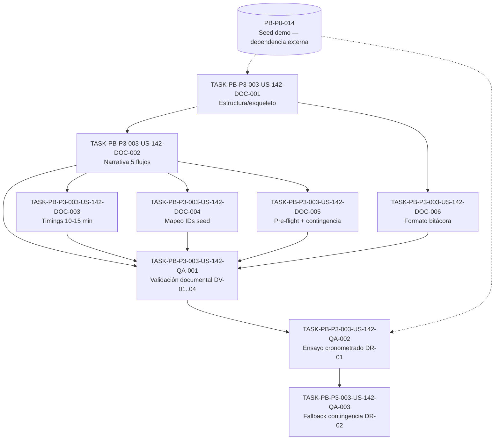

# Development Tasks — PB-P3-003 / US-142: Preparar guion de demo guiada (10–15 min)

## 1. Metadata

| Field | Value |
|---|---|
| User Story ID | US-142 |
| Source User Story | `management/user-stories/US-142-prepare-demo-guion.md` |
| Source Technical Specification | `management/technical-specs/P3/PB-P3-003/US-142-technical-spec.md` |
| Decision Resolution Artifact | No aplica — no existe artefacto de decision-resolution para US-142 |
| Priority | P3 |
| Backlog ID | PB-P3-003 |
| Backlog Title | Guion de demo guiada 10–15 min (Guion narrativo de demo cubriendo 5 flujos clave) |
| Backlog Execution Order | P3 #3 (tercer ítem P3, tras PB-P3-001 y PB-P3-002) |
| User Story Position in Backlog Item | 1 de 1 (única US del ítem) |
| Related User Stories in Backlog Item | US-142 |
| Epic | EPIC-DEMO-001 — Demo Readiness |
| Backlog Item Dependencies | PB-P0-014 (Seed Script Idempotente + Datos Demo) |
| Feature | Guion narrativo de demo guiada |
| Module / Domain | Demo / Documentación |
| Backlog Alignment Status | Found |
| Task Breakdown Status | Ready for Sprint Planning |
| Created Date | 2026-07-07 |
| Last Updated | 2026-07-07 |

---

## 2. Source Validation

| Source | Found | Used | Notes |
|---|---|---|---|
| User Story | Yes | Yes | `US-142-prepare-demo-guion.md`, Status Approved (2026-07-07) |
| Technical Specification | Yes | Yes | `US-142-technical-spec.md`, Status Ready for Task Breakdown — fuente primaria |
| Decision Resolution Artifact | No | No | No existe artefacto para US-142 (confirmado) |
| Product Backlog Prioritized | Yes | Yes | `4-Product-Backlog-Prioritized.md`, ítem PB-P3-003 (líneas 2199–2216) |
| ADRs | No | No | La historia no altera decisiones de arquitectura (Traceability: Related ADR(s) = No aplica) |

---

## 3. Backlog Execution Context

### Parent Backlog Item

**PB-P3-003 — "Guion de demo guiada 10–15 min"**, prioridad **P3**, Epic **EPIC-DEMO-001** (Demo Readiness), MoSCoW **Must Have**. Entregable canónico: el archivo markdown `/management/artifacts/Demo-Script.md` con el guion paso a paso de una demo guiada de 10–15 minutos que cubre los 5 flujos clave (organizador, vendor, admin, IA, cotización). Dependencia única: **PB-P0-014** (seed idempotente que provee personas, evento, cotizaciones, booking intent y reseña sobre los que opera el guion). Trazabilidad: Doc 3 §14.4.

### Execution Order Rationale

El orden de ejecución no proviene del número de la User Story (US-142) sino de la posición ordinal del ítem dentro de `management/artifacts/4-Product-Backlog-Prioritized.md`. En la prioridad P3, los ítems aparecen ordenados PB-P3-001 (línea 2157), PB-P3-002 (línea 2178), **PB-P3-003 (línea 2199)**, PB-P3-004… Por lo tanto PB-P3-003 es el **tercer** ítem P3 → **Execution Order: P3 #3**. Funcionalmente el guion consume el seed (PB-P0-014, ya cerrado en P0), por lo que su dependencia dura está satisfecha mucho antes de P3.

### Related User Stories in Same Backlog Item

| User Story | Role in Backlog Item | Suggested Order |
|---|---|---|
| US-142 | Redacción del guion narrativo de la demo guiada (único entregable del ítem) | 1 |

---

## 4. Task Breakdown Summary

| Area | Number of Tasks | Notes |
|---|---:|---|
| Product / Analysis (PO) | 0 | No aplica — alcance ya cerrado en User Story y Tech Spec |
| Backend (BE) | 0 | No aplica — sin backend (Tech Spec §7) |
| Frontend (FE) | 0 | No aplica — sin frontend (Tech Spec §8) |
| API Contract (API) | 0 | No aplica — sin endpoints (Tech Spec §9) |
| Database / Prisma (DB) | 0 | No aplica — sin esquema; solo referencia seed (Tech Spec §10) |
| AI / PromptOps (AI) | 0 | No aplica — no invoca IA; solo la documenta (Tech Spec §11) |
| Security / Authorization (SEC) | 0 | No aplica — sin superficie de seguridad (Tech Spec §12) |
| Documentation / Traceability (DOC) | 6 | Núcleo de la historia: redacción del guion en `/management/artifacts/Demo-Script.md` |
| QA / Testing (QA) | 3 | Validación documental DV-01..04 + ensayo DR-01 + fallback DR-02 |
| Seed / Demo Data (SEED) | 0 | No aplica de creación — el seed es PB-P0-014; su verificación se pliega en QA-002 (pre-flight) |
| DevOps / Environment (OPS) | 0 | No aplica — sin entorno/infra a provisionar |
| Observability / Audit (OBS) | 0 | No aplica — sin ejecución runtime que auditar (Tech Spec §14) |
| **Total** | **9** | |

---

## 5. Traceability Matrix

| Acceptance Criterion | Technical Spec Section | Task IDs |
|---|---|---|
| AC-01: Guion documentado y versionado en el repo | §3, §4 (In Scope), §6, §18 (estructura), §15 | TASK-PB-P3-003-US-142-DOC-001, TASK-PB-P3-003-US-142-DOC-002, TASK-PB-P3-003-US-142-QA-001 |
| AC-02: Cobertura de los 5 flujos clave | §6, §15 (Demo Scenario Supported), §18 (Flujos 1–5) | TASK-PB-P3-003-US-142-DOC-002, TASK-PB-P3-003-US-142-QA-001 |
| AC-03: Ventana 10–15 min con timings por flujo | §6, §18 (punto 8, presupuesto de tiempo), §17 (riesgo timing) | TASK-PB-P3-003-US-142-DOC-003, TASK-PB-P3-003-US-142-QA-001, TASK-PB-P3-003-US-142-QA-002 |
| AC-04: Mapeo explícito a usuarios/eventos del seed | §6, §15 (Seed Data Required), §18 (mapeo IDs SEED-*) | TASK-PB-P3-003-US-142-DOC-004, TASK-PB-P3-003-US-142-QA-001 |
| AC-05: Ensayo (dry-run) registrado | §6, §13 (DR-01/02), §15 (Reset/Isolation), §18 (punto 10, bitácora) | TASK-PB-P3-003-US-142-DOC-006, TASK-PB-P3-003-US-142-QA-002 |
| EC-01: Un flujo falla durante la demo en vivo (contingencia) | §11, §15 (Reset/Isolation), §17 (fallback), §18 (punto 9) | TASK-PB-P3-003-US-142-DOC-005, TASK-PB-P3-003-US-142-QA-003 |
| EC-02: El seed no está cargado o desactualizado (pre-flight) | §15 (Reset/Isolation), §17 (riesgo seed), §18 (punto 2) | TASK-PB-P3-003-US-142-DOC-005, TASK-PB-P3-003-US-142-QA-002 |
| DV-01: El documento existe en la ruta canónica | §13 (Seed/Demo Tests) | TASK-PB-P3-003-US-142-QA-001 |
| DV-02: 5 flujos presentes, en secuencia y con timing | §13 (Seed/Demo Tests) | TASK-PB-P3-003-US-142-QA-001 |
| DV-03: Cada flujo mapea a IDs SEED-* | §13 (Seed/Demo Tests) | TASK-PB-P3-003-US-142-QA-001 |
| DV-04: Existe sección de contingencia | §13 (Seed/Demo Tests) | TASK-PB-P3-003-US-142-QA-001 |
| DR-01: Ensayo end-to-end cronometrado sobre seed cargado | §13 (Ensayo dry-run) | TASK-PB-P3-003-US-142-QA-002 |
| DR-02: Fallback de contingencia (toggle MockAIProvider) | §13 (Ensayo dry-run), §17 (fallback) | TASK-PB-P3-003-US-142-QA-003 |

Todas las AC (AC-01..05), edge cases (EC-01/02), validaciones documentales (DV-01..04) y escenarios de ensayo (DR-01/02) mapean a ≥1 tarea. Toda tarea mapea a ≥1 sección de la Technical Spec.

---

## 6. Development Tasks

### TASK-PB-P3-003-US-142-DOC-001 — Crear estructura/esqueleto de `Demo-Script.md`

| Field | Value |
|---|---|
| Area | Documentation / Traceability |
| Type | Documentation |
| Priority | Must |
| Estimate | S |
| Depends On | — (dependencia externa: PB-P0-014 seed disponible para referencia) |
| Source AC(s) | AC-01 |
| Technical Spec Section(s) | §3, §4 (In Scope), §18 (Estructura recomendada) |
| Backlog ID | PB-P3-003 |
| User Story ID | US-142 |
| Owner Role | Tech Lead |
| Status | To Do |

#### Objective

Crear el archivo `/management/artifacts/Demo-Script.md` con el encabezado/metadata y el esqueleto de todas las secciones obligatorias (pre-flight, 5 flujos, presupuesto de tiempo, contingencia, bitácora), versionado en el repositorio.

#### Scope

##### Include

- Crear el archivo en la ruta canónica `/management/artifacts/Demo-Script.md`.
- Encabezado/metadata: título, versión, dependencia (PB-P0-014), ventana objetivo 10–15 min, referencias a Doc 3 §14.4, NFR-DEMO-006 y NFR-AI-008.
- Esqueleto de secciones (encabezados vacíos o con placeholders) siguiendo la estructura de Tech Spec §18 (10 puntos).

##### Exclude

- Redactar la narrativa detallada de los flujos (DOC-002).
- Asignar timings (DOC-003) o mapear IDs seed (DOC-004).
- Cualquier cambio de producto, endpoint, esquema o IA.

#### Implementation Notes

- Seguir literalmente la estructura recomendada de Tech Spec §18 (puntos 1–10).
- No modificar el seed ni ningún documento fuente; solo referenciarlos.

#### Acceptance Criteria Covered

- AC-01 (existencia del documento versionado en la ruta canónica — base).

#### Definition of Done

- [ ] `/management/artifacts/Demo-Script.md` existe en la ruta canónica.
- [ ] Contiene encabezado/metadata con versión, dependencia PB-P0-014 y ventana 10–15 min.
- [ ] Contiene los encabezados de las 10 secciones de la estructura de §18.
- [ ] Archivo comiteado al repositorio.

---

### TASK-PB-P3-003-US-142-DOC-002 — Redactar la narrativa paso a paso de los 5 flujos

| Field | Value |
|---|---|
| Area | Documentation / Traceability |
| Type | Documentation |
| Priority | Must |
| Estimate | L |
| Depends On | TASK-PB-P3-003-US-142-DOC-001 |
| Source AC(s) | AC-01, AC-02 |
| Technical Spec Section(s) | §6, §15 (Demo Scenario Supported), §18 (Flujos 1–5) |
| Backlog ID | PB-P3-003 |
| User Story ID | US-142 |
| Owner Role | Tech Lead |
| Status | To Do |

#### Objective

Redactar el contenido narrativo paso a paso de los 5 flujos clave (organizador, cotización, vendor, admin, IA), en secuencia precisa, alineados a SEED-DEMO-001..005 y a Doc 3 §14.4.

#### Scope

##### Include

- Flujo Organizador (SEED-DEMO-001): crear evento con plan/checklist IA (AI-001..004), aceptación human-in-the-loop.
- Flujo Cotización (SEED-DEMO-002): solicitar/comparar (AI-005/006)/aceptar → BookingIntent confirmado.
- Flujo Proveedor/vendor (SEED-DEMO-003): recibir notificación in-app, abrir QuoteRequest y enviar Quote.
- Flujo Admin (SEED-DEMO-004): aprobar vendor, moderar reseña, gestionar catálogo, consultar bitácora/métricas.
- Flujo IA (SEED-DEMO-005): toggle `OpenAIProvider` ↔ `MockAIProvider`, human-in-the-loop, multi-idioma.
- Pasos concretos referenciando pantallas/rutas del producto existente como narrativa.

##### Exclude

- Asignación de timings por flujo (DOC-003).
- Mapeo detallado a IDs SEED-* con tabla (DOC-004; aquí se referencian los escenarios SEED-DEMO-* de forma narrativa).
- Automatización E2E (US-128 / PB-P2-016).

#### Implementation Notes

- Mantener el orden narrativo óptimo sugerido (Organizador → Cotización → Proveedor → Admin → IA); lo obligatorio es que los 5 flujos estén presentes y en secuencia.
- No implementar UI ni endpoints; solo describir la interacción sobre el producto existente.

#### Acceptance Criteria Covered

- AC-01, AC-02 (los 5 flujos paso a paso, en secuencia).

#### Definition of Done

- [ ] Las 5 secciones de flujo están redactadas paso a paso, en secuencia precisa.
- [ ] Cada flujo cita su escenario SEED-DEMO-00X correspondiente.
- [ ] La narrativa cubre organizador, vendor, admin, IA y cotización sin omisiones.
- [ ] Alineado a Doc 3 §14.4 y a Tech Spec §15/§18.

---

### TASK-PB-P3-003-US-142-DOC-003 — Asignar timing por flujo y validar suma 10–15 min

| Field | Value |
|---|---|
| Area | Documentation / Traceability |
| Type | Documentation |
| Priority | Must |
| Estimate | S |
| Depends On | TASK-PB-P3-003-US-142-DOC-002 |
| Source AC(s) | AC-03 |
| Technical Spec Section(s) | §6 (AC-03), §18 (punto 8 presupuesto de tiempo), §17 (riesgo timing) |
| Backlog ID | PB-P3-003 |
| User Story ID | US-142 |
| Owner Role | Tech Lead |
| Status | To Do |

#### Objective

Asignar un timing explícito a cada uno de los 5 flujos y construir la tabla de presupuesto de tiempo cuya suma encaje en la ventana de 10–15 minutos (NFR-DEMO-006, VR-03).

#### Scope

##### Include

- Timing explícito por flujo (organizador, cotización, vendor, admin, IA).
- Tabla de presupuesto de tiempo con subtotales y total.
- Verificación de que la suma cae dentro de 10–15 min.

##### Exclude

- Cronometraje real del recorrido (eso es el dry-run, QA-002).
- Ajustes narrativos de los flujos (DOC-002).

#### Implementation Notes

- Dejar margen de holgura para no exceder los 15 min en vivo.
- La validación definitiva de la ventana se confirma en el ensayo cronometrado (QA-002).

#### Acceptance Criteria Covered

- AC-03 (timings por flujo con suma en 10–15 min).

#### Definition of Done

- [ ] Cada uno de los 5 flujos tiene un timing explícito asignado.
- [ ] Existe una tabla de presupuesto de tiempo con total.
- [ ] La suma de timings cae dentro de 10–15 min (VR-03).

---

### TASK-PB-P3-003-US-142-DOC-004 — Mapear cada flujo a IDs seed concretos

| Field | Value |
|---|---|
| Area | Documentation / Traceability |
| Type | Documentation |
| Priority | Must |
| Estimate | M |
| Depends On | TASK-PB-P3-003-US-142-DOC-002 |
| Source AC(s) | AC-04 |
| Technical Spec Section(s) | §6 (AC-04), §15 (Seed Data Required), §18 (mapeo IDs SEED-*) |
| Backlog ID | PB-P3-003 |
| User Story ID | US-142 |
| Owner Role | Tech Lead |
| Status | To Do |

#### Objective

Mapear explícitamente cada paso/flujo del guion a personas y datos seed concretos por su ID, para que el recorrido sea trazable y reproducible (VR-04).

#### Scope

##### Include

- Referencias concretas: `admin@eventflow.demo` (SEED-USER-001), `organizer01@eventflow.demo` (SEED-USER-002), `vendor01@eventflow.demo` (SEED-USER-003).
- Datos: SEED-EVENT-001 (`active`), SEED-QUOTE-001 (`responded`), SEED-BOOKING-001 (`confirmed_intent`), SEED-REVIEW-001.
- Agrupaciones SEED-DEMO-001..005 por flujo.
- Indicación del toggle `OpenAIProvider` / `MockAIProvider`.

##### Exclude

- Crear o modificar el seed (propiedad de PB-P0-014 — solo referencia en solo lectura).
- Verificar en runtime que los IDs existen (eso se hace en el pre-flight del ensayo, QA-002).

#### Implementation Notes

- Usar los IDs listados en Tech Spec §15 tal cual (reales y verificados); no inventar datos genéricos.
- Reutiliza datos de PB-P0-014; NO generar tareas para construir el seed.

#### Acceptance Criteria Covered

- AC-04 (mapeo explícito a usuarios/eventos del seed por ID).

#### Definition of Done

- [ ] Cada flujo referencia sus IDs SEED-* concretos (usuarios, evento, quote, booking, review).
- [ ] Se indica el toggle `OpenAIProvider` / `MockAIProvider` en el flujo IA.
- [ ] No se usan datos genéricos en lugar de IDs seed (VR-04).

---

### TASK-PB-P3-003-US-142-DOC-005 — Redactar pre-flight y sección de contingencia

| Field | Value |
|---|---|
| Area | Documentation / Traceability |
| Type | Documentation |
| Priority | Must |
| Estimate | M |
| Depends On | TASK-PB-P3-003-US-142-DOC-002 |
| Source AC(s) | EC-01, EC-02 |
| Technical Spec Section(s) | §11, §15 (Reset/Isolation Notes), §17 (fallback), §18 (puntos 2 y 9) |
| Backlog ID | PB-P3-003 |
| User Story ID | US-142 |
| Owner Role | Tech Lead |
| Status | To Do |

#### Objective

Redactar la sección de pre-flight (verificación/carga de seed antes de iniciar) y la sección de contingencia (fallback a `MockAIProvider`, orden alternativo de flujos, recarga de seed) que permiten continuar la demo sin bloqueo.

#### Scope

##### Include

- Pre-flight: verificar/cargar `seed:demo` (PB-P0-014); confirmar cuentas seed (`admin@`, `organizer01@`, `vendor01@`); confirmar toggle `LLM_PROVIDER` y disponibilidad de `MockAIProvider` (EC-02).
- Contingencia: activación de `MockAIProvider` determinista vía `LLM_PROVIDER` / `AI_DEMO_MODE` si `OpenAIProvider` falla o excede timeout; orden alternativo de flujos; recarga de seed antes de reintentar (EC-01, NFR-AI-008).

##### Exclude

- Ejecutar el pre-flight o el fallback en vivo (eso es QA-002 y QA-003).
- Crear/modificar el endpoint de reset del seed (PB-P3-001 / PB-P0-014).

#### Implementation Notes

- No alterar el seed en la contingencia; solo recargarlo con el script existente.
- El toggle es de configuración (`LLM_PROVIDER` / `AI_DEMO_MODE`), no código nuevo.

#### Acceptance Criteria Covered

- EC-01 (contingencia ante fallo de flujo), EC-02 (pre-flight de seed).

#### Definition of Done

- [ ] Existe una sección de pre-flight con verificación/carga de seed y confirmación del toggle.
- [ ] Existe una sección de contingencia con fallback a `MockAIProvider`, orden alternativo y recarga de seed.
- [ ] Ambas secciones referencian PB-P0-014 y NFR-AI-008 sin reabrir su propiedad (DV-04).

---

### TASK-PB-P3-003-US-142-DOC-006 — Definir el formato de bitácora de ensayo (dry-run)

| Field | Value |
|---|---|
| Area | Documentation / Traceability |
| Type | Documentation |
| Priority | Must |
| Estimate | S |
| Depends On | TASK-PB-P3-003-US-142-DOC-001 |
| Source AC(s) | AC-05 |
| Technical Spec Section(s) | §6 (AC-05), §13 (Ensayo dry-run), §18 (punto 10 bitácora) |
| Backlog ID | PB-P3-003 |
| User Story ID | US-142 |
| Owner Role | Tech Lead |
| Status | To Do |

#### Objective

Definir en el documento la plantilla/formato de la bitácora de ensayo donde se registrará la evidencia del dry-run: fecha, duración total, duración por flujo y resultado.

#### Scope

##### Include

- Tabla de bitácora con columnas: fecha, duración total, duración por flujo, resultado, notas.
- Espacio para registrar tanto el recorrido completo (DR-01) como el fallback de contingencia (DR-02).

##### Exclude

- Ejecutar el ensayo y rellenar la evidencia (eso es QA-002 y QA-003).

#### Implementation Notes

- La plantilla vive dentro de `Demo-Script.md` (apartado de bitácora), conforme a Tech Spec §18 punto 10.

#### Acceptance Criteria Covered

- AC-05 (formato para registrar la evidencia del ensayo — base).

#### Definition of Done

- [ ] Existe una sección/tabla de bitácora de ensayo en `Demo-Script.md`.
- [ ] La tabla contempla fecha, duración total, duración por flujo y resultado.
- [ ] Contempla filas para DR-01 (recorrido completo) y DR-02 (fallback).

---

### TASK-PB-P3-003-US-142-QA-001 — Validación documental DV-01..04

| Field | Value |
|---|---|
| Area | QA / Testing |
| Type | Test |
| Priority | Must |
| Estimate | S |
| Depends On | TASK-PB-P3-003-US-142-DOC-002, TASK-PB-P3-003-US-142-DOC-003, TASK-PB-P3-003-US-142-DOC-004, TASK-PB-P3-003-US-142-DOC-005, TASK-PB-P3-003-US-142-DOC-006 |
| Source AC(s) | AC-01, AC-02, AC-03, AC-04, EC-01 |
| Technical Spec Section(s) | §13 (Seed/Demo Tests — Validación documental) |
| Backlog ID | PB-P3-003 |
| User Story ID | US-142 |
| Owner Role | QA |
| Status | To Do |

#### Objective

Revisar el contenido de `Demo-Script.md` y verificar los cuatro criterios de validación documental (DV-01..04) antes del ensayo.

#### Scope

##### Include

- DV-01: el documento existe en `/management/artifacts/Demo-Script.md`.
- DV-02: los 5 flujos están presentes, en secuencia y con timing por flujo.
- DV-03: cada flujo mapea a personas/eventos seed concretos (IDs SEED-*).
- DV-04: existe la sección de contingencia (qué hacer si un flujo falla).

##### Exclude

- Ejecución del recorrido cronometrado (QA-002) o del fallback (QA-003).

#### Implementation Notes

- Es una revisión documental (doc review), sin pruebas de software automatizadas.
- Registrar hallazgos y devolver a DOC-* si algún criterio falla.

#### Acceptance Criteria Covered

- AC-01, AC-02, AC-03, AC-04, EC-01 (verificación documental de su presencia).

#### Definition of Done

- [ ] DV-01 verificado (archivo en ruta canónica).
- [ ] DV-02 verificado (5 flujos, en secuencia, con timing).
- [ ] DV-03 verificado (mapeo a IDs SEED-*).
- [ ] DV-04 verificado (sección de contingencia presente).
- [ ] Resultado de la revisión registrado (pass/fail por criterio).

---

### TASK-PB-P3-003-US-142-QA-002 — Ensayo cronometrado end-to-end (pre-flight seed + DR-01)

| Field | Value |
|---|---|
| Area | QA / Testing |
| Type | Test |
| Priority | Must |
| Estimate | M |
| Depends On | TASK-PB-P3-003-US-142-QA-001 |
| Source AC(s) | AC-03, AC-05, EC-02 |
| Technical Spec Section(s) | §13 (Ensayo dry-run DR-01), §15 (Reset/Isolation Notes), §17 (riesgo seed) |
| Backlog ID | PB-P3-003 |
| User Story ID | US-142 |
| Owner Role | QA |
| Status | To Do |

#### Objective

Ejecutar el pre-flight (verificar que el seed PB-P0-014 está cargado y vigente), correr el guion end-to-end sobre el seed cargado, cronometrar el recorrido y registrar la evidencia en la bitácora (DR-01).

#### Scope

##### Include

- Pre-flight: verificar/recargar `seed:demo` (PB-P0-014) y confirmar que los IDs SEED-* referenciados existen (reutilización de PB-P0-014, no creación).
- Ejecutar el recorrido completo de los 5 flujos y cronometrar por flujo y total.
- Confirmar que el recorrido encaja en 10–15 min.
- Registrar la evidencia (fecha, duración total, duración por flujo, resultado) en la bitácora de `Demo-Script.md`.

##### Exclude

- Construir o modificar el seed (propiedad de PB-P0-014).
- Ejecutar el fallback de contingencia (QA-003).
- Automatización E2E (US-128 / PB-P2-016).

#### Implementation Notes

- Si el recorrido excede 15 min, devolver a DOC-003 para reajustar timings y reensayar.
- La verificación del seed es una reutilización de PB-P0-014; NO se crea seed en esta historia.

#### Acceptance Criteria Covered

- AC-05 (ensayo registrado), AC-03 (confirmación de la ventana en vivo), EC-02 (pre-flight de seed ejecutado).

#### Definition of Done

- [ ] Pre-flight ejecutado: seed cargado/vigente y IDs SEED-* verificados.
- [ ] Recorrido end-to-end de los 5 flujos ejecutado y cronometrado.
- [ ] Duración total dentro de 10–15 min (DR-01).
- [ ] Evidencia registrada en la bitácora de `Demo-Script.md` (fecha, duración total, por flujo, resultado).

---

### TASK-PB-P3-003-US-142-QA-003 — Ensayo del fallback de contingencia (DR-02, toggle MockAIProvider)

| Field | Value |
|---|---|
| Area | QA / Testing |
| Type | Test |
| Priority | Must |
| Estimate | S |
| Depends On | TASK-PB-P3-003-US-142-QA-002 |
| Source AC(s) | EC-01, AC-05 |
| Technical Spec Section(s) | §13 (Ensayo dry-run DR-02), §17 (fallback), §11 |
| Backlog ID | PB-P3-003 |
| User Story ID | US-142 |
| Owner Role | QA |
| Status | To Do |

#### Objective

Ejecutar el fallback de contingencia documentado (toggle a `MockAIProvider` vía `LLM_PROVIDER` / `AI_DEMO_MODE`) simulando el fallo del flujo IA, y confirmar que la demo continúa sin bloqueo, registrando el resultado en la bitácora (DR-02).

#### Scope

##### Include

- Activar `MockAIProvider` determinista mediante el toggle de configuración.
- Ejecutar el flujo IA con el mock y confirmar continuidad de la demo.
- Registrar en la bitácora que el fallback funciona (fecha, resultado, nota).

##### Exclude

- Modificar el código del provider o del toggle (solo configuración existente).
- Recargar/modificar el seed (fuera de este escenario, propiedad de PB-P0-014).

#### Implementation Notes

- El mock debe ser determinista (NFR-AI-008); no se altera el seed.
- Confirma que la contingencia redactada en DOC-005 es ejecutable.

#### Acceptance Criteria Covered

- EC-01 (contingencia ejecutada), AC-05 (evidencia registrada del fallback).

#### Definition of Done

- [ ] Toggle a `MockAIProvider` ejecutado (`LLM_PROVIDER` / `AI_DEMO_MODE`).
- [ ] La demo continúa sin bloqueo con el mock determinista.
- [ ] Resultado del fallback registrado en la bitácora de `Demo-Script.md` (DR-02).

---

## 7. Required QA Tasks

| Task ID | Test Type | Purpose |
|---|---|---|
| TASK-PB-P3-003-US-142-QA-001 | Doc review (validación documental) | Verificar DV-01..04: existencia, 5 flujos con timing, mapeo a seed, contingencia |
| TASK-PB-P3-003-US-142-QA-002 | Dry-run cronometrado | Ejecutar DR-01: pre-flight de seed + recorrido end-to-end en 10–15 min y registrar evidencia |
| TASK-PB-P3-003-US-142-QA-003 | Dry-run de contingencia | Ejecutar DR-02: fallback a `MockAIProvider` sin bloqueo y registrar evidencia |

---

## 8. Required Security Tasks

`No aplica` — la historia no introduce autenticación, autorización, ownership, roles runtime, escenarios negativos, auditoría ni datos sensibles (Tech Spec §12; User Story §Authorization & Security Rules). El guion solo referencia cuentas seed ficticias (`*@eventflow.demo`) y no accede a datos productivos ni secretos.

---

## 9. Required Seed / Demo Tasks

`No aplica` (de creación de seed). El seed es propiedad de **PB-P0-014** y se reutiliza en solo lectura. La única verificación seed (confirmar que el `seed:demo` está cargado y que los IDs SEED-* existen) se pliega en el pre-flight de **TASK-PB-P3-003-US-142-QA-002**. No se generan tareas SEED de construcción ni modificación (Tech Spec §15, §19).

---

## 10. Observability / Audit Tasks

`No aplica` — no hay ejecución runtime que registrar, correlacionar ni auditar (`AdminAction`), ni métricas que instrumentar. La única "evidencia" es la bitácora manual de ensayo dentro del propio documento (Tech Spec §14).

---

## 11. Documentation / Traceability Tasks

| Task ID | Document / Artifact | Purpose |
|---|---|---|
| TASK-PB-P3-003-US-142-DOC-001 | `/management/artifacts/Demo-Script.md` | Crear estructura/esqueleto y metadata del guion |
| TASK-PB-P3-003-US-142-DOC-002 | `/management/artifacts/Demo-Script.md` | Redactar narrativa paso a paso de los 5 flujos |
| TASK-PB-P3-003-US-142-DOC-003 | `/management/artifacts/Demo-Script.md` | Asignar timings por flujo y validar suma 10–15 min |
| TASK-PB-P3-003-US-142-DOC-004 | `/management/artifacts/Demo-Script.md` | Mapear cada flujo a IDs seed concretos (SEED-*) |
| TASK-PB-P3-003-US-142-DOC-005 | `/management/artifacts/Demo-Script.md` | Redactar pre-flight y sección de contingencia |
| TASK-PB-P3-003-US-142-DOC-006 | `/management/artifacts/Demo-Script.md` | Definir el formato de bitácora de ensayo |

---

## 12. Dependency Graph

---

## 13. Suggested Implementation Order

### Phase 1 — Foundation

- TASK-PB-P3-003-US-142-DOC-001 — Crear estructura/esqueleto de `Demo-Script.md`.

### Phase 2 — Core Implementation

- TASK-PB-P3-003-US-142-DOC-002 — Redactar narrativa de los 5 flujos.
- TASK-PB-P3-003-US-142-DOC-003 — Asignar timings y validar suma 10–15 min.
- TASK-PB-P3-003-US-142-DOC-004 — Mapear cada flujo a IDs seed.
- TASK-PB-P3-003-US-142-DOC-005 — Redactar pre-flight y contingencia.
- TASK-PB-P3-003-US-142-DOC-006 — Definir formato de bitácora.

### Phase 3 — Validation / Security / QA

- TASK-PB-P3-003-US-142-QA-001 — Validación documental DV-01..04.
- TASK-PB-P3-003-US-142-QA-002 — Ensayo cronometrado end-to-end (pre-flight + DR-01).
- TASK-PB-P3-003-US-142-QA-003 — Ensayo del fallback de contingencia (DR-02).
- Security: `No aplica`.

### Phase 4 — Documentation / Review

- La documentación es el núcleo de la historia (DOC-001..006); el cierre de fase corresponde al registro final de la bitácora tras QA-002/QA-003 y la actualización del Definition of Done en la User Story.

---

## 14. Risks & Mitigations

| Risk | Impact | Mitigation | Related Task |
|---|---|---|---|
| El seed no está cargado o desactualizado al ejecutar el ensayo | El recorrido falla o muestra datos vacíos (RISK-SEED-001) | Pre-flight que verifica/recarga `seed:demo` antes de iniciar | TASK-PB-P3-003-US-142-QA-002 |
| El `OpenAIProvider` real falla o excede timeout en vivo | El flujo IA bloquea la demo | Contingencia documentada + ensayada: toggle a `MockAIProvider` determinista | TASK-PB-P3-003-US-142-DOC-005, TASK-PB-P3-003-US-142-QA-003 |
| La suma de timings excede 10–15 min | Demo fuera de rango (VR-03) | Presupuesto de tiempo definido y validado en ensayo cronometrado | TASK-PB-P3-003-US-142-DOC-003, TASK-PB-P3-003-US-142-QA-002 |
| El guion referencia datos genéricos en vez de IDs seed | Guion no trazable ni reproducible (VR-04) | Mapeo obligatorio a IDs SEED-* verificados en §15 | TASK-PB-P3-003-US-142-DOC-004, TASK-PB-P3-003-US-142-QA-001 |
| Deriva entre el seed vigente y el guion | El guion queda obsoleto si el seed cambia | Regla: si el seed cambia, el guion se actualiza; mantener alineado a Doc 11 | TASK-PB-P3-003-US-142-DOC-004 |
| Scope creep hacia automatización E2E o video | Desvío del entregable documental | Out of Scope explícito: E2E es US-128/PB-P2-016; sin video/marketing | Todas (guardrail) |

---

## 15. Out of Scope Confirmation

No debe implementarse como parte de esta User Story:

- Redactar contenido narrativo fuera de `/management/artifacts/Demo-Script.md` o crear otros archivos.
- Cualquier código de Frontend, Backend, Base de Datos, API o capa de IA.
- Crear o modificar el endpoint de reset del seed (PB-P3-001 / US-140 / PB-P0-014).
- Construir o modificar el seed mismo (propiedad de PB-P0-014).
- Automatización E2E con Playwright (US-128 / PB-P2-016).
- Video, grabación o material de marketing.
- Pagos reales, contratos firmados, WhatsApp/chat/push, RAG/vector DB, multi-tenant enterprise, decisiones autónomas de IA.
- Introducir reglas de negocio, endpoints o autorización runtime.

---

## 16. Readiness for Sprint Planning

| Check | Status |
|---|---|
| Product Backlog mapping found | Pass |
| Every AC maps to tasks | Pass |
| Technical Spec used when available | Pass |
| QA tasks included | Pass |
| Security tasks included if applicable | N/A |
| Seed/demo tasks included if applicable | N/A (reutiliza PB-P0-014; verificación en QA-002) |
| Observability tasks included if applicable | N/A |
| Documentation tasks included if applicable | Pass |
| Task dependencies clear | Pass |
| Tasks small enough | Pass (máximo L en DOC-002; el resto XS/S/M) |
| Ready for Sprint Planning | Yes |

---

## 17. Final Recommendation

**Ready for Sprint Planning.**

La User Story US-142 está aprobada y mapeada a **PB-P3-003** (Execution Order **P3 #3**), con su dependencia dura (**PB-P0-014**) satisfecha en P0. La Technical Specification (Ready for Task Breakdown) es la fuente primaria y toda tarea mapea a ≥1 de sus secciones. La naturaleza es 100% documental: 6 tareas DOC producen el guion `/management/artifacts/Demo-Script.md` (estructura, narrativa de los 5 flujos, timings 10–15 min, mapeo a IDs seed, pre-flight/contingencia, formato de bitácora) y 3 tareas QA cubren la validación documental (DV-01..04) y los ensayos (DR-01 recorrido cronometrado, DR-02 fallback a `MockAIProvider`). Todas las AC (AC-01..05), edge cases (EC-01/02) y escenarios DV/DR mapean a ≥1 tarea. Las áreas FE/BE/DB/API/AI/SEC/OBS/SEED-de-creación se marcan `No aplica` con justificación. Sin bloqueos ni conflictos (la alineación de reencuadre a documentación P3 ya está cerrada y es no bloqueante). Puede proceder a Sprint Planning.
