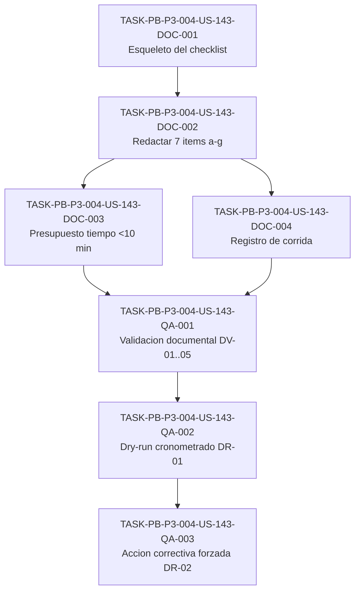

# Development Tasks — PB-P3-004 / US-143: Validar checklist pre-demo

## 1. Metadata

| Field | Value |
|---|---|
| User Story ID | US-143 |
| Source User Story | `management/user-stories/US-143-pre-demo-checklist-validation.md` |
| Source Technical Specification | `management/technical-specs/P3/PB-P3-004/US-143-technical-spec.md` |
| Decision Resolution Artifact | No existe (no requerido) |
| Priority | P3 |
| Backlog ID | PB-P3-004 |
| Backlog Title | Checklist pre-demo (idioma, moneda, captcha test, seed, toggle) |
| Backlog Execution Order | P3 #4 (PB-P3-001 #1, PB-P3-002 #2, PB-P3-003 #3, PB-P3-004 #4) |
| User Story Position in Backlog Item | 1 de 1 (única US del backlog item) |
| Related User Stories in Backlog Item | US-143 |
| Epic | EPIC-DEMO-001 — Demo Readiness |
| Backlog Item Dependencies | PB-P3-001 (US-140 reset demo), PB-P3-005 (US-144 toggle Mock/OpenAI) |
| Feature | Checklist pre-demo (idioma, moneda, captcha test, seed, toggle) |
| Module / Domain | Demo / Documentación |
| Backlog Alignment Status | Found |
| Task Breakdown Status | Ready for Sprint Planning |
| Created Date | 2026-07-07 |
| Last Updated | 2026-07-07 |

---

## 2. Source Validation

| Source | Found | Used | Notes |
|---|---|---|---|
| User Story | Yes | Yes | Approved with Minor Notes (2026-07-07). AC-01..06, EC-01/02, VR-01..05, DV-01..05, DR-01/02. |
| Technical Specification | Yes | Yes | Status: Ready for Task Breakdown. Fuente primaria de esta desagregación. |
| Decision Resolution Artifact | No | No | Confirmado inexistente; no requerido para esta historia. |
| Product Backlog Prioritized | Yes | Yes | `management/artifacts/4-Product-Backlog-Prioritized.md` §PB-P3-004. |
| ADRs | No | No | El checklist no altera decisiones de arquitectura; verifica configuración operacional. |

---

## 3. Backlog Execution Context

### Parent Backlog Item

**PB-P3-004 — Checklist pre-demo (idioma, moneda, captcha test, seed, toggle)**. Bloque **P3 — Demo Polish / Academic Evidence**, Epic **EPIC-DEMO-001 — Demo Readiness**. MoSCoW **Must Have**. Traceability declarada: Doc 21. Dependencias: **PB-P3-001** (US-140 reset demo) y **PB-P3-005** (US-144 toggle Mock/OpenAI). Entregable: el documento markdown versionado `/management/artifacts/Pre-Demo-Checklist.md`. Naturaleza **documentación / demo**: no introduce Frontend, Backend, Database, API ni invocación de IA.

### Execution Order Rationale

El orden de ejecución no lo define el número de la User Story (US-143) sino la posición dentro del Product Backlog Prioritized. En el bloque §P3, por posición de listado, **PB-P3-004 es el cuarto item (P3 #4)**: PB-P3-001 (#1), PB-P3-002 (#2), PB-P3-003 (#3), PB-P3-004 (#4). Adicionalmente, el checklist consolida y verifica precondiciones producidas por PB-P3-001 (reset), PB-P3-003 (guion de demo) y PB-P3-005 (toggle), y referencia el smoke de PB-P3-007 (US-146); es coherente redactarlo una vez que esas piezas existen o están especificadas, de modo que las acciones correctivas apunten a procedimientos reales.

### Related User Stories in Same Backlog Item

| User Story | Role in Backlog Item | Suggested Order |
|---|---|---|
| US-143 | Redactar y validar el checklist pre-demo documental (7 ítems verificables) | 1 (única US del backlog item) |

---

## 4. Task Breakdown Summary

| Area | Number of Tasks | Notes |
|---|---:|---|
| Documentation / Traceability (DOC) | 4 | Núcleo de la historia: esqueleto, 7 ítems (a–g), presupuesto `<10 min`, registro de corrida. |
| QA / Testing (QA) | 3 | Validación documental (DV-01..05, incluye higiene de secretos VR-05) y corrida dry-run (DR-01/DR-02). |
| Product / Analysis (PO) | 0 | No aplica — alcance y decisiones ya cerrados en la Tech Spec. |
| Backend (BE) | 0 | No aplica — sin backend. |
| Frontend (FE) | 0 | No aplica — sin frontend/UI. |
| API Contract (API) | 0 | No aplica — sin endpoints. |
| Database / Prisma (DB) | 0 | No aplica — sin esquema; solo lectura de estado del seed en la corrida. |
| AI / PromptOps (AI) | 0 | No aplica — solo verificación de estado del toggle, sin invocación de IA. |
| Security / Authorization (SEC) | 0 | No aplica como impl.; higiene de secretos (VR-05) plegada en DOC/QA. |
| Seed / Demo Data (SEED) | 0 | No aplica — verificación (solo lectura) del seed dentro de la corrida QA. |
| DevOps / Environment (OPS) | 0 | No aplica. |
| Observability / Audit (OBS) | 0 | No aplica — el único "registro" es documental (run log). |
| **Total** | **7** | DOC(4), QA(3). |

---

## 5. Traceability Matrix

| Acceptance Criterion | Technical Spec Section | Task IDs |
|---|---|---|
| AC-01 — Checklist documentado y versionado | §3, §4, §6, §18 | TASK-PB-P3-004-US-143-DOC-001, TASK-PB-P3-004-US-143-QA-001 |
| AC-02 — Cobertura de los 7 ítems (a–g) | §6, §18 | TASK-PB-P3-004-US-143-DOC-002, TASK-PB-P3-004-US-143-QA-001, TASK-PB-P3-004-US-143-QA-002 |
| AC-03 — Criterio de verificación objetivo + estado esperado | §6, §18 | TASK-PB-P3-004-US-143-DOC-001, TASK-PB-P3-004-US-143-DOC-002, TASK-PB-P3-004-US-143-QA-001 |
| AC-04 — Acción correctiva definida | §6, §15, §18 | TASK-PB-P3-004-US-143-DOC-002, TASK-PB-P3-004-US-143-QA-001, TASK-PB-P3-004-US-143-QA-003 |
| AC-05 — Ejecutable en `<10 min` | §6, §17, §18 | TASK-PB-P3-004-US-143-DOC-003, TASK-PB-P3-004-US-143-QA-002 |
| AC-06 — Trazabilidad a fuentes autoritativas | §6, §18 | TASK-PB-P3-004-US-143-DOC-002, TASK-PB-P3-004-US-143-QA-001 |
| EC-01 — Un ítem falla la verificación | §6, §14, §18 | TASK-PB-P3-004-US-143-DOC-002, TASK-PB-P3-004-US-143-DOC-004, TASK-PB-P3-004-US-143-QA-003 |
| EC-02 — Contingencia por caída de OpenAI | §11, §14, §18 | TASK-PB-P3-004-US-143-DOC-002, TASK-PB-P3-004-US-143-DOC-004, TASK-PB-P3-004-US-143-QA-003 |
| VR-05 — Sin secretos (solo nombres de variables) | §12, §17 | TASK-PB-P3-004-US-143-DOC-002, TASK-PB-P3-004-US-143-QA-001 |
| DV-01..05 — Validación documental | §13 | TASK-PB-P3-004-US-143-QA-001 |
| DR-01 — Corrida secuencial cronometrada `<10 min` | §13 | TASK-PB-P3-004-US-143-QA-002 |
| DR-02 — Forzar fallo y aplicar acción correctiva | §13, §17 | TASK-PB-P3-004-US-143-QA-003 |

Cada Acceptance Criterion mapea a al menos una tarea; cada tarea mapea a al menos una sección de la Technical Spec.

---

## 6. Development Tasks

### TASK-PB-P3-004-US-143-DOC-001 — Crear archivo y esqueleto del checklist pre-demo

| Field | Value |
|---|---|
| Area | Documentation / Traceability |
| Type | Documentation |
| Priority | Must |
| Estimate | S |
| Depends On | — |
| Source AC(s) | AC-01, AC-03 |
| Technical Spec Section(s) | §3, §4, §6, §18 |
| Backlog ID | PB-P3-004 |
| User Story ID | US-143 |
| Owner Role | Tech Lead |
| Status | To Do |

#### Objective

Crear el archivo canónico `/management/artifacts/Pre-Demo-Checklist.md` con su encabezado y el esqueleto de la tabla de ítems, estableciendo la estructura sobre la que se redactará el contenido.

#### Scope

##### Include

- Crear el archivo en la ruta canónica `/management/artifacts/Pre-Demo-Checklist.md` (consistente con `Demo-Script.md` de US-142).
- Encabezado con: propósito, alcance (`<10 min` antes de la demo guiada US-142) y nota explícita de "no exponer secretos" (solo nombres de variables).
- Tabla de ítems con las columnas exactas: `Ítem | Cómo se verifica | Estado esperado | Acción correctiva | Fuente`.
- Filas placeholder para los 7 ítems (a–g) sin contenido final (se completa en DOC-002).

##### Exclude

- Redacción del contenido de cada ítem (DOC-002).
- Presupuesto de tiempo (DOC-003) y registro de corrida (DOC-004).

#### Implementation Notes

Usar la ruta y las columnas exactas definidas en la Tech Spec §18. No inventar columnas adicionales. El archivo es markdown versionado; su ausencia invalida la historia (VR-01).

#### Acceptance Criteria Covered

- AC-01 (existencia/versionado del documento), AC-03 (columnas de verificación y estado esperado como estructura).

#### Definition of Done

- [ ] Archivo `/management/artifacts/Pre-Demo-Checklist.md` creado en la ruta canónica.
- [ ] Encabezado con propósito, alcance `<10 min` y nota de no-secretos.
- [ ] Tabla con columnas exactas `Ítem | Cómo se verifica | Estado esperado | Acción correctiva | Fuente`.

---

### TASK-PB-P3-004-US-143-DOC-002 — Redactar los 7 ítems (a–g) con verificación, estado, acción y fuente

| Field | Value |
|---|---|
| Area | Documentation / Traceability |
| Type | Documentation |
| Priority | Must |
| Estimate | M |
| Depends On | TASK-PB-P3-004-US-143-DOC-001 |
| Source AC(s) | AC-02, AC-03, AC-04, AC-06 |
| Technical Spec Section(s) | §6, §11, §12, §15, §18 |
| Backlog ID | PB-P3-004 |
| User Story ID | US-143 |
| Owner Role | Tech Lead |
| Status | To Do |

#### Objective

Redactar el contenido de los 7 ítems obligatorios (a–g), cada uno con su método de verificación objetivo, estado esperado, acción correctiva y fuente autoritativa.

#### Scope

##### Include

- **(a) Seed cargado/reproducible**: verificar datos seed clave (login por rol, ≥1 `confirmed_intent`, ≥1 reseña, eventos en `draft`/`active`/`completed`); acción correctiva: re-aplicar `seed:demo` (PB-P0-014) o reset del entorno demo (US-140 / PB-P3-001). Fuente: Doc 11 (SEED-*), Doc 3 §14.4.
- **(b) Idioma del usuario/evento demo**: observar `locale` en pantalla; estado según escenario (es-LATAM/es-ES/pt/en). Fuente: NFR-I18N-006, SEED-DEMO-005.
- **(c) Moneda del evento demo**: observar moneda en detalle/presupuesto; sin conversión automática (moneda inmutable). Fuente: NFR-I18N-004, BR-EVENT-007.
- **(d) Captcha en modo test**: verificar `CAPTCHA_DISABLED` / test keys (`NEXT_PUBLIC_CAPTCHA_SITE_KEY`, `CAPTCHA_SECRET_KEY` en modo test); login demo no se bloquea. Fuente: NFR-TEST-006, Doc 21 (env vars captcha).
- **(e) Smoke tests pasados**: ejecutar/consultar smoke sobre la Demo URL; verde (`GET /health` 200, flujo smoke pasa); acción correctiva: re-ejecutar smoke (US-146 / PB-P3-007). Fuente: Doc 21 §23.3, NFR-TEST-004.
- **(f) Métricas admin visibles**: abrir panel admin y confirmar métricas en pantalla. Fuente: Doc 3 §14.4.
- **(g) Toggle Mock/OpenAI**: confirmar `LLM_PROVIDER`, `AI_DEMO_MODE`, `AI_USE_MOCK_FALLBACK` (preferido: `LLM_PROVIDER=openai` + `AI_USE_MOCK_FALLBACK=true`; contingencia: `LLM_PROVIDER=mock` + `AI_DEMO_MODE=true`); acción correctiva según runbook (US-144 / PB-P3-005). Fuente: Doc 21 §23.2 y tabla env vars.
- Vincular cada ítem a su fuente real, sin inventar IDs.
- Redactar la triada verificación/estado/acción de forma objetiva y no ambigua por ítem.

##### Exclude

- Implementar o configurar captcha, i18n, moneda, seed o toggle (solo se verifican estados existentes).
- Implementar el reset (US-140), el runbook (US-144), el smoke (US-146) o el guion (US-142): solo se referencian.
- Incluir valores de secretos: referenciar variables por nombre únicamente (VR-05, Doc 19).

#### Implementation Notes

Seguir la tabla-guía de la Tech Spec §18. No exponer valores de `CAPTCHA_SECRET_KEY` ni `OPENAI_API_KEY`. Los estados deseados del toggle no se redefinen: se remiten al runbook US-144 y a Doc 21 §23.2.

#### Acceptance Criteria Covered

- AC-02 (7 ítems presentes), AC-03 (verificación + estado), AC-04 (acción correctiva), AC-06 (fuentes reales); soporta EC-01/EC-02 (acciones correctivas y contingencia OpenAI) y VR-05 (sin secretos).

#### Definition of Done

- [ ] Los 7 ítems (a–g) redactados en la tabla.
- [ ] Cada ítem tiene criterio de verificación objetivo, estado esperado y acción correctiva.
- [ ] Cada ítem cita fuente autoritativa real (sin IDs inventados).
- [ ] El documento no contiene valores de secretos (solo nombres de variables).

---

### TASK-PB-P3-004-US-143-DOC-003 — Añadir presupuesto de tiempo `<10 min` con desglose por ítem

| Field | Value |
|---|---|
| Area | Documentation / Traceability |
| Type | Documentation |
| Priority | Must |
| Estimate | XS |
| Depends On | TASK-PB-P3-004-US-143-DOC-002 |
| Source AC(s) | AC-05 |
| Technical Spec Section(s) | §6, §17, §18 |
| Backlog ID | PB-P3-004 |
| User Story ID | US-143 |
| Owner Role | Tech Lead |
| Status | To Do |

#### Objective

Documentar la estimación de tiempo total `<10 min` con un desglose por ítem y el criterio "listo para demo" (solo cuando todos los ítems obligatorios están en verde).

#### Scope

##### Include

- Presupuesto de tiempo por ítem (a–g) que sume `<10 min`.
- Criterio explícito de "listo para demo" condicionado a todos los ítems en verde.

##### Exclude

- Automatización o cronometraje por herramienta (la medición real ocurre en la corrida dry-run QA-002).

#### Implementation Notes

Si el desglose excede 10 min, simplificar o priorizar ítems (VR-04, riesgo §17). El presupuesto es una estimación documental; la validación empírica corresponde a DR-01.

#### Acceptance Criteria Covered

- AC-05 (ejecutable en `<10 min`).

#### Definition of Done

- [ ] Presupuesto por ítem presente y suma total `<10 min`.
- [ ] Criterio "listo para demo" documentado (todos los ítems en verde).

---

### TASK-PB-P3-004-US-143-DOC-004 — Añadir la sección de registro de corrida (run log)

| Field | Value |
|---|---|
| Area | Documentation / Traceability |
| Type | Documentation |
| Priority | Must |
| Estimate | S |
| Depends On | TASK-PB-P3-004-US-143-DOC-002 |
| Source AC(s) | AC-04 |
| Technical Spec Section(s) | §6, §14, §18 |
| Backlog ID | PB-P3-004 |
| User Story ID | US-143 |
| Owner Role | Tech Lead |
| Status | To Do |

#### Objective

Añadir la sección de registro de corrida (run log) para documentar cada ejecución del checklist: fecha, responsable, resultado por ítem, acción correctiva aplicada y estado final.

#### Scope

##### Include

- Tabla de registro con: fecha, responsable, resultado por ítem (verde/rojo), acción correctiva aplicada y estado final "listo para demo".
- Instrucción de dejar constancia del estado deseado del toggle en la contingencia OpenAI (EC-02).

##### Exclude

- Ejecutar la corrida (eso es QA-002/QA-003).
- Incluir valores de secretos en el registro (solo nombres de variables).

#### Implementation Notes

El registro es documental, no telemetría de sistema (Tech Spec §14). Debe permitir declarar "listo para demo" solo con todos los ítems en verde (EC-01).

#### Acceptance Criteria Covered

- AC-04 (soporte del ciclo verificación→acción→estado); soporta EC-01/EC-02.

#### Definition of Done

- [ ] Sección de registro de corrida con columnas fecha, responsable, resultado por ítem, acción correctiva y estado final.
- [ ] Sin valores de secretos en el registro.

---

### TASK-PB-P3-004-US-143-QA-001 — Validación documental del checklist (DV-01..05 + higiene de secretos)

| Field | Value |
|---|---|
| Area | QA / Testing |
| Type | Test |
| Priority | Must |
| Estimate | S |
| Depends On | TASK-PB-P3-004-US-143-DOC-003, TASK-PB-P3-004-US-143-DOC-004 |
| Source AC(s) | AC-01, AC-02, AC-03, AC-04, AC-06 |
| Technical Spec Section(s) | §12, §13 |
| Backlog ID | PB-P3-004 |
| User Story ID | US-143 |
| Owner Role | QA |
| Status | To Do |

#### Objective

Revisar documentalmente el checklist verificando los cinco escenarios DV-01..05 y confirmando la higiene de secretos (VR-05).

#### Scope

##### Include

- **DV-01**: el documento existe en `/management/artifacts/Pre-Demo-Checklist.md`.
- **DV-02**: los 7 ítems obligatorios (a–g) están presentes.
- **DV-03**: cada ítem tiene criterio de verificación, estado esperado y acción correctiva.
- **DV-04**: existe estimación de tiempo total `<10 min` y espacio de registro de corrida.
- **DV-05**: los ítems referencian fuentes reales (Doc 3 §14.4, Doc 21, NFR-*, SEED-DEMO-005) sin IDs inventados.
- **VR-05 (higiene de secretos)**: confirmar que no aparecen valores de `CAPTCHA_SECRET_KEY` / `OPENAI_API_KEY`; solo nombres de variables.

##### Exclude

- Corrida sobre el entorno demo (DR-01/DR-02 en QA-002/QA-003).

#### Implementation Notes

Es validación documental (doc review), no suite de software. La revisión de secretos se pliega aquí (no genera tarea de seguridad de implementación).

#### Acceptance Criteria Covered

- AC-01, AC-02, AC-03, AC-04, AC-06; VR-05; DV-01..05.

#### Definition of Done

- [ ] DV-01..05 verificados y registrados como Pass.
- [ ] Confirmado que no hay valores de secretos en el documento (solo nombres de variables).
- [ ] Cualquier hallazgo devuelto a las tareas DOC correspondientes.

---

### TASK-PB-P3-004-US-143-QA-002 — Corrida dry-run cronometrada (DR-01, `<10 min`)

| Field | Value |
|---|---|
| Area | QA / Testing |
| Type | Test |
| Priority | Must |
| Estimate | S |
| Depends On | TASK-PB-P3-004-US-143-QA-001 |
| Source AC(s) | AC-02, AC-05 |
| Technical Spec Section(s) | §13 |
| Backlog ID | PB-P3-004 |
| User Story ID | US-143 |
| Owner Role | QA |
| Status | To Do |

#### Objective

Ejecutar los 7 ítems del checklist de forma secuencial sobre el entorno demo, cronometrar la corrida y registrar el resultado por ítem (DR-01).

#### Scope

##### Include

- Ejecutar los 7 ítems (a–g) en orden sobre el entorno demo (incluye la verificación solo-lectura del estado del seed en el ítem a).
- Cronometrar el recorrido completo y confirmar `<10 min`.
- Registrar el resultado por ítem en la sección de registro de corrida.

##### Exclude

- Modificar seed o esquema (solo lectura).
- Implementar el smoke, reset o toggle (solo se ejecutan/consultan como procedimientos existentes).

#### Implementation Notes

Si la corrida excede 10 min, retroalimentar a DOC-003 para simplificar/priorizar (VR-04). "Listo para demo" solo con todos los ítems en verde.

#### Acceptance Criteria Covered

- AC-02 (7 ítems ejecutables), AC-05 (`<10 min`); DR-01.

#### Definition of Done

- [ ] Los 7 ítems ejecutados secuencialmente sobre el entorno demo.
- [ ] Tiempo total cronometrado y `<10 min`.
- [ ] Resultado por ítem registrado en el run log.

---

### TASK-PB-P3-004-US-143-QA-003 — Prueba de acción correctiva forzando un fallo (DR-02)

| Field | Value |
|---|---|
| Area | QA / Testing |
| Type | Test |
| Priority | Must |
| Estimate | XS |
| Depends On | TASK-PB-P3-004-US-143-QA-002 |
| Source AC(s) | AC-04 |
| Technical Spec Section(s) | §13, §17 |
| Backlog ID | PB-P3-004 |
| User Story ID | US-143 |
| Owner Role | QA |
| Status | To Do |

#### Objective

Forzar el fallo de un ítem (p. ej. toggle en el proveedor equivocado) y aplicar la acción correctiva documentada, confirmando que el ítem pasa a verde y queda registrado (DR-02).

#### Scope

##### Include

- Forzar un fallo controlado (p. ej. `LLM_PROVIDER` en proveedor equivocado, o simular contingencia OpenAI de EC-02).
- Aplicar la acción correctiva documentada (según runbook US-144 u otra fuente referida).
- Confirmar que el ítem pasa a verde y registrar la corrección en el run log.

##### Exclude

- Cambios permanentes de configuración fuera del entorno demo.
- Exponer valores de secretos en el registro.

#### Implementation Notes

Cubre EC-01 (un ítem falla → acción correctiva) y EC-02 (contingencia OpenAI → conmutar a `mock`/`AI_DEMO_MODE=true`). Valida que las acciones correctivas apuntan a procedimientos reales (riesgo §17).

#### Acceptance Criteria Covered

- AC-04; EC-01, EC-02; DR-02.

#### Definition of Done

- [ ] Un ítem forzado a fallo y la acción correctiva aplicada.
- [ ] El ítem pasa a verde tras la corrección.
- [ ] Corrección documentada en el registro de corrida, sin secretos.

---

## 7. Required QA Tasks

| Task ID | Test Type | Purpose |
|---|---|---|
| TASK-PB-P3-004-US-143-QA-001 | Doc review | Validación documental DV-01..05 + higiene de secretos (VR-05). |
| TASK-PB-P3-004-US-143-QA-002 | Dry-run (cronometrado) | Corrida secuencial de los 7 ítems en `<10 min` (DR-01). |
| TASK-PB-P3-004-US-143-QA-003 | Dry-run (acción correctiva) | Forzar fallo y aplicar corrección hasta verde (DR-02, EC-01/EC-02). |

---

## 8. Required Security Tasks

`No aplica` como tarea de implementación de seguridad — la historia no introduce endpoints ni autorización runtime. La única consideración de seguridad es **documental** (no exponer valores de secretos, VR-05, Doc 19) y está **plegada** en TASK-PB-P3-004-US-143-DOC-002 (redacción sin secretos) y verificada en TASK-PB-P3-004-US-143-QA-001 (higiene de secretos). No se genera tarea SEC de implementación.

---

## 9. Required Seed / Demo Tasks

`No aplica` como tarea que modifique seed o esquema. La verificación (solo lectura) del estado del seed forma parte de la corrida dry-run TASK-PB-P3-004-US-143-QA-002 (ítem a). Ninguna tarea crea, altera o migra datos seed.

---

## 10. Observability / Audit Tasks

`No aplica` — sin ejecución runtime que auditar. El único "registro" es la sección de registro de corrida del propio documento (documental), producida por TASK-PB-P3-004-US-143-DOC-004.

---

## 11. Documentation / Traceability Tasks

| Task ID | Document / Artifact | Purpose |
|---|---|---|
| TASK-PB-P3-004-US-143-DOC-001 | `Pre-Demo-Checklist.md` | Crear archivo, encabezado y esqueleto de tabla (columnas exactas). |
| TASK-PB-P3-004-US-143-DOC-002 | `Pre-Demo-Checklist.md` | Redactar los 7 ítems (a–g) con verificación/estado/acción/fuente. |
| TASK-PB-P3-004-US-143-DOC-003 | `Pre-Demo-Checklist.md` | Presupuesto de tiempo `<10 min` con desglose por ítem. |
| TASK-PB-P3-004-US-143-DOC-004 | `Pre-Demo-Checklist.md` | Sección de registro de corrida (run log). |

---

## 12. Dependency Graph

---

## 13. Suggested Implementation Order

### Phase 1 — Foundation

- TASK-PB-P3-004-US-143-DOC-001 — Crear archivo, encabezado y esqueleto de tabla con columnas exactas.

### Phase 2 — Core Implementation

- TASK-PB-P3-004-US-143-DOC-002 — Redactar los 7 ítems (a–g) con verificación, estado, acción y fuente.
- TASK-PB-P3-004-US-143-DOC-003 — Presupuesto de tiempo `<10 min` con desglose por ítem.
- TASK-PB-P3-004-US-143-DOC-004 — Sección de registro de corrida.

### Phase 3 — Validation / Security / QA

- TASK-PB-P3-004-US-143-QA-001 — Validación documental DV-01..05 + higiene de secretos.
- TASK-PB-P3-004-US-143-QA-002 — Corrida dry-run cronometrada (DR-01).
- TASK-PB-P3-004-US-143-QA-003 — Prueba de acción correctiva forzando un fallo (DR-02).

### Phase 4 — Documentation / Review

- Consolidar el resultado de la corrida en el run log del propio documento (salida de QA-002/QA-003) y confirmar la Definition of Done de la User Story.

---

## 14. Risks & Mitigations

| Risk | Impact | Mitigation | Related Task |
|---|---|---|---|
| El checklist se desactualiza si cambian env vars o el seed | Medio — verificaciones obsoletas dan falsa confianza | Vincular cada ítem a su fuente (Doc 21 env vars, SEED-*); actualizar al cambiar seed/config | TASK-PB-P3-004-US-143-DOC-002 |
| Fuga de secretos en el documento o el registro | Alto — exposición de `CAPTCHA_SECRET_KEY`/`OPENAI_API_KEY` | Referenciar variables por nombre, nunca valores; revisión documental en cada corrida | TASK-PB-P3-004-US-143-DOC-002, TASK-PB-P3-004-US-143-QA-001 |
| El recorrido supera los 10 min | Medio — riesgo de demo apurada | Presupuesto por ítem; simplificar/priorizar si excede | TASK-PB-P3-004-US-143-DOC-003, TASK-PB-P3-004-US-143-QA-002 |
| Acción correctiva apunta a procedimiento aún no entregado | Medio — corrección no ejecutable en la demo | Citar el artefacto exacto (US-140/US-144/US-146); validar en dry-run que funciona | TASK-PB-P3-004-US-143-DOC-002, TASK-PB-P3-004-US-143-QA-003 |
| Ambigüedad en criterios de verificación | Medio — resultados subjetivos | Exigir método objetivo (env var/pantalla/comando) y estado esperado explícito por ítem | TASK-PB-P3-004-US-143-DOC-002, TASK-PB-P3-004-US-143-QA-001 |

---

## 15. Out of Scope Confirmation

No debe implementarse como parte de esta User Story:

- Código de Frontend, Backend, Database, API ni invocación/configuración de IA (No aplica; solo se verifican estados existentes).
- El endpoint/panel de reset del entorno demo → US-140 / PB-P3-001 (se referencia como acción correctiva, no se implementa).
- El runbook del toggle Mock/OpenAI → US-144 / PB-P3-005 (se referencia, no se crea).
- El smoke test → US-146 / PB-P3-007 y el guion de demo → US-142 / PB-P3-003 (se referencian).
- Automatización del checklist en código o cualquier control CI de existencia (no requerido por la historia).
- Implementación o configuración de captcha, i18n o lógica de moneda.
- Guardrails MVP: pagos reales, contratos firmados, WhatsApp/chat/push, RAG/vector DB, conversión automática de moneda, multi-tenant enterprise.

---

## 16. Readiness for Sprint Planning

| Check | Status |
|---|---|
| Product Backlog mapping found | Pass |
| Every AC maps to tasks | Pass |
| Technical Spec used when available | Pass |
| QA tasks included | Pass |
| Security tasks included if applicable | N/A (higiene de secretos plegada en DOC/QA) |
| Seed/demo tasks included if applicable | N/A (verificación solo lectura dentro de QA-002) |
| Observability tasks included if applicable | N/A |
| Documentation tasks included if applicable | Pass |
| Task dependencies clear | Pass |
| Tasks small enough | Pass (todas XS/S/M) |
| Ready for Sprint Planning | Yes |

---

## 17. Final Recommendation

`Ready for Sprint Planning`

La User Story está aprobada (Approved with Minor Notes) y mapeada al backlog (PB-P3-004, P3 #4), con Technical Spec en estado Ready for Task Breakdown como fuente primaria. La naturaleza documental/demo está confirmada: todas las áreas de software (FE/BE/DB/API/AI/SEC/OBS/OPS/SEED) se marcan `No aplica` con justificación. Se generaron 7 tareas — DOC(4) para producir el checklist (esqueleto, 7 ítems a–g, presupuesto `<10 min`, registro de corrida) y QA(3) para la validación documental (DV-01..05, incluida la higiene de secretos VR-05) y la corrida dry-run (DR-01/DR-02). Cada Acceptance Criterion (AC-01..06), cada edge case (EC-01/EC-02) y cada escenario DV/DR mapea a al menos una tarea, y cada tarea mapea a al menos una sección de la Tech Spec. Las dependencias US-140/US-144/US-146/US-142 se referencian sin reabrirse. No hay bloqueadores; procede a Sprint Planning.
